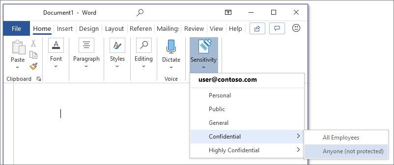

# Información general de etiquetas de confidencialidad

Para realizar su trabajo, las personas de su organización colaboran con otras tanto dentro como fuera de la organización. Esto significa que el contenido ya no se queda detrás de un firewall, sino que puede desplazarse a todas partes, a través de dispositivos, aplicaciones y servicios. Y cuando se desplaza, usted quiere que lo haga de una forma segura y protegida que cumpla con las directivas empresariales y de cumplimiento de normas de su organización.

Con las etiquetas de confidencialidad, puede clasificar y ayudar a proteger los datos de la organización, sin poner impedimentos a la productividad y la capacidad de colaboración de los usuarios.

Ejemplo de etiquetas de confidencialidad:

Las etiquetas de confidencialidad sólo se admiten para los espacios empresariales en la nube global (pública). Actualmente, las etiquetas de compatibilidad no son compatibles con los espacios empresariales de otras nubes, como las[nubes nacionales](https://docs.microsoft.com/azure/active-directory/develop/authentication-national-cloud).

> [!NOTE]
> Las etiquetas de confidencialidad todavía no están disponibles en la Government Community (GCC) de EE. UU.

Para aplicar etiquetas de confidencialidad, los usuarios tienen que haber iniciado sesión en Office con su cuenta profesional o educativa.

Puede usar etiquetas de confidencialidad para:
  
- **Aplicar opciones de protección como encriptación o marcas de agua en el contenido etiquetado.** Por ejemplo, los usuarios pueden aplicar una etiqueta Confidencial a un documento o correo electrónico, y esa etiqueta puede encriptar el contenido y aplicar una marca de agua Confidencial.

- **Proteger el contenido de las aplicaciones de Office en distintos dispositivos y plataformas.** Para obtener una lista de aplicaciones compatibles, vea [Etiquetas de confidencialidad en aplicaciones de Office](sensitivity-labels-office-apps.md).

- **Evitar que el contenido confidencial salga de su organización en dispositivos con Windows ** utilizando Endpoint Protection de Microsoft Intune. Después de aplicar una etiqueta de confidencialidad a un contenido que se encuentra en un dispositivo Windows, Endpoint Protection puede impedir que el contenido se copie en una aplicación de terceros, como Twitter o Gmail, o en un almacenamiento extraíble, como una unidad USB.

- ** Proteger el contenido en los servicios y aplicaciones de terceros ** con Microsoft Cloud App Security Con Cloud App Security, puede detectar, clasificar, etiquetar y proteger el contenido en los servicios y aplicaciones de terceros, como SalesForce, Box o Dropbox, incluso si la aplicación o servicio de terceros no puede leer o no tiene compatibilidad con etiquetas de confidencialidad.

- **Extienda las etiquetas de confidencialidad a los servicios y aplicaciones de terceros.** Con el SDK de la protección de la información de Microsoft, las aplicaciones de terceros pueden leer etiquetas de confidencialidad y aplicar configuraciones de protección.

- **Clasificar contenido sin usar una configuración de protección.** También puede asignar una clasificación al contenido (como un adhesivo) que se adhiera y traslade con el contenido cuando se use y comparta. Puede usar esta clasificación para crear informes de uso y ver los datos de actividad de contenido confidencial. También puede usar esta información para aplicar la configuración de protección más adelante.

En todos estos casos, las etiquetas de confidencialidad de Microsoft 365 pueden ayudarle a realizar las acciones correctas en el contenido adecuado. Con las etiquetas de confidencialidad, puede clasificar los datos en toda la organización, y aplicar la configuración de protección en función de dicha clasificación.

## Qué es una etiqueta de confidencialidad

Cuando asigna una etiqueta de confidencialidad a un documento o correo electrónico, es como un sello que se aplica al contenido que:

- **Es personalizable. ** Puede crear categorías para distintos niveles de contenido confidencial en su organización, como Personal, Público, General, Confidencial y Extremadamente confidencial.

- **Texto no cifrado.** Debido a que la etiqueta se almacena en texto no cifrado en los metadatos del contenido, las aplicaciones y servicios de terceros pueden leerla y luego aplicar sus propias acciones de protección, si es necesario.

- **Persistente.** Después de aplicar una etiqueta de confidencialidad al contenido, la etiqueta se almacena en los metadatos de ese correo electrónico o documento. Esto significa que la etiqueta se desplaza con el contenido, incluyendo la configuración de protección, y estos datos se convierten en la base para aplicar y hacer cumplir las políticas.

En las aplicaciones de Office, una etiqueta de confidencialidad se muestra como una etiqueta para los usuarios en un correo electrónico o documento.

Cada elemento de contenido puede tener una única etiqueta de confidencialidad aplicada. Un elemento puede tener a la vez una única etiqueta de confidencialidad y una única [etiqueta de retención](labels.md) aplicadas.

> [!div class="mx-imgBorder"]
> 

## Qué pueden hacer las etiquetas de confidencialidad

Además del correo electrónico y los documentos, las etiquetas de confidencialidad están disponibles en varias versiones de vista previa pública. Para obtener más información acerca de cómo se pueden usar las etiquetas de confidencialidad para archivos, equipos, grupos y sitios, vea estos artículos:

- [Habilitar etiquetas de confidencialidad para los archivos de Office en SharePoint y OneDrive (vista previa)](sensitivity-labels-sharepoint-onedrive-files.md)

- [Usar etiquetas de confidencialidad con Microsoft Teams, grupos de Office 365 y sitios de SharePoint (versión preliminar pública)](sensitivity-labels-teams-groups-sites.md)

Después de aplicar una etiqueta de confidencialidad a un documento o correo electrónico, cualquier configuración de protección de la etiqueta se aplica en el contenido. Con una etiqueta de confidencialidad, puede:

- **Cifre** solo el correo electrónico o el correo electrónico y los documentos. Puede elegir qué usuarios o grupos tienen permisos para realizar las acciones y durante cuánto tiempo. Por ejemplo, puede elegir permitir que los usuarios de un grupo específico en otra organización tengan permisos para revisar el contenido solo 7 días después de que se haya marcado el contenido. Como alternativa, en lugar de permisos definidos por el administrador, puede permitir a los usuarios asignar permisos al contenido al aplicar la etiqueta. Para obtener más información, vea [Restringir el acceso al contenido mediante el cifrado en las etiquetas de confidencialidad](encryption-sensitivity-labels.md).

- **Marcar el contenido** cuando utilice las aplicaciones de Office, agregando marcas de agua, encabezados o pies de página a correos electrónicos o documentos que tengan aplicada la etiqueta. Las marcas de agua pueden aplicarse a los documentos, pero no al correo electrónico, y tienen un límite de 255 caracteres. Los encabezados y pies de página tienen un límite de 1024 caracteres, excepto en Excel. Excel tiene un límite total de 255 caracteres para encabezados y pies de página, pero este límite incluye caracteres que no son visibles, como códigos de formato. Si se alcanza ese límite, la cadena que escriba no se mostrará en Excel. Para obtener información sobre cuándo se aplican las marcas de contenido, consulte [Cuando Office 365 aplica el marcado y el cifrado de contenido al contenido](sensitivity-labels-office-apps.md#when-office-365-applies-content-marking-and-encryption-to-content).
    
    

- **Evitar la pérdida de datos** activando la opción Endpoint Protection de Intune. Si se descarga contenido confidencial, puede ayudar a evitar la pérdida de datos en los dispositivos Windows. Por ejemplo, no se puede copiar contenido etiquetado en Dropbox, Gmail o en una unidad USB. Antes de que las etiquetas de confidencialidad puedan usar Windows Information Protection (WIP), primero necesita crear una directiva de protección de aplicaciones en el portal de Azure. Para obtener más información, consulte [Cómo Windows Information Protection protege los archivos con una etiqueta de confidencialidad](https://docs.microsoft.com/windows/security/information-protection/windows-information-protection/how-wip-works-with-labels?branch=vsts17546553).

- **Aplicar la etiqueta automáticamente al contenido que contenga información confidencial.** Puede elegir el tipo de información confidencial que desee etiquetar y la etiqueta se puede aplicar automáticamente o, si lo prefiere, puede pedir a los usuarios que apliquen una etiqueta específica. Si recomienda una etiqueta, el aviso muestra el texto que elija. Para obtener más información, vea [Aplicar una etiqueta de contenido sensible automáticamente](apply-sensitivity-label-automatically.md).

    

### Prioridad de etiqueta (el orden importa)

Al crear las etiquetas de confidencialidad en el centro de administración, éstas aparecen en una lista en la pestaña **Confidencialidad** en la página de **Etiquetas**. En esta lista, el orden de las etiquetas es importante, ya que refleja su prioridad. Quiere que la etiqueta de confidencialidad más restrictiva, como la Extremadamente confidencial, aparezca en la **parte inferior** de la lista y la etiqueta de confidencialidad menos restrictiva, como la Pública, aparezca en la **parte superior**.

Puede aplicar una sola etiqueta de confidencialidad a un documento o correo electrónico. Si configura una opción que exige a los usuarios proporcionar una justificación para cambiar una etiqueta a una clasificación inferior, el orden de esta lista identifica las clasificaciones más bajas. Sin embargo, esta opción no se aplica a las subetiquetas.

Aunque, el orden de las subetiquetas se usa en el [ etiquetado automático](apply-sensitivity-label-automatically.md). Cuando configure etiquetas para aplicarlas automáticamente o como recomendación, pueden producirse varias coincidencias para más de una etiqueta. Para determinar la etiqueta que se va a aplicar o recomendar, se usa el orden de las etiquetas: se selecciona la última etiqueta de confidencialidad y, a continuación, si procede, la última subetiqueta.

### Subetiquetas (agrupación de etiquetas)

Con las subetiquetas, puede agrupar una o varias etiquetas bajo una etiqueta principal que el usuario ve en la aplicación de Office. Por ejemplo, en Confidencial, su organización puede usar varias etiquetas distintas para determinados tipos dentro de esa clasificación. En este ejemplo, la etiqueta principal Confidencial es simplemente una etiqueta de texto sin ninguna configuración de protección y, como contiene subetiquetas, no se puede aplicar al contenido. En su lugar, los usuarios deben elegir Confidencial para ver las subetiquetas y, a continuación, pueden elegir una subetiqueta para que se aplique al contenido.

Las subetiquetas son simplemente una forma de presentar etiquetas a los usuarios en grupos lógicos. Las subetiquetas no heredan ninguna configuración de su etiqueta principal. Cuando publique una subetiqueta para un usuario, éste podrá aplicar dicha subetiqueta al contenido, pero no podrá aplicar solo la etiqueta principal.

No elija una etiqueta principal como etiqueta predeterminada ni configure una etiqueta principal para que se aplique automáticamente o se recomiende, ya que la etiqueta principal no se aplicará al contenido de las aplicaciones de Office que usan el cliente de etiquetado unificado de Azure Information Protection.

Ejemplo de cómo se muestran las subetiquetas para los usuarios:

### Modificar o eliminar una etiqueta de confidencialidad

Si elimina una etiqueta de confidencialidad del centro administración, la etiqueta no se quitará automáticamente del contenido, y cualquier configuración de protección se seguirá aplicando al contenido que tenía esa etiqueta aplicada.

Si edita una etiqueta de confidencialidad, la versión de la etiqueta que se aplicó al contenido es la que se aplica a ese contenido.

## Qué pueden hacer las directivas de etiqueta

Después de crear las etiquetas de confidencialidad, debe publicarlas para que estén disponibles para las personas y los servicios de su organización. Las etiquetas de confidencialidad se pueden aplicar a documentos y correos electrónicos. A diferencia de las etiquetas de retención, que se publican en ubicaciones como todos los buzones de Exchange, las etiquetas de confidencialidad se publican para los usuarios o los grupos. Las etiquetas de confidencialidad aparecerán en las aplicaciones de Office para esos usuarios y grupos.

Con una directiva de etiqueta, puede:

- **Elija qué usuarios y grupos ven las etiquetas.** Las etiquetas pueden publicarse para cualquier grupo de seguridad habilitado para correo electrónico, grupo de Office 365 o grupo de distribución dinámico.

- **Aplicar una etiqueta predeterminada** a todos los nuevos documentos y correos electrónicos creados por los usuarios y grupos incluidos en la directiva de etiqueta. Considere utilizar una etiqueta predeterminada para establecer un nivel base de configuración de protección que desee aplicar a todo su contenido. Sin embargo, sin el aprendizaje del usuario y otros controles, esta configuración también puede dar como resultado una etiqueta incorrecta. 

- **Requerir una justificación para cambiar una etiqueta.** Si el contenido está marcado como Confidencial y un usuario intenta quitar esa etiqueta o reemplazarla por una clasificación inferior (por ejemplo, una etiqueta llamada Pública), puede exigir al usuario que proporcione una justificación para realizar esta acción. Actualmente, el motivo de justificación no es enviado a [la etiqueta Analítica](label-analytics.md) para que el administrador pueda revisarla. No obstante, la [cliente de etiquetas unificada de Azure Information Protection](https://docs.microsoft.com/azure/information-protection/rms-client/aip-clientv2) envía esta información a [Azure Information Protection Analytics](https://docs.microsoft.com/azure/information-protection/reports-aip).

    

- **Requerir que los usuarios apliquen una etiqueta al correo electrónico y a los documentos.** También conocido como etiqueta obligatoria, puede solicitar que se aplique una etiqueta para que los usuarios puedan guardar documentos y enviar correos electrónicos. Use esta opción para mejorar la cobertura de la etiqueta. El usuario puede asignar manualmente la etiqueta, automáticamente como resultado de una condición configurada, o bien puede asignarse de forma predeterminada (la opción de etiqueta predeterminada se ha indicado anteriormente). El aviso que se muestra en Outlook cuando se requiere que un usuario asigne una etiqueta:

    
    
    > [!NOTE]
    > Las etiquetas obligatorias requieren una suscripción en Azure Information Protection. Para usar esta característica, debe instalar el [Cliente de etiquetado unificado de Azure Information Protection](https://docs.microsoft.com/azure/information-protection/rms-client/install-unifiedlabelingclient-app). Este cliente solo se ejecuta en Windows, por lo que esta característica aún no se admite en Mac, iOS y Android.

- **Proporcione un vínculo de ayuda a una página de ayuda personalizada.** Si los usuarios no están seguros de lo que significan las etiquetas de confidencialidad o cómo deben usarse, puede proporcionar una URL con más información que aparecerá en la parte inferior del menú **Etiqueta de confidencialidad** en las aplicaciones de Office:

    

Después de crear una directiva de etiqueta que asigne etiquetas de confidencialidad a usuarios y grupos, espere hasta 24 horas para que estos usuarios puedan ver las etiquetas en las aplicaciones de Office.

No hay límite en el número de etiquetas de sensibilidad que puede crear y publicar, con una excepción: si la etiqueta aplica un cifrado, hay un máximo de 500 etiquetas. Sin embargo, como mejor práctica para reducir los gastos generales de administración y reducir la complejidad para sus usuarios, trate de mantener el número de etiquetas al mínimo. Las implementaciones de palabras reales han demostrado que la eficacia se reduce notablemente cuando los usuarios tienen más de cinco etiquetas principales o más de cinco subetiquetas por etiqueta principal.

### Prioridad de etiquetas de directivas (el orden importa)

Para que los usuarios dispongan de sus etiquetas de confidencialidad, puede publicarlas en una directiva de etiqueta de confidencialidad, que se muestra en una lista en la pestaña de **Directivas de confidencialidad** en la página **Directivas de etiqueta**. Al igual que las etiquetas de confidencialidad (consulte [la sección anterior](#label-priority-order-matters) (el orden importa)), el orden de las directivas de etiqueta de confidencialidad es importante, puesto que refleja su prioridad. La directiva de etiqueta de menor prioridad se muestra en la parte **superior**, mientras que la directiva de mayor prioridad se muestra en la parte **inferior**.

Una directiva de etiqueta consiste en lo siguiente:

- Un conjunto de etiquetas.
- El alcance de la directiva de etiqueta, es decir, los usuarios y grupos incluidos en la directiva.
- La configuración de la directiva de etiqueta arriba descrita (etiqueta predeterminada, justificación, etiqueta obligatoria y vínculo de ayuda).

Puede incluir un usuario en varias políticas de etiquetas, y el usuario verá todas las etiquetas de confidencialidad de esas políticas. Sin embargo, el usuario conseguirá las configuraciones de directiva solo de la directiva de etiqueta de mayor prioridad.

Si no ve la configuración de la etiqueta o la configuración de la misma que esperaba para un usuario o un grupo, y ha esperado 24 horas, compruebe el orden de las directivas de etiqueta de sensibilidad. Para cambiar el orden de las directivas de etiqueta, seleccione una directiva de etiqueta de carácter > seleccione los puntos suspensivos a la derecha > **Mover abajo** o **Mover arriba**.

Si usa las etiquetas de retención además de las etiquetas de confidencialidad, es importante que recuerde que la prioridad importa para las directivas de etiquetas de confidencialidad, pero no para las [directivas de etiqueta de retención](labels.md#the-principles-of-retention-or-what-takes-precedence).

## Etiquetas de confidencialidad y Azure Information Protection

Si ha implementado etiquetas con Azure Information Protection, utilice las secciones siguientes para obtener información sobre cómo empezar a usar las etiquetas de confidencialidad.

### Etiquetas de Azure Information Protection

Si utiliza etiquetas de protección de información azul porque su inquilino aún no está en la[ plataforma de etiquetado unificado](https://docs.microsoft.com/azure/information-protection/faqs#how-can-i-determine-if-my-tenant-is-on-the-unified-labeling-platform), le recomendamos que evite crear etiquetas de confidencialidad hasta que active el etiquetado unificado. En este escenario, las etiquetas que se muestran en el Azure Portal son etiquetas de Azure Information Protection en lugar de etiquetas de confidencialidad. Estas etiquetas no se pueden usar en los dispositivos que ejecutan macOS, iOS o Android. Para resolver este problema, [migre estas etiquetas](/azure/information-protection/configure-policy-migrate-labels) a etiquetas de confidencialidad.

Los metadatos aplicados por los dos conjuntos de etiquetas son compatibles, por lo que no es necesario volver a etiquetar documentos y correos electrónicos cuando se haya completado la migración.

### Clientes de Azure Information Protection

Cuando se usan etiquetas de confidencialidad en aplicaciones de Office 365 ProPlus en equipos con Windows, tiene la opción de usar un cliente de Azure Information Protection o usar etiquetas integradas en Office. 

De forma predeterminada, la etiqueta integrada está desactivada en estas aplicaciones cuando el cliente de Azure Information Protection está instalado. Para obtener más información, consulte [Sobre el cliente integrado de etiquetas de Office](sensitivity-labels-office-apps.md#about-the-office-built-in-labeling-client).

Si necesita ayuda para decidir cuál es el cliente de etiquetado que quiere usar, consulte [Elegir el cliente de etiquetado que se usará para los equipos de Windows](https://docs.microsoft.com/azure/information-protection/rms-client/use-client#choose-which-labeling-client-to-use-for-windows-computers) en la documentación de Azure Information Protection.

## Etiquetas de confidencialidad y Microsoft Cloud App Security

Cuando hace uso de Cloud App Security (CAS), puede detectar, clasificar, etiquetar y proteger el contenido en los servicios y aplicaciones de terceros, como por ejemplo SalesForce, Box o Dropbox. 

Cloud App Security funciona con las etiquetas mismas y las de confidencialidad de Azure Information Protection:

- Si los centros de administración de etiquetas tienen las mismas etiquetas que las que se incluyen en el Azure Portal: se usan etiquetas de confidencialidad. Para seleccionar estas etiquetas en Cloud App Security, al menos una etiqueta debe ser [publicada](create-sensitivity-labels.md#publish-sensitivity-labels-by-creating-a-label-policy) para al menos un usuario.

- Si los centros de administración de etiquetas no tienen las mismas etiquetas que en Azure Portal: las etiquetas de confidencialidad no se usan desde los centros de administración de etiquetas y, en su lugar, las etiquetas de Azure Information Protection se recuperan desde el portal de Azure.

Para obtener instrucciones sobre cómo usar Cloud App Security con estas etiquetas, consulte [Aplicar automáticamente las etiquetas de clasificación de Azure Information Protection](https://docs.microsoft.com/cloud-app-security/use-case-information-protection).

## Etiquetas de confidencialidad y el SDK de protección de la información de Microsoft

Como una etiqueta de confidencialidad se almacena como texto no cifrado en los metadatos de un documento, los servicios y aplicaciones de terceros pueden decidir si identificar y proteger el contenido que está marcado con una etiqueta. La compatibilidad con otras aplicaciones y servicios siempre se encuentra en expansión.

Con el [SDK de Microsoft Information Protection](https://docs.microsoft.com/information-protection/develop/overview#microsoft-information-protection-sdk), las aplicaciones y los servicios de terceros pueden leer y aplicar etiquetas de confidencialidad y protección a los documentos en muchas plataformas. Para obtener más información, consulte [el anuncio en el blog de la comunidad tecnológica](https://techcommunity.microsoft.com/t5/Microsoft-Information-Protection/Microsoft-Information-Protection-SDK-Now-Generally-Available/ba-p/263144). 

También puede obtener más información sobre [las soluciones de asociados que se integran con la protección de la información de Microsoft](https://techcommunity.microsoft.com/t5/Azure-Information-Protection/Microsoft-Information-Protection-showcases-integrated-partner/ba-p/262657).

## Empiece a usar las etiquetas de confidencialidad

1. **Creación de las etiquetas.** Cree y asigne un nombre a las etiquetas de confidencialidad en función de la taxonomía de clasificación de su organización para distintos niveles de confidencialidad de contenido. Utilice nombres o términos comunes que tengan sentido para sus usuarios. Si aún no tiene una taxonomía establecida, considere la posibilidad de empezar por nombres de etiqueta como personal, público, general, confidencial y muy confidencial. Puede utilizar subetiquetas para agrupar etiquetas similares por categoría. Cuando se crea una etiqueta, use el texto de información sobre herramientas para ayudar a los usuarios a seleccionar la etiqueta apropiada.

2. **Defina la función de cada etiqueta.** Configure los ajustes de protección que desea asociar a cada etiqueta. Por ejemplo, tal vez desee que el contenido de menor confidencialidad (como una etiqueta "General") pueda simplemente tener un encabezado o pie de página aplicado, mientras que el contenido de mayor confidencialidad (como una etiqueta "Confidencial") debiera tener una marca de agua, encriptación y protección de los puntos de conexión.

3. **Publique las etiquetas.** Una vez configuradas las etiquetas de sensibilidad, publíquelas mediante una directiva de etiqueta. Decida qué usuarios y grupos deben tener las etiquetas y qué configuración de directiva usar. Una sola etiqueta es reutilizable: se define una vez y, después, se puede incluir en varias directivas de etiquetas asignadas a diferentes usuarios. Por ejemplo, puede crear una prueba de las etiquetas de confidencialidad asignando una directiva de etiqueta a solo algunos usuarios. Cuando esté listo para implementar las etiquetas en la organización, puede crear una nueva directiva para sus etiquetas y, esta vez, especificar todos los usuarios.

Pasos básicos de lo que llevan a cabo el administrador, el usuario, y las aplicaciones y los servicios de Office para hacer funcionar las etiquetas de confidencialidad:

Ya está listo para [crear y configurar etiquetas de confidencialidad y sus directivas](create-sensitivity-labels.md). 

Para obtener más información sobre el uso de etiquetas de confidencialidad para las aplicaciones de Office, consulte [Etiquetas de confidencialidad en aplicaciones de Office](sensitivity-labels-office-apps.md).