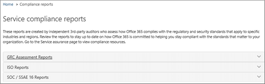

# Garantía del servicio en el Centro de seguridad y cumplimiento

Use la garantía de servicio en el Centro de seguridad & cumplimiento para obtener acceso a documentos que describen una variedad de temas, incluidos: 
  
- Prácticas de seguridad de Microsoft para los datos de clientes que se almacenan en Office 365. 
    
- Informes de auditoría de terceros independientes de Office 365. 
    
- Detalles de implementación y pruebas para los controles de seguridad, privacidad y cumplimiento que Office 365 usa para proteger los datos. 
    
También puede averiguar cómo Office 365 puede ayudar a los clientes a cumplir con estándares, leyes y normativas en todos los sectores, como:
  
-  Organización internacional para la normalización (ISO) 27001 y 27018 
    
- Health Insurance Portability and Accountability Act of 1996 (HIPAA) (Ley de Responsabilidad y Transferibilidad del Seguro Médico de 1996, HIPAA)
    
- Programa Federal de Administración de Autorizaciones y Riesgo (FedRAMP)
    
## ¿Quién puede obtener acceso a la garantía de servicio de Office 365 y cómo?

 **Los nuevos clientes y** los clientes que evalúan los servicios en línea de Microsoft pueden acceder a la garantía de servicio que se incluye con los planes de Office 365 Enterprise E3 y E5 (suscripciones de prueba y de pago). Si no tiene uno de estos planes y desea probar la garantía de servicio, puede registrarse para una versión de prueba [de Office 365 Enterprise E5](https://go.microsoft.com/fwlink/p/?LinkID=698279).
  
 Los miembros de la suscripción de **O365** pueden tener acceso de forma predeterminada a la sección Garantía de servicios en el Centro de protección de Office 365. Service assurance proporciona informes y documentos que describen las prácticas de seguridad de Microsoft para los datos de clientes almacenados en Office 365. También proporciona informes de auditoría de terceros independientes en Office 365.
 
## Elegir la configuración regional y del sector

Cuando accede a La garantía de servicio por primera vez, el primer paso consiste en configurar la configuración regional y del sector. Puede cambiar esta configuración en cualquier momento. La configuración de estas opciones permite a Service assurance proporcionarle contenido que sea más relevante para su organización. Para configurar la industria y la región:
  
1. Después de tener acceso a Garantía de servicio, **selecciona** Configuración y la página Configuración de región e industria se muestra como se muestra en la siguiente captura de pantalla. 
    
    
  
2. En la **página Configuración,** seleccione la flecha abajo junto a **Región** y compruebe las regiones adecuadas para su organización. 
    
3. Seleccione la flecha abajo junto a **Industria** y compruebe los sectores adecuados para su organización. 
    
4. Una vez que haya seleccionado regiones e industrias, seleccione **Guardar**.
    
## Buscar, revisar y descargar contenido de cumplimiento y confianza

Para revisar y descargar contenido, seleccione una opción en el panel de navegación:
  
- **Informes de cumplimiento** para ver auditorías y evaluaciones independientes de Office 365 y otros servicios en la nube de Microsoft, como se muestra en la siguiente captura de pantalla. 
    
    
  
- **Confíe en los** documentos para ver información sobre cómo Microsoft opera Office 365, como se muestra en la siguiente captura de pantalla. 
    
    
  
- **Controles auditados para** ver información sobre cómo los controles de Office 365 cumplen los requisitos de seguridad, cumplimiento y privacidad, como se muestra en la siguiente captura de pantalla. 
    
    
  
Seleccione el informe que desea descargar y seleccione **Guardar** para descargarlo en el equipo. Para controles auditados, seleccione el informe que desee y, a continuación, **seleccione Descargar**. En la tabla siguiente se describen los informes que puede encontrar en cada página de garantía de servicio. 
  
> [!NOTE]
> Los informes y documentos de garantía de servicio están disponibles para su descarga durante al menos doce meses después de la publicación o hasta que esté disponible una nueva versión del documento. 
  
|**Página de garantía de servicio**|**Contenido disponible**|**Descripción**|
|:-----|:-----|:-----|
|Informes de cumplimiento    | FedRamp     Evaluación de GRC     ISO     SOC/SSAE    |Use informes de cumplimiento de servicios para revisar las evaluaciones de auditoría realizadas por auditores independientes de terceros de las operaciones de entrega de servicios de Office 365.    |
|Documentos de confianza    | Preguntas frecuentes y white papers     Informes de administración de riesgos    |Use white papers, PREGUNTAS frecuentes, informes de fin de año y otros recursos confidenciales de Microsoft que estén disponibles en virtud del contrato de no divulgación para sus evaluaciones de revisión y riesgo.    |
|Controles auditados    |Estándares y normativas globales que Office 365 ha implementado.    | Ayuda con la evaluación de riesgos al evaluar, incorporar o usar servicios de Office 365. Descúbrelo:     - Cómo los controles de Office 365 cumplen los requisitos de seguridad, cumplimiento y privacidad.   - Acerca de las pruebas de controles en Office 365, los resultados de estas pruebas y cuándo se completaron.    |
   
Según la configuración específica, las opciones incluidas en la vista pueden tener algunas diferencias.
    
## Obtener ayuda con la garantía de servicio

[Contactar con el soporte técnico para productos empresariales: ayuda para administradores](../admin/contact-support-for-business-products.md)
  
## Preguntas más frecuentes

 **¿Por qué se produce un error que dice que los documentos de la garantía de servicio están dañados?**
  
La mayoría de los documentos de garantía de servicio están en formato PDF. Elija **Guardar** para guardar estos archivos en el equipo local y, a continuación, abrirlos desde el equipo local.