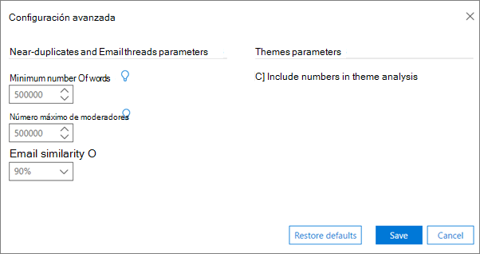

# Establecer la configuración avanzada de ANALYZE en eDiscovery avanzadoSet Analyze advanced settings in Advanced eDiscovery

> [!NOTE]
> Para usar eDiscovery avanzado, su organización necesita una suscripción de Office 365 E3 con el complemento Cumplimiento avanzado, o bien una suscripción de E5. Si no tiene ese plan y quiere probar eDiscovery avanzado, puede [registrarse para una prueba de Office 365 Enterprise E5](https://go.microsoft.com/fwlink/p/?LinkID=698279).Advanced eDiscovery requires an Office 365 E3 with the Advanced Compliance add-on or an E5 subscription for your organization. If you don't have that plan and want to try Advanced eDiscovery, you can [sign up for a trial of Office 365 Enterprise E5](https://go.microsoft.com/fwlink/p/?LinkID=698279). 
  
EDiscovery avanzado proporciona parámetros avanzados predeterminados para la configuración del módulo de análisis.Advanced eDiscovery provides default advanced parameters for Analyze module settings. En el procedimiento siguiente se describe la configuración que se puede especificar.The following procedure describes settings that can be specified.
  
1. En la **ficha \> preparar \> la configuración de ANALYZE** , haga clic en **Configuración avanzada** (en la parte inferior de la página).In the **Prepare \> Analyze \> Setup** tab, click **Advanced settings** (at the bottom of the page). Se muestra el siguiente panel.The following panel is displayed. 
    
    
  
2. En **parámetros casi duplicados y de subprocesos de correo electrónico**, seleccione valores para las siguientes opciones, según sea necesario:In **Near-duplicates and Email threads parameters**, select values for the following as necessary:
    
  - **Número mínimo de palabras**: número mínimo de palabras, por debajo del cual no se envía un archivo para análisis casi duplicados.**Minimum number of words**: Minimum number for words, below which a file is not submitted for Near-duplicate analysis. 
    
  - **Número máximo de palabras**: número máximo de palabras, por encima de las cuales no se envía un archivo para análisis casi duplicados.**Maximum number of words**: Maximum number for words, above which a file is not submitted for Near-duplicate analysis.
    
  - **Similitud de correo electrónico**: el nivel mínimo de semejanza de dos correos electrónicos se considerará similar.**Email similarity**: Minimal level of resemblance for two emails to be considered similar. El valor es siempre igual a o mayor que el de la similitud del documento.Value is always equal to, or larger than document similarity. El valor predeterminado es 90%.Default is 90%.
    
3. En **los parámetros de los temas**, active la casilla **incluir números en el análisis del tema** para incluir números en el procesamiento de temas durante el análisis.In **Themes parameters**, select the **Include numbers in theme analysis** check box to include numbers in the processing of Themes during Analyze. 
    
4. Haga clic en **Guardar**.Click **Save**. 
    
## Vea tambiénSee also

[Advanced eDiscovery (clásico)Advanced eDiscovery (classic)](office-365-advanced-ediscovery.md)
  
[Descripción de la similitud de documentosUnderstanding document similarity](understand-document-similarity-in-advanced-ediscovery.md)
  
[Configuración de las opciones de análisisSetting Analyze options](set-analyze-options-in-advanced-ediscovery.md)
  
[Configuración de omitir textoSetting ignore text](set-ignore-text-in-advanced-ediscovery.md)
  
[Visualización de los resultados del análisisViewing Analyze results](view-analyze-results-in-advanced-ediscovery.md)

