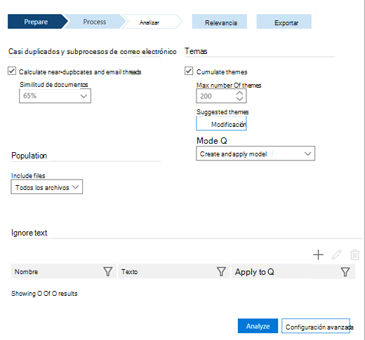
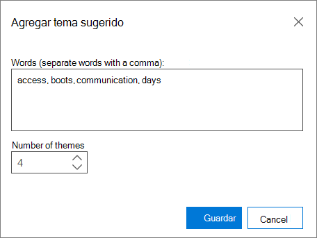

# Establecer las opciones de análisis en la exhibición avanzada de documentos electrónicos (Classic)

> [!NOTE]
> Advanced eDiscovery requires an Office 365 E3 with the Advanced Compliance add-on or an E5 subscription for your organization. If you don't have that plan and want to try Advanced eDiscovery, you can [sign up for a trial of Office 365 Enterprise E5](https://go.microsoft.com/fwlink/p/?LinkID=698279). 
  
En la exhibición avanzada de documentos electrónicos, establezca las opciones de análisis antes de ejecutar Analyze.
  
## Establecer opciones de análisis

Abra **preparar \> ** la \> **instalación**de Analyze. Se muestra la siguiente ventana.
  

  
 **Casi duplicados y subprocesos de correo electrónico** Active esta casilla si desea ejecutar el análisis. Está seleccionada de forma predeterminada. 
  
 **Similitud de documentos** Especifique el valor de umbral Near-Duplicates o acepte el valor predeterminado de 65%. 
  
 **Temas** Active esta casilla para procesar todos los archivos y asignarles temas. De forma predeterminada, esta casilla de verificación no está activada. Especifique las siguientes opciones si desea realizar el procesamiento de temas.
  
- **Número máximo de temas** Escriba o seleccione un valor para el número de temas que se va a crear. El valor predeterminado es 200. 
    
    > [!NOTE]
    > El aumento del número de temas afecta al rendimiento, así como la capacidad de un tema de generalizar. Cuanto mayor sea el número de temas, más granular serán. Por ejemplo, si un conjunto de 50 temas incluye un tema como "baloncesto, podas, Clippers, Lagoros"; 300 temas pueden incluir temas separados: "", "," podadoras "," lago ". Si no ha tenido conocimiento del tema "baloncesto" y usa esta característica para ECA, puede resultar útil ver el tema "baloncesto". Sin embargo, si el procesamiento tenía demasiados temas, es posible que nunca vea la palabra "baloncesto" y que no sepa que las pausas y las Clippers son buenos temas de baloncesto que revisar, en lugar de que se inician y se usan para el pelo. 
  
- **Temas sugeridos** Puede sugerir palabras del tema para controlar el procesamiento de temas. EDiscovery avanzado se centrará en estas palabras sugeridas y intentará crear uno o más temas relevantes, en función de la configuración del "número máximo de temas". 
    
    Por ejemplo, si la palabra sugerida es "equipo" y ha especificado "2" como "número máximo de temas", la exhibición avanzada de documentos electrónicos intentará generar dos temas relacionados con la palabra "equipo". Por ejemplo, los dos temas podrían ser "software de equipo" y "hardware de equipo". 
    
    
  
1. Para ver, agregar o editar los temas sugeridos, haga clic en **modificar**.
    
2. En el panel **temas sugeridos** , haga clic en el icono **Agregar**  para agregar un tema. En el panel **Agregar tema sugerido** , agregue las palabras separadas por comas. 
    
3. En **número de temas**, seleccione un valor para determinar el número de temas que la exhibición avanzada de documentos electrónicos intentará generar para estas palabras (el valor predeterminado es 1 tema).
    
4. Haga clic en **Guardar** y, a continuación, cierre el cuadro de diálogo. 
    
    > [!NOTE]
    > El número total de temas incluye temas sugeridos. El total de temas sugeridos no puede exceder el total de los temas. Si hay muchos temas sugeridos en relación con el total de los temas, el sistema detectará solo unos pocos temas "nuevos", ya que la mayoría de los temas se dedicará a temas sugeridos. 
  
- **Modo** En la lista desplegable, seleccione una opción de **temas** : 
    
  - **Crear y aplicar modelo**: calcula los temas por modelos de un segmento de los archivos y, a continuación, distribuye los archivos entre ellos.
    
  - **Create Model**: calcula un modelo de temas a partir de un segmento de los archivos. El proceso de aplicar divisiones de archivos se realiza por separado en otro momento.
    
  - **Aplicar modelo**: esta opción solo se muestra si un modelo se ha creado anteriormente y todavía no se ha aplicado. Se dividirán los archivos según los temas.
    
También puede [establecer omitir texto](set-ignore-text-in-advanced-ediscovery.md) y [establecer la configuración avanzada de análisis](set-analyze-advanced-settings-in-advanced-ediscovery.md) para analizar. 
  
Una vez establecidas estas opciones, haga clic en **analizar** para ejecutar. Se muestran [los resultados de la vista analizar](view-analyze-results-in-advanced-ediscovery.md) . 
  
## Temas relacionados

[Advanced eDiscovery (clásico)](office-365-advanced-ediscovery.md)
  
[Descripción de la similitud de documentos](understand-document-similarity-in-advanced-ediscovery.md)
  
[Establecer omitir texto](set-ignore-text-in-advanced-ediscovery.md)
  
[Establecer la configuración avanzada del análisis](set-analyze-advanced-settings-in-advanced-ediscovery.md)
  
[Ver los resultados del análisis](view-analyze-results-in-advanced-ediscovery.md)

