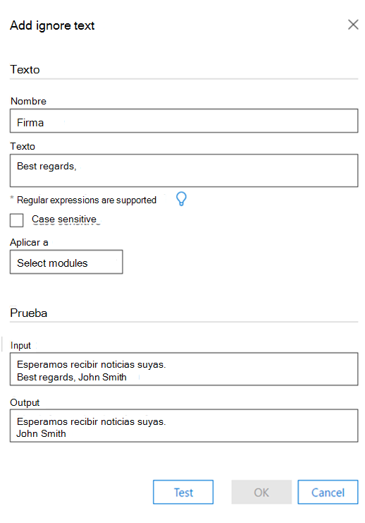
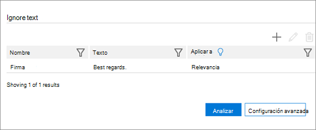

# Establecer la opción omitir texto para analizar en eDiscovery avanzado (Classic)

> [!NOTE]
> Advanced eDiscovery requires an Office 365 E3 with the Advanced Compliance add-on or an E5 subscription for your organization. If you don't have that plan and want to try Advanced eDiscovery, you can [sign up for a trial of Office 365 Enterprise E5](https://go.microsoft.com/fwlink/p/?LinkID=698279). 
  
La característica omitir texto se puede aplicar a todos los módulos avanzados de eDiscovery (o a cualquiera de ellos): analizar (casi duplicados, subprocesos de correo electrónico, temas) y relevancia. El texto omitido no aparecerá en los archivos que se muestren en relevancia y el análisis o cálculos descartará el texto omitido.
  
Si la característica de omitir texto se ha definido previamente para los módulos que ya se han ejecutado, la configuración de omitir texto ahora estará protegida contra modificaciones. Sin embargo, la característica de omisión de texto para el módulo de relevancia todavía puede cambiarse en cualquier momento.
  
## Cómo omitir los filtros de texto que se aplican

Se aplican varios filtros de omitir texto en el orden en que se especificaron. Para cambiar el orden en el que se aplican, se deben eliminar y volver a especificar en el orden deseado.
  
Por ejemplo, si el contenido de texto es: "DAVE BOB ALICE CAROL Eva", a continuación se muestran ejemplos de omitir las entradas de texto y los resultados:
  
||||
|:-----|:-----|:-----|
|**Omitir entradas de texto**   |**==\>**   |**Resultados**   |
|"ALICIA", "BOB CAROL"    |==\>    |"DAVE EVA"    |
|"ALICIA", "BOB ALICE CAROL"    |==\>    |"EVA BOB CAROL EVA"    |
   
La segunda omisión de la entrada de texto no se implementa porque no se encuentra la cadena como tal después de que se haya aplicado el primer texto ignore.
  
## Usar expresiones regulares al definir omitir texto

Las expresiones regulares se pueden usar al definir omitir texto. A continuación, se muestran ejemplos de sintaxis y uso de expresiones regulares:
  
- Para quitar (omitir) el texto desde el principio hasta el final de una línea:
    
     `Begin(.*)$`
    
    donde "begin" es la ocurrencia inicial de esta cadena en la línea.
    
    Por ejemplo, para el siguiente texto:
    
    **"Es la primera oración y primera línea**
    
    **Es la segunda oración y segunda línea "**
    
    primero la expresión regular (. \* ) $ dará como resultado:
    
    **"Esto es**
    
    **Es la segunda oración y segunda línea "**
    
- Para quitar avisos de declinación de responsabilidad e instrucciones legales insertadas automáticamente al final de los subprocesos de correo electrónico:
    
     `Begin(.|\s)*End`
    
    donde "begin" y "End" son cadenas únicas al principio y al final de un párrafo de texto ajustado. 
    
    Por ejemplo, la siguiente expresión regular quitará los avisos de declinación de responsabilidad y las instrucciones legales que estaban en el hilo de correo electrónico entre las cadenas de inicio y finalización:
    
    **Este mensaje contiene información confidencial (. | \s) \* si se requiere la comprobación, solicite una copia impresa de la versión**
    
- Para quitar un aviso de declinación de responsabilidades (incluidos los caracteres especiales): 
    
    Por ejemplo, para el texto siguiente (con la declinación de responsabilidades representada aquí por x): 
    
    **/\*\ Este mensaje contiene información confidencial. XXXX XXXX**
    
    **XXXX XXXX XXXX XXXX XXXX XXXX XXXX**
    
    **XXXX XXXX si es necesario realizar una comprobación, solicite una copia impresa de la versión. /\*\**
    
    la expresión regular para quitar el aviso de declinación de responsabilidades anterior debería ser: 
    
    **\/\\*\\Este mensaje contiene información confidencial \. (. | \s) \* si se requiere la comprobación, solicite una copia impresa de la versión \.\/\\*\\**
    
- Reglas de expresiones regulares:
    
  - Los caracteres que no forman parte del alfabeto excepto los espacios, "_" y "-" deben ir precedidos de " \" .
    
  - El campo eExpression normal puede tener una longitud ilimitada.
    
> [!TIP]
> Para obtener una explicación y una sintaxis detallada de las expresiones regulares, vea: [referencia rápida del lenguaje de expresiones regulares](https://msdn.microsoft.com/library/az24scfc%28v=vs.110%29.aspx). 
  
## Definir la regla de omisión de texto

1. En la sección **omitir texto** de la pestaña **administrar \> \> Opciones** de análisis, haga clic en el **+** icono para agregar una regla. 
    
2. En el cuadro de diálogo **Agregar y omitir texto** , en el campo **nombre** , escriba un nombre para la regla de omitir texto. 
    
    
  
3. En el cuadro de **texto** , escriba el texto que se va a omitir. El campo de texto permite un número de caracteres ilimitado. 
    
    > [!TIP]
    > Como se muestra en la ventana anterior, haga clic en **bombilla** para ver instrucciones de sintaxis comunes para la regla de omitir texto. 
  
4. Active la casilla de verificación **distinguir mayúsculas de minúsculas** , si lo desea. 
    
5. En la lista **aplicar a** , seleccione los módulos avanzados de eDiscovery en los que desea aplicar la definición. 
    
6. Si desea una ejecución de prueba en texto de ejemplo, escriba ejemplo de texto en el cuadro de texto de **entrada** y haga clic en **prueba**. Los resultados se muestran en el cuadro de texto de **salida** . 
    
7. Haga clic en **Aceptar** para guardar la regla de omisión de texto. Se muestra la regla definida por omitir texto. 
    
    
  
## Vea también

[Advanced eDiscovery (clásico)](office-365-advanced-ediscovery.md)
  
[Descripción de la similitud de documentos](understand-document-similarity-in-advanced-ediscovery.md)
  
[Configuración de las opciones de análisis](set-analyze-options-in-advanced-ediscovery.md)
  
[Configuración de la configuración avanzada de análisis](set-analyze-advanced-settings-in-advanced-ediscovery.md)
  
[Visualización de los resultados del análisis](view-analyze-results-in-advanced-ediscovery.md)

