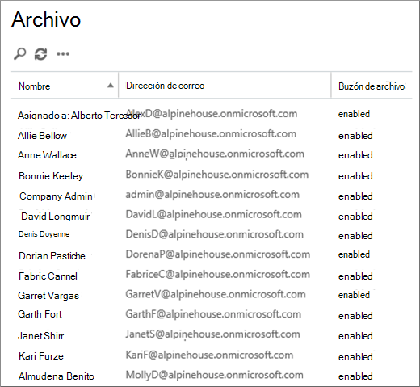
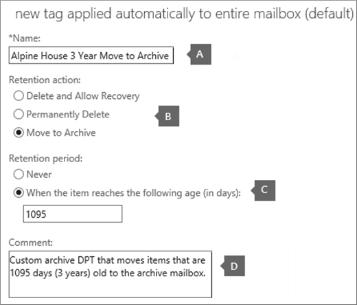
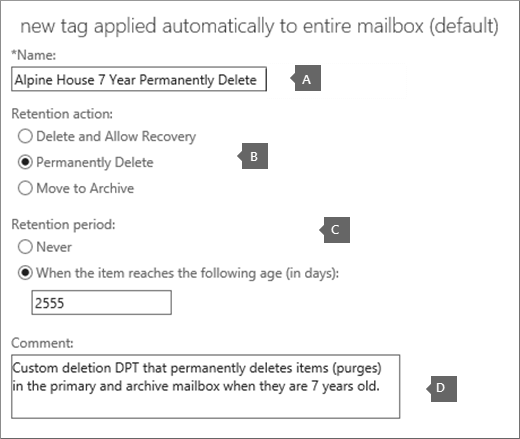
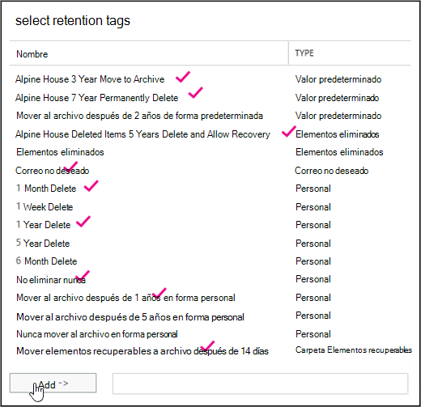
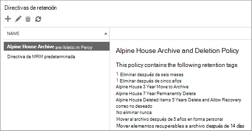

# <a name="set-up-an-archive-and-deletion-policy-for-mailboxes-in-your-organization"></a>Configurar una directiva de archivo y eliminación de buzones en la organización

En Microsoft 365, los administradores pueden crear una directiva de archivado y eliminación que mueva automáticamente los elementos al buzón de archivo de un usuario y elimine automáticamente los elementos del buzón. Para ello, el administrador crea una directiva de retención que se asigna a los buzones de correo y mueve los elementos al buzón de archivo de un usuario después de un período de tiempo determinado y que también elimina los elementos del buzón después de alcanzar un determinado límite de antigüedad. Las reglas reales que determinan los elementos que se mueven o eliminan y cuando esto sucede se denominan etiquetas de retención. Las etiquetas de retención están vinculadas a una directiva de retención que, a su vez, se asigna al buzón de un usuario. Una etiqueta de retención aplica la configuración de retención a mensajes y carpetas individuales en el buzón de un usuario. Define cuánto tiempo permanece un mensaje en el buzón y qué acción se toma cuando el mensaje alcanza la antigüedad de retención especificada. Cuando un mensaje alcanza su antigüedad de retención, se mueve al buzón de archivo del usuario o se elimina.
  
Los pasos de este artículo configurarán una directiva de archivado y retención para una organización ficticia llamada Alpine House. La configuración de esta directiva incluye las siguientes tareas:
  
- Habilitar un buzón de archivo para cada usuario de la organización. Esto proporciona a los usuarios más almacenamiento de buzones de correo y es necesario para que una directiva de retención pueda mover elementos al buzón de archivo. También permite al usuario almacenar información de archivado moviendo elementos a su buzón de archivo.

- Crear tres etiquetas de retención personalizadas que hagan lo siguiente:

  - Mueve automáticamente los elementos que tienen 3 años de antigüedad al buzón de archivo del usuario. Mover elementos al buzón de archivo libera espacio en el buzón principal de un usuario.

  - Elimina automáticamente los elementos que tienen 5 años de antigüedad de la carpeta Elementos eliminados. Esto también libera espacio en el buzón principal del usuario. Los usuarios tendrán la oportunidad de recuperar estos elementos si es necesario. Vea la nota al pie en [la sección Más información](#more-information) para obtener más información. 

  - Elimina automáticamente (y de forma permanente) los elementos que tienen 7 años tanto del buzón principal como del buzón de archivo. Debido a las normativas de cumplimiento normativo, algunas organizaciones deben conservar el correo electrónico durante un período de tiempo determinado. Después de que expire este período de tiempo, es posible que una organización desee quitar permanentemente estos elementos buzones de usuario.

- Crear una nueva directiva de retención y agregarle las nuevas etiquetas de retención personalizadas. Además, también agregará etiquetas de retención integradas a la nueva directiva de retención. Esto incluye etiquetas personales que los usuarios pueden asignar a los elementos de su buzón. También agregará una etiqueta de retención que mueva elementos de la carpeta Elementos recuperables del buzón principal del usuario a la carpeta Elementos recuperables de su buzón de archivo. Esto ayuda a liberar espacio en la carpeta Elementos recuperables de un usuario cuando su buzón se coloca en retención.

Puede seguir algunos o todos los pasos de este artículo para configurar una directiva de archivo y eliminación para los buzones de su propia organización. Se recomienda probar este proceso en algunos buzones antes de implementarlo en todos los buzones de la organización.
  
## <a name="before-you-set-up-an-archive-and-deletion-policy"></a>Antes de configurar una directiva de archivo y eliminación

- Debe ser administrador global de su organización para realizar los pasos de este tema. 

- Al crear una nueva cuenta de usuario y asignar al usuario una licencia de Exchange Online, se crea automáticamente un buzón para el usuario. Cuando se crea el buzón, se le asigna automáticamente una directiva de retención predeterminada, denominada Directiva de MRM predeterminada. En este artículo, creará una nueva directiva de retención y, a continuación, la asignará a los buzones de usuario, reemplazando la directiva de MRM predeterminada. Un buzón solo puede tener una directiva de retención asignada al mismo tiempo.

- Para obtener más información sobre las etiquetas de retención y las directivas de retención en Exchange Online, consulte Etiquetas de [retención y directivas de retención.](https://go.microsoft.com/fwlink/p/?LinkId=404424)

## <a name="step-1-enable-archive-mailboxes-for-users"></a>Paso 1: Habilitar buzones de archivo para los usuarios

El primer paso es habilitar el buzón de archivo para cada usuario de la organización. El buzón de archivo de un usuario debe estar habilitado para que una etiqueta de retención con una acción de retención "Mover a archivo" pueda mover el elemento después de que expire la antigüedad de retención.
  
> [!NOTE]
> Puede habilitar los buzones de archivo en cualquier momento durante este proceso, siempre que se habiliten en algún momento antes de completar el proceso. Si un buzón de archivo no está habilitado, no se hace ninguna acción en los elementos que tengan asignada una directiva de archivo o eliminación.
  
1. Vaya a [https://protection.office.com](https://protection.office.com).

2. Inicie sesión con su cuenta de administrador global.
    
3. En el Centro de & cumplimiento, vaya a **Archivo de gobierno de** la \> **información.**

    Se muestra una lista de los buzones de la organización y si el buzón de archivo correspondiente está habilitado o deshabilitado.

4. Seleccione todos los buzones haciendo clic en el primero de la lista, manteniendo presionada la tecla **Mayús** y, a continuación, haciendo clic en el último de la lista.

    > [!TIP]
    > En este paso se supone que no hay buzones de archivo habilitados. Si tiene algún buzón con el archivo habilitado, mantenga presionada la tecla **Ctrl** y haga clic en cada buzón que tenga un buzón de archivo deshabilitado. También puede hacer  clic en el encabezado de columna de buzón de archivo para ordenar las filas en función de si el buzón de archivo está habilitado o deshabilitado para que sea más fácil seleccionar buzones.
  
5. En el panel de detalles, en **Edición masiva,** haga clic **en Habilitar.**

    Se muestra una advertencia que dice que los elementos de más de dos años se trasladarán al nuevo buzón de archivo. Esto se debe a que la directiva de retención predeterminada que se asigna a un nuevo buzón de usuario cuando se crea tiene una etiqueta de directiva predeterminada de archivo que tiene una antigüedad de retención de 2 años. La etiqueta de directiva predeterminada de archivo personalizado que creará en el paso 2 tiene una antigüedad de retención de 3 años. Esto significa que los elementos que tienen 3 años o más se trasladarán al buzón de archivo.

6. Haga **clic en Sí** para cerrar el mensaje de advertencia e iniciar el proceso para habilitar el buzón de archivo para cada buzón seleccionado.

7. Una vez completado el proceso, haga clic en **Actualizar**  **página** Archivo.

    El buzón de archivo está habilitado para todos los usuarios de la organización.

    

## <a name="step-2-create-new-retention-tags-for-the-archive-and-deletion-policies"></a>Paso 2: Crear nuevas etiquetas de retención para las directivas de archivo y eliminación

En este paso, creará las tres etiquetas de retención personalizadas que se han descrito anteriormente.
  
- Mover a archivo de la Casa Almeida 3 años (directiva de archivo personalizada)

- Eliminación permanente de 7 años de la Casa Al alpine (directiva de eliminación personalizada)

- Elementos eliminados de Alpine House 5 años Eliminar y permitir recuperación (etiqueta personalizada para la carpeta Elementos eliminados)

Para crear nuevas etiquetas de retención, usará el Centro de administración de Exchange (EAC) en su organización de Exchange Online. Asegúrese de usar la versión clásica del EAC.
  
1. Vaya e [https://admin.protection.outlook.com/ecp/](https://admin.protection.outlook.com/ecp/) inicie sesión con sus credenciales.
  
2. En el EAC, vaya a **Etiquetas de** retención de administración  >  **de cumplimiento**

    Se muestra una lista de las etiquetas de retención de su organización.

### <a name="create-a-custom-archive-default-policy-tag"></a>Crear una etiqueta de directiva predeterminada de archivo personalizado
  
En primer lugar, creará una etiqueta de directiva predeterminada de archivo (DPT) personalizada que moverá elementos al buzón de archivo después de 3 años.
  
1. En la **página Etiquetas de** retención, **haga** clic en Nuevo icono de etiqueta nuevo y, a continuación, seleccione aplicado automáticamente a todo el  **(predeterminado).**

2. En la **etiqueta Nueva aplicada automáticamente a toda la** página de buzón (predeterminado), complete los siguientes campos: 

    
  
   1. **Nombre** Escriba un nombre para la nueva etiqueta de retención. 

   2. **Acción de retención** Seleccione **Mover a archivo para** mover elementos al buzón de archivo cuando expire el período de retención.

   3. **Período de retención** Seleccione **Cuando el elemento alcance la siguiente antigüedad (en días)** y, a continuación, escriba la duración del período de retención. Para este escenario, los elementos se mueven al buzón de archivo después de 1095 días (3 años).

   4. **Comentario** (opcional) Escriba un comentario que explique el propósito de la etiqueta de retención personalizada.

3. Haga **clic en** Guardar para crear el archivo personalizado DPT.

    La nueva DPT de archivo se muestra en la lista de etiquetas de retención.

### <a name="create-a-custom-deletion-default-policy-tag"></a>Crear una etiqueta de directiva predeterminada de eliminación personalizada
  
A continuación, creará otra DPT personalizada, pero esta será una directiva de eliminación que elimina permanentemente los elementos después de 7 años.
  
1. En la **página Etiquetas de** retención, **haga** clic en Nuevo icono de etiqueta nuevo y, a continuación, seleccione aplicado automáticamente a todo el  **(predeterminado).**

2. En la **etiqueta Nueva aplicada automáticamente a toda la** página de buzón (predeterminado), complete los siguientes campos: 

    
  
   1. **Nombre** Escriba un nombre para la nueva etiqueta de retención. 

   2. **Acción de retención** Seleccione **Eliminar permanentemente para** purgar elementos del buzón cuando expire el período de retención.

   3. **Período de retención** Seleccione **Cuando el elemento alcance la siguiente antigüedad (en días)** y, a continuación, escriba la duración del período de retención. Para este escenario, los elementos se purgarán después de 2555 días (7 años).

   4. **Comentario** (opcional) Escriba un comentario que explique el propósito de la etiqueta de retención personalizada. 

3. Haga **clic en** Guardar para crear la DPT de eliminación personalizada. 

    La nueva DPT de eliminación se muestra en la lista de etiquetas de retención.

### <a name="create-a-custom-retention-policy-tag-for-the-deleted-items-folder"></a>Crear una etiqueta de directiva de retención personalizada para la carpeta Elementos eliminados
  
La última etiqueta de retención que creará es una etiqueta de directiva de retención personalizada (RPT) para la carpeta Elementos eliminados. Esta etiqueta eliminará los elementos de la carpeta Elementos eliminados después de 5 años y proporciona un período de recuperación en el que los usuarios pueden usar la herramienta Recuperar elementos eliminados para recuperar un elemento.
  
1. En la **página Etiquetas de** retención, haga clic en Nuevo icono **de** etiqueta nuevo y, a continuación, seleccione aplicada automáticamente a una  **predeterminada.**

2. En la **etiqueta Nueva aplicada automáticamente a una página de carpeta** predeterminada, complete los siguientes campos:

    
  
   1. **Nombre** Escriba un nombre para la nueva etiqueta de retención. 

   2. **Aplicar esta etiqueta a la siguiente carpeta predeterminada** En la lista desplegable, seleccione **Elementos eliminados.**

   3. **Acción de retención** Seleccione Eliminar y **permitir** recuperación para eliminar elementos cuando expire el período de retención, pero permita a los usuarios recuperar un elemento eliminado dentro del período de retención de elementos eliminados (que de forma predeterminada es de 14 días).

   4. **Período de retención** Seleccione **Cuando el elemento alcance la siguiente antigüedad (en días)** y, a continuación, escriba la duración del período de retención. Para este escenario, los elementos se eliminarán después de 1825 días (5 años).

   5. **Comentario** (opcional) Escriba un comentario que explique el propósito de la etiqueta de retención personalizada. 

3. Haga **clic en** Guardar para crear la RPT personalizada para la carpeta Elementos eliminados.

    La nueva RPT se muestra en la lista de etiquetas de retención.

## <a name="step-3-create-a-new-retention-policy"></a>Paso 3: Crear una nueva directiva de retención

Después de crear las etiquetas de retención personalizadas, el siguiente paso es crear una nueva directiva de retención y agregar las etiquetas de retención. Agregará las tres etiquetas de retención personalizadas que creó en el paso 2 y las etiquetas integradas que se mencionaron en la primera sección. En el paso 4, asignará esta nueva directiva de retención a los buzones de usuario.
  
1. En el EAC, vaya a Directivas **de retención de administración de**  >  **cumplimiento.**

2. En la página **Directivas de** retención, haga clic **en Nuevo** icono  nuevo.

3. En el **cuadro** Nombre, escriba un nombre para la nueva directiva de retención; por ejemplo, archivo y directiva de **eliminación de la casa al** alpine .

4. En **Etiquetas de retención,** haga **clic en el** icono Agregar nuevo  .

    Se muestra una lista de las etiquetas de retención de la organización. Tenga en cuenta que se muestran las etiquetas personalizadas que creó en el paso 2.

5. Agregue las 9 etiquetas de retención que se resaltan en la siguiente captura de pantalla (estas etiquetas se describen con más detalle en la [sección Más](#more-information) información). Para agregar una etiqueta de retención, selecciónelo y, a continuación, haga clic **en Agregar**.

    
  
    > [!TIP]
    > Puede seleccionar varias etiquetas de retención manteniendo presionada la **tecla Ctrl** y haciendo clic en cada etiqueta. 
  
6. Después de agregar las etiquetas de retención, haga clic en **Aceptar.**

7. En la **página Nueva directiva de** retención, haga clic en **Guardar** para crear la nueva directiva.

    La nueva directiva de retención se muestra en la lista. Selecciónelo para mostrar las etiquetas de retención vinculadas a ella en el panel de detalles.

    
  
## <a name="step-4-assign-the-new-retention-policy-to-user-mailboxes"></a>Paso 4: Asignar la nueva directiva de retención a los buzones de usuario

Cuando se crea un nuevo buzón, se le asigna de forma predeterminada una directiva de retención denominada Directiva de MRM predeterminada. En este paso, reemplazará esta directiva de retención (porque un buzón solo puede tener una directiva de retención asignada) asignando la nueva directiva de retención que creó en el paso 3 a los buzones de usuario de su organización. En este paso se supone que asignará la nueva directiva a todos los buzones de la organización.
  
1. En el EAC, vaya a **Buzones**  >  **de destinatarios.**

    Se muestra una lista de todos los buzones de usuario de la organización.

2. Seleccione todos los buzones haciendo clic en el primero de la lista, manteniendo presionada la tecla **Mayús** y, a continuación, haciendo clic en el último de la lista. 

3. En el panel de detalles del lado derecho del EAC, en Edición **masiva,** haga clic **en Más opciones.**

4. En **Directiva de retención**, haga clic en **Actualizar**.

5. En la **página Directiva** de  retención de asignación masiva, en la lista desplegable Seleccionar la directiva de retención, seleccione la directiva de retención que creó en el paso 3; por ejemplo, **Archivo y Directiva de retención de La Casa Alondes**.

6. Haga **clic en Guardar** para guardar la nueva asignación de directiva de retención.

7. Para comprobar que la nueva directiva de retención se asignó a los buzones, puede hacer lo siguiente:

   1. Seleccione un buzón en la **página Buzones de** correo y, a continuación, haga clic **en**  Editar.

   2. En la página de propiedades del buzón del usuario seleccionado, haga clic en Características de buzón de **correo.**

   El nombre de la nueva directiva asignada al buzón se muestra en la **lista** desplegable de directivas de retención.

## <a name="optional-step-5-run-the-managed-folder-assistant-to-apply-the-new-settings"></a>(Opcional) Paso 5: Ejecutar el Asistente para carpeta administrada para aplicar la nueva configuración

Después de aplicar la nueva directiva de retención a los buzones en el paso 4, puede tardar hasta 7 días en Exchange Online para que la nueva configuración de retención se aplique a los buzones. Esto se debe a que un proceso denominado Asistente *para* carpeta administrada procesa buzones al menos una vez cada 7 días. En lugar de esperar a que se ejecute el Asistente para carpeta administrada, puede forzar que esto suceda ejecutando el cmdlet **Start-ManagedFolderAssistant** en Exchange Online PowerShell.

 **¿Qué sucede al ejecutar el Asistente para carpetas administradas?** Aplica la configuración de la directiva de retención inspeccionando los elementos del buzón y determinando si están sujetos a retención. A continuación, marca los elementos sujetos a retención con la etiqueta de retención adecuada y, a continuación, realiza la acción de retención especificada en los elementos que han pasado su antigüedad de retención.
  
Estos son los pasos para conectarse a Exchange Online PowerShell y, a continuación, ejecutar el Asistente para carpeta administrada en todos los buzones de la organización.

1. [Conéctese al PowerShell de Exchange Online](https://go.microsoft.com/fwlink/p/?LinkId=517283).
  
2. Ejecute los dos comandos siguientes para iniciar el Asistente para carpeta administrada para todos los buzones de usuario de la organización.

    ```powershell
    $Mailboxes = Get-Mailbox -ResultSize Unlimited -Filter {RecipientTypeDetails -eq "UserMailbox"}
    ```

    ```powershell
    $Mailboxes.Identity | Start-ManagedFolderAssistant
    ```

Y eso es todo. Ha configurado una directiva de archivo y eliminación para la organización de la Casa Almeda.

> [!NOTE]
> Como se ha indicado anteriormente, el Asistente para carpeta administrada procesa buzones al menos una vez cada 7 días. Por lo tanto, es posible que el Asistente para carpeta administrada pueda procesar un buzón con más frecuencia. Además, los administradores no pueden predecir la próxima vez que el Asistente para carpetas administradas procesa un buzón, que es una de las razones por las que es posible que desee ejecutarlo manualmente. Sin embargo, si desea impedir temporalmente que el Asistente para carpeta administrada aplique la nueva configuración de retención a un buzón, puede ejecutar el comando para deshabilitar temporalmente el Asistente para carpeta administrada para que no procese un `Set-Mailbox -ElcProcessingDisabled $true` buzón. Para volver a habilitar el Asistente para carpeta administrada para un buzón, ejecute el `Set-Mailbox -ElcProcessingDisabled $false` comando. Por último, si un usuario de buzón tiene una cuenta deshabilitada, no procesaremos los elementos de movimiento para archivar la acción de ese buzón.
  
## <a name="optional-step-6-make-the-new-retention-policy-the-default-for-your-organization"></a>(Opcional) Paso 6: hacer que la nueva directiva de retención sea la predeterminada para su organización

En el paso 4, debe asignar la nueva directiva de retención a los buzones existentes. Pero puede configurar Exchange Online para que la nueva directiva de retención se asigne a los nuevos buzones que se crean en el futuro. Para ello, use Exchange Online PowerShell para actualizar el plan de buzones predeterminado de su organización. Un *plan de buzón* de correo es una plantilla que configura automáticamente las propiedades en los buzones nuevos.  En este paso opcional, puede reemplazar la directiva de retención actual que está asignada al plan de buzones de correo (de forma predeterminada, la directiva de MRM predeterminada) por la directiva de retención que creó en el paso 3. Después de actualizar el plan de buzones de correo, la nueva directiva de retención se asignará a los nuevos buzones.

1. [Conéctese al PowerShell de Exchange Online](https://go.microsoft.com/fwlink/p/?LinkId=517283).

2. Ejecute el siguiente comando para mostrar información sobre los planes de buzones de correo de su organización.

    ```powershell
    Get-MailboxPlan | Format-Table DisplayName,RetentionPolicy,IsDefault
    ```

    Tenga en cuenta el plan de buzón que se establece como predeterminado.

3. Ejecute el siguiente comando para asignar la nueva directiva de retención que creó en el paso 3 (por ejemplo, Archivo y directiva de retención **de Alpine House)** al plan de buzón predeterminado. En este ejemplo se supone que el nombre del plan de buzón predeterminado **es ExchangeOnlineEnterprise**.

    ```powershell
    Set-MailboxPlan "ExchangeOnlineEnterprise" -RetentionPolicy "Alpine House Archive and Retention Policy"
    ```

4. Puede volver a ejecutar el comando del paso 2 para comprobar que se ha cambiado la directiva de retención asignada al plan de buzón predeterminado.

## <a name="more-information"></a>Más información

- ¿Cómo se calcula la antigüedad de retención? La antigüedad de retención de los elementos del buzón se calcula a partir de la fecha de entrega o la fecha de creación de elementos como los borradores de mensajes que no se envían pero que el usuario crea. Cuando el asistente para carpeta administrada procesa los elementos en un buzón de correo, coloca una fecha de inicio y una fecha de expiración para todos los elementos que poseen etiquetas de retención con la acción de retención Eliminar y permitir la recuperación o Eliminar permanentemente. Los elementos que tienen una etiqueta de archivo se marcan con una fecha de movimiento. 

- En la tabla siguiente se proporciona más información acerca de cada etiqueta de retención que se agrega a la directiva de retención personalizada que se creó siguiendo los pasos de este tema.

    | Etiqueta de retención | Qué hace esta etiqueta | ¿Integrado o personalizado? | Tipo |
    |:-----|:-----|:-----|:-----|
    |3 años de movimiento a archivo de la Casa Almeida  <br/> |Mueve los elementos que tienen una antigüedad de 1095 días (3 años) al buzón de archivo.  <br/> |Personalizado (vea [el paso 2: Crear nuevas etiquetas de retención para las directivas de archivo y eliminación)](#step-2-create-new-retention-tags-for-the-archive-and-deletion-policies)  <br/> |Etiqueta de directiva predeterminada (archivo); esta etiqueta se aplica automáticamente a todo el buzón.  <br/> |
    |Eliminación permanente de 7 años de la Casa Al alpine  <br/> |Elimina permanentemente los elementos del buzón principal o del buzón de archivo cuando tienen 7 años.  <br/> |Personalizado (vea [el paso 2: Crear nuevas etiquetas de retención para las directivas de archivo y eliminación)](#step-2-create-new-retention-tags-for-the-archive-and-deletion-policies)  <br/> |Etiqueta de directiva predeterminada (eliminación); esta etiqueta se aplica automáticamente a todo el buzón.  <br/> |
    |Elementos eliminados de la casa al 5 años Eliminar y permitir la recuperación  <br/> |Elimina los elementos de la carpeta Elementos eliminados que tienen 5 años de antigüedad. Los usuarios pueden recuperar estos elementos durante un máximo de 14 días después de que se eliminen.<sup>\*</sup> <br/> |Personalizado (vea [el paso 2: Crear nuevas etiquetas de retención para las directivas de archivo y eliminación)](#step-2-create-new-retention-tags-for-the-archive-and-deletion-policies)  <br/> |Etiqueta de directiva de retención (elementos eliminados); esta etiqueta se aplica automáticamente a los elementos de la carpeta Elementos eliminados.  <br/> |
    |Elementos recuperables 14 días Mover a archivo  <br/> |Mueve los elementos que han estado en la carpeta Elementos recuperables durante 14 días a la carpeta Elementos recuperables del buzón de archivo.  <br/> |Integrado  <br/> |Etiqueta de directiva de retención (elementos recuperables); esta etiqueta se aplica automáticamente a los elementos de la carpeta Elementos recuperables.  <br/> |
    |Correo no deseado  <br/> |Elimina permanentemente los elementos que han estado en la carpeta correo no deseado durante 30 días. Los usuarios pueden recuperar estos elementos durante un máximo de 14 días después de que se eliminen.<sup>\*</sup> <br/> |Integrado  <br/> |Etiqueta de directiva de retención (correo electrónico no deseado); esta etiqueta se aplica automáticamente a los elementos de la carpeta Correo no deseado.  <br/> |
    |Eliminar después de un mes  <br/> |Elimina permanentemente los elementos que tienen 30 días de antigüedad. Los usuarios pueden recuperar estos elementos durante un máximo de 14 días después de que se eliminen.<sup>\*</sup> <br/> |Integrado  <br/> |Personal; los usuarios pueden aplicar esta etiqueta.  <br/> |
    |Eliminar después de un año  <br/> |Elimina permanentemente los elementos con una antigüedad de 365 días. Los usuarios pueden recuperar estos elementos durante un máximo de 14 días después de que se eliminen.<sup>\*</sup> <br/> |Integrado  <br/> |Personal; los usuarios pueden aplicar esta etiqueta.  <br/> |
    |No eliminar nunca  <br/> |Esta etiqueta impide que una directiva de retención elimine los elementos.  <br/> |Integrado  <br/> |Personal; los usuarios pueden aplicar esta etiqueta.  <br/> |
    |Mover al archivo después de 1 años en forma personal  <br/> |Mueve los elementos al buzón de archivo después de 1 año.  <br/> |Integrado  <br/> |Personal; los usuarios pueden aplicar esta etiqueta.  <br/> |

    > <sup>\*</sup> Los usuarios pueden usar la herramienta Recuperar elementos eliminados en Outlook y Outlook en la Web (anteriormente conocido como Outlook Web App) para recuperar un elemento eliminado dentro del período de retención de elementos eliminados, que de forma predeterminada es de 14 días en Exchange Online. Un administrador puede usar Windows PowerShell para aumentar el período de retención de elementos eliminados a un máximo de 30 días. Para obtener más información, vea: Recuperar elementos [eliminados](https://support.office.com/article/49e81f3c-c8f4-4426-a0b9-c0fd751d48ce) en Outlook para Windows y cambiar el período de retención de elementos eliminados para un [buzón en Exchange Online](https://www.microsoft.com/?ref=go)
  
- El uso de la etiqueta de retención Mover a archivo de elementos recuperables de **14** días ayuda a liberar espacio de almacenamiento en la carpeta Elementos recuperables del buzón principal del usuario. Esto resulta útil cuando el buzón de un usuario se coloca en retención, lo que significa que nunca se elimina permanentemente el buzón del usuario. Sin mover elementos al buzón de archivo, es posible que se alcance la cuota de almacenamiento de la carpeta Elementos recuperables del buzón principal. Para obtener más información acerca de esto y cómo evitarlo, vea Aumentar la cuota de elementos recuperables para buzones [en retención.](https://go.microsoft.com/fwlink/p/?LinkId=786479)
