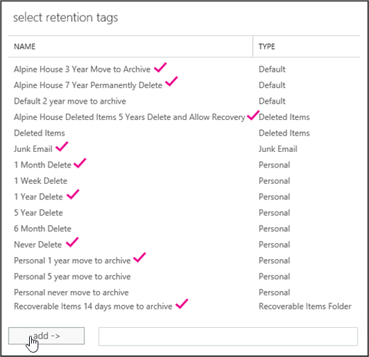

# <a name="set-up-an-archive-and-deletion-policy-for-mailboxes-in-your-organization"></a><span data-ttu-id="04ee3-103">Configurar una directiva de archivo y eliminación de buzones en la organización</span><span class="sxs-lookup"><span data-stu-id="04ee3-103">Set up an archive and deletion policy for mailboxes in your organization</span></span>

<span data-ttu-id="04ee3-104">En Microsoft 365, los administradores pueden crear una directiva de archivado y eliminación que mueve automáticamente elementos al buzón de archivo del usuario y elimina automáticamente los elementos del buzón.</span><span class="sxs-lookup"><span data-stu-id="04ee3-104">In Microsoft 365, admins can create an archiving and deletion policy that automatically moves items to a user's archive mailbox and automatically deletes items from the mailbox.</span></span> <span data-ttu-id="04ee3-105">Para ello, el administrador crea una directiva de retención que se asigna a los buzones de correo y mueve los elementos al buzón de archivo de un usuario después de un período de tiempo determinado y también elimina los elementos del buzón una vez que alcanzan un determinado límite de antigüedad.</span><span class="sxs-lookup"><span data-stu-id="04ee3-105">The admin does this by creating a retention policy that's assigned to mailboxes, and moves items to a user's archive mailbox after a certain period of time and that also deletes items from the mailbox after they reach a certain age limit.</span></span> <span data-ttu-id="04ee3-106">Las reglas reales que determinan qué elementos se mueven o eliminan y cuándo se producen se denominan etiquetas de retención.</span><span class="sxs-lookup"><span data-stu-id="04ee3-106">The actual rules that determine what items are moved or deleted and when that happens are called retention tags.</span></span> <span data-ttu-id="04ee3-107">Las etiquetas de retención están vinculadas a una directiva de retención, que, a su vez, se asigna al buzón de correo de un usuario.</span><span class="sxs-lookup"><span data-stu-id="04ee3-107">Retention tags are linked to a retention policy, that in turn is assigned to a user's mailbox.</span></span> <span data-ttu-id="04ee3-108">Una etiqueta de retención aplica la configuración de retención a los mensajes individuales y las carpetas en el buzón de un usuario.</span><span class="sxs-lookup"><span data-stu-id="04ee3-108">A retention tag applies retention settings to individual messages and folders in a user's mailbox.</span></span> <span data-ttu-id="04ee3-109">Define cuánto tiempo permanece un mensaje en el buzón de correo y qué acción se lleva a cabo cuando el mensaje alcanza la antigüedad de retención especificada.</span><span class="sxs-lookup"><span data-stu-id="04ee3-109">It defines how long a message remains in the mailbox and what action is taken when the message reaches the specified retention age.</span></span> <span data-ttu-id="04ee3-110">Cuando un mensaje alcanza su antigüedad de retención, se mueve al buzón de archivo del usuario o se elimina.</span><span class="sxs-lookup"><span data-stu-id="04ee3-110">When a message reaches its retention age, it's either moved to the user's archive mailbox or it's deleted.</span></span>
  
<span data-ttu-id="04ee3-111">Los pasos descritos en este artículo configuran una directiva de archivado y retención para una organización ficticia denominada Alpine House.</span><span class="sxs-lookup"><span data-stu-id="04ee3-111">The steps in this article will set up an archiving and retention policy for a fictitious organization named Alpine House.</span></span> <span data-ttu-id="04ee3-112">La configuración de esta directiva incluye las siguientes tareas:</span><span class="sxs-lookup"><span data-stu-id="04ee3-112">Setting up this policy includes the following tasks:</span></span>
  
- <span data-ttu-id="04ee3-113">Habilitación de un buzón de archivo para todos los usuarios de la organización.</span><span class="sxs-lookup"><span data-stu-id="04ee3-113">Enabling an archive mailbox for every user in the organization.</span></span> <span data-ttu-id="04ee3-114">Esto proporciona a los usuarios el almacenamiento de buzones de correo adicional y es necesario para que una directiva de retención pueda mover elementos al buzón de archivo.</span><span class="sxs-lookup"><span data-stu-id="04ee3-114">This gives users addition mailbox storage, and is required so that a retention policy can move items to the archive mailbox.</span></span> <span data-ttu-id="04ee3-115">También permite que un usuario almacene información de archivado moviendo elementos a su buzón de archivo.</span><span class="sxs-lookup"><span data-stu-id="04ee3-115">It also lets a user store archival information by moving items to their archive mailbox.</span></span>

- <span data-ttu-id="04ee3-116">Crear tres etiquetas de retención personalizadas que hagan lo siguiente:</span><span class="sxs-lookup"><span data-stu-id="04ee3-116">Creating three custom retention tags that do the following:</span></span>

  - <span data-ttu-id="04ee3-117">Mueve automáticamente los elementos que tienen un antigüedad de 3 años para el buzón de archivo del usuario.</span><span class="sxs-lookup"><span data-stu-id="04ee3-117">Automatically moves items that are 3 years old to the user's archive mailbox.</span></span> <span data-ttu-id="04ee3-118">Al mover elementos al buzón de archivo, se libera espacio en el buzón de correo principal de un usuario.</span><span class="sxs-lookup"><span data-stu-id="04ee3-118">Moving items to the archive mailbox frees up space in a user's primary mailbox.</span></span>

  - <span data-ttu-id="04ee3-119">Elimina automáticamente los elementos que tienen 5 años de antigüedad de la carpeta elementos eliminados.</span><span class="sxs-lookup"><span data-stu-id="04ee3-119">Automatically deletes items that are 5 years old from the Deleted Items folder.</span></span> <span data-ttu-id="04ee3-120">Esto también libera espacio en el buzón de correo principal del usuario.</span><span class="sxs-lookup"><span data-stu-id="04ee3-120">This also frees up space in the user's primary mailbox.</span></span> <span data-ttu-id="04ee3-121">El usuario tendrá la oportunidad de recuperar estos elementos si es necesario.</span><span class="sxs-lookup"><span data-stu-id="04ee3-121">User's will have the opportunity to recover these items if necessary.</span></span> <span data-ttu-id="04ee3-122">Vea la nota al pie en la sección [más información](#more-information) para obtener más información.</span><span class="sxs-lookup"><span data-stu-id="04ee3-122">See the footnote in the [More information](#more-information) section for more details.</span></span> 

  - <span data-ttu-id="04ee3-123">Elimina automáticamente (y permanentemente) los elementos que tienen 7 años de antigüedad tanto en el buzón de archivo como en el principal.</span><span class="sxs-lookup"><span data-stu-id="04ee3-123">Automatically (and permanently) deletes items that are 7 years old from both the primary and archive mailbox.</span></span> <span data-ttu-id="04ee3-124">Debido a las regulaciones de cumplimiento, es necesario que algunas organizaciones conserven el correo electrónico durante un período de tiempo determinado.</span><span class="sxs-lookup"><span data-stu-id="04ee3-124">Because of compliance regulations, some organization's are required to retain email for a certain period of time.</span></span> <span data-ttu-id="04ee3-125">Una vez transcurrido este período de tiempo, es posible que una organización quiera quitar permanentemente los buzones de usuario de los elementos.</span><span class="sxs-lookup"><span data-stu-id="04ee3-125">After this time period expires, an organization might want to permanently remove these items user mailboxes.</span></span>

- <span data-ttu-id="04ee3-126">Crear una nueva Directiva de retención y agregarle nuevas etiquetas de retención personalizadas.</span><span class="sxs-lookup"><span data-stu-id="04ee3-126">Creating a new retention policy and adding the new custom retention tags to it.</span></span> <span data-ttu-id="04ee3-127">Además, también agregará etiquetas de retención integradas a la nueva Directiva de retención.</span><span class="sxs-lookup"><span data-stu-id="04ee3-127">Additionally, you'll also add built-in retention tags to the new retention policy.</span></span> <span data-ttu-id="04ee3-128">Esto incluye etiquetas personales que los usuarios pueden asignar a los elementos de su buzón de correo.</span><span class="sxs-lookup"><span data-stu-id="04ee3-128">This includes personal tags that users can assign to items in their mailbox.</span></span> <span data-ttu-id="04ee3-129">También agregará una etiqueta de retención que mueve los elementos de la carpeta elementos recuperables del buzón de correo principal del usuario a la carpeta elementos recuperables de su buzón de archivo.</span><span class="sxs-lookup"><span data-stu-id="04ee3-129">You'll also add a retention tag that moves items from the Recoverable Items folder in the user's primary mailbox to the Recoverable Items folder in their archive mailbox.</span></span> <span data-ttu-id="04ee3-130">Esto ayuda a liberar espacio en la carpeta elementos recuperables de un usuario cuando su buzón de correo se coloca en retención.</span><span class="sxs-lookup"><span data-stu-id="04ee3-130">This helps free up space in a user's Recoverable Items folder when their mailbox is placed on hold.</span></span>

<span data-ttu-id="04ee3-131">Puede seguir algunos o todos los pasos de este artículo para configurar una directiva de archivo y eliminación para los buzones de correo de su propia organización.</span><span class="sxs-lookup"><span data-stu-id="04ee3-131">You can follow some or all of the steps in this article to set up an archive and deletion policy for mailboxes in your own organization.</span></span> <span data-ttu-id="04ee3-132">Se recomienda probar este proceso en unos pocos buzones antes de implementarlo en todos los buzones de la organización.</span><span class="sxs-lookup"><span data-stu-id="04ee3-132">We recommend that you test this process on a few mailboxes before implementing it on all mailboxes in your organization.</span></span>
  
## <a name="before-you-set-up-an-archive-and-deletion-policy"></a><span data-ttu-id="04ee3-133">Antes de configurar una directiva de archivado y eliminación</span><span class="sxs-lookup"><span data-stu-id="04ee3-133">Before you set up an archive and deletion policy</span></span>

- <span data-ttu-id="04ee3-134">Debe ser administrador global de su organización para realizar los pasos de este tema.</span><span class="sxs-lookup"><span data-stu-id="04ee3-134">You have to be a global administrator in your organization to perform the steps in this topic.</span></span> 

- <span data-ttu-id="04ee3-135">Al crear una nueva cuenta de usuario y asignar al usuario una licencia de Exchange Online, se crea automáticamente un buzón para el usuario.</span><span class="sxs-lookup"><span data-stu-id="04ee3-135">When you create a new user account and assign the user an Exchange Online license, a mailbox is automatically created for the user.</span></span> <span data-ttu-id="04ee3-136">Cuando se crea el buzón de correo, se le asigna automáticamente una directiva de retención predeterminada, denominada Directiva de MRM predeterminada.</span><span class="sxs-lookup"><span data-stu-id="04ee3-136">When the mailbox is created, it's automatically assigned a default retention policy, named Default MRM Policy.</span></span> <span data-ttu-id="04ee3-137">En este artículo, creará una nueva Directiva de retención y la asignará a los buzones de usuario, reemplazando la Directiva de MRM predeterminada.</span><span class="sxs-lookup"><span data-stu-id="04ee3-137">In this article, you will create a new retention policy and then assign it to user mailboxes, replacing the Default MRM policy.</span></span> <span data-ttu-id="04ee3-138">Un buzón solo puede tener una directiva de retención asignada en un momento dado.</span><span class="sxs-lookup"><span data-stu-id="04ee3-138">A mailbox can have only one retention policy assigned to it at any one time.</span></span>

- <span data-ttu-id="04ee3-139">Para obtener más información sobre las directivas de retención y las etiquetas de retención en Exchange Online, consulte [Retention Tags and Retention Policies](https://go.microsoft.com/fwlink/p/?LinkId=404424).</span><span class="sxs-lookup"><span data-stu-id="04ee3-139">To learn more about retention tags and retention policies in Exchange Online, see [Retention tags and retention policies](https://go.microsoft.com/fwlink/p/?LinkId=404424).</span></span>

## <a name="step-1-enable-archive-mailboxes-for-users"></a><span data-ttu-id="04ee3-140">Paso 1: habilitar buzones de archivo para los usuarios</span><span class="sxs-lookup"><span data-stu-id="04ee3-140">Step 1: Enable archive mailboxes for users</span></span>

<span data-ttu-id="04ee3-141">El primer paso consiste en habilitar el buzón de archivo para cada usuario de la organización.</span><span class="sxs-lookup"><span data-stu-id="04ee3-141">The first step is to enable the archive mailbox for each user in your organization.</span></span> <span data-ttu-id="04ee3-142">El buzón de archivo de un usuario debe estar habilitado para que una etiqueta de retención con una acción de retención "mover al archivo" pueda mover el elemento cuando expire la antigüedad de retención.</span><span class="sxs-lookup"><span data-stu-id="04ee3-142">A user's archive mailbox has to be enabled so that a retention tag with a "Move to Archive" retention action can move the item after the retention age expires.</span></span>
  
> [!NOTE]
> <span data-ttu-id="04ee3-143">Puede habilitar los buzones de archivo en cualquier momento durante este proceso, siempre y cuando estén habilitados en algún momento antes de completar el proceso.</span><span class="sxs-lookup"><span data-stu-id="04ee3-143">You can enable archive mailboxes any time during this process, just as long as they're enabled at some point before you complete the process.</span></span> <span data-ttu-id="04ee3-144">Si un buzón de archivo no está habilitado, no se realiza ninguna acción en ninguno de los elementos que tienen asignada una directiva de archivo o eliminación.</span><span class="sxs-lookup"><span data-stu-id="04ee3-144">If an archive mailbox isn't enabled, no action is taken on any items that have an archive or deletion policy assigned to it.</span></span>
  
1. <span data-ttu-id="04ee3-145">Vaya a [https://protection.office.com](https://protection.office.com).</span><span class="sxs-lookup"><span data-stu-id="04ee3-145">Go to [https://protection.office.com](https://protection.office.com).</span></span>

2. <span data-ttu-id="04ee3-146">Inicie sesión con su cuenta de administrador global.</span><span class="sxs-lookup"><span data-stu-id="04ee3-146">Sign in using your global administrator account.</span></span>
    
3. <span data-ttu-id="04ee3-147">En el centro de seguridad & cumplimiento, vaya al archivo de **gobierno de información** \> .</span><span class="sxs-lookup"><span data-stu-id="04ee3-147">In the Security & Compliance Center, go to **Information governance** \> **Archive**.</span></span>

    <span data-ttu-id="04ee3-148">Se muestra una lista de los buzones de correo de la organización y si el buzón de archivo correspondiente está habilitado o deshabilitado.</span><span class="sxs-lookup"><span data-stu-id="04ee3-148">A list of the mailboxes in your organization is displayed and whether the corresponding archive mailbox is enabled or disabled.</span></span>

4. <span data-ttu-id="04ee3-149">Para seleccionar todos los buzones, haga clic en el primero de la lista, mantenga presionada la tecla **MAYÚS** y, a continuación, haga clic en el último de la lista.</span><span class="sxs-lookup"><span data-stu-id="04ee3-149">Select all the mailboxes by clicking on the first one in the list, holding down the **Shift** key, and then clicking the last one in the list.</span></span>

    > [!TIP]
    > <span data-ttu-id="04ee3-150">En este paso se presupone que no hay buzones de archivo habilitados.</span><span class="sxs-lookup"><span data-stu-id="04ee3-150">This step assumes that no archive mailboxes are enabled.</span></span> <span data-ttu-id="04ee3-151">Si tiene buzones con el archivo habilitado, mantenga presionada la tecla **Ctrl** y haga clic en cada buzón de correo que tenga un buzón de archivo deshabilitado.</span><span class="sxs-lookup"><span data-stu-id="04ee3-151">If you have any mailboxes with the archive enabled, hold down the **Ctrl** key and click each mailbox that has a disabled archive mailbox.</span></span> <span data-ttu-id="04ee3-152">O puede hacer clic en el encabezado de la columna **buzón de archivo** para ordenar las filas en función de si el buzón de archivo está habilitado o deshabilitado para facilitar la selección de buzones.</span><span class="sxs-lookup"><span data-stu-id="04ee3-152">Or you can click the **Archive mailbox** column header to sort the rows based on whether the archive mailbox is enabled or disabled to make it easier to select mailboxes.</span></span>
  
5. <span data-ttu-id="04ee3-153">En el panel de detalles, en **edición en masa**, haga clic en **Habilitar**.</span><span class="sxs-lookup"><span data-stu-id="04ee3-153">In the details pane, under **Bulk Edit**, click **Enable**.</span></span>

    <span data-ttu-id="04ee3-154">Se muestra una advertencia que indica que los elementos que tienen más de dos años se moverán al nuevo buzón de archivo.</span><span class="sxs-lookup"><span data-stu-id="04ee3-154">A warning is displayed saying that items that are older than two years will be moved to the new archive mailbox.</span></span> <span data-ttu-id="04ee3-155">Esto se debe a que la Directiva de retención predeterminada asignada a un nuevo buzón de usuario cuando se crea tiene una etiqueta de directiva de archivado predeterminada con una antigüedad de retención de 2 años.</span><span class="sxs-lookup"><span data-stu-id="04ee3-155">This is because the default retention policy that's assigned a new user mailbox when it's created has an archive default policy tag that has a retention age of 2 years.</span></span> <span data-ttu-id="04ee3-156">La etiqueta de directiva predeterminada de archivo personalizado que creará en el paso 2 tiene una antigüedad de retención de 3 años.</span><span class="sxs-lookup"><span data-stu-id="04ee3-156">The custom archive default policy tag that you'll create in Step 2 has a retention age of 3 years.</span></span> <span data-ttu-id="04ee3-157">Esto significa que los elementos de 3 años o más se moverán al buzón de archivo.</span><span class="sxs-lookup"><span data-stu-id="04ee3-157">That means items that are 3 years or older will be moved to the archive mailbox.</span></span>

6. <span data-ttu-id="04ee3-158">Haga clic en **sí** para cerrar el mensaje de advertencia e iniciar el proceso para habilitar el buzón de archivo para cada buzón seleccionado.</span><span class="sxs-lookup"><span data-stu-id="04ee3-158">Click **Yes** to close the warning message and start the process to enable the archive mailbox for each selected mailbox.</span></span>

7. <span data-ttu-id="04ee3-159">Una vez completado el proceso, haga clic en **Actualizar** actualización  para actualizar la lista en la página **archivo** .</span><span class="sxs-lookup"><span data-stu-id="04ee3-159">When the process is complete, click **Refresh**  to update the list on the **Archive** page.</span></span>

    <span data-ttu-id="04ee3-160">El buzón de archivo está habilitado para todos los usuarios de la organización.</span><span class="sxs-lookup"><span data-stu-id="04ee3-160">The archive mailbox is enabled for all user's in your organization.</span></span>

    

## <a name="step-2-create-new-retention-tags-for-the-archive-and-deletion-policies"></a><span data-ttu-id="04ee3-162">Paso 2: crear nuevas etiquetas de retención para las directivas de archivo y eliminación</span><span class="sxs-lookup"><span data-stu-id="04ee3-162">Step 2: Create new retention tags for the archive and deletion policies</span></span>

<span data-ttu-id="04ee3-163">En este paso, creará las tres etiquetas de retención personalizadas descritas anteriormente.</span><span class="sxs-lookup"><span data-stu-id="04ee3-163">In this step, you'll create the three custom retention tags that were previously described.</span></span>
  
- <span data-ttu-id="04ee3-164">Mover a archivo desde Alpine House a 3 años (Directiva de archivo personalizada)</span><span class="sxs-lookup"><span data-stu-id="04ee3-164">Alpine House 3 Year Move to Archive (custom archive policy)</span></span>

- <span data-ttu-id="04ee3-165">Eliminación permanente de Alpine House de 7 años (Directiva de eliminación personalizada)</span><span class="sxs-lookup"><span data-stu-id="04ee3-165">Alpine House 7 Year Permanently Delete (custom deletion policy)</span></span>

- <span data-ttu-id="04ee3-166">Eliminar y permitir recuperación de los elementos eliminados de Alpine House 5 años (etiqueta personalizada para la carpeta elementos eliminados)</span><span class="sxs-lookup"><span data-stu-id="04ee3-166">Alpine House Deleted Items 5 Years Delete and Allow Recovery (custom tag for the Deleted Items folder)</span></span>

<span data-ttu-id="04ee3-167">Para crear nuevas etiquetas de retención, debe usar el centro de administración de Exchange (EAC) en su organización de Exchange Online.</span><span class="sxs-lookup"><span data-stu-id="04ee3-167">To create new retention tags, you'll use the Exchange admin center (EAC) in your Exchange Online organization.</span></span> <span data-ttu-id="04ee3-168">Asegúrese de usar la versión clásica del EAC.</span><span class="sxs-lookup"><span data-stu-id="04ee3-168">Be sure to use the classic version of the EAC.</span></span>
  
1. <span data-ttu-id="04ee3-169">Vaya a [https://admin.protection.outlook.com/ecp/](https://admin.protection.outlook.com/ecp/) e inicie sesión con sus credenciales.</span><span class="sxs-lookup"><span data-stu-id="04ee3-169">Go to [https://admin.protection.outlook.com/ecp/](https://admin.protection.outlook.com/ecp/) and sign in using your credentials.</span></span>
  
2. <span data-ttu-id="04ee3-170">En el EAC, vaya a   >  **etiquetas de retención** de administración de cumplimiento.</span><span class="sxs-lookup"><span data-stu-id="04ee3-170">In the EAC, go to **Compliance management** > **Retention tags**</span></span>

    <span data-ttu-id="04ee3-171">Se muestra una lista de las etiquetas de retención de la organización.</span><span class="sxs-lookup"><span data-stu-id="04ee3-171">A list of the retention tags for your organization is displayed.</span></span>

### <a name="create-a-custom-archive-default-policy-tag"></a><span data-ttu-id="04ee3-172">Crear una etiqueta de directiva predeterminada de archivo personalizado</span><span class="sxs-lookup"><span data-stu-id="04ee3-172">Create a custom archive default policy tag</span></span>
  
<span data-ttu-id="04ee3-173">En primer lugar, deberá crear una etiqueta de directiva predeterminada de archivo (DPT) personalizada que moverá los elementos al buzón de archivo después de tres años.</span><span class="sxs-lookup"><span data-stu-id="04ee3-173">First, you'll create a custom archive default policy tag (DPT) that will move items to the archive mailbox after 3 years.</span></span>
  
1. <span data-ttu-id="04ee3-174">En la página **etiquetas de retención** , haga clic en **nueva etiqueta**  y, a continuación, seleccione **aplicado automáticamente a todo el buzón (predeterminado)**.</span><span class="sxs-lookup"><span data-stu-id="04ee3-174">On the **Retention tags** page, click **New tag**, and then select **applied automatically to entire mailbox (default)**.</span></span>

2. <span data-ttu-id="04ee3-175">En la página **nueva etiqueta aplicada automáticamente a todo el buzón (predeterminado)** , complete los campos siguientes:</span><span class="sxs-lookup"><span data-stu-id="04ee3-175">On the **New tag applied automatically to entire mailbox (default)** page, complete the following fields:</span></span> 

    
  
   1. <span data-ttu-id="04ee3-177">**Nombre** de Escriba un nombre para la nueva etiqueta de retención.</span><span class="sxs-lookup"><span data-stu-id="04ee3-177">**Name** Type a name for the new retention tag.</span></span> 

   2. <span data-ttu-id="04ee3-178">**Acción de retención** Seleccione **mover a archivo** para mover elementos al buzón de archivo cuando expire el período de retención.</span><span class="sxs-lookup"><span data-stu-id="04ee3-178">**Retention action** Select **Move to Archive** to move items to the archive mailbox when the retention period expires.</span></span>

   3. <span data-ttu-id="04ee3-179">**Período de retención** Seleccione **cuando el elemento alcanza la siguiente antigüedad (en días)** y, a continuación, escriba la duración del período de retención.</span><span class="sxs-lookup"><span data-stu-id="04ee3-179">**Retention period** Select **When the item reaches the following age (in days)**, and then enter the duration of the retention period.</span></span> <span data-ttu-id="04ee3-180">Para este escenario, los elementos se moverán al buzón de archivo después de 1095 días (3 años).</span><span class="sxs-lookup"><span data-stu-id="04ee3-180">For this scenario, items will be moved to the archive mailbox after 1095 days (3 years).</span></span>

   4. <span data-ttu-id="04ee3-181">**Comment** (opcional) escriba un comentario que explique el propósito de la etiqueta de retención personalizada.</span><span class="sxs-lookup"><span data-stu-id="04ee3-181">**Comment** (Optional) Type a comment that explains the purpose of the custom retention tag.</span></span>

3. <span data-ttu-id="04ee3-182">Haga clic en **Guardar** para crear la DPT de archivo personalizada.</span><span class="sxs-lookup"><span data-stu-id="04ee3-182">Click **Save** to create the custom archive DPT.</span></span>

    <span data-ttu-id="04ee3-183">La nueva DPT de archivo se muestra en la lista de etiquetas de retención.</span><span class="sxs-lookup"><span data-stu-id="04ee3-183">The new archive DPT is displayed in the list of retention tags.</span></span>

### <a name="create-a-custom-deletion-default-policy-tag"></a><span data-ttu-id="04ee3-184">Crear una etiqueta de directiva predeterminada de eliminación personalizada</span><span class="sxs-lookup"><span data-stu-id="04ee3-184">Create a custom deletion default policy tag</span></span>
  
<span data-ttu-id="04ee3-185">A continuación, creará otra DPT personalizada, pero ésta será una directiva de eliminación que eliminará permanentemente los elementos después de 7 años.</span><span class="sxs-lookup"><span data-stu-id="04ee3-185">Next, you'll create another custom DPT but this one will be a deletion policy that permanently deletes items after 7 years.</span></span>
  
1. <span data-ttu-id="04ee3-186">En la página **etiquetas de retención** , haga clic en **nueva etiqueta**  y, a continuación, seleccione **aplicado automáticamente a todo el buzón (predeterminado)**.</span><span class="sxs-lookup"><span data-stu-id="04ee3-186">On the **Retention tags** page, click **New tag**, and then select **applied automatically to entire mailbox (default)**.</span></span>

2. <span data-ttu-id="04ee3-187">En la página **nueva etiqueta aplicada automáticamente a todo el buzón (predeterminado)** , complete los campos siguientes:</span><span class="sxs-lookup"><span data-stu-id="04ee3-187">On the **New tag applied automatically to entire mailbox (default)** page, complete the following fields:</span></span> 

    
  
   1. <span data-ttu-id="04ee3-189">**Nombre** de Escriba un nombre para la nueva etiqueta de retención.</span><span class="sxs-lookup"><span data-stu-id="04ee3-189">**Name** Type a name for the new retention tag.</span></span> 

   2. <span data-ttu-id="04ee3-190">**Acción de retención** Seleccione **eliminar permanentemente** para purgar los elementos del buzón de correo cuando expire el período de retención.</span><span class="sxs-lookup"><span data-stu-id="04ee3-190">**Retention action** Select **Permanently Delete** to purge items from the mailbox when the retention period expires.</span></span>

   3. <span data-ttu-id="04ee3-191">**Período de retención** Seleccione **cuando el elemento alcanza la siguiente antigüedad (en días)** y, a continuación, escriba la duración del período de retención.</span><span class="sxs-lookup"><span data-stu-id="04ee3-191">**Retention period** Select **When the item reaches the following age (in days)**, and then enter the duration of the retention period.</span></span> <span data-ttu-id="04ee3-192">Para este escenario, los elementos se purgarán después de 2555 días (7 años).</span><span class="sxs-lookup"><span data-stu-id="04ee3-192">For this scenario, items will be purged after 2555 days (7 years).</span></span>

   4. <span data-ttu-id="04ee3-193">**Comment** (opcional) escriba un comentario que explique el propósito de la etiqueta de retención personalizada.</span><span class="sxs-lookup"><span data-stu-id="04ee3-193">**Comment** (Optional) Type a comment that explains the purpose of the custom retention tag.</span></span> 

3. <span data-ttu-id="04ee3-194">Haga clic en **Guardar** para crear la DPT de eliminación personalizada.</span><span class="sxs-lookup"><span data-stu-id="04ee3-194">Click **Save** to create the custom deletion DPT.</span></span> 

    <span data-ttu-id="04ee3-195">La nueva DPT de eliminación se muestra en la lista de etiquetas de retención.</span><span class="sxs-lookup"><span data-stu-id="04ee3-195">The new deletion DPT is displayed in the list of retention tags.</span></span>

### <a name="create-a-custom-retention-policy-tag-for-the-deleted-items-folder"></a><span data-ttu-id="04ee3-196">Crear una etiqueta de directiva de retención personalizada para la carpeta elementos eliminados</span><span class="sxs-lookup"><span data-stu-id="04ee3-196">Create a custom retention policy tag for the Deleted Items folder</span></span>
  
<span data-ttu-id="04ee3-197">La última etiqueta de retención que creará es una etiqueta de directiva de retención (RPT) personalizada para la carpeta elementos eliminados.</span><span class="sxs-lookup"><span data-stu-id="04ee3-197">The last retention tag that you'll create is a custom retention policy tag (RPT) for the Deleted Items folder.</span></span> <span data-ttu-id="04ee3-198">Esta etiqueta eliminará los elementos de la carpeta elementos eliminados después de 5 años y proporciona un período de recuperación en el que los usuarios pueden usar la herramienta recuperar elementos eliminados para recuperar un elemento.</span><span class="sxs-lookup"><span data-stu-id="04ee3-198">This tag will delete items in the Deleted Items folder after 5 years, and provides a recovery period when users can use the Recover Deleted Items tool to recover an item.</span></span>
  
1. <span data-ttu-id="04ee3-199">En la página **etiquetas de retención** , haga clic en **nueva etiqueta**  y, a continuación, seleccione **aplicado automáticamente a una carpeta predeterminada**.</span><span class="sxs-lookup"><span data-stu-id="04ee3-199">On the **Retention tags** page, click **New tag** , and then select **applied automatically to a default folder**.</span></span>

2. <span data-ttu-id="04ee3-200">En la página **nueva etiqueta aplicada automáticamente a una carpeta predeterminada** , complete los campos siguientes:</span><span class="sxs-lookup"><span data-stu-id="04ee3-200">On the **New tag applied automatically to a default folder** page, complete the following fields:</span></span>

    
  
   1. <span data-ttu-id="04ee3-202">**Nombre** de Escriba un nombre para la nueva etiqueta de retención.</span><span class="sxs-lookup"><span data-stu-id="04ee3-202">**Name** Type a name for the new retention tag.</span></span> 

   2. <span data-ttu-id="04ee3-203">**Aplicar esta etiqueta a la siguiente carpeta predeterminada** En la lista desplegable, seleccione **elementos eliminados**.</span><span class="sxs-lookup"><span data-stu-id="04ee3-203">**Apply this tag to the following default folder** In the drop-down list, select **Deleted Items**.</span></span>

   3. <span data-ttu-id="04ee3-204">**Acción de retención** Seleccione **eliminar y permitir recuperación** para eliminar elementos cuando expire el período de retención, pero permitir a los usuarios recuperar un elemento eliminado dentro del período de retención de elementos eliminados (que de forma predeterminada son 14 días).</span><span class="sxs-lookup"><span data-stu-id="04ee3-204">**Retention action** Select **Delete and Allow Recovery** to delete items when the retention period expires, but allow users to recover a deleted item within the deleted item retention period (which by default is 14 days).</span></span>

   4. <span data-ttu-id="04ee3-205">**Período de retención** Seleccione **cuando el elemento alcanza la siguiente antigüedad (en días)** y, a continuación, escriba la duración del período de retención.</span><span class="sxs-lookup"><span data-stu-id="04ee3-205">**Retention period** Select **When the item reaches the following age (in days)**, and then enter the duration of the retention period.</span></span> <span data-ttu-id="04ee3-206">Para este escenario, los elementos se eliminarán después de 1825 días (5 años).</span><span class="sxs-lookup"><span data-stu-id="04ee3-206">For this scenario, items will be deleted after 1825 days (5 years).</span></span>

   5. <span data-ttu-id="04ee3-207">**Comment** (opcional) escriba un comentario que explique el propósito de la etiqueta de retención personalizada.</span><span class="sxs-lookup"><span data-stu-id="04ee3-207">**Comment** (Optional) Type a comment that explains the purpose of the custom retention tag.</span></span> 

3. <span data-ttu-id="04ee3-208">Haga clic en **Guardar** para crear la RPT personalizada para la carpeta elementos eliminados.</span><span class="sxs-lookup"><span data-stu-id="04ee3-208">Click **Save** to create the custom RPT for the Deleted Items folder.</span></span>

    <span data-ttu-id="04ee3-209">La nueva RPT se muestra en la lista de etiquetas de retención.</span><span class="sxs-lookup"><span data-stu-id="04ee3-209">The new RPT is displayed in the list of retention tags.</span></span>

## <a name="step-3-create-a-new-retention-policy"></a><span data-ttu-id="04ee3-210">Paso 3: crear una nueva Directiva de retención</span><span class="sxs-lookup"><span data-stu-id="04ee3-210">Step 3: Create a new retention policy</span></span>

<span data-ttu-id="04ee3-211">Después de crear las etiquetas de retención personalizadas, el siguiente paso consiste en crear una nueva Directiva de retención y agregar las etiquetas de retención.</span><span class="sxs-lookup"><span data-stu-id="04ee3-211">After you create the custom retention tags, the next step is to create a new retention policy and add the retention tags.</span></span> <span data-ttu-id="04ee3-212">Agregará las tres etiquetas de retención personalizadas que creó en el paso 2 y las etiquetas integradas mencionadas en la primera sección.</span><span class="sxs-lookup"><span data-stu-id="04ee3-212">You'll add the three custom retention tags that you created in Step 2, and the built-in tags that were mentioned in the first section.</span></span> <span data-ttu-id="04ee3-213">En el paso 4, asignará esta nueva Directiva de retención a los buzones de usuario.</span><span class="sxs-lookup"><span data-stu-id="04ee3-213">In Step 4, you'll assign this new retention policy to user mailboxes.</span></span>
  
1. <span data-ttu-id="04ee3-214">En el EAC, vaya a directivas de retención de **Administración de cumplimiento**  >  .</span><span class="sxs-lookup"><span data-stu-id="04ee3-214">In the EAC, go to **Compliance management** > **Retention policies**.</span></span>

2. <span data-ttu-id="04ee3-215">En la página **directivas de retención** , haga clic en **nuevo**  .</span><span class="sxs-lookup"><span data-stu-id="04ee3-215">On the **Retention policies** page, click **New** .</span></span>

3. <span data-ttu-id="04ee3-216">En el cuadro **nombre** , escriba un nombre para la nueva Directiva de retención; por ejemplo, **Directiva de archivo y eliminación de Alpine House**.</span><span class="sxs-lookup"><span data-stu-id="04ee3-216">In the **Name** box, type a name for the new retention policy; for example, **Alpine House Archive and Deletion Policy**.</span></span>

4. <span data-ttu-id="04ee3-217">En **etiquetas de retención**, haga clic en **Agregar**  .</span><span class="sxs-lookup"><span data-stu-id="04ee3-217">Under **Retention tags**, click **Add** .</span></span>

    <span data-ttu-id="04ee3-218">Se muestra una lista de las etiquetas de retención de la organización.</span><span class="sxs-lookup"><span data-stu-id="04ee3-218">A list of the retention tags in your organization is displayed.</span></span> <span data-ttu-id="04ee3-219">Nota se muestran las etiquetas personalizadas que creó en el paso 2.</span><span class="sxs-lookup"><span data-stu-id="04ee3-219">Note the custom tags that you created in Step 2 are displayed.</span></span>

5. <span data-ttu-id="04ee3-220">Agregue las 9 etiquetas de retención resaltadas en la siguiente captura de pantalla (estas etiquetas se describen con más detalle en la sección [más información](#more-information) ).</span><span class="sxs-lookup"><span data-stu-id="04ee3-220">Add the 9 retention tags that are highlighted in the following screenshot (these tags are described in more detail in the [More information](#more-information) section).</span></span> <span data-ttu-id="04ee3-221">Para agregar una etiqueta de retención, selecciónela y, a continuación, haga clic en **Agregar**.</span><span class="sxs-lookup"><span data-stu-id="04ee3-221">To add a retention tag, select it and then click **Add**.</span></span>

    
  
    > [!TIP]
    > <span data-ttu-id="04ee3-223">Puede seleccionar varias etiquetas de retención Si mantiene presionada la tecla **Ctrl** y, a continuación, hace clic en cada etiqueta.</span><span class="sxs-lookup"><span data-stu-id="04ee3-223">You can select multiple retention tags by holding down the **Ctrl** key and then clicking each tag.</span></span> 
  
6. <span data-ttu-id="04ee3-224">Una vez que haya agregado las etiquetas de retención, haga clic en **Aceptar**.</span><span class="sxs-lookup"><span data-stu-id="04ee3-224">After you've added the retention tags, click **OK**.</span></span>

7. <span data-ttu-id="04ee3-225">En la página **nueva Directiva de retención** , haga clic en **Guardar** para crear la nueva Directiva.</span><span class="sxs-lookup"><span data-stu-id="04ee3-225">On the **New retention policy** page, click **Save** to create the new policy.</span></span>

    <span data-ttu-id="04ee3-226">La nueva Directiva de retención se muestra en la lista.</span><span class="sxs-lookup"><span data-stu-id="04ee3-226">The new retention policy is displayed in the list.</span></span> <span data-ttu-id="04ee3-227">Selecciónelo para mostrar las etiquetas de retención vinculadas en el panel de detalles.</span><span class="sxs-lookup"><span data-stu-id="04ee3-227">Select it to display the retention tags linked to it in the details pane.</span></span>

    
  
## <a name="step-4-assign-the-new-retention-policy-to-user-mailboxes"></a><span data-ttu-id="04ee3-229">Paso 4: asignar la nueva Directiva de retención a los buzones de usuario</span><span class="sxs-lookup"><span data-stu-id="04ee3-229">Step 4: Assign the new retention policy to user mailboxes</span></span>

<span data-ttu-id="04ee3-230">Cuando se crea un nuevo buzón de correo, se le asigna de forma predeterminada una directiva de retención denominada Directiva de MRM predeterminada.</span><span class="sxs-lookup"><span data-stu-id="04ee3-230">When a new mailbox is created, a retention policy named Default MRM policy is assigned to it by default.</span></span> <span data-ttu-id="04ee3-231">En este paso, reemplazará esta directiva de retención (porque un buzón solo puede tener asignada una directiva de retención) asignando la nueva Directiva de retención que ha creado en el paso 3 a los buzones de usuario de la organización.</span><span class="sxs-lookup"><span data-stu-id="04ee3-231">In this step, you'll replace this retention policy (because a mailbox can have only one retention policy assigned to it) by assigning the new retention policy that you created in Step 3 to the user mailboxes in your organization.</span></span> <span data-ttu-id="04ee3-232">En este paso se supone que asignará la nueva Directiva a todos los buzones de la organización.</span><span class="sxs-lookup"><span data-stu-id="04ee3-232">This step assumes that you'll assign the new policy to all mailboxes in your organization.</span></span>
  
1. <span data-ttu-id="04ee3-233">En el EAC, vaya a   >  **buzones de correo** de destinatarios.</span><span class="sxs-lookup"><span data-stu-id="04ee3-233">In the EAC, go to **Recipients** > **Mailboxes**.</span></span>

    <span data-ttu-id="04ee3-234">Se muestra una lista de todos los buzones de usuario de la organización.</span><span class="sxs-lookup"><span data-stu-id="04ee3-234">A list of all user mailboxes in your organization is displayed.</span></span>

2. <span data-ttu-id="04ee3-235">Para seleccionar todos los buzones, haga clic en el primero de la lista, mantenga presionada la tecla **MAYÚS** y, a continuación, haga clic en el último de la lista.</span><span class="sxs-lookup"><span data-stu-id="04ee3-235">Select all the mailboxes by clicking on the first one in the list, holding down the **Shift** key, and then clicking the last one in the list.</span></span> 

3. <span data-ttu-id="04ee3-236">En el panel de detalles de la parte derecha del EAC, en **edición en masa**, haga clic en **más opciones**.</span><span class="sxs-lookup"><span data-stu-id="04ee3-236">In the details pane on the right side of the EAC, under **Bulk Edit**, click **More options**.</span></span>

4. <span data-ttu-id="04ee3-237">En **Directiva de retención**, haga clic en **Actualizar**.</span><span class="sxs-lookup"><span data-stu-id="04ee3-237">Under **Retention Policy**, click **Update**.</span></span>

5. <span data-ttu-id="04ee3-238">En la página **Directiva de retención de asignación masiva** , en la lista desplegable **seleccionar Directiva** de retención, seleccione la Directiva de retención que ha creado en el paso 3; por ejemplo, **Directiva de archivo y retención de Alpine House**.</span><span class="sxs-lookup"><span data-stu-id="04ee3-238">On the **Bulk assign retention policy** page, in the **Select the retention policy** drop-down list, select the retention policy that you created in Step 3; for example, **Alpine House Archive and Retention Policy**.</span></span>

6. <span data-ttu-id="04ee3-239">Haga clic en **Guardar** para guardar la nueva asignación de directiva de retención.</span><span class="sxs-lookup"><span data-stu-id="04ee3-239">Click **Save** to save the new retention policy assignment.</span></span>

7. <span data-ttu-id="04ee3-240">Para comprobar que la nueva Directiva de retención se asignó a los buzones, puede hacer lo siguiente:</span><span class="sxs-lookup"><span data-stu-id="04ee3-240">To verify that the new retention policy was assigned to mailboxes, you can do the following:</span></span>

   1. <span data-ttu-id="04ee3-241">Seleccione un buzón en la página **buzones de correo** y, a continuación, haga clic en **Editar**  .</span><span class="sxs-lookup"><span data-stu-id="04ee3-241">Select a mailbox on the **Mailboxes** page, and then click **Edit** .</span></span>

   2. <span data-ttu-id="04ee3-242">En la página de propiedades del buzón del usuario seleccionado, haga clic en **características de buzón**.</span><span class="sxs-lookup"><span data-stu-id="04ee3-242">On the mailbox properties page for the selected user, click **Mailbox features**.</span></span>

   <span data-ttu-id="04ee3-243">El nombre de la nueva directiva asignada al buzón se muestra en la lista desplegable **Directiva de retención** .</span><span class="sxs-lookup"><span data-stu-id="04ee3-243">The name of the new policy assigned to the mailbox is displayed in the **Retention policy** drop-down list.</span></span>

## <a name="optional-step-5-run-the-managed-folder-assistant-to-apply-the-new-settings"></a><span data-ttu-id="04ee3-244">Opcional Paso 5: ejecutar el Asistente para carpeta administrada para aplicar la nueva configuración</span><span class="sxs-lookup"><span data-stu-id="04ee3-244">(Optional) Step 5: Run the Managed Folder Assistant to apply the new settings</span></span>

<span data-ttu-id="04ee3-245">Después de aplicar la nueva Directiva de retención a los buzones del paso 4, puede tardar hasta 7 días en Exchange Online para aplicar la nueva configuración de retención a los buzones.</span><span class="sxs-lookup"><span data-stu-id="04ee3-245">After you apply the new retention policy to mailboxes in Step 4, it can take up to 7 days in Exchange Online for the new retention settings to be applied to the mailboxes.</span></span> <span data-ttu-id="04ee3-246">Esto se debe a que un proceso denominado el *Asistente para carpeta administrada* procesa los buzones al menos una vez cada 7 días.</span><span class="sxs-lookup"><span data-stu-id="04ee3-246">This is because a process called the *Managed Folder Assistant* processes mailboxes at least once every 7 days.</span></span> <span data-ttu-id="04ee3-247">En lugar de esperar a que se ejecute el Asistente para carpeta administrada, puede obligar a que esto suceda mediante la ejecución del cmdlet **Start-ManagedFolderAssistant** en Exchange Online PowerShell.</span><span class="sxs-lookup"><span data-stu-id="04ee3-247">Instead of waiting for the Managed Folder Assistant to run, you can force this to happen by running the **Start-ManagedFolderAssistant** cmdlet in Exchange Online PowerShell.</span></span>

 <span data-ttu-id="04ee3-248">**¿Qué sucede cuando se ejecuta el Asistente para carpeta administrada?**</span><span class="sxs-lookup"><span data-stu-id="04ee3-248">**What happens when you run the Managed Folder Assistant?**</span></span> <span data-ttu-id="04ee3-249">Para aplicar la configuración de la Directiva de retención, inspeccione los elementos del buzón de correo y determine si están sujetos a retención.</span><span class="sxs-lookup"><span data-stu-id="04ee3-249">It applies the settings in the retention policy by inspecting items in the mailbox and determining whether they're subject to retention.</span></span> <span data-ttu-id="04ee3-250">A continuación, se marcan los elementos sujetos a retención con la etiqueta de retención correspondiente y, a continuación, se lleva a cabo la acción de retención especificada en los elementos anteriores a su antigüedad de retención.</span><span class="sxs-lookup"><span data-stu-id="04ee3-250">It then stamps items subject to retention with the appropriate retention tag, and then takes the specified retention action on items past their retention age.</span></span>
  
<span data-ttu-id="04ee3-251">Estos son los pasos para conectarse a PowerShell de Exchange Online y, a continuación, ejecutar el Asistente para carpeta administrada en todos los buzones de la organización.</span><span class="sxs-lookup"><span data-stu-id="04ee3-251">Here are the steps to connect to Exchange Online PowerShell, and then run the Managed Folder Assistant on every mailbox in your organization.</span></span>

1. <span data-ttu-id="04ee3-252">[Conéctese al PowerShell de Exchange Online](https://go.microsoft.com/fwlink/p/?LinkId=517283).</span><span class="sxs-lookup"><span data-stu-id="04ee3-252">[Connect to Exchange Online PowerShell](https://go.microsoft.com/fwlink/p/?LinkId=517283).</span></span>
  
2. <span data-ttu-id="04ee3-253">Ejecute los dos comandos siguientes para iniciar el Asistente para carpeta administrada para todos los buzones de usuario de la organización.</span><span class="sxs-lookup"><span data-stu-id="04ee3-253">Run the following two commands to start the Managed Folder Assistant for all user mailboxes in your organization.</span></span>

    ```powershell
    $Mailboxes = Get-Mailbox -ResultSize Unlimited -Filter {RecipientTypeDetails -eq "UserMailbox"}
    ```

    ```powershell
    $Mailboxes.Identity | Start-ManagedFolderAssistant
    ```

<span data-ttu-id="04ee3-254">Y eso es todo.</span><span class="sxs-lookup"><span data-stu-id="04ee3-254">That's it!</span></span> <span data-ttu-id="04ee3-255">Ha configurado una directiva de archivo y eliminación para la organización de Alpine House.</span><span class="sxs-lookup"><span data-stu-id="04ee3-255">You've set up an archive and deletion policy for the Alpine House organization.</span></span>

> [!NOTE]
> <span data-ttu-id="04ee3-256">Como se mencionó anteriormente, el Asistente para carpeta administrada procesa los buzones al menos una vez cada 7 días.</span><span class="sxs-lookup"><span data-stu-id="04ee3-256">As previously stated, the Managed Folder Assistant processes mailboxes at least once every 7 days.</span></span> <span data-ttu-id="04ee3-257">Por lo tanto, es posible que el Asistente de carpetas administradas pueda procesar un buzón con más frecuencia.</span><span class="sxs-lookup"><span data-stu-id="04ee3-257">So it's possible that a mailbox can be processed by the Managed Folder Assistant more frequently.</span></span> <span data-ttu-id="04ee3-258">Además, los administradores no pueden predecir la próxima vez que el Asistente para carpetas administradas procesa un buzón, que es una de las razones por las que quizás desee ejecutarlo manualmente.</span><span class="sxs-lookup"><span data-stu-id="04ee3-258">Also, admins can't predict the next time a mailbox is processed by the Managed Folder Assistant, which is one reason why you may want to run it manually.</span></span> <span data-ttu-id="04ee3-259">Sin embargo, si desea evitar temporalmente que el Asistente para carpeta administrada aplique la nueva configuración de retención a un buzón de correo, puede ejecutar el `Set-Mailbox -ElcProcessingDisabled $true` comando para deshabilitar temporalmente el Asistente para carpeta administrada del procesamiento de un buzón.</span><span class="sxs-lookup"><span data-stu-id="04ee3-259">However, if you want to temporarily prevent the Managed Folder Assistant from applying the new retention settings to a mailbox, you can run the `Set-Mailbox -ElcProcessingDisabled $true` command to temporarily disable the the Managed Folder Assistant from processing a mailbox.</span></span> <span data-ttu-id="04ee3-260">Para volver a habilitar el Asistente para carpeta administrada para un buzón, ejecute el `Set-Mailbox -ElcProcessingDisabled $false` comando.</span><span class="sxs-lookup"><span data-stu-id="04ee3-260">To re-enable the Managed Folder Assistant for a mailbox, run the `Set-Mailbox -ElcProcessingDisabled $false` command.</span></span> <span data-ttu-id="04ee3-261">Por último, si un usuario de buzón tiene una cuenta deshabilitada, no se procesará la acción mover elementos a archivo para ese buzón.</span><span class="sxs-lookup"><span data-stu-id="04ee3-261">Finally, if a mailbox user has a disabled account, we will not process the move items to archive action for that mailbox.</span></span>
  
## <a name="optional-step-6-make-the-new-retention-policy-the-default-for-your-organization"></a><span data-ttu-id="04ee3-262">Opcional Paso 6: convertir la nueva Directiva de retención en la opción predeterminada para su organización</span><span class="sxs-lookup"><span data-stu-id="04ee3-262">(Optional) Step 6: Make the new retention policy the default for your organization</span></span>

<span data-ttu-id="04ee3-263">En el paso 4, tiene que asignar la nueva Directiva de retención a los buzones existentes.</span><span class="sxs-lookup"><span data-stu-id="04ee3-263">In Step 4, you have to assign the new retention policy to existing mailboxes.</span></span> <span data-ttu-id="04ee3-264">Sin embargo, puede configurar Exchange Online para que la nueva Directiva de retención se asigne a los nuevos buzones que se creen en el futuro.</span><span class="sxs-lookup"><span data-stu-id="04ee3-264">But you can configure Exchange Online so that the new retention policy is assigned to new mailboxes that are created in the future.</span></span> <span data-ttu-id="04ee3-265">Para ello, debe usar Exchange Online PowerShell para actualizar el plan de buzón de correo predeterminado de su organización.</span><span class="sxs-lookup"><span data-stu-id="04ee3-265">You do this by using Exchange Online PowerShell to update your organization's default mailbox plan.</span></span> <span data-ttu-id="04ee3-266">Un *plan de buzón de correo* es una plantilla que configura las propiedades de los nuevos buzones de forma automática.</span><span class="sxs-lookup"><span data-stu-id="04ee3-266">A *mailbox plan* is a template that automatically configures properties on new mailboxes.</span></span>  <span data-ttu-id="04ee3-267">En este paso opcional, puede reemplazar la Directiva de retención actual asignada al plan de buzón (de forma predeterminada, la Directiva de MRM predeterminada) con la Directiva de retención que ha creado en el paso 3.</span><span class="sxs-lookup"><span data-stu-id="04ee3-267">In this optional step, you can replace the current retention policy that's assigned to the mailbox plan (by default, the Default MRM Policy) with the retention policy that you created in Step 3.</span></span> <span data-ttu-id="04ee3-268">Después de actualizar el plan de buzón de correo, la nueva Directiva de retención se asignará a los nuevos buzones.</span><span class="sxs-lookup"><span data-stu-id="04ee3-268">After you update the mailbox plan, the new retention policy will be assigned to new mailboxes.</span></span>

1. <span data-ttu-id="04ee3-269">[Conéctese al PowerShell de Exchange Online](https://go.microsoft.com/fwlink/p/?LinkId=517283).</span><span class="sxs-lookup"><span data-stu-id="04ee3-269">[Connect to Exchange Online PowerShell](https://go.microsoft.com/fwlink/p/?LinkId=517283).</span></span>

2. <span data-ttu-id="04ee3-270">Ejecute el siguiente comando para mostrar información sobre los planes de buzón de correo de su organización.</span><span class="sxs-lookup"><span data-stu-id="04ee3-270">Run the following command to display information about the mailbox plans in your organization.</span></span>

    ```powershell
    Get-MailboxPlan | Format-Table DisplayName,RetentionPolicy,IsDefault
    ```

    <span data-ttu-id="04ee3-271">Anote el plan de buzón que se establece como predeterminado.</span><span class="sxs-lookup"><span data-stu-id="04ee3-271">Note the mailbox plan that's set as the default.</span></span>

3. <span data-ttu-id="04ee3-272">Ejecute el siguiente comando para asignar la nueva Directiva de retención que creó en el paso 3 (por ejemplo, la **Directiva de archivo y retención de Alpine House**) al plan de buzón de correo predeterminado.</span><span class="sxs-lookup"><span data-stu-id="04ee3-272">Run the following command to assign the new retention policy that you created in Step 3 (for example, **Alpine House Archive and Retention Policy**) to the default mailbox plan.</span></span> <span data-ttu-id="04ee3-273">En este ejemplo se supone que el nombre del plan de buzón predeterminado es **ExchangeOnlineEnterprise**.</span><span class="sxs-lookup"><span data-stu-id="04ee3-273">This example assumes the name of the default mailbox plan is **ExchangeOnlineEnterprise**.</span></span>

    ```powershell
    Set-MailboxPlan "ExchangeOnlineEnterprise" -RetentionPolicy "Alpine House Archive and Retention Policy"
    ```

4. <span data-ttu-id="04ee3-274">Puede volver a ejecutar el comando del paso 2 para comprobar que la Directiva de retención asignada al plan de buzones de correo predeterminado se ha cambiado.</span><span class="sxs-lookup"><span data-stu-id="04ee3-274">You can rerun the command in step 2 to verify that the retention policy assigned to the default mailbox plan was changed.</span></span>

## <a name="more-information"></a><span data-ttu-id="04ee3-275">Más información</span><span class="sxs-lookup"><span data-stu-id="04ee3-275">More information</span></span>

- <span data-ttu-id="04ee3-276">¿Cómo se calcula la antigüedad de retención?</span><span class="sxs-lookup"><span data-stu-id="04ee3-276">How is retention age calculated?</span></span> <span data-ttu-id="04ee3-277">La antigüedad de retención de los elementos del buzón de correo se calcula a partir de la fecha de entrega o la fecha de creación de elementos como borradores de mensajes que no se envían pero que son creados por el usuario.</span><span class="sxs-lookup"><span data-stu-id="04ee3-277">The retention age of mailbox items is calculated from the date of delivery or the date of creation for items such as draft messages that aren't sent but are created by the user.</span></span> <span data-ttu-id="04ee3-278">Cuando el asistente para carpeta administrada procesa los elementos en un buzón de correo, coloca una fecha de inicio y una fecha de expiración para todos los elementos que poseen etiquetas de retención con la acción de retención Eliminar y permitir la recuperación o Eliminar permanentemente.</span><span class="sxs-lookup"><span data-stu-id="04ee3-278">When the Managed Folder Assistant processes items in a mailbox, it stamps a start date and an expiration date for all items that have retention tags with the Delete and Allow Recovery or Permanently Delete retention action.</span></span> <span data-ttu-id="04ee3-279">Los elementos que tienen una etiqueta de archivo se marcan con una fecha de movimiento.</span><span class="sxs-lookup"><span data-stu-id="04ee3-279">Items that have an archive tag are stamped with a move date.</span></span> 

- <span data-ttu-id="04ee3-280">En la tabla siguiente se proporciona más información sobre cada etiqueta de retención que se agrega a la Directiva de retención personalizada que se creó siguiendo los pasos de este tema.</span><span class="sxs-lookup"><span data-stu-id="04ee3-280">The following table provides more information about each retention tag that is added to the custom retention policy that was created by following the steps in this topic.</span></span>

    | <span data-ttu-id="04ee3-281">Etiqueta de retención</span><span class="sxs-lookup"><span data-stu-id="04ee3-281">Retention tag</span></span> | <span data-ttu-id="04ee3-282">Qué hace esta etiqueta</span><span class="sxs-lookup"><span data-stu-id="04ee3-282">What this tag does</span></span> | <span data-ttu-id="04ee3-283">¿Integrada o personalizada?</span><span class="sxs-lookup"><span data-stu-id="04ee3-283">Built-in or custom?</span></span> | <span data-ttu-id="04ee3-284">Tipo</span><span class="sxs-lookup"><span data-stu-id="04ee3-284">Type</span></span> |
    |:-----|:-----|:-----|:-----|
    |<span data-ttu-id="04ee3-285">Mover a archivo desde Alpine House a 3 años</span><span class="sxs-lookup"><span data-stu-id="04ee3-285">Alpine House 3 Year Move to Archive</span></span>  <br/> |<span data-ttu-id="04ee3-286">Mueve los elementos que tienen un antigüedad de 1095 días (3 años) al buzón de archivo.</span><span class="sxs-lookup"><span data-stu-id="04ee3-286">Moves items that are 1095 days (3 years) old to the archive mailbox.</span></span>  <br/> |<span data-ttu-id="04ee3-287">Personalizado (vea [el paso 2: crear nuevas etiquetas de retención para las directivas de archivo y eliminación](#step-2-create-new-retention-tags-for-the-archive-and-deletion-policies))</span><span class="sxs-lookup"><span data-stu-id="04ee3-287">Custom (See [Step 2: Create new retention tags for the archive and deletion policies](#step-2-create-new-retention-tags-for-the-archive-and-deletion-policies))</span></span>  <br/> |<span data-ttu-id="04ee3-288">Etiqueta de directiva predeterminada (archivo); Esta etiqueta se aplica automáticamente a todo el buzón.</span><span class="sxs-lookup"><span data-stu-id="04ee3-288">Default Policy Tag (archive); this tag is automatically applied to the entire mailbox.</span></span>  <br/> |
    |<span data-ttu-id="04ee3-289">Eliminación permanente de Alpine House de 7 años</span><span class="sxs-lookup"><span data-stu-id="04ee3-289">Alpine House 7 Year Permanently Delete</span></span>  <br/> |<span data-ttu-id="04ee3-290">Elimina permanentemente los elementos del buzón de correo principal o del buzón de archivo cuando tienen 7 años de antigüedad.</span><span class="sxs-lookup"><span data-stu-id="04ee3-290">Permanently deletes items in the primary mailbox or the archive mailbox when they are 7 years old.</span></span>  <br/> |<span data-ttu-id="04ee3-291">Personalizado (vea [el paso 2: crear nuevas etiquetas de retención para las directivas de archivo y eliminación](#step-2-create-new-retention-tags-for-the-archive-and-deletion-policies))</span><span class="sxs-lookup"><span data-stu-id="04ee3-291">Custom (See [Step 2: Create new retention tags for the archive and deletion policies](#step-2-create-new-retention-tags-for-the-archive-and-deletion-policies))</span></span>  <br/> |<span data-ttu-id="04ee3-292">Etiqueta de directiva predeterminada (eliminación); Esta etiqueta se aplica automáticamente a todo el buzón.</span><span class="sxs-lookup"><span data-stu-id="04ee3-292">Default Policy Tag (deletion); this tag is automatically applied to the entire mailbox.</span></span>  <br/> |
    |<span data-ttu-id="04ee3-293">Eliminar y permitir la recuperación de los elementos eliminados de Alpine House 5 años</span><span class="sxs-lookup"><span data-stu-id="04ee3-293">Alpine House Deleted Items 5 Years Delete and Allow Recovery</span></span>  <br/> |<span data-ttu-id="04ee3-294">Elimina los elementos de la carpeta elementos eliminados que tienen 5 años de antigüedad.</span><span class="sxs-lookup"><span data-stu-id="04ee3-294">Deletes items from the Deleted Items folder that are 5 years old.</span></span> <span data-ttu-id="04ee3-295">Los usuarios pueden recuperar estos elementos durante un máximo de 14 días después de su eliminación.<sup>\*</sup></span><span class="sxs-lookup"><span data-stu-id="04ee3-295">Users can recover these items for up 14 days after they're deleted.<sup>\*</sup></span></span> <br/> |<span data-ttu-id="04ee3-296">Personalizado (vea [el paso 2: crear nuevas etiquetas de retención para las directivas de archivo y eliminación](#step-2-create-new-retention-tags-for-the-archive-and-deletion-policies))</span><span class="sxs-lookup"><span data-stu-id="04ee3-296">Custom (See [Step 2: Create new retention tags for the archive and deletion policies](#step-2-create-new-retention-tags-for-the-archive-and-deletion-policies))</span></span>  <br/> |<span data-ttu-id="04ee3-297">Etiqueta de directiva de retención (elementos eliminados); Esta etiqueta se aplica automáticamente a los elementos de la carpeta elementos eliminados.</span><span class="sxs-lookup"><span data-stu-id="04ee3-297">Retention Policy Tag (Deleted Items); this tag is automatically applied to items in the Deleted items folder.</span></span>  <br/> |
    |<span data-ttu-id="04ee3-298">Mover a archivo los elementos recuperables después de 14 días</span><span class="sxs-lookup"><span data-stu-id="04ee3-298">Recoverable Items 14 days Move to Archive</span></span>  <br/> |<span data-ttu-id="04ee3-299">Mueve los elementos que han estado en la carpeta elementos recuperables durante 14 días a la carpeta elementos recuperables del buzón de archivo.</span><span class="sxs-lookup"><span data-stu-id="04ee3-299">Moves items that have been in the Recoverable Items folder for 14 days to the Recoverable Items folder in the archive mailbox.</span></span>  <br/> |<span data-ttu-id="04ee3-300">Integrado</span><span class="sxs-lookup"><span data-stu-id="04ee3-300">Built-in</span></span>  <br/> |<span data-ttu-id="04ee3-301">Etiqueta de directiva de retención (elementos recuperables); Esta etiqueta se aplica automáticamente a los elementos de la carpeta elementos recuperables.</span><span class="sxs-lookup"><span data-stu-id="04ee3-301">Retention Policy Tag (Recoverable Items); this tag is automatically applied to items in the Recoverable Items folder.</span></span>  <br/> |
    |<span data-ttu-id="04ee3-302">Correo electrónico no deseado</span><span class="sxs-lookup"><span data-stu-id="04ee3-302">Junk Email</span></span>  <br/> |<span data-ttu-id="04ee3-303">Elimina permanentemente los elementos que han estado en la carpeta de correo no deseado durante 30 días.</span><span class="sxs-lookup"><span data-stu-id="04ee3-303">Permanently deletes items that have been in the Junk Email folder for 30 days.</span></span> <span data-ttu-id="04ee3-304">Los usuarios pueden recuperar estos elementos durante un máximo de 14 días después de su eliminación.<sup>\*</sup></span><span class="sxs-lookup"><span data-stu-id="04ee3-304">Users can recover these items for up 14 days after they're deleted.<sup>\*</sup></span></span> <br/> |<span data-ttu-id="04ee3-305">Integrado</span><span class="sxs-lookup"><span data-stu-id="04ee3-305">Built-in</span></span>  <br/> |<span data-ttu-id="04ee3-306">Etiqueta de directiva de retención (correo no deseado); Esta etiqueta se aplica automáticamente a los elementos de la carpeta correo electrónico no deseado.</span><span class="sxs-lookup"><span data-stu-id="04ee3-306">Retention Policy Tag (Junk Email); this tag is automatically applied to items in Junk Email folder.</span></span>  <br/> |
    |<span data-ttu-id="04ee3-307">Eliminar después de un mes</span><span class="sxs-lookup"><span data-stu-id="04ee3-307">1 Month Delete</span></span>  <br/> |<span data-ttu-id="04ee3-308">Elimina de forma permanente los elementos que tienen 30 días de antigüedad.</span><span class="sxs-lookup"><span data-stu-id="04ee3-308">Permanently deletes items that are 30 days old.</span></span> <span data-ttu-id="04ee3-309">Los usuarios pueden recuperar estos elementos durante un máximo de 14 días después de su eliminación.<sup>\*</sup></span><span class="sxs-lookup"><span data-stu-id="04ee3-309">Users can recover these items for up 14 days after they're deleted.<sup>\*</sup></span></span> <br/> |<span data-ttu-id="04ee3-310">Integrado</span><span class="sxs-lookup"><span data-stu-id="04ee3-310">Built-in</span></span>  <br/> |<span data-ttu-id="04ee3-311">Informático Esta etiqueta puede ser aplicada por los usuarios.</span><span class="sxs-lookup"><span data-stu-id="04ee3-311">Personal; this tag can be applied by users.</span></span>  <br/> |
    |<span data-ttu-id="04ee3-312">Eliminar después de un año</span><span class="sxs-lookup"><span data-stu-id="04ee3-312">1 Year Delete</span></span>  <br/> |<span data-ttu-id="04ee3-313">Elimina de forma permanente los elementos que tienen 365 días de antigüedad.</span><span class="sxs-lookup"><span data-stu-id="04ee3-313">Permanently deletes items that are 365 days old.</span></span> <span data-ttu-id="04ee3-314">Los usuarios pueden recuperar estos elementos durante un máximo de 14 días después de su eliminación.<sup>\*</sup></span><span class="sxs-lookup"><span data-stu-id="04ee3-314">Users can recover these items for up 14 days after they're deleted.<sup>\*</sup></span></span> <br/> |<span data-ttu-id="04ee3-315">Integrado</span><span class="sxs-lookup"><span data-stu-id="04ee3-315">Built-in</span></span>  <br/> |<span data-ttu-id="04ee3-316">Informático Esta etiqueta puede ser aplicada por los usuarios.</span><span class="sxs-lookup"><span data-stu-id="04ee3-316">Personal; this tag can be applied by users.</span></span>  <br/> |
    |<span data-ttu-id="04ee3-317">No eliminar nunca</span><span class="sxs-lookup"><span data-stu-id="04ee3-317">Never Delete</span></span>  <br/> |<span data-ttu-id="04ee3-318">Esta etiqueta evita que los elementos se eliminen mediante una directiva de retención.</span><span class="sxs-lookup"><span data-stu-id="04ee3-318">This tag prevents items from being deleted by a retention policy.</span></span>  <br/> |<span data-ttu-id="04ee3-319">Integrado</span><span class="sxs-lookup"><span data-stu-id="04ee3-319">Built-in</span></span>  <br/> |<span data-ttu-id="04ee3-320">Informático Esta etiqueta puede ser aplicada por los usuarios.</span><span class="sxs-lookup"><span data-stu-id="04ee3-320">Personal; this tag can be applied by users.</span></span>  <br/> |
    |<span data-ttu-id="04ee3-321">Mover al archivo después de 1 años en forma personal</span><span class="sxs-lookup"><span data-stu-id="04ee3-321">Personal 1 year move to archive</span></span>  <br/> |<span data-ttu-id="04ee3-322">Mueve elementos al buzón de archivo después de un año.</span><span class="sxs-lookup"><span data-stu-id="04ee3-322">Moves items to the archive mailbox after 1 year.</span></span>  <br/> |<span data-ttu-id="04ee3-323">Integrado</span><span class="sxs-lookup"><span data-stu-id="04ee3-323">Built-in</span></span>  <br/> |<span data-ttu-id="04ee3-324">Informático Esta etiqueta puede ser aplicada por los usuarios.</span><span class="sxs-lookup"><span data-stu-id="04ee3-324">Personal; this tag can be applied by users.</span></span>  <br/> |

    > <span data-ttu-id="04ee3-325"><sup>\*</sup> Los usuarios pueden usar la herramienta recuperar elementos eliminados en Outlook y Outlook en la web (anteriormente conocido como Outlook Web App) para recuperar un elemento eliminado dentro del período de retención de elementos eliminados, que de forma predeterminada son 14 días en Exchange Online.</span><span class="sxs-lookup"><span data-stu-id="04ee3-325"><sup>\*</sup> Users can use the Recover Deleted Items tool in Outlook and Outlook on the web (formerly known as Outlook Web App) to recover a deleted item within the deleted item retention period, which by default is 14 days in Exchange Online.</span></span> <span data-ttu-id="04ee3-326">Un administrador puede usar Windows PowerShell para aumentar el período de retención de elementos eliminados a un máximo de 30 días.</span><span class="sxs-lookup"><span data-stu-id="04ee3-326">An administrator can use Windows PowerShell to increase the deleted item retention period to a maximum of 30 days.</span></span> <span data-ttu-id="04ee3-327">Para obtener más información, vea: [recuperar elementos eliminados en Outlook para Windows](https://support.office.com/article/49e81f3c-c8f4-4426-a0b9-c0fd751d48ce) y [cambiar el período de retención de elementos eliminados para un buzón de correo en Exchange Online](https://www.microsoft.com/?ref=go) .</span><span class="sxs-lookup"><span data-stu-id="04ee3-327">For more information, see: [Recover deleted items in Outlook for Windows](https://support.office.com/article/49e81f3c-c8f4-4426-a0b9-c0fd751d48ce) and [Change the deleted item retention period for a mailbox in Exchange Online](https://www.microsoft.com/?ref=go)</span></span>
  
- <span data-ttu-id="04ee3-328">El uso de la etiqueta de retención **Recoverable items 14 Days to Archive** Retention Tag ayuda a liberar espacio de almacenamiento en la carpeta elementos recuperables del buzón de correo principal del usuario.</span><span class="sxs-lookup"><span data-stu-id="04ee3-328">Using the **Recoverable Items 14 days Move to Archive** retention tag helps free up storage space in the Recoverable Items folder in the user's primary mailbox.</span></span> <span data-ttu-id="04ee3-329">Esto es útil cuando el buzón de un usuario se coloca en retención, lo que significa que no se eliminará nada permanentemente el buzón del usuario.</span><span class="sxs-lookup"><span data-stu-id="04ee3-329">This is useful when a user's mailbox is placed on hold, which means nothing is ever permanently deleted the user's mailbox.</span></span> <span data-ttu-id="04ee3-330">Sin mover elementos al buzón de archivo, es posible que se alcance la cuota de almacenamiento de la carpeta elementos recuperables en el buzón principal.</span><span class="sxs-lookup"><span data-stu-id="04ee3-330">Without moving items to the archive mailbox, it's possible the storage quota for the Recoverable Items folder in the primary mailbox will be reached.</span></span> <span data-ttu-id="04ee3-331">Para obtener más información acerca de este y cómo evitarlo, consulte [aumentar la cuota de elementos recuperables para los buzones de correo en retención](https://go.microsoft.com/fwlink/p/?LinkId=786479).</span><span class="sxs-lookup"><span data-stu-id="04ee3-331">For more information about this and how to avoid it, see [Increase the Recoverable Items quota for mailboxes on hold](https://go.microsoft.com/fwlink/p/?LinkId=786479).</span></span>
