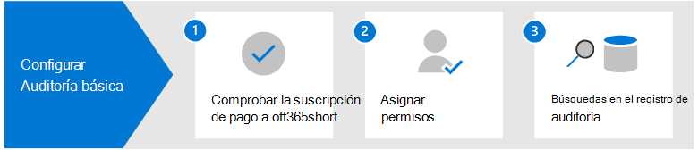

# Configurar auditoría básica en Microsoft 365Set up Basic Audit in Microsoft 365

Auditoría básica en Microsoft 365 permite buscar registros de auditoría para las actividades realizadas en los distintos servicios Microsoft 365 los usuarios y administradores.Basic Audit in Microsoft 365 lets you search for audit records for activities performed in the different Microsoft 365 services by users and admins. Dado que la auditoría básica está habilitada de forma predeterminada para la mayoría de las organizaciones Microsoft 365 y Office 365, solo hay algunas cosas que debe hacer antes de que usted y otros usuarios de su organización puedan buscar en el registro de auditoría.Because Basic Audit is enabled by default for most Microsoft 365 and Office 365 organizations, there's only a few things you need to do before you and others in your organization can search the audit log.

En este artículo se de abordan los siguientes pasos necesarios para configurar la auditoría básica.This article discusses the following steps necessary to set up Basic Audit.

Estos pasos incluyen garantizar las suscripciones organizativas adecuadas y las licencias de usuario necesarias para generar y conservar registros de auditoría y asignar permisos a los miembros del equipo de las operaciones de seguridad, TI, cumplimiento y equipos legales para que puedan buscar en el registro de auditoría.These steps include ensuring the proper organizational subscriptions and user licensing required to generate and preserve audit records and assigning permissions to team members of your security operations, IT, compliance, and legal teams so that can search the audit log.

Para obtener más información, [vea Auditoría básica en Microsoft 365](auditing-solutions-overview.md#basic-audit).For more information, see [Basic Audit in Microsoft 365](auditing-solutions-overview.md#basic-audit).

## Paso 1: Comprobar la suscripción de la organización y las licencias de usuarioStep 1: Verify organization subscription and user licensing

Las licencias para auditoría básica requieren la suscripción de la organización adecuada que proporciona acceso a la herramienta de búsqueda de registros de auditoría y a las licencias por usuario necesarias para registrar y conservar registros de auditoría.Licensing for Basic Audit requires the appropriate organization subscription that provides access to audit log search tool and per-user licensing that's required to log and retain audit records.

Cuando un usuario o administrador realiza una actividad auditada, se genera un registro de auditoría y se almacena en el registro de auditoría de la organización.When an audited activity is performed by a user or admin, an audit record is generated and stored in the audit log for your organization. En Auditoría básica, los registros de auditoría se conservan y se pueden buscar en el registro de auditoría durante 90 días.In Basic Audit, audit records are retained and searchable in the audit log for 90 days.

Para obtener una lista de los requisitos de suscripción y licencias para auditoría básica, vea [Auditing solutions in Microsoft 365](auditing-solutions-overview.md#licensing-requirements).For a list of subscription and licensing requirements for Basic Audit, see [Auditing solutions in Microsoft 365](auditing-solutions-overview.md#licensing-requirements).

## Paso 2: Asignar permisos para buscar en el registro de auditoríaStep 2: Assign permissions to search the audit log

A los administradores y miembros de los equipos de investigación se les debe asignar el rol View-Only registros de auditoría o registros de auditoría en Exchange Online para buscar en el registro de auditoría.Admins and members of investigation teams must be assigned the View-Only Audit Logs or Audit Logs role in Exchange Online to search the audit log. De forma predeterminada, estos roles se asignan a los grupos de roles de Administración de la organización y Administración de cumplimiento en la página de **permisos** del centro de administración de Exchange.By default, these roles are assigned to the Compliance Management and Organization Management role groups on the **Permissions** page in the Exchange admin center. Los administradores globales de Office 365 y Microsoft 365 se agregan automáticamente como miembros del grupo de roles Administración de la organización en Exchange Online.Global administrators in Office 365 and Microsoft 365 are automatically added as members of the Organization Management role group in Exchange Online. Para darle a un usuario la capacidad de buscar en el registro de auditoría con el mínimo nivel de privilegios, puede crear un grupo de roles personalizado en Exchange Online, agregar el rol de Registros de auditoría o Registros de auditoría de solo lectura y, después, agregar el usuario como miembro del nuevo grupo de roles.To give a user the ability to search the audit log with the minimum level of privileges, you can create a custom role group in Exchange Online, add the View-Only Audit Logs or Audit Logs role, and then add the user as a member of the new role group. Para obtener más información, consulte[Administrar grupos de roles en Exchange en línea](/Exchange/permissions-exo/role-groups).For more information, see [Manage role groups in Exchange Online](/Exchange/permissions-exo/role-groups).

En la siguiente captura de pantalla se muestran los dos roles relacionados con la auditoría asignados al grupo de roles administración de la organización en el centro Exchange administración.The following screenshot shows the two audit-related roles assigned to the Organization Management role group in the Exchange admin center.

## Paso 3: Buscar en el registro de auditoríaStep 3: Search the audit log

Ahora ya está listo para buscar el registro de auditoría en el centro Microsoft 365 cumplimiento.Now you're ready to search the audit log in the Microsoft 365 compliance center.

1. Vaya a e inicie sesión con una cuenta a la que se han <https://compliance.microsoft.com> asignado los permisos de auditoría adecuados.Go to <https://compliance.microsoft.com> and sign in using an account that has been assigned the appropriate audit permissions.

2. En el panel de navegación izquierdo del centro de Microsoft 365 cumplimiento, haga clic en **Mostrar todo** y, a continuación, haga clic en **Auditar**.In the left navigation pane of the Microsoft 365 compliance center, click **Show all** and then click **Audit**.

3. En la **página Auditoría,** configure la búsqueda con las siguientes condiciones en la **pestaña** Buscar.On the **Audit** page, configure the search using the following conditions on the **Search** tab. 

   

   1. **Intervalo de fecha y hora**.**Date and time range**. Seleccione un intervalo de fecha y hora para mostrar los eventos que han sucedido en ese período.Select a date and time range to display the events that occurred within that period. La fecha y la hora se muestran en hora local.The date and time are presented in local time. Los últimos siete días están seleccionados de forma predeterminada.The last seven days are selected by default.
  
   2. **Actividades**.**Activities**. Seleccione las actividades que desea buscar.Select the activities to search for. Use el cuadro de búsqueda para buscar actividades para agregar a la lista.Use the search box to search for activities to add to the list. Para obtener una lista parcial de actividades auditadas, vea [Audited activities](search-the-audit-log-in-security-and-compliance.md#audited-activities).For a partial list of audited activities, see [Audited activities](search-the-audit-log-in-security-and-compliance.md#audited-activities). Deje este cuadro en blanco para devolver entradas para todas las actividades auditadas.Leave this box blank to return entries for all audited activities.
  
   3. Usuarios**Users**.  Haga clic en este cuadro y empiece a escribir el nombre de los usuarios para los que mostrar los resultados de la búsqueda.Click in this box and start typing the name of users to display search results for. Las entradas del registro de auditoría de las actividades seleccionadas realizadas por los usuarios seleccionados en este cuadro se muestran en la lista de resultados.The audit log entries for the selected activities performed by the users you select in this box are displayed in the list of results. Deje este cuadro en blanco para devolver las entradas de todos los usuarios (y cuentas de servicio) de su organización.Leave this box blank to return entries for all users (and service accounts) in your organization.
  
   4. **Archivo, carpeta o sitio**.**File, folder, or site**. Escriba algunos o todos los nombres de un archivo o carpeta para buscar actividad relacionada con el archivo de carpeta que contiene la palabra clave especificada.Type some or all of a file or folder name to search for activity related to the file of folder that contains the specified keyword. También puede especificar una dirección URL de un archivo o carpeta.You can also specify a URL of a file or folder. Si usa una dirección URL de un archivo o carpeta, asegúrese de que escriba la ruta de acceso de dirección URL completa o si escribe una parte de la dirección URL, no incluya ningún carácter o espacio especial.If you use a URL of a file or folder, be sure the type the full URL path or if you type a portion of the URL, don't include any special characters or spaces. Deje este cuadro en blanco para devolver las entradas de todos los archivos y carpetas de la organización.Leave this box blank to return entries for all files and folders in your organization.

4. Haga **clic en** Buscar para ejecutar la búsqueda.Click **Search** to run the search.

Se muestra una nueva página que muestra la búsqueda del registro de auditoría que se está ejecutando.A new page is display that shows the audit log search is running. Cuando se completa la búsqueda, los registros de auditoría se muestran en la página.When the search is completed, audit records are displayed on the page. Haga clic en un registro para mostrar una página desplegable con propiedades detalladas.Click a record to display a flyout page with detailed properties.

Para obtener instrucciones más detalladas, vea [Search the audit log in the compliance center](search-the-audit-log-in-security-and-compliance.md).For more detailed instructions, see [Search the audit log in the compliance center](search-the-audit-log-in-security-and-compliance.md).
