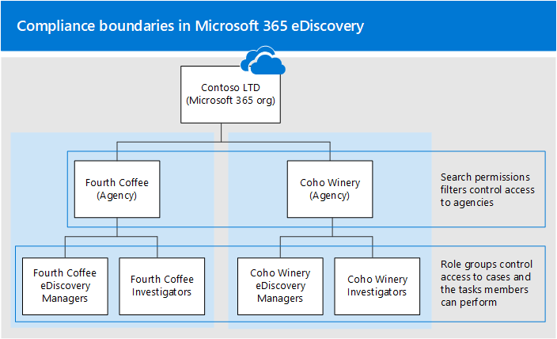

# <a name="set-up-compliance-boundaries-for-ediscovery-investigations"></a><span data-ttu-id="10b8d-103">Configurar límites de cumplimiento para investigaciones de eDiscovery</span><span class="sxs-lookup"><span data-stu-id="10b8d-103">Set up compliance boundaries for eDiscovery investigations</span></span>

<span data-ttu-id="10b8d-104">Las instrucciones de este artículo se pueden aplicar al usar la exhibición de documentos electrónicos principal o la exhibición avanzada de documentos electrónicos para administrar las investigaciones.</span><span class="sxs-lookup"><span data-stu-id="10b8d-104">The guidance in this article can be applied when using either Core eDiscovery or Advanced eDiscovery to manage investigations.</span></span>

<span data-ttu-id="10b8d-105">Los límites de cumplimiento crean límites lógicos dentro de una organización que controlan las ubicaciones de contenido del usuario (como buzones de correo, sitios de SharePoint y cuentas de OneDrive) que los administradores de eDiscovery pueden buscar.</span><span class="sxs-lookup"><span data-stu-id="10b8d-105">Compliance boundaries create logical boundaries within an organization that control the user content locations (such as mailboxes, SharePoint sites, and OneDrive accounts) that eDiscovery managers can search.</span></span> <span data-ttu-id="10b8d-106">Además, los límites de cumplimiento controlan quién puede tener acceso a casos de eDiscovery que se usan para administrar las investigaciones legales, de recursos humanos u otras investigaciones dentro de la organización.</span><span class="sxs-lookup"><span data-stu-id="10b8d-106">Also, compliance boundaries control who can access eDiscovery cases used to manage the legal, human resources, or other investigations within your organization.</span></span> <span data-ttu-id="10b8d-107">La necesidad de límites de cumplimiento suele ser necesaria para las corporaciones multinacionales que deben respetar los reglamentos y las regulaciones geográficas y para los gobiernos, que a menudo se dividen en diferentes agencias.</span><span class="sxs-lookup"><span data-stu-id="10b8d-107">The need for compliance boundaries is often necessary for multi-national corporations that have to respect geographical boarders and regulations and for governments, which are often divided into different agencies.</span></span> <span data-ttu-id="10b8d-108">En Microsoft 365, los límites de cumplimiento le ayudan a cumplir estos requisitos cuando realizan búsquedas de contenido y administran investigaciones con casos de eDiscovery.</span><span class="sxs-lookup"><span data-stu-id="10b8d-108">In Microsoft 365, compliance boundaries help you meet these requirements when performing content searches and managing investigations with eDiscovery cases.</span></span>
  
<span data-ttu-id="10b8d-109">Usamos el ejemplo de la siguiente ilustración para explicar cómo funcionan los límites de cumplimiento.</span><span class="sxs-lookup"><span data-stu-id="10b8d-109">We use the example in the following illustration to explain how compliance boundaries work.</span></span>
  

  
<span data-ttu-id="10b8d-111">En este ejemplo, contoso LTD es una organización que consta de dos subsidiarias, Fourth Coffee y Coho Winery.</span><span class="sxs-lookup"><span data-stu-id="10b8d-111">In this example, Contoso LTD is an organization that consists of two subsidiaries, Fourth Coffee and Coho Winery.</span></span> <span data-ttu-id="10b8d-112">La empresa requiere que los administradores de eDiscovery y los investigadores solo puedan realizar búsquedas en los buzones de Exchange, las cuentas de OneDrive y los sitios de SharePoint de su agencia.</span><span class="sxs-lookup"><span data-stu-id="10b8d-112">The business requires that eDiscovery mangers and investigators can only search the Exchange mailboxes, OneDrive accounts, and SharePoint sites in their agency.</span></span> <span data-ttu-id="10b8d-113">Además, los profesionales de la exhibición de documentos electrónicos y los investigadores solo pueden ver casos de eDiscovery en su agencia y solo pueden acceder a los casos de los que son miembros.</span><span class="sxs-lookup"><span data-stu-id="10b8d-113">Also, eDiscovery managers and investigators can only see eDiscovery cases in their agency, and they can only access the cases that they're a member of.</span></span> <span data-ttu-id="10b8d-114">Aquí se muestra cómo los límites de cumplimiento cumplen estos requisitos.</span><span class="sxs-lookup"><span data-stu-id="10b8d-114">Here's how compliance boundaries meet these requirements.</span></span>
  
- <span data-ttu-id="10b8d-115">La funcionalidad de filtrado de permisos de búsqueda en la búsqueda de contenido controla las ubicaciones de contenido que los administradores y los investigadores de eDiscovery pueden buscar.</span><span class="sxs-lookup"><span data-stu-id="10b8d-115">The search permissions filtering functionality in Content Search controls the content locations that eDiscovery managers and investigators can search.</span></span> <span data-ttu-id="10b8d-116">Esto significa que los administradores de exhibición de documentos electrónicos y los investigadores de la cuarta agencia del café solo pueden buscar ubicaciones de contenido en la sede secundaria de Fourth Coffee.</span><span class="sxs-lookup"><span data-stu-id="10b8d-116">This means eDiscovery managers and investigators in the Fourth Coffee agency can only search content locations in the Fourth Coffee subsidiary.</span></span> <span data-ttu-id="10b8d-117">La misma restricción se aplica a la subsidiaria de Coho Winery.</span><span class="sxs-lookup"><span data-stu-id="10b8d-117">The same restriction applies to the Coho Winery subsidiary.</span></span>

    <span data-ttu-id="10b8d-118">Los grupos de roles controlan quién puede ver los casos de eDiscovery en el centro de seguridad & cumplimiento.</span><span class="sxs-lookup"><span data-stu-id="10b8d-118">Role groups control who can see the eDiscovery cases in the Security & Compliance Center.</span></span> <span data-ttu-id="10b8d-119">Esto significa que los administradores y los investigadores de eDiscovery solo pueden ver los casos de eDiscovery en su agencia.</span><span class="sxs-lookup"><span data-stu-id="10b8d-119">This means that eDiscovery managers and investigators can only see the eDiscovery cases in their agency.</span></span>

- <span data-ttu-id="10b8d-120">Los grupos de roles también controlan quién puede asignar miembros a un caso de exhibición de documentos electrónicos.</span><span class="sxs-lookup"><span data-stu-id="10b8d-120">Role groups also control who can assign members to an eDiscovery case.</span></span> <span data-ttu-id="10b8d-121">Esto significa que los administradores de eDiscovery y los investigadores solo pueden asignar miembros a los casos a los que son miembros.</span><span class="sxs-lookup"><span data-stu-id="10b8d-121">This means eDiscovery managers and investigators can only assign members to cases that they themselves are a member of.</span></span>

<span data-ttu-id="10b8d-122">Este es el proceso para configurar los límites de cumplimiento:</span><span class="sxs-lookup"><span data-stu-id="10b8d-122">Here's the process for setting up compliance boundaries:</span></span>
  
[<span data-ttu-id="10b8d-123">Paso 1: identificar un atributo de usuario para definir las agencias</span><span class="sxs-lookup"><span data-stu-id="10b8d-123">Step 1: Identify a user attribute to define your agencies</span></span>](#step-1-identify-a-user-attribute-to-define-your-agencies)

[<span data-ttu-id="10b8d-124">Paso 2: archivo a solicitud con soporte técnico de Microsoft para sincronizar el atributo de usuario con las cuentas de OneDrive</span><span class="sxs-lookup"><span data-stu-id="10b8d-124">Step 2: File a request with Microsoft Support to synchronize the user attribute to OneDrive accounts</span></span>](#step-2-file-a-request-with-microsoft-support-to-synchronize-the-user-attribute-to-onedrive-accounts)

[<span data-ttu-id="10b8d-125">Paso 3: crear un grupo de roles para cada agencia</span><span class="sxs-lookup"><span data-stu-id="10b8d-125">Step 3: Create a role group for each agency</span></span>](#step-3-create-a-role-group-for-each-agency)

[<span data-ttu-id="10b8d-126">Paso 4: crear un filtro de permisos de búsqueda para aplicar el límite de cumplimiento</span><span class="sxs-lookup"><span data-stu-id="10b8d-126">Step 4: Create a search permissions filter to enforce the compliance boundary</span></span>](#step-4-create-a-search-permissions-filter-to-enforce-the-compliance-boundary)

[<span data-ttu-id="10b8d-127">Paso 5: crear un caso de exhibición de documentos electrónicos para investigaciones dentro de una agencia</span><span class="sxs-lookup"><span data-stu-id="10b8d-127">Step 5: Create an eDiscovery case for an intra-agency investigations</span></span>](#step-5-create-an-ediscovery-case-for-intra-agency-investigations)

## <a name="step-1-identify-a-user-attribute-to-define-your-agencies"></a><span data-ttu-id="10b8d-128">Paso 1: identificar un atributo de usuario para definir las agencias</span><span class="sxs-lookup"><span data-stu-id="10b8d-128">Step 1: Identify a user attribute to define your agencies</span></span>

<span data-ttu-id="10b8d-129">El primer paso es elegir un atributo de Azure Active Directory que se usará para definir las agencias.</span><span class="sxs-lookup"><span data-stu-id="10b8d-129">The first step is to choose an Azure Active Directory attribute to use that will define your agencies.</span></span> <span data-ttu-id="10b8d-130">Este atributo se usa para crear el filtro de permisos de búsqueda que limita a un administrador de exhibición de documentos electrónicos para buscar solo las ubicaciones de contenido de los usuarios que tienen asignado un valor específico para este atributo.</span><span class="sxs-lookup"><span data-stu-id="10b8d-130">This attribute is used to create the search permissions filter that limits an eDiscovery manager to search only the content locations of users who are assigned a specific value for this attribute.</span></span> <span data-ttu-id="10b8d-131">Por ejemplo, supongamos que contoso decide usar el atributo **Department** .</span><span class="sxs-lookup"><span data-stu-id="10b8d-131">For example, let's say Contoso decides to use the **Department** attribute.</span></span> <span data-ttu-id="10b8d-132">El valor de este atributo para los usuarios de la subsidiaria del cuarto café sería  `FourthCoffee`  y el valor para los usuarios de la subsidiaria de Coho Winery sería `CohoWinery` .</span><span class="sxs-lookup"><span data-stu-id="10b8d-132">The value for this attribute for users in the Fourth Coffee subsidiary would be  `FourthCoffee`  and the value for users in Coho Winery subsidiary would be `CohoWinery`.</span></span> <span data-ttu-id="10b8d-133">En el paso 4, use este  `attribute:value`  par (por ejemplo, *Department: fourthcoffee*) para limitar las ubicaciones de contenido del usuario que los administradores de eDiscovery pueden buscar.</span><span class="sxs-lookup"><span data-stu-id="10b8d-133">In Step 4, you use this  `attribute:value`  pair (for example, *Department:FourthCoffee*) to limit the user content locations that eDiscovery managers can search.</span></span> 
  
<span data-ttu-id="10b8d-134">Esta es una lista de atributos de usuario de Azure Active Directory que puede usar para los límites de cumplimiento:</span><span class="sxs-lookup"><span data-stu-id="10b8d-134">Here's a list of Azure Active Directory user attributes that you can use for compliance boundaries:</span></span>
  
- <span data-ttu-id="10b8d-135">Company</span><span class="sxs-lookup"><span data-stu-id="10b8d-135">Company</span></span>

- <span data-ttu-id="10b8d-136">CustomAttribute1-CustomAttribute15</span><span class="sxs-lookup"><span data-stu-id="10b8d-136">CustomAttribute1 - CustomAttribute15</span></span>

- <span data-ttu-id="10b8d-137">Departamento</span><span class="sxs-lookup"><span data-stu-id="10b8d-137">Department</span></span>

- <span data-ttu-id="10b8d-138">Oficina</span><span class="sxs-lookup"><span data-stu-id="10b8d-138">Office</span></span>

- <span data-ttu-id="10b8d-139">C (código de país de dos letras) <sup>\*</sup></span><span class="sxs-lookup"><span data-stu-id="10b8d-139">C (Two-letter country code) <sup>\*</sup></span></span>

  > [!NOTE]
  > <span data-ttu-id="10b8d-140"><sup>\*</sup> Este atributo se asigna a la propiedad CountryOrRegion que se devuelve al ejecutar el cmdlet **Get-User** en Exchange Online PowerShell.</span><span class="sxs-lookup"><span data-stu-id="10b8d-140"><sup>\*</sup> This attribute maps to the CountryOrRegion property that is returned by running the **Get-User** cmdlet in Exchange Online PowerShell.</span></span> <span data-ttu-id="10b8d-141">El cmdlet devuelve el nombre de país localizado, que se convierte a partir del código de país de dos letras.</span><span class="sxs-lookup"><span data-stu-id="10b8d-141">The cmdlet returns the localized country name, which is translated from the two-letter country code.</span></span> <span data-ttu-id="10b8d-142">Para obtener más información, consulte la descripción del parámetro CountryOrRegion en el artículo Referencia del cmdlet [set-User](https://docs.microsoft.com/powershell/module/exchange/set-user) .</span><span class="sxs-lookup"><span data-stu-id="10b8d-142">For more information, see the CountryOrRegion parameter description in the [Set-User](https://docs.microsoft.com/powershell/module/exchange/set-user) cmdlet reference article.</span></span>

<span data-ttu-id="10b8d-143">Aunque hay disponibles más atributos de usuario, especialmente para los buzones de Exchange, los atributos enumerados anteriormente son los únicos compatibles actualmente con OneDrive.</span><span class="sxs-lookup"><span data-stu-id="10b8d-143">Although more user attributes are available, particularly for Exchange mailboxes, the attributes listed above are the only ones currently supported by OneDrive.</span></span>
  
## <a name="step-2-file-a-request-with-microsoft-support-to-synchronize-the-user-attribute-to-onedrive-accounts"></a><span data-ttu-id="10b8d-144">Paso 2: archivo a solicitud con soporte técnico de Microsoft para sincronizar el atributo de usuario con las cuentas de OneDrive</span><span class="sxs-lookup"><span data-stu-id="10b8d-144">Step 2: File a request with Microsoft Support to synchronize the user attribute to OneDrive accounts</span></span>

<span data-ttu-id="10b8d-145">El siguiente paso consiste en archivar una solicitud con soporte técnico de Microsoft para sincronizar el atributo de Azure Active Directory que eligió en el paso 1 para todas las cuentas de OneDrive de la organización.</span><span class="sxs-lookup"><span data-stu-id="10b8d-145">The next step is to file a request with Microsoft Support to synchronize the Azure Active Directory attribute that you chose in Step 1 to all OneDrive accounts in your organization.</span></span> <span data-ttu-id="10b8d-146">Una vez que se ha producido esta sincronización, el atributo (y el valor) que eligió en el paso 1 se asignará a una propiedad administrada oculta denominada `ComplianceAttribute` .</span><span class="sxs-lookup"><span data-stu-id="10b8d-146">After this synchronization occurs, the attribute (and its value) that you chose in Step 1 will be mapped to a hidden managed property named `ComplianceAttribute`.</span></span> <span data-ttu-id="10b8d-147">Use este atributo para crear el filtro de permisos de búsqueda para OneDrive en el paso 4.</span><span class="sxs-lookup"><span data-stu-id="10b8d-147">You use this attribute to create the search permissions filter for OneDrive in Step 4.</span></span>
  
<span data-ttu-id="10b8d-148">Incluya la siguiente información cuando envíe la solicitud a soporte técnico de Microsoft:</span><span class="sxs-lookup"><span data-stu-id="10b8d-148">Include the following information when you submit the request to Microsoft support:</span></span>
  
- <span data-ttu-id="10b8d-149">El nombre de dominio predeterminado de su organización</span><span class="sxs-lookup"><span data-stu-id="10b8d-149">The default domain name of your organization</span></span>

- <span data-ttu-id="10b8d-150">El nombre del atributo de Azure Active Directory (del paso 1)</span><span class="sxs-lookup"><span data-stu-id="10b8d-150">The name of the Azure Active Directory attribute (from Step 1)</span></span>

- <span data-ttu-id="10b8d-151">El título o la descripción siguiente del propósito de la solicitud de soporte técnico: "habilitar la sincronización de OneDrive para la empresa con Azure Active Directory para filtros de seguridad de cumplimiento".</span><span class="sxs-lookup"><span data-stu-id="10b8d-151">The following title or description of the purpose of the support request: "Enable OneDrive for Business Synchronization with Azure Active Directory for Compliance Security Filters".</span></span> <span data-ttu-id="10b8d-152">Esto ayuda a enrutar la solicitud al equipo de ingeniería de eDiscovery que implementa la solicitud.</span><span class="sxs-lookup"><span data-stu-id="10b8d-152">This helps route the request to the eDiscovery engineering team who implements the request.</span></span>

<span data-ttu-id="10b8d-153">Una vez realizado el cambio de ingeniería y se sincronice el atributo con OneDrive, el soporte técnico de Microsoft le enviará el número de compilación en el que se realizó el cambio y una fecha de implementación estimada.</span><span class="sxs-lookup"><span data-stu-id="10b8d-153">After the engineering change is made and the attribute is synchronized to OneDrive, Microsoft Support will send you the build number that the change was made in and an estimated deployment date.</span></span> <span data-ttu-id="10b8d-154">El proceso de implementación suele tardar entre 4 y 6 semanas después de enviar la solicitud de soporte técnico.</span><span class="sxs-lookup"><span data-stu-id="10b8d-154">The deployment process usually takes 4–6 weeks after you submit the support request.</span></span>
  
> [!IMPORTANT]
> <span data-ttu-id="10b8d-155">Puede completar el paso 3 hasta el paso 5 antes de implementar este cambio de atributo.</span><span class="sxs-lookup"><span data-stu-id="10b8d-155">You can complete Step 3 through Step 5 before this attribute change is deployed.</span></span> <span data-ttu-id="10b8d-156">Pero la ejecución de búsquedas de contenido no devolverá documentos de los sitios de OneDrive especificados en el filtro de permisos de búsqueda hasta que se implemente el cambio.</span><span class="sxs-lookup"><span data-stu-id="10b8d-156">But running content searches won't return documents from OneDrive sites specified in the search permissions filter until after the change is deployed.</span></span>
  
## <a name="step-3-create-a-role-group-for-each-agency"></a><span data-ttu-id="10b8d-157">Paso 3: crear un grupo de roles para cada agencia</span><span class="sxs-lookup"><span data-stu-id="10b8d-157">Step 3: Create a role group for each agency</span></span>

<span data-ttu-id="10b8d-158">El siguiente paso es crear los grupos de roles en el centro de seguridad & cumplimiento que se alinearán con las agencias.</span><span class="sxs-lookup"><span data-stu-id="10b8d-158">The next step is to create the role groups in the Security & Compliance Center that will align with your agencies.</span></span> <span data-ttu-id="10b8d-159">Le recomendamos que cree un grupo de roles copiando el grupo integrado de eDiscovery, que agregue los miembros apropiados y quitando roles que puedan no ser aplicables a sus necesidades.</span><span class="sxs-lookup"><span data-stu-id="10b8d-159">We recommend that you create a role group by copying the built-in eDiscovery Managers group, adding the appropriate members, and removing roles that may not be applicable to your needs.</span></span> <span data-ttu-id="10b8d-160">Para obtener más información acerca de los roles relacionados con la exhibición de documentos electrónicos, consulte [asignar permisos de exhibición de documentos electrónicos en el centro de cumplimiento de & de seguridad de Office 365](assign-ediscovery-permissions.md)</span><span class="sxs-lookup"><span data-stu-id="10b8d-160">For more information about eDiscovery-related roles, see [Assign eDiscovery permissions in the Office‍ 365 Security & Compliance Center](assign-ediscovery-permissions.md).</span></span>
  
<span data-ttu-id="10b8d-161">Para crear los grupos de roles, vaya a la página de **permisos** en el centro de seguridad & cumplimiento y cree un grupo de roles para cada equipo en cada agencia que vaya a usar límites de cumplimiento y casos de exhibición de documentos electrónicos para administrar las investigaciones.</span><span class="sxs-lookup"><span data-stu-id="10b8d-161">To create the role groups, go to the **Permissions** page in the Security & Compliance Center and create a role group for each team in each agency that will use compliance boundaries and eDiscovery cases to manage investigations.</span></span> 
  
<span data-ttu-id="10b8d-162">Mediante el escenario de límites de cumplimiento de Contoso, es necesario crear cuatro grupos de roles y agregar los miembros apropiados a cada uno de ellos.</span><span class="sxs-lookup"><span data-stu-id="10b8d-162">Using the Contoso compliance boundaries scenario, four role groups need to be created and the appropriate members added to each one.</span></span>
  
- <span data-ttu-id="10b8d-163">Administradores de exhibición de documentos electrónicos de Fourth Coffee</span><span class="sxs-lookup"><span data-stu-id="10b8d-163">Fourth Coffee eDiscovery Managers</span></span>

- <span data-ttu-id="10b8d-164">Investigadores de Fourth Coffee</span><span class="sxs-lookup"><span data-stu-id="10b8d-164">Fourth Coffee Investigators</span></span>

- <span data-ttu-id="10b8d-165">Administradores de exhibición de documentos electrónicos de Coho Winery</span><span class="sxs-lookup"><span data-stu-id="10b8d-165">Coho Winery eDiscovery Managers</span></span>

- <span data-ttu-id="10b8d-166">Investigadores de Coho Winery</span><span class="sxs-lookup"><span data-stu-id="10b8d-166">Coho Winery Investigators</span></span>
  
## <a name="step-4-create-a-search-permissions-filter-to-enforce-the-compliance-boundary"></a><span data-ttu-id="10b8d-167">Paso 4: crear un filtro de permisos de búsqueda para aplicar el límite de cumplimiento</span><span class="sxs-lookup"><span data-stu-id="10b8d-167">Step 4: Create a search permissions filter to enforce the compliance boundary</span></span>

<span data-ttu-id="10b8d-168">Una vez que haya creado los grupos de roles para cada agencia, el siguiente paso consiste en crear los filtros de permisos de búsqueda que asocian cada grupo de funciones a su agencia específica y define el límite de cumplimiento en sí.</span><span class="sxs-lookup"><span data-stu-id="10b8d-168">After you've created role groups for each agency, the next step is to create the search permissions filters that associate each role group to its specific agency and defines the compliance boundary itself.</span></span> <span data-ttu-id="10b8d-169">Debe crear un filtro de permisos de búsqueda para cada agencia.</span><span class="sxs-lookup"><span data-stu-id="10b8d-169">You need to create one search permissions filter for each agency.</span></span> <span data-ttu-id="10b8d-170">Para obtener más información acerca de la creación de filtros de permisos de seguridad, vea [configurar el filtrado de permisos para búsqueda de contenido](permissions-filtering-for-content-search.md).</span><span class="sxs-lookup"><span data-stu-id="10b8d-170">For more information about creating security permissions filters, see [Configure permissions filtering for Content Search](permissions-filtering-for-content-search.md).</span></span>
  
<span data-ttu-id="10b8d-171">Esta es la sintaxis que se usa para crear un filtro de permisos de búsqueda usado para los límites de cumplimiento.</span><span class="sxs-lookup"><span data-stu-id="10b8d-171">Here's the syntax that's used to create a search permissions filter used for compliance boundaries.</span></span>

```powershell
New-ComplianceSecurityFilter -FilterName <name of filter> -Users <role groups> -Filters "Mailbox_<ComplianceAttribute>  -eq '<AttributeVale> '", "Site_<ComplianceAttribute>  -eq '<AttributeValue>' -or Site_Path -like '<SharePointURL>*'" -Action <Action >
```

<span data-ttu-id="10b8d-172">Esta es una descripción de cada parámetro del comando:</span><span class="sxs-lookup"><span data-stu-id="10b8d-172">Here's a description of each parameter in the command:</span></span>
  
- <span data-ttu-id="10b8d-173">`FilterName`: Especifica el nombre del filtro.</span><span class="sxs-lookup"><span data-stu-id="10b8d-173">`FilterName`: Specifies the name of the filter.</span></span> <span data-ttu-id="10b8d-174">Use un nombre que describa o identifique la agencia en la que se usa el filtro.</span><span class="sxs-lookup"><span data-stu-id="10b8d-174">Use a name that describes or identifies the agency that the filter is used in.</span></span>

- <span data-ttu-id="10b8d-175">`Users`: Especifica los usuarios o grupos que obtienen este filtro aplicado a las acciones de búsqueda de contenido que realizan.</span><span class="sxs-lookup"><span data-stu-id="10b8d-175">`Users`: Specifies the users or groups who get this filter applied to the Content Search actions they perform.</span></span> <span data-ttu-id="10b8d-176">Para los límites de cumplimiento, este parámetro especifica los grupos de roles (que ha creado en el paso 3) en la Agencia para la que está creando el filtro.</span><span class="sxs-lookup"><span data-stu-id="10b8d-176">For compliance boundaries, this parameter specifies the role groups (that you created in Step 3) in the agency that you're creating the filter for.</span></span> <span data-ttu-id="10b8d-177">Nota Este es un parámetro de varios valores para que pueda incluir uno o varios grupos de funciones separados por comas.</span><span class="sxs-lookup"><span data-stu-id="10b8d-177">Note this is a multi-value parameter so you can include one or more role groups, separated by commas.</span></span>

- <span data-ttu-id="10b8d-178">`Filters`: Especifica los criterios de búsqueda para el filtro.</span><span class="sxs-lookup"><span data-stu-id="10b8d-178">`Filters`: Specifies the search criteria for the filter.</span></span> <span data-ttu-id="10b8d-179">Para los límites de cumplimiento, defina los siguientes filtros.</span><span class="sxs-lookup"><span data-stu-id="10b8d-179">For the compliance boundaries, you define the following filters.</span></span> <span data-ttu-id="10b8d-180">Cada uno se aplica a una ubicación de contenido.</span><span class="sxs-lookup"><span data-stu-id="10b8d-180">Each one applies to a content location.</span></span> 

    - <span data-ttu-id="10b8d-181">`Mailbox`: Especifica los buzones de correo que pueden buscar los grupos de roles definidos en el  `Users` parámetro.</span><span class="sxs-lookup"><span data-stu-id="10b8d-181">`Mailbox`: Specifies the mailboxes that the role groups defined in the  `Users` parameter can search.</span></span> <span data-ttu-id="10b8d-182">Para los límites de cumplimiento,  *ComplianceAttribute*  es el mismo atributo que identificó en el paso 1 y  *AttributeValue*  especifica la Agencia.</span><span class="sxs-lookup"><span data-stu-id="10b8d-182">For compliance boundaries,  *ComplianceAttribute*  is the same attribute that you identified in Step 1 and  *AttributeValue*  specifies the agency.</span></span> <span data-ttu-id="10b8d-183">Este filtro permite que los miembros del grupo de roles busquen sólo los buzones de una agencia específica; por ejemplo, `"Mailbox_Department -eq 'FourthCoffee'"` .</span><span class="sxs-lookup"><span data-stu-id="10b8d-183">This filter allows members of the role group to search only the mailboxes in a specific agency; for example, `"Mailbox_Department -eq 'FourthCoffee'"`.</span></span> 

    - <span data-ttu-id="10b8d-184">`Site`: Especifica las cuentas de OneDrive que pueden buscar los grupos de roles definidos en el `Users` parámetro.</span><span class="sxs-lookup"><span data-stu-id="10b8d-184">`Site`: Specifies the OneDrive accounts that the role groups defined in the `Users` parameter can search.</span></span> <span data-ttu-id="10b8d-185">Para el filtro de OneDrive, use la cadena real  `ComplianceAttribute` .</span><span class="sxs-lookup"><span data-stu-id="10b8d-185">For the OneDrive filter, use the actual string  `ComplianceAttribute`.</span></span> <span data-ttu-id="10b8d-186">Esto se asigna al mismo atributo que identificó en el paso 1 y que se sincroniza con las cuentas de OneDrive como resultado de la solicitud de soporte que envió en el paso 2; *AttributeValue*  especifica la Agencia.</span><span class="sxs-lookup"><span data-stu-id="10b8d-186">This maps to the same attribute that you identified in Step 1 and that's synchronized to OneDrive accounts as a result of the support request that you submitted in Step 2; *AttributeValue*  specifies the agency.</span></span> <span data-ttu-id="10b8d-187">Este filtro permite a los miembros del grupo de roles buscar solo en las cuentas de OneDrive de una agencia específica; por ejemplo,  `"Site_ComplianceAttribute -eq 'FourthCoffee'"` .</span><span class="sxs-lookup"><span data-stu-id="10b8d-187">This filter allows members of the role group to search only the OneDrive accounts in a specific agency; for example,  `"Site_ComplianceAttribute -eq 'FourthCoffee'"`.</span></span>

    - <span data-ttu-id="10b8d-188">`Site_Path`: Especifica los sitios de SharePoint que pueden buscar los grupos de roles definidos en el  `Users` parámetro.</span><span class="sxs-lookup"><span data-stu-id="10b8d-188">`Site_Path`: Specifies the SharePoint sites that the role groups defined in the  `Users` parameter can search.</span></span> <span data-ttu-id="10b8d-189">La  *SharePointURL*  especifica los sitios de la agencia que pueden buscar los miembros del grupo de roles.</span><span class="sxs-lookup"><span data-stu-id="10b8d-189">The  *SharePointURL*  specifies the sites in the agency that members of the role group can search.</span></span> <span data-ttu-id="10b8d-190">Por ejemplo, `"Site_Path -like 'https://contoso.sharepoint.com/sites/FourthCoffee*'"`.</span><span class="sxs-lookup"><span data-stu-id="10b8d-190">For example,  `"Site_Path -like 'https://contoso.sharepoint.com/sites/FourthCoffee*'"`.</span></span> <span data-ttu-id="10b8d-191">Observe que `Site` los `Site_Path` filtros y están conectados por un operador **or** .</span><span class="sxs-lookup"><span data-stu-id="10b8d-191">Notice the `Site` and `Site_Path` filters are connected by an **-or** operator.</span></span>

     > [!NOTE]
     > <span data-ttu-id="10b8d-192">La sintaxis del `Filters` parámetro incluye una *lista de filtros*.</span><span class="sxs-lookup"><span data-stu-id="10b8d-192">The syntax for the `Filters` parameter includes a *filters list*.</span></span> <span data-ttu-id="10b8d-193">Una lista de filtros es un filtro que incluye un filtro de buzón y un filtro de sitio separados por una coma.</span><span class="sxs-lookup"><span data-stu-id="10b8d-193">A filters list is a filter that includes a mailbox filter and a site filter separated by a comma.</span></span> <span data-ttu-id="10b8d-194">En el ejemplo anterior, observe que una coma separa **Mailbox_ComplianceAttribute** y **Site_ComplianceAttribute**: `-Filters "Mailbox_<ComplianceAttribute>  -eq '<AttributeVale> '", "Site_ComplianceAttribute  -eq '<AttributeValue>' -or Site_Path -like '<SharePointURL>*'"` .</span><span class="sxs-lookup"><span data-stu-id="10b8d-194">In the previous example, notice that a comma separates **Mailbox_ComplianceAttribute** and **Site_ComplianceAttribute**: `-Filters "Mailbox_<ComplianceAttribute>  -eq '<AttributeVale> '", "Site_ComplianceAttribute  -eq '<AttributeValue>' -or Site_Path -like '<SharePointURL>*'"`.</span></span> <span data-ttu-id="10b8d-195">Cuando este filtro se procesa durante la ejecución de una búsqueda de contenido, se crean dos filtros de permisos de búsqueda a partir de la lista Filtros: un filtro de buzón y un filtro de sitio.</span><span class="sxs-lookup"><span data-stu-id="10b8d-195">When this filter is processed during the running of a content search, two search permissions filters are created from the filters list: one mailbox filter and one site filter.</span></span> <span data-ttu-id="10b8d-196">Una alternativa al uso de una lista de filtros sería crear dos filtros de permisos de búsqueda independientes para cada agencia: un filtro de permisos de búsqueda para el atributo Mailbox y un filtro para los atributos site.</span><span class="sxs-lookup"><span data-stu-id="10b8d-196">An alternative to using a filters list would be to create two separate search permissions filters for each agency: one search permissions filter for the mailbox attribute and one filter for the site attributes.</span></span> <span data-ttu-id="10b8d-197">En cualquier caso, los resultados serán los mismos.</span><span class="sxs-lookup"><span data-stu-id="10b8d-197">In either case, the results will be the same.</span></span> <span data-ttu-id="10b8d-198">El uso de una lista de filtros o la creación de filtros de permisos de búsqueda independientes es una cuestión de preferencia.</span><span class="sxs-lookup"><span data-stu-id="10b8d-198">Using a filters list or creating separate search permissions filters is a matter of preference.</span></span>

- <span data-ttu-id="10b8d-199">`Action`: Especifica el tipo de acción de búsqueda de cumplimiento a la que se aplica el filtro.</span><span class="sxs-lookup"><span data-stu-id="10b8d-199">`Action`: Specifies the type of Compliance Search action that the filter is applied to.</span></span> <span data-ttu-id="10b8d-200">Por ejemplo,  `-Action Search` solo aplicaría el filtro cuando los miembros del grupo de roles definidos en el `Users` parámetro ejecuten una búsqueda de contenido.</span><span class="sxs-lookup"><span data-stu-id="10b8d-200">For example,  `-Action Search` would only apply the filter when members of the role group defined in the `Users` parameter run a content search.</span></span> <span data-ttu-id="10b8d-201">En este caso, el filtro no se aplicaría al exportar los resultados de la búsqueda.</span><span class="sxs-lookup"><span data-stu-id="10b8d-201">In this case, the filter wouldn't be applied when exporting search results.</span></span> <span data-ttu-id="10b8d-202">Para los límites de cumplimiento, use para  `-Action All` que el filtro se aplique a todas las acciones de búsqueda.</span><span class="sxs-lookup"><span data-stu-id="10b8d-202">For compliance boundaries, use  `-Action All` so the filter applies to all search actions.</span></span> 

    <span data-ttu-id="10b8d-203">Para obtener una lista de las acciones de búsqueda de contenido, consulte la sección "New-ComplianceSecurityFilter" en [configurar el filtrado de permisos para la búsqueda de contenido](permissions-filtering-for-content-search.md#new-compliancesecurityfilter).</span><span class="sxs-lookup"><span data-stu-id="10b8d-203">For a list of the Content Search actions, see the "New-ComplianceSecurityFilter" section in [Configure permissions filtering for Content Search](permissions-filtering-for-content-search.md#new-compliancesecurityfilter).</span></span>

<span data-ttu-id="10b8d-204">A continuación, se muestran ejemplos de los dos filtros de permisos de búsqueda que se crearían para admitir el escenario de límites de cumplimiento de contoso.</span><span class="sxs-lookup"><span data-stu-id="10b8d-204">Here are examples of the two search permissions filters that would be created to support the Contoso compliance boundaries scenario.</span></span> <span data-ttu-id="10b8d-205">Ambos ejemplos incluyen una lista de filtros separados por comas, en la que los filtros de buzón de correo y sitio se incluyen en el mismo filtro de permisos de búsqueda y están separados por una coma.</span><span class="sxs-lookup"><span data-stu-id="10b8d-205">Both of these examples include a comma-separated filters list, in which the mailbox and site filters are included in the same search permissions filter and are separated by a comma.</span></span>
  
### <a name="fourth-coffee"></a><span data-ttu-id="10b8d-206">Fourth Coffee</span><span class="sxs-lookup"><span data-stu-id="10b8d-206">Fourth Coffee</span></span>

```powershell
New-ComplianceSecurityFilter -FilterName "Fourth Coffee Security Filter" -Users "Fourth Coffee eDiscovery Managers", "Fourth Coffee Investigators" -Filters "Mailbox_Department -eq 'FourthCoffee'", "Site_ComplianceAttribute -eq 'FourthCoffee' -or Site_Path -like 'https://contoso.sharepoint.com/sites/FourthCoffee*'" -Action ALL
```

### <a name="coho-winery"></a><span data-ttu-id="10b8d-207">Bodega Coho</span><span class="sxs-lookup"><span data-stu-id="10b8d-207">Coho Winery</span></span>

```powershell
New-ComplianceSecurityFilter -FilterName "Coho Winery Security Filter" -Users "Coho Winery eDiscovery Managers", "Coho Winery Investigators" -Filters "Mailbox_Department -eq 'CohoWinery'", "Site_ComplianceAttribute -eq 'CohoWinery' -or Site_Path -like 'https://contoso.sharepoint.com/sites/CohoWinery*'" -Action ALL
```

## <a name="step-5-create-an-ediscovery-case-for-intra-agency-investigations"></a><span data-ttu-id="10b8d-208">Paso 5: crear un caso de exhibición de documentos electrónicos para investigaciones dentro de la Agencia</span><span class="sxs-lookup"><span data-stu-id="10b8d-208">Step 5: Create an eDiscovery case for intra-agency investigations</span></span>

<span data-ttu-id="10b8d-209">El último paso consiste en crear un caso de exhibición de documentos electrónicos en el centro de seguridad & cumplimiento y, a continuación, agregar el grupo de roles que ha creado en el paso 3 como miembro del caso.</span><span class="sxs-lookup"><span data-stu-id="10b8d-209">The final step is to create a eDiscovery case in the Security & Compliance Center and then add the role group that you created in Step 3 as a member of the case.</span></span> <span data-ttu-id="10b8d-210">Esto da como resultado dos características importantes del uso de límites de cumplimiento:</span><span class="sxs-lookup"><span data-stu-id="10b8d-210">This results in two important characteristics of using compliance boundaries:</span></span>
  
- <span data-ttu-id="10b8d-211">Solo los miembros del grupo de funciones agregados al caso podrán ver y acceder al caso en el centro de seguridad & cumplimiento.</span><span class="sxs-lookup"><span data-stu-id="10b8d-211">Only members of the role group added to the case will be able to see and access the case in the Security & Compliance Center.</span></span> <span data-ttu-id="10b8d-212">Por ejemplo, si el grupo de funciones de Fourth Coffee es el único miembro de un caso, los miembros del grupo de roles de administradores de exhibición de documentos electrónicos de Fourth Coffee (o los miembros de cualquier otro grupo de roles) no podrán ver ni acceder al caso.</span><span class="sxs-lookup"><span data-stu-id="10b8d-212">For example, if the Fourth Coffee Investigators role group is the only member of a case, then members of the Fourth Coffee eDiscovery Managers role group (or members of any other role group) won't be able to see or access the case.</span></span>

- <span data-ttu-id="10b8d-213">Cuando un miembro del grupo de funciones asignado a un caso ejecuta una búsqueda asociada con el caso, solo podrá buscar en las ubicaciones de contenido de su agencia (definido por el filtro de permisos de búsqueda que creó en el paso 4).</span><span class="sxs-lookup"><span data-stu-id="10b8d-213">When a member of the role group assigned to a case runs a search associated with the case, they will only be able to search the content locations within their agency (which is defined by the search permissions filter that you created in Step 4.)</span></span>

<span data-ttu-id="10b8d-214">Para crear un caso y asignar miembros:</span><span class="sxs-lookup"><span data-stu-id="10b8d-214">To create a case and assign members:</span></span>

1. <span data-ttu-id="10b8d-215">Vaya a la **eDiscovery** página exhibición **avanzada** de documentos electrónicos o exhibición de documentos electrónicos en el centro de seguridad & cumplimiento y cree un caso.</span><span class="sxs-lookup"><span data-stu-id="10b8d-215">Go to the **eDiscovery** or **Advanced eDiscovery** page in the Security & Compliance Center and create a case.</span></span>

2. <span data-ttu-id="10b8d-216">En la lista de casos de eDiscovery, haga clic en el nombre del caso que ha creado.</span><span class="sxs-lookup"><span data-stu-id="10b8d-216">In the list of eDiscovery cases, click the name of the case you created.</span></span>

3. <span data-ttu-id="10b8d-217">En la página desplegable **administrar este caso** , en **administrar grupos de roles**, haga clic en  **Agregar**.</span><span class="sxs-lookup"><span data-stu-id="10b8d-217">In the **Manage this case** flyout page, under **Manage role groups**, click  **Add**.</span></span>

    
  
4. <span data-ttu-id="10b8d-219">En la lista de grupos de roles, seleccione uno de los grupos de roles que ha creado en el paso 3 y haga clic en **Agregar**.</span><span class="sxs-lookup"><span data-stu-id="10b8d-219">In the list of role groups, select one of the role groups that you created in Step 3, and click **Add**.</span></span>

5. <span data-ttu-id="10b8d-220">Haga clic en **Guardar** en el control flotante **administrar este caso** para guardar el cambio.</span><span class="sxs-lookup"><span data-stu-id="10b8d-220">Click **Save** on the **Manage this case** flyout to save the change.</span></span>

## <a name="searching-and-exporting-content-in-multi-geo-environments"></a><span data-ttu-id="10b8d-221">Búsqueda y exportación de contenido en entornos multigeográfico</span><span class="sxs-lookup"><span data-stu-id="10b8d-221">Searching and exporting content in Multi-Geo environments</span></span>

<span data-ttu-id="10b8d-222">Los filtros de permisos de búsqueda también permiten controlar dónde se enruta el contenido para la exportación y en qué centro de datos se puede buscar al buscar ubicaciones de contenido en un [entorno multigeográfico de SharePoint](https://go.microsoft.com/fwlink/?linkid=860840).</span><span class="sxs-lookup"><span data-stu-id="10b8d-222">Search permissions filters also let you control where content is routed for export and which datacenter can be searched when searching content locations in a [SharePoint Multi-Geo environment](https://go.microsoft.com/fwlink/?linkid=860840).</span></span>
  
- <span data-ttu-id="10b8d-223">**Exportar resultados de la búsqueda:** Puede exportar los resultados de la búsqueda de los buzones de Exchange, los sitios de SharePoint y las cuentas de OneDrive desde un centro de información específico.</span><span class="sxs-lookup"><span data-stu-id="10b8d-223">**Export search results:** You can export the search results from Exchange mailboxes, SharePoint sites, and OneDrive accounts from a specific datacenter.</span></span> <span data-ttu-id="10b8d-224">Esto significa que puede especificar la ubicación del centro de recursos desde la que se exportarán los resultados de la búsqueda.</span><span class="sxs-lookup"><span data-stu-id="10b8d-224">This means that you can specify the datacenter location that search results will be exported from.</span></span>

    <span data-ttu-id="10b8d-225">Use el parámetro **Region** para los cmdlets **New-ComplianceSecurityFilter** o **set-ComplianceSecurityFilter** para crear o cambiar el centro de recursos al que se redirigirá la exportación.</span><span class="sxs-lookup"><span data-stu-id="10b8d-225">Use the **Region** parameter for **New-ComplianceSecurityFilter** or **Set-ComplianceSecurityFilter** cmdlets to create or change which datacenter the export will be routed through.</span></span>
  
    |<span data-ttu-id="10b8d-226">**Valor del parámetro**</span><span class="sxs-lookup"><span data-stu-id="10b8d-226">**Parameter value**</span></span>|<span data-ttu-id="10b8d-227">**Ubicación del centro de recursos**</span><span class="sxs-lookup"><span data-stu-id="10b8d-227">**Datacenter location**</span></span>|
    |:-----|:-----|
    |<span data-ttu-id="10b8d-228">NAM</span><span class="sxs-lookup"><span data-stu-id="10b8d-228">NAM</span></span>  <br/> |<span data-ttu-id="10b8d-229">Norteamérica (centros de administración de centros de recursos en los Estados Unidos)</span><span class="sxs-lookup"><span data-stu-id="10b8d-229">North American (datacenters are in the US)</span></span>  <br/> |
    |<span data-ttu-id="10b8d-230">EUR</span><span class="sxs-lookup"><span data-stu-id="10b8d-230">EUR</span></span>  <br/> |<span data-ttu-id="10b8d-231">Europa</span><span class="sxs-lookup"><span data-stu-id="10b8d-231">Europe</span></span>  <br/> |
    |<span data-ttu-id="10b8d-232">APC</span><span class="sxs-lookup"><span data-stu-id="10b8d-232">APC</span></span>  <br/> |<span data-ttu-id="10b8d-233">Asia Pacífico</span><span class="sxs-lookup"><span data-stu-id="10b8d-233">Asia Pacific</span></span>  <br/> |
    |<span data-ttu-id="10b8d-234">CAN</span><span class="sxs-lookup"><span data-stu-id="10b8d-234">CAN</span></span> <br/> |<span data-ttu-id="10b8d-235">Canadá</span><span class="sxs-lookup"><span data-stu-id="10b8d-235">Canada</span></span>|
    |||

- <span data-ttu-id="10b8d-236">**Búsquedas de contenido de ruta:** Puede enrutar las búsquedas de contenido de los sitios de SharePoint y las cuentas de OneDrive a un centro de datos satélite.</span><span class="sxs-lookup"><span data-stu-id="10b8d-236">**Route content searches:** You can route the content searches of SharePoint sites and OneDrive accounts to a satellite data center.</span></span> <span data-ttu-id="10b8d-237">Esto significa que puede especificar la ubicación del centro de recursos donde se ejecutarán las búsquedas.</span><span class="sxs-lookup"><span data-stu-id="10b8d-237">This means you can specify the datacenter location where searches will be run.</span></span>

    <span data-ttu-id="10b8d-238">Use uno de los siguientes valores para el parámetro **Region** para controlar la ubicación del centro de recursos en la que se ejecutarán las búsquedas al buscar en los sitios de SharePoint y las cuentas de OneDrive.</span><span class="sxs-lookup"><span data-stu-id="10b8d-238">Use one of the following values for the **Region** parameter to control the datacenter location that searches will run in when searching SharePoint sites and OneDrive accounts.</span></span> 
  
    |<span data-ttu-id="10b8d-239">**Valor del parámetro**</span><span class="sxs-lookup"><span data-stu-id="10b8d-239">**Parameter value**</span></span>|<span data-ttu-id="10b8d-240">**Ubicaciones de enrutamiento de centro de recursos de SharePoint**</span><span class="sxs-lookup"><span data-stu-id="10b8d-240">**Datacenter routing locations for SharePoint**</span></span>|
    |:-----|:-----|
    |<span data-ttu-id="10b8d-241">NAM</span><span class="sxs-lookup"><span data-stu-id="10b8d-241">NAM</span></span>  <br/> |<span data-ttu-id="10b8d-242">Infórmenos</span><span class="sxs-lookup"><span data-stu-id="10b8d-242">US</span></span>  <br/> |
    |<span data-ttu-id="10b8d-243">EUR</span><span class="sxs-lookup"><span data-stu-id="10b8d-243">EUR</span></span>  <br/> |<span data-ttu-id="10b8d-244">Europa</span><span class="sxs-lookup"><span data-stu-id="10b8d-244">Europe</span></span>  <br/> |
    |<span data-ttu-id="10b8d-245">APC</span><span class="sxs-lookup"><span data-stu-id="10b8d-245">APC</span></span>  <br/> |<span data-ttu-id="10b8d-246">Asia Pacífico</span><span class="sxs-lookup"><span data-stu-id="10b8d-246">Asia Pacific</span></span>  <br/> |
    |<span data-ttu-id="10b8d-247">CAN</span><span class="sxs-lookup"><span data-stu-id="10b8d-247">CAN</span></span>  <br/> |<span data-ttu-id="10b8d-248">Infórmenos</span><span class="sxs-lookup"><span data-stu-id="10b8d-248">US</span></span>  <br/> |
    |<span data-ttu-id="10b8d-249">AUS</span><span class="sxs-lookup"><span data-stu-id="10b8d-249">AUS</span></span>  <br/> |<span data-ttu-id="10b8d-250">Asia Pacífico</span><span class="sxs-lookup"><span data-stu-id="10b8d-250">Asia Pacific</span></span>  <br/> |
    |<span data-ttu-id="10b8d-251">KOR</span><span class="sxs-lookup"><span data-stu-id="10b8d-251">KOR</span></span>  <br/> |<span data-ttu-id="10b8d-252">Centro de recursos predeterminado de la organización</span><span class="sxs-lookup"><span data-stu-id="10b8d-252">The organization's default datacenter</span></span>  <br/> |
    |<span data-ttu-id="10b8d-253">GBR</span><span class="sxs-lookup"><span data-stu-id="10b8d-253">GBR</span></span>  <br/> |<span data-ttu-id="10b8d-254">Europa</span><span class="sxs-lookup"><span data-stu-id="10b8d-254">Europe</span></span>  <br/> |
    |<span data-ttu-id="10b8d-255">JPN</span><span class="sxs-lookup"><span data-stu-id="10b8d-255">JPN</span></span>  <br/> |<span data-ttu-id="10b8d-256">Asia Pacífico</span><span class="sxs-lookup"><span data-stu-id="10b8d-256">Asia Pacific</span></span>  <br/> |
    |<span data-ttu-id="10b8d-257">IND</span><span class="sxs-lookup"><span data-stu-id="10b8d-257">IND</span></span>  <br/> |<span data-ttu-id="10b8d-258">Asia Pacífico</span><span class="sxs-lookup"><span data-stu-id="10b8d-258">Asia Pacific</span></span>  <br/> |
    |<span data-ttu-id="10b8d-259">LAM</span><span class="sxs-lookup"><span data-stu-id="10b8d-259">LAM</span></span>  <br/> |<span data-ttu-id="10b8d-260">Infórmenos</span><span class="sxs-lookup"><span data-stu-id="10b8d-260">US</span></span>  <br/> |
    |||

   <span data-ttu-id="10b8d-261">Si no especifica el parámetro **Region** para un filtro de permisos de búsqueda, se buscará en la región de SharePoint predeterminada de la organización.</span><span class="sxs-lookup"><span data-stu-id="10b8d-261">If you don't specify the **Region** parameter for a search permissions filter, the organization's default SharePoint region will be searched.</span></span> <span data-ttu-id="10b8d-262">Los resultados de la búsqueda se exportan al centro de recursos más cercano.</span><span class="sxs-lookup"><span data-stu-id="10b8d-262">Search results are exported to the closest datacenter.</span></span>

   <span data-ttu-id="10b8d-263">Para simplificar el concepto, el parámetro **Region** controla el centro de datos que se usa para buscar contenido en SharePoint y OneDrive.</span><span class="sxs-lookup"><span data-stu-id="10b8d-263">To simplify the concept, the **Region** parameter controls the datacenter that is used to search for content in SharePoint and OneDrive.</span></span> <span data-ttu-id="10b8d-264">Esto no se aplica a la búsqueda de contenido en Exchange porque las búsquedas de contenido de Exchange no están vinculadas por la ubicación geográfica de los centros de datos.</span><span class="sxs-lookup"><span data-stu-id="10b8d-264">This doesn't apply to searching for content in Exchange because Exchange content searches aren't bound by the geographic location of datacenters.</span></span> <span data-ttu-id="10b8d-265">Además, el mismo valor de parámetro **Region** también puede indicar el centro de recursos al que se redirigen las exportaciones.</span><span class="sxs-lookup"><span data-stu-id="10b8d-265">Also, the same **Region** parameter value may also dictate the datacenter that exports are routed through.</span></span> <span data-ttu-id="10b8d-266">Esto suele ser necesario para controlar el movimiento de datos entre los tableros geográficos.</span><span class="sxs-lookup"><span data-stu-id="10b8d-266">This is often necessary to control the movement of data across geographic boarders.</span></span>

> [!NOTE]
> <span data-ttu-id="10b8d-267">Si está usando la exhibición avanzada de documentos electrónicos, el parámetro **Region** no controla la región desde la que se exportan los datos.</span><span class="sxs-lookup"><span data-stu-id="10b8d-267">If you're using Advanced eDiscovery, the **Region** parameter doesn't control the region that data is exported from.</span></span> <span data-ttu-id="10b8d-268">Además, la búsqueda de contenido en SharePoint y OneDrive no depende de la ubicación geográfica de los centros de datos.</span><span class="sxs-lookup"><span data-stu-id="10b8d-268">Also, searching for content in SharePoint and OneDrive isn't bound by the geographic location of datacenters.</span></span> <span data-ttu-id="10b8d-269">Se busca en todos los centros de recursos.</span><span class="sxs-lookup"><span data-stu-id="10b8d-269">All datacenters are searched.</span></span> <span data-ttu-id="10b8d-270">Para obtener más información acerca de la exhibición avanzada de documentos electrónicos, vea [Overview of The Advanced eDiscovery Solution en Microsoft 365](overview-ediscovery-20.md).</span><span class="sxs-lookup"><span data-stu-id="10b8d-270">For more information about Advanced eDiscovery, see [Overview of the Advanced eDiscovery solution in Microsoft 365](overview-ediscovery-20.md).</span></span>

<span data-ttu-id="10b8d-271">A continuación, se muestran ejemplos de cómo usar el parámetro **Region** al crear filtros de permisos de búsqueda para límites de cumplimiento.</span><span class="sxs-lookup"><span data-stu-id="10b8d-271">Here are examples of using the **Region** parameter when creating search permission filters for compliance boundaries.</span></span> <span data-ttu-id="10b8d-272">Esto supone que la subsidiaria de Fourth Coffee se encuentra en Norteamérica y que Coho Winery está en Europa.</span><span class="sxs-lookup"><span data-stu-id="10b8d-272">This assumes that the Fourth Coffee subsidiary is located in North America and that Coho Winery is in Europe.</span></span> 
  
```powershell
New-ComplianceSecurityFilter -FilterName "Fourth Coffee Security Filter" -Users "Fourth Coffee eDiscovery Managers", "Fourth Coffee Investigators" -Filters "Mailbox_Department -eq 'FourthCoffee'", "Site_Department -eq 'FourthCoffee' -or Site_Path -like 'https://contoso.sharepoint.com/sites/FourthCoffee*'" -Action ALL -Region NAM
```

```powershell
New-ComplianceSecurityFilter -FilterName "Coho Winery Security Filter" -Users "Coho Winery eDiscovery Managers", "Coho Winery Investigators" -Filters "Mailbox_Department -eq 'CohoWinery'", "Site_Department -eq 'CohoWinery' -or Site_Path -like 'https://contoso.sharepoint.com/sites/CohoWinery*'" -Action ALL -Region EUR
```

<span data-ttu-id="10b8d-273">Tenga en cuenta lo siguiente cuando busque y Exporte contenido en entornos multigeográfico.</span><span class="sxs-lookup"><span data-stu-id="10b8d-273">Keep the following things in mind when searching and exporting content in multi-geo environments.</span></span>
  
- <span data-ttu-id="10b8d-274">El parámetro **Region** no controla las búsquedas de los buzones de Exchange.</span><span class="sxs-lookup"><span data-stu-id="10b8d-274">The **Region** parameter doesn't control searches of Exchange mailboxes.</span></span> <span data-ttu-id="10b8d-275">Se buscará en todos los centros de datos cuando se busque en buzones.</span><span class="sxs-lookup"><span data-stu-id="10b8d-275">All data centers will be searched when you search mailboxes.</span></span> <span data-ttu-id="10b8d-276">Para limitar el ámbito en el que se buscarán los buzones de Exchange, use el parámetro **Filters** al crear o cambiar un filtro de permisos de búsqueda.</span><span class="sxs-lookup"><span data-stu-id="10b8d-276">To limit the scope of which Exchange mailboxes are searched, use the **Filters** parameter when creating or changing a search permissions filter.</span></span> 

- <span data-ttu-id="10b8d-277">Si es necesario que un administrador de eDiscovery busque en varias regiones de SharePoint, debe crear una cuenta de usuario diferente para que el administrador de eDiscovery use en el filtro de permisos de búsqueda para especificar la región donde se encuentran los sitios de SharePoint o las cuentas de OneDrive.</span><span class="sxs-lookup"><span data-stu-id="10b8d-277">If it's necessary for an eDiscovery Manager to search across multiple SharePoint regions, you need to create a different user account for that eDiscovery manager to use in the search permissions filter to specify the region where the SharePoint sites or OneDrive accounts are located.</span></span> <span data-ttu-id="10b8d-278">Para obtener más información acerca de cómo configurar esto, consulte la sección "búsqueda de contenido en un entorno multigeográfico de SharePoint" en [búsqueda de contenido](content-search.md#searching-for-content-in-a-sharepoint-multi-geo-environment).</span><span class="sxs-lookup"><span data-stu-id="10b8d-278">For more information about setting this up, see the "Searching for content in a SharePoint Multi-Geo environment" section in [Content Search](content-search.md#searching-for-content-in-a-sharepoint-multi-geo-environment).</span></span>

- <span data-ttu-id="10b8d-279">Al buscar contenido en SharePoint y OneDrive, el parámetro **Region** dirige las búsquedas a la ubicación principal o satélite donde el administrador de eDiscovery realizará las investigaciones de eDiscovery.</span><span class="sxs-lookup"><span data-stu-id="10b8d-279">When searching for content in SharePoint and OneDrive, the **Region** parameter directs searches to either the main or satellite location where the eDiscovery manager will conduct eDiscovery investigations.</span></span> <span data-ttu-id="10b8d-280">Si un administrador de exhibición de documentos electrónicos busca sitios de SharePoint y OneDrive fuera de la región especificada en el filtro de permisos de búsqueda, no se devuelven resultados de búsqueda.</span><span class="sxs-lookup"><span data-stu-id="10b8d-280">If an eDiscovery manager searches SharePoint and OneDrive sites outside of the region that's specified in the search permissions filter, no search results are returned.</span></span>

- <span data-ttu-id="10b8d-281">Cuando se exportan los resultados de la búsqueda, el contenido de todas las ubicaciones de contenido (incluidos Exchange, Skype empresarial, SharePoint, OneDrive y otros servicios que se pueden buscar mediante la herramienta de búsqueda de contenido) se carga en la ubicación de almacenamiento de Azure en el centro de datos especificado por el parámetro **Region** .</span><span class="sxs-lookup"><span data-stu-id="10b8d-281">When exporting search results, content from all content locations (including Exchange, Skype for Business, SharePoint, OneDrive, and other services that you can search by using the Content Search tool) are uploaded to the Azure Storage location in the datacenter that's specified by the **Region** parameter.</span></span> <span data-ttu-id="10b8d-282">Esto permite a las organizaciones mantener el cumplimiento de las normas al no permitir que el contenido se exporte entre límites controlados.</span><span class="sxs-lookup"><span data-stu-id="10b8d-282">This helps organizations stay within compliance by not allowing content to be exported across controlled borders.</span></span> <span data-ttu-id="10b8d-283">Si no se especifica ninguna región en el filtro de permisos de búsqueda, el contenido se carga en la región predeterminada de la organización.</span><span class="sxs-lookup"><span data-stu-id="10b8d-283">If no region is specified in the search permissions filter, content is uploaded to the organization's default region.</span></span>

- <span data-ttu-id="10b8d-284">Puede editar un filtro de permisos de búsqueda existente para agregar o cambiar la región ejecutando el siguiente comando:</span><span class="sxs-lookup"><span data-stu-id="10b8d-284">You can edit an existing search permissions filter to add or change the region by running the following command:</span></span>

    ```powershell
    Set-ComplianceSecurityFilter -FilterName <Filter name>  -Region <Region>
    ```

## <a name="using-compliance-boundaries-for-sharepoint-hub-sites"></a><span data-ttu-id="10b8d-285">Uso de límites de cumplimiento para sitios de concentradores de SharePoint</span><span class="sxs-lookup"><span data-stu-id="10b8d-285">Using compliance boundaries for SharePoint hub sites</span></span>

<span data-ttu-id="10b8d-286">Los [sitios concentradores de SharePoint](https://docs.microsoft.com/sharepoint/dev/features/hub-site/hub-site-overview) suelen alinearse con los mismos límites geográficos o de agencia que los límites de cumplimiento de eDiscovery siguen.</span><span class="sxs-lookup"><span data-stu-id="10b8d-286">[SharePoint hub sites](https://docs.microsoft.com/sharepoint/dev/features/hub-site/hub-site-overview) often align with the same geographical or agency boundaries that eDiscovery compliance boundaries follow.</span></span> <span data-ttu-id="10b8d-287">Esto significa que puede usar la propiedad site ID del sitio concentrador para crear un límite de cumplimiento.</span><span class="sxs-lookup"><span data-stu-id="10b8d-287">That means you can use the site ID property of the hub site to create a compliance boundary.</span></span> <span data-ttu-id="10b8d-288">Para ello, use el cmdlet [Get-SPOHubSite](https://docs.microsoft.com/powershell/module/sharepoint-online/get-spohubsite#examples) en PowerShell de SharePoint Online para obtener el SiteId del sitio concentrador y, a continuación, use este valor para la propiedad Department ID para crear un filtro de permisos de búsqueda.</span><span class="sxs-lookup"><span data-stu-id="10b8d-288">To do this, use the [Get-SPOHubSite](https://docs.microsoft.com/powershell/module/sharepoint-online/get-spohubsite#examples) cmdlet in SharePoint Online PowerShell to obtain the SiteId for the hub site and then use this value for the department ID property to create a search permissions filter.</span></span>

<span data-ttu-id="10b8d-289">Use la siguiente sintaxis para crear un filtro de permisos de búsqueda para un sitio concentrador de SharePoint:</span><span class="sxs-lookup"><span data-stu-id="10b8d-289">Use the following syntax to create a search permissions filter for a SharePoint hub site:</span></span>

```powershell
New-ComplianceSecurityFilter -FilterName <Filter Name> -Users <User or Group> -Filters "Site_Departmentid -eq '{SiteId of hub site}'" -Action ALL
```

<span data-ttu-id="10b8d-290">A continuación, se muestra un ejemplo de cómo crear un filtro de permisos de búsqueda para un sitio concentrador para la Agencia bodega Coho:</span><span class="sxs-lookup"><span data-stu-id="10b8d-290">Here's an example of creating a search permissions filter for a hub site for the Coho Winery agency:</span></span>

```powershell
New-ComplianceSecurityFilter -FilterName "Coho Winery Hub Site Security Filter" -Users "Coho Winery eDiscovery Managers", "Coho Winery Investigators" -Filters "Site_Departmentid -eq '44252d09-62c4-4913-9eb0-a2a8b8d7f863'" -Action ALL
```

## <a name="compliance-boundary-limitations"></a><span data-ttu-id="10b8d-291">Limitaciones de los límites de cumplimiento</span><span class="sxs-lookup"><span data-stu-id="10b8d-291">Compliance boundary limitations</span></span>

<span data-ttu-id="10b8d-292">Tenga en cuenta las siguientes limitaciones al administrar casos de eDiscovery e investigaciones que usan límites de cumplimiento.</span><span class="sxs-lookup"><span data-stu-id="10b8d-292">Keep the following limitations in mind when managing eDiscovery cases and investigations that use of compliance boundaries.</span></span>
  
- <span data-ttu-id="10b8d-293">Al crear y ejecutar una búsqueda, puede seleccionar ubicaciones de contenido que están fuera de la Agencia.</span><span class="sxs-lookup"><span data-stu-id="10b8d-293">When creating and running a search, you can select content locations that are outside of your agency.</span></span> <span data-ttu-id="10b8d-294">Sin embargo, debido al filtro de permisos de búsqueda, el contenido de esas ubicaciones no se incluye en los resultados de la búsqueda.</span><span class="sxs-lookup"><span data-stu-id="10b8d-294">However, because of the search permissions filter, content from those locations isn't included in the search results.</span></span>

- <span data-ttu-id="10b8d-295">Los límites de cumplimiento no se aplican a las retenciones en casos de eDiscovery.</span><span class="sxs-lookup"><span data-stu-id="10b8d-295">Compliance boundaries don't apply to holds in eDiscovery cases.</span></span> <span data-ttu-id="10b8d-296">Esto significa que un administrador de exhibición de documentos electrónicos en una agencia puede poner a un usuario en suspensión en una agencia diferente.</span><span class="sxs-lookup"><span data-stu-id="10b8d-296">That means an eDiscovery manager in one agency can place a user in a different agency on hold.</span></span> <span data-ttu-id="10b8d-297">Sin embargo, el límite de cumplimiento se aplicará si el administrador de exhibición de documentos electrónicos busca en las ubicaciones de contenido del usuario que se colocó en suspensión.</span><span class="sxs-lookup"><span data-stu-id="10b8d-297">However, the compliance boundary will be enforced if the eDiscovery manager searches the content locations of the user who was placed on hold.</span></span> <span data-ttu-id="10b8d-298">Esto significa que el administrador de exhibición de documentos electrónicos no podrá buscar en las ubicaciones de contenido del usuario, aunque haya podido poner el usuario en espera.</span><span class="sxs-lookup"><span data-stu-id="10b8d-298">That means the eDiscovery manager won't be able search the user's content locations, even though they were able to place the user on hold.</span></span>

    <span data-ttu-id="10b8d-299">Además, la retención de estadísticas solo se aplicará a las ubicaciones de contenido de la Agencia.</span><span class="sxs-lookup"><span data-stu-id="10b8d-299">Also, hold statistics will only apply to content locations in the agency.</span></span>

- <span data-ttu-id="10b8d-300">Los filtros de permisos de búsqueda no se aplican a las carpetas públicas de Exchange.</span><span class="sxs-lookup"><span data-stu-id="10b8d-300">Search permissions filters aren't applied to Exchange public folders.</span></span>

## <a name="frequently-asked-questions"></a><span data-ttu-id="10b8d-301">Preguntas frecuentes</span><span class="sxs-lookup"><span data-stu-id="10b8d-301">Frequently asked questions</span></span>

<span data-ttu-id="10b8d-302">**Quién puede crear y administrar filtros de permisos de búsqueda (con los cmdlets New-ComplianceSecurityFilter y set-ComplianceSecurityFilter)?**</span><span class="sxs-lookup"><span data-stu-id="10b8d-302">**Who can create and manage search permissions filters (using New-ComplianceSecurityFilter and Set-ComplianceSecurityFilter cmdlets)?**</span></span>
  
<span data-ttu-id="10b8d-303">Para crear, ver y modificar los filtros de permisos de búsqueda, debe ser miembro del grupo de roles administración de la organización en el centro de seguridad & cumplimiento.</span><span class="sxs-lookup"><span data-stu-id="10b8d-303">To create, view, and modify search permissions filters, you have to be a member of the Organization Management role group in the Security & Compliance Center.</span></span>
  
<span data-ttu-id="10b8d-304">**Si se asigna un administrador de exhibición de documentos electrónicos a más de un grupo de roles que abarque varias agencias, ¿cómo buscan contenido en una agencia u otra?**</span><span class="sxs-lookup"><span data-stu-id="10b8d-304">**If an eDiscovery manager is assigned to more than one role group that spans multiple agencies, how do they search for content in one agency or the other?**</span></span>
  
<span data-ttu-id="10b8d-305">El administrador de eDiscovery puede agregar parámetros a la consulta de búsqueda que restrinjan la búsqueda a una agencia específica.</span><span class="sxs-lookup"><span data-stu-id="10b8d-305">The eDiscovery manager can add parameters to their search query that restrict the search to a specific agency.</span></span> <span data-ttu-id="10b8d-306">Por ejemplo, si una organización ha especificado la propiedad **CustomAttribute10** para diferenciar las agencias, pueden anexar lo siguiente a su consulta de búsqueda para buscar buzones de correo y cuentas de OneDrive en una agencia específica:  `CustomAttribute10:<value> AND Site_ComplianceAttribute:<value>` .</span><span class="sxs-lookup"><span data-stu-id="10b8d-306">For example, if an organization has specified the **CustomAttribute10** property to differentiate agencies, they can append the following to their search query to search mailboxes and OneDrive accounts in a specific agency:  `CustomAttribute10:<value> AND Site_ComplianceAttribute:<value>`.</span></span>
  
<span data-ttu-id="10b8d-307">**¿Qué sucede si se cambia el valor del atributo que se usa como atributo de cumplimiento en un filtro de permisos de búsqueda?**</span><span class="sxs-lookup"><span data-stu-id="10b8d-307">**What happens if the value of the attribute that's used as the compliance attribute in a search permissions filter is changed?**</span></span>
  
<span data-ttu-id="10b8d-308">Un filtro de permisos de búsqueda tarda hasta tres días en aplicar el límite de cumplimiento si se cambia el valor del atributo que se usa en el filtro.</span><span class="sxs-lookup"><span data-stu-id="10b8d-308">It takes up to three days for a search permissions filter to enforce the compliance boundary if the value of the attribute that's used in the filter is changed.</span></span> <span data-ttu-id="10b8d-309">Por ejemplo, en el escenario de Contoso, supongamos que un usuario de la Agencia de la Fourth Coffee se transfiere a la Agencia de bodega Coho.</span><span class="sxs-lookup"><span data-stu-id="10b8d-309">For example, in the Contoso scenario let's say that a user in the Fourth Coffee agency is transferred to the Coho Winery agency.</span></span> <span data-ttu-id="10b8d-310">Como resultado, el valor del atributo **Department** del objeto de usuario se cambia de *fourthcoffee* a *CohoWinery*.</span><span class="sxs-lookup"><span data-stu-id="10b8d-310">As a result, the value of the **Department** attribute on the user object is changed from *FourthCoffee* to *CohoWinery*.</span></span> <span data-ttu-id="10b8d-311">En esta situación, la exhibición de documentos electrónicos y los inversores de Fourth Coffee obtendrán resultados de búsqueda para ese usuario durante un máximo de tres días a partir de la modificación del atributo.</span><span class="sxs-lookup"><span data-stu-id="10b8d-311">In this situation, Fourth Coffee eDiscovery and investors will get search results for that user for up three days after the attribute is changed.</span></span> <span data-ttu-id="10b8d-312">De forma similar, tarda hasta tres días antes de que los profesionales de eDiscovery y los investigadores de Coho Winery obtengan resultados de búsqueda para el usuario.</span><span class="sxs-lookup"><span data-stu-id="10b8d-312">Similarly, it takes up to three days before Coho Winery eDiscovery managers and investigators get search results for the user.</span></span>
  
<span data-ttu-id="10b8d-313">**¿Puede un administrador de exhibición de documentos electrónicos ver contenido de dos límites de cumplimiento independientes?**</span><span class="sxs-lookup"><span data-stu-id="10b8d-313">**Can an eDiscovery manager see content from two separate compliance boundaries?**</span></span>
  
<span data-ttu-id="10b8d-314">Sí, esto se puede hacer al buscar buzones de correo de Exchange agregando el administrador de eDiscovery a los grupos de roles que tienen visibilidad para ambas agencias.</span><span class="sxs-lookup"><span data-stu-id="10b8d-314">Yes, this can be done when searching Exchange mailboxes by adding the eDiscovery manager to role groups that have visibility to both agencies.</span></span> <span data-ttu-id="10b8d-315">Sin embargo, al buscar en los sitios de SharePoint y en las cuentas de OneDrive, el administrador de eDiscovery puede buscar contenido en diferentes límites de cumplimiento solo si las agencias están en la misma región o ubicación geográfica.</span><span class="sxs-lookup"><span data-stu-id="10b8d-315">However when searching SharePoint sites and OneDrive accounts, an eDiscovery manager can search for content in different compliance boundaries only if the agencies are in the same region or geo location.</span></span> <span data-ttu-id="10b8d-316">**Nota:** Esta limitación para los sitios no se aplica en la exhibición avanzada de documentos electrónicos porque la búsqueda de contenido en SharePoint y OneDrive no depende de la ubicación geográfica.</span><span class="sxs-lookup"><span data-stu-id="10b8d-316">**Note:** This limitation for sites doesn't apply in Advanced eDiscovery because searching for content in SharePoint and OneDrive isn't bound by geographic location.</span></span>
  
<span data-ttu-id="10b8d-317">**¿Funcionan los filtros de permisos de búsqueda en las suspensiones de casos de eDiscovery, las directivas de retención de Microsoft 365 o DLP?**</span><span class="sxs-lookup"><span data-stu-id="10b8d-317">**Do search permissions filters work for eDiscovery case holds, Microsoft 365 retention policies, or DLP?**</span></span>
  
<span data-ttu-id="10b8d-318">No, no en este momento.</span><span class="sxs-lookup"><span data-stu-id="10b8d-318">No, not at this time.</span></span>
  
<span data-ttu-id="10b8d-319">**Si especifica una región para controlar dónde se exporta el contenido, pero no tengo una organización de SharePoint en esa región, ¿puedo seguir buscando en SharePoint?**</span><span class="sxs-lookup"><span data-stu-id="10b8d-319">**If I specify a region to control where content is exported, but I don't have a SharePoint organization in that region, can I still search SharePoint?**</span></span>
  
<span data-ttu-id="10b8d-320">Si el área especificada en el filtro de permisos de búsqueda no existe en la organización, se buscará en la región predeterminada.</span><span class="sxs-lookup"><span data-stu-id="10b8d-320">If the region specified in the search permissions filter doesn't exist in your organization, the default region will be searched.</span></span>
  
<span data-ttu-id="10b8d-321">**¿Cuál es el número máximo de filtros de permisos de búsqueda que se pueden crear en una organización?**</span><span class="sxs-lookup"><span data-stu-id="10b8d-321">**What is the maximum number of search permissions filters that can be created in an organization?**</span></span>
  
<span data-ttu-id="10b8d-322">No hay ningún límite en el número de filtros de permisos de búsqueda que se pueden crear en una organización.</span><span class="sxs-lookup"><span data-stu-id="10b8d-322">There is no limit to the number of search permissions filters that can be created in an organization.</span></span> <span data-ttu-id="10b8d-323">Sin embargo, el rendimiento de la búsqueda se verá afectado cuando haya más de 100 filtros de permisos de búsqueda.</span><span class="sxs-lookup"><span data-stu-id="10b8d-323">However, search performance will be impacted when there are more than 100 search permissions filters.</span></span> <span data-ttu-id="10b8d-324">Para mantener el número de filtros de permisos de búsqueda en la organización tan pequeños como sea posible, cree filtros que combinen las reglas para Exchange, SharePoint y OneDrive en un único filtro de permisos de búsqueda siempre que sea posible.</span><span class="sxs-lookup"><span data-stu-id="10b8d-324">To keep the number of search permissions filters in your organization as small as possible, create filters that combine rules for Exchange, SharePoint, and OneDrive into a single search permissions filter whenever possible.</span></span>
