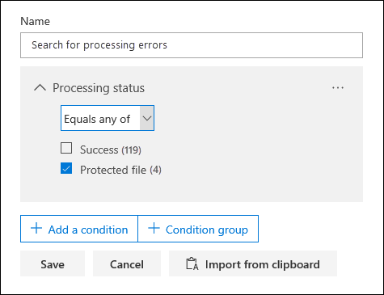

# Corrección de errores de un único elementoSingle item error remediation

La corrección de errores proporciona a los usuarios avanzados de eDiscovery la capacidad de rectificar problemas de datos que impiden que eDiscovery avanzado procese correctamente el contenido.Error remediation gives Advanced eDiscovery users the ability to rectify data issues that prevent Advanced eDiscovery from properly processing the content. Por ejemplo, los archivos protegidos con contraseña no se pueden procesar porque estos archivos están bloqueados o cifrados.For example, files that are password protected can't be processed because those files are locked or encrypted. Anteriormente, solo podían corregirse los errores en masa con [este flujo de trabajo](error-remediation-when-processing-data-in-advanced-ediscovery.md).Previously, you could only remediate errors in bulk by using [this workflow](error-remediation-when-processing-data-in-advanced-ediscovery.md). Pero, a veces, no tiene sentido corregir los errores en varios archivos cuando no está seguro de si alguno de estos archivos responde al caso que está investigando.But sometimes, it doesn't make sense to remediate errors in multiple files when you’re unsure if any of those files are responsive to the case you’re investigating. También es posible que no tenga sentido corregir los errores antes de que haya tenido la oportunidad de revisar los metadatos del archivo (como la ubicación del archivo o quién tenía acceso) para ayudarle a tomar decisiones delanteras sobre la capacidad de respuesta.It also might not make sense to remediate errors before you’ve had a chance to review the file metadata (such as file location or who had access) to help you make up-front decisions about responsiveness. Una nueva característica denominada *corrección de errores de elemento único* proporciona a los administradores de eDiscovery la capacidad de ver los metadatos de los archivos con un error de procesamiento y, si es necesario, corregir el error directamente en el conjunto de revisión.A new feature called *single item error remediation* gives eDiscovery managers the ability to view the metadata of files with a processing error and if necessary remediate the error directly in the review set. En el artículo se describe cómo identificar, omitir y solucionar los archivos con errores de procesamiento en un conjunto de revisión.The article discusses how to identify, ignore, and remediate files with processing errors in a review set.

## Identificación de documentos con erroresIdentify documents with errors

Los documentos con errores de procesamiento en un conjunto de revisiones ahora están identificados (con un banner).Documents with processing errors in a review set are now identified (with a banner). Puede corregir o ignorar el error.You can remediate or ignore the error. En la siguiente captura de pantalla se muestra el mensaje de error de procesamiento de un documento de Word en un conjunto de revisión protegido con contraseña.The following screenshot shows the processing error banner for a Word document in a review set that is password-protected. Observe también que puede ver los metadatos de archivo de los documentos con errores de procesamiento.Also notice that you can view the file metadata of documents with processing errors.

También puede buscar documentos que tienen errores de procesamiento mediante la condición de **Estado de procesamiento** cuando [consulta los documentos en un conjunto de revisión](review-set-search.md).You can also search for documents that have processing errors by using the **Processing status** condition when [querying the documents in a review set](review-set-search.md).

### Omitir erroresIgnore errors

Puede omitir un error de procesamiento haciendo clic en **omitir** en el banner de error de procesamiento.You can ignore a processing error by clicking **Ignore** in the processing error banner. Cuando se omite un error, el documento se quita del [flujo de trabajo de corrección de errores en masa](error-remediation-when-processing-data-in-advanced-ediscovery.md).When you ignore an error, the document is removed from the [bulk error remediation workflow](error-remediation-when-processing-data-in-advanced-ediscovery.md). Después de omitir un error, el titular del documento cambia de color e indica que se ha omitido el error de procesamiento.After an error is ignored, the document banner changes color and indicates that the processing error was ignored. En cualquier momento, puede revertir la decisión para omitir el error; para ello, haga clic en **revertir**.At any time, you can revert the decision to ignore the error by clicking **Revert**.

También puede buscar todos los documentos que tuvieron un error de procesamiento que se omitió mediante la condición *errores de procesamiento omitidos* al consultar los documentos en un conjunto de revisión.You can also search for all documents that had a processing error that was ignored by using the *Ignored processing errors* condition when querying documents in a review set.

## Corregir un documento con erroresRemediate a document with errors

A veces, es posible que se le solicite corregir un error de procesamiento en los documentos (quitando una contraseña, descifrando un archivo cifrado o recuperando un documento dañado) y, a continuación, agregue el documento corregido al conjunto de revisión.Sometimes you may be required to remediate a processing error in documents (by removing a password, decrypting an encrypted file, or recovering a corrupted document) and then add the remediated document to the review set. Esto le permite revisar y exportar el documento de error junto con el resto de los documentos en el conjunto de revisión.This allows you to review and export the error document together with the other documents in the review set. 

Para corregir un único documento, siga estos pasos:To remediate a single document, follow these steps:

1. Haga clic en **Descargar** > **Descargar original** para descargar una copia del archivo en un equipo local.Click **Download** > **Download original** to download a copy of the file to a local computer.

   

2. Corrija el error en el archivo sin conexión.Remediate the error in the file offline. En el caso de los archivos cifrados, sería necesario el software de descifrado para quitar la protección con contraseña, proporcionar la contraseña y guardar el archivo o usar un Cracker con contraseña.For encrypted files, that would require decryption software, to remove password protection, either provide the password and save the file or use a password cracker. Una vez corregido el archivo, vaya al paso siguiente.After you remediate the file, go to the next step.

3. En el conjunto de revisiones, seleccione el archivo con el error de procesamiento que ha corregido y, a continuación, haga clic en **corrección**.In the review set, select the file with the processing error that you remediated, and then  click **Remediation**.

   

4. Haga clic en **examinar**, vaya a la ubicación del archivo corregido en el equipo local y, a continuación, seleccione el archivo.Click **Browse**, go to the location of the remediated file on your local computer, and then select the file.

   

    Después de seleccionar el archivo corregido, éste se carga automáticamente en el conjunto de revisión.After selecting the remediated file, it is automatically uploaded to the review set. Puede realizar un seguimiento del estado de procesamiento del archivo.You can track the processing status of the file.

    

   Una vez finalizado el procesamiento, puede ver el documento corregido.After processing is completed, you can view the remediated document.

    

Para obtener más información sobre lo que sucede cuando se corrige un documento, vea [lo que ocurre cuando se corrigen los archivos](error-remediation.md#what-happens-when-files-are-remediated).For more information about what happens when a document is remediated, see [What happens when files are remediated](error-remediation.md#what-happens-when-files-are-remediated).

## Buscar documentos corregidosSearch for remediated documents

Puede buscar todos los documentos en un conjunto de revisión corregido con la condición **palabras clave** y especificando el siguiente par de propiedad: valor: **IsFromErrorRemediation: true**.You can search for all documents in a review set that were remediated by using the **Keywords** condition and specifying the following property:value pair: **IsFromErrorRemediation:true**. Esta propiedad también está disponible en el archivo de carga de exportación al exportar documentos de un conjunto de revisión.This property is also available in the export load file when you export documents from a review set.
