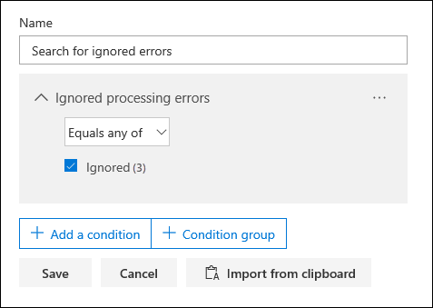
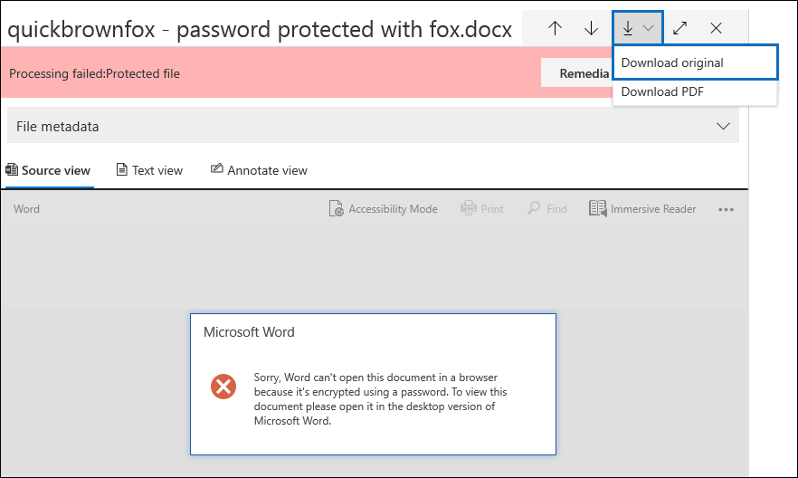

# Corrección de errores de elemento único en Advanced eDiscovery

La corrección de errores proporciona a Advanced eDiscovery usuarios la capacidad de corregir problemas de datos que impiden Advanced eDiscovery procesar correctamente el contenido. Por ejemplo, los archivos protegidos con contraseña no se pueden procesar porque están bloqueados o cifrados. Anteriormente, solo podía corregir errores en masa mediante [este flujo de trabajo](error-remediation-when-processing-data-in-advanced-ediscovery.md). Pero a veces, no tiene sentido corregir errores en varios archivos cuando no está seguro de si alguno de esos archivos responde al caso que está investigando. También puede que no tenga sentido corregir errores antes de que haya tenido la oportunidad de revisar los metadatos del archivo (como la ubicación del archivo o quién tuvo acceso) para ayudarle a tomar decisiones previas acerca de la capacidad de respuesta. Una nueva característica denominada corrección de *errores* de elemento único ofrece a los administradores de exhibición de documentos electrónicos la capacidad de ver los metadatos de los archivos con un error de procesamiento y, si es necesario, corregir el error directamente en el conjunto de revisión. En el artículo se describe cómo identificar, omitir y corregir archivos con errores de procesamiento en un conjunto de revisión.

## Identificar documentos con errores

Los documentos con errores de procesamiento en un conjunto de revisión ahora se identifican (con un banner). Puede corregir o omitir el error. La siguiente captura de pantalla muestra el banner de error de procesamiento de un documento de Word en un conjunto de revisión protegido con contraseña. Observe también que puede ver los metadatos de archivo de documentos con errores de procesamiento.

También puede buscar documentos con errores de  procesamiento mediante la condición Estado de procesamiento al consultar los [documentos de un conjunto de revisión.](review-set-search.md)

### Omitir errores

Puede omitir un error de procesamiento haciendo clic en **Omitir** en el banner de error de procesamiento. Cuando se omite un error, el documento se quita del flujo [de trabajo de corrección](error-remediation-when-processing-data-in-advanced-ediscovery.md)masiva de errores . Después de omitir un error, el banner del documento cambia de color e indica que se ha omitido el error de procesamiento. En cualquier momento, puede revertir la decisión de omitir el error haciendo clic en **Revertir**.

También puede buscar todos los documentos que tenían un error de procesamiento que se omitió mediante la condición *Omitir* errores de procesamiento al consultar documentos de un conjunto de revisión.

## Corregir un documento con errores

En ocasiones, es posible que deba corregir un error de procesamiento en documentos (quitando una contraseña, descifrando un archivo cifrado o recuperando un documento dañado) y, a continuación, agregue el documento corregido al conjunto de revisión. Esto le permite revisar y exportar el documento de error junto con los demás documentos del conjunto de revisión. 

Para corregir un solo documento, siga estos pasos:

1. Haga **clic en** Descargar descargar  >  **original** para descargar una copia del archivo en un equipo local.

   

2. Corrija el error en el archivo sin conexión. Para los archivos cifrados, que requerirían software de descifrado, para quitar la protección con contraseña, proporcione la contraseña y guarde el archivo o use un descifrador de contraseñas. Después de corregir el archivo, vaya al paso siguiente.

3. En el conjunto de revisión, seleccione el archivo con el error de procesamiento que ha corregido y, a continuación, haga clic en **Corrección**.

   

4. Haga **clic en** Examinar, vaya a la ubicación del archivo corregido en el equipo local y, a continuación, seleccione el archivo.

   

    Después de seleccionar el archivo corregido, se carga automáticamente en el conjunto de revisión. Puede realizar un seguimiento del estado de procesamiento del archivo.

    

   Una vez completado el procesamiento, puede ver el documento corregido.

    

Para obtener más información acerca de lo que sucede cuando se corrige un documento, vea [What happens when files are remediated](error-remediation-when-processing-data-in-advanced-ediscovery.md#what-happens-when-files-are-remediated).

## Buscar documentos corregidos

Puede buscar todos los documentos de un conjunto de revisión corregidos mediante la condición **Keywords** y especificando el siguiente par property:value: **IsFromErrorRemediation:true**. Esta propiedad también está disponible en el archivo de carga de exportación al exportar documentos de un conjunto de revisión.
