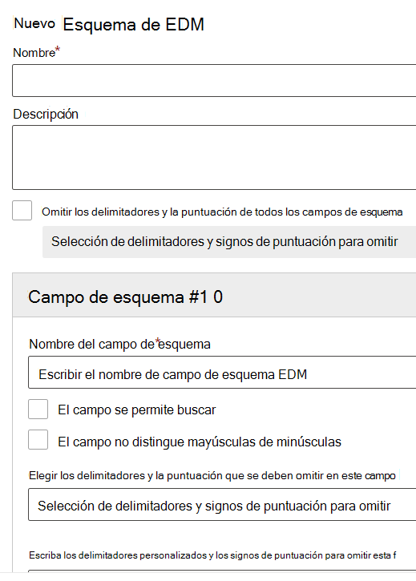

# Utilice el esquema de coincidencia de datos exactos y el asistente para tipos de información confidencialUse the Exact Data Match Schema and Sensitive Information Type Wizard

[Crear un tipo de información confidencial personalizada con una clasificación basada en la coincidencia exacta de datos (EDM) ](create-custom-sensitive-information-types-with-exact-data-match-based-classification.md)implica muchos pasos.[Creating a custom sensitive information type with Exact Data Match (EDM) based classification](create-custom-sensitive-information-types-with-exact-data-match-based-classification.md)  involves many steps.  Puede usar este asistente para crear los archivos de patrón de esquema y de tipo de información confidencial (SIT) (paquete de reglas) para simplificar el proceso.You can use this wizard to create your schema and sensitive information type (SIT) pattern (rule package) files to help simplify the process.

> [!NOTE]
> El Esquema de coincidencia exacta de datos y el Asistente para tipos de información confidencial solo están disponibles para las nubes en todo el mundo y GCC.The Exact Data Match Schema and Sensitive Information Type Wizard is only available for the World Wide and GCC clouds only.

Este asistente puede ser usado en lugar de:This wizard can be used instead of the:

- [Definir el esquema de la base de datos de información confidencialDefine the schema for your database of sensitive information](create-custom-sensitive-information-types-with-exact-data-match-based-classification.md#define-the-schema-for-your-database-of-sensitive-information)
- [Establecer un patrón (paquete de reglas) Set up a pattern (rule package)](create-custom-sensitive-information-types-with-exact-data-match-based-classification.md#set-up-a-rule-package)

pasos en la[Parte 1: establecer la clasificación basada en el EDM.](create-custom-sensitive-information-types-with-exact-data-match-based-classification.md#part-1-set-up-edm-based-classification).steps in [Part 1: Set up EDM-based classification](create-custom-sensitive-information-types-with-exact-data-match-based-classification.md#part-1-set-up-edm-based-classification).

## Requisitos previosPre-requisites

1. Familiarícese con los pasos para crear un tipo de información confidencial personalizada con el [ flujo de trabajo del EDM de un vistazo](create-custom-sensitive-information-types-with-exact-data-match-based-classification.md#the-work-flow-at-a-glance).Familiarize yourself with the steps to create a custom sensitive information type with EDM [work flow at a glance](create-custom-sensitive-information-types-with-exact-data-match-based-classification.md#the-work-flow-at-a-glance).

2. Realice los pasos de la sección [Guardar datos confidenciales en formato .csv](create-custom-sensitive-information-types-with-exact-data-match-based-classification.md#save-sensitive-data-in-csv-format).Perform the steps in the [Save sensitive data in .csv format](create-custom-sensitive-information-types-with-exact-data-match-based-classification.md#save-sensitive-data-in-csv-format) section.

## Usar el Esquema de coincidencia exacta de datos y el asistente para información de tipo confidencialUse the exact data match schema and sensitive information type pattern wizard

1. En el Centro de cumplimiento de Microsoft 365 para su inquilino vaya a **Clasificación de datos** > **coincidencias de datos exactos**.In the Microsoft 365 Compliance center for your tenant go to **Data classification** > **Exact data matches**.

2. Elija **Crear esquema EDM** para abrir el flotante de configuración del asistente de esquemas.Choose **Create EDM schema** to open the schema wizard configuration flyout.

3. Rellene con un **Nombre** y una **Descripción apropiados**.Fill in an appropriate **Name** and **Description**.

4. Elija **Omitir delimitadores y puntuación** para todos los campos de esquema si desea ese comportamiento.Choose **Ignore delimiters and punctuation for all schema fields** if you want that behavior. Para obtener más información acerca de cómo configurar EDM para omitir mayúsculas o minúsculas, vea [Creating a custom sensitive information type with Exact Data Match (EDM) based classification](create-custom-sensitive-information-types-with-exact-data-match-based-classification.md).To learn more about configuring EDM to ignore case or delimiters, see [Creating a custom sensitive information type with Exact Data Match (EDM) based classification](create-custom-sensitive-information-types-with-exact-data-match-based-classification.md).

5. Rellene los valores deseados para el **Campo #1 del esquema** y agregue más campos según sea necesario.Fill in your desired values for your **Schema field #1** and add more fields as needed. 

> [!IMPORTANT]
> Al menos uno, pero no más de cinco de los campos de su esquema deben ser designados como de búsqueda.At least one, but no more than five of your schema fields must be designated as searchable.

6. Seleccione Guardar.Choose save. Su esquema ahora estará en la lista.Your schema will now be listed.

7. Elija **Tipos de información confidencial EDM** y **Crear Tipo de información confidencial EDM** para abrir el asistente de configuración de tipos de información confidencial.Choose **EDM sensitive info types** and **Create EDM sensitive info type** to open the sensitive info type configuration wizard.

8. Elija **Elegir un esquema de EDM existente** y elija el esquema que creó en los pasos 2-6 de la lista.Choose **Choose an existing EDM schema** and choose the schema you created in steps 2-6 from the list.

9. Elija **Siguiente** y seleccione **Crear patrón**.Choose **Next** and choose **Create pattern**.

10. Elija el **Nivel de confianza** y **Elemento primario**.Choose the **Confidence level** and **Primary element**.  Para obtener más información sobre la configuración de un patrón, consulte [Crear un tipo de información confidencial personalizada en el Centro de cumplimiento](create-a-custom-sensitive-information-type.md)To learn more about configuring a pattern, see [Create a custom sensitive information type in the Compliance Center](create-a-custom-sensitive-information-type.md)

11.  Elija el **tipo de información confidencial del elemento primario** para asociarlo.Choose the **Primary element's sensitive info type** to associate it with. Consulte [Tipo de información confidencial según definiciones de entidades](sensitive-information-type-entity-definitions.md) para obtener más información sobre los tipos de información confidencial disponibles.See [Sensitive Information Type Entity Definitions](sensitive-information-type-entity-definitions.md) to learn more about the available sensitive information types.

12. Seleccione **Listo**.Choose **Done**.

13. Elija su **Nivel de confianza y la proximidad de su personaje**.Choose your desired **Confidence level and character proximity**.  Este será el valor por defecto para todo el tipo de información confidencial EDMThis will be the default value for the whole EDM sensitive info type

13. Elige **Crear patrón** si quieres crear patrones adicionales para el tipo de información confidencial de EDM.Choose **Create pattern** if you want to create additional patterns for your EDM sensitive info type.

14. Elija **Siguiente** y rellene con un **Nombre** y una **Descripción para los administradores**.Choose **Next** and fill in a **Name** and **Description for admins**.

15. Revise y elija **Enviar**.Review and choose **Submit**.

Puedes borrar o editar el patrón de tipo de información confidencial seleccionándolo para que aparezca en la superficie de los controles de edición y borrado.You can delete or edit the sensitive information type pattern by selecting it which surfaces the edit and delete controls.

> [!IMPORTANT]
> Si desea eliminar un esquema, y ya está asociado a un tipo de información sensible EDM, primero debe borrar el tipo de información confidencial EDM, luego puede eliminar el esquema.If you want to remove a schema, and it is already associated with an EDM sensitive info type, you must first delete the EDM sensitive info type, then you can delete the schema.

## Pasos posteriores a la creaciónPost creation steps

Después de haber usado este asistente para crear sus archivos de esquemas y patrones EDM (paquete de reglas), todavía tiene que realizar los pasos de la [Parte 2: hash y cargar los datos confidenciales](create-custom-sensitive-information-types-with-exact-data-match-based-classification.md#part-2-hash-and-upload-the-sensitive-data) antes de poder usar el tipo de información confidencial personalizada EDM.After you have used this wizard to create your EDM schema and pattern (rule package) files, you still have to perform the steps in [Part 2: Hash and upload the sensitive data](create-custom-sensitive-information-types-with-exact-data-match-based-classification.md#part-2-hash-and-upload-the-sensitive-data) before you can use the EDM custom sensitive information type.

Después de comprobar que la tabla de información confidencial se ha cargado correctamente, puede probar que funciona correctamente.After verifying that your sensitive information table has correctly been uploaded, you can test that it's working properly.

1. Open **Compliance center** Data  >  **classification** Sensitive Information  >  **Types**.Open **Compliance center** > **Data classification** > **Sensitive Information Types**.
2. Seleccione su SIT de EDM en la lista y, a continuación, **seleccione Probar** en el panel desplegable.Select your EDM SIT from the list and then select **Test** in the flyout pane. 
3. Upload elemento que contiene datos que desea detectar, por ejemplo, cree un elemento que contenga algunos de los datos de la tabla de información confidencial.Upload an item that contains data you want to detect, for example create an item that contains some of the data in your sensitive information table. Si usó la característica de coincidencia configurable en el esquema para definir delimitadores ignorados, asegúrese de que el elemento incluye ejemplos con y sin esos delimitadores.If you used the configurable match feature in your schema to define ignored delimiters, make sure the item includes examples with and without those delimiters.
4. Después de cargar y examinar el archivo, compruebe si hay coincidencias en su SIT de EDM.After the file has been uploaded and scanned, check for matches to your EDM SIT.
5. Si la **función Test** del SIT detecta una coincidencia, compruebe que no la está recortando o extrayendo incorrectamente.If the **Test** function in the SIT detects a match, check that it is not trimming it or extracting it incorrectly. Por ejemplo, extrayendo solo una subcadena de la cadena completa que se supone que debe detectar, o tomando solo la primera palabra de una cadena de varias palabras, o incluyendo símbolos o caracteres adicionales en la extracción.For example by extracting only a substring of the full string it is supposed to detect, or picking up only the first word in a multi-word string, or including extra symbols or characters in the extraction. Consulte [Lenguaje de expresión regular: referencia rápida para](/dotnet/standard/base-types/regular-expression-language-quick-reference) la referencia del lenguaje de expresión regular.See [Regular Expression Language - Quick Reference](/dotnet/standard/base-types/regular-expression-language-quick-reference) for the regular expression language reference. 

### Solución de problemasTroubleshooting

Si no encuentra ninguna coincidencia, pruebe lo siguiente:If you don't find any matches, try the following:
- Confirme que los datos confidenciales se cargaron correctamente con los comandos que se explican en las instrucciones para cargar los datos confidenciales [mediante la herramienta EDM](create-custom-sensitive-information-types-with-exact-data-match-based-classification.md).Confirm that your sensitive data was uploaded correctly using the commands explained in [the guidance for uploading your sensitive data using the EDM tool](create-custom-sensitive-information-types-with-exact-data-match-based-classification.md).
- Compruebe que los ejemplos especificados en el elemento están presentes en la tabla de información confidencial y que los delimitadores omitido son correctos.Check that the examples you entered in the item are present in your sensitive information table and that the ignored delimiters are correct.
- **Pruebe** el SIT que usó al configurar el elemento principal en cada uno de los patrones.**Test** the SIT you used when you configured the primary element in each of your patterns. Esto confirmará que el SIT puede coincidir con los ejemplos del elemento.This will confirm that the SIT is able to match the examples in the item. 
  -  Si el SIT que seleccionó para un elemento principal del tipo EDM no encuentra una coincidencia en el elemento o encuentra menos coincidencias de las esperadas, compruebe que admite separadores y delimitadores que existen en el contenido.If the SIT you selected for a primary element in the EDM type doesn't find a match in the item or finds fewer matches than you expected, check that it supports separators and delimiters that exist in the content. Asegúrese de incluir los delimitadores omitidos definidos en el esquema.Be sure to include the ignored delimiters defined in your schema. 
  -  Si la **función Test** no detecta ningún contenido, compruebe si el SIT seleccionado incluye requisitos para palabras clave adicionales u otras validaciones.If the **Test** function does not detect any content at all, check if the SIT you selected includes requirements for additional keywords or other validations. Para los SIT [integrados,](sensitive-information-type-entity-definitions.md) vea Sensitive information types entity definitions to verify what the minimum requirements are for matching each type.For the built-in SITs, see [Sensitive information types entity definitions](sensitive-information-type-entity-definitions.md) to verify what the minimum requirements are for matching each type.
