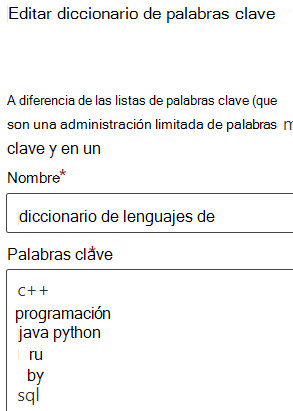

# <a name="modify-a-keyword-dictionary"></a>Modificar un diccionario de palabras clave

Es posible que tenga que modificar palabras clave en uno de los diccionarios de palabras clave o modificar uno de los diccionarios integrados. Puede hacerlo a través de PowerShell o a través del Centro de cumplimiento.

## <a name="modify-a-keyword-dictionary-in-compliance-center"></a>Modificar un diccionario de palabras clave en el Centro de cumplimiento

Los diccionarios de palabras clave se pueden usar como o en patrones de tipo de información `Primary elements` `Supporting elements` confidencial (SIT). Puede editar un diccionario de palabras clave al crear un SIT o en un SIT existente. Por ejemplo, para editar un diccionario de palabras clave existente:

1. Abra el patrón que tiene el diccionario de palabras clave que desea actualizar.
2. Busque el diccionario de palabras clave que desea actualizar y elija editar. 
3.  Realice las ediciones con una palabra clave por línea.



4. Elija `Done` .

## <a name="modify-a-keyword-dictionary-using-powershell"></a>Modificar un diccionario de palabras clave con PowerShell 

Por ejemplo, vamos a modificar algunos términos en PowerShell, guardar los términos localmente donde se puedan modificar en un editor y, después, actualizar los términos anteriores. 

En primer lugar, recupere el objeto de diccionario:
  
```powershell
$dict = Get-DlpKeywordDictionary -Name "Diseases"
```

La impresión de `$dict` mostrará las distintas variables. Las palabras clave en sí se almacenan en un objeto en el back-end, pero `$dict.KeywordDictionary` contiene una representación de cadena de estas, que usará para modificar el diccionario. 

Antes de modificar el diccionario, necesita volver a convertir la cadena de términos en una matriz con el método `.split(',')`. Después, eliminará los espacios no deseados entre las palabras clave con el método `.trim()` y dejará únicamente las palabras clave con las que quiera trabajar. 
  
```powershell
$terms = $dict.KeywordDictionary.split(',').trim()
```

Ahora, quitará algunos términos del diccionario. Como el diccionario de ejemplo solo tiene unas pocas palabras clave, podría fácilmente pasar a la exportación del diccionario y editarlo en el Bloc de notas, pero los diccionarios suelen contener una gran cantidad de texto, por lo que primero aprenderá esta forma de editarlos fácilmente en PowerShell.
  
En el último paso, guardó las palabras clave en una matriz. Hay varias formas de [quitar elementos de una matriz](/previous-versions/windows/it-pro/windows-powershell-1.0/ee692802(v=technet.10)), pero un método sencillo es crear una matriz de los términos que quiera quitar del diccionario y, después, copiar en este solo los términos que no se encuentren en la lista de términos que quiera quitar.
  
Ejecute el comando `$terms` para mostrar la lista de términos actual. El resultado del comando tiene este aspecto: 
  
`aarskog's syndrome`
`abandonment`
`abasia`
`abderhalden-kaufmann-lignac`
`abdominalgia`
`abduction contracture`
`abetalipoproteinemia`
`abiotrophy`
`ablatio`
`ablation`
`ablepharia`
`abocclusion`
`abolition`
`aborter`
`abortion`
`abortus`
`aboulomania`
`abrami's disease`

Ejecute este comando para especificar los términos que quiera quitar:
  
```powershell
$termsToRemove = @('abandonment', 'ablatio')
```

Ejecute este comando para quitar los términos de la lista:
  
```powershell
$updatedTerms = $terms | Where-Object{ $_ -notin $termsToRemove }
```

Ejecute el comando `$updatedTerms` para mostrar la lista actualizada de términos. El resultado del comando será parecido a este (se quitaron los términos especificados): 
  
`aarskog's syndrome`
`abasia`
`abderhalden-kaufmann-lignac`
`abdominalgia`
`abduction contracture`
`abetalipo proteinemia`
`abiotrophy`
`ablation`
`ablepharia`
`abocclusion`
`abolition`
`aborter`
`abortion`
`abortus`
`aboulomania`
`abrami's disease`
```

Now save the dictionary locally and add a few more terms. You could add the terms right here in PowerShell, but you'll still need to export the file locally to ensure it's saved with Unicode encoding and contains the BOM.
  
Save the dictionary locally by running the following:
  
```powershell
Set-Content $updatedTerms -Path "C:\myPath\terms.txt"
```

Ahora, abra el archivo, agregue los otros términos y guárdelo con la codificación Unicode (UTF-16). Ahora, cargará los términos actualizados y actualizará el diccionario en contexto.
  
```powershell
PS> Set-DlpKeywordDictionary -Identity "Diseases" -FileData (Get-Content -Path "C:myPath\terms.txt" -Encoding Byte -ReadCount 0)
```

Ahora se ha actualizado el diccionario en contexto. El campo `Identity` toma el nombre del diccionario. Si también quiere cambiar el nombre del diccionario con el cmdlet `set-`, necesita agregar el parámetro `-Name` a los comandos anteriores con el nuevo nombre del diccionario. 

Consulte también
- [Crear un diccionario de palabras clave](create-a-keyword-dictionary.md)
- [Crear un tipo personalizado de información confidencial](create-a-custom-sensitive-information-type.md)
