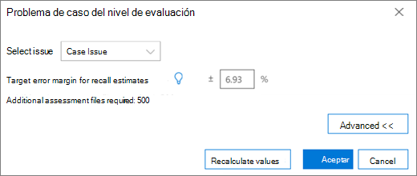
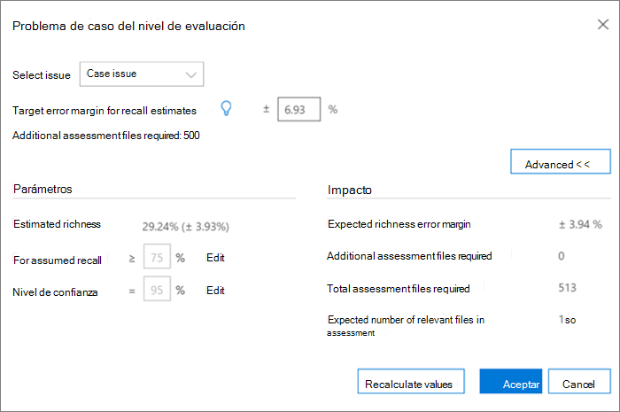

# Etiquetado y evaluación en el módulo Relevancia en Advanced eDiscovery
  
En esta sección se describe el procedimiento de evaluación en el módulo Relevancia de Advanced eDiscovery.
  
## Realización de aprendizaje y análisis de evaluación

1. En la pestaña **Pista \> de relevancia,** haga clic **en Evaluación** para iniciar la evaluación de casos.

    Por ejemplo, en este procedimiento, se crea un conjunto de  evaluación de muestra de 500 archivos y se muestra la pestaña Etiqueta, que contiene el panel Etiquetado, el contenido del archivo mostrado y otras opciones de etiquetado. 

    
  
2. Revise cada archivo del ejemplo, determine la relevancia del archivo para cada problema de caso y etiquete el archivo con los botones Relevancia (R), No relevante (NR) y Omitir en el **panel Panel** de etiquetado. 

    > [!NOTE]
    >  La evaluación requiere 500 archivos etiquetados. Si los archivos se "omiten", recibirá más archivos para etiquetar. 
  
3. Después de etiquetar todos los archivos del ejemplo, haga clic **en Calcular**.

    El margen de error actual de evaluación y la riqueza se calculan y se muestran en la pestaña **Pista** de relevancia, con detalles expandido por problema, como se muestra a continuación. En la sección Revisar resultados de evaluación se describen más detalles sobre este cuadro [de](#reviewing-assessment-results) diálogo.

    
  
    > [!TIP]
    > De forma predeterminada, se recomienda continuar con el paso siguiente predeterminado cuando se haya completado el indicador de progreso de evaluación del problema, lo que indica que se revisó la muestra de evaluación y se etiquetaron suficientes archivos relevantes. > De lo contrario, si desea  ver los resultados de la pestaña Seguimiento  y controlar el margen de error y el paso siguiente, haga clic en Modificar junto a Paso siguiente **,** seleccione Continuar evaluación y, a continuación, haga clic en **Aceptar**.
  
4. Haga **clic en** Modificar a la derecha de la **casilla** Evaluación para ver y especificar parámetros de evaluación por problema. Se **muestra un** cuadro de diálogo Nivel de evaluación para cada problema, como se muestra en el ejemplo siguiente: 

    
  
    Los siguientes parámetros para el problema se calculan y se muestran en el cuadro **de diálogo Nivel de** evaluación: 

    **Margen de error de destino para estimaciones de** recuperación: en función de este valor, se calcula el número estimado de archivos adicionales necesarios para revisar. El margen usado para la recuperación es mayor que el 75 % y con un nivel de confianza del 95 %.

    **Archivos de evaluación adicionales necesarios:** indica cuántos archivos más son necesarios si no se han cumplido los requisitos del margen de error actual. 

5. Para ajustar el margen de error actual y ver el efecto de diferentes márgenes de error (por problema):

6. En la **lista Seleccionar problema,** seleccione un problema. 

7. En **Margen de error de destino para las estimaciones de recuperación,** escriba un nuevo valor.

8. Haga **clic en Actualizar valores** para ver el impacto de los ajustes. 

9. Haga **clic en** Avanzadas en el cuadro de diálogo Nivel **de** evaluación para ver los siguientes parámetros y detalles adicionales: 

    
  
    - **Riqueza estimada:** riqueza estimada según los resultados de la evaluación actuales

    - **Para la recuperación asumida:** de forma predeterminada, el margen de error de destino se aplica a la recuperación superior al 75 %. Haga **clic en** Editar si desea cambiar este parámetro y controlar el margen de error en un intervalo diferente de valores de recuperación. 

    - **Nivel de confianza:** de forma predeterminada, el margen de error recomendado para la confianza es del 95 %. Haga **clic en** Editar si desea cambiar este parámetro.

    - **Margen de error de** enriquecimiento esperado: dados los valores actualizados, este es el margen de error esperado de la riqueza, después de revisar todos los archivos de evaluación adicionales.

    - **Archivos de evaluación adicionales necesarios:** dados los valores actualizados, el número de archivos de evaluación adicionales que deben revisarse para llegar al destino.

    - **Total de archivos de evaluación requeridos:** dados los valores actualizados, el total de archivos de evaluación necesarios para su revisión.

    - **Número esperado de archivos relevantes** en la evaluación: dados los valores actualizados, se revisa el número esperado de archivos relevantes en toda la evaluación después de revisar todos los archivos de evaluación adicionales.

10. Haga **clic en Recalcular valores**, si se cambian los parámetros. Cuando haya terminado, si hay un  problema, haga clic  en Aceptar para guardar los cambios (o siguiente cuando haya varios problemas para revisar o modificar y, a continuación, **finalizar**). 

    Cuando hay varios problemas, después de revisar o ajustar todos los problemas, se muestra un cuadro de diálogo Nivel de **evaluación:** resumen, como se muestra en el ejemplo siguiente. 

    
  
    Una vez completada correctamente la evaluación, continúe con la siguiente fase de la formación en relevancia.

## Revisión de los resultados de la evaluación

Después de etiquetar un ejemplo de evaluación, los resultados de la evaluación se calculan y se muestran en la pestaña Pista de relevancia.
  
Los siguientes resultados se muestran en la pantalla De seguimiento expandida:
  
- Margen de error actual de evaluación para estimaciones de recuperación

- Riqueza estimada

- Se requieren archivos de evaluación adicionales (para revisión)

El margen de error actual de evaluación es el margen de error recomendado por Advanced eDiscovery. El número que se muestra para los "Archivos de evaluación adicionales necesarios" corresponde a esa recomendación.
  
El indicador de progreso de evaluación muestra el nivel de finalización de la evaluación, dado el margen de error actual. Cuando la evaluación esté en curso, el usuario etiquetará otra muestra de evaluación.
  
Cuando el indicador de progreso de la evaluación muestra la evaluación como completa, significa que se completó la revisión de la muestra de evaluación y se etiquetaron suficientes archivos relevantes. 
  
La pantalla Track expandida muestra el siguiente paso recomendado, las estadísticas de evaluación y el acceso a resultados detallados.
  
Cuando la riqueza es muy baja, el número de archivos de evaluación adicionales necesarios para alcanzar un número mínimo de archivos relevantes para producir estadísticas útiles es muy alto. Advanced eDiscovery le recomendamos pasar al aprendizaje. El indicador de progreso de la evaluación se sombreará y no habrá estadísticas disponibles.
  
En ausencia de estabilización basada en estadísticas, habrá resultados con un nivel inferior de precisión y nivel de confianza. Sin embargo, estos resultados se pueden usar para buscar archivos relevantes cuando no es necesario conocer el porcentaje de archivos relevantes encontrados. Del mismo modo, este estado se puede usar para entrenar problemas con poca riqueza, donde las puntuaciones de relevancia pueden acelerar el acceso a archivos relevantes a un problema específico.
  
> [!TIP]
> En la **pestaña Pista \> de** relevancia, visualización de problemas expandida, están disponibles las siguientes opciones de visualización: 
> 
> El siguiente paso recomendado, como Paso **siguiente:** el etiquetado se puede  omitir (por problema) haciendo clic en el botón Modificar a su derecha y, a continuación, seleccionando un paso diferente en el **paso Siguiente**. Cuando el indicador de progreso de evaluación no se haya completado, la evaluación será la siguiente opción recomendada, para etiquetar más archivos de evaluación y aumentar la precisión de las estadísticas. 
> 
> Para cambiar el margen de error y evaluar su impacto, haga clic en Modificar **y,** en el cuadro de diálogo Nivel de **evaluación,** cambie el margen de **error** Destino para las estimaciones de recuperación y haga clic en **Actualizar valores**. Además, en este cuadro de diálogo, puede ver opciones avanzadas haciendo clic en **Avanzadas**. 
> 
> Puede ver estadísticas adicionales del nivel de evaluación y su impacto haciendo clic en **Ver**. En el cuadro de diálogo Resultados de detalles mostrado, las estadísticas están disponibles por problema, cuando hay al menos 500 archivos de evaluación etiquetados y al menos 18 archivos se etiquetan como relevantes para el problema. 
