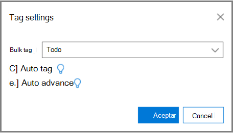

# Identificación y aprendizaje de relevancia en eDiscovery avanzadoTagging and Relevance training in Advanced eDiscovery
  
En este artículo se describe el procedimiento para trabajar con el módulo de aprendizaje de relevancia en la exhibición avanzada de documentos electrónicos.This article describes the procedure for working with the Relevance training module in Advanced eDiscovery.
  
Una vez completada la evaluación en la exhibición avanzada de documentos electrónicos y especifica la fase de aprendizaje de relevancia, se incluye una muestra de formación de 40 archivos en la pestaña etiqueta para el etiquetado.After Assessment is completed in Advanced eDiscovery, and you enter the Relevance training stage, a training sample of 40 files is brought into the Tag tab for tagging.
  
## Realizar entrenamiento de relevanciaPerforming Relevance training

1. En la **pestaña \> etiqueta de relevancia** , el panel etiquetado se muestra de forma predeterminada en el panel izquierdo y se muestran los archivos de ejemplo, uno por vez, para el etiquetado.In the **Relevance \> Tag** tab, the Tagging pane is displayed by default in the left pane and the sample files are displayed, one at a time for tagging.

    
  
    En la ficha **etiqueta** , se muestra el nombre para mostrar del archivo.In the **Tag** tab, the file's display name is shown. Puede ser la ruta de acceso, el asunto del correo electrónico, el título o el nombre definido por el usuario.This could be the path, email subject, title, or user-defined name. El identificador, la ruta de acceso de archivo o la ruta de acceso de texto se pueden copiar haciendo clic con el botón secundario en la ruta de acceso del archivo.The ID, file path or text path can be copied by right-clicking on the file's path.

    En las estadísticas de etiquetado de pestañas de **etiquetas** se muestra el número de muestra de archivo (en la parte superior del panel izquierdo), el número del archivo que se muestra actualmente de los archivos totales en el ejemplo (parte inferior del panel derecho) y el número total actual de archivos etiquetados en el ejemplo (parte inferior del panel izquierdo), que cambia cuando se etiquetan los archivos.The **Tag** tab tagging statistics show the file sample number (at the top of the left pane), the number of the currently displayed file out of the total files in the sample (bottom of right pane), and the current total number of tagged files in the sample (bottom of the left pane), which changes as you tag files. Esto se aplica a cualquier etiquetado de relevancia realizado, ya sea en evaluación, formación, puesta en marcha o prueba.This applies for any Relevance tagging done, whether in Assessment, Training, Catch-up, or Test.

    Los iconos que indican la existencia de comentarios, etiquetas y archivos de familia se muestran en la vista de archivo en una barra situada encima del archivo.Icons indicating the existence of comments, tags, and family files are displayed in the file view in a bar above the file.

2. Determine la relevancia del archivo para el problema de caso y etiquete el archivo con los botones de iconos de opción de etiquetado o con los métodos abreviados de teclado, como se muestra en la siguiente tabla:Determine the file's relevance for the case issue and tag the file using either the Tagging option icon buttons or keyboard shortcuts, as shown in the following table:

   |**Opción de etiquetado****Tagging option**|**Descripción****Description**|**Método abreviado de teclado****Keyboard shortcut**|**Método abreviado de teclado para etiquetado en masa (para varios problemas)****Bulk tagging keyboard shortcut (for multiple issues)**|
   |-----|-----|-----|-----|
   |RR    |MetabolitoRelevant    |ZZ    |`Shift + Z`    |
   |NºNR    |No relevanteNot relevant    |XX    |`Shift + X`    |
   |AvanzarSkip    |AvanzarSkip    |CC    |`Shift + A`    |
   |||||

   - Cuando hay varios problemas para un archivo, después de marcar un problema, la selección se mueve al siguiente problema (si lo hay).When multiple issues exist for a file, after tagging one issue, the selection moves to the next issue (if any).  

   - Las palabras clave definidas por el administrador o el administrador de casos al resaltar palabras clave ( \> palabras clave resaltadas de configuración de relevancia), se mostrarán (en los colores especificados) para ayudar a identificar los archivos relevantes al etiquetar.Keywords that were defined by the Administrator or Case manager when highlighting keywords (Relevance setup \> Highlighted keywords), will be displayed (in specified colors) to help identify relevant files while tagging. Si una palabra clave tiene un doble subrayado, se puede hacer clic para mostrar una sugerencia de herramienta con la descripción de la palabra clave.If a keyword has a double underline, it can be clicked to display a tool-tip with the keyword's description.

     De forma opcional, en la pestaña **etiqueta** , haga clic en **configuración de etiqueta** para establecer las siguientes opciones:Optionally, in the **Tag** tab, click **Tag settings** to set the following options:

      
  
   - **Etiqueta masiva**: Use esta opción para asignar varios problemas a un archivo; para ello, seleccione **todos** para establecer la etiqueta del archivo seleccionado para todos los problemas (invalida los problemas ya etiquetados) o seleccione **el resto** para aplicar la etiqueta a los demás problemas sin etiquetar.**Bulk tag**: Use this option to assign multiple issues for a file by selecting **All** to set the tag for the selected file for all issues (overrides already tagged issues) or by selecting **The rest** to apply the tag to the remaining untagged issues. La opción seleccionada permanece en vigor para todos los casos de este usuario hasta que la modifica el usuario (la configuración es por usuario para todos los casos del usuario).The selected option remains in effect for all of this user's cases until changed by that user (setting is per user for all the user's cases).

   - **Etiqueta automática**: Active esta casilla para establecer otros problemas de un archivo como no relevante después de un único etiquetado relevante.**Auto tag**: Select this check box to set other issues for a file as Not relevant after a single Relevant tagging.

   - **Avance automático**: Active esta casilla de verificación para mover la selección de archivos que se muestra al siguiente archivo al etiquetar el último o único problema sin etiquetar.**Auto advance**: Select this check box to move the displayed file selection to the next file when tagging the last or only untagged issue.

    Los archivos omitidos no se tendrán en cuenta para la formación de relevancia y la puntuación de relevancia.Skipped files will not be considered for Relevance training and Relevance scoring purposes.

3. Los comentarios de texto libre, asociados a un archivo, se pueden ver y editar a través de la opción **Comentario** en la lista desplegable panel izquierdo.Free-text comments, associated with a file, can be viewed and edited via the **Comment** option in the left pane drop-down list. (opcional)(optional)

4. Las directrices para la etiquetación se pueden ver seleccionando la opción **pautas de etiquetado** en la lista desplegable del panel izquierdo.Guidelines for tagging can be viewed by selecting the **Tagging guidelines** option in the left pane drop-down list.

5. Cuando termine de etiquetar todos los archivos de la lista y esté listo para calcular los resultados, haga clic en **calcular**.After you finish tagging all files in the list and are ready to calculate the results, click **Calculate**. Se muestra la pestaña **seguimiento** .The **Track** tab is displayed.  

## Trabajar con la lista de archivos de ejemploWorking with the sample files list

La lista de archivos de muestra le permite ver una lista de los archivos en un ejemplo de aprendizaje y realizar diversas acciones en uno o más archivos.The sample files list allows you to view a list of the files in a training sample and perform various actions on one or more files. En la  \> ficha **etiqueta** de relevancia, el panel **archivos de ejemplo** izquierdo muestra una lista de archivos de ejemplo para el procesamiento con procesos de evaluación, formación, puesta en marcha e incoherencias.In the **Relevance** \> **Tag** tab, the **Sample files** left pane displays a list of sample files for processing with Assessment, Training, Catch-up, and Inconsistencies processes.
  
1. En la **ficha \> etiqueta de relevancia** , seleccione los archivos de ejemplo en la lista desplegable del panel izquierdo.In the **Relevance \> Tag** tab, select the Sample files in the left pane drop-down list. Los archivos de ejemplo se muestran en el panel izquierdo.The sample files are listed in the left pane.

    
  
2. Seleccione un ejemplo o un número de archivo específico especificando o seleccionando su número en los cuadros **muestra** o **archivo** .Select a specific sample or file number by entering or selecting its number in the **Sample** or **File** boxes.

   - Un número de secuencia de archivo aparece en la columna izquierda de la lista de archivos que se muestra en la ficha **etiqueta** . Al hacer clic en el encabezado, el orden original mostrado de los archivos vuelve a su orden original.A file sequence number is listed in the left column of the displayed file list on the **Tag** tab. By clicking the header, the original displayed order of the files returns to its original order.

   - Al hacer clic en una fila de archivo, se muestra su contenido en el panel derecho.Clicking on a file row displays its content in the right pane.

   - Desplácese entre los archivos del ejemplo actual mediante las opciones de la barra de menús inferior.Navigate between files in the current sample by using the lower menu bar options. Además, los métodos abreviados de teclado de navegación están disponibles:In addition, navigational keyboard shortcuts are available:
  
     - Para ir al primer archivo del ejemplo: `Shift + Ctrl + <`To go to the first file in the sample: `Shift + Ctrl + <`

     - Para ir al archivo anterior en el ejemplo: `Shift + <`To go to the previous file in the sample: `Shift + <`

     - Para ir al siguiente archivo del ejemplo: `Shift + >`To go to the next file in the sample: `Shift + >`

     - Para ir al último archivo del ejemplo: `Shift + Ctrl + >`To go to the last file in the sample: `Shift + Ctrl + >`
