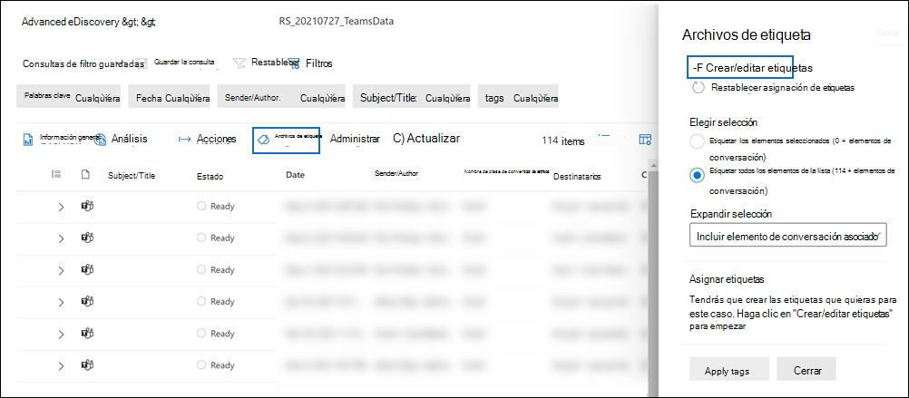
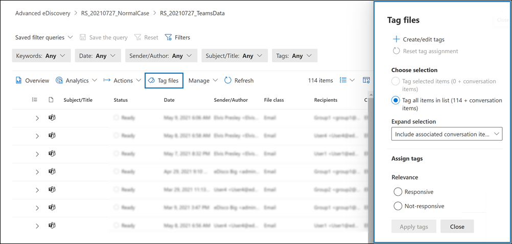

# Etiquetar documentos en un conjunto de revisión en eDiscovery (Premium)

[!include[Purview banner](../includes/purview-rebrand-banner.md)]

La organización del contenido en un conjunto de revisión es importante para completar varios flujos de trabajo en el proceso de exhibición de documentos electrónicos. Incluye lo siguiente:

- Eliminación de contenido innecesario

- Identificación de contenido relevante

- Identificación de contenido que debe ser revisado por un experto o abogado

Cuando expertos, abogados u otros usuarios revisan el contenido de un conjunto de revisión, sus opiniones relacionadas con el contenido se pueden capturar mediante etiquetas. Por ejemplo, si la intención es eliminar contenido innecesario, un usuario puede etiquetar documentos con una etiqueta como "no adaptable". Después de revisar y etiquetar el contenido, se puede crear una búsqueda de conjunto de revisión para excluir cualquier contenido etiquetado como "no dinámico". Este proceso elimina el contenido que no responde de los pasos siguientes del flujo de trabajo de eDiscovery. El panel de etiquetado de un conjunto de revisión se puede personalizar para cada caso para que las etiquetas admitan el flujo de trabajo de revisión previsto para el caso.

> [!NOTE]
> El ámbito de las etiquetas es un caso de exhibición de documentos electrónicos (Premium). Esto significa que un caso solo puede tener un conjunto de etiquetas que los revisores pueden usar para etiquetar los documentos del conjunto de revisión. No puede configurar un conjunto diferente de etiquetas para su uso en diferentes conjuntos de revisión en el mismo caso.

## Tipos de etiqueta

eDiscovery (Premium) proporciona dos tipos de etiquetas:

- **Etiquetas de opción única**: restringe a los revisores a seleccionar una sola etiqueta dentro de un grupo. Estos tipos de etiquetas pueden ser útiles para asegurarse de que los revisores no seleccionan etiquetas conflictivas, como "responsive" y "non-responsive". Las etiquetas de opción única aparecen como botones de radio.

- **Etiquetas de varias opciones**: permite que las revisiones seleccionen varias etiquetas dentro de un grupo. Estos tipos de etiquetas aparecen como casillas de verificación.

## Estructura de etiquetas

Además de los tipos de etiquetas, se puede usar la estructura de cómo se organizan las etiquetas en el panel de etiquetas para que los documentos de etiquetado sean más intuitivos. Las etiquetas se agrupan por secciones. La búsqueda de conjuntos de revisión admite la posibilidad de buscar por etiqueta y por sección de etiqueta. Esto significa que puede crear una búsqueda de conjuntos de revisión para recuperar documentos etiquetados con cualquier etiqueta de una sección.

Puede organizar aún más las etiquetas anidandolas dentro de una sección. Por ejemplo, si la intención es identificar y etiquetar el contenido con privilegios, se puede usar el anidamiento para dejar claro que un revisor puede etiquetar un documento como "Con privilegios" y seleccionar el tipo de privilegio comprobando la etiqueta anidada adecuada.

## Creación y aplicación de etiquetas

El etiquetado de elementos en conjuntos de revisión es un proceso de dos pasos. El primer paso consiste en crear las etiquetas que se aplican a los elementos establecidos de revisión. Después de crear etiquetas, usted y otros revisores pueden aplicarlas a los elementos de un conjunto de revisión. Como se explicó anteriormente, un caso de exhibición de documentos electrónicos (Premium) solo puede tener un conjunto de etiquetas que los revisores pueden usar para etiquetar los elementos del conjunto de revisión.

### Creación de etiquetas

Antes de aplicar etiquetas a los elementos de un conjunto de revisión, debe crear una estructura de etiquetas.

1. Abra un conjunto de revisión, vaya a la barra de comandos y seleccione **Etiquetar archivos**.

2. En la página desplegable **Archivos de etiquetas** , haga clic en **Crear o editar etiquetas**.

   

3. En la página **Etiquetas** , seleccione **Agregar sección**.

4. Escriba un título de grupo de etiquetas y una descripción opcional y, a continuación, haga clic en **Guardar**.

5. Seleccione el menú desplegable de puntos triples situado junto al título del grupo de etiquetas y haga clic en **la casilla Agregar** o en el **botón de opción Agregar**.

6. Escriba un nombre y una descripción para el botón de casilla o opción.

7. Repita este proceso para crear nuevas secciones de etiquetas, opciones de etiqueta y casillas. Por ejemplo, en la captura de pantalla siguiente se muestra un grupo de etiquetas denominado **Review**, que consta de casillas **responsive** y **not-responsive** .

   

### Apply tags

Con la estructura de etiquetas en su lugar, los revisores pueden aplicar etiquetas a los elementos de un conjunto de revisión mediante la configuración del etiquetado.

1. En la barra de comandos del conjunto de revisiones, seleccione **Etiquetar archivos** para mostrar la página desplegable **Archivos de etiqueta** (también denominada *panel de etiquetado*).

   

2. En la página desplegable **Archivos** de etiqueta, puede establecer las siguientes opciones para configurar cómo etiquetar los elementos que se muestran en el conjunto de revisión. Los filtros o consultas de filtro aplicados actualmente al conjunto de revisión determinan a qué elementos se muestran y, por tanto, los elementos a los que se pueden aplicar etiquetas. Para obtener más información, consulte [Consulta y filtrado de contenido en un conjunto de revisión](review-set-search.md).

   - **Elija la selección**. Elija una de las siguientes opciones para determinar el ámbito de los elementos a los que aplicar etiquetas.

      - **Etiquetar elementos seleccionados**: esta opción aplica etiquetas a los elementos que seleccione. Puede seleccionar elementos antes o después de iniciar el panel de etiquetado. Esta opción muestra (en tiempo real) el número de elementos seleccionados que se etiquetarán.

      - **Etiquetar todos los elementos de la lista**: esta opción aplica etiquetas a todos los elementos que se muestran en el conjunto de revisión. Esta opción muestra el número total de elementos que se etiquetarán.

   - **Expandir selección**: use las siguientes opciones para etiquetar elementos adicionales relacionados con elementos etiquetados en el conjunto de revisión.

      - **Incluir elementos de familia asociados**: esta opción aplica la misma etiqueta a los elementos de familia asociados de los elementos etiquetados.  *Los elementos de familia* son elementos que comparten el mismo valor de propiedad de metadatos **FamilyId** . Por ejemplo, un documento adjunto a un mensaje de correo electrónico comparte el mismo **FamilyId** que el mensaje de correo electrónico. Por lo tanto, si se selecciona esta opción para este ejemplo, el mensaje de correo electrónico y el documento se etiquetan, aunque el documento no se incluya en la lista de elementos del conjunto de revisión.

      - **Incluir elementos de conversación asociados**: esta opción aplica la misma etiqueta a todos los elementos que están en el mismo Teams o Yammer conversación que los elementos etiquetados. *Los elementos de conversación* son elementos que comparten el mismo valor de propiedad de metadatos **ConversationId** . Todos los mensajes, las publicaciones y el archivo de transcripción correspondiente de una conversación comparten el mismo **ConversationId**. Si se selecciona esta opción, todos los elementos de la misma conversación (y archivo de transcripción) se etiquetan, aunque es posible que algunos de esos elementos de conversación no se incluyan en la lista de elementos del conjunto de revisión. Para obtener más información sobre los elementos de conversación, vea la sección "Agrupación" del [flujo de trabajo de eDiscovery (Premium) para obtener contenido en Microsoft Teams](teams-workflow-in-advanced-ediscovery.md#grouping).

      - **Ninguno**: esta opción no aplica etiquetas a elementos de familia o de conversación. Solo aplica etiquetas a los elementos seleccionados o a todos los elementos de la lista de conjuntos de revisión.

   > [!NOTE]
   > Incluir elementos de conversación o familia asociados no cambiará el recuento de elementos que se muestran en las opciones **Etiquetar elementos seleccionados** o **Etiquetar todos los elementos de la lista** . En otras palabras, no se muestra el número de elementos asociados que se etiquetarán.

   - **Asignar etiquetas**: en esta sección se muestran las etiquetas (organizadas por grupos de etiquetas) que se pueden aplicar a los documentos. Solo puede aplicar una etiqueta de opción única (identificada por un botón de radio) por grupo de etiquetas. Sin embargo, puede aplicar varias etiquetas de varias opciones (que se identifican mediante una casilla).

3. Haga clic en **Aplicar etiquetas** para aplicar las etiquetas en función de la configuración.

   Se muestra el mensaje **Aplicar estado de etiquetas** para cada grupo de etiquetas del panel de etiquetado para indicar que se ha iniciado un trabajo de etiquetado. Las etiquetas de cada grupo de etiquetas de la sección **Asignar etiquetas** se atenuan hasta que se completa el trabajo.

> [!TIP]
> Si está en proceso de configurar los valores en el panel de etiquetado, pero desea empezar de nuevo, haga clic en **Restablecer asignación de etiquetas** para borrar la configuración actual. Este control no se aplica a los elementos que ya están etiquetados y no cambia ni quita etiquetas de los elementos etiquetados anteriormente.  

#### Supervisión de trabajos de etiquetado

Al etiquetar un gran número de elementos (o seleccionar la opción **Etiquetar todos los elementos de la lista**), se crea un trabajo **etiquetado de documentos** . Verá el estado de este trabajo en la pestaña **Trabajos** en el caso. Esto le ayuda a realizar un seguimiento de trabajos de etiquetado grandes que pueden tardar mucho tiempo en completarse. En algunos casos, es posible que se complete un trabajo de etiquetado, pero se sigue mostrando el mensaje **de estado Aplicar etiquetas** en el panel de etiquetado. Para actualizar el estado de los trabajos de etiquetado, haga clic en **Actualizar** en la barra de comandos del conjunto de revisiones.

## Eliminación de etiquetas

Puede quitar etiquetas de los elementos de un conjunto de revisión. Sin embargo, no puede quitar una etiqueta de opción única que se haya aplicado a un elemento de conjunto de revisión. Solo puede cambiar una etiqueta de opción única a otra etiqueta de opción única dentro del mismo grupo de etiquetas.

Para quitar una etiqueta:

1. Seleccione los elementos de los que desea quitar la etiqueta.

2. Haga clic en **Etiquetar archivos** para mostrar el panel de etiquetado.

3. En **Asignar etiquetas**, anule la selección de la etiqueta y haga clic en **Aplicar etiquetas**.

También puede usar el procedimiento anterior para cambiar la etiqueta aplicada a los elementos seleccionados. Después de anular la selección de la etiqueta actual, puede seleccionar una diferente.
