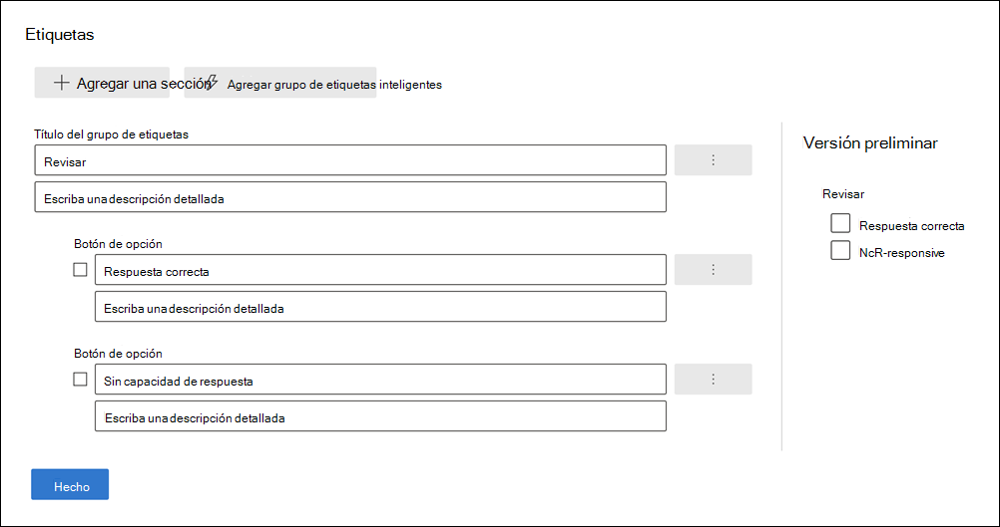
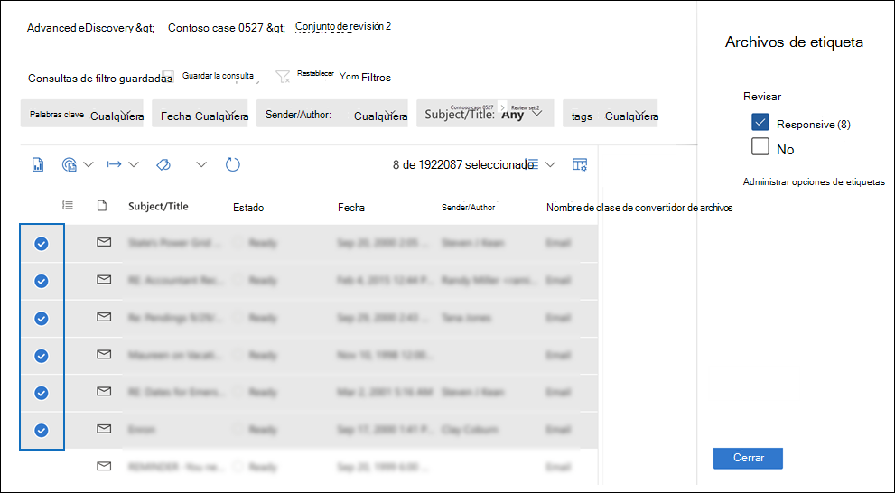
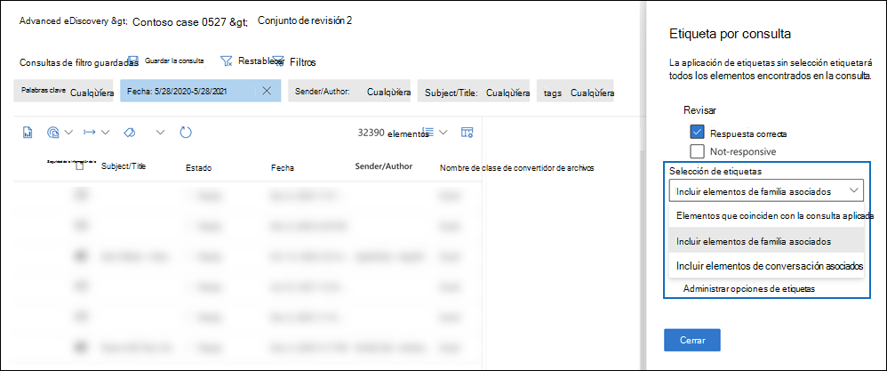

# Etiquetar documentos en un conjunto de revisión en Advanced eDiscoveryTag documents in a review set in Advanced eDiscovery

Organizar el contenido en un conjunto de revisión es importante para completar varios flujos de trabajo en el proceso de exhibición de documentos electrónicos.Organizing content in a review set is important to complete various workflows in the eDiscovery process. Esto incluye:This includes:

- Selección de contenido innecesarioCulling unnecessary content

- Identificación de contenido relevanteIdentifying relevant content

- Identificar el contenido que debe revisar un experto o un abogadoIdentifying content that must be reviewed by an expert or attorney

Cuando expertos, abogados u otros usuarios revisan el contenido de un conjunto de opiniones, sus opiniones relacionadas con el contenido se pueden capturar mediante etiquetas.When experts, attorneys, or other users review content in a review set, their opinions related to the content can be captured by using tags. Por ejemplo, si el objetivo es crear contenido innecesario, un usuario puede etiquetar documentos con una etiqueta como "no responde".For example, if the intent is to cull unnecessary content, a user can tag documents with a tag such as "non-responsive". Después de revisar y etiquetar el contenido, se puede crear una búsqueda de conjunto de revisión para excluir cualquier contenido etiquetado como "no responde".After content has been reviewed and tagged, a review set search can be created to exclude any content tagged as "non-responsive". Este proceso elimina el contenido que no responde de los siguientes pasos del flujo de trabajo de exhibición de documentos electrónicos.This process eliminates the non-responsive content from the next steps in the eDiscovery workflow. El panel de etiquetado de un conjunto de revisión se puede personalizar para cada caso de modo que las etiquetas admitan el flujo de trabajo de revisión previsto para el caso.The tagging panel in a review set can be customized for every case so that the tags support the intended review workflow for the case.

> [!NOTE]
> El ámbito de las etiquetas es Advanced eDiscovery caso.The scope of tags is an Advanced eDiscovery case. Esto significa que un caso solo puede tener un conjunto de etiquetas que los revisores pueden usar para etiquetar documentos del conjunto de revisión.That means a case can only have one set of tags that reviewers can use to tag review set documents. No puede configurar un conjunto diferente de etiquetas para su uso en distintos conjuntos de revisión en el mismo caso.You can't set up a different set of tags for use in different review sets in the same case.

## Tipos de etiquetasTag types

Advanced eDiscovery proporciona dos tipos de etiquetas:Advanced eDiscovery provides two types of tags:

- **Etiquetas de opción** única: restringe a los revisores a seleccionar una sola etiqueta dentro de un grupo.**Single choice tags**: Restricts reviewers to selecting a single tag within a group. Estos tipos de etiquetas pueden ser útiles para garantizar que los revisores no seleccionen etiquetas en conflicto como "responsive" y "non-responsive".These types of tags can be useful to ensure that reviewers don't select conflicting tags such as "responsive" and "non-responsive". Las etiquetas de opción única aparecen como botones de radio.Single choice tags appear as radio buttons.

- **Etiquetas de opción múltiple:** permitir que las revisiones seleccionen varias etiquetas dentro de un grupo.**Multiple choice tags**: Allow reviews to select multiple tags within a group. Estos tipos de etiquetas aparecen como casillas de verificación.These types of tags appear as checkboxes.

## Estructura de etiquetasTag structure

Además de los tipos de etiquetas, la estructura de cómo se organizan las etiquetas en el panel de etiquetas se puede usar para hacer que los documentos de etiquetado sean más intuitivos.In addition to the tag types, the structure of how tags are organized in the tag panel can be used to make tagging documents more intuitive. Las etiquetas se agrupan por secciones.Tags are grouped by sections. La búsqueda de conjunto de revisión admite la capacidad de buscar por etiqueta y por sección de etiquetas.Review set search supports the ability to search by tag and by tag section. Esto significa que puede crear una búsqueda de conjunto de revisión para recuperar documentos etiquetados con cualquier etiqueta de una sección.This means you can create a review set search to retrieve documents tagged with any tag in a section.

Puede organizar aún más las etiquetas anidandolas dentro de una sección.You can further organize tags by nesting them within a section. Por ejemplo, si el objetivo es identificar y etiquetar contenido con privilegios, se puede usar el anidamiento para dejar claro que un revisor puede etiquetar un documento como "Privileged" y seleccionar el tipo de privilegio comprobando la etiqueta anidada adecuada.For example, if the intent is to identify and tag privileged content, nesting can be used to make it clear that a reviewer can tag a document as "Privileged" and select the type of privilege by checking the appropriate nested tag.

## Crear etiquetasCreate tags

Antes de aplicar etiquetas a documentos en el conjunto de revisión, debe crear una estructura de etiquetas.Before applying tags to documents in the review set, you need to create a tag structure.

1. Abra un conjunto de revisión y navegue a la barra de comandos y seleccione **Etiquetar por consulta**.Open a review set and navigate to the command bar and select **Tag by query**.

2. En el panel de etiquetado, seleccione **Administrar opciones de etiquetas**In the tagging panel, select **Manage tag options**

3. Seleccione **Agregar sección de etiqueta**.Select **Add tag section**.

4. Escriba un título de grupo de etiquetas y una descripción opcional y, a continuación, haga clic en **Guardar**.Type a tag group title and an optional description, and then click **Save**.

5. Seleccione el menú desplegable de triple punto junto al título del grupo de etiquetas y haga clic en **Agregar** casilla de verificación o **en El botón de opción Agregar**.Select the triple dot dropdown menu next to the tag group title and click **Add check box** or **Add option button**.

6. Escriba un nombre y una descripción para la casilla o el botón de opción.Type a name and description for the checkbox or option button.

7. Repita este proceso para crear nuevas secciones de etiquetas, opciones de etiquetas y casillas de verificación.Repeat this process to create new tag sections, tag options, and checkboxes.

   

## Aplicación de etiquetasApplying tags

Con la estructura de etiquetas en su lugar, los revisores pueden aplicar etiquetas a los documentos de un conjunto de revisión.With the tag structure in place, reviewers can apply tags to documents in a review set. Hay dos formas diferentes de aplicar etiquetas:There are two different ways to apply tags:

- Archivos de etiquetaTag files

- Etiqueta por consultaTag by query

### Archivos de etiquetaTag files

Tanto si selecciona un solo elemento como varios elementos de un conjunto de revisión, puede aplicar etiquetas a su selección haciendo clic en **Etiquetar archivos** en la barra de comandos.Whether you select a single item or several items in a review set, you can apply tags to their selection by clicking **Tag files** in the command bar. En el panel de etiquetado, puede seleccionar una etiqueta y se aplica automáticamente a los documentos seleccionados.In the tagging panel, you can select a tag and it is automatically applied to the selected documents.

> [!NOTE]
> Las etiquetas solo se aplicarán a los elementos seleccionados de la lista de elementos.Tags will be applied only to selected items in the list of items.

### Etiqueta por consultaTag by query

El etiquetado por consulta le permite aplicar etiquetas a todos los elementos mostrados por una consulta de filtro que se aplica actualmente en el conjunto de revisión.Tagging by query lets you apply tags to all items displayed by a filter query that's currently applied in the review set.

1. Anule la selección de todos los elementos del conjunto de revisión y vaya a la barra de comandos y **seleccione Etiquetar por consulta**.Unselect all items in the review set and go to the command bar and select **Tag by query**.

2. En el panel de etiquetado, seleccione la etiqueta que desea aplicar.In the tagging panel, select the tag that you want to apply.

3. En el **desplegable Selección de** etiquetas, hay tres opciones que determinan a qué elementos aplicar la etiqueta.Under the **Tag selection** dropdown, there are three options that dictate which items to apply the tag to.

   - **Elementos que coinciden con la consulta aplicada:** aplica etiquetas a elementos específicos que coinciden con las condiciones de consulta de filtro.**Items that match applied query**: Applies tags to specific items that match the filter query conditions.

   - **Incluir elementos de familia asociados:** aplica etiquetas a elementos específicos que coinciden con las condiciones de consulta de filtro y sus elementos de familia asociados.**Include associated family items**: Applies tags to specific items that match the filter query conditions and their associated family items. *Los elementos de* familia son elementos que comparten el mismo valor de metadatos de FamilyId.*Family items* are items that share the same FamilyId metadata value.  

   - **Incluir elementos de conversación asociados:** aplica etiquetas a los elementos que coinciden con las condiciones de consulta de filtro y sus elementos de conversación asociados.**Include associated conversation items**: Applies tags to items that match the filter query conditions and their associated conversation items. *Los elementos de* conversación son elementos que comparten los mismos valores de metadatos de ConversationId.*Conversation items* are items that share the same ConversationId metadata values.

   

4. Haga **clic en Iniciar trabajo de etiquetado** para desencadenar el trabajo de etiquetado.Click **Start tagging job** to trigger the tagging job.

## Filtro de etiquetasTag filter

Use el filtro de etiquetas en el conjunto de revisión para buscar o excluir rápidamente elementos de los resultados de la consulta en función de cómo se etiqueta un elemento.Use the tag filter in review set to quickly find or exclude items from the query results based on how an item is tagged. 

1. Seleccione **Filtros** para expandir el panel de filtro.Select **Filters** to expand the filter panel.

2. Seleccione y expanda **Propiedades de elemento**.Select and expand **Item properties**.

3. Desplácese hacia abajo para buscar el filtro denominado **Tag**, seleccione la casilla y, a continuación, haga clic en **Listo**.Scroll down to find the filter named **Tag**, select the checkbox, and then click **Done**.

4. Para incluir o excluir elementos con una etiqueta específica de una consulta, realice una de las siguientes acciones:To include or exclude items with a specific tag from a query, do one of the following:

   - **Incluir elementos:** seleccione el valor de la etiqueta y **seleccione Igual a cualquiera en** el menú desplegable.**Include items**: Select the tag value and select **Equal any of** in the dropdown menu.

      O bien:Or

   - **Excluir elementos:** seleccione el valor de la etiqueta y **seleccione No es** igual a ninguno en el menú desplegable.**Exclude items**: Select the tag value and select **Equals none of** in dropdown menu.

     

> [!NOTE]
> Asegúrese de actualizar la página para asegurarse de que el filtro de etiquetas muestra los cambios más recientes en la estructura de etiquetas.Be sure to refresh the page to ensure that the tag filter displays the latest changes to the tag structure.
