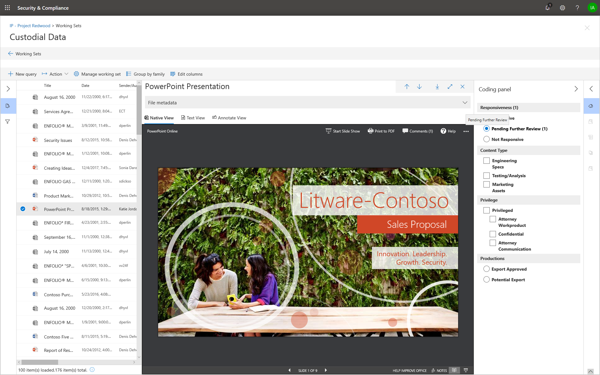

# Etiquetar documentos en un conjunto de revisión en eDiscovery avanzado

La organización de contenido en un conjunto de revisión es importante para completar varios flujos de trabajo en el proceso de exhibición de documentos electrónicos. Incluye lo siguiente:

- Selección de contenido innecesario

- Identificación del contenido relevante
 
- Identificación de contenido que debe ser revisado por un experto o un abogado

Cuando expertos, abogados u otros usuarios revisan el contenido de un conjunto de revisión, se pueden capturar sus opiniones relacionadas con el contenido mediante el uso de etiquetas. Por ejemplo, si la intención es deseleccionar contenido innecesario, un usuario puede etiquetar documentos con una etiqueta como "sin respuesta". Una vez que se ha revisado y etiquetado el contenido, se puede crear una búsqueda de conjunto de revisión para excluir cualquier Contenido etiquetado como "sin respuesta", lo que elimina este contenido de los pasos siguientes en el flujo de trabajo de eDiscovery. El panel de etiquetas se puede personalizar para cada caso, de modo que las etiquetas puedan admitir el flujo de trabajo de revisión previsto.

## Tipos de etiquetas

La exhibición avanzada de documentos electrónicos proporciona dos tipos de etiquetas:

- **Etiquetas de opción única** : limita a los usuarios a seleccionar una sola etiqueta dentro de un grupo. Esto puede ser útil para asegurarse de que los usuarios no seleccionan etiquetas conflictivas como "receptivo" y "sin respuesta". Se mostrarán como botones de opción.

- **Etiquetas de varias opciones** : permite a los usuarios seleccionar varias etiquetas dentro de un grupo. Se mostrarán como casillas de verificación.

## Estructura de etiquetas

Además de los tipos de etiqueta, la estructura de la forma en que se organizan las etiquetas en el panel etiqueta puede usarse para que los documentos de etiquetado sean más intuitivos. Las etiquetas se agrupan por secciones. Revisión Set Search admite la capacidad de buscar por etiqueta y por etiqueta. Esto significa que puede crear una búsqueda de conjunto de revisión para recuperar documentos etiquetados con cualquier etiqueta en una sección.

Las etiquetas se pueden organizar en mayor profundidad si se anidan dentro de una sección. Por ejemplo, si la intención es identificar y etiquetar contenido privilegiado, se puede usar la anidación para dejar claro que un usuario puede etiquetar un documento como "privilegiado" y seleccionar el tipo de privilegio comprobando la etiqueta anidada adecuada.

## Aplicar etiquetas

Hay varias formas de aplicar una etiqueta al contenido.

### Etiquetado de un solo documento

Al ver un documento en un conjunto de revisiones, puede mostrar las etiquetas que puede usar una revisión haciendo clic en **Panel de etiquetado**.

Esto le permitirá aplicar etiquetas al documento que se muestra en el visor.

### Etiquetado masivo

La etiquetación en masa se puede realizar seleccionando varios archivos en la cuadrícula de resultados y, a continuación, usando las etiquetas en el **Panel de etiquetado** , de forma similar a la etiqueta de un único documento. Para realizar un etiquetado masivo, puede seleccionar las etiquetas dos veces; el primer clic aplicará la etiqueta y la segunda se asegurará de que la etiqueta se borre para todos los archivos seleccionados.

> [!NOTE]
> Cuando se realiza un etiquetado masivo, el panel etiquetado muestra un recuento de archivos que se etiquetan para cada etiqueta del panel.

### Etiquetado en otros paneles de revisión

Al revisar los documentos, puede usar los otros paneles de revisión para revisar otras características de los documentos en la cuadrícula de resultados. Esto incluye la revisión de otros documentos relacionados, subprocesos de correo electrónico, Near duplicados y duplicados de hash. Por ejemplo, cuando está revisando documentos relacionados (mediante el panel revisión de **familia de documentos** ), puede reducir significativamente el tiempo de revisión mediante el etiquetado en masa de los documentos relacionados. Por ejemplo, si un mensaje de correo electrónico tiene varios datos adjuntos y desea asegurarse de que toda la familia se etiquete de forma coherente.

Por ejemplo, aquí se muestra cómo mostrar el **Panel de etiquetado** al usar el panel de revisión de la **familia de documentos** :

1. Con el panel revisión abierto para un documento seleccionado (por ejemplo, Mostrar la lista de contenido relacionado en el panel revisión de **familia de documentos** , haga clic en **etiquetar documentos** en el panel revisión de familia de documentos.

   El panel de etiquetado se muestra como una ventana emergente.

2. Elija una o más etiquetas para aplicar el documento seleccionado. 

3. Para etiquetar todos los documentos, seleccione todos los documentos en el panel de la **familia de documentos** , haga clic en **etiquetar documentos**y, a continuación, elija las etiquetas que se aplicarán a toda la familia de documentos.

