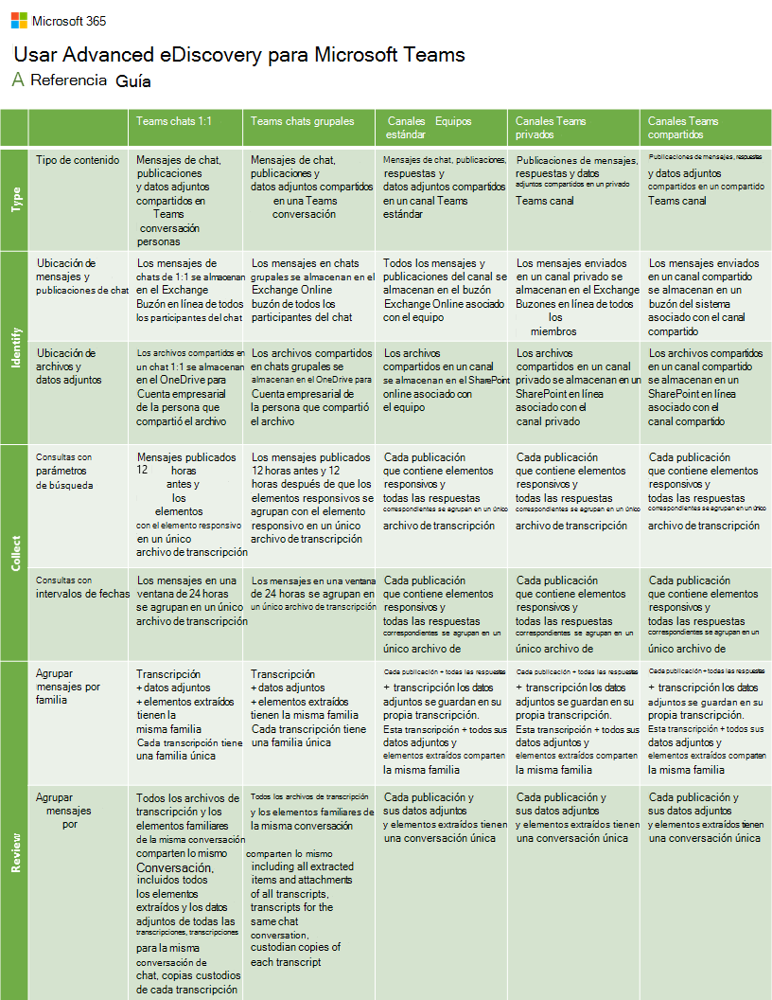

# Flujo de trabajo de eDiscovery (Premium) para el contenido de Microsoft Teams

[!include[Purview banner](../includes/purview-rebrand-banner.md)]

En este artículo se proporciona un conjunto completo de procedimientos, directrices y procedimientos recomendados para usar Microsoft Purview eDiscovery (Premium) para conservar, recopilar, revisar y exportar contenido de Microsoft Teams. El objetivo de este artículo es ayudarle a optimizar el flujo de trabajo de eDiscovery para Teams contenido.

Hay seis categorías de contenido de Teams que puede recopilar y procesar mediante eDiscovery (Premium):

- **Teams chats 1:1**. Mensajes de chat, publicaciones y datos adjuntos compartidos en una conversación Teams entre dos personas.  Teams chats 1:1 también se denominan *conversaciones*.

- **Teams chats de grupo**. Mensajes de chat, publicaciones y datos adjuntos compartidos en una conversación Teams entre tres o más personas. También se denomina chats *1:N* o *conversaciones grupales*.

- **Teams reacciones**. Reacciones aplicadas a mensajes de chat, publicaciones y datos adjuntos en una conversación Teams.

- **canales de Teams**. Mensajes de chat, publicaciones, respuestas y datos adjuntos compartidos en un canal de Teams estándar.

- **Canales privados**. Mensajes, respuestas y datos adjuntos compartidos en un canal de Teams privado.

- **Canales compartidos**. Mensajes, respuestas y datos adjuntos compartidos en un canal de Teams compartido.

## Dónde se almacena Teams contenido

Un requisito previo para administrar Teams contenido en eDiscovery (Premium) es comprender el tipo de contenido de Teams que puede recopilar, procesar y revisar en eDiscovery (Premium) y dónde se almacena ese contenido en Microsoft 365. En la tabla siguiente se enumeran Teams tipo de contenido y dónde se almacena cada uno.

|&nbsp;|Ubicación de mensajes y publicaciones de chat|Ubicación de archivos y datos adjuntos|
|---|---|---|
|chats de Teams 1:1|Los mensajes de los chats 1:1 se almacenan en el buzón Exchange Online de todos los participantes del chat.|Los archivos compartidos en un chat 1:1 se almacenan en la cuenta OneDrive para la Empresa de la persona que ha compartido el archivo.|
|Teams chats de grupo|Los mensajes de los chats de grupo se almacenan en el buzón Exchange Online de todos los participantes del chat.|Los archivos compartidos en los chats de grupo se almacenan en la cuenta OneDrive para la Empresa de la persona que ha compartido el archivo.|
|reacciones Teams|Los mensajes de los chats de grupo se almacenan en el buzón Exchange Online de todos los participantes del chat.|Los archivos compartidos en los chats de grupo se almacenan en la cuenta OneDrive para la Empresa de la persona que ha compartido el archivo.|
|Canales de Teams|Todos los mensajes y publicaciones del canal se almacenan en el buzón de Exchange Online asociado al equipo.|Los archivos compartidos en un canal se almacenan en el sitio de SharePoint Online asociado al equipo.|
|Canales privados|Los mensajes enviados en un canal privado se almacenan en los buzones de Exchange Online de todos los miembros del canal privado.|Los archivos compartidos en un canal privado se almacenan en un sitio de SharePoint Online dedicado asociado al canal privado.|
|Canales compartidos|Los mensajes enviados en un canal compartido se almacenan en un buzón del sistema asociado al canal compartido. 1|Los archivos compartidos en un canal compartido se almacenan en un sitio dedicado SharePoint Online asociado al canal compartido.|

> [!NOTE]
> 1 Para buscar (y conservar) los mensajes enviados en un canal compartido, debe buscar o especificar el buzón de Exchange Online para el equipo primario.

## Creación de un caso para Teams contenido

El primer paso para administrar Teams contenido en eDiscovery (Premium) es crear un caso con el nuevo formato de caso optimizado para administrar Teams contenido. Estas son las ventajas de usar el nuevo formato de caso para Teams contenido:

- Compatibilidad con el subproceso de conversación, en el que los mensajes adicionales de la misma conversación que incluyen elementos con capacidad de respuesta se recopilan y agregan automáticamente a los conjuntos de revisión.

- Teams conversaciones de chat se agregan automáticamente a los conjuntos de revisión como un archivo de transcripción HTML. Los datos adjuntos en la nube que se comparten en las conversaciones también se agregan al conjunto de revisión. Esto ayuda a proporcionar contexto a las conversaciones con elementos con capacidad de respuesta y reducir el número total de elementos generados por el contenido basado en chat.

- Las colecciones de hasta 1 TB se pueden agregar a conjuntos de revisión, lo que le permite recopilar e importe grandes cantidades de Teams contenido en un caso.

Para obtener más información sobre el aumento de los límites de casos, vea [Uso del nuevo formato de caso en eDiscovery (Premium)](advanced-ediscovery-new-case-format.md).

Para crear un caso:

1. Vaya a <https://compliance.microsoft.com> e inicie sesión.

2. En el panel de navegación izquierdo del portal de cumplimiento Microsoft Purview, haga clic en **eDiscovery > Avanzadas**.

3. En la página **eDiscovery (Premium),** haga clic en la pestaña **Casos** y, a continuación, haga clic en **Crear un caso**.

   Se muestra la página de control flotante **Nuevo caso de exhibición de** documentos electrónicos. La sección **Formato de** caso proporciona la opción de crear un caso con el nuevo formato de mayúsculas y minúsculas.

   

4. Después de asignar un nombre al caso, seleccione la opción **Nuevo** y, a continuación, haga clic en **Guardar** para crear el caso.

## Adición de orígenes de datos de Teams custodia y conservación del contenido de Teams  

El siguiente paso es identificar a los usuarios que son los custodios de datos de la investigación y agregarlos y sus ubicaciones de contenido como custodios al caso que creó en la sección anterior. Al agregar custodios, puede especificar su buzón de correo y OneDrive cuenta como orígenes de datos de custodia. También puede especificar Teams ubicaciones de contenido como orígenes de datos custodios para colocar rápidamente estas ubicaciones en suspensión legal para conservar el contenido durante la investigación. También facilita la recopilación de contenido y su incorporación a un conjunto de revisión.

Para agregar custodios a un caso y conservar orígenes de datos de custodia:

1. Vaya al caso de eDiscovery (Premium) que creó en la sección anterior y, a continuación, haga clic en **Orígenes de datos**.

2. En la página **Orígenes de datos**, haga clic en **Agregar origen de** >  datos **Agregar nuevos custodios**.

3. En el Asistente para **nuevo custodio** , agregue uno o varios usuarios como custodios al caso escribiendo la primera parte del nombre o alias del usuario. Después de encontrar la persona correcta, seleccione su nombre para agregarlo a la lista.  

4. Expanda cada custodio para ver los orígenes de datos principales que se han asociado automáticamente al custodio y seleccionar otras ubicaciones para asociar al custodio.

   

5. Siga estas instrucciones para agregar orígenes de datos de custodia para Teams contenido. Haga clic en **Editar** para agregar una ubicación de datos.

   - **Buzones de correo**. El buzón del custodio está seleccionado de forma predeterminada. Mantenga esta opción seleccionada para agregar (y conservar) chats 1:1, chats de grupo y chats de canales privados como datos de custodia.

   - **OneDrives**. La cuenta de OneDrive del custodio está seleccionada de forma predeterminada. Mantenga esta opción seleccionada para agregar (y conservar) archivos compartidos en chats 1:1 y chats de grupo como datos de custodia.

   - **SharePoint**. Agregue el sitio SharePoint asociado a cualquier canal privado o compartido del que el custodio sea miembro para agregar (y conservar) como datos custodiales los archivos compartidos en un canal. Haga clic en **Editar** y agregue la dirección URL del sitio SharePoint asociado a un canal privado o compartido. Para obtener información sobre cómo localizar los canales privados y compartidos de los que un usuario es miembro, consulte [eDiscovery of private and shared channels (Exhibición de documentos electrónicos de canales privados y compartidos](/microsoftteams/ediscovery-investigation#ediscovery-of-private-and-shared-channels)).

   - **Microsoft Teams**. Agregue los equipos de los que es miembro el custodio para agregar (y conservar) como datos de custodia todos los mensajes de canal y todos los archivos compartidos a un canal de Teams. Esto incluye agregar el buzón para el equipo primario de un canal compartido del que es miembro el custodio. Al hacer clic en **Editar**, el buzón de correo y el sitio asociados a cada equipo del que es miembro el custodio se muestran en una lista. Seleccione los equipos que desea asociar al custodio. Debe seleccionar el buzón y el sitio correspondientes para cada equipo.

   > [!NOTE]
   > También puede agregar el buzón de correo y el sitio de Teams de los que los custodios no son miembros como ubicación de datos de custodio. Para ello, haga clic en **Editar** junto a **Exchange** y **SharePoint** y, a continuación, agregue el buzón y el sitio asociados al equipo.

6. Después de agregar custodios y configurar los orígenes de datos de custodia, haga clic en **Siguiente** para mostrar la página **Configuración de suspensión** .

   Se muestra una lista de los custodios y la casilla de la columna **Detención** está seleccionada de forma predeterminada. Esto indicó que se colocará una retención en los orígenes de datos asociados a cada custodio. Deje activadas estas casillas para conservar estos datos.

7. En la página **Configuración de suspensión** , haga clic en **Siguiente** para revisar la configuración de los custodios. Haga clic en **Enviar** para agregar los custodios al caso.

Para obtener más información sobre cómo agregar y conservar orígenes de datos en un caso de exhibición de documentos electrónicos (Premium), vea:

- [Agregar custodios a un caso de exhibición de documentos electrónicos (Premium)](add-custodians-to-case.md)

- [Adición de orígenes de datos sin custodia a un caso de eDiscovery (Premium)](non-custodial-data-sources.md)

## Recopilar Teams contenido y agregarlo al conjunto de revisión

Después de agregar custodios al caso y conservar el contenido en orígenes de datos de custodios, el siguiente paso del flujo de trabajo es buscar Teams contenido que sea relevante para la investigación y agregarlo a un conjunto de revisión para su revisión y análisis adicionales. Aunque es habitual recopilar Teams contenido junto con contenido de otros servicios de Microsoft 365, como el correo electrónico en Exchange y los documentos de SharePoint, esta sección se centrará específicamente en recopilar Teams contenido de una colección. Puede crear colecciones adicionales que recopilen contenido no Teams para agregar a un conjunto de revisión.

Al recopilar Teams contenido de un caso, hay dos pasos en el flujo de trabajo:

1. **Cree una colección de borradores**.  El primer paso consiste en crear una *colección de borradores*, que es una estimación de los elementos que coinciden con los criterios de búsqueda. Puede ver información sobre los resultados que coincidieron con la consulta de búsqueda, como el número total y el tamaño de los elementos encontrados, los distintos orígenes de datos donde se encontraron y las estadísticas sobre la consulta de búsqueda. También puede obtener una vista previa de un ejemplo de elementos devueltos por la colección. Con estas estadísticas, puede cambiar la consulta de búsqueda y volver a ejecutar la colección de borradores tantas veces como sea necesario para restringir los resultados hasta que esté satisfecho de recopilar el contenido relevante para su caso.

2. **Confirme una colección de borradores en un conjunto de revisión**. Una vez que esté satisfecho con los resultados de una colección de borradores, puede confirmar la colección en un conjunto de revisión. Al confirmar una colección de borradores, los elementos devueltos por la colección se agregan a un conjunto de revisión para su revisión, análisis y exportación.

También tiene la opción de no ejecutar una colección de borradores y agregar los resultados de la colección directamente a un conjunto de revisión al crear y ejecutar la colección.

Para crear una colección de contenido Teams:

1. Vaya al caso de eDiscovery (Premium) al que agregó los custodios en la sección anterior y, a continuación, haga clic en **Colecciones**.

2. En la página **Colecciones** , seleccione **Nueva colección** > **Estándar**.

3. Escriba un nombre (obligatorio) y una descripción (opcional) para la colección.

4. En la página **Orígenes de datos custodiales** , haga clic en **Seleccionar custodios** para seleccionar los custodios que agregó al caso.

   La lista de los custodios del caso se muestra en la página desplegable **Seleccionar custodios** .

5. Seleccione uno o varios custodios y haga clic en **Agregar**.

   Después de agregar custodios específicos a la colección, se muestra una lista de orígenes de datos específicos para cada custodio. Estos son los orígenes de datos que configuró al agregar el custodio al caso. Todos los orígenes de datos del custodio se seleccionan de forma predeterminada. Esto incluye cualquier Teams o canales asociados a un custodio.

   Se recomienda hacer lo siguiente al recopilar Teams contenido:

   - Quite las cuentas de OneDrive de los custodios del ámbito de la colección (anulando la selección de la casilla en la columna **OneDrive del custodio** para cada custodio). Esto impide la recopilación de archivos duplicados que se asociaron a chats 1:1 y chats de grupo. Los datos adjuntos en la nube se recopilan automáticamente de cada conversación que se encuentra en la colección al confirmar la colección de borradores en el conjunto de revisión. Mediante este método (en lugar de buscar OneDrive cuentas como parte de la colección), los archivos adjuntos a 1:1 y los chats de grupo se agrupan en la conversación en la que se compartieron.

   - Anule la selección de la casilla de la columna **Sitio adicional** para quitar los sitios SharePoint que contienen archivos compartidos en canales privados o compartidos. Esto elimina la recopilación de archivos duplicados que se adjuntaban a conversaciones de canales privados o compartidos porque estos datos adjuntos en la nube se agregan automáticamente al conjunto de revisión al confirmar la colección de borradores y se agrupan en las conversaciones en las que se compartieron.

6. Si anteriormente ha seguido los pasos para agregar Teams contenido como orígenes de datos custodios, puede omitir este paso y seleccionar **Siguiente**. De lo contrario, en la página Asistente para **orígenes de datos sin custodia**, puede elegir orígenes de datos que no sean de custodia que contengan Teams contenido que haya agregado al caso para buscar en la colección.

7. Si anteriormente ha seguido los pasos para agregar Teams contenido como orígenes de datos custodios, puede omitir este paso y seleccionar **Siguiente**. De lo contrario, en la página Asistente para **ubicaciones adicionales** , puede agregar otros orígenes de datos para buscar en la colección. Por ejemplo, podría agregar el buzón de correo y el sitio para un equipo que no se agregó como un origen de datos custodio o no custodio. De lo contrario, seleccione **Siguiente** y omita este paso.

8. En la página **Asistente para condiciones**, configure la consulta de búsqueda para recopilar Teams contenido de los orígenes de datos especificados en las páginas anteriores del asistente. Puede usar varias palabras clave y condiciones de búsqueda para restringir el ámbito de la colección. Para obtener más información, consulte [Compilación de consultas de búsqueda para colecciones](building-search-queries.md).

   Para garantizar la recopilación más completa de Teams conversaciones de chat (incluidos los chats de canal, grupo y 1:1) use la condición **Tipo** y seleccione la opción **Mensajes instantáneos**. También se recomienda incluir un intervalo de fechas o varias palabras clave para restringir el ámbito de la colección a elementos relevantes para la investigación. Esta es una captura de pantalla de una consulta de ejemplo con las opciones **Tipo** y **Fecha** :

   

9. En la página **Guardar borrador o recopilar** asistente, realice una de las siguientes acciones en función de si desea crear una colección de borradores o confirmar la colección en un conjunto de revisión.

   

   1. **Guarde la colección como borrador**. Elija esta opción para crear una colección de borradores. Como se explicó anteriormente, una colección de borradores no agrega los resultados de la colección a un conjunto de revisión. Devuelve una estimación de los resultados de búsqueda que coinciden con la consulta de búsqueda de los orígenes de datos en el ámbito de la colección. Esto le ofrece la oportunidad de ver [estadísticas de recopilación e informes[(collection-statistics-reports.md)] y editar y volver a ejecutar la colección de borradores. Cuando esté satisfecho con el resultado de una colección de borradores, puede confirmarla en un conjunto de revisión. Para obtener más información, consulte [Creación de una colección de borradores](create-draft-collection.md).

   2. **Recopile elementos y agréguelos a un conjunto de revisión**. Elija esta opción para ejecutar la colección y, a continuación, agregue los resultados a un conjunto de revisión. Puede agregar la colección a un conjunto de revisión nuevo o existente. Las opciones para recopilar mensajes contextuales Teams de conversación (también *denominados subprocesos de conversación*) y recopilar datos adjuntos en la nube se seleccionan de forma predeterminada y no se pueden anular. Estas opciones se aplican automáticamente debido al nuevo formato de caso que usó al crear inicialmente el caso para Teams contenido. Para obtener más información sobre la confirmación de colecciones en un conjunto de revisión, consulte [Confirmación de una colección de borradores en un conjunto de revisión](commit-draft-collection.md).

10. Una vez que haya terminado de configurar la colección, envíela para crear una colección de borradores o recopilar elementos y agregarlos a un conjunto de revisión.

   Cuando se completa el proceso de agregar la colección al conjunto de revisión, el valor de estado de la colección de la pestaña **Colecciones** se establece en **Confirmado**.

## Revisar Teams contenido de un conjunto de revisión

Después de agregar colecciones de contenido de Teams a un conjunto de revisión, el siguiente paso es revisar el contenido por su relevancia para la investigación y seleccionarlo si es necesario. Un requisito previo importante para revisar Teams contenido es comprender cómo eDiscovery (Premium) procesa Teams conversaciones de chat y datos adjuntos al agregarlos a un conjunto de revisión. Este procesamiento de Teams contenido da como resultado tres cosas:

- **[Agrupación](#grouping)**. Cómo se agrupan y presentan los mensajes, las publicaciones y las respuestas Teams conversaciones en el conjunto de revisión. Esto también incluye datos adjuntos en conversaciones de chat que se extraen y agrupan dentro de la conversación.

- **[Subprocesos de conversación de transcripción](#transcript-conversation-threading)**. Cómo eDiscovery (Premium) determina qué contenido adicional de una conversación se va a recopilar para proporcionar contexto en torno a los elementos que coincidieron con los criterios de colección.

- **[Desduplicación](#deduplication-of-teams-content)**. Cómo eDiscovery (Premium) controla el contenido duplicado Teams.

- **[Metadatos](#metadata-for-teams-content)**. Propiedades de metadatos que eDiscovery (Premium) agrega a Teams contenido después de recopilarlo y agregarlo a un conjunto de revisión.

Comprender la agrupación, el subproceso de conversación, la desduplicación y los metadatos de Teams le ayudarán a optimizar la revisión y el análisis del contenido de Teams. Esta sección también tiene [sugerencias para ver Teams contenido en un conjunto de revisión](#tips-for-viewing-teams-content-in-a-review-set).

### Agrupación

Cuando el contenido de Teams conversaciones de chat se agrega a un conjunto de revisión, los mensajes, las publicaciones y las respuestas de las conversaciones se agregan en archivos de transcripción HTML. Una sola conversación de chat puede tener varios archivos de transcripción. Una función importante de estos archivos de transcripción es presentar Teams contenido como conversaciones continuas y no como mensajes individuales (o independientes). Esto ayuda a proporcionar contexto para los elementos que coincidieron con los criterios de búsqueda de las colecciones en el paso anterior y reduce el número de elementos recopilados en el conjunto de revisión. Las transcripciones y los elementos asociados se pueden agrupar por *familia* o *conversación*. Los elementos de la misma familia tendrán el mismo valor para la propiedad de metadatos **FamilyId** . Los elementos de la misma conversación tendrán el mismo valor para la propiedad de metadatos **ConversationId** .

En la tabla siguiente se describe cómo se agrupan los diferentes tipos de contenido de chat de Teams por familia y conversación.

|Teams tipo de contenido|Agrupar por familia|Agrupar por conversación|
|---|---|---|
|Teams 1:1 y chats grupales|Una transcripción y todos sus datos adjuntos y elementos extraídos comparten el mismo **FamilyId**. Cada transcripción tiene un **FamilyId** único.|Todos los archivos de transcripción y sus elementos de familia dentro de la misma conversación comparten el mismo **ConversationId**. Esto incluye los siguientes elementos: <ul><li>Todos los elementos y datos adjuntos extraídos de todas las transcripciones que comparten el mismo **ConversationId**.</li><li>Todas las transcripciones de la misma conversación de chat</li><li>Todas las copias custodios de cada transcripción</li><li>Transcripciones de colecciones posteriores de la misma conversación de chat</li></ul>   Para Teams 1:1 y conversaciones de chat en grupo, es posible que tenga varios archivos de transcripción, cada uno correspondiente a un período de tiempo diferente dentro de la conversación. Dado que estos archivos de transcripción proceden de la misma conversación con los mismos participantes, comparten el mismo **ConversationId**.|
|Chats de canales estándar, privados y compartidos|Cada publicación y todas las respuestas y datos adjuntos se guardan en su propia transcripción. Esta transcripción y todos sus datos adjuntos y elementos extraídos comparten el mismo **FamilyId**.|Cada publicación y sus datos adjuntos y elementos extraídos tienen un **ConversationId** único. Si hay colecciones posteriores o nuevas respuestas de la misma publicación, las transcripciones diferenciales resultantes de esas colecciones también tendrán el mismo **ConversationId**.|

Use el control **Group** de la barra de comandos de un conjunto de revisión para ver Teams contenido agrupado por familia o conversación.

- Seleccione **Agrupar datos adjuntos de familia** para ver Teams contenido agrupado por familia. Cada archivo de transcripción se muestra en una línea de la lista de elementos del conjunto de revisión. Los datos adjuntos se anidan en el elemento.

- Seleccione **Agrupar Teams o Yammer conversaciones** para ver Teams contenido agrupado por conversación. Cada conversación se muestra en una línea de la lista de elementos del conjunto de revisión. Los archivos de transcripción y los datos adjuntos están anidados en la conversación de nivel superior.

> [!NOTE]
> Los datos adjuntos en la nube se agrupan con las conversaciones en las que aparecen. Esta agrupación se realiza asignando el mismo **FamilyId** que el archivo de transcripción del mensaje al que se ha adjuntado el archivo y el mismo **ConversationId** que la conversación en la que apareció el mensaje. Esto significa que se pueden agregar varias copias de datos adjuntos en la nube al conjunto de revisión si se adjuntaron a conversaciones diferentes.

#### Visualización de archivos de transcripción para conversaciones

Al ver los archivos de transcripción en un conjunto de revisión, algunos de los mensajes se resaltan en color púrpura. Los mensajes resaltados dependen de la copia del custodio de la transcripción que esté viendo. Por ejemplo, en un chat 1:1 entre User4 y User2, los mensajes publicados por User4 se resaltan en color púrpura al ver la transcripción recopilada del buzón de User4. Al ver la transcripción de User2 de la misma conversación, los mensajes publicados por User2 se resaltan en color púrpura. Este comportamiento de resaltado se basa en la misma experiencia de cliente Teams, donde las publicaciones de un usuario se resaltan en color púrpura en el cliente Teams.

En las capturas de pantalla siguientes se muestra un ejemplo de conversación en el cliente Teams y el archivo de transcripción de la misma conversación en el conjunto de revisión. El resaltado púrpura en el archivo de transcripción indica que la transcripción se recopiló del buzón de User2.

##### Conversación en Teams cliente

##### Conversación en el archivo de transcripción

### Subprocesos de conversación de transcripción

La funcionalidad de subprocesos de conversación en el nuevo formato de caso en eDiscovery (Premium) le ayuda a identificar el contenido contextual relacionado con los elementos que pueden ser relevantes para la investigación. Esta característica genera distintas vistas de conversación que incluyen mensajes de chat que preceden y siguen los elementos que coinciden con la consulta de búsqueda durante la recopilación. Esta funcionalidad le permite revisar de forma eficaz y rápida las conversaciones de chat completas (*llamadas conversaciones en subprocesos*) en Microsoft Teams. Como se explicó anteriormente, las conversaciones de chat se reconstruyen en archivos de transcripción HTML cuando eDiscovery (Premium) agrega Teams contenido a un conjunto de revisión.

Esta es la lógica que usa eDiscovery (Premium) para incluir mensajes adicionales y archivos de transcripción de respuestas que proporcionan contexto alrededor de los elementos que coinciden con la consulta de colección (denominada *elementos con capacidad de respuesta*) que usó al recopilar Teams contenido. Los distintos comportamientos de subprocesos se basan en los tipos de chats y en la consulta de búsqueda que se usa para recopilar los elementos con capacidad de respuesta. Hay dos escenarios comunes de recopilación:

- Consultas que usan parámetros de búsqueda, como palabras clave y pares property:value

- Consultas que solo usan intervalos de fechas

|Teams tipo de contenido|Consultas con parámetros de búsqueda|Consultas con intervalos de fechas|
|---|---|---|
|Teams 1:1 y chats grupales|Los mensajes que se publicaron 12 horas antes y 12 horas después de que los elementos con capacidad de respuesta se agrupan con el elemento dinámico en un único archivo de transcripción.|Los mensajes de una ventana de 24 horas se agrupan en un único archivo de transcripción.|
|Chats de canales de Teams estándar, privados y compartidos|Cada publicación que contiene elementos con capacidad de respuesta y todas las respuestas correspondientes se agrupan en un único archivo de transcripción.|Cada publicación que contiene elementos con capacidad de respuesta y todas las respuestas correspondientes se agrupan en un único archivo de transcripción.|

### Desduplicación del contenido Teams

En la lista siguiente se describe el comportamiento de desduplicación (y duplicación) al recopilar Teams contenido en un conjunto de revisión.

- Cada archivo de transcripción agregado a un conjunto de revisión debe ser una asignación uno a uno al contenido almacenado en ubicaciones de datos. Esto significa que eDiscovery (Premium) no recopila ningún contenido Teams que ya se haya agregado al conjunto de revisión. Si un mensaje de chat ya está recopilado en un conjunto de revisión, eDiscovery (Premium) no agrega el mismo mensaje desde la misma ubicación de datos al conjunto de revisión en colecciones posteriores.

- Para los chats de grupo y 1:1, las copias de los mensajes se almacenan en el buzón de cada participante de la conversación. Las copias de la misma conversación que existen en los buzones de los distintos participantes se recopilan con metadatos diferentes. Como resultado, cada instancia de la conversación se trata como única y se incluye en el conjunto de revisión en archivos de transcripción independientes. Por lo tanto, si todos los participantes de un chat 1:1 o grupo se agregan como custodios en un caso y se incluyen en el ámbito de una colección, las copias de cada transcripción (para la misma conservación) se agregan al conjunto de revisión y se agruparán junto con el mismo **ConversationId**. Cada una de estas copias está asociada a un custodio correspondiente. **Sugerencia**: La columna **Custodio** de la lista de conjuntos de revisión identifica al custodio del archivo de transcripción correspondiente.

- En colecciones posteriores de elementos de la misma conversación, solo el contenido delta que no se recopiló anteriormente se agrega al conjunto de revisión y se agrupa (compartiendo el mismo **ConversationId**) con las transcripciones recopiladas anteriormente de la misma conversación. Este es un ejemplo de este comportamiento:

   1. La colección A recopila mensajes en una conversación entre User1 y User2 y se agrega al conjunto de revisión.

   2. La colección B recopila mensajes de la misma conversación, pero hay nuevos mensajes entre User1 y User2 desde que se ejecutó la colección A.

   3. Solo los nuevos mensajes de la colección B se agregan al conjunto de revisión. Estos mensajes se agregan a un archivo de transcripción independiente, pero la nueva transcripción se agrupa con las transcripciones de la colección A por el mismo **ConversationId**.

   Este comportamiento se aplica a todos los tipos de chats de Teams.

### Metadatos del contenido de Teams

En grandes conjuntos de revisiones con miles o millones de elementos, puede ser difícil restringir el ámbito de la revisión a Teams contenido. Para ayudarle a centrar la revisión en Teams contenido, hay propiedades de metadatos específicas de Teams contenido. Puede usar estas propiedades para organizar las columnas de la lista de revisión y [configurar filtros y consultas](review-set-search.md) para optimizar la revisión de Teams contenido. Estas propiedades de metadatos también se incluyen al exportar Teams contenido de eDiscovery (Premium), para ayudarle a organizar y ver el contenido después de la exportación o en herramientas de eDiscovery de terceros.

En la tabla siguiente se describen las propiedades de metadatos para Teams contenido.

|Metadata (propiedad)|Descripción|
|---|---|
|ContainsEditedMessage|Indica si un archivo de transcripción contiene un mensaje editado. Los mensajes editados se identifican al ver el archivo de transcripción.|
|ConversationId|GUID que identifica la conversación a la que está asociado el elemento. Los archivos de transcripción y los datos adjuntos de la misma conversación tienen el mismo valor para esta propiedad.|
|Nombre de la conversación|Nombre de la conversación a la que está asociado el archivo de transcripción o los datos adjuntos. Para Teams 1:1 y los chats de grupo, el valor de esta propiedad es el UPN de todos los participantes de la conversación se concatenan. Por ejemplo, `User3 <User3@contoso.onmicrosoft.com>,User4 <User4@contoso.onmicrosoft.com>,User2 <User2@contoso.onmicrosoft.com>`. los chats de Teams canal (estándar, privado y compartido) usan el siguiente formato para el nombre de la conversación: `<Team name>,<Channel name>`. Por ejemplo, `eDiscovery vNext, General`.|
|ConversationType|Indica el tipo de chat de equipo. Para Teams 1:1 y los chats de grupo, el valor de esta propiedad es `Group`. Para los chats de canales estándar, privados y compartidos, el valor es `Channel`.|
|Fecha|Marca de tiempo del primer mensaje del archivo de transcripción.|
|FamilyId|GUID que identifica el archivo de transcripción de una conversación de chat. Los datos adjuntos tendrán el mismo valor para esta propiedad que el archivo de transcripción que contiene el mensaje al que se ha adjuntado el archivo.|
|FileClass|Indica ese tipo de contenido. Los elementos de Teams chats tienen el valor `Conversation`. Por el contrario, Exchange mensajes de correo electrónico tienen el valor `Email`.|
|MessageKind|Propiedad de tipo de mensaje. Teams contenido tiene el valor `microsoftteams , im`.|
|Destinatarios|Lista de todos los usuarios que recibieron un mensaje dentro de la conversación de transcripción.|
|TeamsChannelName|Nombre del canal Teams de la transcripción.|

Para obtener descripciones de otras propiedades de metadatos de eDiscovery (Premium), vea [Campos de metadatos del documento en eDiscovery (Premium)](document-metadata-fields-in-Advanced-eDiscovery.md).

## Exportación de contenido Teams

Después de revisar y seleccionar Teams contenido de un conjunto de revisión, puede exportar los archivos de transcripción que contienen contenido que responde a la investigación. No hay ninguna configuración de exportación específica para Teams contenido. Cada archivo de transcripción se exporta como un archivo de mensaje HTML. Este archivo también contiene etiquetas CDATA ocultas con todos los metadatos de los mensajes de chat individuales. Las propiedades de metadatos descritas en la sección anterior se incluyen cuando se exporta Teams contenido.  

Se hace referencia a cada archivo de transcripción en el archivo de carga y se puede encontrar mediante la ruta de acceso relativa en el campo Export_native_path del archivo de carga. Los archivos de transcripción se encuentran en la carpeta Conversaciones de la carpeta de exportación raíz.

## Sugerencias para ver Teams contenido en un conjunto de revisión

Estas son algunas sugerencias y procedimientos recomendados para ver Teams contenido en un conjunto de revisiones.

- Use el control **Personalizar columnas** de la barra de comandos para agregar y organizar columnas con el fin de optimizar la revisión de Teams contenido.

  

   Puede agregar y quitar columnas que sean útiles para Teams contenido. También puede secuenciar el orden de las columnas arrastrándolas y soltándolas en la página desplegable **Editar columna** . También puede ordenar en columnas para agrupar Teams contenido con valores similares para la columna en la que se ordena.

- Las columnas útiles que le ayudarán a revisar Teams contenido incluyen **Custodio**, **Destinatarios** y **Tipo de archivo** o **Tipo de mensaje**.

- Use [filtros](review-set-search.md) para las propiedades relacionadas con Teams para mostrar rápidamente Teams contenido. Hay filtros para la mayoría de las propiedades de metadatos descritas en la sección anterior.

## Eliminación de Teams mensajes de chat

Puede usar eDiscovery (Premium) y el Explorador de Microsoft Graph para responder a incidentes de derrame de datos, cuando el contenido que contiene información confidencial o malintencionada se publica a través de Teams mensajes de chat. Los administradores de su organización pueden buscar y eliminar mensajes de chat en Microsoft Teams. Esto puede ayudarle a quitar información confidencial o contenido inadecuado en Teams mensajes de chat. Para obtener más información, consulte [Buscar y purgar mensajes de chat en Teams](search-and-delete-Teams-chat-messages.md).

## Guía de referencia

Esta es una guía de referencia rápida para usar eDiscovery (Premium) para Microsoft Teams. En esta guía se resumen los puntos clave para usar eDiscovery (Premium) para conservar, recopilar, revisar y exportar contenido de Microsoft Teams.

[Descargar como un archivo PDF](https://download.microsoft.com/download/9/e/4/9e4eec6f-c476-452f-b414-4bd4b5c39dca/AeDTeamsReferenceGuide.pdf)
