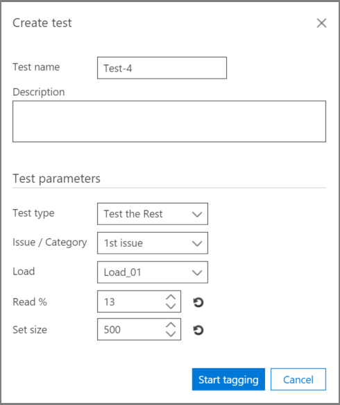

# Análisis de relevancia de prueba en Advanced eDiscovery
  
La pestaña Prueba de Advanced eDiscovery permite probar, comparar y validar la calidad general del procesamiento. Estas pruebas se realizan después del cálculo por lotes. Al etiquetar los archivos de la colección, un experto hace el juicio final sobre si cada archivo etiquetado es relevante para el caso.
  
En escenarios únicos y de varios problemas, las pruebas suelen realizarse por problema. Los resultados se pueden ver después de cada prueba y los resultados de la prueba se pueden volver a trabajar con archivos de prueba de ejemplo especificados.
  
## Probar el resto

La prueba "Probar el resto" se usa para validar las decisiones de selección, por ejemplo, para revisar solo los archivos por encima de una puntuación de límite de relevancia específica en función de los resultados Advanced eDiscovery resultados finales. El experto revisa una muestra de archivos bajo una puntuación de límite seleccionada para evaluar el número de archivos relevantes dentro de ese conjunto.
  
Esta prueba proporciona estadísticas y una comparación entre el conjunto de revisión y la población Probar el resto. Los resultados del conjunto de revisión son los calculados por Relevancia durante el aprendizaje. Los resultados incluyen cálculos basados en la configuración y los parámetros de entrada, como:
  
- Probar estadísticas de ejemplo del número de archivos de un ejemplo e identificar archivos relevantes.

- Comparación tabular de los parámetros Population del conjunto Review y Rest, por ejemplo, el número de archivos, el número estimado de archivos relevantes, la riqueza estimada y el costo promedio de encontrar otro archivo relevante. La configuración del parámetro de costo la puede establecer el administrador.

Para ejecutar la prueba "Probar el resto":

1. Abra la **pestaña Prueba \> de relevancia.**

2. En la **pestaña Prueba,** haga clic **en Nueva prueba**. Se **muestra el cuadro** de diálogo Crear prueba, como se muestra en el ejemplo siguiente.

    
  
3. En **Nombre de prueba** y **Descripción,** escriba el nombre y la descripción.

4. En la **lista Tipo de** prueba, seleccione Probar el **resto**

5. En la **lista Problema o categoría,** seleccione el nombre del problema.

6. En la **lista Cargar,** seleccione la carga. 

7. En **Read %**, acepte el valor predeterminado o seleccione un valor para la puntuación de relevancia de corte. 

8. En **Establecer tamaño** o aceptar el valor predeterminado. Los iconos de restauración restaurarán los valores predeterminados.

9. Haga **clic en Iniciar etiquetado**. Se genera un ejemplo de prueba.

10. Revise y etiquete cada uno de los archivos de la pestaña **Etiqueta \> de** relevancia y, cuando haya terminado, haga clic en **Calcular**.

11. En la pestaña Prueba, puede hacer clic en **Ver resultados** para ver los resultados de la prueba. En la siguiente captura de pantalla se muestra un ejemplo.

    
  
En la captura  de pantalla anterior, la sección Parámetros de ejemplo de la tabla contiene detalles sobre el número de archivos de la muestra etiquetados por el experto y el número de archivos relevantes que se encuentran en esa muestra.
  
La sección **Parámetros** de población de la tabla contiene los resultados de la prueba, incluido el conjunto de revisión de la población de archivos con una puntuación por debajo del límite seleccionado y la población de archivos "El resto" con una puntuación por encima del límite seleccionado. Para cada población, se muestran los siguientes resultados:
  
- Incluye archivos con % de lectura: límite declarado

- El número total de archivos

- Número estimado de archivos relevantes

- La riqueza estimada

- Costo medio de revisión de buscar otro archivo relevante

## Probar el segmento

La prueba "Probar el segmento" realiza pruebas similares a la prueba "Probar el resto", pero a un segmento del conjunto de archivos especificado por Relevancia Lectura %.

Para ejecutar la prueba "Probar el segmento":
  
1. Abra la **pestaña Prueba \> de relevancia.**

2. En la **pestaña Prueba,** haga clic **en Nueva prueba**. Se **muestra el cuadro de** diálogo Crear prueba.

3. En **Nombre de prueba** y **Descripción,** escriba la información.

4. En la **lista Tipo de** prueba, seleccione Probar el **segmento**.

5. En la **lista Problema,** seleccione el nombre del problema.

6. En la **lista Cargar,** seleccione la carga.

7. En **Leer % entre**, acepte los valores predeterminados de rango bajo y alto o seleccione valores para las puntuaciones de relevancia de corte.

8. En **Establecer tamaño,** seleccione un valor o acepte el valor predeterminado.

    Los iconos de restauración restaurarán el valor predeterminado.

9. Haga **clic en Iniciar etiquetado**. Se genera un ejemplo de prueba.

10. Revise y etiquete cada uno de los archivos de la pestaña **Etiqueta \> de** relevancia y, cuando haya terminado, haga clic en **Calcular**.

11. En la pestaña Prueba, puede hacer clic en **Ver resultados** para ver los resultados de la prueba.
