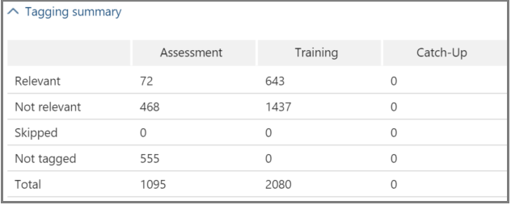

# Seguimiento del análisis de relevancia en eDiscovery avanzado
  
En eDiscovery avanzado, la pestaña Seguimiento de relevancia muestra la validez calculada de la formación de relevancia realizada en la pestaña Etiqueta e indica el siguiente paso que se debe realizar en el proceso de aprendizaje iterativo en Relevancia. 
  
## Seguimiento del estado de aprendizaje de relevancia

1. Vea los siguientes detalles en seguimiento de relevancia para los problemas de casos, como se muestra en el siguiente ejemplo de un cuadro de diálogo **Nombre de** problema a continuación.

   - **Evaluación:** este indicador de progreso muestra hasta qué punto la formación de relevancia realizada hasta este punto ha logrado el objetivo de evaluación en términos de margen de error. También se muestra la gran variedad de resultados de la formación de relevancia.

   - **Aprendizaje:** este indicador de progreso codificado por colores y la información sobre herramientas indica la estabilidad de los resultados del entrenamiento de relevancia y una escala numérica que muestra el número de muestras de aprendizaje de relevancia etiquetadas para cada problema. El experto supervisa el progreso del proceso de aprendizaje iterativo de relevancia. 
  
   - **Cálculo por lotes:** este indicador de progreso proporciona información sobre la finalización del cálculo por lotes.
  
   - **Paso siguiente:** muestra la recomendación para el siguiente paso que se va a realizar. 
  
    En el ejemplo, se muestra una evaluación completada correctamente para un problema, indicada por el indicador de progreso de color completado y la marca de verificación. El etiquetado está en curso, pero el caso aún se considera inestable (el estado de estabilidad también se muestra en una información sobre herramientas). El siguiente paso recomendado es "Aprendizaje". 
  
    
  
    La vista expandida muestra información y opciones adicionales. El margen de error actual mostrado es el margen de error de la recuperación en el estado actual de la evaluación, dados los archivos de evaluación existentes (ya etiquetados).
  
    > [!NOTE]
    >  La fase de evaluación se  puede omitir desactivando la casilla evaluación por problema y, a continuación, para "todos los problemas". Sin embargo, como resultado, no habrá estadísticas para este problema. > desactivar la **casilla** evaluación solo puede realizarse antes de que se realice la evaluación. Cuando existen varios problemas en un caso, la evaluación se omite solo si la casilla está desactivada para cada problema. 
  
    Cuando la evaluación no se completa con el primer conjunto de archivos de ejemplo, la evaluación puede ser el siguiente paso para etiquetar más archivos.
  
    En **El seguimiento** \> **de** relevancia, el indicador de progreso del aprendizaje y la información sobre herramientas indican el número estimado de muestras adicionales necesarias para alcanzar la estabilidad. Esta estimación proporciona una guía para la formación adicional necesaria.
  
    
  
2. Cuando haya terminado de etiquetar y si necesita continuar el aprendizaje, haga clic en **Aprendizaje.** Otro conjunto de archivos de ejemplo se genera a partir del conjunto de archivos cargado para formación adicional. A continuación, se le devuelve a la pestaña Etiqueta para etiquetar y entrenar más archivos.

### Alcanzar niveles de aprendizaje estables

Una vez que los archivos de evaluación han alcanzado un nivel estable de aprendizaje, eDiscovery avanzado está listo para el cálculo por lotes.
  
> [!NOTE]
> Normalmente, después de tres muestras de aprendizaje estables, el siguiente paso es "Cálculo por lotes". Puede haber excepciones, por ejemplo, cuando hubo cambios en el etiquetado de archivos de ejemplos anteriores o cuando se agregaron archivos de ed. 
  
### Realización de cálculos por lotes

El cálculo por lotes se ejecuta como el siguiente paso después de completar correctamente el aprendizaje (cuando la barra de progreso muestra un estado de aprendizaje estable, una marca de verificación y un estado estable en la información sobre herramientas). El cálculo por lotes aplica los conocimientos adquiridos durante la formación de relevancia a toda la población de archivos, para evaluar la relevancia de los archivos y asignar puntuaciones de relevancia.
  
Cuando hay más de un problema, el cálculo por lotes se realiza por problema. Durante el cálculo por lotes, el progreso se supervisa mientras se procesa todos los archivos. 
  
Aquí, el siguiente paso recomendado es "Ninguno", lo que indica que no se requiere ninguna formación iterativa adicional de relevancia en este momento. La siguiente fase es la pestaña **\> Decisión de** relevancia. 
  
Si desea importar nuevos archivos después del cálculo por lotes, el administrador puede agregar los archivos importados a una nueva carga.
  
> [!NOTE]
> Si hace clic **en Cancelar** durante el cálculo por lotes, el proceso guarda lo que ya se ha ejecutado. Si vuelve a ejecutar el cálculo por lotes, el proceso continuará desde el último punto ejecutado. 
  
### Evaluar la coherencia de etiquetado

Si hay incoherencias en el etiquetado de archivos, puede afectar al análisis. El proceso de coherencia de etiquetado de eDiscovery avanzado se puede usar cuando los resultados no son óptimos o la coherencia es dudosa. Se devuelve una lista de posibles archivos etiquetados de forma incoherente y se pueden revisar y volver a etiquetar, según sea necesario.
  
> [!NOTE]
> Después de siete o más rondas de aprendizaje después  de la evaluación, la coherencia de las etiquetas se puede ver en los resultados detallados del seguimiento de relevancia \>  \>  \> **Progreso** \> **de la formación.** Esta revisión se realiza por un problema cada vez.
  
1. En **Seguimiento \> de relevancia,** expanda la fila de un problema.
  
2. A la derecha del **paso siguiente,** haga clic **en Modificar**.
  
3. Seleccione **Incoherencias de etiquetas** como la opción Paso **siguiente,** después de siete ejemplos de aprendizaje y haga clic en **Aceptar.**
  
4. Seleccione **Incoherencias de etiquetas.** La **pestaña** Etiqueta se abre mostrando una lista de las incoherencias para volver a etiquetar según sea necesario.
  
5. Haga **clic en Calcular** para enviar los cambios. El siguiente paso después de etiquetar incoherencias es "Aprendizaje". 
  
## Visualización y uso de resultados de relevancia

En la **pestaña \> Seguimiento de** relevancia, expanda la fila de un problema y, junto a **Resultados detallados,** haga clic en **Ver**. Se muestran los paneles de resultados detallados, como se muestra y se describe a continuación.
  

  
### Resumen de etiquetado

 En el ejemplo siguiente, el resumen de etiquetado muestra los totales de cada uno de los procesos de etiquetado de archivos de evaluación, aprendizaje y ponerse al día. 
  

  
### Palabras clave

Una palabra clave es una cadena, palabra, frase o secuencia única de palabras en un archivo identificado por eDiscovery avanzado como un indicador significativo de si un archivo es relevante. Las columnas "Incluir" enumeran palabras clave y pesos en archivos etiquetados como relevantes, y las columnas "Excluir" enumeran palabras clave y pesos en archivos etiquetados como no relevantes.
  
EDiscovery avanzado asigna valores de peso de palabras clave negativos o positivos. Cuanto mayor sea el peso, mayor será la probabilidad de que se asigne una puntuación de relevancia más alta a un archivo en el que aparece la palabra clave durante el cálculo por lotes.
  
La lista de eDiscovery avanzado de palabras clave se puede usar para complementar una lista creada por un experto o como una comprobación indirecta de la salud en cualquier momento del proceso de revisión de archivos.
  
### Progreso de la formación

El **panel Progreso del** aprendizaje incluye un gráfico de progreso del aprendizaje y una visualización del indicador de calidad, como se muestra en el siguiente ejemplo.
  

  
**Indicador de calidad de aprendizaje:** muestra la clasificación de la coherencia de etiquetado de la siguiente manera:
  
- **Bueno:** los archivos se etiquetan de forma coherente. (Se muestra la luz verde)
  
- **Medio:** algunos archivos pueden etiquetarse de forma incoherente. (Se muestra la luz amarilla)

- **Advertencia:** muchos archivos pueden etiquetarse de forma incoherente. (Se muestra la luz roja)

**Gráfico de progreso del** aprendizaje: muestra el grado de estabilidad del aprendizaje de relevancia después de muchos ciclos de entrenamiento de relevancia en comparación con el valor de la medida F. A medida que nos desplazamos de la izquierda a la derecha a través del gráfico, el intervalo de confianza se reduce y se usa, junto con la medida F, por relevancia de eDiscovery avanzado para determinar la estabilidad cuando se optimizan los resultados del entrenamiento de relevancia.
  
> [!NOTE]
> La relevancia usa F2, una métrica de medida F donde Recuperar recibe el doble de peso que Precisión. Para los casos con una gran variedad (más del 25%), la relevancia usa F1 (relación 1:1). La relación de medida F se puede configurar en la configuración **de relevancia Opciones** \> **avanzadas.**
  
### Resultados del cálculo por lotes

El **panel de resultados del** cálculo por lotes incluye el número de archivos que se puntuaron para Relevancia, como se muestra a continuación: 
  
- **Success**
  
- **Vacío:** no contiene texto, por ejemplo, solo espacios o pestañas
  
- **Failed**: Due to excessive size or could not be read
  
- **Omitido:** debido a un tamaño excesivo
  
- **Nebuloso:** contiene texto sin sentido o ninguna de las características relevantes para el problema
  
> [!NOTE]
> Empty, Failed, Ignored o Nebulous recibirán una puntuación de relevancia de -1.
  
### Estadísticas de aprendizaje

El **panel de estadísticas de** aprendizaje muestra estadísticas y gráficos basados en los resultados de la formación de relevancia de eDiscovery avanzado. 
  

  
Esta vista muestra lo siguiente:
  
- **Relación revisión-recuperación:** comparación de los resultados según las puntuaciones de relevancia en una revisión hipotéticamente lineal. La recuperación se calcula teniendo en cuenta el tamaño del conjunto de revisión establecido.
  
- **Parámetros:** estadísticas calculadas acumulativas relativas al conjunto de revisión en relación con la población de archivos para todo el caso.
  
- **Revisión:** porcentaje de archivos que se revisarán en función de este límite.
  
- **Recuperación:** porcentaje de archivos relevantes en el conjunto de revisión. 
  
- **Distribución por puntuación de relevancia:** los archivos en la pantalla gris oscuro a la izquierda están por debajo de la puntuación de límite. Una información sobre herramientas muestra la puntuación de relevancia y el porcentaje relacionado de archivos en el archivo de revisión establecido en relación con el total de archivos.
