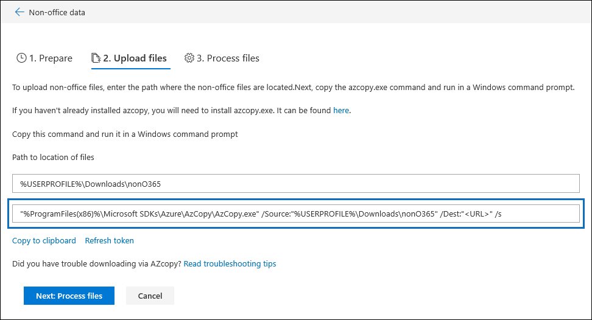

# Solucionar problemas de AzCopy en eDiscovery avanzado

Al cargar datos o documentos que no son de Office 365 para la corrección de errores en eDiscovery avanzado, la interfaz de usuario proporciona un comando de Azure AzCopy que contiene parámetros con la ubicación en la que se almacenan los archivos que desea cargar y el almacenamiento de Azure Ubicación en la que se cargarán los archivos. Para cargar los documentos, copie este comando y, a continuación, ejecútelo en un símbolo del sistema en el equipo local.  La captura de pantalla siguiente muestra un ejemplo de un comando AzCopy:

Normalmente, el comando que se proporciona funciona cuando se ejecuta. Sin embargo, puede haber casos en los que el comando que se muestra no se ejecute correctamente. Estas son algunas de las razones posibles.

## La versión compatible de AzCopy no está instalada en el equipo local

En este momento, debe usar AzCopy v 8.1 para cargar datos que no son de Office 365 en la exhibición avanzada de documentos electrónicos. El comando AzCopy que se muestra en la página **cargar archivos** que se muestra en la captura de pantalla anterior devuelve un error si no está usando AzCopy v 8.1. Para instalar esta versión, vea [transferir datos con AzCopy v 8.1 en Windows](https://docs.microsoft.com/previous-versions/azure/storage/storage-use-azcopy).

## AzCopy no está instalado en el equipo local o no está instalado en la ubicación predeterminada

Si AzCopy no está instalado o está instalado en una ubicación distinta de la ubicación de instalación predeterminada (que `%ProgramFiles(x86)%`es), es posible que reciba el siguiente error al ejecutar el comando AzCopy:

    The system cannot find the path specified.

Si AzCopy no está instalado en el equipo local, puede instalar desde [aquí](https://docs.microsoft.com/previous-versions/azure/storage/storage-use-azcopy). Asegúrese de instalarlo en la ubicación predeterminada.

Si AzCopy está instalado, pero se instala en una ubicación distinta de la ubicación predeterminada, puede copiar el comando, pegarlo en un archivo de texto y, a continuación, cambiar la ruta de acceso a la ubicación en la que se instaló AzCopy. Por ejemplo, si Azcopy se encuentra en `%ProgramFiles%`, puede cambiar la primera parte del comando de `%ProgramFiles(x86)%\Microsoft SDKs\Azure\AzCopy.exe` a. `%ProgramFiles%\Microsoft SDKs\Azure\AzCopy` Después de realizar este cambio, cópielo del archivo de texto y, a continuación, ejecútelo desde el símbolo del sistema.

> [!TIP]
> Si AzCopy está instalado en una ubicación distinta de la ubicación de instalación predeterminada, considere la posibilidad de desinstalarlo y volver a instalarlo en la ubicación predeterminada. Esto le ayudará a evitar este problema en el futuro.
