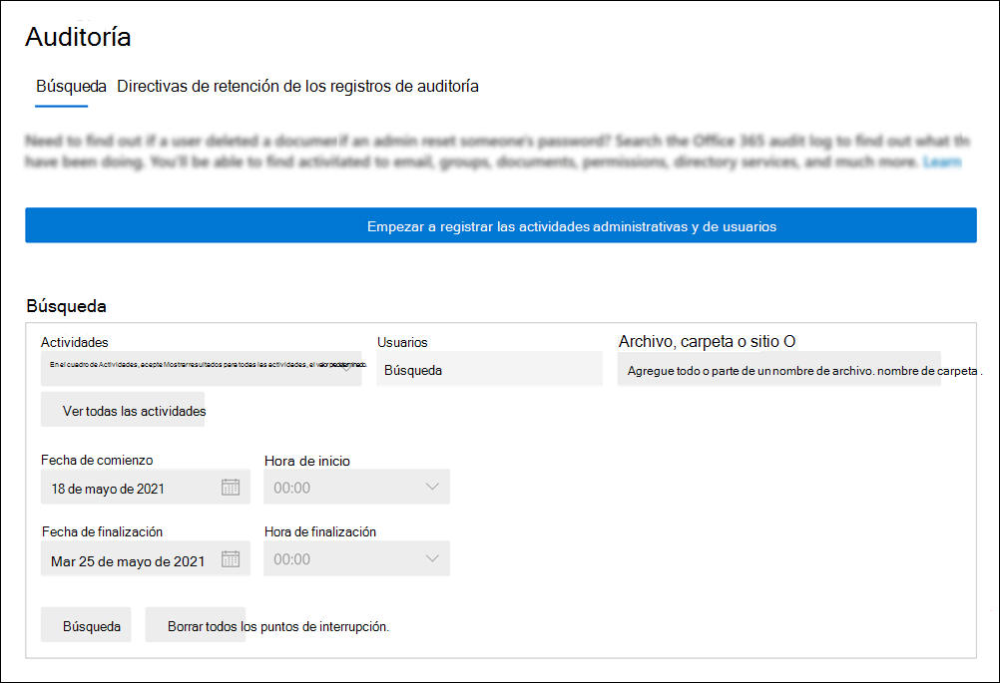

# <a name="turn-auditing-on-or-off"></a>Activar o desactivar la auditoría

El registro de auditoría está activado de forma predeterminada para organizaciones de Microsoft 365 y Office 365 Enterprise. Esto incluye las organizaciones con suscripciones a E3/G3 o E5/G5. Cuando la auditoría en el centro de cumplimiento está activada, la actividad de usuario y administrador de su organización se registra en el registro de auditoría y se retiene durante 90 días y hasta un año, según la licencia asignada a los usuarios. Sin embargo, es posible que la organización tenga motivos para no querer registrar y conservar los datos del registro de auditoría. En esos casos, un administrador global puede decidir desactivar la auditoría en Microsoft 365.

> [!IMPORTANT]
> Si desactiva la auditoría en Microsoft 365, no puede usar la API de actividad de administración de Office 365 ni Azure Sentinel para obtener acceso a los datos de auditoría de su organización. Desactivar la auditoría siguiendo los pasos descritos en este artículo significa que no se devolverá ningún resultado al buscar en el registro de auditoría mediante el Centro de seguridad y cumplimiento de & o al ejecutar el cmdlet **Search-UnifiedAuditLog** en Exchange Online PowerShell. Esto también significa que los registros de auditoría no estarán disponibles a través de la API Office 365 actividad de administración o Azure Sentinel.
  
## <a name="before-you-turn-auditing-on-or-off"></a>Antes de activar o desactivar la auditoría

- Debe tener asignado el rol Registros de auditoría en Exchange Online para activar o desactivar la auditoría en su Microsoft 365 organización. De forma predeterminada, este rol se asigna a los  grupos de roles Administración de cumplimiento y Administración de la organización en la página Permisos del centro Exchange administración. Los administradores globales de Microsoft 365 son miembros del grupo de roles Administración de la organización en Exchange Online. 

    > [!NOTE]
    > Los usuarios deben tener asignados permisos en Exchange Online para activar o desactivar la auditoría. Si asigna a los usuarios  el rol Registros de auditoría en la página Permisos del Centro de seguridad y cumplimiento de &, no podrán activar o desactivar la auditoría. Esto se debe a que el cmdlet subyacente es Exchange Online cmdlet de PowerShell. 

- Para obtener instrucciones paso a paso sobre cómo buscar en el registro de auditoría, vea [Search the audit log in the Security & Compliance Center](search-the-audit-log-in-security-and-compliance.md). Para obtener más información acerca de la API Microsoft 365 actividad de administración, vea Introducción [a Microsoft 365 API de administración](/office/office-365-management-api/get-started-with-office-365-management-apis).

- Para comprobar que la auditoría está activada, puede ejecutar el siguiente comando en Exchange Online PowerShell:

    ```powershell
    Get-AdminAuditLogConfig | FL UnifiedAuditLogIngestionEnabled
    ```

    El valor de  `True` la  _propiedad UnifiedAuditLogIngestionEnabled_ indica que la auditoría está activada. 

## <a name="turn-on-auditing"></a>Activar la auditoría

Si la auditoría no está activada para su organización, puede activarla en el centro de cumplimiento o mediante Exchange Online PowerShell. Puede tardar varias horas después de activar la auditoría antes de que pueda devolver resultados al buscar en el registro de auditoría.
  
### <a name="use-the-compliance-center-to-turn-on-auditing"></a>Usar el Centro de cumplimiento para activar la auditoría

1. Vaya a <https://compliance.microsoft.com> e inicie sesión.

2. En el panel de navegación izquierdo del centro de Microsoft 365 cumplimiento, haga clic en **Mostrar todo** y, a continuación, haga clic en **Auditar**.

   Si la auditoría no está activada para su organización, se muestra un banner que le pedirá que comience a grabar la actividad de usuario y administrador.

   

3. Haga clic en **el banner Iniciar registro de actividad de usuario y** administrador.

   El cambio puede tardar hasta 60 minutos en tener efecto.

### <a name="use-powershell-to-turn-on-auditing"></a>Usar PowerShell para activar la auditoría

1. [Conectarse al PowerShell de Exchange Online](/powershell/exchange/connect-to-exchange-online-powershell)

2. Ejecute el siguiente comando de PowerShell para activar la auditoría en Office 365.

    ```powershell
    Set-AdminAuditLogConfig -UnifiedAuditLogIngestionEnabled $true
    ```

    Se muestra un mensaje que indica que el cambio puede tardar hasta 60 minutos en tener efecto.
  
## <a name="turn-off-auditing"></a>Desactivar la auditoría

Debe usar powershell Exchange Online para desactivar la auditoría.
  
1. [Conectarse al PowerShell de Exchange Online](/powershell/exchange/connect-to-exchange-online-powershell)

2. Ejecute el siguiente comando de PowerShell para desactivar la auditoría.

    ```powershell
    Set-AdminAuditLogConfig -UnifiedAuditLogIngestionEnabled $false
    ```

3. Después de un tiempo, compruebe que la auditoría está desactivada (deshabilitada). Hay dos formas de hacerlo:

    - En Exchange Online PowerShell, ejecute el siguiente comando:

      ```powershell
      Get-AdminAuditLogConfig | FL UnifiedAuditLogIngestionEnabled
      ```

      El valor de  `False` la  _propiedad UnifiedAuditLogIngestionEnabled_ indica que la auditoría está desactivada.

    - Vaya a la **página Auditoría** del centro de Microsoft 365 cumplimiento.

      Si la auditoría no está activada para su organización, se muestra un banner que le pedirá que comience a grabar la actividad de usuario y administrador.
