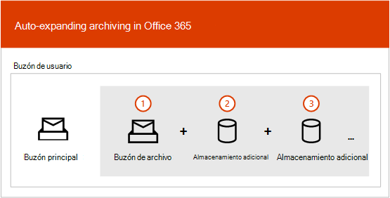

# Información general sobre el archivado ilimitadoOverview of unlimited archiving

En Office 365, los buzones de archivo proporcionan a los usuarios espacio de almacenamiento adicional en el buzón de correo.In Office 365, archive mailboxes provide users with additional mailbox storage space. Después de habilitar el buzón de archivo de un usuario, hay disponible hasta 100 GB de almacenamiento adicional.After a user's archive mailbox is enabled, up to 100 GB of additional storage is available. En el pasado, cuando se alcanzaba la cuota de almacenamiento de 100-GB, las organizaciones tenían que ponerse en contacto con Microsoft para solicitar espacio de almacenamiento adicional para un buzón de archivo.In the past, when the 100-GB storage quota was reached, organizations had to contact Microsoft to request additional storage space for an archive mailbox. Esto ya no es así.That's no longer the case.

La característica de archivado ilimitado de Microsoft 365 (denominado *archivado de expansión automática*) proporciona almacenamiento adicional en los buzones de archivo.The unlimited archiving feature in Microsoft 365 (called *auto-expanding archiving*) provides additional storage in archive mailboxes. Cuando se alcanza la cuota de almacenamiento en el buzón de archivo, Microsoft 365 aumenta automáticamente el tamaño del archivo, lo que significa que los usuarios no se quedarán sin espacio de almacenamiento en el buzón y los administradores no tendrán que solicitar almacenamiento adicional para los buzones de archivo.When the storage quota in the archive mailbox is reached, Microsoft 365 automatically increases the size of the archive, which means that users won't run out of mailbox storage space and administrators won't have to request additional storage for archive mailboxes.

Para obtener instrucciones paso a paso para activar el archivado de expansión automática, consulte [Habilitar el archivado ilimitado](enable-unlimited-archiving.md).For step-by-step instructions for turning on auto-expanding archiving, see [Enable unlimited archiving](enable-unlimited-archiving.md).

> [!NOTE]
> El archivado de expansión automática también es compatible con los buzones compartidos.Auto-expanding archiving also supports shared mailboxes. Para habilitar el archivo para un buzón compartido, se necesita una licencia de Exchange Online (plan 2) o una licencia de Exchange Online (plan 1) con una licencia de archivado de Exchange Online.To enable the archive for a shared mailbox, an Exchange Online Plan 2 license or an Exchange Online Plan 1 license with an Exchange Online Archiving license is required.

## Funcionamiento del archivado de expansión automáticaHow auto-expanding archiving works

Como se ha explicado anteriormente, el espacio de almacenamiento de buzones de correo adicional se crea cuando se habilita el buzón de archivo de un usuario.As previously explained, additional mailbox storage space is created when a user's archive mailbox is enabled. Cuando el archivado de expansión automática está habilitado, Microsoft 365 comprueba periódicamente el tamaño del buzón de archivo.When auto-expanding archiving is enabled, Microsoft 365 periodically checks the size of the archive mailbox. Cuando un buzón de archivo se acerca al límite de almacenamiento, Microsoft 365 crea automáticamente espacio de almacenamiento adicional para el archivo.When an archive mailbox gets close to its storage limit, Microsoft 365 automatically creates additional storage space for the archive. Si el usuario se queda sin este espacio de almacenamiento adicional, Microsoft 365 agrega más espacio de almacenamiento al archivo del usuario.If the user runs out of this additional storage space, Microsoft 365 adds more storage space to the user's archive. Este proceso se produce de forma automática, lo que significa que los administradores no tienen que solicitar el almacenamiento de archivos adicional o administrar el archivado de expansión automática.This process happens automatically, which means administrators don't have to request additional archive storage or manage auto-expanding archiving.

A continuación se muestra una introducción rápida del proceso.Here's a quick overview of the process.

1. El archivado está habilitado para un buzón de usuario o un buzón compartido.Archiving is enabled for a user mailbox or a shared mailbox. Se crea un buzón de archivo con 100 GB de espacio de almacenamiento y la cuota de advertencia para el buzón de archivo se establece en 90 GB.An archive mailbox with 100 GB of storage space is created, and the warning quota for the archive mailbox is set to 90 GB.

2. Un administrador habilita el archivado de expansión automática para el buzón de correo.An administrator enables auto-expanding archiving for the mailbox. Cuando el buzón de archivo (incluida la carpeta elementos recuperables) alcanza los 90 GB, se convierte en un archivo de expansión automática y Microsoft 365 agrega espacio de almacenamiento al archivo.When the archive mailbox (including the Recoverable Items folder) reaches 90 GB, it's converted to an auto-expanding archive, and Microsoft 365 adds storage space to the archive. El espacio de almacenamiento adicional puede tardar hasta 30 días en aprovisionarse.It can take up to 30 days for the additional storage space to be provisioned.

   > [!NOTE]
   > Si un buzón se coloca en retención o se asigna a una directiva de retención, la cuota de almacenamiento para el buzón de archivo aumenta hasta 110 GB cuando está habilitado el archivado de expansión automática.If a mailbox is placed on hold or assigned to a retention policy, the storage quota for the archive mailbox is increased to 110 GB when auto-expanding archiving is enabled. De forma similar, la cuota de advertencia de archivo aumenta a 100 GB.Similarly, the archive warning quota is increased to 100 GB.

3. Microsoft 365 agrega automáticamente más espacio de almacenamiento cuando es necesario.Microsoft 365 automatically adds more storage space when necessary.

> [!IMPORTANT]
> El archivo de expansión automática solo se admite para los buzones de correo que se usan para usuarios individuales (o buzones compartidos) con una tasa de crecimiento que no supera 1 GB por día.Auto-expanding archive is only supported for mailboxes used for individual users (or shared mailboxes) with a growth rate that doesn't exceed 1 GB per day. El buzón de archivo de un usuario está diseñado exclusivamente para dicho usuario.A user's archive mailbox is intended for just that user. El uso del registro en diario, las reglas de transporte o las reglas de reenvío automático para copiar mensajes en un buzón de archivo no está permitido.Using journaling, transport rules, or auto-forwarding rules to copy messages to an archive mailbox is not permitted. Microsoft se reserva el derecho a denegar el archivado ilimitado en los casos en que el buzón de archivo de un usuario se usa para almacenar datos de archivo para otros usuarios o en otros casos del uso inadecuado.Microsoft reserves the right to deny unlimited archiving in instances where a user's archive mailbox is used to store archive data for other users or in other cases of the inappropriate use.

## ¿Qué se mueve al espacio de almacenamiento adicional del archivo?What gets moved to the additional archive storage space?

Para hacer un uso eficaz del almacenamiento de archivos de expansión automática, las carpetas pueden moverse.To make efficient use of auto-expanding archive storage, folders may get moved. Microsoft 365 determina qué carpetas se mueven cuando se agrega almacenamiento adicional al archivo.Microsoft 365 determines which folders get moved when additional storage is added to the archive. A veces, cuando se mueve una carpeta, se crean automáticamente una o varias subcarpetas y los elementos de la carpeta original se distribuyen a estas carpetas para facilitar el proceso de movimiento.Sometimes when a folder is moved, one or more subfolders are automatically created and items from the original folder are distributed to these folders to facilitate the moving process. Al ver la parte de archivo de la lista de carpetas en Outlook, estas subcarpetas se muestran en la carpeta original.When viewing the archive portion of the folder list in Outlook, these subfolders are displayed under the original folder.  La Convención de nomenclatura que Microsoft 365 usa para nombrar estas subcarpetas es \*\* \<folder name\> _Yyyy (creada en MMM DD, YYYY h_mm)\*\*, donde:The naming convention that Microsoft 365 uses to name these subfolders is **\<folder name\>_yyyy (Created on mmm dd, yyyy h_mm)**, where:

- **yyyy** es el año en que se recibieron los mensajes de la carpeta.**yyyy** is the year the messages in the folder were received.

- **DD de MMM de aaaa h_m** es la fecha y hora en que la subcarpeta se creó en Office 365, en formato UTC, en función de la zona horaria del usuario y la configuración regional en Outlook.**mmm dd, yyyy h_m** is the date and time that the subfolder was created by Office 365, in UTC format, based on the user's time zone and regional settings in Outlook.

En las siguientes capturas de pantallas se muestra una lista de carpetas antes y después de que los mensajes se muevan a un archivo de expansión automática.The following screenshots show a folder list before and after messages are moved to an auto-expanded archive.

 **Antes de agregar almacenamiento adicional****Before additional storage is added**

 **Una vez agregado el almacenamiento adicional****After additional storage is added**

> [!NOTE]
> Como se ha descrito anteriormente, Microsoft 365 mueve elementos a subcarpetas (y les asigna un nombre según la Convención de nomenclatura descrita anteriormente) para facilitar la distribución de contenido a un archivo auxiliar.As previously described, Microsoft 365 moves items to subfolders (and names them using the naming convention described above) to help distribute content to an auxiliary archive. Pero mover elementos a subcarpetas no siempre es así.But moving items to subfolders may not always be the case. A veces, se puede mover una carpeta completa a un archivo auxiliar.Sometimes an entire folder may be moved to an auxiliary archive. En este caso, la carpeta contendrá su nombre original.In this case, the folder will retain its original name.  No será visible en la lista de carpetas de Outlook que la carpeta se movió a un archivo auxiliar.It won't be apparent in the folder list in Outlook that the folder was moved to an auxiliary archive.

## Requisitos de Outlook para obtener acceso a elementos en un archivo de expansión automáticaOutlook requirements for accessing items in an auto-expanded archive

Para obtener acceso a los mensajes que se almacenan en un archivo de expansión automática, los usuarios tienen que usar uno de los siguientes clientes de Outlook:To access messages that are stored in an auto-expanded archive, users have to use one of the following Outlook clients:

- Outlook 2016 o Outlook 2019 para WindowsOutlook 2016 or Outlook 2019 for Windows

- Outlook en la WebOutlook on the web

- Outlook 2016 o Outlook 2019 para MacOutlook 2016 or Outlook 2019 for Mac

Estos son algunos aspectos que se deben tener en cuenta al usar Outlook o Outlook en la web para tener acceso a los mensajes almacenados en un archivo de expansión automática.Here are some things to consider when using Outlook or Outlook on the web to access messages stored in an auto-expanded archive.

- Puede tener acceso a cualquier carpeta del buzón de archivo, incluidas las que se han movido al área de almacenamiento expandido automáticamente.You can access any folder in your archive mailbox, including ones that were moved to the auto-expanded storage area.

- La búsqueda de archivado automático solo está disponible en escritorio de Outlook a partir de la compilación 16.0.12716.10000 de Insiders.Search for auto-expanded archiving is only available in Outlook Desktop as of Insiders build 16.0.12716.10000. La búsqueda está disponible en Outlook para la Web.Search is available in Outlook for the web. Al igual que en el caso de los archivos en línea, puede buscar elementos que se movieron a un área de almacenamiento adicional solo mediante la búsqueda en la propia carpeta.Similar to Online Archive, you can search for items that were moved to an additional storage area only by searching the folder itself. Esto significa que debe seleccionar la carpeta de archivo en la lista de carpetas para seleccionar la opción **carpeta actual** como ámbito de búsqueda.This means that you have to select the archive folder in the folder list to select the **Current Folder** option as the search scope. De forma similar, si una carpeta de un área de almacenamiento con expansión automática contiene subcarpetas, deberá buscar cada subcarpeta por separado.Similarly, if a folder in an auto-expanded storage area contains subfolders, you have to search each subfolder separately.

- Los recuentos de elementos en Outlook y los recuentos de leídos o no leídos (en Outlook y Outlook en la web) en un archivo de expansión automática podrían no ser precisos.Item counts in Outlook and Read/Unread counts (in Outlook and Outlook on the web) in an auto-expanded archive might not be accurate.

- Puede eliminar los elementos de una subcarpeta que señale a un área de almacenamiento expandida automáticamente, pero no se puede eliminar la carpeta en sí.You can delete items in a subfolder that points to an auto-expanded storage area, but the folder itself can't be deleted.

- No puede usar la característica recuperar elementos eliminados para recuperar un elemento que se eliminó de un área de almacenamiento expandida automáticamente.You can't use the Recover Deleted Items feature to recover an item that was deleted from an auto-expanded storage area.

## Archivado de expansión automática y otras características de cumplimientoAuto-expanding archiving and other compliance features

En esta sección se explica la funcionalidad entre el archivado de expansión automática y otras características de cumplimiento y de gobierno de datos.This section explains the functionality between auto-expanding archiving and other compliance and data governance features.

- **eDiscovery:** Cuando se usa una herramienta de exhibición de documentos electrónicos, como búsqueda de contenido o exhibición de documentos electrónicos local, también se busca en las áreas de almacenamiento adicionales de un archivo de expansión automática.**eDiscovery:** When you use an eDiscovery tool, such as Content Search or In-Place eDiscovery, the additional storage areas in an auto-expanded archive are also searched.

- **Retención:** Cuando coloca un buzón de correo en retención mediante el uso de herramientas como retención por juicio en Exchange online o eDiscovery Case retenciones y directivas de retención en el centro de seguridad y cumplimiento, el contenido ubicado en un archivo de expansión automática también se coloca en retención.**Retention:** When you put a mailbox on hold by using tools such as Litigation Hold in Exchange Online or eDiscovery case holds and retention policies in the security and compliance center, content located in an auto-expanded archive is also placed on hold.

- **Administración de registros de mensajes (MRM):** Si usa directivas de eliminación de MRM en Exchange Online para eliminar de forma permanente los elementos de buzón de correo expirados, los elementos expirados que se encuentran en el archivo de expansión automática también se eliminarán.**Messaging records management (MRM):** If you use MRM deletion policies in Exchange Online to permanently delete expired mailbox items, expired items located in the auto-expanded archive will also be deleted.

- **Servicio de importación:** Puede usar el servicio de importación de Office 365 para importar archivos PST al archivo de expansión automática de un usuario.**Import service:** You can use the Office 365 Import service to import PST files to a user's auto-expanded archive. Puede importar hasta 100 GB de datos de archivos PST en el buzón de archivo del usuario.You can import up to 100 GB of data from PST files to the user's archive mailbox.

## Más informaciónMore information

Para obtener más información técnica sobre el archivado de expansión automática, consulte [Microsoft 365: archivos de expansión automática de archivos de preguntas más frecuentes](https://techcommunity.microsoft.com/t5/exchange-team-blog/office-365-auto-expanding-archives-faq/ba-p/607784).For more technical details about auto-expanding archiving, see [Microsoft 365: Auto-Expanding Archives FAQ](https://techcommunity.microsoft.com/t5/exchange-team-blog/office-365-auto-expanding-archives-faq/ba-p/607784).
