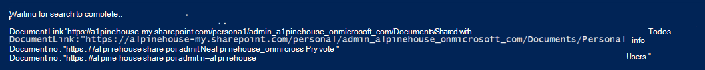
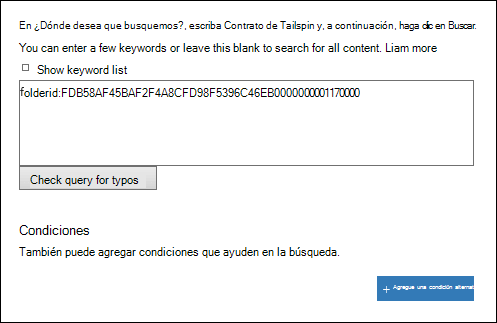

# <a name="use-content-search-for-targeted-collections"></a><span data-ttu-id="70a9c-103">Usar búsqueda de contenido para colecciones específicas</span><span class="sxs-lookup"><span data-stu-id="70a9c-103">Use Content Search for targeted collections</span></span>

<span data-ttu-id="70a9c-104">La característica de búsqueda de contenido en el centro de seguridad y &amp; cumplimiento no ofrece una forma directa en la interfaz de usuario para buscar en carpetas específicas de los buzones de Exchange o de los sitios de SharePoint y OneDrive para la empresa.</span><span class="sxs-lookup"><span data-stu-id="70a9c-104">The Content Search feature in the Security &amp; Compliance Center doesn't provide a direct way in the UI to search specific folders in Exchange mailboxes or SharePoint and OneDrive for Business sites.</span></span> <span data-ttu-id="70a9c-105">Sin embargo, es posible buscar carpetas específicas (denominadas *colección de destino*) especificando la propiedad ID de la carpeta para la propiedad email o path (DocumentLink) de los sitios de la sintaxis de la consulta de búsqueda real.</span><span class="sxs-lookup"><span data-stu-id="70a9c-105">However, it's possible to search specific folders (called a *targeted collection*) by specifying the folder ID property for email or path (DocumentLink) property for sites in the actual search query syntax.</span></span> <span data-ttu-id="70a9c-106">Usar la búsqueda de contenido para realizar una colección de destino es útil cuando tiene la certeza de que los elementos que responden a un caso o los elementos con privilegios están ubicados en un buzón o carpeta de sitio específicos.</span><span class="sxs-lookup"><span data-stu-id="70a9c-106">Using Content Search to perform a targeted collection is useful when you're confident that items responsive to a case or privileged items are located in a specific mailbox or site folder.</span></span> <span data-ttu-id="70a9c-107">Puede usar el script de este artículo para obtener el identificador de carpeta para las carpetas de buzón o la ruta de acceso (DocumentLink) para las carpetas de un sitio de SharePoint y OneDrive para la empresa.</span><span class="sxs-lookup"><span data-stu-id="70a9c-107">You can use the script in this article to obtain the folder ID for mailbox folders or the path (DocumentLink) for folders on a SharePoint and OneDrive for Business site.</span></span> <span data-ttu-id="70a9c-108">A continuación, puede usar el identificador de carpeta o la ruta de acceso en una consulta de búsqueda para devolver los elementos que se encuentran en la carpeta.</span><span class="sxs-lookup"><span data-stu-id="70a9c-108">Then you can use the folder ID or path in a search query to return items located in the folder.</span></span>

> [!NOTE]
> <span data-ttu-id="70a9c-109">Para devolver contenido que se encuentra en una carpeta de un sitio de SharePoint o de OneDrive para la empresa, el script de este tema usa la propiedad administrada DocumentLink en lugar de la propiedad path.</span><span class="sxs-lookup"><span data-stu-id="70a9c-109">To return content located in a folder in a SharePoint or OneDrive for Business site, the script in this topic uses the DocumentLink managed property instead of the Path property.</span></span> <span data-ttu-id="70a9c-110">La propiedad DocumentLink es más robusta que la propiedad path porque devolverá todo el contenido de una carpeta, mientras que la propiedad path no devolverá algunos archivos multimedia.</span><span class="sxs-lookup"><span data-stu-id="70a9c-110">The DocumentLink property is more robust than the Path property because it will return all content in a folder, whereas the Path property won't return some media files.</span></span>

## <a name="before-you-use-content-search"></a><span data-ttu-id="70a9c-111">Antes de usar la búsqueda de contenido</span><span class="sxs-lookup"><span data-stu-id="70a9c-111">Before you use Content Search</span></span>

- <span data-ttu-id="70a9c-112">Debe ser miembro del grupo de roles eDiscovery Manager en el centro de seguridad &amp; y cumplimiento para ejecutar el script en el paso 1.</span><span class="sxs-lookup"><span data-stu-id="70a9c-112">You have to be a member of the eDiscovery Manager role group in the Security &amp; Compliance Center to run the script in Step 1.</span></span> <span data-ttu-id="70a9c-113">Para obtener más información, consulte [Asignar permisos de exhibición de documentos electrónicos](assign-ediscovery-permissions.md).</span><span class="sxs-lookup"><span data-stu-id="70a9c-113">For more information, see [Assign eDiscovery permissions](assign-ediscovery-permissions.md).</span></span>
    
    <span data-ttu-id="70a9c-114">Además, debe tener asignado el rol destinatarios de correo en su organización de Exchange Online.</span><span class="sxs-lookup"><span data-stu-id="70a9c-114">Additionally, you have to be assigned the Mail Recipients role in your Exchange Online organization.</span></span> <span data-ttu-id="70a9c-115">Esto es necesario para ejecutar el cmdlet **Get-MailboxFolderStatistics** , que se incluye en el script en el paso 1.</span><span class="sxs-lookup"><span data-stu-id="70a9c-115">This is required to run the **Get-MailboxFolderStatistics** cmdlet, which is included in the script in Step 1.</span></span> <span data-ttu-id="70a9c-116">De forma predeterminada, la función destinatarios de correo se asigna a los grupos de funciones administración de la organización y administración de destinatarios en Exchange Online.</span><span class="sxs-lookup"><span data-stu-id="70a9c-116">By default, the Mail Recipients role is assigned to the Organization Management and Recipient Management role groups in Exchange Online.</span></span> <span data-ttu-id="70a9c-117">Para obtener más información acerca de la asignación de permisos en Exchange Online, consulte [Manage role Group Members](https://go.microsoft.com/fwlink/p/?linkid=692102).</span><span class="sxs-lookup"><span data-stu-id="70a9c-117">For more information about assigning permissions in Exchange Online, see [Manage role group members](https://go.microsoft.com/fwlink/p/?linkid=692102).</span></span> <span data-ttu-id="70a9c-118">También puede crear un grupo de funciones personalizado, asignarle el rol destinatarios de correo y, a continuación, agregar los miembros que necesitan ejecutar el script en el paso 1.</span><span class="sxs-lookup"><span data-stu-id="70a9c-118">You could also create a custom role group, assign the Mail Recipients role to it, and then add the members who need to run the script in Step 1.</span></span> <span data-ttu-id="70a9c-119">Para obtener más información, consulte [Administrar grupos de roles](https://go.microsoft.com/fwlink/p/?linkid=730688).</span><span class="sxs-lookup"><span data-stu-id="70a9c-119">For more information, see [Manage role groups](https://go.microsoft.com/fwlink/p/?linkid=730688).</span></span>
    
- <span data-ttu-id="70a9c-120">Cada vez que ejecute el script en el paso 1, se creará una nueva sesión de PowerShell remoto.</span><span class="sxs-lookup"><span data-stu-id="70a9c-120">Each time you run the script in Step 1, a new remote PowerShell session is created.</span></span> <span data-ttu-id="70a9c-121">Por lo tanto, puede usar todas las sesiones de PowerShell remoto disponibles.</span><span class="sxs-lookup"><span data-stu-id="70a9c-121">So you could use up all the remote PowerShell sessions available to you.</span></span> <span data-ttu-id="70a9c-122">Para evitar que esto suceda, puede ejecutar el siguiente comando para desconectar las sesiones remotas de PowerShell activas.</span><span class="sxs-lookup"><span data-stu-id="70a9c-122">To prevent this from happening, you can run the following command to disconnect your active remote PowerShell sessions.</span></span>
    
  ```powershell
  Get-PSSession | Remove-PSSession
  ```

    <span data-ttu-id="70a9c-123">Para obtener más información, vea [Conexión a Exchange Online PowerShell](https://go.microsoft.com/fwlink/p/?linkid=396554).</span><span class="sxs-lookup"><span data-stu-id="70a9c-123">For more information, see [Connect to Exchange Online PowerShell](https://go.microsoft.com/fwlink/p/?linkid=396554).</span></span>
    
- <span data-ttu-id="70a9c-124">El script incluye un tratamiento de errores mínimo.</span><span class="sxs-lookup"><span data-stu-id="70a9c-124">The script includes minimal error handling.</span></span> <span data-ttu-id="70a9c-125">El objetivo principal de la secuencia de comandos es mostrar rápidamente una lista de identificadores de carpetas de buzones o rutas de sitios que se pueden usar en la sintaxis de la consulta de búsqueda de una búsqueda de contenido para realizar una colección de destino.</span><span class="sxs-lookup"><span data-stu-id="70a9c-125">The primary purpose of the script is to quickly display a list of mailbox folder IDs or site paths that can be used in the search query syntax of a Content Search to perform a targeted collection.</span></span>
    
- <span data-ttu-id="70a9c-126">La secuencia de comandos de ejemplo proporcionada en este tema no es compatible con ningún servicio o programa de soporte estándar de Microsoft.</span><span class="sxs-lookup"><span data-stu-id="70a9c-126">The sample script provided in this topic isn't supported under any Microsoft standard support program or service.</span></span> <span data-ttu-id="70a9c-127">El script de ejemplo se proporciona tal cual sin garantías de ningún tipo.</span><span class="sxs-lookup"><span data-stu-id="70a9c-127">The sample script is provided AS IS without warranty of any kind.</span></span> <span data-ttu-id="70a9c-128">Además, Microsoft no se hace responsable de cualquier garantía implícita, incluyendo, de manera enunciativa pero no limitativa, cualquier garantía implícita de comercialización o de calidad para cualquier propósito.</span><span class="sxs-lookup"><span data-stu-id="70a9c-128">Microsoft further disclaims all implied warranties including, without limitation, any implied warranties of merchantability or of fitness for a particular purpose.</span></span> <span data-ttu-id="70a9c-129">Todo el riesgo derivado del uso o el rendimiento de la secuencia de comandos de muestra y la documentación se conservan con usted.</span><span class="sxs-lookup"><span data-stu-id="70a9c-129">The entire risk arising out of the use or performance of the sample script and documentation remains with you.</span></span> <span data-ttu-id="70a9c-130">En ningún caso Microsoft, sus autores o cualquier persona involucrada en su creación, producción o entrega de los scripts será responsable de cualquier daño (incluidos, de manera enunciativa pero no limitativa, daños por pérdidas de beneficios de una empresa, interrupción de la actividad de una empresa, pérdidas de información de una empresa, o cualquier otro daño pecuniario), incluso si Microsoft supiera de la posibilidad de tales daños.</span><span class="sxs-lookup"><span data-stu-id="70a9c-130">In no event shall Microsoft, its authors, or anyone else involved in the creation, production, or delivery of the scripts be liable for any damages whatsoever (including, without limitation, damages for loss of business profits, business interruption, loss of business information, or other pecuniary loss) arising out of the use of or inability to use the sample scripts or documentation, even if Microsoft has been advised of the possibility of such damages.</span></span>
  
## <a name="step-1-run-the-script-to-get-a-list-of-folders-for-a-mailbox-or-site"></a><span data-ttu-id="70a9c-131">Paso 1: ejecutar el script para obtener una lista de las carpetas de un buzón de correo o sitio</span><span class="sxs-lookup"><span data-stu-id="70a9c-131">Step 1: Run the script to get a list of folders for a mailbox or site</span></span>

<span data-ttu-id="70a9c-132">El script que se ejecuta en el primer paso devolverá una lista de carpetas de buzones o de carpetas de SharePoint y OneDrive para la empresa, así como el identificador de carpeta o la ruta de acceso correspondientes para cada carpeta.</span><span class="sxs-lookup"><span data-stu-id="70a9c-132">The script that you run in this first step will return a list of mailbox folders or SharePoint and OneDrive for Business folders, and the corresponding folder ID or path for each folder.</span></span> <span data-ttu-id="70a9c-133">Al ejecutar este script, se le pedirá la siguiente información.</span><span class="sxs-lookup"><span data-stu-id="70a9c-133">When you run this script, it will prompt you for the following information.</span></span>
  
- <span data-ttu-id="70a9c-134">**Dirección de correo electrónico o dirección URL del sitio** Escriba una dirección de correo electrónico del custodio para obtener una lista de los identificadores de carpetas y carpetas de buzones de Exchange.</span><span class="sxs-lookup"><span data-stu-id="70a9c-134">**Email address or site URL** Type an email address of the custodian to return a list of Exchange mailbox folders and folder IDs.</span></span> <span data-ttu-id="70a9c-135">O bien, escriba la dirección URL de un sitio de SharePoint o un sitio de OneDrive para la empresa para devolver una lista de rutas de la ubicación del sitio especificado.</span><span class="sxs-lookup"><span data-stu-id="70a9c-135">Or type the URL for a SharePoint site or a OneDrive for Business site to return a list of paths for the specified site.</span></span> <span data-ttu-id="70a9c-136">Aquí le mostramos otros ejemplos:</span><span class="sxs-lookup"><span data-stu-id="70a9c-136">Here are some examples:</span></span> 
    
  - <span data-ttu-id="70a9c-137">**Exchange** -stacig@contoso.onmicrosoft.com</span><span class="sxs-lookup"><span data-stu-id="70a9c-137">**Exchange** - stacig@contoso.onmicrosoft.com</span></span> 
    
  - <span data-ttu-id="70a9c-138">**SharePoint** - https://contoso.sharepoint.com/sites/marketing</span><span class="sxs-lookup"><span data-stu-id="70a9c-138">**SharePoint** - https://contoso.sharepoint.com/sites/marketing</span></span> 
    
  - <span data-ttu-id="70a9c-139">**OneDrive para la empresa** - https://contoso-my.sharepoint.com/personal/stacig_contoso_onmicrosoft_com</span><span class="sxs-lookup"><span data-stu-id="70a9c-139">**OneDrive for Business** - https://contoso-my.sharepoint.com/personal/stacig_contoso_onmicrosoft_com</span></span> 
    
- <span data-ttu-id="70a9c-140">**Sus credenciales de usuario** : el script usará sus credenciales para conectarse a Exchange Online y el centro de seguridad & cumplimiento con PowerShell remoto.</span><span class="sxs-lookup"><span data-stu-id="70a9c-140">**Your user credentials** - The script will use your credentials to connect to Exchange Online and the Security & Compliance Center with remote PowerShell.</span></span> <span data-ttu-id="70a9c-141">Como se ha explicado anteriormente, tiene que asignar los permisos adecuados para que este script se ejecute correctamente.</span><span class="sxs-lookup"><span data-stu-id="70a9c-141">As previously explained, you have to assigned the appropriate permissions to successfully run this script.</span></span>
    
<span data-ttu-id="70a9c-142">Para mostrar una lista de las carpetas del buzón o los nombres de documentlink (ruta de acceso) del sitio:</span><span class="sxs-lookup"><span data-stu-id="70a9c-142">To display a list of mailbox folders or site documentlink (path) names:</span></span>
  
1. <span data-ttu-id="70a9c-143">Guarde el siguiente texto en un archivo de script de Windows PowerShell mediante un sufijo de nombre de archivo de. ps1; por ejemplo, `GetFolderSearchParameters.ps1` .</span><span class="sxs-lookup"><span data-stu-id="70a9c-143">Save the following text to a Windows PowerShell script file by using a filename suffix of .ps1; for example, `GetFolderSearchParameters.ps1`.</span></span>
    
  ```powershell
  #########################################################################################################
  # This PowerShell script will prompt you for:                                #
  #    * Admin credentials for a user who can run the Get-MailboxFolderStatistics cmdlet in Exchange    #
  #      Online and who is an eDiscovery Manager in the Security & Compliance Center.            #
  # The script will then:                                            #
  #    * If an email address is supplied: list the folders for the target mailbox.            #
  #    * If a SharePoint or OneDrive for Business site is supplied: list the documentlinks (folder paths) #
  #    * for the site.                                                                                    #
  #    * In both cases, the script supplies the correct search properties (folderid: or documentlink:)    #
  #      appended to the folder ID or documentlink to use in a Content Search.                #
  # Notes:                                                #
  #    * For SharePoint and OneDrive for Business, the paths are searched recursively; this means the     #
  #      the current folder and all sub-folders are searched.                        #
  #    * For Exchange, only the specified folder will be searched; this means sub-folders in the folder    #
  #      will not be searched.  To search sub-folders, you need to use the specify the folder ID for    #
  #      each sub-folder that you want to search.                                #
  #    * For Exchange, only folders in the user's primary mailbox will be returned by the script.        #
  #########################################################################################################
  # Collect the target email address or SharePoint Url
  $addressOrSite = Read-Host "Enter an email address or a URL for a SharePoint or OneDrive for Business site"
  # Authenticate with Exchange Online and the Security & Compliance Center (Exchange Online Protection - EOP)
  if (!$credentials)
  {
      $credentials = Get-Credential
  }
  if ($addressOrSite.IndexOf("@") -ige 0)
  {
      # List the folder Ids for the target mailbox
      $emailAddress = $addressOrSite
      # Authenticate with Exchange Online
      if (!$ExoSession)
      {
          $ExoSession = New-PSSession -ConfigurationName Microsoft.Exchange -ConnectionUri https://ps.outlook.com/powershell-liveid/ -Credential $credentials -Authentication Basic -AllowRedirection
          Import-PSSession $ExoSession -AllowClobber -DisableNameChecking
      }
      $folderQueries = @()
      $folderStatistics = Get-MailboxFolderStatistics $emailAddress
      foreach ($folderStatistic in $folderStatistics)
      {
          $folderId = $folderStatistic.FolderId;
          $folderPath = $folderStatistic.FolderPath;
          $encoding= [System.Text.Encoding]::GetEncoding("us-ascii")
          $nibbler= $encoding.GetBytes("0123456789ABCDEF");
          $folderIdBytes = [Convert]::FromBase64String($folderId);
          $indexIdBytes = New-Object byte[] 48;
          $indexIdIdx=0;
          $folderIdBytes | select -skip 23 -First 24 | %{$indexIdBytes[$indexIdIdx++]=$nibbler[$_ -shr 4];$indexIdBytes[$indexIdIdx++]=$nibbler[$_ -band 0xF]}
          $folderQuery = "folderid:$($encoding.GetString($indexIdBytes))";
          $folderStat = New-Object PSObject
          Add-Member -InputObject $folderStat -MemberType NoteProperty -Name FolderPath -Value $folderPath
          Add-Member -InputObject $folderStat -MemberType NoteProperty -Name FolderQuery -Value $folderQuery
          $folderQueries += $folderStat
      }
      Write-Host "-----Exchange Folders-----"
      $folderQueries |ft
  }
  elseif ($addressOrSite.IndexOf("http") -ige 0)
  {
      $searchName = "SPFoldersSearch"
      $searchActionName = "SPFoldersSearch_Preview"
      # List the folders for the SharePoint or OneDrive for Business Site
      $siteUrl = $addressOrSite
      # Authenticate with the Security & Compliance Center
      if (!$SccSession)
      {
          $SccSession = New-PSSession -ConfigurationName Microsoft.Exchange -ConnectionUri https://ps.compliance.protection.outlook.com/powershell-liveid -Credential $credentials -Authentication Basic -AllowRedirection
          Import-PSSession $SccSession -AllowClobber -DisableNameChecking
      }
      # Clean-up, if the script was aborted, the search we created might not have been deleted.  Try to do so now.
      Remove-ComplianceSearch $searchName -Confirm:$false -ErrorAction 'SilentlyContinue'
      # Create a Content Search against the SharePoint Site or OneDrive for Business site and only search for folders; wait for the search to complete
      $complianceSearch = New-ComplianceSearch -Name $searchName -ContentMatchQuery "contenttype:folder" -SharePointLocation $siteUrl
      Start-ComplianceSearch $searchName
      do{
          Write-host "Waiting for search to complete..."
          Start-Sleep -s 5
          $complianceSearch = Get-ComplianceSearch $searchName
      }while ($complianceSearch.Status -ne 'Completed')
      if ($complianceSearch.Items -gt 0)
      {
          # Create a Compliance Search Action and wait for it to complete. The folders will be listed in the .Results parameter
          $complianceSearchAction = New-ComplianceSearchAction -SearchName $searchName -Preview
          do
          {
              Write-host "Waiting for search action to complete..."
              Start-Sleep -s 5
              $complianceSearchAction = Get-ComplianceSearchAction $searchActionName
          }while ($complianceSearchAction.Status -ne 'Completed')
          # Get the results and print out the folders
          $results = $complianceSearchAction.Results
          $matches = Select-String "Data Link:.+[,}]" -Input $results -AllMatches
          foreach ($match in $matches.Matches)
          {
              $rawUrl = $match.Value
              $rawUrl = $rawUrl -replace "Data Link: " -replace "," -replace "}"
              Write-Host "DocumentLink:""$rawUrl"""
          }
      }
      else
      {
          Write-Host "No folders were found for $siteUrl"
      }
      Remove-ComplianceSearch $searchName -Confirm:$false -ErrorAction 'SilentlyContinue'
  }
  else
  {
      Write-Error "Couldn't recognize $addressOrSite as an email address or a site URL"
  }
  ```

2. <span data-ttu-id="70a9c-144">En el equipo local, abra Windows PowerShell y vaya a la carpeta donde guardó el script.</span><span class="sxs-lookup"><span data-stu-id="70a9c-144">On your local computer, open Windows PowerShell and go to the folder where you saved the script.</span></span>
    
3. <span data-ttu-id="70a9c-145">Ejecutar el script; por ejemplo:</span><span class="sxs-lookup"><span data-stu-id="70a9c-145">Run the script; for example:</span></span>
    
      ```powershell
      .\GetFolderSearchParameters.ps1
      ```

4. <span data-ttu-id="70a9c-146">Escriba la información que el script le pide.</span><span class="sxs-lookup"><span data-stu-id="70a9c-146">Enter the information that the script prompts you for.</span></span>
    
    <span data-ttu-id="70a9c-147">El script muestra una lista de carpetas de buzón de correo o carpetas del sitio para el usuario especificado.</span><span class="sxs-lookup"><span data-stu-id="70a9c-147">The script displays a list of mailbox folders or site folders for the specified user.</span></span> <span data-ttu-id="70a9c-148">Deje esta ventana abierta para que pueda copiar un identificador de carpeta o un nombre de documentlink y pegarlo en una consulta de búsqueda en el paso 2.</span><span class="sxs-lookup"><span data-stu-id="70a9c-148">Let this window open so that you can copy a folder ID or documentlink name and paste it in to a search query in Step 2.</span></span>
    
    > [!TIP]
    > <span data-ttu-id="70a9c-149">En lugar de mostrar una lista de carpetas en la pantalla del equipo, puede redirigir el resultado del script a un archivo de texto.</span><span class="sxs-lookup"><span data-stu-id="70a9c-149">Instead of displaying a list of folders on the computer screen, you can re-direct the output of the script to a text file.</span></span> <span data-ttu-id="70a9c-150">Este archivo se guardará en la carpeta en la que se encuentra el script.</span><span class="sxs-lookup"><span data-stu-id="70a9c-150">This file will be saved to the folder where the script is located.</span></span> <span data-ttu-id="70a9c-151">Por ejemplo, para redirigir la salida del script a un archivo de texto, ejecute el siguiente comando en el paso 3: `.\GetFolderSearchParameters.ps1 > StacigFolderIds.txt` a continuación, puede copiar un identificador de carpeta o documentlink del archivo para usarlo en una consulta de búsqueda.</span><span class="sxs-lookup"><span data-stu-id="70a9c-151">For example, to redirect the script output to a text file, run the following command in Step 3:  `.\GetFolderSearchParameters.ps1 > StacigFolderIds.txt` Then you can copy a folder ID or documentlink from the file to use in a search query.</span></span>
  
### <a name="script-output-for-mailbox-folders"></a><span data-ttu-id="70a9c-152">Salida de script para carpetas de buzón</span><span class="sxs-lookup"><span data-stu-id="70a9c-152">Script output for mailbox folders</span></span>

<span data-ttu-id="70a9c-153">Si está obteniendo identificadores de carpeta de buzón de correo, el script se conecta a Exchange online mediante PowerShell remoto, ejecuta el cmdlet **Get-MailboxFolderStatisics** y, a continuación, muestra la lista de las carpetas del buzón especificado.</span><span class="sxs-lookup"><span data-stu-id="70a9c-153">If you're getting mailbox folder IDs, the script connects to Exchange Online by using remote PowerShell, runs the **Get-MailboxFolderStatisics** cmdlet, and then displays the list of the folders from the specified mailbox.</span></span> <span data-ttu-id="70a9c-154">Para cada carpeta del buzón, el script muestra el nombre de la carpeta en la columna **folderPath** y el identificador de la carpeta en la columna **FolderQuery** .</span><span class="sxs-lookup"><span data-stu-id="70a9c-154">For every folder in the mailbox, the script displays the name of the folder in the **FolderPath** column and the folder ID in the **FolderQuery** column.</span></span> <span data-ttu-id="70a9c-155">Además, el script agrega el prefijo de **folderId** (que es el nombre de la propiedad Mailbox) al identificador de la carpeta.</span><span class="sxs-lookup"><span data-stu-id="70a9c-155">Additionally, the script adds the prefix of **folderId** (which is the name of the mailbox property) to the folder ID.</span></span> <span data-ttu-id="70a9c-156">Dado que la propiedad **folderId** es una propiedad que se puede buscar, usará `folderid:<folderid>` en una consulta de búsqueda en el paso 2 para buscar en esa carpeta.</span><span class="sxs-lookup"><span data-stu-id="70a9c-156">Because the **folderid** property is a searchable property, you'll use  `folderid:<folderid>` in a search query in Step 2 to search that folder.</span></span> <span data-ttu-id="70a9c-157">El script muestra un máximo de 100 carpetas de buzón de correo.</span><span class="sxs-lookup"><span data-stu-id="70a9c-157">The script displays a maximum of 100 mailbox folders.</span></span>

> [!IMPORTANT]
> <span data-ttu-id="70a9c-158">El script de este artículo incluye la lógica de codificación que convierte los valores de identificador de carpeta de 64 caracteres devueltos por **Get-MailboxFolderStatistics** en el mismo formato de 48 caracteres que se indexa para la búsqueda.</span><span class="sxs-lookup"><span data-stu-id="70a9c-158">The script in this article includes encoding logic that converts the 64-character folder Id values that are returned by **Get-MailboxFolderStatistics** to the same 48-character format that is indexed for search.</span></span> <span data-ttu-id="70a9c-159">Si solo ejecuta el cmdlet **Get-MailboxFolderStatistics** en PowerShell para obtener un identificador de carpeta (en lugar de ejecutar el script de este artículo), se producirá un error en una consulta de búsqueda que use ese valor de ID de carpeta.</span><span class="sxs-lookup"><span data-stu-id="70a9c-159">If you just run the **Get-MailboxFolderStatistics** cmdlet in PowerShell to obtain a folder Id (instead of running the script in this article), a search query that uses that folder Id value will fail.</span></span> <span data-ttu-id="70a9c-160">Tiene que ejecutar el script para obtener los identificadores de carpeta con formato correcto que se pueden usar en una búsqueda de contenido.</span><span class="sxs-lookup"><span data-stu-id="70a9c-160">You have to run the script to get the correctly-formatted folder Ids that can be used in a Content Search.</span></span>
  
<span data-ttu-id="70a9c-161">A continuación, se muestra un ejemplo del resultado devuelto por el script para las carpetas de buzón de correo.</span><span class="sxs-lookup"><span data-stu-id="70a9c-161">Here's an example of the output returned by the script for mailbox folders.</span></span>
  

  
<span data-ttu-id="70a9c-163">El ejemplo del paso 2 muestra la consulta utilizada para buscar en la subcarpeta Purges de la carpeta elementos recuperables del usuario.</span><span class="sxs-lookup"><span data-stu-id="70a9c-163">The example in Step 2 shows the query used to search the Purges subfolder in the user's Recoverable Items folder.</span></span>
  
### <a name="script-output-for-site-folders"></a><span data-ttu-id="70a9c-164">Salida de script para carpetas de sitio</span><span class="sxs-lookup"><span data-stu-id="70a9c-164">Script output for site folders</span></span>

<span data-ttu-id="70a9c-165">Si va a obtener la ruta de acceso de la propiedad **documentlink** de los sitios de SharePoint o de OneDrive para la empresa, el script se conecta al centro de seguridad & cumplimiento con PowerShell remoto, crea una nueva búsqueda de contenido que busca carpetas en el sitio y, a continuación, muestra una lista de las carpetas que se encuentran en el sitio especificado.</span><span class="sxs-lookup"><span data-stu-id="70a9c-165">If you're getting the path of the **documentlink** property from SharePoint or OneDrive for Business sites, the script connects to the Security & Compliance Center using remote PowerShell, creates a new Content Search that searches the site for folders, and then displays a list of the folders located in the specified site.</span></span> <span data-ttu-id="70a9c-166">El script muestra el nombre de cada carpeta y agrega el prefijo de **documentlink** a la dirección URL de la carpeta.</span><span class="sxs-lookup"><span data-stu-id="70a9c-166">The script displays the name of each folder and adds the prefix of **documentlink** to the folder URL.</span></span> <span data-ttu-id="70a9c-167">Como la propiedad **documentlink** es una propiedad que se puede buscar, use el `documentlink:<path>` par Property: value en una consulta de búsqueda en el paso 2 para buscar en esa carpeta.</span><span class="sxs-lookup"><span data-stu-id="70a9c-167">Because the **documentlink** property is a searchable property, you'll use `documentlink:<path>` property:value pair in a search query in Step 2 to search that folder.</span></span> <span data-ttu-id="70a9c-168">El script muestra un máximo de 200 carpetas del sitio.</span><span class="sxs-lookup"><span data-stu-id="70a9c-168">The script displays a maximum of 200 site folders.</span></span> <span data-ttu-id="70a9c-169">Si hay más de 200 carpetas de sitio, se muestran las más recientes.</span><span class="sxs-lookup"><span data-stu-id="70a9c-169">If there are more than 200 site folders, the newest ones are displayed.</span></span>
  
<span data-ttu-id="70a9c-170">A continuación, se muestra un ejemplo de los resultados devueltos por el script para las carpetas del sitio.</span><span class="sxs-lookup"><span data-stu-id="70a9c-170">Here's an example of the output returned by the script for site folders.</span></span>
  

  
## <a name="step-2-use-a-folder-id-or-documentlink-to-perform-a-targeted-collection"></a><span data-ttu-id="70a9c-172">Paso 2: usar un identificador de carpeta o documentlink para realizar una colección de destino</span><span class="sxs-lookup"><span data-stu-id="70a9c-172">Step 2: Use a folder ID or documentlink to perform a targeted collection</span></span>

<span data-ttu-id="70a9c-173">Después de ejecutar el script para recopilar una lista de identificadores de carpeta o documentlinks para un usuario específico, siga el paso siguiente para ir al centro de seguridad & cumplimiento y crear una nueva búsqueda de contenido para buscar en una carpeta específica.</span><span class="sxs-lookup"><span data-stu-id="70a9c-173">After you've run the script to collect a list of folder IDs or documentlinks for a specific user, the next step to go to the Security & Compliance Center and create a new Content Search to search a specific folder.</span></span> <span data-ttu-id="70a9c-174">Use el `folderid:<folderid>` `documentlink:<path>` par propiedad o: valor de la consulta de búsqueda que configure en el cuadro palabra clave de búsqueda de contenido (o como el valor para el parámetro *ContentMatchQuery* si usa el cmdlet **New-ComplianceSearch** ).</span><span class="sxs-lookup"><span data-stu-id="70a9c-174">You'll use the  `folderid:<folderid>` or  `documentlink:<path>` property:value pair in the search query that you configure in the Content Search keyword box (or as the value for the  *ContentMatchQuery*  parameter if you use the **New-ComplianceSearch** cmdlet).</span></span> <span data-ttu-id="70a9c-175">Puede combinar la `folderid` propiedad o `documentlink` con otros parámetros de búsqueda o condiciones de búsqueda.</span><span class="sxs-lookup"><span data-stu-id="70a9c-175">You can combine the  `folderid` or  `documentlink` property with other search parameters or search conditions.</span></span> <span data-ttu-id="70a9c-176">Si solo incluye la `folderid` propiedad o `documentlink` en la consulta, la búsqueda devolverá todos los elementos que se encuentran en la carpeta especificada.</span><span class="sxs-lookup"><span data-stu-id="70a9c-176">If you only include the  `folderid` or  `documentlink` property in the query, the search will return all items located in the specified folder.</span></span> 
  
1. <span data-ttu-id="70a9c-177">Vaya a [https://protection.office.com](https://protection.office.com).</span><span class="sxs-lookup"><span data-stu-id="70a9c-177">Go to [https://protection.office.com](https://protection.office.com).</span></span>
    
2. <span data-ttu-id="70a9c-178">Inicie sesión con la cuenta y las credenciales que usó para ejecutar el script en el paso 1.</span><span class="sxs-lookup"><span data-stu-id="70a9c-178">Sign in using the account and credentials that you used to run the script in Step 1.</span></span>
    
3. <span data-ttu-id="70a9c-179">En el panel izquierdo del centro de seguridad & cumplimiento, haga clic en búsqueda de contenido de **búsqueda** \> **Content search**y, a continuación, en **nuevo**  .</span><span class="sxs-lookup"><span data-stu-id="70a9c-179">In the left pane of the Security & Compliance Center, click **Search** \> **Content search**, and then click **New** .</span></span>
    
4. <span data-ttu-id="70a9c-180">En la página **Búsqueda nueva**, escriba un nombre para la búsqueda de contenido.</span><span class="sxs-lookup"><span data-stu-id="70a9c-180">On the **New search** page, type a name for the Content Search.</span></span> <span data-ttu-id="70a9c-181">Este nombre debe ser único en la organización.</span><span class="sxs-lookup"><span data-stu-id="70a9c-181">This name has to be unique in your organization.</span></span> 
    
5. <span data-ttu-id="70a9c-182">En **¿dónde desea**que se vean?, realice una de las siguientes acciones, en función de si está buscando en una carpeta de buzón de correo o en una carpeta de sitio:</span><span class="sxs-lookup"><span data-stu-id="70a9c-182">Under **Where do you want us to look**, do one of the following, based on whether you're searching a mailbox folder or a site folder:</span></span>
    
    - <span data-ttu-id="70a9c-183">Haga clic en **elegir buzones específicos para buscar** y, a continuación, agregue el mismo buzón que especificó cuando ejecutó el script en el paso 1.</span><span class="sxs-lookup"><span data-stu-id="70a9c-183">Click **Choose specific mailboxes to search** and then add the same mailbox that you specified when you ran the script in Step 1.</span></span> 
    
      <span data-ttu-id="70a9c-184">O bien:</span><span class="sxs-lookup"><span data-stu-id="70a9c-184">Or</span></span>
    
    - <span data-ttu-id="70a9c-185">Haga clic en **elegir sitios específicos para buscar** en buscar y, a continuación, agregue la dirección URL del sitio que especificó al ejecutar el script en el paso 1.</span><span class="sxs-lookup"><span data-stu-id="70a9c-185">Click **Choose specific sites to search** to search and then add the same site URL that you specified when you ran the script in Step 1.</span></span> 
    
6. <span data-ttu-id="70a9c-186">Haga clic en **Siguiente**.</span><span class="sxs-lookup"><span data-stu-id="70a9c-186">Click **Next**.</span></span>
    
7. <span data-ttu-id="70a9c-187">En el cuadro palabra clave de la página **¿qué desea que busquemos?** , pegue el `folderid:<folderid>` `documentlink:<path>` valor o devuelto por el script en el paso 1.</span><span class="sxs-lookup"><span data-stu-id="70a9c-187">In the keyword box on the **What do you want us to look for** page, paste the  `folderid:<folderid>` or  `documentlink:<path>` value that was returned by the script in Step 1.</span></span> 
    
    <span data-ttu-id="70a9c-188">Por ejemplo, en la siguiente captura de pantalla se buscará cualquier elemento de la subcarpeta depuraciones en la carpeta elementos recuperables del usuario (el valor de la `folderid` propiedad de la subcarpeta purgas se muestra en la captura de pantalla del paso 1):</span><span class="sxs-lookup"><span data-stu-id="70a9c-188">For example, the query in the following screenshot will search for any item in the Purges subfolder in the user's Recoverable Items folder (the value of the `folderid` property for the Purges subfolder is shown in the screenshot in Step 1):</span></span>
    
    
  
8. <span data-ttu-id="70a9c-190">Haga clic en **Buscar** para iniciar la búsqueda de colección de destino.</span><span class="sxs-lookup"><span data-stu-id="70a9c-190">Click **Search** to start the targeted collection search.</span></span> 
  
### <a name="examples-of-search-queries-for-targeted-collections"></a><span data-ttu-id="70a9c-191">Ejemplos de consultas de búsqueda para colecciones dirigidas</span><span class="sxs-lookup"><span data-stu-id="70a9c-191">Examples of search queries for targeted collections</span></span>

<span data-ttu-id="70a9c-192">A continuación se muestran algunos ejemplos de cómo usar las `folderid` `documentlink` propiedades y en una consulta de búsqueda para realizar una colección de destino.</span><span class="sxs-lookup"><span data-stu-id="70a9c-192">Here are some examples of using the  `folderid` and  `documentlink` properties in a search query to perform a targeted collection.</span></span> <span data-ttu-id="70a9c-193">Tenga en cuenta que los marcadores de posición se usan para `folderid:<folderid>` y `documentlink:<path>` para ahorrar espacio.</span><span class="sxs-lookup"><span data-stu-id="70a9c-193">Note that placeholders are used for  `folderid:<folderid>` and  `documentlink:<path>` to save space.</span></span> 
  
- <span data-ttu-id="70a9c-194">En este ejemplo se buscan tres carpetas de buzón diferentes.</span><span class="sxs-lookup"><span data-stu-id="70a9c-194">This example searches three different mailbox folders.</span></span> <span data-ttu-id="70a9c-195">Puede usar sintaxis de consulta similar para buscar en las carpetas ocultas de la carpeta elementos recuperables de un usuario.</span><span class="sxs-lookup"><span data-stu-id="70a9c-195">You could use similar query syntax to search the hidden folders in a user's Recoverable Items folder.</span></span>
    
  ```powershell
  folderid:<folderid> OR folderid:<folderid> OR folderid:<folderid>
  ```

- <span data-ttu-id="70a9c-196">En este ejemplo se busca en una carpeta de buzón los elementos que contienen una frase exacta.</span><span class="sxs-lookup"><span data-stu-id="70a9c-196">This example searches a mailbox folder for items that contain an exact phrase.</span></span>
    
  ```powershell
  folderid:<folderid> AND "Contoso financial results"
  ```

- <span data-ttu-id="70a9c-197">En este ejemplo se busca en una carpeta del sitio (y en cualquier subcarpeta) documentos que contengan las letras "NDA" en el título.</span><span class="sxs-lookup"><span data-stu-id="70a9c-197">This example searches a site folder (and any subfolders) for documents that contain the letters "NDA" in the title.</span></span>
    
  ```powershell
  documentlink:<path> AND filename:nda
  ```

- <span data-ttu-id="70a9c-198">En este ejemplo se busca en una carpeta del sitio (y en cualquier subcarpeta) los documentos que se han modificado en un intervalo de fechas.</span><span class="sxs-lookup"><span data-stu-id="70a9c-198">This example searches a site folder (and any subfolder) for documents there were changed within a date range.</span></span>
    
  ```powershell
  documentlink:<path> AND (lastmodifiedtime>=01/01/2017 AND lastmodifiedtime<=01/21/2017)
  ```

## <a name="more-information"></a><span data-ttu-id="70a9c-199">Más información</span><span class="sxs-lookup"><span data-stu-id="70a9c-199">More information</span></span>

<span data-ttu-id="70a9c-200">Tenga en cuenta lo siguiente cuando use el script de este artículo para realizar colecciones de destino.</span><span class="sxs-lookup"><span data-stu-id="70a9c-200">Keep the following things in mind when using the script in this article to perform targeted collections.</span></span>
  
- <span data-ttu-id="70a9c-201">El script no quita ninguna carpeta de los resultados.</span><span class="sxs-lookup"><span data-stu-id="70a9c-201">The script doesn't remove any folders from the results.</span></span> <span data-ttu-id="70a9c-202">Por lo tanto, algunas carpetas que aparecen en los resultados podrían no ser buscadas (o devolver cero elementos) porque contienen contenido generado por el sistema.</span><span class="sxs-lookup"><span data-stu-id="70a9c-202">So some folders listed in the results might be unsearchable (or return zero items) because they contain system-generated content.</span></span>
    
- <span data-ttu-id="70a9c-203">Este script solo devuelve información de la carpeta del buzón de correo principal del usuario.</span><span class="sxs-lookup"><span data-stu-id="70a9c-203">This script only returns folder information for the user's primary mailbox.</span></span> <span data-ttu-id="70a9c-204">No devuelve información sobre las carpetas en el buzón de archivo del usuario.</span><span class="sxs-lookup"><span data-stu-id="70a9c-204">It doesn't return information about folders in the user's archive mailbox.</span></span>
    
- <span data-ttu-id="70a9c-205">Al buscar carpetas de buzones de correo, solo se buscará en la carpeta especificada (identificada por su `folderid` propiedad); no se buscará en las subcarpetas.</span><span class="sxs-lookup"><span data-stu-id="70a9c-205">When searching mailbox folders, only the specified folder (identified by its  `folderid` property) will be searched; subfolders won't be searched.</span></span> <span data-ttu-id="70a9c-206">Para buscar en las subcarpetas, debe usar el identificador de carpeta de la subcarpeta que desea buscar.</span><span class="sxs-lookup"><span data-stu-id="70a9c-206">To search sub-folders, you need to use the  folder ID for the sub-folder that you want to search.</span></span> 
    
- <span data-ttu-id="70a9c-207">Al realizar búsquedas en carpetas de sitio, se buscará en la carpeta (identificada por su propiedad) y en todas las subcarpetas `documentlink` .</span><span class="sxs-lookup"><span data-stu-id="70a9c-207">When searching site folders, the folder (identified by its  `documentlink` property) and all sub-folders will be searched.</span></span> 
    
- <span data-ttu-id="70a9c-208">Al exportar los resultados de una búsqueda en la que solo especificó la `folderid` propiedad en la consulta de búsqueda, puede elegir la primera opción de exportación: "todos los elementos, excluidos los que tienen un formato no reconocido, están cifrados o no se indizaron por otros motivos".</span><span class="sxs-lookup"><span data-stu-id="70a9c-208">When exporting the results of a search in which you only specified the `folderid` property in the search query, you can choose the first export option, "All items, excluding ones that have an unrecognized format, are encrypted, or weren't indexed for other reasons."</span></span> <span data-ttu-id="70a9c-209">Todos los elementos de la carpeta siempre se exportarán independientemente de su estado de indización, ya que el identificador de carpeta siempre está indizado.</span><span class="sxs-lookup"><span data-stu-id="70a9c-209">All items in the folder will always be exported regardless of their indexing status because the folder ID is always indexed.</span></span>
