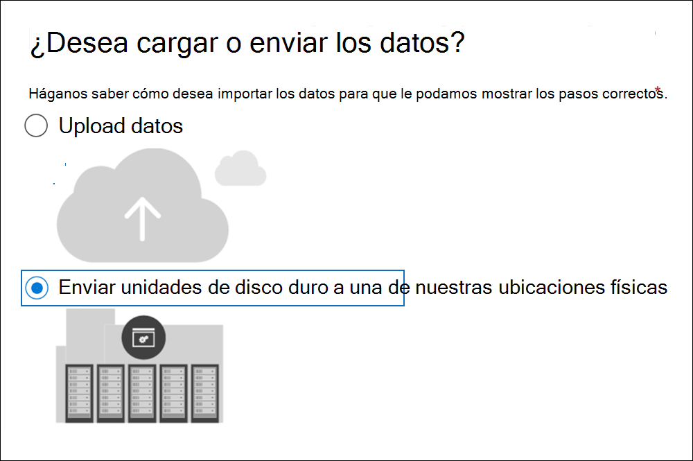
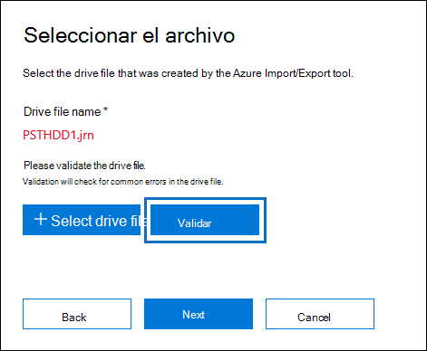
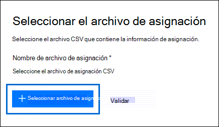
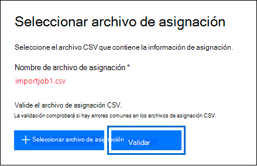
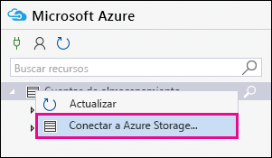
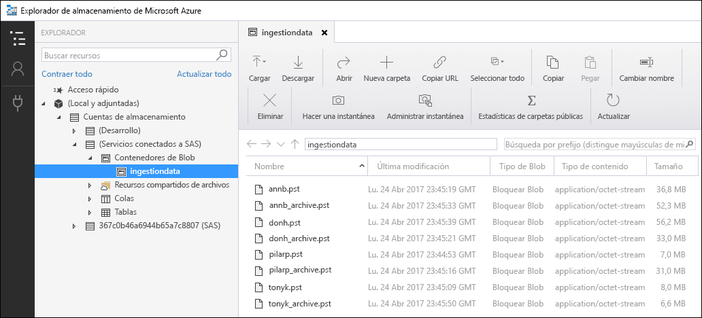
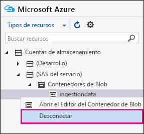

# <a name="use-drive-shipping-to-import-your-organizations-pst-files"></a><span data-ttu-id="361b4-103">Usar el trasvase de unidades para importar los archivos PST de la organización</span><span class="sxs-lookup"><span data-stu-id="361b4-103">Use drive shipping to import your organization's PST files</span></span>

<span data-ttu-id="361b4-104">**Este artículo está para administradores. ¿Está intentando importar archivos PST a su propio buzón? Consulta [Importar correo electrónico, contactos y calendario desde un Outlook archivo .pst](https://go.microsoft.com/fwlink/p/?LinkID=785075)**</span><span class="sxs-lookup"><span data-stu-id="361b4-104">**This article is for administrators. Are you trying to import PST files to your own mailbox? See [Import email, contacts, and calendar from an Outlook .pst file](https://go.microsoft.com/fwlink/p/?LinkID=785075)**</span></span>
   
<span data-ttu-id="361b4-105">Use el Office 365 importar el servicio y el envío de unidades para importar masivamente archivos PST a buzones de usuario.</span><span class="sxs-lookup"><span data-stu-id="361b4-105">Use the Office 365 Import service and drive shipping to bulk-import PST files to user mailboxes.</span></span> <span data-ttu-id="361b4-106">«Envío de unidades» significa que los archivos PST se copian en una unidad de disco duro y se envía la unidad a Microsoft de forma física.</span><span class="sxs-lookup"><span data-stu-id="361b4-106">Drive shipping means that you copy the PST files to a hard disk drive and then physically ship the drive to Microsoft.</span></span> <span data-ttu-id="361b4-107">Cuando Microsoft recibe el disco duro, el personal del centro de datos copia los datos del disco duro en un área de almacenamiento en la nube de Microsoft.</span><span class="sxs-lookup"><span data-stu-id="361b4-107">When Microsoft receives your hard drive, data center personnel copies the data from the hard drive to a storage area in the Microsoft cloud.</span></span> <span data-ttu-id="361b4-108">A continuación, tiene la oportunidad de recortar los datos PST que se importan a los buzones de destino estableciendo filtros que controlan los datos que se importan.</span><span class="sxs-lookup"><span data-stu-id="361b4-108">Then you have the opportunity to trim the PST data that's imported to the target mailboxes by setting filters that control what data gets imported.</span></span> <span data-ttu-id="361b4-109">Después de iniciar el trabajo de importación, el servicio Importar importa los datos PST del área de almacenamiento a los buzones de usuario.</span><span class="sxs-lookup"><span data-stu-id="361b4-109">After you start the import job, the Import service imports the PST data from the storage area to user mailboxes.</span></span> <span data-ttu-id="361b4-110">El uso del trasvase de unidades para importar archivos PST a buzones de usuario es una forma de migrar el correo electrónico de la organización a Office 365.</span><span class="sxs-lookup"><span data-stu-id="361b4-110">Using drive shipping to import PST files to user mailboxes is one way to migrate your organization's email to Office 365.</span></span>
  
<span data-ttu-id="361b4-111">Estos son los pasos necesarios para usar el trasvase de unidades para importar archivos PST a Microsoft 365 buzones de correo:</span><span class="sxs-lookup"><span data-stu-id="361b4-111">Here are the steps required to use drive shipping to import PST files to Microsoft 365 mailboxes:</span></span>
  
[<span data-ttu-id="361b4-112">Paso 1: Descargar la clave de almacenamiento seguro y la herramienta de importación de PST</span><span class="sxs-lookup"><span data-stu-id="361b4-112">Step 1: Download the secure storage key and PST Import tool</span></span>](#step-1-download-the-secure-storage-key-and-pst-import-tool)

[<span data-ttu-id="361b4-113">Paso 2: Copiar los archivos PST en la unidad de disco duro</span><span class="sxs-lookup"><span data-stu-id="361b4-113">Step 2: Copy the PST files to the hard drive</span></span>](#step-2-copy-the-pst-files-to-the-hard-drive)

[<span data-ttu-id="361b4-114">Paso 3: Crear el archivo de asignación de importación de PST</span><span class="sxs-lookup"><span data-stu-id="361b4-114">Step 3: Create the PST Import mapping file</span></span>](#step-3-create-the-pst-import-mapping-file)

[<span data-ttu-id="361b4-115">Paso 4: crear un trabajo de importación de PST en Office 365</span><span class="sxs-lookup"><span data-stu-id="361b4-115">Step 4: Create a PST Import job in Office 365</span></span>](#step-4-create-a-pst-import-job-in-office-365)

[<span data-ttu-id="361b4-116">Paso 5: enviar la unidad de disco duro a Microsoft</span><span class="sxs-lookup"><span data-stu-id="361b4-116">Step 5: Ship the hard drive to Microsoft</span></span>](#step-5-ship-the-hard-drive-to-microsoft)

[<span data-ttu-id="361b4-117">Paso 6: filtrar los datos e iniciar el trabajo de importación de PST</span><span class="sxs-lookup"><span data-stu-id="361b4-117">Step 6: Filter data and start the PST Import job</span></span>](#step-6-filter-data-and-start-the-pst-import-job)
  
> [!IMPORTANT]
> <span data-ttu-id="361b4-118">Debe realizar el paso 1 una vez para bajar la carga de la clave de almacenamiento seguro y la herramienta de importación.</span><span class="sxs-lookup"><span data-stu-id="361b4-118">You have to perform Step 1 once to down load the secure storage key and the import tool.</span></span> <span data-ttu-id="361b4-119">Después de realizar estos pasos, siga los pasos del 2 al 6 cada vez que desee enviar un disco duro a Microsoft.</span><span class="sxs-lookup"><span data-stu-id="361b4-119">After you perform these steps, follow Step 2 through Step 6 each time you want to ship a hard drive to Microsoft.</span></span> 
  
<span data-ttu-id="361b4-120">Para obtener preguntas más frecuentes acerca del uso del trasvase de unidades para importar archivos PST a Office 365, consulta Preguntas más frecuentes sobre cómo usar el trasvase de unidades para [importar archivos PST](./faqimporting-pst-files-to-office-365.yml#using-drive-shipping-to-import-pst-files).</span><span class="sxs-lookup"><span data-stu-id="361b4-120">For frequently asked questions about using drive shipping to import PST files to Office 365, see [FAQs for using drive shipping to import PST files](./faqimporting-pst-files-to-office-365.yml#using-drive-shipping-to-import-pst-files).</span></span> 
  
## <a name="before-you-import-pst-files"></a><span data-ttu-id="361b4-121">Antes de importar archivos PST</span><span class="sxs-lookup"><span data-stu-id="361b4-121">Before you import PST files</span></span>

- <span data-ttu-id="361b4-122">Debe tener asignado el rol importación y exportación de buzón de Exchange Online para importar archivos PST a los buzones de Microsoft 365.</span><span class="sxs-lookup"><span data-stu-id="361b4-122">You have to be assigned the Mailbox Import Export role in Exchange Online to import PST files to Microsoft 365 mailboxes.</span></span> <span data-ttu-id="361b4-123">Este rol no está asignado a ningún grupo de roles de Exchange Online de forma predeterminada.</span><span class="sxs-lookup"><span data-stu-id="361b4-123">By default, this role isn't assigned to any role group in Exchange Online.</span></span> <span data-ttu-id="361b4-124">Puede agregar el rol Mailbox Import Export al grupo de roles Administración de la organización.</span><span class="sxs-lookup"><span data-stu-id="361b4-124">You can add the Mailbox Import Export role to the Organization Management role group.</span></span> <span data-ttu-id="361b4-125">También puede crear un grupo de roles, asignarle el rol Mailbox Import Export y agregarse a sí mismo como miembro.</span><span class="sxs-lookup"><span data-stu-id="361b4-125">Or you can create a role group, assign the Mailbox Import Export role, and then add yourself as a member.</span></span> <span data-ttu-id="361b4-126">Para obtener más información, vea las secciones "Agregar un rol a un grupo de roles" o "Crear un grupo de roles" en [Administrar grupos de roles](/Exchange/permissions-exo/role-groups).</span><span class="sxs-lookup"><span data-stu-id="361b4-126">For more information, see the "Add a role to a role group" or the "Create a role group" sections in [Manage role groups](/Exchange/permissions-exo/role-groups).</span></span>
    
    <span data-ttu-id="361b4-127">Además, para crear trabajos de importación en el centro de Microsoft 365 cumplimiento, debe cumplirse uno de los siguientes requisitos:</span><span class="sxs-lookup"><span data-stu-id="361b4-127">Additionally, to create import jobs in the Microsoft 365 compliance center, one of the following must be true:</span></span>
    
  - <span data-ttu-id="361b4-p104">Debe tener asignado el rol de Destinatarios de correo en Exchange Online. De forma predeterminada, este rol se asigna a los grupos de roles de Administración de la organización y Administración de destinatarios.</span><span class="sxs-lookup"><span data-stu-id="361b4-p104">You have to be assigned the Mail Recipients role in Exchange Online. By default, this role is assigned to the Organization Management and Recipient Management roles groups.</span></span>
    
    <span data-ttu-id="361b4-130">O bien:</span><span class="sxs-lookup"><span data-stu-id="361b4-130">Or</span></span>
    
  - <span data-ttu-id="361b4-131">Necesita ser administrador global en su organización.</span><span class="sxs-lookup"><span data-stu-id="361b4-131">You have to be a global administrator in your organization.</span></span>
    
    > [!TIP]
    > <span data-ttu-id="361b4-132">Puede crear un nuevo grupo de roles en Exchange Online que está pensado específicamente para la importación de archivos PST a Office 365.</span><span class="sxs-lookup"><span data-stu-id="361b4-132">Consider creating a new role group in Exchange Online that's specifically intended for importing PST files to Office 365.</span></span> <span data-ttu-id="361b4-133">Para obtener el nivel mínimo de privilegios necesarios para importar archivos PST, asigne los roles de importación y exportación de buzón y de destinatarios de correo al nuevo grupo de roles y, a continuación, agregue a los miembros.</span><span class="sxs-lookup"><span data-stu-id="361b4-133">For the minimum level of privileges required to import PST files, assign the Mailbox Import Export and Mail Recipients roles to the new role group, and then add members.</span></span> 
  
- <span data-ttu-id="361b4-134">Debe almacenar los archivos PST que desea copiar en una unidad de disco duro de un servidor de archivos o una carpeta compartida de la organización.</span><span class="sxs-lookup"><span data-stu-id="361b4-134">You need to store the PST files that you want to copy to a hard drive on a file server or shared folder in your organization.</span></span> <span data-ttu-id="361b4-135">En el paso 2, ejecute la herramienta Azure Import Export (WAImportExport.exe) que copia los archivos PST almacenados en este servidor de archivos o carpeta compartida en la unidad de disco duro.</span><span class="sxs-lookup"><span data-stu-id="361b4-135">In Step 2, you run the Azure Import Export tool (WAImportExport.exe) that copies the PST files that are stored on this file server or shared folder to the hard drive.</span></span>

- <span data-ttu-id="361b4-136">Es posible que los archivos PST de gran tamaño afecten al rendimiento del proceso de importación de PST.</span><span class="sxs-lookup"><span data-stu-id="361b4-136">Large PST files may impact the performance of the PST import process.</span></span> <span data-ttu-id="361b4-137">Por lo tanto, se recomienda que cada archivo PST que copie en la unidad de disco duro del paso 2 no debe tener más de 20 GB.</span><span class="sxs-lookup"><span data-stu-id="361b4-137">So we recommend that each PST file you copy to the hard drive in Step 2 should be no larger than 20 GB.</span></span>
    
- <span data-ttu-id="361b4-138">Solo se admiten unidades de estado sólido (SSD) de 2,5 pulgadas o unidades de disco duro internas SATA II/III de 2,5 o 3,5 pulgadas para su uso con el servicio de importación de Office 365.</span><span class="sxs-lookup"><span data-stu-id="361b4-138">Only 2.5-inch solid-state drives (SSDs) or 2.5-inch or 3.5-inch SATA II/III internal hard drives are supported for use with the Office 365 Import service.</span></span> <span data-ttu-id="361b4-139">Puede usar discos duros de hasta 10 TB.</span><span class="sxs-lookup"><span data-stu-id="361b4-139">You can use hard drives up to 10 TB.</span></span> <span data-ttu-id="361b4-140">Para los trabajos de importación, se procesará solo el primer volumen de datos del disco duro.</span><span class="sxs-lookup"><span data-stu-id="361b4-140">For import jobs, only the first data volume on the hard drive will be processed.</span></span> <span data-ttu-id="361b4-141">El volumen de datos debe tener el formato NTFS.</span><span class="sxs-lookup"><span data-stu-id="361b4-141">The data volume must be formatted with NTFS.</span></span> <span data-ttu-id="361b4-142">Al copiar datos en una unidad de disco duro, puede adjuntarlos directamente con un SSD de 2,5 pulgadas o un conector SATA II/III de 2,5 pulgadas o 3,5 pulgadas, o bien puede adjuntarlos externamente con un SSD externo de 2,5 pulgadas o un adaptador USB SATA II/III de 2,5 pulgadas o 3,5 pulgadas.</span><span class="sxs-lookup"><span data-stu-id="361b4-142">When copying data to a hard drive, you can attach it directly using a 2.5-inch SSD or 2.5-inch or 3.5-inch SATA II/III connector or you can attach it externally using an external 2.5-inch SSD or 2.5-inch or 3.5-inch SATA II/III USB adaptor.</span></span>
    
    > [!IMPORTANT]
    > <span data-ttu-id="361b4-143">El Servicio de importación de Office 365 no admite los discos duros externos con un adaptador USB integrado.</span><span class="sxs-lookup"><span data-stu-id="361b4-143">External hard drives that come with an built-in USB adaptor aren't supported by the Office 365 Import service.</span></span> <span data-ttu-id="361b4-144">Además, no se puede usar un disco que esté dentro de la carcasa de un disco duro externo.</span><span class="sxs-lookup"><span data-stu-id="361b4-144">Additionally, the disk inside the casing of an external hard drive can't be used.</span></span> <span data-ttu-id="361b4-145">No envíe discos duros externos.</span><span class="sxs-lookup"><span data-stu-id="361b4-145">Please don't ship external hard drives.</span></span> 
  
- <span data-ttu-id="361b4-146">La unidad de disco duro a la que copie los archivos PST debe estar cifrada con BitLocker.</span><span class="sxs-lookup"><span data-stu-id="361b4-146">The hard drive that you copy the PST files to must be encrypted with BitLocker.</span></span> <span data-ttu-id="361b4-147">La herramienta WAImportExport.exe, ejecutada en el paso 2, le ayudará a configurar BitLocker.</span><span class="sxs-lookup"><span data-stu-id="361b4-147">The WAImportExport.exe tool that you run in Step 2 will help you set up BitLocker.</span></span> <span data-ttu-id="361b4-148">También genera una clave de cifrado BitLocker que el personal del centro de datos de Microsoft usa para acceder a la unidad para cargar los archivos PST en el área Azure Storage en la nube de Microsoft.</span><span class="sxs-lookup"><span data-stu-id="361b4-148">It also generates a BitLocker encryption key that Microsoft data center personnel use to access the drive to upload the PST files to the Azure Storage area in the Microsoft cloud.</span></span>
    
- <span data-ttu-id="361b4-149">El trasvase de unidades está disponible a través Enterprise Agreement (EA) de Microsoft.</span><span class="sxs-lookup"><span data-stu-id="361b4-149">Drive shipping is available through a Microsoft Enterprise Agreement (EA).</span></span> <span data-ttu-id="361b4-150">El envío de unidades no está disponible mediante un Contrato de productos y servicios de Microsoft (MPSA).</span><span class="sxs-lookup"><span data-stu-id="361b4-150">Drive shipping isn't available through a Microsoft Products and Services Agreement (MPSA).</span></span>
    
- <span data-ttu-id="361b4-151">El costo de importar archivos PST a Microsoft 365 buzones de correo mediante el trasvase de unidades es de 2 USD por GB de datos.</span><span class="sxs-lookup"><span data-stu-id="361b4-151">The cost to import PST files to Microsoft 365 mailboxes using drive shipping is $2 USD per GB of data.</span></span> <span data-ttu-id="361b4-152">Por ejemplo, si envía una unidad de disco duro que contiene 1000 GB (1 TB) de archivos PST, el costo es 2000 USD.</span><span class="sxs-lookup"><span data-stu-id="361b4-152">For example, if you ship a hard drive that contains 1,000 GB (1 TB) of PST files, the cost is $2,000 USD.</span></span> <span data-ttu-id="361b4-153">Puede colaborar con un asociado para abonar la cuota de importación.</span><span class="sxs-lookup"><span data-stu-id="361b4-153">You can work with a partner to pay the import fee.</span></span> <span data-ttu-id="361b4-154">Para obtener información sobre cómo buscar un asociado, consulte [Buscar un asociado o distribuidor de Microsoft](../admin/manage/find-your-partner-or-reseller.md).</span><span class="sxs-lookup"><span data-stu-id="361b4-154">For information about finding a partner, see [Find your Microsoft partner or reseller](../admin/manage/find-your-partner-or-reseller.md).</span></span>
    
- <span data-ttu-id="361b4-155">Usted o su organización debe tener una cuenta con FedEx o DHL. </span><span class="sxs-lookup"><span data-stu-id="361b4-155">You or your organization must have an account with FedEx or DHL.</span></span>
    
  - <span data-ttu-id="361b4-156">Las organizaciones de Estados Unidos, Brasil y Europa deben tener cuentas de FedEx.</span><span class="sxs-lookup"><span data-stu-id="361b4-156">Organizations in the United States, Brazil, and Europe must have FedEx accounts.</span></span>
    
  - <span data-ttu-id="361b4-157">Las organizaciones de Asia oriental, sudeste asiático, Japón, República de Corea y Australia deben tener cuentas de DHL.</span><span class="sxs-lookup"><span data-stu-id="361b4-157">Organizations in East Asia, Southeast Asia, Japan, Republic of Korea, and Australia must have DHL accounts.</span></span>
    
    <span data-ttu-id="361b4-158">Microsoft usa (y cobra) esta cuenta para devolverle el disco duro.</span><span class="sxs-lookup"><span data-stu-id="361b4-158">Microsoft uses (and charges) this account to return the hard drive back to you.</span></span>
    
- <span data-ttu-id="361b4-159">El disco duro que envíe a Microsoft puede cruzar las fronteras internacionales.</span><span class="sxs-lookup"><span data-stu-id="361b4-159">The hard drive that you ship to Microsoft may cross international borders.</span></span> <span data-ttu-id="361b4-160">En este caso, es responsable de garantizar que el disco duro y los datos que contiene se importen o exporten de acuerdo con las leyes aplicables.</span><span class="sxs-lookup"><span data-stu-id="361b4-160">In this case, you're responsible for ensuring that the hard drive and the data it contains are imported and/or exported in accordance with the applicable laws.</span></span> <span data-ttu-id="361b4-161">Antes de enviar una unidad de disco duro, póngase en contacto con sus asesores para comprobar que la unidad y los datos se puedan enviar de forma legal al centro de datos de Microsoft identificado.</span><span class="sxs-lookup"><span data-stu-id="361b4-161">Before shipping a hard drive, check with your advisors to verify that your drive and data can legally be shipped to the identified Microsoft data center.</span></span> <span data-ttu-id="361b4-162">Esto ayuda a garantizar que llega a Microsoft en tiempo y forma.</span><span class="sxs-lookup"><span data-stu-id="361b4-162">This helps to ensure that it reaches Microsoft in a timely manner.</span></span>
    
- <span data-ttu-id="361b4-163">Este procedimiento implica copiar y guardar una clave de almacenamiento seguro y una clave de cifrado de BitLocker.</span><span class="sxs-lookup"><span data-stu-id="361b4-163">This procedure involves copying and saving a secure storage key and a BitLocker encryption key.</span></span> <span data-ttu-id="361b4-164">Asegúrese de tomar precauciones para proteger estas claves de la misma manera que protegería las contraseñas u otra información relacionada con la seguridad.</span><span class="sxs-lookup"><span data-stu-id="361b4-164">Be sure to take precautions to protect these keys like you would protect passwords or other security-related information.</span></span> <span data-ttu-id="361b4-165">Por ejemplo, puede guardarlas en un documento de Microsoft Word protegido por contraseña o en una unidad USB cifrada.</span><span class="sxs-lookup"><span data-stu-id="361b4-165">For example, you might save them to a password-protected Microsoft Word document or save them to an encrypted USB drive.</span></span> <span data-ttu-id="361b4-166">Vea la [sección Más información](#more-information) para obtener un ejemplo de estas claves.</span><span class="sxs-lookup"><span data-stu-id="361b4-166">See the [More information](#more-information) section for an example of these keys.</span></span> 
    
- <span data-ttu-id="361b4-167">Después de importar los archivos PST a un buzón de Microsoft 365, la configuración de retención del buzón se ha activado durante un período indefinido.</span><span class="sxs-lookup"><span data-stu-id="361b4-167">After PST files are imported to a Microsoft 365 mailbox, the retention hold setting for the mailbox is turned on for an indefinite duration.</span></span> <span data-ttu-id="361b4-168">Esto significa que la directiva de retención asignada al buzón no se procesará hasta que desactive la espera de retención o establezca una fecha para desactivar la retención.</span><span class="sxs-lookup"><span data-stu-id="361b4-168">This means that the retention policy assigned to the mailbox won't be processed until you turn off the retention hold or set a date to turn off the hold.</span></span> <span data-ttu-id="361b4-169">¿Por qué lo hacemos?</span><span class="sxs-lookup"><span data-stu-id="361b4-169">Why do we do this?</span></span> <span data-ttu-id="361b4-170">Si los mensajes importados a un buzón son antiguos, es posible que se eliminen de forma permanente, ya que su período de retención ha caducado en función de la configuración de retención establecida para el buzón.</span><span class="sxs-lookup"><span data-stu-id="361b4-170">If messages imported to a mailbox are old, they might be permanently deleted (purged) because their retention period has expired based on the retention settings configured for the mailbox.</span></span> <span data-ttu-id="361b4-171">Al colocar el buzón en espera de retención, el propietario del buzón tiene tiempo para administrar estos mensajes recién importados o usted tendrá tiempo para cambiar la configuración de retención del buzón.</span><span class="sxs-lookup"><span data-stu-id="361b4-171">Placing the mailbox on retention hold gives the mailbox owner time to manage these newly imported messages or give you time to change the retention settings for the mailbox.</span></span> <span data-ttu-id="361b4-172">Vea la [sección Más información para](#more-information) obtener sugerencias sobre cómo administrar la retención.</span><span class="sxs-lookup"><span data-stu-id="361b4-172">See the [More information](#more-information) section for suggestions about managing the retention hold.</span></span> 
    
- <span data-ttu-id="361b4-173">De forma predeterminada, el tamaño máximo de mensaje que puede recibir un buzón de Microsoft 365 es de 35 MB.</span><span class="sxs-lookup"><span data-stu-id="361b4-173">By default, the maximum message size that can be received by a Microsoft 365 mailbox is 35 MB.</span></span> <span data-ttu-id="361b4-174">Esto se debe a que el valor predeterminado de la propiedad *MaxReceiveSize* de un buzón está establecido en 35 MB.</span><span class="sxs-lookup"><span data-stu-id="361b4-174">That's because the default value for the  *MaxReceiveSize*  property for a mailbox is set to 35 MB.</span></span> <span data-ttu-id="361b4-175">Pero el límite de tamaño máximo de recepción de mensajes en Microsoft 365 es de 150 MB.</span><span class="sxs-lookup"><span data-stu-id="361b4-175">However, the limit for the maximum message receive size in Microsoft 365 is 150 MB.</span></span> <span data-ttu-id="361b4-176">Por lo tanto, si importa un archivo PST que contiene un elemento superior a 35 MB, el servicio de importación de Office 365 cambiará automáticamente el valor de la propiedad *MaxReceiveSize* en el buzón de destino a 150 MB.</span><span class="sxs-lookup"><span data-stu-id="361b4-176">So if you import a PST file that contains an item larger than 35 MB, the Office 365 Import service we will automatically change the value of the  *MaxReceiveSize*  property on the target mailbox to 150 MB.</span></span> <span data-ttu-id="361b4-177">Esto permite que se importen a buzones de usuario mensajes de hasta 150 MB.</span><span class="sxs-lookup"><span data-stu-id="361b4-177">This allows messages up to 150 MB to be imported to user mailboxes.</span></span> 
    
    > [!TIP]
    > <span data-ttu-id="361b4-178">Para identificar el tamaño de recepción de un buzón de correo, puede ejecutar este comando en PowerShell de Exchange Online: `Get-Mailbox <user mailbox> | FL MaxReceiveSize`.</span><span class="sxs-lookup"><span data-stu-id="361b4-178">To identify the message receive size for a mailbox, you can run this command in Exchange Online PowerShell:  `Get-Mailbox <user mailbox> | FL MaxReceiveSize`.</span></span> 
  
- <span data-ttu-id="361b4-179">Puede importar archivos PST a un buzón inactivo de Office 365.</span><span class="sxs-lookup"><span data-stu-id="361b4-179">You can import PST files to an inactive mailbox in Office 365.</span></span> <span data-ttu-id="361b4-180">Para ello, debe especificar el GUID del buzón inactivo en el parámetro `Mailbox` del archivo de asignación de importación de PST.</span><span class="sxs-lookup"><span data-stu-id="361b4-180">You do this by specifying the GUID of the inactive mailbox in the  `Mailbox` parameter in the PST Import mapping file.</span></span> <span data-ttu-id="361b4-181">Vea [Paso 3: Crear el archivo de asignación de importación de PST](#step-3-create-the-pst-import-mapping-file) para obtener más información.</span><span class="sxs-lookup"><span data-stu-id="361b4-181">See [Step 3: Create the PST Import mapping file](#step-3-create-the-pst-import-mapping-file) for more information.</span></span> 
    
- <span data-ttu-id="361b4-182">En una implementación híbrida de Exchange, puede importar archivos PST a un buzón de archivo basado en la nube para un usuario cuyo buzón principal es local.</span><span class="sxs-lookup"><span data-stu-id="361b4-182">In an Exchange hybrid deployment, you can import PST files to a cloud-based archive mailbox for a user whose primary mailbox is on-premises.</span></span> <span data-ttu-id="361b4-183">Para ello, haga lo siguiente en el archivo de asignación de importación de PST:</span><span class="sxs-lookup"><span data-stu-id="361b4-183">You do this by doing the following in the PST Import mapping file:</span></span>
    
  - <span data-ttu-id="361b4-184">Especifique la dirección de correo electrónico del buzón local del usuario en el parámetro `Mailbox`.</span><span class="sxs-lookup"><span data-stu-id="361b4-184">Specify the email address for the user's on-premises mailbox in the  `Mailbox` parameter.</span></span> 
    
  - <span data-ttu-id="361b4-185">Especifique el valor **TRUE** en el parámetro `IsArchive`.</span><span class="sxs-lookup"><span data-stu-id="361b4-185">Specify the **TRUE** value in the  `IsArchive` parameter.</span></span> 
    
    <span data-ttu-id="361b4-186">Vea [Paso 3: Crear el archivo de asignación de importación de PST](#step-3-create-the-pst-import-mapping-file) para obtener más información.</span><span class="sxs-lookup"><span data-stu-id="361b4-186">See [Step 3: Create the PST Import mapping file](#step-3-create-the-pst-import-mapping-file) for more information.</span></span> 

## <a name="step-1-download-the-secure-storage-key-and-pst-import-tool"></a><span data-ttu-id="361b4-187">Paso 1: Descargar la clave de almacenamiento seguro y la herramienta de importación de PST</span><span class="sxs-lookup"><span data-stu-id="361b4-187">Step 1: Download the secure storage key and PST Import tool</span></span>

<span data-ttu-id="361b4-188">El primer paso es descargar la clave de almacenamiento seguro y la herramienta y que se usa en el paso 2 para copiar archivos PST en la unidad de disco duro.</span><span class="sxs-lookup"><span data-stu-id="361b4-188">The first step is to download the secure storage key and the tool and that you use in Step 2 to copy PST files to the hard drive.</span></span>
  
> [!IMPORTANT]
> <span data-ttu-id="361b4-189">Debe usar azure Import/Export versión 1 (WAimportExportV1) para importar correctamente archivos PST mediante el método de envío de unidades.</span><span class="sxs-lookup"><span data-stu-id="361b4-189">You have to use Azure Import/Export tool version 1 (WAimportExportV1) to successfully import PST files by using the drive shipping method.</span></span> <span data-ttu-id="361b4-190">La versión 2 de la herramienta Import/Export Azure no es compatible y su uso dará como resultado preparar incorrectamente el disco duro para el trabajo de importación.</span><span class="sxs-lookup"><span data-stu-id="361b4-190">Version 2 of the Azure Import/Export tool isn't supported and using it will result in incorrectly preparing the hard drive for the import job.</span></span> <span data-ttu-id="361b4-191">Asegúrese de descargar la herramienta azure Import/Export desde el centro de Microsoft 365 cumplimiento siguiendo los procedimientos descritos en este paso.</span><span class="sxs-lookup"><span data-stu-id="361b4-191">Be sure to download the Azure Import/Export tool from the Microsoft 365 compliance center by following the procedures in this step.</span></span> 
  
1. <span data-ttu-id="361b4-192">Vaya a <https://compliance.microsoft.com> e inicie sesión con las credenciales de una cuenta de administrador de su organización.</span><span class="sxs-lookup"><span data-stu-id="361b4-192">Go to <https://compliance.microsoft.com> and sign in using the credentials for an administrator account in your organization.</span></span>

2. <span data-ttu-id="361b4-193">En el panel de navegación izquierdo del centro de Microsoft 365 cumplimiento, haga clic en **Importar gobierno de** \> **información.**</span><span class="sxs-lookup"><span data-stu-id="361b4-193">In the left navigation pane of the Microsoft 365 compliance center, click **Information governance** \> **Import**.</span></span>
    
    > [!NOTE]
    > <span data-ttu-id="361b4-194">Como se ha indicado anteriormente, debe tener asignados  los permisos adecuados para tener acceso a la página Importar en el centro de Microsoft 365 cumplimiento.</span><span class="sxs-lookup"><span data-stu-id="361b4-194">As previously stated, you have to be assigned the appropriate permissions to access the **Import** page in the Microsoft 365 compliance center.</span></span> 
  
3. <span data-ttu-id="361b4-195">En la **pestaña Importar,** haga clic  **importación**.</span><span class="sxs-lookup"><span data-stu-id="361b4-195">On the **Import** tab, click  **New import job**.</span></span>
    
4. <span data-ttu-id="361b4-196">En el Asistente para importar trabajo, escriba un nombre para el trabajo de importación de PST y, a continuación, haga clic **en Siguiente**.</span><span class="sxs-lookup"><span data-stu-id="361b4-196">In the import job wizard, type a name for the PST import job, and then click **Next**.</span></span> <span data-ttu-id="361b4-197">Use letras minúsculas, números, guiones y caracteres de subrayado.</span><span class="sxs-lookup"><span data-stu-id="361b4-197">Use lowercase letters, numbers, hyphens, and underscores.</span></span> <span data-ttu-id="361b4-198">Las letras en mayúscula no se pueden usar ni se pueden incluir espacios en el nombre.</span><span class="sxs-lookup"><span data-stu-id="361b4-198">You can't use uppercase letters or include spaces in the name.</span></span>
    
5. <span data-ttu-id="361b4-199">En la página **Elegir tipo de trabajo de** importación, haga clic en Enviar **unidades** de disco duro a una de nuestras ubicaciones físicas y, a continuación, haga clic **en Siguiente**.</span><span class="sxs-lookup"><span data-stu-id="361b4-199">On the **Choose import job type** page, click **Ship hard drives to one of our physical locations** and then click **Next**.</span></span>
    
    
  
6. <span data-ttu-id="361b4-201">En la página **Importar datos**, siga los dos pasos siguientes:</span><span class="sxs-lookup"><span data-stu-id="361b4-201">On the **Import data** page, do the following two things:</span></span> 
    
    
  
    <span data-ttu-id="361b4-203">a.</span><span class="sxs-lookup"><span data-stu-id="361b4-203">a.</span></span> <span data-ttu-id="361b4-204">En el paso 2, haga clic **en Mostrar la clave de almacenamiento seguro**.</span><span class="sxs-lookup"><span data-stu-id="361b4-204">In step 2, click **Show the secure storage key**.</span></span> <span data-ttu-id="361b4-205">Después de mostrar la clave  de almacenamiento, haga clic en Copiar en el Portapapeles y, a continuación, péguela y guárdela en un archivo para que pueda obtener acceso a ella más adelante.</span><span class="sxs-lookup"><span data-stu-id="361b4-205">After the storage key is displayed, click **Copy to clipboard** and then paste it and save it to a file so you can access it later.</span></span>
    
    <span data-ttu-id="361b4-206">b.</span><span class="sxs-lookup"><span data-stu-id="361b4-206">b.</span></span> <span data-ttu-id="361b4-207">En el paso 3, **descargue la herramienta Import/Export Azure** para descargar e instalar la herramienta Azure Import/Export (versión 1).</span><span class="sxs-lookup"><span data-stu-id="361b4-207">In step 3, **Download the Azure Import/Export tool** to download and install the Azure Import/Export (version 1) tool.</span></span>
    
    - <span data-ttu-id="361b4-208">En la ventana emergente, haga clic en **Guardar** guardar como para guardar el archivo \>  WaImportExportV1.zip en una carpeta del equipo local.</span><span class="sxs-lookup"><span data-stu-id="361b4-208">In the pop-up window, click **Save** \> **Save as** to save the WaImportExportV1.zip file to a folder on your local computer.</span></span> 
    
    - <span data-ttu-id="361b4-209">Extraiga el WaImportExportV1.zip archivo.</span><span class="sxs-lookup"><span data-stu-id="361b4-209">Extract the WaImportExportV1.zip file.</span></span>
    
7. <span data-ttu-id="361b4-210">Haga **clic en** Cancelar para cerrar el asistente.</span><span class="sxs-lookup"><span data-stu-id="361b4-210">Click **Cancel** to close the wizard.</span></span> 
    
    <span data-ttu-id="361b4-211">Cuando cree el  trabajo de importación en el paso 4, vuelva a la página Importar del centro de Microsoft 365 de cumplimiento.</span><span class="sxs-lookup"><span data-stu-id="361b4-211">You come back to the **Import** page in the Microsoft 365 compliance center when you create the import job in Step 4.</span></span> 

## <a name="step-2-copy-the-pst-files-to-the-hard-drive"></a><span data-ttu-id="361b4-212">Paso 2: Copiar los archivos PST en la unidad de disco duro</span><span class="sxs-lookup"><span data-stu-id="361b4-212">Step 2: Copy the PST files to the hard drive</span></span>

<span data-ttu-id="361b4-213">El siguiente paso es usar la herramienta WAImportExport.exe para copiar archivos PST en la unidad de disco duro.</span><span class="sxs-lookup"><span data-stu-id="361b4-213">The next step is to use the WAImportExport.exe tool to copy PST files to the hard drive.</span></span> <span data-ttu-id="361b4-214">Esta herramienta cifra la unidad de disco duro con BitLocker, copia los archivos PST en el disco duro y crea un archivo de diario que almacena información sobre el proceso de copia.</span><span class="sxs-lookup"><span data-stu-id="361b4-214">This tool encrypts the hard drive with BitLocker, copies the PSTs to the hard drive, and creates a journal file that stores information about the copy process.</span></span> <span data-ttu-id="361b4-215">Para llevar a cabo este paso, los archivos PST tienen que estar ubicados en un recurso compartido de archivos o en un servidor de archivos de su organización.</span><span class="sxs-lookup"><span data-stu-id="361b4-215">To complete this step, the PST files have to be located in a file share or file server in your organization.</span></span> <span data-ttu-id="361b4-216">Esto se conoce como el directorio de origen en el siguiente procedimiento.</span><span class="sxs-lookup"><span data-stu-id="361b4-216">This is known as the source directory in the following procedure.</span></span> 

 <span data-ttu-id="361b4-217">Como se ha indicado anteriormente, cada archivo PST que copie en la unidad de disco duro no debe tener más de 20 GB.</span><span class="sxs-lookup"><span data-stu-id="361b4-217">As previously stated, each PST file that you copy to the hard drive should be no larger than 20 GB.</span></span> <span data-ttu-id="361b4-218">Los archivos PST con un tamaño superior a 20 GB pueden afectar al rendimiento del proceso de importación de PST que comience en el paso 6.</span><span class="sxs-lookup"><span data-stu-id="361b4-218">PST files larger than 20 GB may impact the performance of the PST import process that you start in Step 6.</span></span>
  
> [!IMPORTANT]
> <span data-ttu-id="361b4-219">Después de ejecutar por primera vez la herramienta WAImportExport.exe para una unidad de disco duro, tendrá que usar una sintaxis diferente cada vez que la use.</span><span class="sxs-lookup"><span data-stu-id="361b4-219">After you run the WAImportExport.exe tool the first time for a hard drive, you have to use a different syntax each time after that.</span></span> <span data-ttu-id="361b4-220">Esta sintaxis se explica en el paso 4 de este procedimiento para copiar archivos PST en la unidad de disco duro.</span><span class="sxs-lookup"><span data-stu-id="361b4-220">This syntax is explained in step 4 of this procedure to copy PST files to the hard drive.</span></span> 
  
1. <span data-ttu-id="361b4-221">Abra el símbolo del sistema del equipo local.</span><span class="sxs-lookup"><span data-stu-id="361b4-221">Open a Command Prompt on your local computer.</span></span>
    
    > [!TIP]
    > <span data-ttu-id="361b4-p126">Si ejecuta el símbolo del sistema como administrador (seleccionando "Ejecutar como administrador" al abrirlo), en la ventana del símbolo del sistema aparecerán mensajes de error que le pueden ayudar a solucionar los problemas que aparecen al ejecutar la herramienta WAImportExport.exe.</span><span class="sxs-lookup"><span data-stu-id="361b4-p126">If you run the command prompt as an administrator (by selecting "Run as administrator" when you open it) error messages will be displayed in the command prompt window. This can help you troubleshoot problems running the WAImportExport.exe tool.</span></span> 
  
2. <span data-ttu-id="361b4-224">Vaya al directorio en el que instaló la herramienta WAImportExport.exe en el paso 1.</span><span class="sxs-lookup"><span data-stu-id="361b4-224">Go to the directory where you installed the WAImportExport.exe tool in Step 1.</span></span>
    
3. <span data-ttu-id="361b4-225">Ejecute el siguiente comando la primera vez que use la herramienta WAImportExport.exe para copiar archivos PST en una unidad de disco duro.</span><span class="sxs-lookup"><span data-stu-id="361b4-225">Run the following command the first time that you use the WAImportExport.exe to copy PST files to a hard drive.</span></span>

    ```powershell
    WAImportExport.exe PrepImport /j:<Name of journal file> /t:<Drive letter> /id:<Name of session> /srcdir:<Location of PST files> /dstdir:<PST file path> /sk:<Storage account key> /blobtype:BlockBlob /encrypt /logdir:<Log file location>
    ```

    <span data-ttu-id="361b4-226">En la tabla siguiente se describen los parámetros y los valores requeridos.</span><span class="sxs-lookup"><span data-stu-id="361b4-226">The following table describes the parameters and their required values.</span></span>
    
    |<span data-ttu-id="361b4-227">**Parámetro**</span><span class="sxs-lookup"><span data-stu-id="361b4-227">**Parameter**</span></span>|<span data-ttu-id="361b4-228">**Descripción**</span><span class="sxs-lookup"><span data-stu-id="361b4-228">**Description**</span></span>|<span data-ttu-id="361b4-229">**Ejemplo**</span><span class="sxs-lookup"><span data-stu-id="361b4-229">**Example**</span></span>|
    |:-----|:-----|:-----|
    | `/j:` <br/> |<span data-ttu-id="361b4-p127">Especifica el nombre del archivo de diario. Este archivo se guarda en la misma carpeta en la que se encuentra la herramienta WAImportExport.exe. Todas las unidades de disco duro que envíe a Microsoft deben tener un archivo de diario. Cada vez que ejecute la herramienta WAImportTool.exe para copiar archivos PST en una unidad de disco duro, la información se anexará al archivo de diario de esa unidad. 
</span><span class="sxs-lookup"><span data-stu-id="361b4-p127">Specifies the name of the journal file. This file is saved to the same folder where the WAImportExport.exe tool is located. Each hard drive you ship to Microsoft must have one journal file. Every time you run the WAImportTool.exe to copy PST files to a hard drive, information will be appended to the journal file for that drive.</span></span>  <br/> <span data-ttu-id="361b4-234">El personal del centro de datos de Microsoft usa la información del archivo de diario para asociar la unidad de disco duro con el trabajo de importación que cree en el paso 4 y cargar los archivos PST en el área Azure Storage en la nube de Microsoft.</span><span class="sxs-lookup"><span data-stu-id="361b4-234">Microsoft data center personnel use the information in the journal file to associate the hard drive with the import job that you create in Step 4, and to upload the PST files to the Azure Storage area in the Microsoft cloud.</span></span>  <br/> | `/j:PSTHDD1.jrn` <br/> |
    | `/t:` <br/> |<span data-ttu-id="361b4-235">Especifica la letra de la unidad de disco duro cuando se conecta a su equipo local.</span><span class="sxs-lookup"><span data-stu-id="361b4-235">Specifies the drive letter of the hard drive when it's connected to your local computer.</span></span>  <br/> | `/t:h` <br/> |
    | `/id:` <br/> |<span data-ttu-id="361b4-p128">Especifica el nombre de la sesión de copia. Cada vez que ejecuta la herramienta WAImportExport.exe para copiar los archivos en la unidad de disco duro, se define una sesión. Los archivos PST se copian en una carpeta cuyo nombre es el nombre de la sesión especificado por este parámetro. </span><span class="sxs-lookup"><span data-stu-id="361b4-p128">Specifies the name of the copy session. A session is defined as each time you run the WAImportExport.exe tool to copy files to the hard drive. The PST files are copied to a folder named with the session name specified by this parameter.</span></span>  <br/> | `/id:driveship1` <br/> |
    | `/srcdir:` <br/> |<span data-ttu-id="361b4-239">Especifica el directorio de origen de la organización que contiene los archivos PST que se copiarán durante la sesión.</span><span class="sxs-lookup"><span data-stu-id="361b4-239">Specifies the source directory in your organization that contains the PST files that will be copied during the session.</span></span> <span data-ttu-id="361b4-240">No olvide incluir el valor de este parámetro entre comillas dobles (" ").</span><span class="sxs-lookup"><span data-stu-id="361b4-240">Be sure to surround the value of this parameter with double-quotation marks (" ").</span></span>  <br/> | `/srcdir:"\\FILESERVER01\PSTs"` <br/> |
    | `/dstdir:` <br/> |<span data-ttu-id="361b4-241">Especifica el directorio de destino en el Azure Storage en la nube de Microsoft donde se cargarán los PST.</span><span class="sxs-lookup"><span data-stu-id="361b4-241">Specifies the destination directory in the Azure Storage area in the Microsoft cloud where the PSTs will be uploaded.</span></span> <span data-ttu-id="361b4-242">Debe usar el valor  `ingestiondata/` .</span><span class="sxs-lookup"><span data-stu-id="361b4-242">You must use the value  `ingestiondata/`.</span></span> <span data-ttu-id="361b4-243">No olvide incluir el valor de este parámetro entre comillas dobles (" ").</span><span class="sxs-lookup"><span data-stu-id="361b4-243">Be sure to surround the value of this parameter with double-quotation marks (" ").</span></span>  <br/> <span data-ttu-id="361b4-244">Opcionalmente, también puede agregar una ruta de acceso de archivo adicional al valor de este parámetro.</span><span class="sxs-lookup"><span data-stu-id="361b4-244">Optionally, you can also add an extra file path to the value of this parameter.</span></span> <span data-ttu-id="361b4-245">Por ejemplo, puede usar la ruta de acceso del archivo del directorio de origen en la unidad de disco duro (convertida a un formato de dirección URL), que se especifica en el  `/srcdir:` parámetro.</span><span class="sxs-lookup"><span data-stu-id="361b4-245">For example, you can use the file path of the source directory on the hard drive (converted to a URL format), which is specified in the  `/srcdir:` parameter.</span></span> <span data-ttu-id="361b4-246">Por ejemplo,  `\\FILESERVER01\PSTs` se cambia a  `FILESERVER01/PSTs` .</span><span class="sxs-lookup"><span data-stu-id="361b4-246">For example,  `\\FILESERVER01\PSTs` is changed to  `FILESERVER01/PSTs`.</span></span> <span data-ttu-id="361b4-247">En este caso, aún debe incluir en  `ingestiondata` la ruta de acceso del archivo.</span><span class="sxs-lookup"><span data-stu-id="361b4-247">In this case, you still must include  `ingestiondata` in the file path.</span></span> <span data-ttu-id="361b4-248">Por lo tanto, en este ejemplo, el valor del  `/dstdir:` parámetro sería  `"ingestiondata/FILESERVER01/PSTs"` .</span><span class="sxs-lookup"><span data-stu-id="361b4-248">So in this example, the value for the  `/dstdir:` parameter would be  `"ingestiondata/FILESERVER01/PSTs"`.</span></span>  <br/> <span data-ttu-id="361b4-249">Si tiene archivos PST con el mismo nombre de archivo, debería agregar la ruta de acceso de archivo adicional.</span><span class="sxs-lookup"><span data-stu-id="361b4-249">One reason to add the additional file path is if you have PSTs files with the same filename.</span></span>  <br/> <span data-ttu-id="361b4-250">> [!NOTE]> Si incluye el pathname opcional, el espacio de nombres de un archivo PST después de cargarlo en el área Azure Storage incluye el nombre de ruta de acceso y el nombre del archivo PST; por ejemplo, `FILESERVER01/PSTs/annb.pst` .</span><span class="sxs-lookup"><span data-stu-id="361b4-250">> [!NOTE]> If you include the optional pathname, the namespace for a PST file after it's uploaded to the Azure Storage area includes the pathname and the name of the PST file; for example,  `FILESERVER01/PSTs/annb.pst`.</span></span> <span data-ttu-id="361b4-251">Si no incluye un nombre de ruta de acceso, el espacio de nombres es solo el nombre de archivo PST; por ejemplo  `annb.pst` .</span><span class="sxs-lookup"><span data-stu-id="361b4-251">If you don't include a pathname, the namespace is only the PST filename; for example  `annb.pst`.</span></span>           | `/dstdir:"ingestiondata/"` <br/> <span data-ttu-id="361b4-252">O bien</span><span class="sxs-lookup"><span data-stu-id="361b4-252">Or</span></span>  <br/>  `/dstdir:"ingestiondata/FILESERVER01/PSTs"` <br/> |
    | `/sk:` <br/> |<span data-ttu-id="361b4-253">Especifica la clave de la cuenta de almacenamiento que obtuvo en el paso 1.</span><span class="sxs-lookup"><span data-stu-id="361b4-253">Specifies the storage account key that you obtained in Step 1.</span></span> <span data-ttu-id="361b4-254">No olvide incluir el valor de este parámetro entre comillas dobles (" ").</span><span class="sxs-lookup"><span data-stu-id="361b4-254">Be sure to surround the value of this parameter with double-quotation marks (" ").</span></span>  <br/> | `"yaNIIs9Uy5g25Yoak+LlSHfqVBGOeNwjqtBEBGqRMoidq6/e5k/VPkjOXdDIXJHxHvNoNoFH5NcVUJXHwu9ZxQ=="` <br/> |
    | `/blobtype:` <br/> |Especifica el tipo de blobs en el área Azure Storage a la que se importarán los archivos PST. Para importar archivos PST, use el valor **BlockBlob**. <span data-ttu-id="361b4-257">Este parámetro es obligatorio.</span><span class="sxs-lookup"><span data-stu-id="361b4-257">This parameter is required.</span></span>   <br/> | `/blobtype:BlockBlob` <br/> |
    | `/encrypt` <br/> |<span data-ttu-id="361b4-p135">Este modificador activa BitLocker en la unidad de disco duro. Este parámetro es necesario la primera vez que ejecuta la herramienta WAImportExport.exe.  </span><span class="sxs-lookup"><span data-stu-id="361b4-p135">This switch turns on BitLocker for the hard drive. This parameter is required the first time you run the WAImportExport.exe tool.  </span></span><br/> <span data-ttu-id="361b4-260">La BitLocker de cifrado se copia en el archivo de diario y el archivo de registro que se crea si se usa el `/logfile:` parámetro.</span><span class="sxs-lookup"><span data-stu-id="361b4-260">The BitLocker encryption key is copied to the journal file and the log file that is created if you use the  `/logfile:` parameter.</span></span> <span data-ttu-id="361b4-261">Como se ha explicado anteriormente, el archivo de diario se guarda en la misma carpeta en la que se encuentra la herramienta WAImportExport.exe.</span><span class="sxs-lookup"><span data-stu-id="361b4-261">As previously explained, the journal file is saved to the same folder where the WAImportExport.exe tool is located.</span></span>  <br/> | `/encrypt` <br/> |
    | `/logdir:` <br/> |<span data-ttu-id="361b4-262">Este parámetro opcional especifica una carpeta en la que se guardan los archivos de registro.</span><span class="sxs-lookup"><span data-stu-id="361b4-262">This optional parameter specifies a folder to save log files to.</span></span> <span data-ttu-id="361b4-263">Si no se especifica, los archivos de registro se guardan en la misma carpeta donde se encuentra WAImportExport.exe herramienta.</span><span class="sxs-lookup"><span data-stu-id="361b4-263">If not specified, the log files are saved to the same folder where the WAImportExport.exe tool is located.</span></span> <span data-ttu-id="361b4-264">No olvide incluir el valor de este parámetro entre comillas dobles (" ").</span><span class="sxs-lookup"><span data-stu-id="361b4-264">Be sure to surround the value of this parameter with double-quotation marks (" ").</span></span>  <br/> | `/logdir:"c:\users\admin\desktop\PstImportLogs"` <br/> |
   
    <span data-ttu-id="361b4-265">A continuación se muestra un ejemplo de la sintaxis de la herramienta WAImportExport.exe, en el que se usan valores reales para cada parámetro:</span><span class="sxs-lookup"><span data-stu-id="361b4-265">Here's an example of the syntax for the WAImportExport.exe tool using actual values for each parameter:</span></span>
    
    ```powershell
    WAImportExport.exe PrepImport /j:PSTHDD1.jrn /t:f /id:driveship1 /srcdir:"\\FILESERVER01\PSTs" /dstdir:"ingestiondata/" /sk:"yaNIIs9Uy5g25Yoak+LlSHfqVBGOeNwjqtBEBGqRMoidq6/e5k/VPkjOXdDIXJHxHvNoNoFH5NcVUJXHwu9ZxQ==" blobtype:BlockBlob /encrypt /logdir:"c:\users\admin\desktop\PstImportLogs"
    ```

    <span data-ttu-id="361b4-p138">Después de ejecutar el comando, aparecen mensajes de estado en los que se muestra el progreso de la copia de los archivos PST en la unidad de disco duro. En un mensaje de estado final aparece el número total de archivos copiados correctamente. </span><span class="sxs-lookup"><span data-stu-id="361b4-p138">After you run the command, status messages are displayed that show the progress of copying the PST files to the hard drive. A final status message shows the total number of files that were successfully copied.</span></span>
    
4. <span data-ttu-id="361b4-268">Ejecute este comando cada vez que ejecute la herramienta WAImportExport.ext para copiar los archivos PST en la misma unidad de disco duro.</span><span class="sxs-lookup"><span data-stu-id="361b4-268">Run this command each subsequent time you run the WAImportExport.ext tool to copy PST files to the same hard drive.</span></span>

    ```powershell
    WAImportExport.exe PrepImport /j:<Name of journal file> /id:<Name of new session> /srcdir:<Location of PST files> /dstdir:<PST file path> /blobtype:BlockBlob 
    ```

    <span data-ttu-id="361b4-269">A continuación se muestra un ejemplo de la sintaxis para ejecutar sesiones posteriores y copiar los archivos PST en la misma unidad de disco duro.  </span><span class="sxs-lookup"><span data-stu-id="361b4-269">Here's an example of the syntax for running subsequent sessions to copy PST files to the same hard drive.</span></span>

    ```powershell
    WAImportExport.exe PrepImport /j:PSTHDD1.jrn /id:driveship2 /srcdir:"\\FILESERVER01\PSTs\SecondBatch" /dstdir:"ingestiondata/" /blobtype:BlockBlob
    ```

## <a name="step-3-create-the-pst-import-mapping-file"></a><span data-ttu-id="361b4-270">Paso 3: Crear el archivo de asignación de importación de PST</span><span class="sxs-lookup"><span data-stu-id="361b4-270">Step 3: Create the PST Import mapping file</span></span>

<span data-ttu-id="361b4-271">Después de que el personal del centro de datos de Microsoft cargue los archivos PST desde la unidad de disco duro al área de Azure Storage, el servicio de importación usará la información del archivo de asignación de importación de PST, que es un archivo de valores separados por comas (CSV), que especifica a qué buzones de usuario se importan los archivos PST.</span><span class="sxs-lookup"><span data-stu-id="361b4-271">After Microsoft data center personnel upload the PST files from the hard drive to the Azure Storage area, the Import service will use the information in the PST Import mapping file, which is a comma-separated value (CSV) file, that specifies which user mailboxes the PST files are imported to.</span></span> <span data-ttu-id="361b4-272">Este archivo CSV se enviará en el paso siguiente, cuando cree un trabajo de importación de archivos PST.</span><span class="sxs-lookup"><span data-stu-id="361b4-272">You will submit this CSV file in the next step when you create a PST Import job.</span></span>
  
1. <span data-ttu-id="361b4-273">[Descargue una copia del archivo de asignación de importación de PST](https://go.microsoft.com/fwlink/p/?LinkId=544717).</span><span class="sxs-lookup"><span data-stu-id="361b4-273">[Download a copy of the PST Import mapping file](https://go.microsoft.com/fwlink/p/?LinkId=544717).</span></span>
    
2. <span data-ttu-id="361b4-p140">Abra o guarde el archivo CSV en el equipo local. En el ejemplo siguiente se muestra un archivo de asignación de importaciones de archivos PST completado (que se abre en el Bloc de notas). Es mucho más fácil usar Microsoft Excel para editar el archivo CSV.</span><span class="sxs-lookup"><span data-stu-id="361b4-p140">Open or save the CSV file to your local computer. The following example shows a completed PST Import mapping file (opened in NotePad). It's much easier to use Microsoft Excel to edit the CSV file.</span></span>

    ```text
    Workload,FilePath,Name,Mailbox,IsArchive,TargetRootFolder,ContentCodePage,SPFileContainer,SPManifestContainer,SPSiteUrl
    Exchange,FILESERVER01/PSTs,annb.pst,annb@contoso.onmicrosoft.com,FALSE,/,,,,
    Exchange,FILESERVER01/PSTs,annb_archive.pst,annb@contoso.onmicrosoft.com,TRUE,/ImportedPst,,,,
    Exchange,FILESERVER01/PSTs,donh.pst,donh@contoso.onmicrosoft.com,FALSE,/,,,,
    Exchange,FILESERVER01/PSTs,donh_archive.pst,donh@contoso.onmicrosoft.com,TRUE,/ImportedPst,,,,
    Exchange,FILESERVER01/PSTs,pilarp.pst,pilarp@contoso.onmicrosoft.com,FALSE,/,,,,
    Exchange,FILESERVER01/PSTs,pilarp_archive.pst,pilarp@contoso.onmicrosoft.com,TRUE,/ImportedPst,,,,
    Exchange,,tonyk.pst,tonyk@contoso.onmicrosoft.com,FALSE,/,,,,
    Exchange,,tonyk_archive.pst,tonyk@contoso.onmicrosoft.com,TRUE,,,,,
    Exchange,,zrinkam.pst,zrinkam@contoso.onmicrosoft.com,FALSE,/,,,,
    Exchange,,zrinkam_archive.pst,zrinkam@contoso.onmicrosoft.com,TRUE,,,,,
    ```

    <span data-ttu-id="361b4-277">En la primera fila (o la primera fila de encabezado) del archivo CSV aparecen los parámetros que usará el servicio de importación de PST para importar los archivos PST a los buzones de los usuarios.</span><span class="sxs-lookup"><span data-stu-id="361b4-277">The first row, or header row, of the CSV file lists the parameters that will be used by the PST Import service to import the PST files to user mailboxes.</span></span> <span data-ttu-id="361b4-278">Los nombres de los parámetros están separados por comas.</span><span class="sxs-lookup"><span data-stu-id="361b4-278">Each parameter name is separated by a comma.</span></span> <span data-ttu-id="361b4-279">Cada fila situada debajo de la fila de encabezado representa los valores de parámetro para importar un archivo PST a un buzón específico.</span><span class="sxs-lookup"><span data-stu-id="361b4-279">Each row under the header row represents the parameter values for importing a PST file to a specific mailbox.</span></span> <span data-ttu-id="361b4-280">Necesita una fila para cada archivo PST que se copió en la unidad de disco duro.</span><span class="sxs-lookup"><span data-stu-id="361b4-280">You need a row for each PST file that was copied to the hard drive.</span></span> <span data-ttu-id="361b4-281">No olvide reemplazar los datos de los marcadores de posición del archivo de asignación por los datos reales.</span><span class="sxs-lookup"><span data-stu-id="361b4-281">Be sure to replace the placeholder data in the mapping file with your actual data.</span></span>

    > [!NOTE]
    > <span data-ttu-id="361b4-282">No cambie nada en la fila de encabezado, ni siquiera los parámetros SharePoint; se ignorarán durante el proceso de importación de PST.</span><span class="sxs-lookup"><span data-stu-id="361b4-282">Don't change anything in the header row, including the SharePoint parameters; they will be ignored during the PST Import process.</span></span> 
  
3. <span data-ttu-id="361b4-283">Use la información de la tabla siguiente para rellenar el archivo CSV con la información necesaria.</span><span class="sxs-lookup"><span data-stu-id="361b4-283">Use the information in the following table to populate the CSV file with the required information.</span></span>
    
    |<span data-ttu-id="361b4-284">**Parámetro**</span><span class="sxs-lookup"><span data-stu-id="361b4-284">**Parameter**</span></span>|<span data-ttu-id="361b4-285">**Descripción**</span><span class="sxs-lookup"><span data-stu-id="361b4-285">**Description**</span></span>|<span data-ttu-id="361b4-286">**Ejemplo**</span><span class="sxs-lookup"><span data-stu-id="361b4-286">**Example**</span></span>|
    |:-----|:-----|:-----|
    | `Workload` <br/> |<span data-ttu-id="361b4-287">Especifica el servicio en el que se importarán los datos.</span><span class="sxs-lookup"><span data-stu-id="361b4-287">Specifies the service that data will be imported to.</span></span> <span data-ttu-id="361b4-288">Use `Exchange` para importar archivos PST a los buzones de los usuarios.</span><span class="sxs-lookup"><span data-stu-id="361b4-288">To import PST files to user mailboxes, use  `Exchange`.</span></span>  <br/> | `Exchange` <br/> |
    | `FilePath` <br/> | <span data-ttu-id="361b4-289">Especifica la ubicación de carpeta en el área Azure Storage a la que se copiarán los archivos PST cuando la unidad de disco duro se envíe a Microsoft.</span><span class="sxs-lookup"><span data-stu-id="361b4-289">Specifies the folder location in the Azure Storage area that PST files will be copied to when the hard drive is shipped to Microsoft.</span></span>  <br/>  <span data-ttu-id="361b4-290">Lo que agregue en esta columna en el archivo CSV depende de lo que haya especificado para el  `/dstdir:` parámetro en el paso anterior.</span><span class="sxs-lookup"><span data-stu-id="361b4-290">What you add in this column in the CSV file depends on what you specified in for the  `/dstdir:` parameter in the previous step.</span></span> <span data-ttu-id="361b4-291">Si tiene subcarpetas en la ubicación de origen, el valor del parámetro debe contener la ruta relativa de la subcarpeta; por `FilePath` ejemplo, /folder1/user1/.</span><span class="sxs-lookup"><span data-stu-id="361b4-291">If you have subfolders on the source location, then the value in the `FilePath` parameter must contain the relative path for the subfolder; for example, /folder1/user1/.</span></span>  <br/>  <span data-ttu-id="361b4-292">Si usó  `/dstdir:"ingestiondata/"` , deje este parámetro en blanco en el archivo CSV.</span><span class="sxs-lookup"><span data-stu-id="361b4-292">If you used  `/dstdir:"ingestiondata/"`, then leave this parameter blank in the CSV file.</span></span>  <br/>  <span data-ttu-id="361b4-293">Si incluyó un pathname opcional para el valor del parámetro (por ejemplo, , use ese nombre de ruta de acceso (sin incluir  `/dstdir:` "ingestiondata") para este parámetro en el  `/dstdir:"ingestiondata/FILESERVER01/PSTs"` archivo CSV.</span><span class="sxs-lookup"><span data-stu-id="361b4-293">If you included an optional pathname for the value of the  `/dstdir:` parameter (for example,  `/dstdir:"ingestiondata/FILESERVER01/PSTs"`, then use that pathname (not including "ingestiondata") for this parameter in the CSV file.</span></span> <span data-ttu-id="361b4-294">El valor de este parámetro distingue mayúsculas de minúsculas.</span><span class="sxs-lookup"><span data-stu-id="361b4-294">The value for this parameter is case-sensitive.</span></span>  <br/>  <span data-ttu-id="361b4-295">En cualquier caso, *no* incluya "ingestiondata" en el valor del parámetro `FilePath`.</span><span class="sxs-lookup"><span data-stu-id="361b4-295">Either way,  *don't*  include "ingestiondata" in the value for the  `FilePath` parameter.</span></span> <span data-ttu-id="361b4-296">Deje este parámetro en blanco o especifique solo el pathname opcional.</span><span class="sxs-lookup"><span data-stu-id="361b4-296">Leave this parameter blank or specify only the optional pathname.</span></span>  <br/> <span data-ttu-id="361b4-297">> [!IMPORTANT]> El caso del nombre de la ruta de acceso del archivo debe ser el mismo caso que especificó en el  `/dstdir:` parámetro en el paso anterior.</span><span class="sxs-lookup"><span data-stu-id="361b4-297">> [!IMPORTANT]>  The case for the file path name must be the same case that you specified in the  `/dstdir:` parameter in the previous step.</span></span> <span data-ttu-id="361b4-298">Por ejemplo, si usó el nombre de subcarpeta en el paso anterior, pero luego se usó en el parámetro del archivo CSV, se producirá un error en la importación del  `"ingestiondata/FILESERVER01/PSTs"`  `fileserver01/psts` archivo  `FilePath` PST.</span><span class="sxs-lookup"><span data-stu-id="361b4-298">For example, if you used  `"ingestiondata/FILESERVER01/PSTs"` for the subfolder name in the previous step, but then used  `fileserver01/psts` in the  `FilePath` parameter in CSV file, the import for the PST file will fail.</span></span> <span data-ttu-id="361b4-299">Asegúrese de usar las mismas mayúsculas y minúsculas en ambas instancias.</span><span class="sxs-lookup"><span data-stu-id="361b4-299">Be sure to use the same case in both instances.</span></span>           |<span data-ttu-id="361b4-300">(se deja en blanco)</span><span class="sxs-lookup"><span data-stu-id="361b4-300">(leave blank)</span></span>  <br/> <span data-ttu-id="361b4-301">O bien</span><span class="sxs-lookup"><span data-stu-id="361b4-301">Or</span></span>  <br/>  `FILESERVER01/PSTs` <br/> |
    | `Name` <br/> |<span data-ttu-id="361b4-302">Especifica el nombre del archivo PST que se importará al buzón del usuario.</span><span class="sxs-lookup"><span data-stu-id="361b4-302">Specifies the name of the PST file that will be imported to the user mailbox.</span></span> <span data-ttu-id="361b4-303">El valor de este parámetro distingue mayúsculas de minúsculas.</span><span class="sxs-lookup"><span data-stu-id="361b4-303">The value for this parameter is case-sensitive.</span></span>  <br/> <span data-ttu-id="361b4-304">> [!IMPORTANT]> El caso del nombre de archivo PST en el archivo CSV debe ser el mismo que el archivo PST que se cargó a la ubicación Azure Storage en el paso 2.</span><span class="sxs-lookup"><span data-stu-id="361b4-304">> [!IMPORTANT]> The case for the PST file name in the CSV file must be the same as the PST file that was uploaded to the Azure Storage location in Step 2.</span></span> <span data-ttu-id="361b4-305">Por ejemplo, si usa `annb.pst` en el parámetro `Name` del archivo CSV, pero el nombre del archivo PST real es `AnnB.pst`, se producirá un error en la importación de ese archivo PST.</span><span class="sxs-lookup"><span data-stu-id="361b4-305">For example, if you use  `annb.pst` in the  `Name` parameter in the CSV file, but the name of the actual PST file is  `AnnB.pst`, the import for that PST file will fail.</span></span> <span data-ttu-id="361b4-306">Asegúrese de que el nombre del PST en el archivo CSV use las mismas mayúsculas y minúsculas que el archivo PST real.</span><span class="sxs-lookup"><span data-stu-id="361b4-306">Be sure that the name of the PST in the CSV file uses the same case as the actual PST file.</span></span>           | `annb.pst` <br/> |
    | `Mailbox` <br/> |<span data-ttu-id="361b4-307">Especifica la dirección de correo electrónico del buzón en el que se importará el archivo PST.</span><span class="sxs-lookup"><span data-stu-id="361b4-307">Specifies the email address of the mailbox that the PST file will be imported to.</span></span> <span data-ttu-id="361b4-308">No puede especificar una carpeta pública porque el servicio de importación de PST no admite la importación de archivos PST a carpetas públicas.</span><span class="sxs-lookup"><span data-stu-id="361b4-308">You can't specify a public folder because the PST Import Service doesn't support importing PST files to public folders.</span></span>  <br/> <span data-ttu-id="361b4-309">Para importar un archivo PST a un buzón inactivo, tiene que especificar el GUID del buzón de correo de este parámetro.</span><span class="sxs-lookup"><span data-stu-id="361b4-309">To import a PST file to an inactive mailbox, you have to specify the mailbox GUID for this parameter.</span></span> <span data-ttu-id="361b4-310">Para obtener este GUID, ejecute el siguiente comando de PowerShell en Exchange Online:  `Get-Mailbox <identity of inactive mailbox> -InactiveMailboxOnly | FL Guid`</span><span class="sxs-lookup"><span data-stu-id="361b4-310">To obtain this GUID, run the following PowerShell command in Exchange Online:  `Get-Mailbox <identity of inactive mailbox> -InactiveMailboxOnly | FL Guid`</span></span> <br/> <span data-ttu-id="361b4-311">> [!NOTE]> A veces, es posible que tenga varios buzones con la misma dirección de correo electrónico, donde un buzón es un buzón activo y el otro está en un estado eliminado temporalmente (o inactivo).</span><span class="sxs-lookup"><span data-stu-id="361b4-311">> [!NOTE]> Sometimes, you may have multiple mailboxes with the same email address, where one mailbox is an active mailbox and the other mailbox is in a soft-deleted (or inactive) state.</span></span> <span data-ttu-id="361b4-312">En estas situaciones, tiene que especificar el GUID del buzón de correo para identificar exclusivamente el buzón en el que se importa el archivo PST.</span><span class="sxs-lookup"><span data-stu-id="361b4-312">In these situations, you have to specify the mailbox GUID to uniquely identify the mailbox to import the PST file to.</span></span> <span data-ttu-id="361b4-313">Para obtener este GUID para los buzones activos, ejecute el siguiente comando de PowerShell: `Get-Mailbox <identity of active mailbox> | FL Guid`.</span><span class="sxs-lookup"><span data-stu-id="361b4-313">To obtain this GUID for active mailboxes, run the following PowerShell command:  `Get-Mailbox <identity of active mailbox> | FL Guid`.</span></span> <span data-ttu-id="361b4-314">Para obtener el GUID de buzones eliminados temporalmente (o inactivos), ejecute este comando:  `Get-Mailbox <identity of soft-deleted or inactive mailbox> -SoftDeletedMailbox | FL Guid` .</span><span class="sxs-lookup"><span data-stu-id="361b4-314">To obtain the GUID for soft-deleted (or inactive) mailboxes, run this command:  `Get-Mailbox <identity of soft-deleted or inactive mailbox> -SoftDeletedMailbox | FL Guid`.</span></span>           | `annb@contoso.onmicrosoft.com` <br/> <span data-ttu-id="361b4-315">O bien:</span><span class="sxs-lookup"><span data-stu-id="361b4-315">Or</span></span>  <br/>  `2d7a87fe-d6a2-40cc-8aff-1ebea80d4ae7` <br/> |
    | `IsArchive` <br/> | <span data-ttu-id="361b4-p152">Especifica si se va a importar o el archivo PST en el buzón de archivo del usuario. Hay dos opciones:  </span><span class="sxs-lookup"><span data-stu-id="361b4-p152">Specifies whether to import the PST file to the user's archive mailbox. There are two options:  </span></span><br/> <span data-ttu-id="361b4-318">**FALSE** Importa el archivo PST al buzón principal del usuario.</span><span class="sxs-lookup"><span data-stu-id="361b4-318">**FALSE** Imports the PST file to the user's primary mailbox.</span></span>  <br/> <span data-ttu-id="361b4-319">**TRUE** Importa el archivo PST al buzón de archivo del usuario.</span><span class="sxs-lookup"><span data-stu-id="361b4-319">**TRUE** Imports the PST file to the user's archive mailbox.</span></span> <span data-ttu-id="361b4-320">Esto supone que el [buzón de archivo del usuario está habilitado](enable-archive-mailboxes.md).</span><span class="sxs-lookup"><span data-stu-id="361b4-320">This assumes that the [user's archive mailbox is enabled](enable-archive-mailboxes.md).</span></span> <span data-ttu-id="361b4-321">Si establece este parámetro en `TRUE` y el buzón de archivo del usuario no está habilitado, se producirá un error en la importación para ese usuario.</span><span class="sxs-lookup"><span data-stu-id="361b4-321">If you set this parameter to  `TRUE` and the user's archive mailbox isn't enabled, the import for that user will fail.</span></span> <span data-ttu-id="361b4-322">Si falla una importación para un usuario (porque su archivo no está habilitado y esta propiedad se establece en `TRUE`), los demás usuarios en el trabajo de importación no se verán afectados.</span><span class="sxs-lookup"><span data-stu-id="361b4-322">If an import fails for one user (because their archive isn't enabled and this property is set to  `TRUE`), the other users in the import job won't be affected.</span></span>  <br/>  <span data-ttu-id="361b4-323">Si deja este parámetro en blanco, el archivo PST se importa al buzón de correo principal del usuario.</span><span class="sxs-lookup"><span data-stu-id="361b4-323">If you leave this parameter blank, the PST file is imported to the user's primary mailbox.</span></span>  <br/> <span data-ttu-id="361b4-324">**Nota**: para importar un archivo PST a un buzón de archivo basado en la nube para un usuario cuyo buzón de correo principal es local, solo tiene que especificar `TRUE` para este parámetro y especificar la dirección de correo electrónico del buzón local del usuario para el parámetro `Mailbox`.</span><span class="sxs-lookup"><span data-stu-id="361b4-324">**Note:** To import a PST file to a cloud-based archive mailbox for a user whose primary mailbox is on-premises, just specify  `TRUE` for this parameter and specify the email address for the user's on-premises mailbox for the  `Mailbox` parameter.</span></span>  <br/> | `FALSE` <br/> <span data-ttu-id="361b4-325">O bien</span><span class="sxs-lookup"><span data-stu-id="361b4-325">Or</span></span>  <br/>  `TRUE` <br/> |
    | `TargetRootFolder` <br/> | <span data-ttu-id="361b4-326">Especifica la carpeta en la que se importa el archivo PST.</span><span class="sxs-lookup"><span data-stu-id="361b4-326">Specifies the mailbox folder that the PST file is imported to.</span></span>  <br/>  <span data-ttu-id="361b4-327">Si deja este parámetro en blanco, el PST se importará a una nueva carpeta denominada **Imported** ubicada en el nivel raíz del buzón (el mismo nivel que la carpeta Bandeja de entrada y las otras carpetas de buzones predeterminadas).</span><span class="sxs-lookup"><span data-stu-id="361b4-327">If you leave this parameter blank, the PST will be imported to a new folder named **Imported** located at the root level of the mailbox (the same level as the Inbox folder and the other default mailbox folders).</span></span>  <br/>  <span data-ttu-id="361b4-328">Si especifica , los elementos del archivo PST se importarán directamente en la carpeta Bandeja  `/` de entrada del usuario.</span><span class="sxs-lookup"><span data-stu-id="361b4-328">If you specify  `/`, items in the PST file will be imported directly in to the user's Inbox folder.</span></span>  <br/>  <span data-ttu-id="361b4-329">Si especifica  `/<foldername>` , los elementos del archivo PST se importarán a una carpeta denominada  *\<foldername\>* .</span><span class="sxs-lookup"><span data-stu-id="361b4-329">If you specify  `/<foldername>`, items in the PST file will be imported to a folder named  *\<foldername\>*.</span></span> <span data-ttu-id="361b4-330">Por ejemplo, si usa `/ImportedPst`, los elementos se importarán a una carpeta llamada **PST importados**.</span><span class="sxs-lookup"><span data-stu-id="361b4-330">For example, if you use  `/ImportedPst`, items would be imported to a folder named **ImportedPst**.</span></span> <span data-ttu-id="361b4-331">Esta carpeta estará ubicada en el buzón del usuario en el mismo nivel que la carpeta Bandeja de entrada.</span><span class="sxs-lookup"><span data-stu-id="361b4-331">This folder will be located in the user's mailbox at the same level as the Inbox folder.</span></span>  <br/> |<span data-ttu-id="361b4-332">(se deja en blanco)</span><span class="sxs-lookup"><span data-stu-id="361b4-332">(leave blank)</span></span>  <br/> <span data-ttu-id="361b4-333">O bien</span><span class="sxs-lookup"><span data-stu-id="361b4-333">Or</span></span>  <br/>  `/` <br/> <span data-ttu-id="361b4-334">O bien</span><span class="sxs-lookup"><span data-stu-id="361b4-334">Or</span></span>  <br/>  `/ImportedPst` <br/> |
    | `ContentCodePage` <br/> |<span data-ttu-id="361b4-335">Este parámetro opcional especifica un valor numérico de la página de códigos que se usa para importar archivos PST en el formato de archivo ANSI.</span><span class="sxs-lookup"><span data-stu-id="361b4-335">This optional parameter specifies a numeric value for the code page to use for importing PST files in the ANSI file format.</span></span> <span data-ttu-id="361b4-336">Este parámetro se usa para importar archivos PST de las organizaciones de chino, japonés y coreano, porque estos idiomas suelen usar un juego de caracteres doble byte (DBCS) para la codificación de caracteres.</span><span class="sxs-lookup"><span data-stu-id="361b4-336">This parameter is used for importing PST files from Chinese, Japanese, and Korean (CJK) organizations because these languages typically use a double byte character set (DBCS) for character encoding.</span></span> <span data-ttu-id="361b4-337">Si no se usa este parámetro para importar archivos PST de los idiomas que usan DBCS para los nombres de las carpetas de buzón, dichos nombres suelen ser incomprensibles después de la importación.</span><span class="sxs-lookup"><span data-stu-id="361b4-337">If this parameter isn't used to import PST files for languages that use DBCS for mailbox folder names, the folder names are often garbled after they're imported.</span></span>  <br/> <span data-ttu-id="361b4-338">Para obtener una lista de los valores compatibles que se pueden usar para este parámetro, vea [Identificadores de página de códigos](/windows/win32/intl/code-page-identifiers).</span><span class="sxs-lookup"><span data-stu-id="361b4-338">For a list of supported values to use for this parameter, see [Code Page Identifiers](/windows/win32/intl/code-page-identifiers).</span></span>  <br/> <span data-ttu-id="361b4-339">> [!NOTE]> Como se ha indicado anteriormente, se trata de un parámetro opcional y no tiene que incluirlo en el archivo CSV.</span><span class="sxs-lookup"><span data-stu-id="361b4-339">> [!NOTE]> As previously stated, this is an optional parameter and you don't have to include it in the CSV file.</span></span> <span data-ttu-id="361b4-340">También puede incluirlo y dejar el valor en blanco para una o varias filas.</span><span class="sxs-lookup"><span data-stu-id="361b4-340">Or you can include it and leave the value blank for one or more rows.</span></span>           |<span data-ttu-id="361b4-341">(se deja en blanco)</span><span class="sxs-lookup"><span data-stu-id="361b4-341">(leave blank)</span></span>  <br/> <span data-ttu-id="361b4-342">O bien</span><span class="sxs-lookup"><span data-stu-id="361b4-342">Or</span></span>  <br/>  <span data-ttu-id="361b4-343">`932` (que es el identificador de página de códigos para ANSI/OEM japonés)</span><span class="sxs-lookup"><span data-stu-id="361b4-343">`932` (which is the code page identifier for ANSI/OEM Japanese)</span></span>  <br/> |
    | `SPFileContainer` <br/> |<span data-ttu-id="361b4-344">Para la importación de archivos PST, deje este parámetro en blanco.</span><span class="sxs-lookup"><span data-stu-id="361b4-344">For PST Import, leave this parameter blank.</span></span>  <br/> |<span data-ttu-id="361b4-345">No aplicable</span><span class="sxs-lookup"><span data-stu-id="361b4-345">Not applicable</span></span>  <br/> |
    | `SPManifestContainer` <br/> |<span data-ttu-id="361b4-346">Para la importación de archivos PST, deje este parámetro en blanco.</span><span class="sxs-lookup"><span data-stu-id="361b4-346">For PST Import, leave this parameter blank.</span></span>  <br/> |<span data-ttu-id="361b4-347">No aplicable</span><span class="sxs-lookup"><span data-stu-id="361b4-347">Not applicable</span></span>  <br/> |
    | `SPSiteUrl` <br/> |<span data-ttu-id="361b4-348">Para la importación de archivos PST, deje este parámetro en blanco.</span><span class="sxs-lookup"><span data-stu-id="361b4-348">For PST Import, leave this parameter blank.</span></span>  <br/> |<span data-ttu-id="361b4-349">No aplicable</span><span class="sxs-lookup"><span data-stu-id="361b4-349">Not applicable</span></span>  <br/> |

## <a name="step-4-create-a-pst-import-job-in-office-365"></a><span data-ttu-id="361b4-350">Paso 4: crear un trabajo de importación de PST en Office 365</span><span class="sxs-lookup"><span data-stu-id="361b4-350">Step 4: Create a PST Import job in Office 365</span></span>

<span data-ttu-id="361b4-351">El siguiente paso consiste en crear el trabajo de importación de PST en el servicio de importación de Office 365.</span><span class="sxs-lookup"><span data-stu-id="361b4-351">The next step is to create the PST Import job in the Import service in Office 365.</span></span> <span data-ttu-id="361b4-352">Como se explicó anteriormente, envía el archivo de asignación de importación de PST que creó en el paso 3.</span><span class="sxs-lookup"><span data-stu-id="361b4-352">As previously explained, you submit the PST Import mapping file that you created in Step 3.</span></span> <span data-ttu-id="361b4-353">Después de crear el trabajo, el servicio de importación usará la información del archivo de asignación para importar los archivos PST al buzón de usuario especificado después de copiar los archivos PST desde el disco duro al área de Azure Storage y crear e iniciar el trabajo de importación.</span><span class="sxs-lookup"><span data-stu-id="361b4-353">After you create the job, the Import service will use the information in the mapping file to import the PST files to the specified user mailbox after the PST files are copied from the hard drive to the Azure Storage area and you create and start the import job.</span></span>
  
1. <span data-ttu-id="361b4-354">Vaya a <https://compliance.microsoft.com> e inicie sesión con las credenciales de una cuenta de administrador de su organización.</span><span class="sxs-lookup"><span data-stu-id="361b4-354">Go to <https://compliance.microsoft.com> and sign in using the credentials for an administrator account in your organization.</span></span>

2. <span data-ttu-id="361b4-355">En el panel de navegación izquierdo del centro de Microsoft 365 cumplimiento, haga clic en **Importar gobierno de** \> **información.**</span><span class="sxs-lookup"><span data-stu-id="361b4-355">In the left navigation pane of the Microsoft 365 compliance center, click **Information governance** \> **Import**.</span></span>

3. <span data-ttu-id="361b4-356">En la **pestaña Importar,** haga clic  **importación**.</span><span class="sxs-lookup"><span data-stu-id="361b4-356">On the **Import** tab, click  **New import job**.</span></span>

    > [!NOTE]
    > <span data-ttu-id="361b4-357">Como se ha indicado anteriormente, debe tener asignados  los permisos adecuados para tener acceso a la página Importar en el centro de Microsoft 365 cumplimiento.</span><span class="sxs-lookup"><span data-stu-id="361b4-357">As previously stated, you have to be assigned the appropriate permissions to access the **Import** page in the Microsoft 365 compliance center.</span></span>
  
4. <span data-ttu-id="361b4-358">Escriba un nombre para el trabajo de importación de PST y haga clic en **Siguiente**.</span><span class="sxs-lookup"><span data-stu-id="361b4-358">Type a name for the PST import job, and then click **Next**.</span></span> <span data-ttu-id="361b4-359">Use letras minúsculas, números, guiones y caracteres de subrayado.</span><span class="sxs-lookup"><span data-stu-id="361b4-359">Use lowercase letters, numbers, hyphens, and underscores.</span></span> <span data-ttu-id="361b4-360">Las letras en mayúscula no se pueden usar ni se pueden incluir espacios en el nombre.</span><span class="sxs-lookup"><span data-stu-id="361b4-360">You can't use uppercase letters or include spaces in the name.</span></span>

5. <span data-ttu-id="361b4-361">En la página **Elegir tipo de trabajo de** importación, haga clic en Enviar **unidades** de disco duro a una de nuestras ubicaciones físicas y, a continuación, haga clic **en Siguiente**.</span><span class="sxs-lookup"><span data-stu-id="361b4-361">On the **Choose import job type** page, click **Ship hard drives to one of our physical locations** and then click **Next**.</span></span>
  
6. <span data-ttu-id="361b4-362">En el paso 6, haga clic en las casillas He preparado  mis unidades de disco duro y tengo acceso a los archivos de diario de unidades necesarios y tengo acceso al archivo de asignación y, a continuación, haga clic en **Siguiente**. </span><span class="sxs-lookup"><span data-stu-id="361b4-362">In step 6, click the **I've prepared my hard drives and have access to the necessary drive journal files** and **I have access to the mapping file** check boxes, and then click **Next**.</span></span>

    
  
7. <span data-ttu-id="361b4-364">En la **página Seleccionar el archivo** de unidad, haga clic en **Seleccionar** archivo de unidad y, a continuación, vaya a la misma carpeta donde se encuentra la herramienta WAImportExport.exe unidad.</span><span class="sxs-lookup"><span data-stu-id="361b4-364">On the **Select the drive file** page, click **Select drive file**, and then go to the same folder where the WAImportExport.exe tool is located.</span></span> <span data-ttu-id="361b4-365">En esta carpeta se copió el archivo de diario creado en el paso 2.</span><span class="sxs-lookup"><span data-stu-id="361b4-365">The journal file that was created in Step 2 was copied to this folder.</span></span>

    
  
8. <span data-ttu-id="361b4-367">Seleccione el archivo de diario; por ejemplo, `PSTHDD1.jrn` .</span><span class="sxs-lookup"><span data-stu-id="361b4-367">Select the journal file; for example, `PSTHDD1.jrn`.</span></span>

    > [!TIP]
    > <span data-ttu-id="361b4-368">Cuando ejecutó la herramienta WAImportExport.exe en el paso 2, el parámetro especificó el nombre del archivo de  `/j:` diario.</span><span class="sxs-lookup"><span data-stu-id="361b4-368">When you ran the WAImportExport.exe tool in Step 2, the name of the journal file was specified by the  `/j:` parameter.</span></span>
  
9. <span data-ttu-id="361b4-369">Después de que el nombre del archivo de unidad aparezca en **Nombre de** archivo de unidad, haga clic en **Validar** para comprobar si hay errores en el archivo de unidad.</span><span class="sxs-lookup"><span data-stu-id="361b4-369">After the name of the drive file appears under **Drive file name**, click **Validate** to check your drive file for errors.</span></span>

    
  
    <span data-ttu-id="361b4-371">El archivo de unidad debe validarse correctamente para crear un trabajo de importación de PST.</span><span class="sxs-lookup"><span data-stu-id="361b4-371">The drive file has to be successfully validated to create a PST Import job.</span></span> <span data-ttu-id="361b4-372">El nombre del archivo cambia a verde una vez que se ha validado correctamente.</span><span class="sxs-lookup"><span data-stu-id="361b4-372">The file name is changed to green after it's successfully validated.</span></span> <span data-ttu-id="361b4-373">Si se produce un error de validación, haga clic en el vínculo **Ver registro**.</span><span class="sxs-lookup"><span data-stu-id="361b4-373">If the validation fails, click the **View log** link.</span></span> <span data-ttu-id="361b4-374">Se abre un informe de error de validación, con un mensaje de error con información sobre por qué se produjo un error en el archivo.</span><span class="sxs-lookup"><span data-stu-id="361b4-374">A validation error report is opened, with an error message with information about why the file failed.</span></span> 

    > [!NOTE]
    > <span data-ttu-id="361b4-375">Debe agregar y validar un archivo de diario para cada unidad de disco duro que envíe a Microsoft.</span><span class="sxs-lookup"><span data-stu-id="361b4-375">You must add and validate a journal file for each hard drive you ship to Microsoft.</span></span> 
  
10. <span data-ttu-id="361b4-376">Después de agregar y validar un archivo de diario para cada unidad de disco duro que envíe a Microsoft, haga clic en **Siguiente**.</span><span class="sxs-lookup"><span data-stu-id="361b4-376">After adding and validating a journal file for each hard drive that you ship to Microsoft, click **Next**.</span></span>
    
11. <span data-ttu-id="361b4-377">Haga clic en Agregar archivo de asignación de selección de iconos para enviar el archivo de asignación de importación   creó en el paso 3.</span><span class="sxs-lookup"><span data-stu-id="361b4-377">Click  **Select mapping file** to submit the PST Import mapping file that you created in Step 3.</span></span> 

    
  
12. <span data-ttu-id="361b4-379">Cuando el nombre del archivo CSV aparezca en **Asignación del nombre de archivo**, haga clic en **Validar** para comprobar si hay errores en el archivo CSV.</span><span class="sxs-lookup"><span data-stu-id="361b4-379">After the name of the CSV file appears under **Mapping file name**, click **Validate** to check your CSV file for errors.</span></span> 

    
  
    <span data-ttu-id="361b4-381">El archivo CSV debe estar validado correctamente para poder crear un trabajo de importación de PST.</span><span class="sxs-lookup"><span data-stu-id="361b4-381">The CSV file has to be successfully validated to create a PST Import job.</span></span> <span data-ttu-id="361b4-382">El nombre del archivo cambia a verde una vez que se ha validado correctamente.</span><span class="sxs-lookup"><span data-stu-id="361b4-382">The file name is changed to green after it's successfully validated.</span></span> <span data-ttu-id="361b4-383">Si se produce un error de validación, haga clic en el vínculo **Ver registro**.</span><span class="sxs-lookup"><span data-stu-id="361b4-383">If the validation fails, click the **View log** link.</span></span> <span data-ttu-id="361b4-384">Se abre un informe de errores de validación, con un mensaje de error para cada fila del archivo que ha fallado.</span><span class="sxs-lookup"><span data-stu-id="361b4-384">A validation error report is opened, with an error message for each row in the file that failed.</span></span> 

13. <span data-ttu-id="361b4-385">Después de validar correctamente el archivo de asignación PST, haga clic **en Siguiente**.</span><span class="sxs-lookup"><span data-stu-id="361b4-385">After the PST mapping file is successfully validated, click **Next**.</span></span>

14. <span data-ttu-id="361b4-386">En la **página Proporcionar información de contacto,** escriba la información de contacto en los cuadros correspondientes.</span><span class="sxs-lookup"><span data-stu-id="361b4-386">On the **Provide contact information** page, type your contact information in the applicable boxes.</span></span> 

    <span data-ttu-id="361b4-387">Se muestra la dirección de la ubicación de Microsoft a la que envía los discos duros.</span><span class="sxs-lookup"><span data-stu-id="361b4-387">The address for the Microsoft location that you ship your hard drives to is displayed.</span></span> <span data-ttu-id="361b4-388">Esta dirección se genera automáticamente en función de la ubicación del centro de datos de Microsoft.</span><span class="sxs-lookup"><span data-stu-id="361b4-388">This address is auto-generated based on your Microsoft datacenter location.</span></span> <span data-ttu-id="361b4-389">Copie esta dirección en un archivo o tome una captura de pantalla.</span><span class="sxs-lookup"><span data-stu-id="361b4-389">Copy this address to a file or take a screenshot.</span></span>

15. <span data-ttu-id="361b4-390">Lea el documento de términos y condiciones, haga clic en la casilla y, a continuación, haga clic en **Guardar** para enviar el trabajo de importación.</span><span class="sxs-lookup"><span data-stu-id="361b4-390">Read the terms and conditions document, click the checkbox, and then click **Save** to submit the import job.</span></span> 

    <span data-ttu-id="361b4-391">Cuando el trabajo de importación se crea correctamente, se muestra una página de estado que explica los siguientes pasos del proceso de trasvase de unidades.</span><span class="sxs-lookup"><span data-stu-id="361b4-391">When the import job is successfully created, a status page is displayed that explains the next steps of the drive shipping process.</span></span>

16. <span data-ttu-id="361b4-392">En la **pestaña Importar,** haga clic en Actualizar icono Actualizar para mostrar el nuevo trabajo de importación de trasvase de   unidades en la lista de trabajos de importación.</span><span class="sxs-lookup"><span data-stu-id="361b4-392">On the **Import** tab, click  **Refresh** to displayed the new drive shipping import job in the list of import jobs.</span></span> <span data-ttu-id="361b4-393">El estado se establece en **Waiting for tracking number**.</span><span class="sxs-lookup"><span data-stu-id="361b4-393">The status is set to **Waiting for tracking number**.</span></span> <span data-ttu-id="361b4-394">También puede hacer clic en el trabajo de importación para mostrar la página desplegable de estado, que contiene información más detallada sobre el trabajo de importación.</span><span class="sxs-lookup"><span data-stu-id="361b4-394">You can also click the import job to display the status flyout page, which contains more detailed information about the import job.</span></span>

## <a name="step-5-ship-the-hard-drive-to-microsoft"></a><span data-ttu-id="361b4-395">Paso 5: enviar la unidad de disco duro a Microsoft</span><span class="sxs-lookup"><span data-stu-id="361b4-395">Step 5: Ship the hard drive to Microsoft</span></span>

<span data-ttu-id="361b4-396">El siguiente paso es enviar el disco duro a Microsoft y, a continuación, proporcionar el número de seguimiento del envío y devolver la información de envío para el trabajo de envío de la unidad.</span><span class="sxs-lookup"><span data-stu-id="361b4-396">The next step is to ship the hard drive to Microsoft, and then provide the tracking number for the shipment and return shipment information for the drive shipping job.</span></span> <span data-ttu-id="361b4-397">Después de que Microsoft reciba la unidad, el personal del centro de datos llevará entre 7 y 10 días laborables cargar los archivos PST en el área de Azure Storage de la organización.</span><span class="sxs-lookup"><span data-stu-id="361b4-397">After the drive is received by Microsoft, it will take between 7 and 10 business days for data center personnel to upload your PST files to the Azure Storage area for your organization.</span></span>
  
> [!NOTE]
> <span data-ttu-id="361b4-398">Si no proporciona el número de seguimiento y devuelve la información de envío dentro de los 14 días siguientes a la creación del trabajo de importación, el trabajo de importación expirará.</span><span class="sxs-lookup"><span data-stu-id="361b4-398">If you don't provide the tracking number and return shipment information within 14 days of creating the import job, the import job will be expired.</span></span> <span data-ttu-id="361b4-399">Si esto sucede, tendrás que crear un nuevo trabajo de importación de trasvase de unidades (consulte Step [4: Create a PST Import job in Office 365](#step-4-create-a-pst-import-job-in-office-365)) y volver a enviar el archivo de unidad y el archivo de asignación de importación de PST.</span><span class="sxs-lookup"><span data-stu-id="361b4-399">If this happens, you'll have to create a new drive shipping import job (see [Step 4: Create a PST Import job in Office 365](#step-4-create-a-pst-import-job-in-office-365)) and re-submit the drive file and the PST import mapping file.</span></span>
  
### <a name="ship-the-hard-drive"></a><span data-ttu-id="361b4-400">Enviar la unidad de disco duro</span><span class="sxs-lookup"><span data-stu-id="361b4-400">Ship the hard drive</span></span>

<span data-ttu-id="361b4-401">Tenga en cuenta lo siguiente a la hora de enviar las unidades de disco duro a Microsoft:</span><span class="sxs-lookup"><span data-stu-id="361b4-401">Keep the following things in mind when you ship hard drives to Microsoft:</span></span>
  
- <span data-ttu-id="361b4-402">No envíe el adaptador SATA a USB; solo tiene que enviar la unidad de disco duro.</span><span class="sxs-lookup"><span data-stu-id="361b4-402">Don't ship the SATA-to-USB adapter; you only have to ship the hard drive.</span></span>

- <span data-ttu-id="361b4-403">Empaquete la unidad de disco duro correctamente (por ejemplo, use un envoltorio de plástico con burbujas o una bolsa antiestática).</span><span class="sxs-lookup"><span data-stu-id="361b4-403">Package the hard drive properly; for example, use an anti-static bag or bubble wrap.</span></span>

- <span data-ttu-id="361b4-404">Seleccione la empresa de transporte que desee para enviar la unidad de disco duro a Microsoft.</span><span class="sxs-lookup"><span data-stu-id="361b4-404">Use a delivery carrier of your choice to ship the hard drive to Microsoft.</span></span>

- <span data-ttu-id="361b4-405">Envíe la unidad de disco duro a la dirección de la ubicación de Microsoft que aparecía al crear el trabajo de importación en el paso 4.</span><span class="sxs-lookup"><span data-stu-id="361b4-405">Ship the hard drive to the address for the Microsoft location that was displayed when you created the import job in Step 4.</span></span> <span data-ttu-id="361b4-406">No olvide incluir «Office 365 Import Service» en la dirección de envío.</span><span class="sxs-lookup"><span data-stu-id="361b4-406">Be sure to include "Office 365 Import Service" in the ship-to address.</span></span>

- <span data-ttu-id="361b4-p167">Después de enviar la unidad de disco duro, asegúrese de anotar el nombre del transportista y el número de seguimiento, que deberá especificar en el siguiente paso.</span><span class="sxs-lookup"><span data-stu-id="361b4-p167">After you ship the hard drive, be sure to write down the name of the delivery carrier and the tracking number. You'll provide these in the next step.</span></span>
    
### <a name="enter-the-tracking-number-and-other-shipping-information"></a><span data-ttu-id="361b4-409">Indicar el número de seguimiento y otros datos de envío</span><span class="sxs-lookup"><span data-stu-id="361b4-409">Enter the tracking number and other shipping information</span></span>

<span data-ttu-id="361b4-410">Cuando haya enviado la unidad de disco duro a Microsoft, lleve a cabo el procedimiento siguiente en la página Servicio de importación.</span><span class="sxs-lookup"><span data-stu-id="361b4-410">After you've shipped the hard drive to Microsoft, complete the following procedure on the Import service page.</span></span>
  
1. <span data-ttu-id="361b4-411">Vaya a <https://compliance.microsoft.com> e inicie sesión con las credenciales de una cuenta de administrador de su organización.</span><span class="sxs-lookup"><span data-stu-id="361b4-411">Go to <https://compliance.microsoft.com> and sign in using the credentials for an administrator account in your organization.</span></span>

2. <span data-ttu-id="361b4-412">En el panel de navegación izquierdo del centro de Microsoft 365 cumplimiento, haga clic en **Gobierno de información > Importar**.</span><span class="sxs-lookup"><span data-stu-id="361b4-412">In the left navigation pane of the Microsoft 365 compliance center, click **Information governance > Import**.</span></span>

3. <span data-ttu-id="361b4-413">En la **pestaña Importar,** haga clic en el trabajo del envío de unidad para el que desea especificar el número de seguimiento.</span><span class="sxs-lookup"><span data-stu-id="361b4-413">On the **Import** tab, click the job for the drive shipment that you want to enter the tracking number for.</span></span>

4. <span data-ttu-id="361b4-414">En la página desplegable estado, haga clic **en Escribir número de seguimiento**.</span><span class="sxs-lookup"><span data-stu-id="361b4-414">On the status flyout page, click **Enter tracking number**.</span></span>

5. <span data-ttu-id="361b4-415">Proporcione la siguiente información de envío:</span><span class="sxs-lookup"><span data-stu-id="361b4-415">Provide the following shipping information:</span></span>

   1. <span data-ttu-id="361b4-416">**Portador de entrega** Escriba el nombre del portador de entrega que usó para enviar la unidad de disco duro a Microsoft.</span><span class="sxs-lookup"><span data-stu-id="361b4-416">**Delivery carrier** Type the name of the delivery carrier that you used to ship the hard drive to Microsoft.</span></span> 

   2. <span data-ttu-id="361b4-417">**Número de seguimiento** Escriba el número de seguimiento del envío de la unidad de disco duro.</span><span class="sxs-lookup"><span data-stu-id="361b4-417">**Tracking number** Type the tracking number for the hard drive shipment.</span></span> 

   3. <span data-ttu-id="361b4-418">**Número de cuenta del operador de devolución** Escriba el número de cuenta de su organización para el operador que aparece en **Portador de devolución**.</span><span class="sxs-lookup"><span data-stu-id="361b4-418">**Return carrier account number** Type your organization's account number for the carrier that listed under **Return carrier**.</span></span> <span data-ttu-id="361b4-419">Microsoft usa (y cobra) esta cuenta para enviar el disco duro de vuelta a usted.</span><span class="sxs-lookup"><span data-stu-id="361b4-419">Microsoft uses (and charges) this account to ship your hard drive back to you.</span></span> <span data-ttu-id="361b4-420">Las organizaciones de Estados Unidos y Europa deben tener una cuenta con FedEx.</span><span class="sxs-lookup"><span data-stu-id="361b4-420">Organizations in the USA and Europe, must have an account with FedEx.</span></span> <span data-ttu-id="361b4-421">Las organizaciones de Asia y del resto del mundo deben tener una cuenta con DHL.</span><span class="sxs-lookup"><span data-stu-id="361b4-421">Organizations in Asia and the rest of the world, must have an account with DHL.</span></span>

6. <span data-ttu-id="361b4-422">Haga clic en **Guardar** para guardar esta información del trabajo de importación.</span><span class="sxs-lookup"><span data-stu-id="361b4-422">Click **Save** to save this information for the import job.</span></span> 

    <span data-ttu-id="361b4-423">En la **pestaña Importar,** haga clic en Actualizar icono Actualizar para actualizar la información del trabajo de importación   trasvase de unidades.</span><span class="sxs-lookup"><span data-stu-id="361b4-423">On the **Import** tab, click  **Refresh** to update the information for your drive shipping import job.</span></span> <span data-ttu-id="361b4-424">Observe que el estado ahora está establecido en **Unidades en tránsito**.</span><span class="sxs-lookup"><span data-stu-id="361b4-424">Notice that status is now set to **Drives in transit**.</span></span>

## <a name="step-6-filter-data-and-start-the-pst-import-job"></a><span data-ttu-id="361b4-425">Paso 6: filtrar los datos e iniciar el trabajo de importación de PST</span><span class="sxs-lookup"><span data-stu-id="361b4-425">Step 6: Filter data and start the PST Import job</span></span>

<span data-ttu-id="361b4-426">Después de que Microsoft reciba el disco duro, el estado del trabajo de importación en la página Importar archivos **PST** cambiará a **Unidades recibidas.**</span><span class="sxs-lookup"><span data-stu-id="361b4-426">After your hard drive is received by Microsoft, the status for the import job on the **Import PST files** page will change to **Drives received**.</span></span> <span data-ttu-id="361b4-427">El personal del centro de datos usa la información del archivo de diario para cargar los archivos PST en el Azure Storage de la organización.</span><span class="sxs-lookup"><span data-stu-id="361b4-427">Data center personnel use the information in the journal file to upload your PST files to the Azure Storage area for your organization.</span></span> <span data-ttu-id="361b4-428">En este momento, el estado cambia **a Importar en curso**.</span><span class="sxs-lookup"><span data-stu-id="361b4-428">At this point, the status changes to **Import in-progress**.</span></span> <span data-ttu-id="361b4-429">Como se ha indicado anteriormente, llevará entre 7 y 10 días laborables después de recibir el disco duro para cargar los archivos PST.</span><span class="sxs-lookup"><span data-stu-id="361b4-429">As previously stated, it will take between 7 and 10 business days after receiving your hard drive to upload the PST files.</span></span>
  
<span data-ttu-id="361b4-430">Una vez cargados los archivos PST en Azure, el estado cambia a **Análisis en curso.**</span><span class="sxs-lookup"><span data-stu-id="361b4-430">After PST files are uploaded to Azure, the status is changed to **Analysis in progress**.</span></span> <span data-ttu-id="361b4-431">Esto indica que Microsoft 365 analiza los datos de los archivos PST (de forma segura y segura) para identificar la antigüedad de los elementos y los diferentes tipos de mensajes incluidos en los archivos PST.</span><span class="sxs-lookup"><span data-stu-id="361b4-431">This indicates that Microsoft 365 is analyzing the data in the PST files (in a safe and secure manner) to identify the age of the items and the different message types included in the PST files.</span></span> <span data-ttu-id="361b4-432">Cuando el análisis se completa y los datos están listos para importarse, el estado del trabajo de importación cambia a **Análisis completado.**</span><span class="sxs-lookup"><span data-stu-id="361b4-432">When the analysis is completed and the data is ready to import, the status for the import job is changed to **Analysis completed**.</span></span> <span data-ttu-id="361b4-433">En este punto, tiene la opción de importar todos los datos contenidos en los archivos PST o puede recortar los datos que se importan estableciendo filtros que controlan los datos que se importan.</span><span class="sxs-lookup"><span data-stu-id="361b4-433">At this point, you have the option to import all the data contained in the PST files or you can trim the data that's imported by setting filters that control what data gets imported.</span></span>
  
1. <span data-ttu-id="361b4-434">Vaya a <https://compliance.microsoft.com> e inicie sesión con las credenciales de una cuenta de administrador de su organización.</span><span class="sxs-lookup"><span data-stu-id="361b4-434">Go to <https://compliance.microsoft.com> and sign in using the credentials for an administrator account in your organization.</span></span>

2. <span data-ttu-id="361b4-435">En el panel de navegación izquierdo del centro de Microsoft 365 cumplimiento, haga clic en **Gobierno de información** \> \*\*Importar\*\*\*\*.</span><span class="sxs-lookup"><span data-stu-id="361b4-435">In the left navigation pane of the Microsoft 365 compliance center, click **Information governance** \> \*\*Import\*\*\*\*.</span></span>

3. <span data-ttu-id="361b4-436">En la **pestaña** Importar, seleccione el trabajo de importación que creó en el paso 4 y haga clic **en Importar para Office 365**.</span><span class="sxs-lookup"><span data-stu-id="361b4-436">On the **Import** tab, select the import job that you created in Step 4 and click **Import to Office 365**.</span></span>
  
    <span data-ttu-id="361b4-437">Se muestra una página de control flotante con información sobre los archivos PST y otra información sobre el trabajo de importación.</span><span class="sxs-lookup"><span data-stu-id="361b4-437">A fly out page is displayed with information about the PST files and other information about the import job.</span></span>

4. <span data-ttu-id="361b4-438">Haga **clic en Importar para Office 365**.</span><span class="sxs-lookup"><span data-stu-id="361b4-438">Click **Import to Office 365**.</span></span>

5. <span data-ttu-id="361b4-439">Se mostrará la página **Filtrar los datos**.</span><span class="sxs-lookup"><span data-stu-id="361b4-439">The **Filter your data** page is displayed.</span></span> <span data-ttu-id="361b4-440">Contiene las información sobre datos resultante del análisis realizado en los archivos PST por Office 365, incluida la antigüedad de los datos.</span><span class="sxs-lookup"><span data-stu-id="361b4-440">It contains the data insights resulting from the analysis performed on the PST files by Office 365, including information about the age of the data.</span></span> <span data-ttu-id="361b4-441">En este momento, tiene la opción de filtrar los datos que se importarán o importar todos los datos tal como estén.</span><span class="sxs-lookup"><span data-stu-id="361b4-441">At this point, you have the option to filter the data that will be imported or import all the data as is.</span></span> 

    
  
6. <span data-ttu-id="361b4-443">Realice una de las acciones siguientes:</span><span class="sxs-lookup"><span data-stu-id="361b4-443">Do one of the following:</span></span>

    <span data-ttu-id="361b4-444">A.</span><span class="sxs-lookup"><span data-stu-id="361b4-444">a.</span></span> <span data-ttu-id="361b4-445">Para recortar los datos que importa, haga clic en **Sí, quiero filtrarlos antes de importarlos**.</span><span class="sxs-lookup"><span data-stu-id="361b4-445">To trim the data that you import, click **Yes, I want to filter it before importing**.</span></span>

    <span data-ttu-id="361b4-446">Para obtener instrucciones detalladas paso a paso sobre cómo filtrar los datos en los archivos PST y, después, iniciar el trabajo de importación, vea [Filtrar datos al importar archivos PST a Office 365](filter-data-when-importing-pst-files.md).</span><span class="sxs-lookup"><span data-stu-id="361b4-446">For detailed step-by-step instructions about filtering the data in the PST files and then starting the import job, see [Filter data when importing PST files to Office 365](filter-data-when-importing-pst-files.md).</span></span>

    <span data-ttu-id="361b4-447">O bien</span><span class="sxs-lookup"><span data-stu-id="361b4-447">Or</span></span>

    <span data-ttu-id="361b4-448">B.</span><span class="sxs-lookup"><span data-stu-id="361b4-448">b.</span></span> <span data-ttu-id="361b4-449">Para importar todos los datos de los archivos PST, haga clic en **No, quiero importarlos todos** y en **Siguiente**.</span><span class="sxs-lookup"><span data-stu-id="361b4-449">To import all data in the PST files, click **No, I want to import everything,** and click **Next**.</span></span>

7. <span data-ttu-id="361b4-450">Si ha elegido importar todos los datos, haga clic en **Importar datos** para iniciar el trabajo de importación.</span><span class="sxs-lookup"><span data-stu-id="361b4-450">If you chose to import all the data, click **Import data** to start the import job.</span></span> 

    <span data-ttu-id="361b4-451">El estado del trabajo de importación se muestra en la **página Importar archivos PST.**</span><span class="sxs-lookup"><span data-stu-id="361b4-451">The status of the import job is displayed on the **Import PST files** page.</span></span> <span data-ttu-id="361b4-452">Haga clic en el  **Actualizar** para actualizar la información de estado que se muestra en la columna **Estado**.</span><span class="sxs-lookup"><span data-stu-id="361b4-452">Click  **Refresh** to update the status information that's displayed in the **Status** column.</span></span> <span data-ttu-id="361b4-453">Haga clic en el trabajo de importación para mostrar la página de control flotante de estado, donde se muestra la información de estado de cada archivo PST que se importa.</span><span class="sxs-lookup"><span data-stu-id="361b4-453">Click the import job to display the status flyout page, which displays status information about each PST file being imported.</span></span> <span data-ttu-id="361b4-454">Cuando la importación se haya completado y los archivos PST se hayan importado a los buzones de usuario, el estado cambiará a **Completado**.</span><span class="sxs-lookup"><span data-stu-id="361b4-454">When the import is complete and PST files have been imported to user mailboxes, the status will be changed to **Completed**.</span></span>

## <a name="view-a-list-of-the-pst-files-uploaded-to-microsoft-365"></a><span data-ttu-id="361b4-455">Ver una lista de los archivos PST cargados en Microsoft 365</span><span class="sxs-lookup"><span data-stu-id="361b4-455">View a list of the PST files uploaded to Microsoft 365</span></span>

<span data-ttu-id="361b4-456">Puede instalar y usar el Explorador de Microsoft Azure Storage (que es una herramienta gratuita de código abierto) para ver la lista de los archivos PST que se cargan (por parte del personal del centro de datos de Microsoft) en el área Azure Storage de su organización.</span><span class="sxs-lookup"><span data-stu-id="361b4-456">You can install and use the Microsoft Azure Storage Explorer (which is a free, open-source tool) to view the list of the PST files that we're uploaded (by Microsoft data center personnel) to the Azure Storage area for your organization.</span></span> <span data-ttu-id="361b4-457">Puede hacerlo para comprobar que los archivos PST de las unidades de disco duro que envió a Microsoft se cargaron correctamente en el área Azure Storage datos.</span><span class="sxs-lookup"><span data-stu-id="361b4-457">You can do this to verify that PST files from the hard drives that you sent to Microsoft were successfully uploaded to the Azure Storage area.</span></span>
  
> [!IMPORTANT]
> <span data-ttu-id="361b4-458">No puede usar el Explorador de Microsoft Azure Storage para cargar o modificar archivos PST.</span><span class="sxs-lookup"><span data-stu-id="361b4-458">You can't use the Azure Storage Explorer to upload or modify PST files.</span></span> <span data-ttu-id="361b4-459">El único método admitido para importar archivos PST a Microsoft 365 es usar AzCopy.</span><span class="sxs-lookup"><span data-stu-id="361b4-459">The only supported method for importing PST files to Microsoft 365 is to use AzCopy.</span></span> <span data-ttu-id="361b4-460">Además, no puede eliminar archivos PST que haya cargado al blob de Azure.</span><span class="sxs-lookup"><span data-stu-id="361b4-460">Also, you can't delete PST files that you've uploaded to the Azure blob.</span></span> <span data-ttu-id="361b4-461">Si intenta eliminar un archivo PST, recibirá un error sobre no tener los permisos necesarios.</span><span class="sxs-lookup"><span data-stu-id="361b4-461">If you try to delete a PST file, you receive an error about not having the required permissions.</span></span> <span data-ttu-id="361b4-462">Todos los archivos PST se eliminan automáticamente del área Azure Storage usuario.</span><span class="sxs-lookup"><span data-stu-id="361b4-462">All PST files are automatically deleted from your Azure Storage area.</span></span> <span data-ttu-id="361b4-463">Si no hay trabajos de importación en curso, todos los archivos PST del contenedor \*\* ingestiondata \*\* se eliminan 30 días después de crear el trabajo de importación más reciente.</span><span class="sxs-lookup"><span data-stu-id="361b4-463">If there are no import jobs in progress, then all PST files in the \*\* ingestiondata \*\* container are deleted 30 days after the most recent import job was created.</span></span>
  
<span data-ttu-id="361b4-464">Realice los pasos siguientes para obtener la dirección URL de firma de acceso compartido (SAS) para su organización.</span><span class="sxs-lookup"><span data-stu-id="361b4-464">Perform the following steps to get the Shared Access Signature (SAS) URL for your organization.</span></span> <span data-ttu-id="361b4-465">Esta dirección URL es una combinación de la dirección URL de red para la ubicación Azure Storage en la nube de Microsoft para su organización y una clave SAS.</span><span class="sxs-lookup"><span data-stu-id="361b4-465">This URL is a combination of the network URL for the Azure Storage location in the Microsoft cloud for your organization and an SAS key.</span></span> <span data-ttu-id="361b4-466">Esta clave le proporciona los permisos necesarios para obtener acceso a la ubicación Azure Storage organización.</span><span class="sxs-lookup"><span data-stu-id="361b4-466">This key provides you with the necessary permissions to access your organization's Azure Storage location.</span></span>

<span data-ttu-id="361b4-467">Para instalar el Explorador de Azure Storage y conectarse al área de Azure Storage, haga lo siguiente:</span><span class="sxs-lookup"><span data-stu-id="361b4-467">To install the Azure Storage Explorer and connect to your Azure Storage area:</span></span>

1. <span data-ttu-id="361b4-468">Vaya a <https://compliance.microsoft.com> e inicie sesión con las credenciales de una cuenta de administrador de su organización.</span><span class="sxs-lookup"><span data-stu-id="361b4-468">Go to <https://compliance.microsoft.com> and sign in using the credentials for an administrator account in your organization.</span></span>

2. <span data-ttu-id="361b4-469">En el panel izquierdo del centro de Microsoft 365 cumplimiento, haga clic en **Gobierno de > Importar**.</span><span class="sxs-lookup"><span data-stu-id="361b4-469">In the left pane of the Microsoft 365 compliance center, click **Information governance > Import**.</span></span>

3. <span data-ttu-id="361b4-470">En la **pestaña Importar,** haga clic  **importación**.</span><span class="sxs-lookup"><span data-stu-id="361b4-470">On the **Import** tab, click  **New import job**.</span></span>

4. <span data-ttu-id="361b4-471">En el Asistente para importar trabajo, escriba un nombre para el trabajo de importación de PST y, a continuación, haga clic **en Siguiente**.</span><span class="sxs-lookup"><span data-stu-id="361b4-471">In the import job wizard, type a name for the PST import job, and then click **Next**.</span></span> <span data-ttu-id="361b4-472">Use letras minúsculas, números, guiones y caracteres de subrayado.</span><span class="sxs-lookup"><span data-stu-id="361b4-472">Use lowercase letters, numbers, hyphens, and underscores.</span></span> <span data-ttu-id="361b4-473">Las letras en mayúscula no se pueden usar ni se pueden incluir espacios en el nombre.</span><span class="sxs-lookup"><span data-stu-id="361b4-473">You can't use uppercase letters or include spaces in the name.</span></span>

5. <span data-ttu-id="361b4-474">En la **página Elegir tipo de trabajo de** importación, haga clic Upload los **datos** y, a continuación, haga clic en **Siguiente**.</span><span class="sxs-lookup"><span data-stu-id="361b4-474">On the **Choose import job type** page, click **Upload your data**, and then click **Next**.</span></span>

6. <span data-ttu-id="361b4-475">En el paso 2, haga clic en **Mostrar dirección URL de carga en la red de SAS**.</span><span class="sxs-lookup"><span data-stu-id="361b4-475">In step 2, click **Show network upload SAS URL**.</span></span>

7. <span data-ttu-id="361b4-476">Después de mostrar la dirección URL, cópiela y guárdela en un archivo.</span><span class="sxs-lookup"><span data-stu-id="361b4-476">After the URL is displayed, copy it and save it to a file.</span></span> <span data-ttu-id="361b4-477">Asegúrese de copiar toda la dirección URL.</span><span class="sxs-lookup"><span data-stu-id="361b4-477">Be sure to copy the entire URL.</span></span>

    > [!IMPORTANT]
    > <span data-ttu-id="361b4-478">Asegúrese de tomar precauciones para proteger la URL de SAS.</span><span class="sxs-lookup"><span data-stu-id="361b4-478">Be sure to take precautions to protect the SAS URL.</span></span> <span data-ttu-id="361b4-479">Cualquiera puede usar esta opción para acceder al área de almacenamiento de Azure de su organización.</span><span class="sxs-lookup"><span data-stu-id="361b4-479">This can be used by anyone to access the Azure storage area for your organization.</span></span>
  
8. <span data-ttu-id="361b4-480">Haga **clic en Cancelar** para cerrar el Asistente para importar trabajo.</span><span class="sxs-lookup"><span data-stu-id="361b4-480">Click **Cancel** to close the import job wizard.</span></span>

9. <span data-ttu-id="361b4-481">Descargue e instale la [herramienta Explorador de Microsoft Azure Storage](https://go.microsoft.com/fwlink/p/?LinkId=544842).</span><span class="sxs-lookup"><span data-stu-id="361b4-481">Download and install the [Microsoft Azure Storage Explorer tool](https://go.microsoft.com/fwlink/p/?LinkId=544842).</span></span>

10. <span data-ttu-id="361b4-482">Inicie el Explorador de Microsoft Azure Storage, haga clic derecho en **Cuentas de almacenamiento** en el panel izquierdo y, después, haga clic en **Conectar con Azure Storage**.</span><span class="sxs-lookup"><span data-stu-id="361b4-482">Start the Microsoft Azure Storage Explorer, right-click **Storage Accounts** in the left pane, and then click **Connect to Azure Storage**.</span></span>

    
  
11. <span data-ttu-id="361b4-484">Haga clic en **Usar un URI de Firma de acceso compartido (SAS) o cadena de conexión** y, luego, en **Siguiente**.</span><span class="sxs-lookup"><span data-stu-id="361b4-484">Click **Use a shared access signature (SAS) URI or connection string** and click **Next**.</span></span>

12. <span data-ttu-id="361b4-485">Haga clic en Usar **un URI de SAS**, pegue la dirección URL de SAS que obtuvo en el paso 1 en el cuadro bajo **URI** y, a continuación, haga clic en **Siguiente**.</span><span class="sxs-lookup"><span data-stu-id="361b4-485">Click **Use a SAS URI**, paste the SAS URL that you obtained in step 1 in to in the box under **URI**, and then click **Next**.</span></span>

13. <span data-ttu-id="361b4-486">En la página **Resumen de conexión**, puede revisar la información de conexión y, después, haga clic en **Conectar**.</span><span class="sxs-lookup"><span data-stu-id="361b4-486">On the **Connection summary** page, you can review the connection information, and then click **Connect**.</span></span>

    <span data-ttu-id="361b4-487">El contenedor **ingestiondata** está abierto.</span><span class="sxs-lookup"><span data-stu-id="361b4-487">The **ingestiondata** container is opened.</span></span> <span data-ttu-id="361b4-488">Contiene los archivos PST de la unidad de disco duro.</span><span class="sxs-lookup"><span data-stu-id="361b4-488">It contains the PST files from your hard drive.</span></span> <span data-ttu-id="361b4-489">El contenedor **ingestiondata** se encuentra en **Cuentas de almacenamiento** \> **(servicios vinculados de SAS)** \> **Contenedores de blob**.</span><span class="sxs-lookup"><span data-stu-id="361b4-489">The **ingestiondata** container is located under **Storage Accounts** \> **(SAS-Attached Services)** \> **Blob Containers**.</span></span>

    
  
14. <span data-ttu-id="361b4-491">Cuando termine de usar el Explorador de Microsoft Azure Storage, haga clic derecho en **ingestiondata** y, después, en **Desasociar** para desconectarse del área de Azure Storage.</span><span class="sxs-lookup"><span data-stu-id="361b4-491">When you're finished using the Microsoft Azure Storage Explorer, right-click **ingestiondata**, and then click **Detach** to disconnect from your Azure Storage area.</span></span> <span data-ttu-id="361b4-492">En caso contrario, recibirá un error la próxima vez que intente vincularse.</span><span class="sxs-lookup"><span data-stu-id="361b4-492">Otherwise, you'll receive an error the next time you try to attach.</span></span> 

    

## <a name="troubleshooting-tips"></a><span data-ttu-id="361b4-494">Sugerencias para solucionar problemas</span><span class="sxs-lookup"><span data-stu-id="361b4-494">Troubleshooting tips</span></span>

- <span data-ttu-id="361b4-495">**¿Qué sucede si se produce un error en el trabajo de importación debido a errores en el archivo de asignación CSV de importación de PST?**</span><span class="sxs-lookup"><span data-stu-id="361b4-495">**What happens if the import job fails because of errors in the PST Import CSV mapping file?**</span></span> <span data-ttu-id="361b4-496">Si se produce un error en un trabajo de importación debido a errores en el archivo de asignación, no tiene que volver a asignar el disco duro a Microsoft para crear un trabajo de importación.</span><span class="sxs-lookup"><span data-stu-id="361b4-496">If an import job fails because of errors in the mapping file, you don't have to reship the hard drive to Microsoft to create an import job.</span></span> <span data-ttu-id="361b4-497">Esto se debe a que los archivos PST de la unidad de disco duro que envió para el trabajo de importación de envío de unidades ya se han cargado en el área Azure Storage de la organización.</span><span class="sxs-lookup"><span data-stu-id="361b4-497">That's because the PST files from the hard drive that you submitted for the drive shipping import job have already been uploaded to the Azure Storage area for your organization.</span></span> <span data-ttu-id="361b4-498">En este caso, solo tiene que corregir los errores del archivo de asignación CSV de importación de PST y, a continuación, crear un nuevo trabajo de importación de "carga de red" y enviar el archivo de asignación CSV revisado.</span><span class="sxs-lookup"><span data-stu-id="361b4-498">In this case, you only have to fix the errors in the PST Import CSV mapping file, and then create a new "network upload" import job and submit the revised CSV mapping file.</span></span> <span data-ttu-id="361b4-499">Para crear e iniciar un nuevo trabajo de importación de carga de red, vea Step [5: Create a PST Import job in Microsoft 365](use-network-upload-to-import-pst-files.md#step-5-create-a-pst-import-job) and Step [6: Filter data and start the PST Import job](use-network-upload-to-import-pst-files.md#step-6-filter-data-and-start-the-pst-import-job) in the topic "Use network upload to import PST files to Office 365".</span><span class="sxs-lookup"><span data-stu-id="361b4-499">To create and start a new network upload import job, see [Step 5: Create a PST Import job in Microsoft 365](use-network-upload-to-import-pst-files.md#step-5-create-a-pst-import-job) and [Step 6: Filter data and start the PST Import job](use-network-upload-to-import-pst-files.md#step-6-filter-data-and-start-the-pst-import-job) in the topic "Use network upload to import PST files to Office 365."</span></span> 
    
    > [!NOTE]
    > <span data-ttu-id="361b4-500">Para solucionar problemas del archivo de asignación CSV de importación de PST, use la herramienta [Explorador de Azure Storage](#view-a-list-of-the-pst-files-uploaded-to-microsoft-365) para ver la estructura de carpetas en el contenedor **de ingestiondata** para los archivos PST de la unidad de disco duro que se cargaron en el área de almacenamiento de Azure.</span><span class="sxs-lookup"><span data-stu-id="361b4-500">To help you troubleshoot the PST Import CSV mapping file, use the [Azure Storage Explorer](#view-a-list-of-the-pst-files-uploaded-to-microsoft-365) tool to view the folder structure in the **ingestiondata** container for the PST files from your hard drive that were uploaded to the Azure storage area.</span></span> <span data-ttu-id="361b4-501">Los errores de archivo de asignación suelen deberse a un valor incorrecto en el parámetro FilePath.</span><span class="sxs-lookup"><span data-stu-id="361b4-501">Mapping file errors are typically caused by an incorrect value in the FilePath parameter.</span></span> <span data-ttu-id="361b4-502">Este parámetro especifica la ubicación de un archivo PST en el área de almacenamiento de Azure.</span><span class="sxs-lookup"><span data-stu-id="361b4-502">This parameter specifies the location of a PST file in the Azure storage area.</span></span> <span data-ttu-id="361b4-503">Vea la descripción del parámetro FilePath en la tabla en [el paso 3](#step-3-create-the-pst-import-mapping-file).</span><span class="sxs-lookup"><span data-stu-id="361b4-503">See the description of the FilePath parameter in table in [Step 3](#step-3-create-the-pst-import-mapping-file).</span></span> <span data-ttu-id="361b4-504">Como se explicó anteriormente, la ubicación de los archivos PST en el área de almacenamiento de Azure se especificó mediante el parámetro cuando se ejecutó la herramienta WAImportExport.exe en  `/dstdir:` [el paso 2](#step-2-copy-the-pst-files-to-the-hard-drive).</span><span class="sxs-lookup"><span data-stu-id="361b4-504">As previously explained, the location of PST files in the Azure storage area was specified by the  `/dstdir:` parameter when you ran the WAImportExport.exe tool in [Step 2](#step-2-copy-the-pst-files-to-the-hard-drive).</span></span> 
  
## <a name="more-information"></a><span data-ttu-id="361b4-505">Más información</span><span class="sxs-lookup"><span data-stu-id="361b4-505">More information</span></span>

- <span data-ttu-id="361b4-506">El trasvase de unidades es una forma eficaz de importar grandes cantidades de datos de mensajería de archivo a Microsoft 365 aprovechar las características de cumplimiento que están disponibles para su organización.</span><span class="sxs-lookup"><span data-stu-id="361b4-506">Drive shipping is an effective way to import large amounts of archival messaging data to Microsoft 365 to take advantage of the compliance features that are available to your organization.</span></span> <span data-ttu-id="361b4-507">Después de importar datos de archivo a buzones de usuario, puede:</span><span class="sxs-lookup"><span data-stu-id="361b4-507">After archival data is imported to user mailboxes, you can:</span></span>

  - <span data-ttu-id="361b4-508">Habilite [los buzones de archivo](enable-archive-mailboxes.md) y el archivado de expansión [automática](enable-unlimited-archiving.md) para proporcionar a los usuarios más espacio de almacenamiento de buzones de correo para los datos.</span><span class="sxs-lookup"><span data-stu-id="361b4-508">Enable [archive mailboxes](enable-archive-mailboxes.md) and [auto-expanding archiving](enable-unlimited-archiving.md) to give users more mailbox storage space for the data.</span></span> 

  - <span data-ttu-id="361b4-509">Colocar buzones en retención [por](./create-a-litigation-hold.md) juicio para conservar los datos.</span><span class="sxs-lookup"><span data-stu-id="361b4-509">Place mailboxes on [Litigation Hold](./create-a-litigation-hold.md) to retain the data.</span></span> 

  - <span data-ttu-id="361b4-510">Use las herramientas [de exhibición de documentos electrónicos de](search-for-content.md) Microsoft para buscar en los datos.</span><span class="sxs-lookup"><span data-stu-id="361b4-510">Use Microsoft [eDiscovery tools](search-for-content.md) to search the data.</span></span> 

  - <span data-ttu-id="361b4-511">Aplique [Microsoft 365 de](retention.md) retención para controlar cuánto tiempo se conservan los datos y qué acción realizar después de que expire el período de retención.</span><span class="sxs-lookup"><span data-stu-id="361b4-511">Apply [Microsoft 365 retention policies](retention.md) to control how long the data is retained, and what action to take after the retention period expires.</span></span> 

  - <span data-ttu-id="361b4-512">Busque en [el registro de auditoría](search-the-audit-log-in-security-and-compliance.md) eventos relacionados con estos datos.</span><span class="sxs-lookup"><span data-stu-id="361b4-512">Search the [audit log](search-the-audit-log-in-security-and-compliance.md) for events related to this data.</span></span> 

  - <span data-ttu-id="361b4-513">Importe datos a [buzones inactivos para](create-and-manage-inactive-mailboxes.md) archivar datos con fines de cumplimiento.</span><span class="sxs-lookup"><span data-stu-id="361b4-513">Import data to [inactive mailboxes](create-and-manage-inactive-mailboxes.md) to archive data for compliance purposes.</span></span> 

  - <span data-ttu-id="361b4-514">Proteja su organización contra [la pérdida de datos](dlp-learn-about-dlp.md) de información confidencial.</span><span class="sxs-lookup"><span data-stu-id="361b4-514">Protect your organization against [data loss](dlp-learn-about-dlp.md) of sensitive information.</span></span> 

- <span data-ttu-id="361b4-p187">A continuación se muestra un ejemplo de la clave de la cuenta de almacenamiento seguro y una clave de cifrado de BitLocker. Este ejemplo también contiene la sintaxis del comando WAImportExport.exe que ejecutó para copiar los archivos PST en una unidad de disco duro. Asegúrese de tomar precauciones para protegerlos de la misma manera que protegería las contraseñas u otra información relacionada con la seguridad.</span><span class="sxs-lookup"><span data-stu-id="361b4-p187">Here's an example of the secure storage account key and a BitLocker encryption key. This example also contains the syntax for the WAImportExport.exe command that you run to copy PST files to a hard drive. Be sure to take precautions to protect these just like you would protect passwords or other security-related information.</span></span>

    ```text
    Secure storage account key: 

    yaNIIs9Uy5g25Yoak+LlSHfqVBGOeNwjqtBEBGqRMoidq6/e5k/VPkjOXdDIXJHxHvNoNoFH5NcVUJXHwu9ZxQ==

    BitLocker encryption key:

    397386-221353-718905-535249-156728-127017-683716-083391

  COMMAND SYNTAX

  First time:

  WAImportExport.exe PrepImport /j:<Name of journal file> /t:<Drive letter> /id:<Name of session> /srcdir:<Location of PST files> /dstdir:<PST file path> /sk:<Storage account key> /blobtype:BlockBlob /encrypt /logdir:<Log file location>

  Subsequent times:

  WAImportExport.exe PrepImport /j:<Name of journal file> /id:<Name of new session> /srcdir:<Location of PST files> /dstdir:<PST file path> /blobtype:BlockBlob 

  EXAMPLES

  First time:

  WAImportExport.exe PrepImport /j:PSTHDD1.jrn /t:f /id:driveship1 /srcdir:"\\FILESERVER1\PSTs" /dstdir:"ingestiondata/" /sk:"yaNIIs9Uy5g25Yoak+LlSHfqVBGOeNwjqtBEBGqRMoidq6/e5k/VPkjOXdDIXJHxHvNoNoFH5NcVUJXHwu9ZxQ==" /blobtype:BlockBlob /encrypt /logdir:"c:\users\admin\desktop\PstImportLogs"

  Subsequent times:

  WAImportExport.exe PrepImport /j:PSTHDD1.jrn /id:driveship2 /srcdir:"\\FILESERVER1\PSTs\SecondBatch" /dstdir:"ingestiondata/" /blobtype:BlockBlob
    ```

- <span data-ttu-id="361b4-518">Como se ha explicado anteriormente, el servicio de importación de Office 365 activa la opción de suspensión de retención (durante un período de tiempo indefinido) después de que los archivos PST se importan a un buzón.</span><span class="sxs-lookup"><span data-stu-id="361b4-518">As previously explained, the Office 365 Import service turns on the retention hold setting (for an indefinite duration) after PST files are imported to a mailbox.</span></span> <span data-ttu-id="361b4-519">Esto significa que  *la propiedad RentionHoldEnabled*  está establecida en para que no se procese la directiva de retención asignada al  `True` buzón.</span><span class="sxs-lookup"><span data-stu-id="361b4-519">This means the  *RentionHoldEnabled*  property is set to  `True` so that the retention policy assigned to the mailbox won't be processed.</span></span> <span data-ttu-id="361b4-520">Esto da al propietario del buzón tiempo para administrar los mensajes recién importados evitando que una directiva de eliminación o de archivado elimine o archive los mensajes más antiguos.</span><span class="sxs-lookup"><span data-stu-id="361b4-520">This gives the mailbox owner time to manage the newly imported messages by preventing a deletion or archive policy from deleting or archiving older messages.</span></span> <span data-ttu-id="361b4-521">Estos son algunos pasos que puede seguir para administrar esta suspensión de retención:</span><span class="sxs-lookup"><span data-stu-id="361b4-521">Here are some steps you can take to manage this retention hold:</span></span> 

  - <span data-ttu-id="361b4-522">Después de un período de tiempo determinado, puede desactivar la retención ejecutando el  `Set-Mailbox -RetentionHoldEnabled $false` comando.</span><span class="sxs-lookup"><span data-stu-id="361b4-522">After a certain period of time, you can turn off the retention hold by running the  `Set-Mailbox -RetentionHoldEnabled $false` command.</span></span> <span data-ttu-id="361b4-523">Para obtener instrucciones, vea [Aplicar la suspensión de retención a un buzón](/exchange/security-and-compliance/messaging-records-management/mailbox-retention-hold).</span><span class="sxs-lookup"><span data-stu-id="361b4-523">For instructions, see [Place a mailbox on retention hold](/exchange/security-and-compliance/messaging-records-management/mailbox-retention-hold).</span></span>

  - <span data-ttu-id="361b4-524">Puede configurar la suspensión de retención para que esté desactivada en una fecha futura.</span><span class="sxs-lookup"><span data-stu-id="361b4-524">You can configure the retention hold so that it's turned off on some date in the future.</span></span> <span data-ttu-id="361b4-525">Para ello, ejecute el  `Set-Mailbox -EndDateForRetentionHold <date>` comando.</span><span class="sxs-lookup"><span data-stu-id="361b4-525">You do this by running the  `Set-Mailbox -EndDateForRetentionHold <date>` command.</span></span> <span data-ttu-id="361b4-526">Por ejemplo, suponiendo que la fecha de hoy es el 1 de junio de 2016 y desea desactivar la retención en 30 días, ejecutaría el siguiente comando:  `Set-Mailbox -EndDateForRetentionHold 7/1/2016` .</span><span class="sxs-lookup"><span data-stu-id="361b4-526">For example, assuming that today's date is June 1, 2016 and you want the retention hold turned off in 30 days, you would run the following command:  `Set-Mailbox -EndDateForRetentionHold 7/1/2016`.</span></span> <span data-ttu-id="361b4-527">En este escenario, dejaría la propiedad  *RentionHoldEnabled*  establecida en  *True*.</span><span class="sxs-lookup"><span data-stu-id="361b4-527">In this scenario, you would leave the  *RentionHoldEnabled*  property set to  *True*.</span></span> <span data-ttu-id="361b4-528">Para obtener más información, vea [Set-Mailbox](/powershell/module/exchange/set-mailbox).</span><span class="sxs-lookup"><span data-stu-id="361b4-528">For more information, see [Set-Mailbox](/powershell/module/exchange/set-mailbox).</span></span>

  - <span data-ttu-id="361b4-529">Puede cambiar la configuración de la directiva de retención que está asignada a un buzón para que los elementos antiguos importados no se eliminen inmediatamente ni se muevan al buzón de archivo del usuario.</span><span class="sxs-lookup"><span data-stu-id="361b4-529">You can change the settings for the retention policy that's assigned to the mailbox so that older items that were imported won't be immediately deleted or moved to the user's archive mailbox.</span></span> <span data-ttu-id="361b4-530">Por ejemplo, podría alargar la antigüedad de la retención de una directiva de archivado o eliminación que se asigna al buzón.</span><span class="sxs-lookup"><span data-stu-id="361b4-530">For example, you could lengthen the retention age for a deletion or archive policy that's assigned to the mailbox.</span></span> <span data-ttu-id="361b4-531">En este escenario, debe desactivar la suspensión de retención en el buzón de correo después de cambiar la configuración de la directiva de retención.</span><span class="sxs-lookup"><span data-stu-id="361b4-531">In this scenario, you would turn off the retention hold on the mailbox after you changed the settings of the retention policy.</span></span> <span data-ttu-id="361b4-532">Para obtener más información, vea [Configurar una directiva de archivado y eliminación de buzones en la organización](set-up-an-archive-and-deletion-policy-for-mailboxes.md).</span><span class="sxs-lookup"><span data-stu-id="361b4-532">For more information, see [Set up an archive and deletion policy for mailboxes in your organization](set-up-an-archive-and-deletion-policy-for-mailboxes.md).</span></span>
