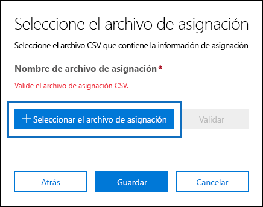
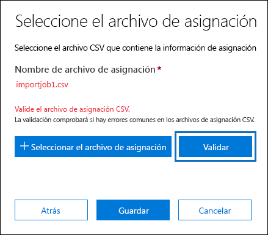
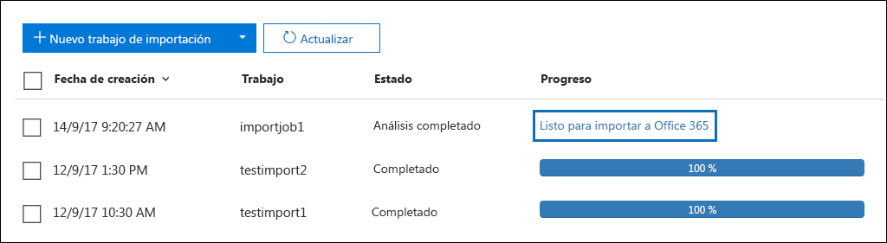
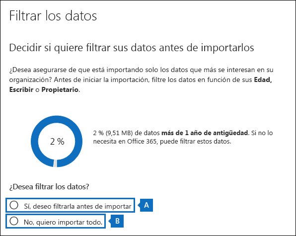
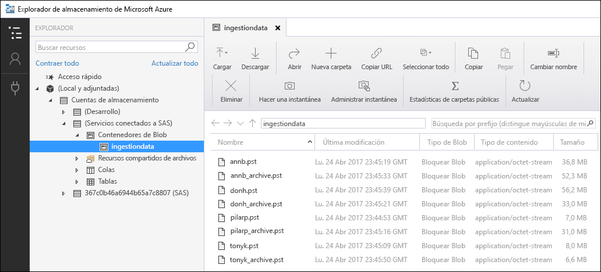
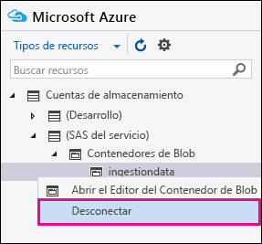

# <a name="use-drive-shipping-to-import-your-organizations-pst-files-to-office-365"></a>Usar el envío de unidades para importar los archivos PST de su organización a Office 365

**Este artículo está destinado a los administradores. ¿Está intentando importar archivos PST a su propio buzón? Consulte [importar el correo electrónico, los contactos y el calendario desde un archivo. pst de Outlook](https://go.microsoft.com/fwlink/p/?LinkID=785075)**
   
Usar el servicio de importación de Office 365 y dirigir el envío a los archivos PST de importación masiva a los buzones de usuario. «Envío de unidades» significa que los archivos PST se copian en una unidad de disco duro y se envía la unidad a Microsoft de forma física. Cuando Microsoft recibe el disco duro, el personal del centro de datos copia los datos de la unidad de disco duro a un área de almacenamiento en la nube de Microsoft. A continuación, tiene la oportunidad de recortar los datos PST que se importan a los buzones de correo de destino estableciendo filtros que controlan los datos que se importan. Después de iniciar el trabajo de importación, el servicio de importación importa los datos PST desde el área de almacenamiento a los buzones de usuario. Usar el envío de unidades para importar archivos PST a los buzones de usuario es una forma de migrar el correo electrónico de su organización a Office 365.
  
Estos son los pasos necesarios para usar el envío de unidades para importar archivos PST a los buzones de correo de Office 365:
  
[Paso 1: descargar la clave de almacenamiento seguro y la herramienta de importación de PST](#step-1-download-the-secure-storage-key-and-pst-import-tool)

[Paso 2: copiar los archivos PST en la unidad de disco duro](#step-2-copy-the-pst-files-to-the-hard-drive)

[Paso 3: crear el archivo de asignación de importaciones de PST](#step-3-create-the-pst-import-mapping-file)

[Paso 4: crear un trabajo de importación de PST en Office 365](#step-4-create-a-pst-import-job-in-office-365)

[Paso 5: enviar la unidad de disco duro a Microsoft](#step-5-ship-the-hard-drive-to-microsoft)

[Paso 6: filtrar los datos e iniciar el trabajo de importación de PST](#step-6-filter-data-and-start-the-pst-import-job)
  
> [!IMPORTANT]
> Debe realizar el paso 1 una vez para bajar la carga de la clave de almacenamiento seguro y la herramienta de importación. Después de realizar estos pasos, siga los pasos 2 a 6 cada vez que desee enviar una unidad de disco duro a Microsoft. 
  
Para conocer las preguntas más frecuentes sobre el uso del envío de unidades para importar archivos PST a Office 365, consulte [FAQ para usar el envío de unidades para importar archivos PST](faqimporting-pst-files-to-office-365.md#using-drive-shipping-to-import-pst-files). 
  
## <a name="before-you-begin"></a>Antes de empezar

- Debe tener asignado el rol importación o exportación de buzón de Exchange Online para importar archivos PST a los buzones de Office 365. Este rol no está asignado a ningún grupo de roles de Exchange Online de forma predeterminada. Puede agregar el rol Mailbox Import Export al grupo de roles Administración de la organización. También puede crear un grupo de roles, asignarle el rol Mailbox Import Export y agregarse a sí mismo como miembro. Para obtener más información, vea las secciones "Agregar un rol a un grupo de roles" o "Crear un grupo de roles" en [Administrar grupos de roles](https://go.microsoft.com/fwlink/p/?LinkId=730688).
    
    Además, para crear trabajos de importación en el Centro de seguridad y cumplimiento, debe cumplirse uno de estos requisitos:
    
  - Debe tener asignado el rol de los destinatarios de correo en Exchange Online. De forma predeterminada, este rol se asigna a los grupos de roles de administración de la organización y administración de destinatarios.
    
    O bien
    
  - Debe ser administrador global en su organización de Office 365. 
    
    > [!TIP]
    > Puede crear un nuevo grupo de roles en Exchange Online que está pensado específicamente para la importación de archivos PST a Office 365. Para obtener el nivel mínimo de privilegios necesarios para importar archivos PST, asigne los roles de importación y exportación de buzón y de destinatarios de correo al nuevo grupo de roles y, a continuación, agregue a los miembros. 
  
- Debe almacenar los archivos PST que desea copiar en una unidad de disco duro de un servidor de archivos o una carpeta compartida de la organización. En el paso 2, ejecute la herramienta de importación y exportación de Azure (herramienta waimportexport. exe) que copia los archivos PST que se almacenan en este servidor de archivos o carpeta compartida en la unidad de disco duro.

- Es posible que los archivos PST de gran tamaño afecten al rendimiento del proceso de importación de PST. Por lo tanto, se recomienda que cada archivo PST que copie en el disco duro en el paso 2 no supere los 20 GB.
    
- Con el servicio de importación de Office 365 solo se admiten las unidades de estado sólido de 2,5 pulgadas (SSDs) o las unidades de disco duro internas SATA II/III de 2,5 o de 3,5 pulgadas. Puede usar discos duros de hasta 10 TB. Para los trabajos de importación, se procesará solo el primer volumen de datos del disco duro. El volumen de datos debe tener el formato NTFS. Al copiar datos en una unidad de disco duro, puede conectarlos directamente mediante un conector SATA II/III de 2,5 pulgadas o de 2,5 pulgadas o de 3,5 pulgadas, o puede adjuntarlo de forma externa con un SSD de 2,5 pulgadas o un adaptador USB de 2,5 pulgadas o de 3,5 pulgadas SATA II/III.
    
    > [!IMPORTANT]
    > El Servicio de importación de Office 365 no admite los discos duros externos con un adaptador USB integrado. Además, no se puede usar un disco que esté dentro de la carcasa de un disco duro externo. No envíe discos duros externos. 
  
- La unidad de disco duro a la que copie los archivos PST debe estar cifrada con BitLocker. La herramienta WAImportExport.exe, ejecutada en el paso 2, le ayudará a configurar BitLocker. También genera una clave de cifrado de BitLocker que el personal del centro de datos de Microsoft usa para acceder a la unidad para cargar los archivos PST en el área de almacenamiento de Azure en la nube de Microsoft.
    
- El envío de unidades está disponible a través de un contrato de Microsoft Enterprise (EA). El envío de unidades no está disponible mediante un Contrato de productos y servicios de Microsoft (MPSA).
    
- El costo de la importación de archivos PST a Office 365 buzones con el envío de unidades es de $2 USD por GB de datos. Por ejemplo, si envía una unidad de disco duro que contiene 1000 GB (1 TB) de archivos PST, el costo es 2000 USD. Puede colaborar con un asociado para abonar la cuota de importación. Para obtener información sobre cómo buscar un asociado, consulte [Buscar un asociado o distribuidor de Office 365](https://go.microsoft.com/fwlink/p/?LinkId=785197).
    
- Usted o su organización debe tener una cuenta con FedEx o DHL. 
    
  - Las organizaciones de Estados Unidos, Brasil y Europa deben tener cuentas de FedEx.
    
  - Las organizaciones de Asia oriental, sudeste asiático, Japón, República de Corea y Australia deben tener cuentas de DHL.
    
    Microsoft usa (y cobra) esta cuenta para volver a devolver la unidad de disco duro.
    
- La unidad de disco duro que envía a Microsoft puede cruzar fronteras internacionales. En este caso, es responsable de garantizar que la unidad de disco duro y los datos que contiene se importan o exportan de acuerdo con la legislación aplicable. Antes de enviar una unidad de disco duro, póngase en contacto con sus asesores para comprobar que la unidad y los datos se puedan enviar de forma legal al centro de datos de Microsoft identificado. De este modo, se garantiza que Microsoft se encuentre en el momento oportuno.
    
- Este procedimiento implica copiar y guardar una clave de almacenamiento seguro y una clave de cifrado de BitLocker. Asegúrese de tomar precauciones para proteger estas claves de la misma manera que protegería las contraseñas u otra información relacionada con la seguridad. Por ejemplo, puede guardarlas en un documento de Microsoft Word protegido por contraseña o en una unidad USB cifrada. Consulte la sección [More Information](#more-information) para ver un ejemplo de estas claves. 
    
- Después de que los archivos PST se importan a un buzón de correo de Office 365, la configuración de espera de retención del buzón está activada durante un período de tiempo indefinido. Esto significa que la directiva de retención asignada al buzón no se procesará hasta que desactive la espera de retención o establezca una fecha para desactivar la retención. ¿Por qué lo hacemos? Si los mensajes importados a un buzón son antiguos, es posible que se eliminen de forma permanente, ya que su período de retención ha caducado en función de la configuración de retención establecida para el buzón. Al colocar el buzón en espera de retención, el propietario del buzón tiene tiempo para administrar estos mensajes recién importados o usted tendrá tiempo para cambiar la configuración de retención del buzón. Consulte la sección [más información](#more-information) para obtener sugerencias sobre cómo administrar la suspensión de la retención. 
    
- De forma predeterminada, el tamaño máximo de mensaje que puede recibir un buzón de Office 365 es de 35 MB. Esto se debe a que el valor predeterminado de la propiedad *MaxReceiveSize* de un buzón está establecido en 35 MB. Pero el límite de tamaño máximo de recepción de mensajes en Office 365 es de 150 MB. Por lo tanto, si importa un archivo PST que contiene un elemento superior a 35 MB, el servicio de importación de Office 365 cambiará automáticamente el valor de la propiedad *MaxReceiveSize* en el buzón de destino a 150 MB. Esto permite que se importen a buzones de usuario mensajes de hasta 150 MB. 
    
    > [!TIP]
    > Para identificar el tamaño de recepción de un buzón de correo, puede ejecutar este comando en PowerShell de Exchange Online: `Get-Mailbox <user mailbox> | FL MaxReceiveSize`. 
  
- Puede importar archivos PST a un buzón inactivo de Office 365. Para ello, debe especificar el GUID del buzón inactivo en el parámetro `Mailbox` del archivo de asignación de importación de PST. Consulte [paso 3: crear el archivo de asignación de importaciones de PST](#step-3-create-the-pst-import-mapping-file) para obtener más información. 
    
- En una implementación híbrida de Exchange, puede importar archivos PST a un buzón de archivo basado en la nube para un usuario cuyo buzón principal es local. Para ello, haga lo siguiente en el archivo de asignación de importación de PST:
    
  - Especifique la dirección de correo electrónico del buzón local del usuario en el parámetro `Mailbox`. 
    
  - Especifique el valor **TRUE** en el parámetro `IsArchive`. 
    
    Consulte [paso 3: crear el archivo de asignación de importaciones de PST](#step-3-create-the-pst-import-mapping-file) para obtener más información. 

## <a name="step-1-download-the-secure-storage-key-and-pst-import-tool"></a>Paso 1: descargar la clave de almacenamiento seguro y la herramienta de importación de PST

El primer paso consiste en descargar la clave de almacenamiento seguro y la herramienta, que se usan en el paso 2 para copiar los archivos PST en la unidad de disco duro.
  
> [!IMPORTANT]
> Tiene que usar la herramienta de importación/exportación de Azure versión 1 (WAimportExportV1) para importar archivos PST correctamente con el método de envío de unidad. La versión 2 de la herramienta de importación/exportación de Azure no es compatible y el uso de la misma provocará una preparación incorrecta del disco duro para el trabajo de importación. Asegúrese de descargar la herramienta de importación y exportación de Azure desde el centro de seguridad & cumplimiento siguiendo los procedimientos de este paso. 
  
1. Ve a [https://protection.office.com/](https://protection.office.com/) e inicie sesión con las credenciales de una cuenta de administrador en su organización de Office 365. 
    
2. En el panel izquierdo del Centro de seguridad y cumplimiento, haga clic en **gobernanza de información**\>** Importar **\>** archivos PST**.
    
    > [!NOTE]
    > Como se mencionó anteriormente, tiene que tener asignados los permisos adecuados para acceder a la página **importar** en el centro de seguridad & cumplimiento. 
  
3. En la página **Importar**, haga clic en  **Nuevo trabajo de importación**.
    
4. En el Asistente para importar trabajo, escriba un nombre para el trabajo de importación de PST y, a continuación, haga clic en **siguiente**. Use letras minúsculas, números, guiones y caracteres de subrayado. Las letras en mayúscula no se pueden usar ni se pueden incluir espacios en el nombre.
    
5. En la página **elegir tipo de trabajo de importación** , haga clic en **enviar discos duros a una de las ubicaciones físicas** y, a continuación, haga clic en **siguiente**.
    
    
  
6. En la página **Importar datos**, siga los dos pasos siguientes: 
    
    
  
    a. En el paso 2, haga clic en **Copiar la clave de almacenamiento seguro**. Cuando se muestre la clave de almacenamiento, haga clic en **copiar al portapapeles** y, a continuación, péguela y guárdela en un archivo para poder acceder a él más adelante.
    
    b. En el paso 3, **Descargue la herramienta de importación y exportación de Azure** para descargar e instalar la herramienta de importación y exportación (versión 1) de Azure.
    
    - En la ventana emergente, haga clic en **Guardar** \> y **Guardar como** para guardar el archivo WaImportExportV1. zip en una carpeta del equipo local. 
    
    - Extraiga el archivo WaImportExportV1. zip.
    
7. Haga clic en **Cancelar** para cerrar el asistente. 
    
    Al crear el trabajo de importación en el paso 4, regresa a la página **importar** en el centro de seguridad & cumplimiento. 

## <a name="step-2-copy-the-pst-files-to-the-hard-drive"></a>Paso 2: copiar los archivos PST en la unidad de disco duro

El paso siguiente es usar la herramienta herramienta waimportexport. exe para copiar los archivos PST en la unidad de disco duro. Esta herramienta cifra la unidad de disco duro con BitLocker, copia los archivos PST en la unidad de disco duro y crea un archivo de diario que almacena información sobre el proceso de copia. Para llevar a cabo este paso, los archivos PST tienen que estar ubicados en un recurso compartido de archivos o en un servidor de archivos de su organización. Esto se conoce como el directorio de origen en el siguiente procedimiento. 

 Como se indicó anteriormente, cada archivo PST que copie en la unidad de disco duro no debe superar los 20 GB. Los archivos PST con un tamaño superior a 20 GB pueden afectar al rendimiento del proceso de importación de PST que comience en el paso 6.
  
> [!IMPORTANT]
> Después de ejecutar por primera vez la herramienta WAImportExport.exe para una unidad de disco duro, tendrá que usar una sintaxis diferente cada vez que la use. Esta sintaxis se explica en el paso 4 de este procedimiento para copiar los archivos PST en la unidad de disco duro. 
  
1. Abra el símbolo del sistema del equipo local.
    
    > [!TIP]
    > Si ejecuta el símbolo del sistema como administrador (seleccionando "Ejecutar como administrador" al abrirlo), en la ventana del símbolo del sistema aparecerán mensajes de error que le pueden ayudar a solucionar los problemas que aparecen al ejecutar la herramienta WAImportExport.exe. 
  
2. Vaya al directorio en el que instaló la herramienta WAImportExport.exe en el paso 1.
    
3. Ejecute el siguiente comando la primera vez que use la herramienta WAImportExport.exe para copiar archivos PST en una unidad de disco duro.

    ```powershell
    WAImportExport.exe PrepImport /j:<Name of journal file> /t:<Drive letter> /id:<Name of session> /srcdir:<Location of PST files> /dstdir:<PST file path> /sk:<Storage account key> /blobtype:BlockBlob /encrypt /logdir:<Log file location>
    ```

    En la tabla siguiente se describen los parámetros y los valores requeridos.
    
    |**Parámetro**|**Descripción**|**Ejemplo**|
    |:-----|:-----|:-----|
    | `/j:` <br/> |Especifica el nombre del archivo de diario. Este archivo se guarda en la misma carpeta en la que se encuentra la herramienta WAImportExport.exe. Todas las unidades de disco duro que envíe a Microsoft deben tener un archivo de diario. Cada vez que ejecute la herramienta WAImportTool.exe para copiar archivos PST en una unidad de disco duro, la información se anexará al archivo de diario de esa unidad.  <br/> El personal del centro de datos de Microsoft usa la información del archivo de diario para asociar la unidad de disco duro con el trabajo de importación que ha creado en el paso 4 y para cargar los archivos PST en el área de almacenamiento de Azure en la nube de Microsoft.  <br/> | `/j:PSTHDD1.jrn` <br/> |
    | `/t:` <br/> |Especifica la letra de la unidad de disco duro cuando se conecta a su equipo local.  <br/> | `/t:h` <br/> |
    | `/id:` <br/> |Especifica el nombre de la sesión de copia. Cada vez que ejecuta la herramienta WAImportExport.exe para copiar los archivos en la unidad de disco duro, se define una sesión. Los archivos PST se copian en una carpeta cuyo nombre es el nombre de la sesión especificado por este parámetro.   <br/> | `/id:driveship1` <br/> |
    | `/srcdir:` <br/> |Especifica el directorio de origen de la organización que contiene los archivos PST que se copiarán durante la sesión. No olvide incluir el valor de este parámetro entre comillas dobles (" ").  <br/> | `/srcdir:"\\FILESERVER01\PSTs"` <br/> |
    | `/dstdir:` <br/> |Especifica el directorio de destino en el área de almacenamiento de Azure en la nube de Microsoft donde se cargarán los archivos PST. Debe usar el valor `ingestiondata/`. No olvide incluir el valor de este parámetro entre comillas dobles (" ").  <br/> Opcionalmente, también puede Agregar una ruta de acceso de archivo adicional al valor de este parámetro. Por ejemplo, puede usar la ruta de acceso al archivo del directorio de origen en la unidad de disco duro (convertida a un formato de dirección URL `/srcdir:` ), que se especifica en el parámetro. Por ejemplo, `\\FILESERVER01\PSTs` se cambia a `FILESERVER01/PSTs`. En este caso, aún debe incluir `ingestiondata` en la ruta de acceso al archivo. Por lo tanto, en este ejemplo, el `/dstdir:` valor del parámetro `"ingestiondata/FILESERVER01/PSTs"`sería.  <br/> Si tiene archivos PST con el mismo nombre de archivo, debería agregar la ruta de acceso de archivo adicional.  <br/> > [!NOTE]> si incluye el nombre de ruta opcional, el espacio de nombres de un archivo PST después de cargarlo en el área de almacenamiento de Azure incluye el nombre de ruta de usuario y el nombre del archivo PST; por ejemplo, `FILESERVER01/PSTs/annb.pst`. Si no incluye una ruta de ruta, el espacio de nombres es solo el nombre del archivo PST; por ejemplo `annb.pst`.           | `/dstdir:"ingestiondata/"` <br/> O bien  <br/>  `/dstdir:"ingestiondata/FILESERVER01/PSTs"` <br/> |
    | `/sk:` <br/> |Especifica la clave de la cuenta de almacenamiento que obtuvo en el paso 1. No olvide incluir el valor de este parámetro entre comillas dobles (" ").  <br/> | `"yaNIIs9Uy5g25Yoak+LlSHfqVBGOeNwjqtBEBGqRMoidq6/e5k/VPkjOXdDIXJHxHvNoNoFH5NcVUJXHwu9ZxQ=="` <br/> |
    | `/blobtype:` <br/> |Especifica el tipo de blobs en el área de almacenamiento de Azure en el que se van a importar los archivos PST. Para importar archivos PST, use el valor **BlockBlob**. Este parámetro es obligatorio.   <br/> | `/blobtype:BlockBlob` <br/> |
    | `/encrypt` <br/> |Este modificador activa BitLocker en la unidad de disco duro. Este parámetro es necesario la primera vez que ejecuta la herramienta WAImportExport.exe.  <br/> La clave de cifrado de BitLocker se copia en el archivo de diario y el archivo de registro que se `/logfile:` crea si se usa el parámetro. Como se ha explicado anteriormente, el archivo de diario se guarda en la misma carpeta en la que se encuentra la herramienta WAImportExport.exe.  <br/> | `/encrypt` <br/> |
    | `/logdir:` <br/> |Este parámetro opcional especifica una carpeta en la que se guardan los archivos de registro. Si no se especifica, los archivos de registro se guardan en la misma carpeta en la que se encuentra la herramienta herramienta waimportexport. exe. No olvide incluir el valor de este parámetro entre comillas dobles (" ").  <br/> | `/logdir:"c:\users\admin\desktop\PstImportLogs"` <br/> |
   
    A continuación se muestra un ejemplo de la sintaxis de la herramienta WAImportExport.exe, en el que se usan valores reales para cada parámetro:
    
    ```powershell
    WAImportExport.exe PrepImport /j:PSTHDD1.jrn /t:f /id:driveship1 /srcdir:"\\FILESERVER01\PSTs" /dstdir:"ingestiondata/" /sk:"yaNIIs9Uy5g25Yoak+LlSHfqVBGOeNwjqtBEBGqRMoidq6/e5k/VPkjOXdDIXJHxHvNoNoFH5NcVUJXHwu9ZxQ==" blobtype:BlockBlob /encrypt /logdir:"c:\users\admin\desktop\PstImportLogs"
    ```

    Después de ejecutar el comando, aparecen mensajes de estado en los que se muestra el progreso de la copia de los archivos PST en la unidad de disco duro. En un mensaje de estado final aparece el número total de archivos copiados correctamente. 
    
4. Ejecute este comando cada vez que ejecute la herramienta WAImportExport.ext para copiar los archivos PST en la misma unidad de disco duro.

    ```powershell
    WAImportExport.exe PrepImport /j:<Name of journal file> /id:<Name of new session> /srcdir:<Location of PST files> /dstdir:<PST file path> /blobtype:BlockBlob 
    ```

    A continuación se muestra un ejemplo de la sintaxis para ejecutar sesiones posteriores y copiar los archivos PST en la misma unidad de disco duro.  

    ```powershell
    WAImportExport.exe PrepImport /j:PSTHDD1.jrn /id:driveship2 /srcdir:"\\FILESERVER01\PSTs\SecondBatch" /dstdir:"ingestiondata/" /blobtype:BlockBlob
    ```

## <a name="step-3-create-the-pst-import-mapping-file"></a>Paso 3: crear el archivo de asignación de importaciones de PST

Después de que el personal de centro de datos de Microsoft cargue los archivos PST desde la unidad de disco duro al área de almacenamiento de Azure, el servicio de importación usará la información del archivo de asignación de importaciones de PST, que es un archivo de valores separados por comas (CSV), que especifica qué buzones de usuario el Los archivos PST se importan a. Este archivo CSV se enviará en el paso siguiente, cuando cree un trabajo de importación de archivos PST.
  
1. [Descargue una copia del archivo de asignación de importación de PST](https://go.microsoft.com/fwlink/p/?LinkId=544717).
    
2. Abra o guarde el archivo CSV en el equipo local. En el ejemplo siguiente se muestra un archivo de asignación de importaciones de archivos PST completado (que se abre en el Bloc de notas). Es mucho más fácil usar Microsoft Excel para editar el archivo CSV.

    ```text
    Workload,FilePath,Name,Mailbox,IsArchive,TargetRootFolder,ContentCodePage,SPFileContainer,SPManifestContainer,SPSiteUrl
    Exchange,FILESERVER01/PSTs,annb.pst,annb@contoso.onmicrosoft.com,FALSE,/,,,,
    Exchange,FILESERVER01/PSTs,annb_archive.pst,annb@contoso.onmicrosoft.com,TRUE,/ImportedPst,,,,
    Exchange,FILESERVER01/PSTs,donh.pst,donh@contoso.onmicrosoft.com,FALSE,/,,,,
    Exchange,FILESERVER01/PSTs,donh_archive.pst,donh@contoso.onmicrosoft.com,TRUE,/ImportedPst,,,,
    Exchange,FILESERVER01/PSTs,pilarp.pst,pilarp@contoso.onmicrosoft.com,FALSE,/,,,,
    Exchange,FILESERVER01/PSTs,pilarp_archive.pst,pilarp@contoso.onmicrosoft.com,TRUE,/ImportedPst,,,,
    Exchange,,tonyk.pst,tonyk@contoso.onmicrosoft.com,FALSE,/,,,,
    Exchange,,tonyk_archive.pst,tonyk@contoso.onmicrosoft.com,TRUE,,,,,
    Exchange,,zrinkam.pst,zrinkam@contoso.onmicrosoft.com,FALSE,/,,,,
    Exchange,,zrinkam_archive.pst,zrinkam@contoso.onmicrosoft.com,TRUE,,,,,
    ```

    En la primera fila (o la primera fila de encabezado) del archivo CSV aparecen los parámetros que usará el servicio de importación de PST para importar los archivos PST a los buzones de los usuarios. Los nombres de los parámetros están separados por comas. Cada fila situada debajo de la fila de encabezado representa los valores de parámetro para importar un archivo PST a un buzón específico. Necesita una fila para cada archivo PST que se copió en la unidad de disco duro. No olvide reemplazar los datos de los marcadores de posición del archivo de asignación por los datos reales.

    > [!NOTE]
    > No cambie nada en la fila de encabezado, ni siquiera los parámetros SharePoint; se ignorarán durante el proceso de importación de PST. 
  
3. Use la información de la tabla siguiente para rellenar el archivo CSV con la información necesaria.
    
    |**Parámetro**|**Descripción**|**Ejemplo**|
    |:-----|:-----|:-----|
    | `Workload` <br/> |Especifica el servicio de Office 365 en el que se importarán los datos. Use `Exchange` para importar archivos PST a los buzones de los usuarios.  <br/> | `Exchange` <br/> |
    | `FilePath` <br/> | Especifica la ubicación de la carpeta en el área de almacenamiento de Azure en la que se copiarán los archivos PST cuando se envíe la unidad de disco duro a Microsoft.  <br/>  La información que agregue en esta columna en el archivo CSV depende de lo que haya especificado en `/dstdir:` para el parámetro en el paso anterior. Si tiene subcarpetas en la ubicación de origen, el valor del `FilePath` parámetro debe contener la ruta de acceso relativa para la subcarpeta; por ejemplo,/Folder1/user1/.  <br/>  Si ha usado `/dstdir:"ingestiondata/"`, deje este parámetro en blanco en el archivo CSV.  <br/>  Si incluyó una ruta de directorio opcional para el valor del `/dstdir:` parámetro (por ejemplo, `/dstdir:"ingestiondata/FILESERVER01/PSTs"`y, a continuación, use ese directorio (no se incluye "ingestiondata") para este parámetro en el archivo CSV. El valor de este parámetro distingue mayúsculas de minúsculas.  <br/>  En cualquier caso, *no* incluya "ingestiondata" en el valor del parámetro `FilePath`. Deje este parámetro en blanco o especifique solo el directorio opcional.  <br/> > [!IMPORTANT]> el caso del nombre de la ruta de acceso del archivo debe coincidir con el que `/dstdir:` especificó en el parámetro del paso anterior. Por ejemplo, si ha usado `"ingestiondata/FILESERVER01/PSTs"` para el nombre de la subcarpeta en el paso anterior y, a `fileserver01/psts` continuación, `FilePath` se usa en el parámetro en el archivo CSV, se producirá un error en la importación del archivo pst. Asegúrese de usar las mismas mayúsculas y minúsculas en ambas instancias.           |(se deja en blanco)  <br/> O bien  <br/>  `FILESERVER01/PSTs` <br/> |
    | `Name` <br/> |Especifica el nombre del archivo PST que se importará al buzón del usuario. El valor de este parámetro distingue mayúsculas de minúsculas.  <br/> > [!IMPORTANT]> el caso del nombre de archivo PST en el archivo CSV debe ser el mismo que el archivo PST que se cargó en la ubicación de almacenamiento de Azure en el paso 2. Por ejemplo, si usa `annb.pst` en el parámetro `Name` del archivo CSV, pero el nombre del archivo PST real es `AnnB.pst`, se producirá un error en la importación de ese archivo PST. Asegúrese de que el nombre del PST en el archivo CSV use las mismas mayúsculas y minúsculas que el archivo PST real.           | `annb.pst` <br/> |
    | `Mailbox` <br/> |Especifica la dirección de correo electrónico del buzón en el que se importará el archivo PST. No puede especificar una carpeta pública porque el servicio de importación de PST no admite la importación de archivos PST a carpetas públicas.  <br/> Para importar un archivo PST a un buzón inactivo, tiene que especificar el GUID del buzón de correo de este parámetro. Para obtener este GUID, ejecute el siguiente comando de PowerShell en Exchange Online:  `Get-Mailbox <identity of inactive mailbox> -InactiveMailboxOnly | FL Guid` <br/> > [!NOTE]> a veces, puede tener varios buzones con la misma dirección de correo electrónico, donde un buzón es un buzón activo y el otro buzón está en un estado eliminado temporalmente (o inactivo). En estas situaciones, tiene que especificar el GUID del buzón de correo para identificar exclusivamente el buzón en el que se importa el archivo PST. Para obtener este GUID para los buzones activos, ejecute el siguiente comando de PowerShell: `Get-Mailbox <identity of active mailbox> | FL Guid`. Para obtener el GUID de los buzones eliminados temporalmente (o inactivos), ejecute este `Get-Mailbox <identity of soft-deleted or inactive mailbox> -SoftDeletedMailbox | FL Guid`comando:.           | `annb@contoso.onmicrosoft.com` <br/> O bien:  <br/>  `2d7a87fe-d6a2-40cc-8aff-1ebea80d4ae7` <br/> |
    | `IsArchive` <br/> | Especifica si se va a importar el archivo PST en el buzón de archivo del usuario. Hay dos opciones:  <br/> **False** Importa el archivo PST en el buzón de correo principal del usuario.  <br/> **True** Importa el archivo PST en el buzón de archivo del usuario. Esto supone que el [buzón de archivo del usuario está habilitado](enable-archive-mailboxes.md). Si establece este parámetro en `TRUE` y el buzón de archivo del usuario no está habilitado, se producirá un error en la importación para ese usuario. Si falla una importación para un usuario (porque su archivo no está habilitado y esta propiedad se establece en `TRUE`), los demás usuarios en el trabajo de importación no se verán afectados.  <br/>  Si deja este parámetro en blanco, el archivo PST se importa al buzón de correo principal del usuario.  <br/> **Nota**: para importar un archivo PST a un buzón de archivo basado en la nube para un usuario cuyo buzón de correo principal es local, solo tiene que especificar `TRUE` para este parámetro y especificar la dirección de correo electrónico del buzón local del usuario para el parámetro `Mailbox`.  <br/> | `FALSE` <br/> O bien  <br/>  `TRUE` <br/> |
    | `TargetRootFolder` <br/> | Especifica la carpeta en la que se importa el archivo PST.  <br/>  Si deja este parámetro en blanco, el archivo PST se importará a una nueva carpeta denominada **importada** que se encuentre en el nivel raíz del buzón de correo (el mismo nivel que la carpeta Bandeja de entrada y las otras carpetas de buzón de correo predeterminadas).  <br/>  Si especifica `/`, los elementos del archivo pst se importarán directamente en la carpeta Bandeja de entrada del usuario.  <br/>  Si especifica `/<foldername>`, los elementos del archivo pst se importarán a una carpeta llamada * \<NombreCarpeta\>*. Por ejemplo, si usa `/ImportedPst`, los elementos se importarán a una carpeta llamada **PST importados**. Esta carpeta estará ubicada en el buzón del usuario en el mismo nivel que la carpeta Bandeja de entrada.  <br/> |(se deja en blanco)  <br/> O bien  <br/>  `/` <br/> O bien  <br/>  `/ImportedPst` <br/> |
    | `ContentCodePage` <br/> |Este parámetro opcional especifica un valor numérico de la página de códigos que se usa para importar archivos PST en el formato de archivo ANSI. Este parámetro se usa para importar archivos PST de las organizaciones de chino, japonés y coreano, porque estos idiomas suelen usar un juego de caracteres doble byte (DBCS) para la codificación de caracteres. Si no se usa este parámetro para importar archivos PST de los idiomas que usan DBCS para los nombres de las carpetas de buzón, dichos nombres suelen ser incomprensibles después de la importación.  <br/> Para obtener una lista de los valores compatibles que se pueden usar para este parámetro, vea [Identificadores de página de códigos](https://go.microsoft.com/fwlink/p/?LinkId=328514).  <br/> > [!NOTE]> como se indicó anteriormente, este es un parámetro opcional y no es necesario incluirlo en el archivo CSV. También puede incluirlo y dejar el valor en blanco para una o varias filas.           |(se deja en blanco)  <br/> O bien  <br/>  `932` (que es el identificador de página de códigos para ANSI/OEM japonés)  <br/> |
    | `SPFileContainer` <br/> |Para la importación de archivos PST, deje este parámetro en blanco.  <br/> |No aplicable  <br/> |
    | `SPManifestContainer` <br/> |Para la importación de archivos PST, deje este parámetro en blanco.  <br/> |No aplicable  <br/> |
    | `SPSiteUrl` <br/> |Para la importación de archivos PST, deje este parámetro en blanco.  <br/> |No aplicable  <br/> |

## <a name="step-4-create-a-pst-import-job-in-office-365"></a>Paso 4: crear un trabajo de importación de PST en Office 365

El siguiente paso consiste en crear el trabajo de importación de PST en el servicio de importación de Office 365. Como se ha explicado anteriormente, envíe el archivo de asignación de importaciones de PST que creó en el paso 3. Después de crear el trabajo, el servicio de importación usará la información del archivo de asignación para importar los archivos PST al buzón de usuario especificado después de que se copien los archivos PST desde la unidad de disco duro al área de almacenamiento de Azure y cree e inicie el trabajo de importación.
  
1. Ve a [https://protection.office.com](https://protection.office.com) e inicie sesión con las credenciales de una cuenta de administrador en su organización de Office 365. 
    
2. En el panel izquierdo del Centro de seguridad y cumplimiento, haga clic en **gobernanza de información**\>** Importar **\>** archivos PST**.
    
3. En la página **Importar**, haga clic en  **Nuevo trabajo de importación**.
    
    > [!NOTE]
    > Como se mencionó anteriormente, tiene que tener asignados los permisos adecuados para acceder a la página **importar** en el centro de seguridad & cumplimiento. 
  
4. Escriba un nombre para el trabajo de importación de PST y haga clic en **Siguiente**. Use letras minúsculas, números, guiones y caracteres de subrayado. Las letras en mayúscula no se pueden usar ni se pueden incluir espacios en el nombre.
    
5. En la página **elegir tipo de trabajo de importación** , haga clic en **enviar discos duros a una de las ubicaciones físicas** y, a continuación, haga clic en **siguiente**.
    
    
  
6. En el paso 6, haga clic en las casillas de verificación **he preparado mis discos duros y tienen acceso a los archivos de diario de unidades necesarios** y **tengo acceso a los** archivos de asignación y, a continuación, haga clic en **siguiente**.
    
    
  
7. En la página **seleccionar el archivo de unidad** , haga clic en **Seleccionar archivo de unidad**y, a continuación, vaya a la misma carpeta en la que se encuentra la herramienta herramienta waimportexport. exe. En esta carpeta se copió el archivo de diario creado en el paso 2.
    
    
  
8. Seleccione el archivo de diario; por ejemplo, `PSTHDD1.jrn`.
    
    > [!TIP]
    > Cuando ejecutó la herramienta herramienta waimportexport. exe en el paso 2, el `/j:` parámetro especificó el nombre del archivo de diario. 
  
9. Una vez que el nombre del archivo de la unidad aparezca en **nombre de archivo**de la unidad, haga clic en **validar** para comprobar si hay errores en el archivo de la unidad. 
    
    
  
    El archivo de unidad tiene que validarse correctamente para crear un trabajo de importación de PST. Tenga en cuenta que el nombre del archivo se cambia a verde una vez que se ha validado correctamente. Si se produce un error de validación, haga clic en el vínculo **Ver registro**. Se abre un informe de errores de validación con un mensaje de error con información sobre el motivo del error. 
    
    > [!NOTE]
    > Debe agregar y validar un archivo de diario para cada unidad de disco duro que envíe a Microsoft. 
  
10. Después de agregar y validar un archivo de diario para cada unidad de disco duro que envíe a Microsoft, haga clic en **siguiente**.
    
11. Haga  agregar icono **Seleccione el archivo de asignación** para enviar el archivo de asignación de importaciones de PST que creó en el paso 3. 
    
    
  
12. Cuando el nombre del archivo CSV aparezca en **Asignación del nombre de archivo**, haga clic en **Validar** para comprobar si hay errores en el archivo CSV. 
    
    
  
    El archivo CSV debe estar validado correctamente para poder crear un trabajo de importación de PST. Tenga en cuenta que el nombre del archivo se cambia a verde una vez que se ha validado correctamente. Si se produce un error de validación, haga clic en el vínculo **Ver registro**. Se abre un informe de errores de validación, con un mensaje de error para cada fila del archivo que ha fallado. 
    
13. Una vez validado correctamente el archivo de asignación de PST, haga clic en **siguiente**.
    
14. En la página **proporcionar información de contacto** , escriba la información de contacto en las casillas correspondientes. 
    
    Se muestra la dirección de la ubicación de Microsoft a la que envía los discos duros. Esta dirección se genera automáticamente en función de la ubicación del centro de datos de Office 365. Copie esta dirección en un archivo o tome una captura de pantalla.
    
15. Lea el documento términos y condiciones, haga clic en la casilla y, a continuación, haga clic en **Guardar** para enviar el trabajo de importación. 
    
    Cuando el trabajo de importación se crea correctamente, se muestra una página de estado que explica los pasos siguientes del proceso de envío de la unidad.
    
16. En la página **importar archivos PST** , haga  actualizar icono **Actualizar** para mostrar el nuevo trabajo de importación de envío de unidades en la lista de trabajos de importación. El estado se establece en **Waiting para el número de seguimiento**. También puede hacer clic en el trabajo de importación para mostrar la página flotante de estado, que contiene información más detallada sobre el trabajo de importación.
 
## <a name="step-5-ship-the-hard-drive-to-microsoft"></a>Paso 5: enviar la unidad de disco duro a Microsoft

El paso siguiente es enviar la unidad de disco duro a Microsoft y, a continuación, proporcionar el número de seguimiento para el envío y devolver la información de envío del trabajo de envío de la unidad. Una vez que Microsoft recibe la unidad, tardará entre 7 y 10 días laborables en el personal del centro de datos para cargar los archivos PST en el área de almacenamiento de Azure de su organización.
  
> [!NOTE]
> Si no proporciona el número de seguimiento y la información de envío de devolución en los 14 días siguientes a la creación del trabajo de importación, el trabajo de importación expirará. Si esto ocurre, tendrá que crear un nuevo trabajo de importación de envío de unidad (vea el [paso 4: crear un trabajo de importación de PST en Office 365](#step-4-create-a-pst-import-job-in-office-365)) y volver a enviar el archivo de unidad y el archivo de asignación de importación de PST. 
  
### <a name="ship-the-hard-drive"></a>Enviar la unidad de disco duro

Tenga en cuenta lo siguiente a la hora de enviar las unidades de disco duro a Microsoft:
  
- No enviar el adaptador de SATA a USB; solo tiene que enviar la unidad de disco duro.
    
- Empaquete la unidad de disco duro correctamente (por ejemplo, use un envoltorio de plástico con burbujas o una bolsa antiestática).
    
- Seleccione la empresa de transporte que desee para enviar la unidad de disco duro a Microsoft.
    
- Envíe la unidad de disco duro a la dirección de la ubicación de Microsoft que aparecía al crear el trabajo de importación en el paso 4. No olvide incluir «Office 365 Import Service» en la dirección de envío.
    
- Después de enviar la unidad de disco duro, asegúrese de anotar el nombre del transportista y el número de seguimiento, que deberá especificar en el siguiente paso.
    
### <a name="enter-the-tracking-number-and-other-shipping-information"></a>Indicar el número de seguimiento y otros datos de envío

Cuando haya enviado la unidad de disco duro a Microsoft, lleve a cabo el procedimiento siguiente en la página Servicio de importación.
  
1. Ve a [https://protection.office.com](https://protection.office.com) e inicie sesión con las credenciales de una cuenta de administrador en su organización de Office 365. 
    
2. En el panel izquierdo, haga clic en Gobierno de la **información > importar > importar archivos PST**.
    
3. En la página **importar archivos PST** , haga clic en el trabajo del envío de unidad para el que desea especificar el número de seguimiento. 
    
4. En la página control flotante de estado, haga clic en **escribir número de seguimiento**.
    
5. Proporcione la siguiente información de envío:
    
1. **Operador de entrega** Escriba el nombre del transportista de entrega que usó para enviar la unidad de disco duro a Microsoft. 
    
2. **Número de seguimiento** Escriba el número de seguimiento del envío de la unidad de disco duro. 
    
3. **Número de cuenta del transportista de devolución** Escriba el número de cuenta de la organización para el transportista que aparece en **operador de devolución**. Microsoft usa (y cobra) esta cuenta para enviar la unidad de disco duro de vuelta. Las organizaciones de Estados Unidos y Europa deben tener una cuenta con FedEx. Las organizaciones de Asia y del resto del mundo deben tener una cuenta con DHL.
    
6. Haga clic en **Guardar** para guardar esta información del trabajo de importación. 
    
    En la página **importar archivos PST** , haga  actualizar icono **Actualizar** para actualizar la información de su trabajo de importación de envío de unidad. Observe que el estado ahora está establecido en **Unidades en tránsito**.

## <a name="step-6-filter-data-and-start-the-pst-import-job"></a>Paso 6: filtrar los datos e iniciar el trabajo de importación de PST

Una vez que Microsoft recibe la unidad de disco duro, el estado del trabajo de importación en la página **importar archivos PST** cambiará a las **unidades recibidas**. El personal del centro de datos usa la información del archivo de diario para cargar los archivos PST en el área de almacenamiento de Azure para su organización. En este momento, el estado cambia a **importar en curso**. Como se mencionó anteriormente, tardará entre 7 y 10 días laborables después de recibir la unidad de disco duro para cargar los archivos PST.
  
Una vez que se cargan los archivos PST en Azure, el estado cambia a **análisis en curso**. Esto indica que Office 365 está analizando los datos de los archivos PST (de forma segura y segura) para identificar la antigüedad de los elementos y los diferentes tipos de mensajes incluidos en los archivos PST. Cuando se completa el análisis y los datos están listos para importar, el estado del trabajo de importación cambia a **análisis completado**. En este punto, tiene la opción de importar todos los datos contenidos en los archivos PST o puede recortar los datos que se importan configurando filtros que controlan qué datos se importan.
  
1. Ve a [https://protection.office.com](https://protection.office.com) e inicie sesión con las credenciales de una cuenta de administrador en su organización de Office 365. 
    
2. En el panel izquierdo, haga clic en **información del gobierno** \> **** \> de información para importar **archivos PST de importación**.
    
3. En la página **importar archivos PST** , haga clic en **listo para importar a Office 365** para el trabajo de importación que ha creado en el paso 4. 
    
    
  
    Se muestra una página de control flotante con información sobre los archivos PST y otra información sobre el trabajo de importación.
    
4. Haga clic en **importar a Office 365**.
    
5. Se mostrará la página **Filtrar los datos**. Contiene las información sobre datos resultante del análisis realizado en los archivos PST por Office 365, incluida la antigüedad de los datos. En este momento, tiene la opción de filtrar los datos que se importarán o importar todos los datos tal como estén. 
    
    
  
6. Realice una de las acciones siguientes:
    
    A. Para recortar los datos que importa, haga clic en **Sí, quiero filtrarlos antes de importarlos**.
    
    Para obtener instrucciones detalladas paso a paso sobre cómo filtrar los datos en los archivos PST y, después, iniciar el trabajo de importación, vea [Filtrar datos al importar archivos PST a Office 365](filter-data-when-importing-pst-files.md).
    
    O bien
    
    B. Para importar todos los datos de los archivos PST, haga clic en **No, quiero importarlos todos** y en **Siguiente**.
    
7. Si ha elegido importar todos los datos, haga clic en **Importar datos** para iniciar el trabajo de importación. 
    
    El estado del trabajo de importación se muestra en la página **importar archivos PST** . Haga clic en el  **Actualizar** para actualizar la información de estado que se muestra en la columna **Estado**. Haga clic en el trabajo de importación para mostrar la página de control flotante de estado, donde se muestra la información de estado de cada archivo PST que se importa. Cuando se haya completado la importación y se hayan importado los archivos PST a los buzones de usuario, el estado cambiará a **completado**.

## <a name="view-a-list-of-the-pst-files-uploaded-to-office-365"></a>Ver una lista de los archivos PST cargados en Office 365

Puede instalar y usar el explorador de almacenamiento de Microsoft Azure (que es una herramienta de código abierto gratuita) para ver la lista de los archivos PST que cargamos (por el personal del centro de datos de Microsoft) en el área de almacenamiento de Azure de su organización. Puede hacerlo para comprobar que los archivos PST de las unidades de disco duro que envió a Microsoft se hayan cargado correctamente en el área de almacenamiento de Azure.
  
El Explorador de Microsoft Azure Storage está en versión preliminar.
  
 **Importante:** No puede usar el explorador de Azure Storage para cargar o modificar archivos PST. El único método admitido para importar archivos PST a Office 365 es usar AzCopy. Además, no puede eliminar archivos PST que haya cargado al blob de Azure. Si intenta eliminar un archivo PST, recibirá un error sobre el no tener los permisos necesarios. Todos los archivos PST se eliminan automáticamente del área de almacenamiento de Azure. Si no hay ningún trabajo de importación en curso, se eliminarán todos los archivos PST del contenedor * * ingestiondata * * 30 días después de la creación del trabajo de importación más reciente. 
  
Para instalar el Explorador de Azure Storage y conectarse al área de Azure Storage, haga lo siguiente:
  
1. Realice los siguientes pasos para obtener la dirección URL de la firma de acceso compartido (SAS) de su organización. Esta dirección URL es una combinación de la dirección URL de red para la ubicación de almacenamiento de Azure en la nube de Microsoft para su organización y una clave SAS. Esta clave le proporciona los permisos necesarios para obtener acceso a la ubicación de almacenamiento de Azure de su organización.
    
1. Ve a [https://protection.office.com/](https://protection.office.com/) e inicie sesión con las credenciales de una cuenta de administrador en su organización de Office 365. 
    
2. En el panel izquierdo del Centro de Seguridad y Cumplimiento, haga clic en **Gobernanza de la información > Importar > Importar archivos PST** .
    
3. En la página **Importar**, haga clic en  **Nuevo trabajo de importación**.
    
4. En el Asistente para importar trabajo, escriba un nombre para el trabajo de importación de PST y, a continuación, haga clic en **siguiente**. Use letras minúsculas, números, guiones y caracteres de subrayado. Las letras en mayúscula no se pueden usar ni se pueden incluir espacios en el nombre.
    
5. En la página **elegir tipo de trabajo de importación** , haga clic en **cargar los datos**y, a continuación, haga clic en **siguiente**.
    
6. En el paso 2, haga clic en **Mostrar dirección URL de carga en la red de SAS**.
    
7. Una vez mostrada la dirección URL, cópiela y guárdela en un archivo. Asegúrese de copiar toda la dirección URL.
    
    > [!IMPORTANT]
    > Asegúrese de tomar precauciones para proteger la URL de SAS. Esto lo puede usar cualquier usuario para tener acceso al área de almacenamiento de Azure de su organización. 
  
8. Haga clic en **Cancelar** para cerrar el Asistente para importación de trabajos. 
    
2. Descargue e instale la [herramienta Explorador de Microsoft Azure Storage](https://go.microsoft.com/fwlink/p/?LinkId=544842).
    
3. Inicie el Explorador de Microsoft Azure Storage, haga clic derecho en **Cuentas de almacenamiento** en el panel izquierdo y, después, haga clic en **Conectar con Azure Storage**.
    
    
  
4. Haga clic en **Usar un URI de Firma de acceso compartido (SAS) o cadena de conexión** y, luego, en **Siguiente**.
    
5. Haga clic en **usar un URI de SAS**, pegue la dirección URL de SAS que obtuvo en el paso 1 de la en el cuadro que se encuentra en **URI**y, a continuación, haga clic en **siguiente**.
    
6. En la página **Resumen de conexión**, puede revisar la información de conexión y, después, haga clic en **Conectar**.
    
    El contenedor **ingestiondata** está abierto. Contiene los archivos PST de la unidad de disco duro. El contenedor **ingestiondata** se encuentra en **Cuentas de almacenamiento** \> **(servicios vinculados de SAS)** \> **Contenedores de blob**.
    
    
  
7. Cuando termine de usar el Explorador de Microsoft Azure Storage, haga clic derecho en **ingestiondata** y, después, en **Desasociar** para desconectarse del área de Azure Storage. En caso contrario, recibirá un error la próxima vez que intente vincularse. 
    
    

## <a name="troubleshooting-tips"></a>Sugerencias para solucionar problemas

- **¿Qué sucede si se produce un error en el trabajo de importación debido a errores en el archivo de asignación CSV de importación de PST?** Si se produce un error en un trabajo de importación debido a errores en el archivo de asignación, no es necesario reenviar la unidad de disco duro a Microsoft para crear un trabajo de importación. Esto se debe a que los archivos PST de la unidad de disco duro que envió para el trabajo de importación de envío de unidades ya se han cargado en el área de almacenamiento de Azure para su organización. En este caso, solo tiene que corregir los errores en el archivo de asignación CSV de importación de PST y, a continuación, crear un nuevo trabajo de importación de carga de red y enviar el archivo de asignación. CSV revisado. Para crear e iniciar un nuevo trabajo de importación de carga de red, vea el [paso 5: crear un trabajo de importación de PST en office 365](use-network-upload-to-import-pst-files.md#step-5-create-a-pst-import-job-in-office-365) y [el paso 6: filtrar datos e iniciar el trabajo de importación de PST](use-network-upload-to-import-pst-files.md#step-6-filter-data-and-start-the-pst-import-job) en el tema sobre cómo usar la carga de red para importar archivos PST a Office 365. 
    
    > [!NOTE]
    > Para ayudarle a solucionar problemas del archivo de asignación CSV de importación de archivos PST, use la herramienta [Azure Storage Explorer](#view-a-list-of-the-pst-files-uploaded-to-office-365) para ver la estructura de carpetas en el contenedor **ingestiondata** de los archivos PST de la unidad de disco duro que se cargaron en el área de almacenamiento de Azure. Los errores de asignación de archivos normalmente se producen por un valor incorrecto en el parámetro FilePath. Este parámetro especifica la ubicación de un archivo PST en el área de almacenamiento de Azure. Vea la descripción del parámetro FilePath en la tabla en el [paso 3](#step-3-create-the-pst-import-mapping-file). Como se explicó anteriormente, el `/dstdir:` parámetro especificó la ubicación de los archivos PST en el área de almacenamiento de Azure cuando ejecutó la herramienta herramienta waimportexport. exe en el [paso 2](#step-2-copy-the-pst-files-to-the-hard-drive). 
  
## <a name="more-information"></a>Más información

- El envío de unidades es una forma eficaz de importar grandes cantidades de datos de mensajería de archivado a Office 365 para aprovechar las características de cumplimiento que están disponibles en la organización. Una vez que los datos de archivado se importan a los buzones de usuario, puede:
    
  - Habilite los [buzones de archivo](enable-archive-mailboxes.md) y [el archivado de expansión automática](enable-unlimited-archiving.md) para proporcionar a los usuarios más espacio de almacenamiento de buzones para los datos. 
    
  - Coloque los buzones en [retención por juicio](https://go.microsoft.com/fwlink/?linkid=856286) para conservar los datos. 
    
  - Use las [herramientas de exhibición](search-for-content.md) de documentos electrónicos de Microsoft para buscar los datos. 
    
  - Aplique [las directivas de retención de Office 365](retention-policies.md) para controlar el tiempo que se conservan los datos y las acciones que se deben tomar una vez que expire el período de retención. 
    
  - Busque eventos relacionados con estos datos en el [registro de auditoría de Office 365](search-the-audit-log-in-security-and-compliance.md) . 
    
  - Importar datos a [buzones inactivos](create-and-manage-inactive-mailboxes.md) para archivar datos con fines de cumplimiento. 
    
  - Proteger la organización frente a la [pérdida de datos](data-loss-prevention-policies.md) de información confidencial. 
    
- A continuación se muestra un ejemplo de la clave de la cuenta de almacenamiento seguro y una clave de cifrado de BitLocker. Este ejemplo también contiene la sintaxis del comando WAImportExport.exe que ejecutó para copiar los archivos PST en una unidad de disco duro. Asegúrese de tomar precauciones para protegerlos de la misma manera que protegería las contraseñas u otra información relacionada con la seguridad.
    

    ```text
    Secure storage account key: 

    yaNIIs9Uy5g25Yoak+LlSHfqVBGOeNwjqtBEBGqRMoidq6/e5k/VPkjOXdDIXJHxHvNoNoFH5NcVUJXHwu9ZxQ==

    BitLocker encryption key:

    397386-221353-718905-535249-156728-127017-683716-083391

  COMMAND SYNTAX

  First time:

  WAImportExport.exe PrepImport /j:<Name of journal file> /t:<Drive letter> /id:<Name of session> /srcdir:<Location of PST files> /dstdir:<PST file path> /sk:<Storage account key> /blobtype:BlockBlob /encrypt /logdir:<Log file location>

  Subsequent times:

  WAImportExport.exe PrepImport /j:<Name of journal file> /id:<Name of new session> /srcdir:<Location of PST files> /dstdir:<PST file path> /blobtype:BlockBlob 

  EXAMPLES

  First time:

  WAImportExport.exe PrepImport /j:PSTHDD1.jrn /t:f /id:driveship1 /srcdir:"\\FILESERVER1\PSTs" /dstdir:"ingestiondata/" /sk:"yaNIIs9Uy5g25Yoak+LlSHfqVBGOeNwjqtBEBGqRMoidq6/e5k/VPkjOXdDIXJHxHvNoNoFH5NcVUJXHwu9ZxQ==" /blobtype:BlockBlob /encrypt /logdir:"c:\users\admin\desktop\PstImportLogs"

  Subsequent times:

  WAImportExport.exe PrepImport /j:PSTHDD1.jrn /id:driveship2 /srcdir:"\\FILESERVER1\PSTs\SecondBatch" /dstdir:"ingestiondata/" /blobtype:BlockBlob
    ```

- Como se ha explicado anteriormente, el servicio de importación de Office 365 activa la opción de suspensión de retención (durante un período de tiempo indefinido) después de que los archivos PST se importan a un buzón. Esto significa que la propiedad *RentionHoldEnabled* se establece `True` en para que no se procese la Directiva de retención asignada al buzón. Esto da al propietario del buzón tiempo para administrar los mensajes recién importados evitando que una directiva de eliminación o de archivado elimine o archive los mensajes más antiguos. Estos son algunos pasos que puede seguir para administrar esta suspensión de retención: 
    
  - Después de un período de tiempo determinado, puede desactivar la suspensión de la retención mediante la `Set-Mailbox -RetentionHoldEnabled $false` ejecución del comando. Para obtener instrucciones, vea [Aplicar la suspensión de retención a un buzón](https://go.microsoft.com/fwlink/p/?LinkId=544749).
    
  - Puede configurar la suspensión de retención para que esté desactivada en una fecha futura. Para ello, ejecute el `Set-Mailbox -EndDateForRetentionHold <date>` comando. Por ejemplo, suponiendo que la fecha de hoy es el 1 de junio de 2016 y desea que la suspensión de la retención esté desactivada en 30 días, `Set-Mailbox -EndDateForRetentionHold 7/1/2016`ejecutaría el siguiente comando:. En este escenario, dejaría la propiedad *RentionHoldEnabled* establecida en *true*. Para obtener más información, vea [Set-Mailbox](https://go.microsoft.com/fwlink/p/?LinkId=150317).
    
  - Puede cambiar la configuración de la directiva de retención que está asignada a un buzón para que los elementos antiguos importados no se eliminen inmediatamente ni se muevan al buzón de archivo del usuario. Por ejemplo, podría alargar la antigüedad de la retención de una directiva de archivado o eliminación que se asigna al buzón. En este escenario, debe desactivar la suspensión de retención en el buzón de correo después de cambiar la configuración de la directiva de retención. Para obtener más información, vea [Configurar una directiva de archivado y eliminación de buzones en la organización de Office 365](set-up-an-archive-and-deletion-policy-for-mailboxes.md).
    

  

