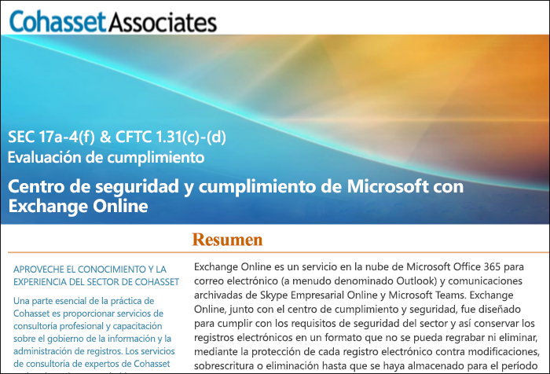

# Usar Exchange Online y el Centro de seguridad y cumplimiento para cumplir con la norma SEC 17a-4Use Exchange Online and the Security & Compliance Center to comply with SEC Rule 17a-4

>*[Instrucciones de licencias de Microsoft 365 para la seguridad y el cumplimiento](https://aka.ms/ComplianceSD).**[Microsoft 365 licensing guidance for security & compliance](https://aka.ms/ComplianceSD).*

If your organization needs to comply with regulatory standards for retaining your data, the Security & Compliance Center provides features to manage the lifecycle of your data in Exchange Online.If your organization needs to comply with regulatory standards for retaining your data, the Security & Compliance Center provides features to manage the lifecycle of your data in Exchange Online. This includes the ability to retain, audit, search, and export your data.This includes the ability to retain, audit, search, and export your data. These capabilities are sufficient to meet the needs of most organizations.These capabilities are sufficient to meet the needs of most organizations.

However, some organizations in highly regulated industries are subject to more stringent regulatory requirements.However, some organizations in highly regulated industries are subject to more stringent regulatory requirements. For example, financial institutions such as banks or broker dealers are subject to Rule 17a-4 issued by the Securities and Exchange Commission (SEC).For example, financial institutions such as banks or broker dealers are subject to Rule 17a-4 issued by the Securities and Exchange Commission (SEC). Rule 17a-4 has specific requirements for electronic data storage, including many aspects of record management, such as the duration, format, quality, availability, and accountability of records retention.Rule 17a-4 has specific requirements for electronic data storage, including many aspects of record management, such as the duration, format, quality, availability, and accountability of records retention.

Para que estas organizaciones puedan comprender mejor cómo aprovechar el Centro de seguridad y cumplimiento para adaptarse a sus obligaciones reglamentarias para Exchange Online, específicamente en relación con los requisitos de la norma 17a-4, publicamos una evaluación de forma conjunta con Cohasset Associates.To help these organizations better understand how the Security & Compliance Center can be leveraged to meet their regulatory obligations for Exchange Online, specifically in relation to Rule 17a-4 requirements, we have released an assessment in partnership with Cohasset Associates.

Cohasset validated that when Exchange Online and the Security & Compliance Center are configured as recommended, they meet the relevant storage requirements of CFTC Rule 1.31(c)-(d), FINRA Rule 4511, and SEC Rule 17a-4.Cohasset validated that when Exchange Online and the Security & Compliance Center are configured as recommended, they meet the relevant storage requirements of CFTC Rule 1.31(c)-(d), FINRA Rule 4511, and SEC Rule 17a-4. We targeted this set of rules because they represent the most prescriptive guidance globally for records retention for financial institutions.We targeted this set of rules because they represent the most prescriptive guidance globally for records retention for financial institutions.

## Descargar la evaluación de CohassetDownload the Cohasset assessment

Puede [descargar la evaluación de Cohasset aquí](https://servicetrust.microsoft.com/ViewPage/TrustDocuments?command=Download&downloadType=Document&downloadId=9fa8349d-a0c9-47d9-93ad-472aa0fa44ec&docTab=6d000410-c9e9-11e7-9a91-892aae8839ad_FAQ_and_White_Papers).You can [download the Cohasset assessment here](https://servicetrust.microsoft.com/ViewPage/TrustDocuments?command=Download&downloadType=Document&downloadId=9fa8349d-a0c9-47d9-93ad-472aa0fa44ec&docTab=6d000410-c9e9-11e7-9a91-892aae8839ad_FAQ_and_White_Papers).

## Esta evaluación es específica para Exchange Online.This assessment is specific to Exchange Online

Note that this assessment is specific to Exchange Online.Note that this assessment is specific to Exchange Online. The assessment does not include other Microsoft 365 services such as SharePoint Online or OneDrive for Business, although we are planning support for those services with respect to SEC 17a-4 in the future.The assessment does not include other Microsoft 365 services such as SharePoint Online or OneDrive for Business, although we are planning support for those services with respect to SEC 17a-4 in the future.

It's important to understand that Skype for Business and Teams also store data in Exchange Online.It's important to understand that Skype for Business and Teams also store data in Exchange Online. Therefore, the assessment does cover messages from Skype for Business and channel and chat messages from Teams.Therefore, the assessment does cover messages from Skype for Business and channel and chat messages from Teams.

## Usar Bloqueo de conservación es clave para la configuración recomendadaUsing Preservation Lock is key to the recommended configuration

Highly regulated industries are often required to store electronic communications to meet the WORM (write once, read many) requirement.Highly regulated industries are often required to store electronic communications to meet the WORM (write once, read many) requirement. The WORM requirement dictates a storage solution in which a record must be:The WORM requirement dictates a storage solution in which a record must be:

- Conservarse durante un período de retención que no puede acortarse, solo incrementarse.Retained for a required retention period that cannot be shortened, only increased.
- Ser inmutable, lo que significa que el registro no se puede sobrescribir, borrar ni modificar durante el período de retención necesario.Immutable, meaning that the record cannot be overwritten, erased, or altered during the required retention period.

In Exchange Online, when a [retention policy](retention.md) is applied to a user's mailbox, all the user's content will be retained based on the criteria of the policy.In Exchange Online, when a [retention policy](retention.md) is applied to a user's mailbox, all the user's content will be retained based on the criteria of the policy. In fact, if a user attempts to delete or modify an email, a copy of the email before the change is made will be preserved in a secure, hidden location in the user's mailbox.In fact, if a user attempts to delete or modify an email, a copy of the email before the change is made will be preserved in a secure, hidden location in the user's mailbox. Retention policies can help ensure that an organization retains electronic communications, but those policies can be modified.Retention policies can help ensure that an organization retains electronic communications, but those policies can be modified.

By placing a Preservation Lock on a retention policy, an organization ensures that the policy cannot be modified.By placing a Preservation Lock on a retention policy, an organization ensures that the policy cannot be modified. In fact, after a Preservation Lock is applied to a retention policy, the following actions are restricted:In fact, after a Preservation Lock is applied to a retention policy, the following actions are restricted:

- El período de retención de la directiva solo se puede incrementar, no se puede acortar.The retention period of the policy can only be increased, not shortened.
- Se pueden agregar usuarios a la directiva, pero no se puede quitar ningún usuario.Users can be added to the policy, but no user can be removed.
- Un administrador no puede eliminar una directiva de retención.The retention policy cannot be deleted by an administrator.

Bloqueo de conservación puede ayudarle a cumplir con los requisitos reglamentarios de SEC 17a-4.Preservation Lock can help you meet the SEC 17a-4 regulatory requirements.

## Configurar Bloqueo de conservaciónHow to set up Preservation Lock

Puede bloquear una directiva de retención con PowerShell.You can lock a retention policy by using PowerShell. Para más información, consulte [Usar el bloqueo de conservación para cumplir los requisitos normativos](retention.md#use-preservation-lock-to-comply-with-regulatory-requirements).For more information, see [Use Preservation Lock to comply with regulatory requirements](retention.md#use-preservation-lock-to-comply-with-regulatory-requirements).

## Limitaciones conocidasKnown limitations

Actualmente existen algunas limitaciones para Exchange Online:Currently, there are a few limitations for Exchange Online:

- Las comunicaciones en conversaciones no están disponibles para los mensajes de canal y de chat de Teams.Threaded communications are not available for Teams chat and channel messages.
- Los “me gusta” no se conservan para los mensajes de canal y de chat de Teams.Likes are not retained for Teams chat and channel messages.

> [!NOTE]
> La auditoría de nivel de elemento ya está disponible en los buzones de grupo de Microsoft 365.Item-level auditing is now available for Microsoft 365 group mailboxes. Para más información, consulte [Administrar auditoría del buzón](enable-mailbox-auditing.md)..For more information, see [Manage mailbox auditing](enable-mailbox-auditing.md).
