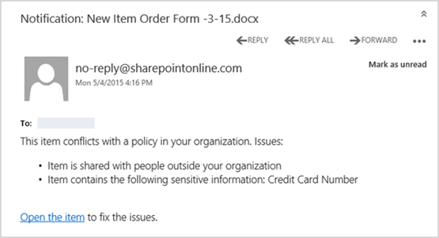
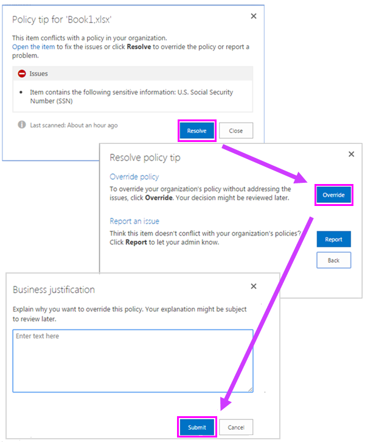

# Enviar notificaciones de email y mostrar sugerencias para directivas DLP

Puede usar una directiva de prevención de pérdida de datos (DLP) para identificar, supervisar y proteger información confidencial en Office 365. Desea que las personas de la organización que trabajan con esta información confidencial cumplan con sus directivas dlp, pero no desea bloquearlas innecesariamente para que no puedan realizar su trabajo. Aquí es donde pueden ayudarle las notificaciones de correo electrónico y las sugerencias de directivas.
  

  
Una sugerencia de directiva es una notificación o advertencia que aparece cuando alguien está trabajando con contenido que entra en conflicto con una directiva DLP, por ejemplo, contenido como un libro de Excel en un sitio de OneDrive para la Empresa que contiene información de identificación personal (PII) y se comparte con un usuario externo.
  
Puede usar notificaciones de correo electrónico y sugerencias de directivas para aumentar el conocimiento y ayudar a educar a los usuarios sobre las directivas de su organización. También puede dar a los usuarios la opción de invalidar la directiva, de modo que no se bloqueen si tienen una necesidad empresarial válida o si la directiva detecta un falso positivo.
  
En el Centro de cumplimiento, al crear una directiva DLP, puede configurar las notificaciones de usuario para:
  
- Envíe una notificación por correo electrónico a las personas que elija que describen el problema.
> [!NOTE]
> Los correos electrónicos de notificación se envían desprotegidos.
    
- Mostrar una sugerencia de directiva para el contenido que entre en conflicto con la directiva DLP:
    
  - Para el correo electrónico en Outlook en la web y Outlook 2013 y versiones posteriores, la sugerencia de directiva aparece en la parte superior de un mensaje encima de los destinatarios mientras se está compuesto el mensaje.
    
  - Para los documentos de una cuenta de OneDrive para la Empresa o un sitio de SharePoint Online, la sugerencia de directiva se indica mediante un icono de advertencia que aparece en el elemento. Para ver más información, puede seleccionar  un elemento y, a continuación, elegir el icono del panel Información en la esquina superior derecha de la página para  detalles. 
    
  - Para los documentos de Excel, PowerPoint y Word almacenados en un sitio de OneDrive para la Empresa o un sitio de SharePoint Online que se incluye en la directiva DLP, la sugerencia de directiva aparece en la barra de mensajes y en la vista Backstage ( **Información** del menú Archivo \> ).
    
## Agregar notificaciones de usuario a una directiva DLP

Al crear una directiva DLP, puede habilitar las **notificaciones de usuario**. Cuando las notificaciones de usuario están habilitadas, Microsoft 365 envía notificaciones por correo electrónico y sugerencias de directiva. Puede personalizar a quién se envían los correos electrónicos de notificación, el texto del correo electrónico y el texto de sugerencia de directiva.
  
1. Vaya a [https://protection.office.com](https://protection.office.com).
    
2. Inicie sesión con su cuenta profesional o educativa. Ahora está en el Centro de seguridad &amp; y cumplimiento.
    
3. En el Centro de seguridad y cumplimiento de la izquierda navegación Directiva de prevención &amp; \> de pérdida de \> **datos** \>  \> **+ Crear una directiva**.
    
    
  
4. Elija la plantilla de directiva DLP que protege los tipos de información confidencial que necesita \> **Next**.
    
    Para empezar con una plantilla vacía, elija **Custom** \> **Custom policy** \> **Next**.
    
5. Asigne a la directiva el nombre \> **Siguiente**.
    
6. Para elegir las ubicaciones que desea proteger la directiva DLP, realice una de las siguientes acciones:
    
   - Elija **Todas las ubicaciones en Office 365** \> **Next**.
    
   - Elija **Let me choose specific locations** \> **Next**.
    
   Para incluir o excluir una ubicación completa, como todos los  correos electrónicos de Exchange o todas las cuentas de OneDrive, active o apague el estado de esa ubicación. 
    
   Para incluir solo sitios específicos de SharePoint o cuentas de OneDrive, cambie el estado a on y, a continuación, haga clic en los vínculos en **Incluir** para elegir sitios o cuentas específicos.  
    
7. Elija **Usar configuración avanzada** \> **Siguiente**.
    
8. Elija **+ Nueva regla**.
    
9. En el editor de reglas, en **Notificaciones de usuario,** active el estado.
    
    

> [!NOTE]
> Las directivas DLP se aplican a todos los documentos que coinciden con la directiva, independientemente de si esos documentos son nuevos o existentes. Sin embargo, una notificación de correo electrónico solo se genera cuando el contenido nuevo coincide con una directiva DLP existente. El contenido existente está protegido, pero no generará una notificación de usuario por correo electrónico.
  
## Opciones para configurar las notificaciones de correo electrónico

Para cada regla en una directiva DLP, puede:
  
- Enviar la notificación a las personas que elija. Estas personas pueden ser el propietario del contenido, la persona que modificó por última vez el contenido, el propietario del sitio donde se almacena el contenido o un usuario específico.
    
- Personalice el texto que se incluye en la notificación mediante HTML o tokens. Vea la siguiente sección para obtener más información.
    
> [!NOTE]
>  Las notificaciones por correo electrónico solo se pueden enviar a destinatarios individuales, no a grupos o listas de distribución. Tenga en cuenta que solo el contenido nuevo desencadenará una notificación por correo electrónico. La edición del contenido existente desencadenará sugerencias de directiva, pero no una notificación por correo electrónico. 
  

  
### Notificación de correo electrónico predeterminada

Las notificaciones tienen una línea asunto que comienza con la acción realizada, como "Notificación", "Mensaje bloqueado" para correo electrónico o "Acceso bloqueado" para documentos. Si la notificación trata de un documento, el cuerpo del mensaje de notificación incluye un vínculo que le lleva al sitio donde se almacena el documento y abre la sugerencia de directiva para el documento, donde puede resolver cualquier problema (consulte la sección siguiente sobre sugerencias de directiva). Si la notificación trata de un mensaje, la notificación incluye como datos adjuntos el mensaje que coincide con una directiva DLP.
  

  
De forma predeterminada, las notificaciones muestran texto similar al siguiente para un elemento de un sitio. El texto de notificación se configura por separado para cada regla, por lo que el texto que se muestra es diferente en función de qué regla coincida.

|**Si la regla de directiva DLP hace esto...**|**A continuación, la notificación predeterminada para documentos de SharePoint o OneDrive para la Empresa indica esto...**|**A continuación, la notificación predeterminada para los mensajes de Outlook indica esto...**|
|:-----|:-----|:-----|
|Envía una notificación, pero no permite la invalidación    |Este elemento está en conflicto con una directiva de la organización.    |El mensaje de correo electrónico entra en conflicto con una directiva de la organización.    |
|Bloquea el acceso, envía una notificación y permite la invalidación    |Este elemento está en conflicto con una directiva de la organización. Si no resuelve este conflicto, es posible que se bloquee el acceso a este archivo.    |El mensaje de correo electrónico entra en conflicto con una directiva de la organización. El mensaje no se entregó a todos los destinatarios.    |
|Bloquea el acceso y envía una notificación    |Este elemento está en conflicto con una directiva de la organización. El acceso a este elemento está bloqueado para todos excepto para su propietario, para el último usuario que lo modificó y para el administrador de la colección de sitios primaria.    |El mensaje de correo electrónico entra en conflicto con una directiva de la organización. El mensaje no se entregó a todos los destinatarios.    |
   
### Notificación de correo electrónico personalizada

Puede crear una notificación de correo electrónico personalizada en lugar de enviar la notificación de correo electrónico predeterminada a los usuarios finales o administradores. La notificación de correo electrónico personalizada admite HTML y tiene un límite de 5.000 caracteres. Puede usar HTML para incluir imágenes, formato y otras marcas en la notificación.
  
También puedes usar los siguientes tokens para personalizar la notificación por correo electrónico. Estos tokens son variables que se reemplazan por información específica en la notificación que se envía.

|**Token**|**Descripción**|
|:-----|:-----|
|%%AppliedActions%%    |Acciones aplicadas al contenido.    |
|%%ContentURL%%    |Dirección URL del documento en el sitio de SharePoint Online o en el sitio de OneDrive para la Empresa.    |
|%%MatchedConditions%%    |Las condiciones que coincidieron con el contenido. Use este token para informar a los usuarios de posibles problemas con el contenido.    |
   

  
## Opciones para configurar sugerencias de directiva

Para cada regla de una directiva DLP, puede configurar sugerencias de directiva para:
  
- Simplemente notificar a la persona que el contenido está en conflicto con una directiva DLP, de modo que pueda tomar medidas para resolver el conflicto. Puede usar el texto predeterminado (consulte las tablas siguientes) o escribir texto personalizado sobre las directivas específicas de su organización.
    
- Permitir que la persona invalide la directiva DLP. Opcionalmente, puede:
    
  - Requerir que la persona escriba una justificación del negocio para invalidar la directiva. Esta información se registra y se puede ver  en los informes DLP en la sección Informes del Centro de &amp; cumplimiento de seguridad. 
    
  - Permitir que la persona informe de un falso positivo e invalide la directiva DLP. Esta información también se registra en los informes, de modo que puede usar falsos positivos para ajustar las reglas.
    

  
Por ejemplo, puede que se aplique una directiva DLP a sitios de OneDrive para la Empresa que detecte información de identificación personal (PII) y esta directiva tenga tres reglas:
  
1. Primera regla: Si se detectan menos de cinco instancias de información confidencial en un documento y el documento se comparte con personas que pertenecen a la organización, la acción **Enviar una notificación** muestra una sugerencia de directiva. Para obtener sugerencias de directiva, no se necesitan opciones de invalidación porque esta regla simplemente está avisando a las personas y no está bloqueando el acceso. 
    
2. Segunda regla: Si se detectan más de cinco instancias de información confidencial en un documento y el documento se comparte con personas que pertenecen a la organización, la acción **Bloquear el acceso al contenido** restringe los permisos para el archivo y la acción **Enviar una notificación** permite a los usuarios invalidar las acciones de esta regla proporcionando una justificación del negocio. La empresa de su organización a veces requiere que las personas internas compartan datos de PII y no desea que la directiva DLP bloquee este trabajo. 
    
3. Tercera regla: Si se detectan más de cinco instancias de información confidencial en un documento y el documento se comparte con personas externas a la organización, la acción **Bloquear el acceso al contenido** restringe los permisos para el archivo y la acción **Enviar una notificación** no permite a los usuarios invalidar las acciones de esta regla porque la información se comparte con el exterior. Bajo ninguna circunstancia las personas de su organización pueden compartir datos de PII fuera de la organización. 
    
Estos son algunos puntos clave para comprender el uso de una sugerencia de directiva para invalidar una regla:
  
- La opción para invalidar es por regla y invalida todas las acciones de la regla (excepto el envío de una notificación, que no se puede invalidar).
    
- Es posible que el contenido coincida con varias reglas de una directiva DLP, pero solo se mostrará la sugerencia de directiva de la regla más restrictiva y de mayor prioridad. Por ejemplo, una sugerencia de directiva de una regla que bloquea el acceso al contenido se mostrará por encima de una sugerencia de directiva de una regla que simplemente envía una notificación. Esto impide que las personas vean una cascada de sugerencias de directiva.
    
- Si las sugerencias de directiva en la regla más restrictiva permite que los usuarios invaliden la regla, la invalidación de esta regla invalida también otras reglas que coinciden con el contenido.
    
## Sugerencias de directiva en sitios de OneDrive para la Empresa y sitios de SharePoint Online

Cuando un documento de un sitio de OneDrive para la Empresa o un sitio de SharePoint Online coincide con una regla de una directiva DLP y esa regla usa sugerencias de directiva, las sugerencias de directiva muestran iconos especiales en el documento:
  
1. Si la regla envía una notificación sobre el archivo, aparece el icono de advertencia.
    
2. Si la regla bloquea el acceso al documento, aparece el icono de bloqueado.
    
   
  
Para realizar acciones en un documento, puede seleccionar un elemento para elegir el icono del panel Información en la esquina superior derecha de la página para abrir el panel de detalles Ver sugerencia \>   de \> **directiva**.
  
La sugerencia de directiva enumera los problemas con el contenido y, si las sugerencias de directiva están configuradas con estas opciones, puede elegir **Resolver** y luego **Invalidar** la sugerencia de directiva o **Informar** de un falso positivo. 
  

  

  
Las directivas DLP se sincronizan con los sitios y el contenido se evalúa con estas periódicamente y de forma asincrónica, por lo que puede haber un breve retraso entre el momento en que se crea la directiva DLP y el momento en que se empiezan a ver sugerencias de directiva. Puede haber un retraso similar desde el momento en que se invalida o resuelve una sugerencia de directiva hasta cuando desaparece el icono en el documento en el sitio.
  
### Texto predeterminado para las sugerencias de directiva en los sitios

De forma predeterminada, las sugerencias de directiva muestran texto similar al siguiente para un elemento de un sitio. El texto de notificación se configura por separado para cada regla, por lo que el texto que se muestra es diferente en función de qué regla coincida.

|**Si la regla de directiva DLP hace esto...**|**La sugerencia de directiva predeterminada indica lo siguiente...**|
|:-----|:-----|
|Envía una notificación, pero no permite la invalidación    |Este elemento está en conflicto con una directiva de la organización.    |
|Bloquea el acceso, envía una notificación y permite la invalidación    |Este elemento está en conflicto con una directiva de la organización. Si no resuelve este conflicto, es posible que se bloquee el acceso a este archivo.    |
|Bloquea el acceso y envía una notificación    |Este elemento está en conflicto con una directiva de la organización. El acceso a este elemento está bloqueado para todos excepto para su propietario, para el último usuario que lo modificó y para el administrador de la colección de sitios primaria.    |
   
### Texto personalizado para sugerencias de directiva en sitios

Puede personalizar el texto de las sugerencias de directiva de forma independiente de la notificación por correo electrónico. A diferencia del texto personalizado para las notificaciones de correo electrónico (vea la sección anterior), el texto personalizado de las sugerencias de directiva no acepta HTML ni tokens. En su lugar, el texto personalizado para las sugerencias de directiva es texto sin formato solo con un límite de 256 caracteres.
  
## Sugerencias de directiva en Outlook en la web y Outlook 2013 y versiones posteriores

Al redactar un nuevo correo electrónico en Outlook en la web y Outlook 2013 y versiones posteriores, verá una sugerencia de directiva si agrega contenido que coincida con una regla en una directiva DLP y esa regla usa sugerencias de directiva. La sugerencia de directiva aparece en la parte superior del mensaje, encima de los destinatarios, mientras se está compuesto el mensaje.
  

  
Las sugerencias de directiva funcionan si la información confidencial aparece en el cuerpo del mensaje, en la línea de asunto o incluso en los datos adjuntos de un mensaje, como se muestra aquí.
  

  
Si las sugerencias de directiva están configuradas para permitir la invalidación, puede elegir **Mostrar** invalidación de detalles escriba una justificación empresarial o \>  \> informe de una invalidación de falso \> **positivo**.
  

  

  
Tenga en cuenta que al agregar información confidencial a un correo electrónico, puede haber latencia entre el momento en que se agrega la información confidencial y cuando aparece la sugerencia de directiva.

### Outlook 2013 y versiones posteriores admiten mostrar sugerencias de directivas solo para algunas condiciones

Actualmente, Outlook 2013 y versiones posteriores admiten mostrar sugerencias de directiva solo para estas condiciones:

- El contenido contiene
- El contenido se comparte

Tenga en cuenta que las excepciones se consideran condiciones y todas estas condiciones funcionan en Outlook, donde coincidirán con el contenido y aplicarán acciones de protección en el contenido. Pero aún no se admite mostrar sugerencias de directiva a los usuarios. 
  
### Sugerencias de directivas en el Centro de administración de Exchange frente al Centro de &amp; cumplimiento de seguridad

Las sugerencias de directivas pueden funcionar con directivas DLP y reglas de flujo de correo creadas en el Centro de administración de Exchange o con directivas DLP creadas en el Centro de cumplimiento de seguridad, pero no &amp; ambas. Esto se debe a que estas directivas se almacenan en distintas ubicaciones, pero las sugerencias de directivas solo pueden dibujarse desde una sola ubicación.
  
Si ha configurado sugerencias de directivas en el Centro de administración de Exchange, las sugerencias de directiva que configure en el Centro de cumplimiento de seguridad no aparecerán para los usuarios de Outlook en la web y Outlook 2013 y posterior hasta que desactive las sugerencias en el Centro de administración de &amp; Exchange. Esto garantiza que las reglas de flujo de correo de Exchange actuales (también conocidas como reglas de transporte) seguirán funcionando hasta que elija cambiar al Centro de &amp; cumplimiento de seguridad.
  
Tenga en cuenta que, aunque las sugerencias de directivas solo pueden dibujarse desde una única ubicación, las notificaciones de correo electrónico siempre se envían, incluso si usa directivas DLP en el Centro de seguridad y el Centro de administración &amp; de Exchange.
  
### Texto predeterminado para sugerencias de directiva en el correo electrónico

De forma predeterminada, las sugerencias de directiva muestran texto similar al siguiente para el correo electrónico.

|**Si la regla de directiva DLP hace esto...**|**La sugerencia de directiva predeterminada indica lo siguiente...**|
|:-----|:-----|
|Envía una notificación, pero no permite la invalidación    |El correo electrónico entra en conflicto con una directiva de la organización.    |
|Bloquea el acceso, envía una notificación y permite la invalidación    |El correo electrónico entra en conflicto con una directiva de la organización.    |
|Bloquea el acceso y envía una notificación    |El correo electrónico entra en conflicto con una directiva de la organización.    |
   
## Sugerencias de directivas en Excel, PowerPoint y Word

Cuando las personas trabajan con contenido confidencial en las versiones de escritorio de Excel, PowerPoint y Word, las sugerencias de directiva pueden notificarles en tiempo real que el contenido entra en conflicto con una directiva DLP. Esto requiere lo siguiente:
  
- El documento de Office está almacenado en un sitio de OneDrive para la Empresa o sitio de SharePoint Online.
    
- El sitio se incluye en una directiva DLP que está configurada para usar sugerencias de directiva.
    
Los programas de escritorio de Office sincronizan automáticamente directivas DLP directamente desde Office 365 y, a continuación, analizan los documentos para asegurarse de que no entren en conflicto con las directivas DLP y mostrar sugerencias de directiva en tiempo real.

> [!NOTE]
> Las aplicaciones de escritorio de Office analizan documentos por sí mismas para determinar si se deben mostrar sugerencias de directiva DLP; no muestran sugerencias de directiva que los sitios de SharePoint Online o los sitios de OneDrive para la Empresa que ya han determinado deben mostrarse en un archivo. Como resultado, es posible que no siempre vea una sugerencia de directiva DLP en las aplicaciones de escritorio que verá en los sitios de SharePoint Online o en los sitios de OneDrive para la Empresa. En cambio, las aplicaciones de Office en la web solo muestran sugerencias de directiva DLP que los sitios de SharePoint Online o los sitios de OneDrive para la Empresa ya han determinado que deben mostrarse.
  
En función de cómo se configuran las sugerencias de directiva en la directiva DLP, los usuarios pueden optar por simplemente ignorar la sugerencia de directiva, invalidar la directiva con o sin una justificación del negocio o informar de un falso positivo.
  
Las sugerencias de directiva aparecen en la barra de mensajes.
  

  
Y las sugerencias de directiva también aparecen en la vista Backstage (en la pestaña **Archivo**). 
  

  
Si las sugerencias de directiva en la directiva DLP se configuran con estas opciones, puede elegir **Resolver** para **Invalidar** una sugerencia de directiva o **Informar** de un falso positivo. 
  

  
En cada uno de estos programas de escritorio de Office, los usuarios pueden optar por desactivar las sugerencias de directiva. Si se desactivan, las sugerencias de directiva que son notificaciones simples no aparecerán en la barra de mensajes o la vista Backstage (en la pestaña **Archivo**). Sin embargo, seguirán apareciendo las sugerencias de directiva de bloqueo e invalidación y seguirán recibiendo la notificación por correo electrónico. Además, la desactivación de las sugerencias de directiva no exime al documento de las directivas DLP que se le han aplicado. 
  
### Texto predeterminado para las sugerencias de directiva en Excel 2016, PowerPoint 2016 y Word 2016

De forma predeterminada, las sugerencias de directiva muestran texto similar para lo siguiente en la barra de mensajes y vista Backstage de un documento abierto. El texto de notificación se configura por separado para cada regla, por lo que el texto que se muestra es diferente en función de qué regla coincida.

|**Si la regla de directiva DLP hace esto...**|**La sugerencia de directiva predeterminada indica lo siguiente...**|
|:-----|:-----|
|Envía una notificación, pero no permite la invalidación    |Este archivo está en conflicto con una directiva de la organización. Vaya al **menú** Archivo para obtener más información.    |
|Bloquea el acceso, envía una notificación y permite la invalidación    |Este archivo está en conflicto con una directiva de la organización. Si no resuelve este conflicto, es posible que se bloquee el acceso a este archivo. Vaya al **menú** Archivo para obtener más información.    |
|Bloquea el acceso y envía una notificación    |Este archivo está en conflicto con una directiva de la organización. Si no resuelve este conflicto, es posible que se bloquee el acceso a este archivo. Vaya al **menú** Archivo para obtener más información.    |
   
### Texto personalizado para sugerencias de directivas en Excel, PowerPoint y Word

Puede personalizar el texto de las sugerencias de directiva de forma independiente de la notificación por correo electrónico. A diferencia del texto personalizado para las notificaciones de correo electrónico (vea la sección anterior), el texto personalizado de las sugerencias de directiva no acepta HTML ni tokens. En su lugar, el texto personalizado para las sugerencias de directiva es texto sin formato solo con un límite de 256 caracteres.
  
## Más información

- [Obtenga más información acerca de la prevención de pérdida de datos](dlp-learn-about-dlp.md)    
- [Crear una directiva DLP desde una plantilla](create-a-dlp-policy-from-a-template.md)
- [Condiciones de directiva DLP, excepciones y acciones (versión preliminar)](./dlp-microsoft-teams.md) 
- [Crear una directiva DLP para proteger documentos con FCI u otras propiedades](protect-documents-that-have-fci-or-other-properties.md)
- [Qué incluyen las plantillas de directiva DLP](what-the-dlp-policy-templates-include.md)
- [Definiciones de entidad de tipos de información confidencial](sensitive-information-type-entity-definitions.md)