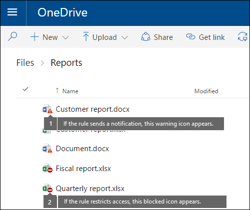

# Enviar notificaciones de email y mostrar sugerencias para directivas DLP

Puede usar una directiva de prevención de pérdida de datos (DLP) de Microsoft Purview para identificar, supervisar y proteger la información confidencial en Office 365. Quiere que las personas de su organización que trabajan con esta información confidencial sigan siendo compatibles con las directivas DLP, pero no quiere impedirles innecesariamente que realicen su trabajo. Aquí es donde pueden ayudarle las notificaciones de correo electrónico y las sugerencias de directivas.

Al crear una directiva DLP, puede configurar las notificaciones de usuario para:

- Envíe una notificación por correo electrónico a las personas que elija que describan el problema.

- Mostrar una sugerencia de directiva para el contenido que entra en conflicto con la directiva DLP:

  - Para el correo electrónico en Outlook en la Web y Outlook 2013 y versiones posteriores, la sugerencia de directiva aparece en la parte superior de un mensaje encima de los destinatarios mientras se está redactando el mensaje.

  - Para los documentos de una cuenta de OneDrive para la Empresa o un sitio de SharePoint Online, la sugerencia de directiva se indica mediante un icono de advertencia que aparece en el elemento. Para ver más información, puede seleccionar un elemento y, a continuación, elegir el icono del panel **Información de información** en la esquina superior derecha de la página para abrir el panel de detalles.

  - En el caso de los documentos de Excel, PowerPoint y Word almacenados en un sitio OneDrive para la Empresa o en un sitio de SharePoint Online que se incluye en la directiva DLP, la sugerencia de directiva aparece en la barra de mensajes y en la vista Backstage (**Información** del menú \>**Archivo**).

[!INCLUDE [purview-preview](../includes/purview-preview.md)]

## Adición de notificaciones de usuario a una directiva DLP

Al crear una directiva DLP, puede habilitar **las notificaciones de usuario**. Cuando las notificaciones de usuario están habilitadas, Microsoft 365 envía notificaciones por correo electrónico y sugerencias de directiva. Puede personalizar a quién se envían los correos electrónicos de notificación, el texto del correo electrónico y el texto de la sugerencia de directiva.

1. Vaya al [portal de cumplimiento de Microsoft Purview](https://compliance.microsoft.com/permissions).

2. Inicie sesión con su cuenta profesional o educativa.

3. En el portal de cumplimiento Microsoft Purview \> navegación \> izquierdo **Directiva de** \> **prevención** \> de pérdida de datos **+ Crear una directiva**.

4. Elija la plantilla de directiva DLP que protege los tipos de información confidencial que desea proteger \> **a continuación**.

    Para empezar con una plantilla vacía, elija **Directiva** **personalizada personalizada** \> \> **Siguiente**.

5. Asigne a la directiva \> el nombre **Siguiente**.

6. Para elegir las ubicaciones que quiere que proteja la directiva DLP, realice una de las siguientes acciones:

   - Elija **Todas las ubicaciones de Office 365** \> **Siguiente**.

   - Elija **Permitirme elegir ubicaciones** \> específicas **Siguiente**.

   Para incluir o excluir una ubicación completa, como todos los correos electrónicos de Exchange o todas las cuentas de OneDrive, active o desactive el **estado** de esa ubicación.

   Para incluir solo sitios de SharePoint específicos o cuentas de OneDrive, cambie el **estado** a activado y, a continuación, haga clic en los vínculos de **Incluir** para elegir sitios o cuentas específicos.

7. Elija **Usar configuración** \> avanzada **Siguiente**.

8. Elija **+ Nueva regla**.

9. En el editor de reglas, en **Notificaciones de usuario**, active el estado.

    

> [!NOTE]
> Los correos electrónicos de notificación se envían desprotegidos.

## Opciones para configurar las notificaciones de correo electrónico

Para cada regla en una directiva DLP, puede:

- Send the notification to the people you choose. These people can include the owner of the content, the person who last modified the content, the owner of the site where the content is stored, or a specific user.

- Personalice el texto que se incluye en la notificación mediante HTML o tokens. Vea la siguiente sección para obtener más información.

> [!NOTE]
>
> - Email notificaciones solo se pueden enviar a destinatarios individuales, no a grupos o listas de distribución.
> - Tenga en cuenta que solo el contenido nuevo desencadenará una notificación por correo electrónico. La edición del contenido existente desencadenará sugerencias de directiva, pero no notificaciones por correo electrónico.
> - Los remitentes externos reciben solo una notificación templatized sin detalles completos para evitar cualquier pérdida no intencionada de información sobre la configuración de la directiva.

### Notificación de correo electrónico predeterminada

Las notificaciones tienen una línea de asunto que comienza con la acción realizada, como "Notificación", "Mensaje bloqueado" para correo electrónico o "Acceso bloqueado" para documentos. Si la notificación se trata de un documento, el cuerpo del mensaje de notificación incluye un vínculo que le lleva al sitio donde se almacena el documento y abre la sugerencia de directiva del documento, donde puede resolver cualquier problema (consulte la sección siguiente sobre sugerencias de directiva). Si la notificación trata de un mensaje, la notificación incluye como datos adjuntos el mensaje que coincide con una directiva DLP.

By default, notifications display text similar to the following for an item on a site. The notification text is configured separately for each rule, so the text that's displayed differs depending on which rule is matched.

|Si la regla de directiva DLP hace esto...|A continuación, la notificación predeterminada para SharePoint o OneDrive para la Empresa documentos indica esto...|A continuación, la notificación predeterminada para los mensajes de Outlook indica esto...|
|---|---|---|
|Envía una notificación, pero no permite la invalidación.|Este elemento está en conflicto con una directiva de la organización.|El mensaje de correo electrónico entra en conflicto con una directiva de su organización.|
|Bloquea el acceso, envía una notificación y permite la invalidación|Este elemento está en conflicto con una directiva de la organización. Si no resuelve este conflicto, es posible que se bloquee el acceso a este archivo.|El mensaje de correo electrónico entra en conflicto con una directiva de su organización. El mensaje no se entregó a todos los destinatarios.|
|Bloquea el acceso y envía una notificación|This item conflicts with a policy in your organization. Access to this item is blocked for everyone except its owner, last modifier, and the primary site collection administrator.|El mensaje de correo electrónico entra en conflicto con una directiva de su organización. El mensaje no se entregó a todos los destinatarios.|

### Notificación por correo electrónico personalizada

Puede crear una notificación de correo electrónico personalizada en lugar de enviar la notificación por correo electrónico predeterminada a los usuarios finales o administradores. La notificación de correo electrónico personalizada admite HTML y tiene un límite de 5000 caracteres. Puede usar HTML para incluir imágenes, formato y otras marcas en la notificación.

También puede usar los siguientes tokens para personalizar la notificación por correo electrónico. Estos tokens son variables que se reemplazan por información específica en la notificación que se envía.

|Token|Description|
|---|---|
|%%AppliedActions%%|Acciones aplicadas al contenido.|
|%%ContentURL%%|Dirección URL del documento en el sitio de SharePoint Online o OneDrive para la Empresa sitio.|
|%%MatchedConditions%%|Condiciones que coincidían con el contenido. Use este token para informar a los usuarios de posibles problemas con el contenido.|
|%%BlockedMessageInfo%%|Detalles del mensaje que se bloqueó. Use este token para informar a los usuarios de los detalles del mensaje que se bloqueó.|

## Opciones para configurar sugerencias de directiva

Para cada regla de una directiva DLP, puede configurar sugerencias de directiva para:

- Simplemente notificar a la persona que el contenido está en conflicto con una directiva DLP, de modo que pueda tomar medidas para resolver el conflicto. Puede usar el texto predeterminado (consulte las tablas siguientes) o escribir texto personalizado sobre las directivas específicas de su organización.

- Permitir que la persona invalide la directiva DLP. Opcionalmente, puede:

  - Requerir que la persona escriba una justificación del negocio para invalidar la directiva. Esta información se registra y puede verla en los informes DLP de la sección **Informes** del portal.

  - Allow the person to report a false positive and override the DLP policy. This information is also logged for reporting, so that you can use false positives to fine tune your rules.

Por ejemplo, puede tener una directiva DLP aplicada a sitios de OneDrive para la Empresa que detecta información de identificación personal (PII) y esta directiva tiene tres reglas:

1. First rule: If fewer than five instances of this sensitive information are detected in a document, and the document is shared with people inside the organization, the **Send a notification** action displays a policy tip. For policy tips, no override options are necessary because this rule is simply notifying people and not blocking access.

2. Segunda regla: Si se detectan más de cinco instancias de información confidencial en un documento y el documento se comparte con personas que pertenecen a la organización, la acción **Bloquear el acceso al contenido** restringe los permisos para el archivo y la acción **Enviar una notificación** permite a los usuarios invalidar las acciones de esta regla proporcionando una justificación del negocio. La empresa de su organización a veces requiere que los usuarios internos compartan datos de PII y no quiere que la directiva DLP bloquee este trabajo.

3. Third rule: If greater than five instances of this sensitive information are detected in a document, and the document is shared with people outside the organization, the **Block access to content** action restricts the permissions for the file, and the **Send a notification** action does not allow people to override the actions in this rule because the information is shared externally. Under no circumstances should people in your organization be allowed to share PII data outside the organization.

### Compatibilidad con invalidación de usuario

Estos son algunos puntos clave para comprender el uso de una sugerencia de directiva para invalidar una regla:

- La opción para invalidar es por regla y invalida todas las acciones de la regla (excepto el envío de una notificación, que no se puede invalidar).

- Es posible que el contenido coincida con varias reglas de una directiva DLP, pero solo se mostrará la sugerencia de directiva de la regla más restrictiva y de mayor prioridad. Por ejemplo, una sugerencia de directiva de una regla que bloquea el acceso al contenido se mostrará por encima de una sugerencia de directiva de una regla que simplemente envía una notificación. Esto impide que las personas vean una cascada de sugerencias de directiva.

- Si las sugerencias de directiva en la regla más restrictiva permite que los usuarios invaliden la regla, la invalidación de esta regla invalida también otras reglas que coinciden con el contenido.

- Si la acción NotifyAllowOverride se establece con WithoutJustification o WithJustification o FalsePositives, asegúrese de que BlockAccess esté establecido en true y que BlockAccessScope tenga el valor adecuado. De lo contrario, aparecerá una sugerencia de directiva, pero el usuario no encontrará una opción para invalidar el correo electrónico con justificación.

#### Disponibilidad de invalidación

|Regla de notificación |Acción Notificar/Bloquear  |Invalidación disponible  |Requerir justificación  |
|---------|---------|---------|---------|
|Solo notificar     |Notificar         |No         |No         |
|Notify + AllowOverride     |Notificar         |No         |No         |
|Notify + AllowOverride + False positive     |Notificar         |No         |No         |
|Notificar + AllowOverride + Con justificación     |Notificar         |No         |No         |
|Notificar + AllowOverride + Falso positivo + Sin justificación    |Notificar         |No         |No         |
|Notificar + AllowOverride + Falso positivo + Con justificación     |Notificar         |No         |No         |
|Notificar y bloquear     |Bloquear         |No         |No         |
|Notify + Block + AllowOverride     |Bloquear         |Yes         |No         |
|Notify + Block + AllowOverride + False positive     |Bloquear         |Yes         |No         |
|Notificar + Bloquear + AllowOverride + Con justificación     |Bloquear         |Sí         |Sí         |
|Notificar + Bloquear + AllowOverride + Falso positivo + Sin justificación     |Bloquear         |Yes         |No         |
|Notificar + Bloquear + AllowOverride + Falso positivo + Con justificación     |Bloquear         |Sí         |Sí         |

## Sugerencias de directiva en sitios de OneDrive para la Empresa y sitios de SharePoint Online

Cuando un documento de un sitio de OneDrive para la Empresa o un sitio de SharePoint Online coincide con una regla de una directiva DLP y esa regla usa sugerencias de directiva, las sugerencias de directiva muestran iconos especiales en el documento:

1. Si la regla envía una notificación sobre el archivo, aparece el icono de advertencia.

2. Si la regla bloquea el acceso al documento, aparece el icono de bloqueado.

   

Para realizar acciones en un documento, puede seleccionar un elemento \> y elegir el icono del panel **Información** en la esquina superior derecha de la página para abrir el panel \> de detalles **Ver sugerencia de directiva**.

La sugerencia de directiva enumera los problemas con el contenido y, si las sugerencias de directiva están configuradas con estas opciones, puede elegir **Resolver** y luego **Invalidar** la sugerencia de directiva o **Informar** de un falso positivo.

DLP policies are synced to sites and contented is evaluated against them periodically and asynchronously, so there may be a short delay between the time you create the DLP policy and the time you begin to see policy tips. There may be a similar delay from when you resolve or override a policy tip to when the icon on the document on the site goes away.

### Texto predeterminado para las sugerencias de directiva en los sitios

By default, policy tips display text similar to the following for an item on a site. The notification text is configured separately for each rule, so the text that's displayed differs depending on which rule is matched.

|Si la regla de directiva DLP hace esto...|A continuación, la sugerencia de directiva predeterminada indica esto...|
|---|---|
|Envía una notificación, pero no permite la invalidación.|Este elemento está en conflicto con una directiva de la organización.|
|Bloquea el acceso, envía una notificación y permite la invalidación|Este elemento está en conflicto con una directiva de la organización. Si no resuelve este conflicto, es posible que se bloquee el acceso a este archivo.|
|Bloquea el acceso y envía una notificación|This item conflicts with a policy in your organization. Access to this item is blocked for everyone except its owner, last modifier, and the primary site collection administrator.|

### Texto personalizado para sugerencias de directiva en sitios

Puede personalizar el texto para sugerencias de directivas por separado de la notificación por correo electrónico. A diferencia del texto personalizado para las notificaciones por correo electrónico (consulte la sección anterior), el texto personalizado para sugerencias de directiva no acepta HTML ni tokens. En su lugar, el texto personalizado para sugerencias de directiva es texto sin formato solo con un límite de 256 caracteres.

## Sugerencias de directiva en Outlook en la Web y Outlook 2013 y versiones posteriores

Al redactar un nuevo correo electrónico en Outlook en la Web y Outlook 2013 y versiones posteriores, verá una sugerencia de directiva si agrega contenido que coincida con una regla en una directiva DLP y esa regla usa sugerencias de directiva. La sugerencia de directiva aparece en la parte superior del mensaje, encima de los destinatarios, mientras se está redactando el mensaje.

Las sugerencias de directiva funcionan si la información confidencial aparece en el cuerpo del mensaje, la línea del asunto o incluso los datos adjuntos de un mensaje, como se muestra aquí.

Si las sugerencias de directiva están configuradas para permitir la invalidación, puede elegir Mostrar **invalidación** \> **de detalles** \> escriba una justificación empresarial o notificar una **invalidación de falsos positivos**\>.

Tenga en cuenta que, al agregar información confidencial a un correo electrónico, puede haber latencia entre el momento en que se agrega la información confidencial y el momento en que aparece la sugerencia de directiva. Cuando los correos electrónicos se cifran con Cifrado de mensajes de Microsoft Purview y la directiva usada para detectarlos usa la sugerencia de directiva de condición de cifrado de detección no aparecerá.

### Outlook 2013 y versiones posteriores admiten la presentación de sugerencias de directiva solo para algunas condiciones

Actualmente, Outlook 2013 y versiones posteriores solo admite la presentación de sugerencias de directiva para estas condiciones:

- El contenido contiene
- El contenido se comparte

Tenga en cuenta que las excepciones se consideran condiciones y todas estas condiciones funcionan en Outlook, donde coincidirán con el contenido y aplicarán acciones de protección en el contenido. Pero todavía no se admite mostrar sugerencias de directiva a los usuarios. 

> [!NOTE]
> Outlook no admite la presentación de sugerencias de directiva para una directiva DLP que se aplica a un grupo de distribución dinámico o a grupos de seguridad no habilitados para correo electrónico. 

### Sugerencias de directiva en el Centro de administración de Exchange frente al portal de cumplimiento de Microsoft Purview

Las sugerencias de directivas pueden funcionar con directivas DLP y reglas de flujo de correo creadas en el <a href="https://go.microsoft.com/fwlink/p/?linkid=2059104" target="_blank">Centro de administración de Exchange</a> o con directivas DLP creadas en el portal de cumplimiento, pero no con ambas. Esto se debe a que estas directivas se almacenan en ubicaciones diferentes, pero las sugerencias de directiva solo pueden extraerse de una sola ubicación.

Si ha configurado sugerencias de directiva en el Centro de administración de Exchange, las sugerencias de directiva que configure en el portal de cumplimiento no aparecerán en Outlook en la Web y Outlook 2013 y versiones posteriores hasta que desactive las sugerencias en el Centro de administración de Exchange. Esto garantiza que las reglas de flujo de correo de Exchange actuales (también conocidas como reglas de transporte) seguirán funcionando hasta que decida cambiar al portal de cumplimiento.

Tenga en cuenta que, aunque las sugerencias de directiva solo se pueden dibujar desde una sola ubicación, siempre se envían notificaciones por correo electrónico, incluso si usa directivas DLP en el portal de cumplimiento y en el Centro de administración de Exchange.

### Texto predeterminado para sugerencias de directiva en el correo electrónico

De forma predeterminada, las sugerencias de directiva muestran texto similar al siguiente para el correo electrónico.

|Si la regla de directiva DLP hace esto...|A continuación, la sugerencia de directiva predeterminada indica esto...|
|---|---|
|Envía una notificación, pero no permite la invalidación.|El correo electrónico entra en conflicto con una directiva de su organización.|
|Bloquea el acceso, envía una notificación y permite la invalidación|El correo electrónico entra en conflicto con una directiva de su organización.|
|Bloquea el acceso y envía una notificación|El correo electrónico entra en conflicto con una directiva de su organización.|

## Sugerencias de directiva en Excel, PowerPoint y Word

Cuando los usuarios trabajan con contenido confidencial en las versiones de escritorio de Excel, PowerPoint y Word, las sugerencias de directiva pueden notificarles en tiempo real que el contenido entra en conflicto con una directiva DLP. Esto requiere lo siguiente:

- El documento de Office está almacenado en un sitio de OneDrive para la Empresa o sitio de SharePoint Online.

- El sitio se incluye en una directiva DLP configurada para usar sugerencias de directiva.

Los programas de escritorio de Office sincronizan automáticamente las directivas DLP directamente desde Office 365 y, a continuación, examinan los documentos para asegurarse de que no entran en conflicto con las directivas DLP y muestran sugerencias de directivas en tiempo real.

> [!NOTE]
> Las aplicaciones de escritorio de Office examinan los documentos para determinar si se deben mostrar sugerencias de directiva DLP; no muestran sugerencias de directiva que los sitios de SharePoint Online o los sitios de OneDrive para la Empresa ya han determinado deben mostrarse en un archivo. Como resultado, es posible que no siempre vea una sugerencia de directiva DLP en las aplicaciones de escritorio que ve en los sitios de SharePoint Online o OneDrive para la Empresa sitios. Por el contrario, las aplicaciones de Office en la web solo muestran sugerencias de directiva DLP que los sitios de SharePoint Online o OneDrive para la Empresa sitios ya han determinado deben mostrarse.

En función de cómo se configuran las sugerencias de directiva en la directiva DLP, los usuarios pueden optar por simplemente ignorar la sugerencia de directiva, invalidar la directiva con o sin una justificación del negocio o informar de un falso positivo.

Las sugerencias de directiva aparecen en la barra de mensajes.

Y las sugerencias de directiva también aparecen en la vista Backstage (en la pestaña **Archivo**).

Si las sugerencias de directiva en la directiva DLP se configuran con estas opciones, puede elegir **Resolver** para **Invalidar** una sugerencia de directiva o **Informar** de un falso positivo.

En cada uno de estos programas de escritorio de Office, los usuarios pueden optar por desactivar las sugerencias de directiva. Si se desactivan, las sugerencias de directiva que son notificaciones simples no aparecerán en la barra de mensajes o la vista Backstage (en la pestaña **Archivo**). Sin embargo, seguirán apareciendo las sugerencias de directiva de bloqueo e invalidación y seguirán recibiendo la notificación por correo electrónico. Además, la desactivación de las sugerencias de directiva no exime al documento de las directivas DLP que se le han aplicado.

### Texto predeterminado para las sugerencias de directiva en Excel 2016, PowerPoint 2016 y Word 2016

By default, policy tips display text similar to the following on the Message Bar and Backstage view of an open document. The notification text is configured separately for each rule, so the text that's displayed differs depending on which rule is matched.

|Si la regla de directiva DLP hace esto...|A continuación, la sugerencia de directiva predeterminada indica esto...|
|---|---|
|Envía una notificación, pero no permite la invalidación.|Este archivo está en conflicto con una directiva de la organización. Vaya al menú **Archivo** para obtener más información.|
|Bloquea el acceso, envía una notificación y permite la invalidación|Este archivo está en conflicto con una directiva de la organización. Si no resuelve este conflicto, es posible que se bloquee el acceso a este archivo. Vaya al menú **Archivo** para obtener más información.|
|Bloquea el acceso y envía una notificación|Este archivo está en conflicto con una directiva de la organización. Si no resuelve este conflicto, es posible que se bloquee el acceso a este archivo. Vaya al menú **Archivo** para obtener más información.|

### Texto personalizado para sugerencias de directiva en Excel, PowerPoint y Word

Puede personalizar el texto para sugerencias de directivas por separado de la notificación por correo electrónico. A diferencia del texto personalizado para las notificaciones por correo electrónico (consulte la sección anterior), el texto personalizado para sugerencias de directiva no acepta HTML ni tokens. En su lugar, el texto personalizado para sugerencias de directiva es texto sin formato solo con un límite de 256 caracteres.

## Más información

- [Obtenga más información acerca de la prevención de pérdida de datos](dlp-learn-about-dlp.md)
- [Crear una directiva DLP a partir de una plantilla](create-a-dlp-policy-from-a-template.md)
- [Condiciones, excepciones y acciones de directiva DLP (versión preliminar)](./dlp-microsoft-teams.md)
- [Crear una directiva DLP para proteger documentos con FCI u otras propiedades](protect-documents-that-have-fci-or-other-properties.md)
- [Qué incluyen las plantillas de directiva DLP](what-the-dlp-policy-templates-include.md)
- [Definiciones de entidad de tipos de información confidencial](sensitive-information-type-entity-definitions.md)
