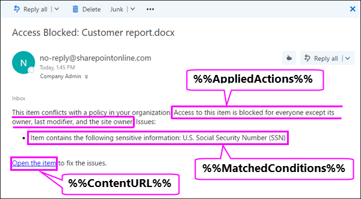

# Enviar notificaciones de email y mostrar sugerencias para directivas DLPSend email notifications and show policy tips for DLP policies

Puede usar una directiva de prevención de pérdida de datos (DLP) para identificar, supervisar y proteger información confidencial en Office 365.You can use a data loss prevention (DLP) policy to identify, monitor, and protect sensitive information across Office 365. Desea que las personas de la organización que trabajan con esta información confidencial cumplan con sus directivas dlp, pero no desea bloquearlas innecesariamente para que no puedan realizar su trabajo.You want people in your organization who work with this sensitive information to stay compliant with your DLP policies, but you don't want to block them unnecessarily from getting their work done. Aquí es donde pueden ayudarle las notificaciones de correo electrónico y las sugerencias de directivas.This is where email notifications and policy tips can help.
  

  
Una sugerencia de directiva es una notificación o advertencia que aparece cuando alguien está trabajando con contenido que entra en conflicto con una directiva DLP( por ejemplo, contenido como un libro de Excel en un sitio de OneDrive para la Empresa que contiene información de identificación personal (PII) y se comparte con un usuario externo.A policy tip is a notification or warning that appears when someone is working with content that conflicts with a DLP policy—for example, content like an Excel workbook on a OneDrive for Business site that contains personally identifiable information (PII) and is shared with an external user.
  
Puede usar notificaciones de correo electrónico y sugerencias de directivas para aumentar el conocimiento y ayudar a educar a los usuarios sobre las directivas de su organización.You can use email notifications and policy tips to increase awareness and help educate people about your organization's policies. También puede dar a los usuarios la opción de invalidar la directiva, de modo que no se bloqueen si tienen una necesidad empresarial válida o si la directiva detecta un falso positivo.You can also give people the option to override the policy, so that they're not blocked if they have a valid business need or if the policy is detecting a false positive.
  
En el Centro de &amp; cumplimiento de seguridad, al crear una directiva DLP, puede configurar las notificaciones de usuario para:In the Security &amp; Compliance Center, when you create a DLP policy, you can configure the user notifications to:
  
- Envíe una notificación por correo electrónico a las personas que elija que describen el problema.Send an email notification to the people you choose that describes the issue.
    
- Mostrar una sugerencia de directiva para el contenido que entre en conflicto con la directiva DLP:Display a policy tip for content that conflicts with the DLP policy:
    
  - Para el correo Outlook en la web y Outlook 2013 y versiones posteriores, la sugerencia de directiva aparece en la parte superior de un mensaje encima de los destinatarios mientras se está compuesto el mensaje.For email in Outlook on the web and Outlook 2013 and later, the policy tip appears at the top of a message above the recipients while the message is being composed.
    
  - Para los documentos de OneDrive para la Empresa cuenta o SharePoint sitio en línea, la sugerencia de directiva se indica mediante un icono de advertencia que aparece en el elemento.For documents in a OneDrive for Business account or SharePoint Online site, the policy tip is indicated by a warning icon that appears on the item. Para ver más información, puede seleccionar  un elemento y, a continuación, elegir el icono del panel Información en la esquina superior derecha de la página para  detalles.To view more information, you can select an item and then choose **Information**  in the upper-right corner of the page to open the details pane. 
    
  - Para los documentos Excel, PowerPoint y Word almacenados en un sitio de OneDrive para la Empresa o en un sitio de SharePoint Online que se incluye en la directiva DLP, la sugerencia de directiva aparece en la barra de mensajes y en la vista Backstage ( **Información** del menú Archivo \> ).For Excel, PowerPoint, and Word documents that are stored on a OneDrive for Business site or SharePoint Online site that's included in the DLP policy, the policy tip appears on the Message Bar and the Backstage view ( **File** menu \> **Info**).
    
## Agregar notificaciones de usuario a una directiva DLPAdd user notifications to a DLP policy

Al crear una directiva DLP, puede habilitar las **notificaciones de usuario**.When you create a DLP policy, you can enable **User notifications**. Cuando las notificaciones de usuario están habilitadas, Microsoft 365 envía notificaciones de correo electrónico y sugerencias de directiva.When user notifications are enabled, Microsoft 365 sends out both email notifications and policy tips. Puede personalizar a quién se envían los correos electrónicos de notificación, el texto del correo electrónico y el texto de sugerencia de directiva.You can customize who notification emails are sent to, the email text and the policy tip text.
  
1. Vaya a [https://protection.office.com](https://protection.office.com).Go to [https://protection.office.com](https://protection.office.com).
    
2. Inicie sesión con su cuenta profesional o educativa.Sign in using your work or school account. Ahora está en el Centro de seguridad &amp; y cumplimiento.You're now in the Security &amp; Compliance Center.
    
3. En el Centro de seguridad y cumplimiento de la izquierda navegación Directiva de prevención &amp; \> de pérdida de \> **datos** \>  \> **+ Crear una directiva**.In the Security &amp; Compliance Center \> left navigation \> **Data loss prevention** \> **Policy** \> **+ Create a policy**.
    
    
  
4. Elija la plantilla de directiva DLP que protege los tipos de información confidencial que necesita \> **Next**.Choose the DLP policy template that protects the types of sensitive information that you need \> **Next**.
    
    Para empezar con una plantilla vacía, elija **Custom** \> **Custom policy** \> **Next**.To start with an empty template, choose **Custom** \> **Custom policy** \> **Next**.
    
5. Asigne a la directiva el nombre \> **Siguiente**.Name the policy \> **Next**.
    
6. Para elegir las ubicaciones que desea proteger la directiva DLP, realice una de las siguientes acciones:To choose the locations that you want the DLP policy to protect, do one of the following:
    
   - Elija **Todas las ubicaciones en Office 365** \> **Siguiente**.Choose **All locations in Office 365** \> **Next**.
    
   - Elija **Let me choose specific locations** \> **Next**.Choose **Let me choose specific locations** \> **Next**.
    
   Para incluir o excluir una ubicación completa, como todas las Exchange correo  electrónico o todas las OneDrive, active o apague el estado de esa ubicación.To include or exclude an entire location such as all Exchange email or all OneDrive accounts, switch the **Status** of that location on or off. 
    
   Para incluir solo sitios SharePoint específicos o cuentas OneDrive, cambie estado a y,  a continuación, haga clic en los vínculos en Incluir para elegir sitios o cuentas específicos. To include only specific SharePoint sites or OneDrive accounts, switch the **Status** to on, and then click the links under **Include** to choose specific sites or accounts. 
    
7. Elija **Usar configuración avanzada** \> **Siguiente**.Choose **Use advanced settings** \> **Next**.
    
8. Elija **+ Nueva regla**.Choose **+ New rule**.
    
9. En el editor de reglas, en **Notificaciones de usuario,** active el estado.In the rule editor, under **User notifications**, switch the status on.
    
    

> [!NOTE]
> Las directivas DLP se aplican a todos los documentos que coinciden con la directiva, independientemente de si esos documentos son nuevos o existentes.DLP policies apply to all documents that match the policy, whether those documents are new or existing. Sin embargo, una notificación de correo electrónico solo se genera cuando el contenido nuevo coincide con una directiva DLP existente.However, an email notification is only generated when new content matches an existing DLP policy. El contenido existente está protegido, pero no generará una notificación de usuario por correo electrónico.Existing content is protected, but will not generate a user notification via email.
  
## Opciones para configurar las notificaciones de correo electrónicoOptions for configuring email notifications

Para cada regla en una directiva DLP, puede:For each rule in a DLP policy, you can:
  
- Enviar la notificación a las personas que elija. Estas personas pueden ser el propietario del contenido, la persona que modificó por última vez el contenido, el propietario del sitio donde se almacena el contenido o un usuario específico.Send the notification to the people you choose. These people can include the owner of the content, the person who last modified the content, the owner of the site where the content is stored, or a specific user.
    
- Personalice el texto que se incluye en la notificación mediante HTML o tokens.Customize the text that's included in the notification by using HTML or tokens. Vea la siguiente sección para obtener más información.See the section below for more information.
    
> [!NOTE]
>  Las notificaciones por correo electrónico solo se pueden enviar a destinatarios individuales, no a grupos o listas de distribución.Email notifications can be sent only to individual recipients—not groups or distribution lists. Tenga en cuenta que solo el contenido nuevo desencadenará una notificación por correo electrónico.Only new content will trigger an email notification. La edición del contenido existente desencadenará sugerencias de directiva, pero no una notificación por correo electrónico.Editing existing content will trigger policy tips, but not an email notification. 
  

  
### Notificación de correo electrónico predeterminadaDefault email notification

Las notificaciones tienen una línea asunto que comienza con la acción realizada, como "Notificación", "Mensaje bloqueado" para correo electrónico o "Acceso bloqueado" para documentos.Notifications have a Subject line that begins with the action taken, such as "Notification", "Message Blocked" for email, or "Access Blocked" for documents. Si la notificación trata de un documento, el cuerpo del mensaje de notificación incluye un vínculo que le lleva al sitio donde se almacena el documento y abre la sugerencia de directiva para el documento, donde puede resolver cualquier problema (consulte la sección siguiente sobre sugerencias de directiva).If the notification is about a document, the notification message body includes a link that takes you to the site where the document's stored and opens the policy tip for the document, where you can resolve any issues (see the section below about policy tips). Si la notificación trata de un mensaje, la notificación incluye como datos adjuntos el mensaje que coincide con una directiva DLP.If the notification is about a message, the notification includes as an attachment the message that matches a DLP policy.
  

  
De forma predeterminada, las notificaciones muestran texto similar al siguiente para un elemento de un sitio. El texto de notificación se configura por separado para cada regla, por lo que el texto que se muestra es diferente en función de qué regla coincida.By default, notifications display text similar to the following for an item on a site. The notification text is configured separately for each rule, so the text that's displayed differs depending on which rule is matched.

|**Si la regla de directiva DLP hace esto...****If the DLP policy rule does this…**|**A continuación, la notificación predeterminada para SharePoint o OneDrive para la Empresa documentos indica esto...****Then the default notification for SharePoint or OneDrive for Business documents says this…**|**A continuación, la notificación predeterminada para Outlook mensajes indica esto...****Then the default notification for Outlook messages says this…**|
|:-----|:-----|:-----|
|Envía una notificación, pero no permite la invalidaciónSends a notification but doesn't allow override    |Este elemento está en conflicto con una directiva de la organización.This item conflicts with a policy in your organization.    |El mensaje de correo electrónico entra en conflicto con una directiva de la organización.Your email message conflicts with a policy in your organization.    |
|Bloquea el acceso, envía una notificación y permite la invalidaciónBlocks access, sends a notification, and allows override    |Este elemento está en conflicto con una directiva de la organización.This item conflicts with a policy in your organization. Si no resuelve este conflicto, es posible que se bloquee el acceso a este archivo.If you don't resolve this conflict, access to this file might be blocked.    |El mensaje de correo electrónico entra en conflicto con una directiva de la organización.Your email message conflicts with a policy in your organization. El mensaje no se entregó a todos los destinatarios.The message wasn't delivered to all recipients.    |
|Bloquea el acceso y envía una notificaciónBlocks access and sends a notification    |Este elemento está en conflicto con una directiva de la organización. El acceso a este elemento está bloqueado para todos excepto para su propietario, para el último usuario que lo modificó y para el administrador de la colección de sitios primaria.This item conflicts with a policy in your organization. Access to this item is blocked for everyone except its owner, last modifier, and the primary site collection administrator.    |El mensaje de correo electrónico entra en conflicto con una directiva de la organización.Your email message conflicts with a policy in your organization. El mensaje no se entregó a todos los destinatarios.The message wasn't delivered to all recipients.    |
   
### Notificación de correo electrónico personalizadaCustom email notification

Puede crear una notificación de correo electrónico personalizada en lugar de enviar la notificación de correo electrónico predeterminada a los usuarios finales o administradores.You can create a custom email notification instead of sending the default email notification to your end users or admins. La notificación de correo electrónico personalizada admite HTML y tiene un límite de 5.000 caracteres.The custom email notification supports HTML and has a 5,000-character limit. Puede usar HTML para incluir imágenes, formato y otras marcas en la notificación.You can use HTML to include images, formatting, and other branding in the notification.
  
También puedes usar los siguientes tokens para personalizar la notificación por correo electrónico.You can also use the following tokens to help customize the email notification. Estos tokens son variables que se reemplazan por información específica en la notificación que se envía.These tokens are variables that are replaced by specific information in the notification that's sent.

|**Token****Token**|**Descripción****Description**|
|:-----|:-----|
|%%AppliedActions%%%%AppliedActions%%    |Acciones aplicadas al contenido.The actions applied to the content.    |
|%%ContentURL%%%%ContentURL%%    |Dirección URL del documento en el sitio SharePoint online o OneDrive para la Empresa sitio.The URL of the document on the SharePoint Online site or OneDrive for Business site.    |
|%%MatchedConditions%%%%MatchedConditions%%    |Las condiciones que coincidieron con el contenido.The conditions that were matched by the content. Use este token para informar a los usuarios de posibles problemas con el contenido.Use this token to inform people of possible issues with the content.    |
   

  
## Opciones para configurar sugerencias de directivaOptions for configuring policy tips

Para cada regla de una directiva DLP, puede configurar sugerencias de directiva para:For each rule in a DLP policy, you can configure policy tips to:
  
- Simplemente notificar a la persona que el contenido está en conflicto con una directiva DLP, de modo que pueda tomar medidas para resolver el conflicto.Simply notify the person that the content conflicts with a DLP policy, so that they can take action to resolve the conflict. Puede usar el texto predeterminado (consulte las tablas siguientes) o escribir texto personalizado sobre las directivas específicas de su organización.You can use the default text (see the tables below) or enter custom text about your organization's specific policies.
    
- Permitir que la persona invalide la directiva DLP. Opcionalmente, puede:Allow the person to override the DLP policy. Optionally, you can:
    
  - Requerir que la persona escriba una justificación del negocio para invalidar la directiva.Require the person to enter a business justification for overriding the policy. Esta información se registra y se puede ver  en los informes DLP en la sección Informes del Centro de &amp; cumplimiento de seguridad.This information is logged and you can view it in the DLP reports in the **Reports** section of the Security &amp; Compliance Center. 
    
  - Permitir que la persona informe de un falso positivo e invalide la directiva DLP. Esta información también se registra en los informes, de modo que puede usar falsos positivos para ajustar las reglas.Allow the person to report a false positive and override the DLP policy. This information is also logged for reporting, so that you can use false positives to fine tune your rules.
    

  
Por ejemplo, es posible que se aplique una directiva DLP a OneDrive para la Empresa que detecte información de identificación personal (PII) y esta directiva tenga tres reglas:For example, you may have a DLP policy applied to OneDrive for Business sites that detects personally identifiable information (PII), and this policy has three rules:
  
1. Primera regla: Si se detectan menos de cinco instancias de información confidencial en un documento y el documento se comparte con personas que pertenecen a la organización, la acción **Enviar una notificación** muestra una sugerencia de directiva. Para obtener sugerencias de directiva, no se necesitan opciones de invalidación porque esta regla simplemente está avisando a las personas y no está bloqueando el acceso.First rule: If fewer than five instances of this sensitive information are detected in a document, and the document is shared with people inside the organization, the **Send a notification** action displays a policy tip. For policy tips, no override options are necessary because this rule is simply notifying people and not blocking access. 
    
2. Segunda regla: Si se detectan más de cinco instancias de información confidencial en un documento y el documento se comparte con personas que pertenecen a la organización, la acción **Bloquear el acceso al contenido** restringe los permisos para el archivo y la acción **Enviar una notificación** permite a los usuarios invalidar las acciones de esta regla proporcionando una justificación del negocio.Second rule: If greater than five instances of this sensitive information are detected in a document, and the document is shared with people inside the organization, the **Block access to content** action restricts the permissions for the file, and the **Send a notification** action allows people to override the actions in this rule by providing a business justification. La empresa de su organización a veces requiere que las personas internas compartan datos de PII y no desea que la directiva DLP bloquee este trabajo.Your organization's business sometimes requires internal people to share PII data, and you don't want your DLP policy to block this work. 
    
3. Tercera regla: Si se detectan más de cinco instancias de información confidencial en un documento y el documento se comparte con personas externas a la organización, la acción **Bloquear el acceso al contenido** restringe los permisos para el archivo y la acción **Enviar una notificación** no permite a los usuarios invalidar las acciones de esta regla porque la información se comparte con el exterior. Bajo ninguna circunstancia las personas de su organización pueden compartir datos de PII fuera de la organización.Third rule: If greater than five instances of this sensitive information are detected in a document, and the document is shared with people outside the organization, the **Block access to content** action restricts the permissions for the file, and the **Send a notification** action does not allow people to override the actions in this rule because the information is shared externally. Under no circumstances should people in your organization be allowed to share PII data outside the organization. 
    
Estos son algunos puntos clave para comprender el uso de una sugerencia de directiva para invalidar una regla:Here are some fine points to understand about using a policy tip to override a rule:
  
- La opción para invalidar es por regla y invalida todas las acciones de la regla (excepto el envío de una notificación, que no se puede invalidar).The option to override is per rule, and it overrides all of the actions in the rule (except sending a notification, which can't be overridden).
    
- Es posible que el contenido coincida con varias reglas de una directiva DLP, pero solo se mostrará la sugerencia de directiva de la regla más restrictiva y de mayor prioridad.It's possible for content to match several rules in a DLP policy, but only the policy tip from the most restrictive, highest-priority rule will be shown. Por ejemplo, una sugerencia de directiva de una regla que bloquea el acceso al contenido se mostrará por encima de una sugerencia de directiva de una regla que simplemente envía una notificación.For example, a policy tip from a rule that blocks access to content will be shown over a policy tip from a rule that simply sends a notification. Esto impide que las personas vean una cascada de sugerencias de directiva.This prevents people from seeing a cascade of policy tips.
    
- Si las sugerencias de directiva en la regla más restrictiva permite que los usuarios invaliden la regla, la invalidación de esta regla invalida también otras reglas que coinciden con el contenido.If the policy tips in the most restrictive rule allow people to override the rule, then overriding this rule also overrides any other rules that the content matched.
    
## Sugerencias de directiva en sitios de OneDrive para la Empresa y sitios de SharePoint OnlinePolicy tips on OneDrive for Business sites and SharePoint Online sites

Cuando un documento de un sitio OneDrive para la Empresa o un sitio de SharePoint Online coincide con una regla de una directiva DLP y esa regla usa sugerencias de directiva, las sugerencias de directiva muestran iconos especiales en el documento:When a document on a OneDrive for Business site or SharePoint Online site matches a rule in a DLP policy, and that rule uses policy tips, the policy tips display special icons on the document:
  
1. Si la regla envía una notificación sobre el archivo, aparece el icono de advertencia.If the rule sends a notification about the file, the warning icon appears.
    
2. Si la regla bloquea el acceso al documento, aparece el icono de bloqueado.If the rule blocks access to the document, the blocked icon appears.
    
   
  
Para realizar acciones en un documento, puede seleccionar un elemento para elegir el icono del panel Información en la esquina superior derecha de la página para abrir el panel de detalles Ver sugerencia \>   de \> **directiva**.To take action on a document, you can select an item \> choose **Information**  in the upper-right corner of the page to open the details pane \> **View policy tip**.
  
La sugerencia de directiva enumera los problemas con el contenido y, si las sugerencias de directiva están configuradas con estas opciones, puede elegir **Resolver** y luego **Invalidar** la sugerencia de directiva o **Informar** de un falso positivo.The policy tip lists the issues with the content, and if the policy tips are configured with these options, you can choose **Resolve**, and then **Override** the policy tip or **Report** a false positive. 
  

  

  
Las directivas DLP se sincronizan con los sitios y el contenido se evalúa con estas periódicamente y de forma asincrónica, por lo que puede haber un breve retraso entre el momento en que se crea la directiva DLP y el momento en que se empiezan a ver sugerencias de directiva. Puede haber un retraso similar desde el momento en que se invalida o resuelve una sugerencia de directiva hasta cuando desaparece el icono en el documento en el sitio.DLP policies are synced to sites and contented is evaluated against them periodically and asynchronously, so there may be a short delay between the time you create the DLP policy and the time you begin to see policy tips. There may be a similar delay from when you resolve or override a policy tip to when the icon on the document on the site goes away.
  
### Texto predeterminado para las sugerencias de directiva en los sitiosDefault text for policy tips on sites

De forma predeterminada, las sugerencias de directiva muestran texto similar al siguiente para un elemento de un sitio. El texto de notificación se configura por separado para cada regla, por lo que el texto que se muestra es diferente en función de qué regla coincida.By default, policy tips display text similar to the following for an item on a site. The notification text is configured separately for each rule, so the text that's displayed differs depending on which rule is matched.

|**Si la regla de directiva DLP hace esto...****If the DLP policy rule does this…**|**La sugerencia de directiva predeterminada indica lo siguiente...****Then the default policy tip says this…**|
|:-----|:-----|
|Envía una notificación, pero no permite la invalidaciónSends a notification but doesn't allow override    |Este elemento está en conflicto con una directiva de la organización.This item conflicts with a policy in your organization.    |
|Bloquea el acceso, envía una notificación y permite la invalidaciónBlocks access, sends a notification, and allows override    |Este elemento está en conflicto con una directiva de la organización.This item conflicts with a policy in your organization. Si no resuelve este conflicto, es posible que se bloquee el acceso a este archivo.If you don't resolve this conflict, access to this file might be blocked.    |
|Bloquea el acceso y envía una notificaciónBlocks access and sends a notification    |Este elemento está en conflicto con una directiva de la organización. El acceso a este elemento está bloqueado para todos excepto para su propietario, para el último usuario que lo modificó y para el administrador de la colección de sitios primaria.This item conflicts with a policy in your organization. Access to this item is blocked for everyone except its owner, last modifier, and the primary site collection administrator.    |
   
### Texto personalizado para sugerencias de directiva en sitiosCustom text for policy tips on sites

Puede personalizar el texto de las sugerencias de directiva de forma independiente de la notificación por correo electrónico.You can customize the text for policy tips separately from the email notification. A diferencia del texto personalizado para las notificaciones de correo electrónico (vea la sección anterior), el texto personalizado de las sugerencias de directiva no acepta HTML ni tokens.Unlike custom text for email notifications (see above section), custom text for policy tips does not accept HTML or tokens. En su lugar, el texto personalizado para las sugerencias de directiva es texto sin formato solo con un límite de 256 caracteres.Instead, custom text for policy tips is plain text only with a 256-character limit.
  
## Sugerencias de directiva en Outlook web y Outlook 2013 y versiones posterioresPolicy tips in Outlook on the web and Outlook 2013 and later

Al redactar un nuevo correo electrónico en Outlook en la web y Outlook 2013 y versiones posteriores, verá una sugerencia de directiva si agrega contenido que coincida con una regla en una directiva DLP y esa regla usa sugerencias de directiva.When you compose a new email in Outlook on the web and Outlook 2013 and later, you'll see a policy tip if you add content that matches a rule in a DLP policy, and that rule uses policy tips. La sugerencia de directiva aparece en la parte superior del mensaje, encima de los destinatarios, mientras se está compuesto el mensaje.The policy tip appears at the top of the message, above the recipients, while the message is being composed.
  

  
Las sugerencias de directiva funcionan si la información confidencial aparece en el cuerpo del mensaje, en la línea de asunto o incluso en los datos adjuntos de un mensaje, como se muestra aquí.Policy tips work whether the sensitive information appears in the message body, subject line, or even a message attachment as shown here.
  

  
Si las sugerencias de directiva están configuradas para permitir la invalidación, puede elegir **Mostrar** invalidación de detalles escriba una justificación empresarial o \>  \> informe de una invalidación de falso \> **positivo**.If the policy tips are configured to allow override, you can choose **Show Details** \> **Override** \> enter a business justification or report a false positive \> **Override**.
  

  

  
Tenga en cuenta que al agregar información confidencial a un correo electrónico, puede haber latencia entre el momento en que se agrega la información confidencial y cuando aparece la sugerencia de directiva.Note that when you add sensitive information to an email, there may be latency between when the sensitive information is added and when the policy tip appears.

### Outlook 2013 y versiones posteriores admiten mostrar sugerencias de directiva solo para algunas condicionesOutlook 2013 and later supports showing policy tips for only some conditions

Actualmente, Outlook 2013 y versiones posteriores admite mostrar sugerencias de directiva solo para estas condiciones:Currently, Outlook 2013 and later supports showing policy tips only for these conditions:

- El contenido contieneContent contains
- El contenido se comparteContent is shared

Tenga en cuenta que las excepciones se consideran condiciones y todas estas condiciones funcionan en Outlook, donde coincidirán con el contenido y aplicarán acciones de protección en el contenido.Note that Exceptions are considered conditions and all of these conditions work in Outlook, where they will match content and enforce protective actions on content. Pero aún no se admite mostrar sugerencias de directiva a los usuarios.But showing policy tips to users is not yet supported. 
  
### Sugerencias de directiva en el Centro Exchange administración frente al Centro de &amp; cumplimiento de seguridadPolicy tips in the Exchange admin center vs. the Security &amp; Compliance Center

Las sugerencias de directivas pueden funcionar con directivas DLP y reglas de flujo de correo creadas en el centro de administración de Exchange o con directivas DLP creadas en el Centro de cumplimiento de seguridad, pero no &amp; ambas.Policy tips can work either with DLP policies and mail flow rules created in the Exchange admin center, or with DLP policies created in the Security &amp; Compliance Center, but not both. Esto se debe a que estas directivas se almacenan en distintas ubicaciones, pero las sugerencias de directivas solo pueden dibujarse desde una sola ubicación.This is because these policies are stored in different locations, but policy tips can draw only from a single location.
  
Si ha configurado sugerencias de directiva en el Centro de administración de Exchange, las sugerencias de directiva que configure en el Centro de cumplimiento de seguridad no aparecerán para los usuarios de Outlook en la web y Outlook 2013 y posteriores hasta que desactive las sugerencias en el Centro de administración de &amp; Exchange.If you've configured policy tips in the Exchange admin center, any policy tips that you configure in the Security &amp; Compliance Center won't appear to users in Outlook on the web and Outlook 2013 and later until you turn off the tips in the Exchange admin center. Esto garantiza que las reglas Exchange flujo de correo actuales (también conocidas como reglas de transporte) seguirán funcionando hasta que elija cambiar al Centro de cumplimiento &amp; de seguridad.This ensures that your current Exchange mail flow rules (also known as transport rules) will continue to work until you choose to switch over to the Security &amp; Compliance Center.
  
Tenga en cuenta que, aunque las sugerencias de directiva solo pueden dibujarse desde una única ubicación, las notificaciones de correo electrónico siempre se envían, incluso si usa directivas DLP en el Centro de seguridad y el Centro de administración de &amp; Exchange administración.Note that while policy tips can draw only from a single location, email notifications are always sent, even if you're using DLP policies in both the Security &amp; Compliance Center and the Exchange admin center.
  
### Texto predeterminado para sugerencias de directiva en el correo electrónicoDefault text for policy tips in email

De forma predeterminada, las sugerencias de directiva muestran texto similar al siguiente para el correo electrónico.By default, policy tips display text similar to the following for email.

|**Si la regla de directiva DLP hace esto...****If the DLP policy rule does this…**|**La sugerencia de directiva predeterminada indica lo siguiente...****Then the default policy tip says this…**|
|:-----|:-----|
|Envía una notificación, pero no permite la invalidaciónSends a notification but doesn't allow override    |El correo electrónico entra en conflicto con una directiva de la organización.Your email conflicts with a policy in your organization.    |
|Bloquea el acceso, envía una notificación y permite la invalidaciónBlocks access, sends a notification, and allows override    |El correo electrónico entra en conflicto con una directiva de la organización.Your email conflicts with a policy in your organization.    |
|Bloquea el acceso y envía una notificaciónBlocks access and sends a notification    |El correo electrónico entra en conflicto con una directiva de la organización.Your email conflicts with a policy in your organization.    |
   
## Sugerencias de directiva en Excel, PowerPoint y WordPolicy tips in Excel, PowerPoint, and Word

Cuando los usuarios trabajan con contenido confidencial en las versiones de escritorio de Excel, PowerPoint y Word, las sugerencias de directiva pueden notificarles en tiempo real que el contenido entra en conflicto con una directiva DLP.When people work with sensitive content in the desktop versions of Excel, PowerPoint, and Word, policy tips can notify them in real time that the content conflicts with a DLP policy. Esto requiere lo siguiente:This requires that:
  
- El documento de Office está almacenado en un sitio de OneDrive para la Empresa o sitio de SharePoint Online.The Office document is stored on a OneDrive for Business site or SharePoint Online site.
    
- El sitio se incluye en una directiva DLP que está configurada para usar sugerencias de directiva.The site is included in a DLP policy that's configured to use policy tips.
    
Office programas de escritorio sincronizan automáticamente directivas DLP directamente desde Office 365 y, a continuación, analizan los documentos para asegurarse de que no entren en conflicto con las directivas DLP y mostrar sugerencias de directivas en tiempo real.Office desktop programs automatically sync DLP policies directly from Office 365, and then scan your documents to ensure that they don't conflict with your DLP policies and display policy tips in real time.

> [!NOTE]
> Office aplicaciones de escritorio digitalizar documentos por sí mismas para determinar si se deben mostrar sugerencias de directiva DLP; no muestran sugerencias de directiva que SharePoint sitios en línea o OneDrive para la Empresa ya determinados deben mostrarse en un archivo.Office desktop apps scan documents themselves to determine if DLP policy tips should be shown; they do not show policy tips that SharePoint Online sites or OneDrive for Business sites have already determined should be shown on a file. Como resultado, es posible que no siempre veas una sugerencia de directiva DLP en las aplicaciones de escritorio que veas en los sitios de SharePoint Online o OneDrive para la Empresa web.As a result, you may not always see a DLP policy tip in the desktop apps that you see in the SharePoint Online sites or OneDrive for Business sites. En cambio, las aplicaciones Office web solo muestran sugerencias de directiva DLP que SharePoint Sitios en línea o OneDrive para la Empresa sitios ya determinados deben mostrarse.In contrast, the Office applications on the web only show DLP policy tips that SharePoint Online sites or OneDrive for Business sites have already determined should be shown.
  
En función de cómo se configuran las sugerencias de directiva en la directiva DLP, los usuarios pueden optar por simplemente ignorar la sugerencia de directiva, invalidar la directiva con o sin una justificación del negocio o informar de un falso positivo.Depending on how you configure the policy tips in the DLP policy, people can choose to simply ignore the policy tip, override the policy with or without a business justification, or report a false positive.
  
Las sugerencias de directiva aparecen en la barra de mensajes.Policy tips appear on the Message Bar.
  

  
Y las sugerencias de directiva también aparecen en la vista Backstage (en la pestaña **Archivo**).And policy tips also appear in the Backstage view (on the **File** tab). 
  

  
Si las sugerencias de directiva en la directiva DLP se configuran con estas opciones, puede elegir **Resolver** para **Invalidar** una sugerencia de directiva o **Informar** de un falso positivo.If policy tips in the DLP policy are configured with these options, you can choose **Resolve** to **Override** a policy tip or **Report** a false positive. 
  

  
En cada uno de estos Office de escritorio, los usuarios pueden optar por desactivar las sugerencias de directiva.In each of these Office desktop programs, people can choose to turn off policy tips. Si se desactivan, las sugerencias de directiva que son notificaciones simples no aparecerán en la barra de mensajes o la vista Backstage (en la pestaña **Archivo**).If turned off, policy tips that are simple notifications will not appear on the Message Bar or Backstage view (on the **File** tab). Sin embargo, seguirán apareciendo las sugerencias de directiva de bloqueo e invalidación y seguirán recibiendo la notificación por correo electrónico.However, policy tips about blocking and overriding will still appear, and they will still receive the email notification. Además, la desactivación de las sugerencias de directiva no exime al documento de las directivas DLP que se le han aplicado.In addition, turning off policy tips does not exempt the document from any DLP policies that have been applied to it. 
  
### Texto predeterminado para las sugerencias de directiva en Excel 2016, PowerPoint 2016 y Word 2016Default text for policy tips in Excel 2016, PowerPoint 2016, and Word 2016

De forma predeterminada, las sugerencias de directiva muestran texto similar para lo siguiente en la barra de mensajes y vista Backstage de un documento abierto. El texto de notificación se configura por separado para cada regla, por lo que el texto que se muestra es diferente en función de qué regla coincida.By default, policy tips display text similar to the following on the Message Bar and Backstage view of an open document. The notification text is configured separately for each rule, so the text that's displayed differs depending on which rule is matched.

|**Si la regla de directiva DLP hace esto...****If the DLP policy rule does this…**|**La sugerencia de directiva predeterminada indica lo siguiente...****Then the default policy tip says this…**|
|:-----|:-----|
|Envía una notificación, pero no permite la invalidaciónSends a notification but doesn't allow override    |Este archivo está en conflicto con una directiva de la organización.This file conflicts with a policy in your organization. Vaya al **menú** Archivo para obtener más información.Go to the **File** menu for more information.    |
|Bloquea el acceso, envía una notificación y permite la invalidaciónBlocks access, sends a notification, and allows override    |Este archivo está en conflicto con una directiva de la organización.This file conflicts with a policy in your organization. Si no resuelve este conflicto, es posible que se bloquee el acceso a este archivo.If you don't resolve this conflict, access to this file might be blocked. Vaya al **menú** Archivo para obtener más información.Go to the **File** menu for more information.    |
|Bloquea el acceso y envía una notificaciónBlocks access and sends a notification    |Este archivo está en conflicto con una directiva de la organización.This file conflicts with a policy in your organization. Si no resuelve este conflicto, es posible que se bloquee el acceso a este archivo.If you don't resolve this conflict, access to this file might be blocked. Vaya al **menú** Archivo para obtener más información.Go to the **File** menu for more information.    |
   
### Texto personalizado para sugerencias de directiva en Excel, PowerPoint y WordCustom text for policy tips in Excel, PowerPoint, and Word

Puede personalizar el texto de las sugerencias de directiva de forma independiente de la notificación por correo electrónico.You can customize the text for policy tips separately from the email notification. A diferencia del texto personalizado para las notificaciones de correo electrónico (vea la sección anterior), el texto personalizado de las sugerencias de directiva no acepta HTML ni tokens.Unlike custom text for email notifications (see above section), custom text for policy tips does not accept HTML or tokens. En su lugar, el texto personalizado para las sugerencias de directiva es texto sin formato solo con un límite de 256 caracteres.Instead, custom text for policy tips is plain text only with a 256-character limit.
  
## Más informaciónMore information

- [Obtenga más información acerca de la prevención contra la pérdida de datosLearn about data loss prevention](dlp-learn-about-dlp.md)    
- [Crear una directiva DLP desde una plantillaCreate a DLP policy from a template](create-a-dlp-policy-from-a-template.md)
- [Condiciones de directiva DLP, excepciones y acciones (versión preliminar)DLP policy conditions, exceptions, and actions (preview)](./dlp-microsoft-teams.md) 
- [Crear una directiva DLP para proteger documentos con FCI u otras propiedadesCreate a DLP policy to protect documents with FCI or other properties](protect-documents-that-have-fci-or-other-properties.md)
- [Qué incluyen las plantillas de directiva DLPWhat the DLP policy templates include](what-the-dlp-policy-templates-include.md)
- [Definiciones de entidad de tipos de información confidencialSensitive information type entity definitions](sensitive-information-type-entity-definitions.md)