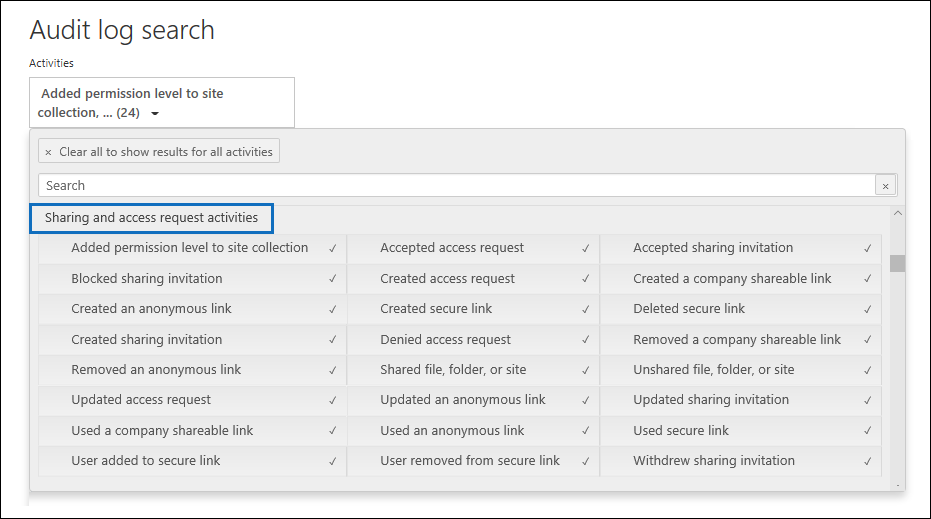

# Usar el uso compartido de auditoría en el registro de auditoríaUse sharing auditing in the audit log

El uso compartido es una actividad clave en SharePoint Online y OneDrive para la Empresa, y se usa ampliamente en organizaciones.Sharing is a key activity in SharePoint Online and OneDrive for Business, and it's widely used in organizations. Los administradores pueden usar la auditoría de uso compartido en el registro de auditoría para determinar cómo se usa el uso compartido en su organización.Administrators can use sharing auditing in the audit log to determine how sharing is used in their organization. 
  
## Esquema SharePoint uso compartidoThe SharePoint Sharing schema

Los eventos de uso compartido (sin incluir eventos relacionados con la directiva de uso compartido y los vínculos de uso compartido) son diferentes de los eventos relacionados con archivos y carpetas de una forma principal: un usuario realiza una acción que tiene un efecto en otro usuario.Sharing events (not including events related to sharing policy and sharing links) are different from file- and folder-related events in one primary way: one user is performing an action that has an effect on another user. Por ejemplo, cuando un usuario A de un recurso proporciona al usuario B acceso a un archivo.For example, when a resource User A gives User B access to a file. En este ejemplo, el usuario A es el  *usuario que*  actúa y el usuario B es el usuario  *de destino*.In this example, User A is the  *acting user*  and User B is the  *target user*. En el esquema SharePoint archivo, la acción del usuario que actúa solo afecta al propio archivo.In the SharePoint File schema, the acting user's action only affects the file itself. Cuando el usuario A abre un archivo, la única información necesaria en el **evento FileAccessed** es el usuario que actúa.When User A opens a file, the only information needed in the **FileAccessed** event is the acting user. Para solucionar esta diferencia, hay un esquema independiente, denominado *esquema de uso* compartido SharePoint , que captura más información acerca de los eventos de uso compartido.To address this difference, there is a separate schema, called the  *SharePoint Sharing schema*, that captures more information about sharing events. Esto garantiza que los administradores tengan visibilidad sobre quién compartió un recurso y el usuario con el que se compartió el recurso.This ensures that administrators have visibility into who shared a resource and the user the resource was shared with. 
  
El esquema de uso compartido proporciona dos campos adicionales en un registro de auditoría relacionado con eventos de uso compartido:The Sharing schema provides two additional fields in an audit record related to sharing events: 
  
- **TargetUserOrGroupType:** Identifica si el usuario o grupo de destino es miembro, invitado, SharePointGroup, SecurityGroup o partner.**TargetUserOrGroupType:** Identifies whether the target user or group is a Member, Guest, SharePointGroup, SecurityGroup, or Partner.

- **TargetUserOrGroupName:** Almacena el UPN o el nombre del usuario o grupo de destino con el que se compartió un recurso (usuario B en el ejemplo anterior).**TargetUserOrGroupName:** Stores the UPN or name of the target user or group that a resource was shared with (User B in the previous example). 

Estos dos campos, además de otras propiedades del esquema del registro de auditoría, como  User,  Operation y Date, pueden contar la historia completa sobre qué usuario compartió qué recurso con quién y *cuándo*. These two fields, in addition to other properties from the audit log schema such as User, Operation, and Date can tell the full story about  *which*  user shared  *what*  resource with  *whom*  and  *when*. 
  
Hay otra propiedad de esquema que es importante para el artículo de uso compartido.There's another schema property that's important to the sharing story. Al exportar los resultados de la búsqueda del registro de auditoría, la columna **AuditData** del archivo CSV exportado almacena información sobre el uso compartido de eventos.When you export audit log search results, the **AuditData** column in the exported CSV file stores information about sharing events. Por ejemplo, cuando un usuario comparte un sitio con otro usuario, esto se logra agregando el usuario de destino a un grupo SharePoint usuario.For example, when a user shares a site with another user, this is accomplished by adding the target user to a SharePoint group. La **columna AuditData** captura esta información para proporcionar contexto a los administradores.The **AuditData** column captures this information to provide context for administrators. Vea [el paso 2](#step-2-use-the-powerquery-editor-to-format-the-exported-audit-log) para obtener instrucciones sobre cómo analizar la información en la **columna AuditData.**See [Step 2](#step-2-use-the-powerquery-editor-to-format-the-exported-audit-log) for instructions on how to parse the information in the **AuditData** column.

## SharePoint eventos de uso compartidoSharePoint sharing events

El uso compartido se define  cuando un usuario (el usuario que actúa) desea compartir un recurso con otro usuario (el *usuario de* destino).Sharing is defined by when a user (the *acting* user) wants to share a resource with another user (the *target* user). Los registros de auditoría relacionados con el uso compartido de un recurso con un usuario externo (un usuario que está fuera de la organización y no tiene una cuenta de invitado en el Azure Active Directory de la organización) se identifican mediante los siguientes eventos, que se registran en el registro de auditoría:Audit records related to sharing a resource with an external user (a user who is outside of your organization and doesn't have a guest account in your organization's Azure Active Directory) are identified by the following events, which are logged in the audit log:

- **SharingInvitationCreated:** Un usuario de la organización intentó compartir un recurso (probablemente un sitio) con un usuario externo.**SharingInvitationCreated:** A user in your organization tried to share a resource (likely a site) with an external user. Esto da como resultado una invitación de uso compartido externo enviada al usuario de destino.This results in an external sharing invitation sent to the target user. No se concede acceso al recurso en este momento.No access to the resource is granted at this point.

- **SharingInvitationAccepted:** El usuario externo ha aceptado la invitación de uso compartido enviada por el usuario que actúa y ahora tiene acceso al recurso.**SharingInvitationAccepted:** The external user has accepted the sharing invitation sent by the acting user and now has access to the resource.

- **AnonymousLinkCreated:** Se crea un vínculo anónimo (también denominado vínculo "Cualquiera") para un recurso.**AnonymousLinkCreated:** An anonymous link (also called an "Anyone" link) is created for a resource. Dado que se puede crear y copiar un vínculo anónimo, es razonable suponer que cualquier documento que tenga un vínculo anónimo se ha compartido con un usuario de destino.Because an anonymous link can be created and then copied, it's reasonable to assume that any document that has an anonymous link has been shared with a target user.

- **AnonymousLinkUsed:** Como su nombre indica, este evento se registra cuando se usa un vínculo anónimo para obtener acceso a un recurso.**AnonymousLinkUsed:** As the name implies, this event is logged when an anonymous link is used to access a resource. 

- **SecureLinkCreated:** Un usuario ha creado un "vínculo de personas específicas" para compartir un recurso con una persona específica.**SecureLinkCreated:** A user has created a "specific people link" to share a resource with a specific person. Este usuario de destino puede ser alguien externo a su organización.This target user may be someone who is external to your organization. La persona con la que se comparte el recurso se identifica en el registro de auditoría del **evento AddedToSecureLink.**The person that the resource is shared with is identified in the audit record for the **AddedToSecureLink** event. Las marcas de tiempo de estos dos eventos son casi idénticas.The time stamps for these two events are nearly identical.

- **AddedToSecureLink:** Se agregó un usuario a un vínculo de personas específico.**AddedToSecureLink:** A user was added to a specific people link. Use el **campo TargetUserOrGroupName** en este evento para identificar el usuario agregado al vínculo de personas específico correspondiente.Use the **TargetUserOrGroupName** field in this event to identify the user added to the corresponding specific people link. Este usuario de destino puede ser alguien externo a su organización.This target user may be someone who is external to your organization.

## Compartir flujo de trabajo de auditoríaSharing auditing work flow
  
Cuando un usuario (el usuario que actúa) desea compartir un recurso con otro usuario (el usuario de destino), SharePoint (o OneDrive para la Empresa) primero comprueba si la dirección de correo electrónico del usuario de destino ya está asociada a una cuenta de usuario en el directorio de la organización.When a user (the acting user) wants to share a resource with another user (the target user), SharePoint (or OneDrive for Business) first checks if the email address of the target user is already associated with a user account in the organization's directory. Si el usuario de destino está en el directorio (y tiene una cuenta de usuario invitada correspondiente), SharePoint lo siguiente:If the target user is in the directory (and has a corresponding guest user account), SharePoint does the following things:
  
-  Asigna inmediatamente los permisos de usuario de destino para tener acceso al recurso agregando el usuario de destino al grupo de SharePoint adecuado y registra un **evento AddedToGroup.**Immediately assigns the target user permissions to access the resource by adding the target user to the appropriate SharePoint group, and logs an **AddedToGroup** event. 
    
- Envía una notificación de uso compartido a la dirección de correo electrónico del usuario de destino.Sends a sharing notification to the email address of the target user.
    
- Registra un **evento SharingSet.**Logs a **SharingSet** event. Este evento tiene un nombre descriptivo de "Archivo compartido, carpeta o sitio" en **Actividades** de solicitud de uso compartido y acceso en el selector de actividades de la herramienta de búsqueda de registro de auditoría.This event has a friendly name of "Shared file, folder, or site" under **Sharing and access request activities** in the activities picker of the audit log search tool. Consulta la captura de pantalla [en el paso 1](#step-1-search-for-sharing-events-and-export-the-results-to-a-csv-file).See the screenshot in [Step 1](#step-1-search-for-sharing-events-and-export-the-results-to-a-csv-file). 
    
Si una cuenta de usuario para el usuario de destino no está en el directorio, SharePoint hace lo siguiente:If a user account for the target user isn't in the directory, SharePoint does the following: 
    
   - Registra uno de los siguientes eventos en función de cómo se comparte el recurso:Logs one of the following events, based on how the resource is shared:
   
      - **AnonymousLinkCreated****AnonymousLinkCreated**
   
      - **SecureLinkCreated****SecureLinkCreated**
   
      - **AddedToSecureLink****AddedToSecureLink** 

      - **SharingInvitationCreated** (este evento se registra solo cuando el recurso compartido es un sitio)**SharingInvitationCreated** (this event is logged only when the shared resource is a site)
    
   - Cuando el usuario de destino acepta la invitación de uso compartido que se les envía (haciendo clic en el vínculo de la invitación), SharePoint registra un evento **SharingInvitationAccepted** y asigna los permisos de usuario de destino para obtener acceso al recurso.When the target user accepts the sharing invitation that's sent to them (by clicking the link in the invitation), SharePoint logs a **SharingInvitationAccepted** event and assigns the target user permissions to access the resource. Si se envía un vínculo anónimo al usuario de destino, el evento **AnonymousLinkUsed** se registra después de que el usuario de destino use el vínculo para obtener acceso al recurso.If the target user is sent an anonymous link, the **AnonymousLinkUsed** event is logged after the target user uses the link to access the resource. Para vínculos seguros, se **registra un evento FileAccessed** cuando un usuario externo usa el vínculo para obtener acceso al recurso.For secure links, a **FileAccessed** event is logged when an external user uses the link to access the resource.

También se registra información adicional sobre el usuario de destino, como la identidad del usuario al que es la invitación y el usuario que acepta la invitación.Additional information about the target user is also logged, such as the identity of the user the invitation is to and the user who accepts the invitation. En algún caso, estos usuarios (o direcciones de correo electrónico) pueden ser diferentes.In some case, these users (or email addresses) can be different. 

## Cómo identificar recursos compartidos con usuarios externosHow to identify resources shared with external users

Un requisito común para los administradores es crear una lista de todos los recursos que se han compartido con usuarios fuera de la organización.A common requirement for administrators is creating a list of all resources that have been shared with users outside of the organization. Al usar la auditoría de uso compartido en Office 365, los administradores pueden generar esta lista.By using sharing auditing in Office 365, administrators can generate this list. Aquí se muestra cómo hacerlo.Here's how.
  
### Paso 1: Buscar eventos de uso compartido y exportar los resultados a un archivo CSVStep 1: Search for sharing events and export the results to a CSV file

El primer paso es buscar eventos de uso compartido en el registro de auditoría.The first step is to search the audit log for sharing events. Para obtener más información (incluidos los permisos necesarios) sobre cómo buscar en el registro de auditoría, vea Buscar en el registro de auditoría en el Centro de [seguridad & cumplimiento](search-the-audit-log-in-security-and-compliance.md).For more information (including the required permissions) about searching the audit log, see [Search the audit log in the Security & Compliance Center](search-the-audit-log-in-security-and-compliance.md).
  
1. Vaya a [https://protection.office.com](https://protection.office.com).Go to [https://protection.office.com](https://protection.office.com).
    
2. Inicie sesión con su cuenta profesional o educativa.Sign in using your work or school account.
    
3. En el panel izquierdo del Centro de seguridad y cumplimiento, haga clic en **Buscar**  > **Búsqueda de registros de auditoría**.In the left pane of the Security & Compliance Center, click **Search**  > **Audit log search**.
    
    La página de **Búsqueda de registros de auditoría** se mostrará.The **Audit log search** page is displayed. 
    
4. En **Actividades,** haga clic **en Compartir y acceder a** las actividades de solicitud para buscar eventos relacionados con el uso compartido.Under **Activities**, click **Sharing and access request activities** to search for sharing-related events. 
    
    
  
5.  Seleccione un intervalo de fecha y hora para buscar los eventos de uso compartido que se produjeron en ese período.Select a date and time range to find the sharing events that occurred within that period. 
    
6. Haga **clic en** Buscar para ejecutar la búsqueda.Click **Search** to run the search. 
    
7. Cuando la búsqueda termine de ejecutarse y se muestren los resultados, haga clic **en Exportar** \> **resultados Descargar todos los resultados**.When the search is finished running and the results are displayed, click **Export results** \> **Download all results**.
    
    Después de seleccionar la opción de exportación, un mensaje en la parte inferior de la ventana le pedirá que abra o guarde el archivo CSV.After you select the export option, a message at the bottom of the window prompts you to open or save the CSV file.
    
8. Haga **clic en** Guardar como y guarde el archivo CSV en una carpeta del equipo \>  local.Click **Save** \> **Save as** and save the CSV file to a folder on your local computer. 

### Paso 2: Usar el Editor de PowerQuery para dar formato al registro de auditoría exportadoStep 2: Use the PowerQuery Editor to format the exported audit log

El siguiente paso es usar la característica de transformación JSON en el Editor de power query de Excel para dividir cada propiedad de la columna **AuditData** (que consta de un objeto JSON de varias propiedades) en su propia columna.The next step is to use the JSON transform feature in the Power Query Editor in Excel to split each property in the **AuditData** column (which consists of a multi-property JSON object) into its own column. Esto le permite filtrar columnas para ver registros relacionados con el uso compartidoThis lets you filter columns to view records related to sharing

Para obtener instrucciones paso a paso, consulte «Paso 2: Dar formato al registro de auditoría exportado mediante el Editor de Power Query» en [Exportar, configurar y ver los archivos de registros de auditoría](export-view-audit-log-records.md#step-2-format-the-exported-audit-log-using-the-power-query-editor). For step-by-step instructions, see "Step 2: Format the exported audit log using the Power Query Editor" in [Export, configure, and view audit log records](export-view-audit-log-records.md#step-2-format-the-exported-audit-log-using-the-power-query-editor).

### Paso 3: Filtrar el archivo CSV para los recursos compartidos con usuarios externosStep 3: Filter the CSV file for resources shared with external users

El siguiente paso es filtrar el CSV para los distintos eventos relacionados con el uso compartido que se describen anteriormente en la [sección SharePoint eventos de uso](#sharepoint-sharing-events) compartido.The next step is to filter the CSV for the different sharing-related events that were previously described in the [SharePoint sharing events](#sharepoint-sharing-events) section. Como alternativa, puede filtrar la **columna TargetUserOrGroupType** para mostrar todos los registros donde el valor de esta propiedad es **Guest**.Alternatively, you can filter the **TargetUserOrGroupType** column to display all records where the value of this property is **Guest**. 

Después de seguir las instrucciones del paso anterior para preparar el archivo CSV mediante el editor de PowerQuery, haga lo siguiente:After you've followed the instructions in the previous step to prepare the CSV file by using the PowerQuery editor, do the following:
    
1. Abra el Excel que creó en el paso 2.Open the Excel file that you created in Step 2. 

2. En la **ficha Inicio,** haga clic **en Ordenar & filtro** y, a continuación, haga clic en **Filtrar**.On the **Home** tab, click **Sort & Filter**, and then click **Filter**.
    
3. En la lista desplegable Ordenar **&**  filtro de la columna Operaciones, desactive todas las selecciones, seleccione uno o más de los siguientes eventos relacionados con el uso compartido y, a continuación, haga clic en **Aceptar**.In the **Sort & Filter** dropdown list on the **Operations** column, clear all selections, then select one or more the following sharing-related events and then click **Ok**.
 
   - **SharingInvitationCreated****SharingInvitationCreated**
   
   - **AnonymousLinkCreated****AnonymousLinkCreated**
   
   - **SecureLinkCreated****SecureLinkCreated**
   
   - **AddedToSecureLink****AddedToSecureLink** 
    
    Excel muestra las filas de los eventos seleccionados.Excel displays the rows for the events you selected.
    
4. Vaya a la columna **denominada TargetUserOrGroupType** y selecciónelo.Go to the column named **TargetUserOrGroupType** and select it. 
    
5. En la **lista desplegable Ordenar &** filtro, desactive todas las selecciones, seleccione **TargetUserOrGroupType:Guest** y haga clic en **Aceptar**.In the **Sort & Filter** dropdown list, clear all selections, then select **TargetUserOrGroupType:Guest**, and click **Ok**.
    
    Ahora Excel las filas para compartir eventos Y donde el usuario de destino está fuera de la organización, ya que los usuarios externos se identifican mediante el valor **TargetUserOrGroupType:Guest**.Now Excel displays the rows for sharing events AND where the target user is outside of your organization, because external users are identified by the value **TargetUserOrGroupType:Guest**. 
  
> [!TIP]
> Para los registros de auditoría que se muestran, la columna **ObjectId** identifica el recurso que se compartió con el usuario de destino; por ejemplo  `ObjectId:https:\/\/contoso-my.sharepoint.com\/personal\/sarad_contoso_com\/Documents\/Southwater Proposal.docx` .For the audit records that are displayed, the **ObjectId** column identifies the resource that was shared with the target user; for example  `ObjectId:https:\/\/contoso-my.sharepoint.com\/personal\/sarad_contoso_com\/Documents\/Southwater Proposal.docx`.
