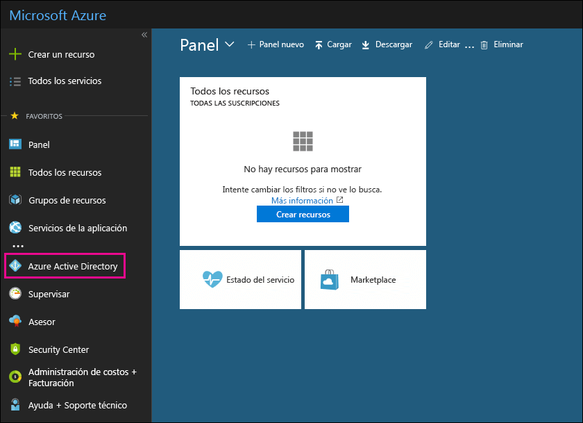

# Usar su suscripción gratuita de Azure Active Directory

Si su organización tiene una suscripción de pago a Microsoft 365, Microsoft Dynamics CRM Online, Enterprise Mobility Suite u otros servicios Microsoft, ya tiene una suscripción gratuita a Microsoft Azure Active Directory. Los administradores pueden usar Azure AD para crear y administrar cuentas de usuario y grupo. Para usar Azure AD, vaya a Azure Portal e inicie sesión con su cuenta.

## Abrir una sesión de exploración privada

Use una sesión de navegación privada (no una sesión normal) para obtener acceso al Microsoft Azure Portal (en el paso 1 que se muestra a continuación). Esto evitará que las credenciales con las que inició sesión se usen en Azure. Para abrir una sesión de navegación privada:

- En Microsoft Edge (versión heredada), Internet Explorer o Mozilla FireFox, presione `CTRL+SHIFT+P`.

- En Microsoft Edge (versión más reciente) o Google Chrome, presione `CTRL+SHIFT+N`.

## Obtener acceso a Azure Active Directory

1. Vaya a [portal.azure.com](https://portal.azure.com) e inicie sesión con la cuenta profesional o educativa.

2. En el panel de navegación izquierdo de Azure Portal, haga clic en **Azure Active Directory**.

    

    Se mostrará el Centro de administración de **Azure Active Directory**.

## Más información

- Una suscripción gratuita de Azure Active Directory no incluye el informe de actividad de inicio de sesión. Para grabar la actividad de inicio de sesión (que puede resultar útil en caso de una vulneración de datos), necesita una suscripción de Azure Active Directory Premium. Para obtener más información, consulte [¿Durante cuánto tiempo Azure AD almacena los datos?](/azure/active-directory/reports-monitoring/reference-reports-data-retention#how-long-does-azure-ad-store-the-data)

- También puede tener acceso al centro de administración de **Azure Active Directory** desde el centro de administración de Microsoft 365. En el panel de navegación de la izquierda del centro de administración de Microsoft 365, haga clic en **Centros de administración** \> **Azure Active Directory**.

- Para obtener información sobre cómo administrar usuarios y grupos, así como realizar otras tareas de administración de directorio, vea [Administrar el directorio de Azure AD](/azure/active-directory/active-directory-administer).