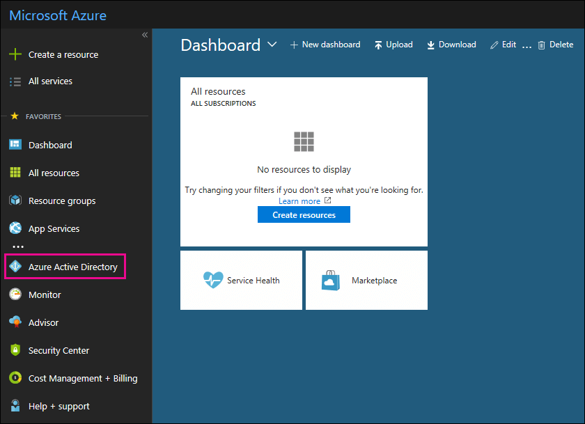

# Usar su suscripción gratuita de Azure Active Directory en Office 365Use your free Azure Active Directory subscription in Office 365

Si su organización tiene una suscripción de pago a Office 365, Microsoft Dynamics CRM Online, Enterprise Mobility Suite u otros servicios Microsoft, ya tiene una suscripción gratuita a Microsoft Azure Active Directory. Los administradores pueden usar Azure AD para crear y administrar cuentas de usuario y grupo. Para usar Azure AD, vaya a Azure Portal e inicie sesión con su cuenta de Office 365.If your organization has a paid subscription to Office 365, Microsoft Dynamics CRM Online, Enterprise Mobility Suite, or other Microsoft services, you have a free subscription to Microsoft Azure Active Directory. You and other admins can use Azure AD to create and manage user and group accounts. To use Azure AD, just go to the Azure portal and sign in using your Office 365 account.

## Antes de empezarBefore you begin

Use una sesión de exploración privada (no una sesión normal) para obtener acceso a Azure Portal (en el paso 1 siguiente), ya que esto impedirá que la credencial con la que inició la sesión se pase a Azure. Para abrir una sesión de Exploración de InPrivate en Internet Explorer o una sesión de exploración privada en Mozilla Firefox, presione CTRL+MAYÚS+P. Para abrir una sesión de exploración privada en Google Chrome (denominada ventana de incógnito), presione CTRL+MAYÚS+N.Use a private browsing session (not a regular session) to access the Azure portal (in step 1 below) because this will prevent the credential that you are currently logged on with from being passed to Azure. To open an InPrivate Browsing session in Internet Explorer or a Private Browsing session in Mozilla FireFox, just press CTRL+SHIFT+P. To open a private browsing session in Google Chrome (called an incognito window), press CTRL+SHIFT+N.

## Obtener acceso a Azure Active DirectoryAccess Azure Active Directory

1. Vaya a [portal.azure.com](https://portal.azure.com) e inicie sesión con su cuenta profesional o educativa de Office 365.Go to [portal.azure.com](https://portal.azure.com) and sign in with your Office 365 work or student account.

2. En el panel de navegación izquierdo de Azure Portal, haga clic en **Azure Active Directory**.In the left navigation pane in the Azure portal, click **Azure Active Directory**.

    

    Se mostrará el Centro de administración de **Azure Active Directory**.The **Azure Active Directory** admin center is displayed.

## Más informaciónMore information

- Una suscripción gratuita de Azure Active Directory no incluye el informe de actividad de inicio de sesión.A free Azure Active Directory subscription does not include the Sign-ins activity report. Para grabar la actividad de inicio de sesión (que puede resultar útil en caso de una violación de datos), necesita una suscripción de Azure Active Directory Premium.To record sign-in activity (which can be useful in the event of a data breach), you need an Azure Active Directory Premium subscription. Para obtener más información, consulte [¿Durante cuánto tiempo Azure AD almacena los datos?](https://docs.microsoft.com/azure/active-directory/reports-monitoring/reference-reports-data-retention#how-long-does-azure-ad-store-the-data)For more information, see [How long does Azure AD store the data?](https://docs.microsoft.com/azure/active-directory/reports-monitoring/reference-reports-data-retention#how-long-does-azure-ad-store-the-data).

- También puede tener acceso al centro de administración de **Azure Active Directory** desde el centro de administración de Microsoft 365.You can also access the **Azure Active Directory** admin center from the Office 365 admin center. In the left navigation pane of the Office 365 admin center , click Admin centersAzure Active Directory. En el panel de navegación de la izquierda del centro de administración de Microsoft 365, haga clic en **Centros de administración** \> **Azure Active Directory**.You can also access the Azure Active Directory admin center from the Office 365 admin center. In the left navigation pane of the Office 365 admin center , click **Admin centers** \> **Azure Active Directory**.

- Para obtener información sobre cómo administrar usuarios y grupos, así como realizar otras tareas de administración de directorio, vea [Administrar el directorio de Azure AD](https://docs.microsoft.com/azure/active-directory/active-directory-administer).For information about managing users and groups and performing other directory management tasks, see [Manage your Azure AD directory](https://docs.microsoft.com/azure/active-directory/active-directory-administer).
