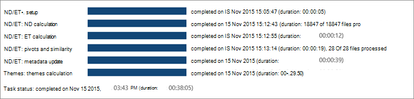

# Ver los resultados de ANALYZE en eDiscovery avanzado (clásico)View Analyze results in Advanced eDiscovery (classic)

> [!NOTE]
> Para usar eDiscovery avanzado, su organización necesita una suscripción de Office 365 E3 con el complemento Cumplimiento avanzado, o bien una suscripción de E5. Si no tiene ese plan y quiere probar eDiscovery avanzado, puede [registrarse para una prueba de Office 365 Enterprise E5](https://go.microsoft.com/fwlink/p/?LinkID=698279).Advanced eDiscovery requires an Office 365 E3 with the Advanced Compliance add-on or an E5 subscription for your organization. If you don't have that plan and want to try Advanced eDiscovery, you can [sign up for a trial of Office 365 Enterprise E5](https://go.microsoft.com/fwlink/p/?LinkID=698279). 
  
En la exhibición avanzada de documentos electrónicos, el progreso y los resultados del proceso de análisis se pueden ver en varias pantallas, como se describe a continuación.In Advanced eDiscovery, progress and results for the Analyze process can be viewed in a variety of displays as described below.
  
## Ver el estado de la tarea de análisisView Analyze task status

En **preparar el estado de la tarea de \> \> resultados \> del análisis**, el estado se muestra durante y después de analizar la ejecución del proceso.In **Prepare \> Analyze \> Results \> Task status**, the status is displayed during and after Analyze process execution. 
  

  
Las tareas mostradas pueden variar en función de las opciones seleccionadas.The tasks displayed may vary depending on the options selected. 
  
- **ND/et: Setup**: se prepara para la ejecución, por ejemplo, establece los parámetros Run y case.**ND/ET: setup**: Prepares for the run, for example, sets run and case parameters.
    
- **ND/et: ND Calculation**: procesa el análisis de archivos casi duplicados.**ND/ET: ND calculation**: Processes Near-duplicate analysis of files.
    
- **ND-et: et Calculation**: realiza análisis de subprocesos de correo electrónico en todo el conjunto de correo electrónico.**ND/ET: ET calculation**: Performs Email Thread analysis on the entire email set.
    
- **ND/et: tablas dinámicas y similitudes**: realiza el procesamiento de similitudes de archivos y tablas dinámicas.**ND/ET: pivots and similarities**: Performs pivot and file similarity processing.
    
- **ND/et: metadatos Update**: finaliza los nuevos datos recopilados en los archivos de la base de datos.**ND/ET: metadata update**: Finalizes the new data collected on the files in the database.
    
- **Temas: cálculo de temas**: ejecuta el análisis de temas.**Themes: themes calculation**: Runs themes analysis. (Solo se muestra si está seleccionado).(Displayed only if selected.)
    
- **Estado** de la tarea: esta línea se muestra después de la finalización de la tarea.**Task status**: This line is displayed after task completion. Mientras se ejecutan las tareas, se muestra la duración de ejecución.While tasks are running, run duration is displayed.
    
> [!NOTE]
> Los resultados del análisis de casi duplicados y subprocesos de correo electrónico (ND y ED) se aplican al número de documentos que se van a procesar.The Analyze results of Near-duplicates and Email Threads (ND and ED) applies to the number of documents to be processed. No incluye los archivos duplicados exactos.It does not include Exact duplicate files. 
  
## Ver el estado de subprocesos Near-duplicados y correo electrónicoView Near-duplicates and Email Threads status

Los resultados de la población de **destino** muestran el número de documentos, mensajes de correo electrónico, datos adjuntos y errores en el rellenado de destino.The **Target** population results display the number of documents, emails, attachments, and errors in the target population. 
  
Los resultados de los **documentos** muestran el número de elementos dinámicos, los únicos casi duplicados y los archivos duplicados exactos.The **Documents** results display the number of pivots, unique near-duplicates, and exact duplicate files. 
  
Los resultados de los **mensajes** de correo electrónico muestran el número de copias inclusivas inclusivas inclusive, únicas y exclusivas, así como el resto de los mensajes de correo electrónico.The **Emails** results display the number of inclusive, inclusive minus, unique inclusive copies, and the rest of the email messages. Los diferentes tipos de resultados de correo electrónico son:The different types of email results are: 
  
- **Inclusive**: un correo electrónico inclusivo es el nodo de terminación en un hilo de correo electrónico y contiene todo el historial anterior de ese hilo.**Inclusive**: An inclusive email is the terminating node in an email thread and contains all the previous history of that thread. Como resultado, el revisor puede centrarse de forma segura en el correo electrónico inclusivo, sin necesidad de leer los mensajes anteriores en el hilo.As a result, the reviewer can safely focus on the inclusive email, without the need to read the previous messages in the thread. 
    
- **Impuestos incluidos**: un correo electrónico inclusivo se designa como inclusivo menos si hay uno o varios datos adjuntos diferentes asociados con los elementos primarios del mensaje inclusivo.**Inclusive minus**: An inclusive email is designated as inclusive minus if there are one or more different attachments associated with the parents of the inclusive message. En este contexto, el término "primario" se usa para los mensajes ubicados hacia arriba en la conversación de correo electrónico o conversaciones incluidas en ese correo electrónico específico inclusivo.In this context, the term Parent is used for messages located upwards on the email thread or conversations included in that specific inclusive email. Un revisor puede usar la indicación de menos inclusivo como una señal que, aunque puede que no sea necesario revisar el contenido de los elementos primarios de correo electrónico inclusivos, puede resultar útil revisar los datos adjuntos asociados a los elementos principales de la ruta de acceso inclusiva.A reviewer can use the inclusive minus indication as a signal that although it might not be necessary to review the content of the inclusive email parents, it may be useful to review the attachments associated with the inclusive path parents. 
    
- **Copia inclusiva**: los correos electrónicos inclusivos se designan como copia inclusiva si es la copia de otro mensaje marcada como un signo menos inclusivo o inclusivo.**Inclusive copy**: An inclusive email is designated as inclusive copy if it's the copy of another message marked as inclusive or inclusive minus. Es decir, este mensaje tiene el mismo asunto y el mismo cuerpo que otro mensaje inclusivo y, como tal, coexiste en el mismo nodo.In other words, this message has the same subject and body as another inclusive message and, as such, co-resides in the same node. Como los mensajes de copia inclusivos contienen el mismo contenido, normalmente se pueden omitir en el proceso de revisión.Because inclusive copy messages contain the same content, they can usually be skipped in the review process. 
    
- **El resto**: indica el correo electrónico que no contiene ningún contenido único y, por lo tanto, no se incluye en ninguna de las tres categorías anteriores.**The rest**: This indicates email that doesn't contain any unique content, and therefore doesn't fall into any of the previous three categories. No es necesario revisar estos mensajes de correo electrónico.These email messages don't need to be reviewed. Si un mensaje contiene datos adjuntos que no están en un correo electrónico inclusivo posterior, es posible que sea necesario revisar los datos adjuntos.If a message contains an attachment that isn't on a later inclusive email, then the attachment might need to be reviewed. Esto se indica mediante la existencia de un correo electrónico menos inclusivo dentro del hilo.This is indicated by the existence of an inclusive minus email within the thread.
    
Los resultados de los **datos adjuntos** muestran el número de datos adjuntos, según el tipo único y duplicados.The **Attachments** results display the number of attachments, according to such type as unique and duplicates. 
  

  
## Vea tambiénSee also

[Advanced eDiscovery (clásico)Advanced eDiscovery (classic)](office-365-advanced-ediscovery.md)
  
[Descripción de la similitud de documentosUnderstanding document similarity](understand-document-similarity-in-advanced-ediscovery.md)
  
[Configuración de las opciones de análisisSetting Analyze options](set-analyze-options-in-advanced-ediscovery.md)
  
[Configuración de omitir textoSetting ignore text](set-ignore-text-in-advanced-ediscovery.md)
  
[Configuración de la configuración avanzada de análisisSetting Analyze advanced settings](view-analyze-results-in-advanced-ediscovery.md)

