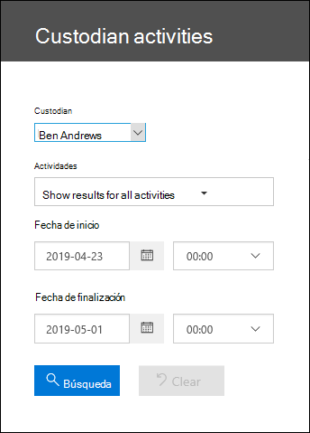
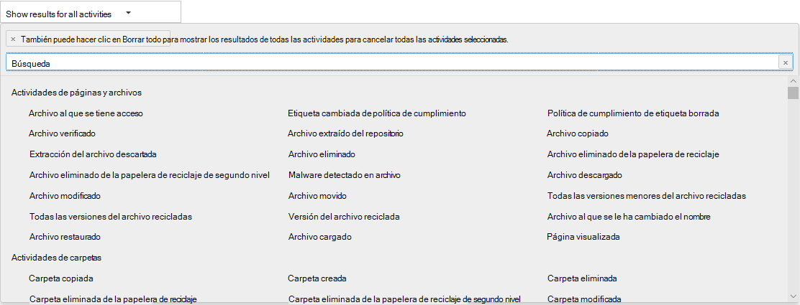

# Ver la actividad de auditoría de custodio

¿Necesita averiguar si un usuario ha visto un documento determinado o si ha purgado un elemento de su buzón? Advanced eDiscovery está integrado con la herramienta de búsqueda de registro de auditoría existente en el Centro de seguridad & cumplimiento. Con esta experiencia incrustada, puede usar la herramienta de administración de custodia de Advanced eDiscovery para facilitar la investigación accediendo fácilmente a la actividad y buscando custodios en su caso.

## Obtener permisos

Usted debe tener asignado el rol de Registros de auditoría o Registros de auditoría de solo lectura en Exchange Online para buscar en el registro de auditoría. De forma predeterminada, estos roles se asignan a los grupos de roles de Administración de la organización y Administración de cumplimiento en la página depermisosdel centro de administración de Exchange. Para dar a un usuario la capacidad de buscar en el registro de auditoría de exhibición avanzada de documentos electrónicos con el nivel mínimo de privilegios, puede crear un grupo de roles personalizado en Exchange Online, agregar el rol Registros de auditoría de solo visualización o Registros de auditoría y luego agregar el usuario como un miembro del nuevo grupo de roles. Para obtener más información, consulteAdministrar grupos de roles en Exchange en línea.

> [!IMPORTANT]
> Si asigna a un usuario el rol View-Only Registros de auditoría o Registros de auditoría en la página Permisos del Centro de seguridad y cumplimiento de &, no podrán buscar en el registro de auditoría. Tiene que asignar los permisos en Exchange en línea. Esto se debe a que el cmdlet subyacente que se usa para buscar en el registro de auditoría es un cmdlet Exchange en línea.

## Paso 1: Buscar en el registro de auditoría actividades realizadas por un custodio

1. Vaya a **eDiscovery > Advanced eDiscovery** y abra el caso.
  
2. Haga clic en **la pestaña** Orígenes.
  
3. En la **página Custodios,** seleccione un custodio de la lista y, a continuación, haga clic en Ver actividad **de** custodia en la página desplegable.

    Se muestra la página de búsqueda de actividades de custodia. Tenga en cuenta que el custodio seleccionado en el paso anterior se muestra en **el** cuadro desplegable Custodian. Puede seleccionar diferentes custodios en el cuadro desplegable, pero solo puede buscar actividades para un custodio a la vez.

    
   
4. Configurar los siguientes criterios de búsqueda: 
      
   1. **Actividades:** haga clic en la lista desplegable para mostrar las actividades que puede buscar. Después de que ejecute la búsqueda, solo se muestran las entradas seleccionadas del registro de auditoría de las actividades. Si selecciona **Mostrar resultados para todas las** actividades, se mostrarán los resultados de todas las actividades realizadas por el custodio que coincidan con los demás criterios de búsqueda.

      
      
   1. **Fecha de inicio y fecha de** finalización: seleccione una fecha y un intervalo de tiempo para mostrar los eventos que se produjeron en ese período. Los últimos siete días están seleccionados de forma predeterminada. La fecha y la hora se presentan en formato de Hora universal coordinada (UTC). El intervalo de fechas máximo que puede especificar es de un año.
      
   1. **Custodios:** haga clic en este cuadro y, a continuación, seleccione un custodio específico para el que mostrar los resultados de la búsqueda. Los registros de auditoría de la actividad seleccionada realizada por los usuarios seleccionados en este cuadro se muestran en la lista de resultados.
      
5. Haga clic en   para ejecutar la búsqueda con los criterios de búsqueda. Los resultados de la búsqueda se cargan y, después de unos instantes, se muestran en Resultados en la página de búsqueda Actividades de custodia. 

## Paso 2: Ver los resultados de la búsqueda del registro de auditoría

Los resultados de una búsqueda de registro de auditoría se muestran en Resultados en la página Registro de auditoría de custodia. Un máximo de 5.000 eventos (más recientes) se muestran en incrementos de 150 eventos. Para mostrar más eventos puede usar la barra de desplazamiento en el panel Resultados o también puede presionar Mayús+Fin para mostrar los siguientes 150 eventos.

Los resultados contienen la siguiente información sobre cada evento que la búsqueda ha devuelto.
- **Fecha**: la fecha y la hora (en formato UTC) cuando se ha realizado el evento.

- **Dirección IP**: la dirección IP del dispositivo que se ha usado cuando la actividad se ha registrado. La dirección IP se muestra en el formato de dirección IPv4 o IPv6.

- **Usuario**: el usuario (o cuenta de servicio) que ha realizado la acción que ha desencadenado el evento.

- **Actividad**: la actividad que ha realizado el usuario. Este valor corresponde a las actividades que ha seleccionado en la lista desplegable de actividades. Para un evento del registro de auditoría de administración de Exchange, el valor de esta columna es un cmdlet de Exchange.

- **Elemento**: el objeto que se ha creado o modificado como resultado de la actividad correspondiente. Por ejemplo, el archivo que se ha visto o modificado, o la cuenta de usuario que se ha actualizado. No todas las actividades tienen un valor en esta columna.

- **Detalle**: detalles adicionales sobre una actividad. De nuevo, no todas las actividades tendrán un valor.

## Paso 3: Filtrar los resultados de la búsqueda

Además de ordenar, también puede filtrar los resultados de una búsqueda de registro de auditoría. Esto puede ayudarle a filtrar rápidamente los resultados de un usuario o actividad específicos. 

Para filtrar los resultados:

 1. Cree y ejecute una búsqueda de registro de auditoría.
  
2. Cuando se muestren los resultados, haga clic en **Filtrar resultados**.
 
3. Los cuadros de palabra clave se muestran en cada encabezado de columna.
  
4. Haga clic en uno de lo cuadros que se visualizan en las cabeceras de columna y escriba una palabra o frase, dependiendo de la columna que esté filtrando. Los resultados se volverán a ajustar de manera dinámica para mostrar los eventos que coincidan con su filtro.
  
5. Para borrar un filtro, haga clic en **la X** del cuadro de filtro o simplemente haga clic **en Ocultar filtrado.**

## Exportar los resultados de la búsqueda a un archivo

Puede exportar los resultados de una búsqueda de registro de auditoría a un archivo de valores separados por comas (CSV) en el equipo local. Puede abrir este archivo en Microsoft Excel y usar características como buscar, ordenar, filtrar y dividir una sola columna (que contiene celdas de varios valores) en varias columnas.

1. Ejecute una búsqueda de registro de auditoría, y luego revise los criterios de búsqueda hasta que tenga los resultados deseados.
  
2. Haga clic en Exportar resultados y seleccione una de las siguientes opciones:

    - **Guardar resultados cargados:** Elija esta opción para exportar solo las entradas que se muestran en **Resultados** en la página de búsqueda del **registro de auditoría de** custodia. El archivo CSV que se descarga contiene las mismas columnas (y datos) que se muestran en la página (Fecha, Usuario, Actividad, Elemento y Detalles). Una columna adicional (titulada **Más**) se incluye en el archivo CSV que contiene más información de la entrada del registro de auditoría. Como está exportando los mismos resultados que se han cargado (y visualizado) en la página Búsqueda de registros de auditoría, se exportan un máximo de 5 000 entradas.
        
    - **Descargar todos los resultados:** Elija esta opción para exportar todas las entradas del registro de auditoría que cumplan los criterios de búsqueda. Para obtener un gran conjunto de resultados de búsqueda, elija esta opción para descargar todas las entradas del registro  de auditoría además de los 5.000 resultados que se pueden mostrar en la página de búsqueda del registro de auditoría custodiada. Esta opción descargará los datos sin procesar del registro de auditoría en un archivo CSV y contiene información adicional de la entrada del registro de auditoría en una columna denominada AuditData. Puede tardar más en descargar el archivo si elige esta opción de exportación ya que el archivo puede ser mucho más grande que el que se descarga si eligiera otra opción.
    
      > [!IMPORTANT]
      > Puede descargar un máximo de 50 000 entradas en un archivo CSV desde una única búsqueda de registros de auditoría. Si se descargan 50 000 entradas en el archivo CSV, probablemente puede suponer que existen más de 50 000 eventos que cumplen los criterios de búsqueda. Para exportar más de este límite, pruebe a usar un intervalo de fecha para reducir el número de entradas de registro de auditoría. Puede que tenga que ejecutar varias búsquedas con intervalos de fecha de menor tamaño para exportar más de 50 000 entradas.
        

3. Después de seleccionar una opción de exportación, se muestra un mensaje en la parte inferior de la ventana que le pide que abra el archivo CSV, guárdelo en la carpeta Descargas o guárdelo en una carpeta específica.

Para obtener más información acerca de la visualización, filtrado o exportación de resultados de búsqueda del registro de auditoría, vea Buscar en el registro de auditoría en el Centro de [seguridad & cumplimiento](search-the-audit-log-in-security-and-compliance.md).
