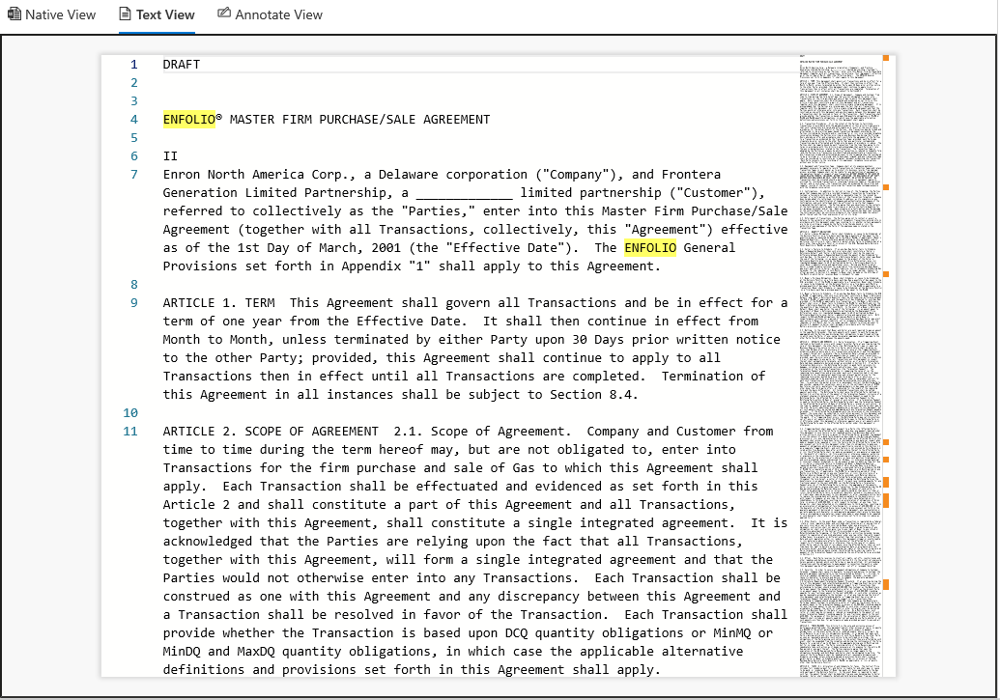
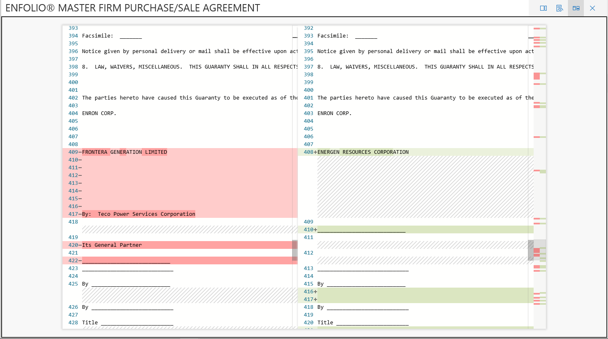

# Ver documentos en un conjunto de revisión en Advanced eDiscovery

eDiscovery avanzado muestra contenido mediante varios visores, cada uno con distintos fines. Puede usar varios visores haciendo clic en cualquier documento de un conjunto de revisión. Los visores proporcionados actualmente son:

- Metadatos de archivo
- Vista nativa
- Vista de Texto
- Vista de Anotar

## Metadatos de archivo

Este panel se puede activar y desactivar para mostrar varios metadatos asociados con el documento. Aunque la cuadrícula de resultados de búsqueda puede personalizarse para mostrar metadatos específicos, hay instancias en las que desplazarse horizontalmente puede ser difícil durante la revisión de datos. El panel de Metadatos de archivo permite a los usuarios activar o desactivar una vista dentro del visor.

## Vista nativa

El visor nativo muestra la vista más enriquecente de un documento. Es compatible con cientos de tipos de archivo y su intención es mostrar la experiencia nativa más verdadera posible. En el caso de los archivos de Microsoft Office, el visor usa la versión web de las aplicaciones de Office para mostrar contenido como comentarios de documentos, fórmulas de Excel, filas o columnas ocultas, y notas de PowerPoint.

## Vista de Texto

El visor de Texto proporciona una vista del texto extraído de un archivo. Pasa por alto las imágenes incrustadas y el formato, pero es muy eficaz si intenta comprender el contenido rápidamente. La vista de Texto también incluye estas características:

- El contador de líneas facilita la referencia a partes específicas de un documento
- Resaltado de pulsaciones de búsqueda que resaltarán los términos del documento, así como la barra de desplazamiento
- La vista Diferencia proporciona una vista de comparación que resalta las diferencias textuales al ver documentos casi duplicados

## Vista de Anotar

La vista Anotación proporciona características que permiten a los usuarios aplicar marcado en un documento, como:

- Redacciones de área: los usuarios pueden dibujar un cuadro en el documento para ocultar contenido confidencial
- Lápiz: los usuarios pueden dibujar a mano libre en un documento para llamar la atención sobre determinadas partes de un documento
- Seleccionar anotaciones: los usuarios pueden seleccionar anotaciones en un documento para eliminarlas
- Alternar transparencia de anotación: hace que las anotaciones se semitransparentes para ver el contenido detrás de la anotación
- Página anterior: navega a la página anterior
- Página siguiente: navega a la página siguiente
- Ir a la página: el usuario puede escribir un número de página específico para navegar a
- Zoom: establecer el nivel de zoom para la vista anotada
- Girar: el usuario puede girar el documento en el sentido de las agujas del reloj
- Búsqueda: el usuario puede buscar en un documento y navegar a los distintos aciertos del documento

  

## Vista panel

La vista de panel permite visualizar y resumir los datos de la cuadrícula de resultados de búsqueda. En esta vista, puede crear widgets personalizados para que el análisis y los informes del conjunto de revisión sea intuitivo y fácil. Una vez que haya creado los widgets, puede interactuar con ellos para obtener recuentos de elementos o para crear una búsqueda.
