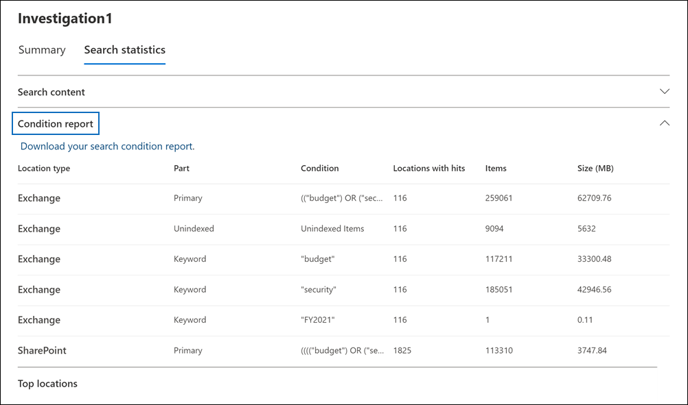

# Ver estadísticas de resultados de búsqueda de exhibición de documentos electrónicosView statistics for eDiscovery search results

Después de crear y ejecutar una búsqueda de contenido o una búsqueda asociada con un caso de exhibición de documentos electrónicos principal, puede ver estadísticas sobre los resultados de búsqueda estimados.After you create and run a Content search or a search associated with a Core eDiscovery case, you can view statistics about the estimated search results. Esto incluye un resumen de los resultados de búsqueda (similar al resumen de los resultados de búsqueda estimados que se muestran en la página desplegable de búsqueda), las estadísticas de consulta, como el número de ubicaciones de contenido con elementos que coinciden con la consulta de búsqueda y la identidad de las ubicaciones de contenido que tienen los elementos más correspondientes.This includes a summary of the search results (similar to the summary of the estimated search results displayed on the search flyout page), the query statistics such as the number of content locations with items that match the search query, and the identity of content locations that have the most matching items.
  
Además, puede usar la lista de palabras clave para configurar una búsqueda para devolver estadísticas para cada palabra clave de una consulta de búsqueda.Additionally, you can use the keywords list to configure a search to return statistics for each keyword in a search query. Esto le permite comparar el número de resultados devueltos por cada palabra clave de una consulta.This lets you compare the number of results returned by each keyword in a query.
  
También puede descargar estadísticas de búsqueda en un archivo CSV.You can also download search statistics to a CSV file. Así, una vez que abra el archivo con Excel podrá usar las opciones de filtrado y ordenación del programa para comparar los resultados, o preparar informes de los resultados de búsqueda.This lets you use the filtering and sorting features in Excel to compare results, and prepare reports for your search results.
  
## Obtener estadísticas para búsquedasGet statistics for searches

Para mostrar estadísticas de una búsqueda de contenido o una búsqueda asociada a un caso de exhibición de documentos electrónicos principal.:To display statistics for a Content search or a search associated with a Core eDiscovery case.:
  
1. En el centro Microsoft 365 cumplimiento, haga clic **en Mostrar todo** y, a continuación, realice una de las siguientes acciones:In the Microsoft 365 compliance center, click **Show all**, and then do one of the following:

   - Haga **clic en Búsqueda de** contenido y, a continuación, seleccione una búsqueda para mostrar la página desplegable.Click **Content search** and then select a search to display the flyout page.

     OOR

   - Haga **clic en eDiscovery** Core , seleccione un caso y, a continuación, seleccione una búsqueda en la pestaña  >  Búsquedas para mostrar la página desplegable. Click **eDiscovery** > **Core**, select a case, and then select a search on the **Searches** tab to display the flyout page.

2. En la página desplegable de la búsqueda seleccionada, haga clic en la **pestaña Estadísticas de** búsqueda.On the flyout page of the selected search, click the **Search statistics** tab.
  
   

La **pestaña Estadísticas de** búsqueda contiene las siguientes secciones que contienen diferentes tipos de estadísticas sobre la búsqueda.The **Search statistics** tab contains for following sections that contain different types of statistics about the search.

### Contenido de búsquedaSearch content

En esta sección se muestra un resumen gráfico de los elementos estimados devueltos por la búsqueda.This section displays a graphical summary of the estimated items returned by the search. Esto indica el número de elementos que coinciden con los criterios de búsqueda.This indicates the number of items that match the search criteria. Esta información le ofrece una idea sobre el número estimado de elementos devueltos por la búsqueda.This information gives you an idea about the estimated number of items returned by the search.

- **Elementos estimados por ubicaciones:** el número total de elementos estimados devueltos por la búsqueda.**Estimated items by locations**: The total number of estimated items returned by the search. También se muestra el número específico de elementos ubicados en buzones de correo y ubicados en sitios.The specific number of items located in mailboxes and located in sites is also displayed.

- **Ubicaciones estimadas con aciertos:** el número total de ubicaciones de contenido que contienen elementos devueltos por la búsqueda.**Estimated locations with hits**: The total number of content locations that contain items returned by the search. También se muestra el número específico de ubicaciones de buzones y sitios.The specific number of mailbox and site locations is also displayed.

- **Volumen de datos por ubicación (en MB):** tamaño total de todos los elementos estimados devueltos por la búsqueda.**Data volume by location (in MB)**: The total size of all estimated items returned by the search. También se muestra el tamaño específico de los elementos de buzón y los elementos del sitio.The specific size of mailbox items and site items is also displayed.

### Informe de condicionesCondition report

En esta sección se muestran estadísticas sobre la consulta de búsqueda y el número de elementos estimados que coinciden con distintas partes de la consulta de búsqueda.This section displays statistics about the search query and the number of estimated items that matched different parts of the search query. Puede usar estas estadísticas para analizar el número de elementos que coinciden con cada componente de la consulta de búsqueda.You can use these statistics to analyze the number of items that match each component of search query. Esto puede ayudarle a refinar los criterios de búsqueda y, si es necesario, restringir el ámbito del ámbito.This can help you refine the search criteria and if necessary narrow the scope of the scope. También puede descargar una copia de este informe en formato CSV.You can also download a copy of this report in CSV format.

- **Tipo de ubicación:** tipo de ubicación de contenido a la que se aplican las estadísticas de consulta.**Location type**: The type of content location that the query statistics are applicable to. El valor de **Exchange** indica una ubicación de buzón; un valor de **SharePoint** indica una ubicación del sitio.The value of **Exchange** indicates a mailbox location; a value of **SharePoint** indicates a site location.

- **Parte:** la parte de la consulta de búsqueda a la que se aplican las estadísticas.**Part**: The part of the search query the statistics are applicable to. **Primary** indica toda la consulta de búsqueda.**Primary** indicates the entire search query. **Palabra** clave indica que las estadísticas de la fila son para una palabra clave específica.**Keyword** indicates the statistics in the row are for a specific keyword. Si usa una lista de palabras clave para la consulta de búsqueda, las estadísticas de cada componente de la consulta se incluyen en esta tabla.If you use a keyword list for search query, statistics for each component of the query are included in this table. Para obtener más información, vea [Get keyword statistics for searches](#get-keyword-statistics-for-searches).For more information, see [Get keyword statistics for searches](#get-keyword-statistics-for-searches).

- **Condición:** el componente real (palabra clave o condición) de la consulta de búsqueda que devuelve las estadísticas mostradas en la fila correspondiente.**Condition**: The actual component (keyword or condition) of the search query that returned the statistics displayed in the corresponding row.

- **Ubicaciones con** aciertos: el número de ubicaciones de contenido (especificadas por la columna **Tipo** de ubicación) que contienen elementos que coinciden con la consulta principal o de palabra clave enumerada en la **columna Condición.****Locations with hits**: The number of the content locations (specified by the **Location type** column) that contain items that match the primary or keyword query listed in the **Condition** column.

- **Elementos:** el número de elementos (desde la ubicación de contenido especificada) que coinciden con la consulta enumerada en la **columna Condición.****Items**: The number of items (from the specified content location) that match the query listed in the **Condition** column. Como se explicó anteriormente, si un elemento contiene varias instancias de una palabra clave que se está buscando, solo se cuenta una vez en esta columna.As previously explained, if an item contains multiple instances of a keyword that is being searched for, it's only counted once in this column.

- **Tamaño (MB):** tamaño total de todos los elementos encontrados (en la ubicación de contenido especificada) que coinciden con la consulta de búsqueda en la **columna Condición.****Size (MB)**: The total size of all items that were found (in the specified content location) that match the search query in the **Condition** column.

### Ubicaciones principalesTop locations

En esta sección se muestran estadísticas sobre las ubicaciones de contenido específicas con la mayoría de los elementos devueltos por la búsqueda.This section displays statistics about the specific content locations with the most items returned by the search. Se mostrarán las 1000 ubicaciones más importantes.The top 1,000 locations are displayed. También puede descargar una copia de este informe en formato CSV.You can also download a copy of this report in CSV format.

- El nombre de la ubicación (la dirección de correo electrónico de los buzones y la dirección URL de los sitios).The name of the location name (the email address of mailboxes and the URL for sites).

- Tipo de ubicación (un buzón o sitio).Location type (a mailbox or site).

- Número estimado de elementos en la ubicación de contenido devuelta por la búsqueda.Estimated number of items in the content location returned by the search.

- Tamaño total de los elementos estimados en cada ubicación de contenido.The total size of estimated items in each content location.

## Obtener estadísticas de palabras clave para búsquedasGet keyword statistics for searches

Como se explicó anteriormente, la sección **Informe de condiciones** muestra la consulta de búsqueda y el número (y tamaño) de los elementos que coinciden con la consulta.As previous explained, the **Condition report** section shows the search query and the number (and size) of items that match the query. Si usa una lista de palabras clave al crear o editar una consulta de búsqueda, puede obtener estadísticas mejoradas que muestran cuántos elementos coinciden con cada palabra clave o frase de palabra clave.If you use a keyword list when you create or edit a search query, you can get enhanced statistics that show how many items match each keyword or keyword phrase. Esto puede ayudarle a identificar rápidamente qué partes de la consulta son las más (y menos) eficaces.This can help you quickly identify which parts of the query are the most (and least) effective. Por ejemplo, si una palabra clave devuelve un gran número de elementos, puede optar por refinar la consulta de palabras clave para restringir los resultados de la búsqueda.For example, if a keyword returns a large number of items, you might choose to refine the keyword query to narrow the search results.

Para crear una lista de palabras clave y ver estadísticas de palabras clave para una búsqueda:To create a keyword list and view keyword statistics for a search:
  
1. En el Microsoft 365 de cumplimiento, cree una nueva búsqueda de contenido o una búsqueda asociada con un caso de exhibición de documentos electrónicos principal.In the Microsoft 365 compliance center, create a new Content search or a search associated with a Core eDiscovery case.

2. En la **página Condiciones** del asistente para búsqueda.On the **Conditions** page of the search wizard. active la casilla **Mostrar lista de palabras clave.**select the **Show keyword list** checkbox.

   

3. Escriba una palabra clave o fase de palabra clave en una fila de la tabla de palabras clave.Type a keyword or keyword phase in a row in the keywords table. Por ejemplo, escriba **presupuesto en** la primera fila, escriba **seguridad** en la segunda fila y escriba **FY2021** en la tercera fila.For example, type **budget** in the first row, type **security** in the second row, and type **FY2021** in the third row.

   

   > [!NOTE]
   > Para ayudar a reducir los problemas causados por listas de palabras clave grandes, está limitado a un máximo de 20 filas en la lista de palabras clave de una consulta de búsqueda.To help reduce issues caused by large keyword lists, you're limited to a maximum of 20 rows in the keyword list of a search query.

4. Después de agregar las palabras clave a la lista en la que desea buscar y obtener estadísticas, ejecute la búsqueda.After adding the keywords to the list that you want to search and get statistics for, run the search.

5. Cuando se complete la búsqueda, selecciónelo para mostrar la página desplegable.When the search is completed, select it to display the flyout page.

6. En la **pestaña Estadísticas de búsqueda,** haga clic en el **informe Condición** para mostrar las estadísticas de palabras clave de la búsqueda.On the **Search statistics** tab, click the **Condition report** to display the keyword statistics for the search.

    
  
    Como se muestra en la captura de pantalla anterior, se muestran las estadísticas de cada palabra clave; esto incluye:As shown in the previous screenshot, the statistics for each keyword are displayed; this includes:

    - Estadísticas de palabras clave para cada tipo de ubicación de contenido incluida en la búsqueda.The keyword statistics for each type of content location included in the search.

    - Número de elementos de buzón sin indizar.The number of unindexed mailbox items.

    - La consulta de búsqueda real y los resultados de cada palabra clave (identificada como **Palabra** clave en la **columna Parte),** que incluye cualquier condición de la consulta de búsqueda.The actual search query and results for each keyword (identified as **Keyword** in the **Part** column), which includes any conditions from the search query.

    - La consulta de búsqueda completa (identificada como **Principal** en la **columna Parte)** y las estadísticas de la consulta completa para cada tipo de ubicación.The complete search query (identified as **Primary** in the **Part** column) and the statistics for the complete query for each location type. Tenga en cuenta que estas son las mismas estadísticas que se muestran en la **pestaña** Resumen.Note these are the same statistics displayed on the **Summary** tab.
