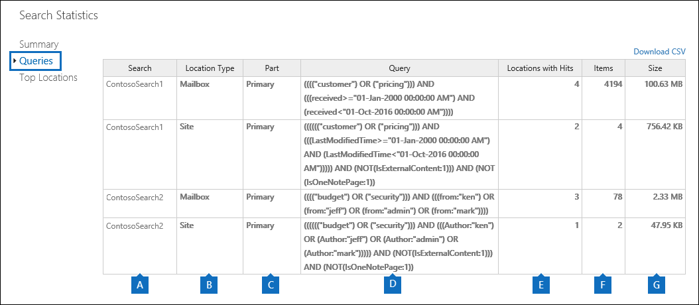

# Ver las estadísticas de palabras clave para resultados de búsqueda de contenidoView keyword statistics for Content Search results

Después de crear y ejecutar una búsqueda de contenido, puede ver estadísticas sobre los resultados de búsqueda estimados.After you create and run a Content Search, you can view statistics about the estimated search results. Esto incluye un resumen de los resultados de búsqueda (similar al Resumen de los resultados de búsqueda estimados que se muestran en el panel de detalles), las estadísticas de consulta, como el número de ubicaciones de contenido con elementos que coinciden con la consulta de búsqueda, y el nombre de las ubicaciones de contenido que tienen más elementos coincidentes.This includes a summary of the search results (similar to the summary of the estimated search results displayed in the details pane), the query statistics such as the number of content locations with items that match the search query, and the name of content locations that have the most matching items. Puede mostrar las estadísticas de una o más búsquedas de contenido.You can display statistics for one or more content searches. Esto le permite comparar rápidamente los resultados de varias búsquedas y tomar decisiones sobre la eficacia de las consultas de búsqueda.This lets you to quickly compare the results for multiple searches and make decisions about the effectiveness of your search queries.
  
Además, puede configurar búsquedas nuevas y existentes para devolver las estadísticas de cada palabra clave en una consulta de búsqueda.Additionally, you can configure new and existing searches to return statistics for each keyword in a search query. Esto le permite comparar el número de resultados de cada palabra clave de una consulta y comparar las estadísticas de palabras clave de varias búsquedas.This lets you compare the number of results for each keyword in a query and to compare the keyword statistics from multiple searches.
  
También puede descargar estadísticas de búsqueda y de palabras clave en un archivo CSV.You can also download the search statistics and keyword statistics to a CSV file. Así, una vez que abra el archivo con Excel podrá usar las opciones de filtrado y ordenación del programa para comparar los resultados, o preparar informes de los resultados de búsqueda.This lets you use the filtering and sorting features in Excel to compare results, and prepare reports for your search results.
  
## Obtener estadísticas para las búsquedas de contenidoGet statistics for Content Searches

Para mostrar las estadísticas de las búsquedas de contenido:To display statistics for Content Searches:
  
1. En el centro de seguridad & cumplimiento, vaya a búsqueda de contenido de **búsqueda** \> **Content search**.In the Security & Compliance Center, go to **Search** \> **Content search**.
    
2. En la lista de búsquedas, seleccione una o más búsquedas y, a continuación, haga clic en el botón estadísticas de búsqueda de **estadísticas de búsqueda**  .In the list of searches, select one or more searches, and then click **Search statistics**.
    
    
  
3. En la página **estadísticas de búsqueda** , haga clic en uno de los siguientes vínculos para mostrar estadísticas sobre las búsquedas seleccionadas.On the **Search statistics** page, click one of the following links to display statistics about the selected searches. 
    
    **Resumen****Summary**
    
    Esta página muestra estadísticas similares a las que se muestran en el panel de detalles en la página **búsqueda de contenido** .This page displays statistics similar to the ones displayed in the details pane on the **Content search** page. Se muestran las estadísticas de todas las búsquedas seleccionadas.Statistics for all selected searches are displayed. Tenga en cuenta que también puede volver a ejecutar las búsquedas seleccionadas desde esta página para actualizar las estadísticas.Note that you can also re-run the selected searches from this page to update the statistics. 
    
    
  
    a.a.  El nombre de la búsqueda de contenido.The name of the Content Search. Como se mencionó anteriormente, puede mostrar y comparar las estadísticas de varias búsquedas.As previously stated, you can display and compare statistics for multiple searches.
    
    b.b. Tipo de ubicación de contenido en la que se ha buscado.The type of content location that was searched. Cada fila muestra las estadísticas de los buzones de correo, los sitios y las carpetas públicas de la búsqueda especificada.Each row displays statistics for mailboxes, sites, and public folders from the specified search.
    
    c.c. El número de ubicaciones de contenido que contienen elementos que coinciden con la consulta de búsqueda.The number of content locations containing items that match the search query. Para los buzones, esta estadística también incluye el número de buzones de archivo que contienen elementos que coinciden con la consulta de búsqueda.For mailboxes, this statistic also includes the number of archive mailboxes that contain items that match the search query.
    
    d.d. El número total de elementos de todas las ubicaciones de contenido especificadas que coinciden con la consulta de búsqueda.The total number of items of all specified content locations that match the search query. Algunos ejemplos de tipos de elementos son los mensajes de correo electrónico, los elementos de calendario y los documentos.Examples of item types include email messages, calendar items, and documents. Si un elemento contiene varias instancias de una palabra clave que se está buscando, solo se cuenta una vez en el número total de elementos.If an item contains multiple instances of a keyword that is being searched for, it's only counted once in the total number of items. Por ejemplo, si está buscando palabras "acciones" o "fraude" y un mensaje de correo electrónico contiene tres instancias de la palabra "cotización", solo se considera una vez en la columna **elementos** .For example, if you're searching for words "stock" or "fraud" and an email message contains three instances of the word "stock", it's only counted once in the **Items** column. 
    
    e.e. Tamaño total de todos los elementos que se encontraron en la ubicación de contenido especificada y que coinciden con la consulta de búsqueda.The total size of all items that were found in the specified content location that match the search query. 
    
    **Queries****Queries**
    
    En esta página se muestran estadísticas sobre la consulta de búsqueda.This page displays statistics about the search query.
    
    
  
    a.a. El nombre de la búsqueda de contenido para la que la fila contiene estadísticas de consulta.The name of the Content Search that the row contains query statistics for.
    
    b.b. Tipo de ubicación de contenido a la que se aplican las estadísticas de la consulta.The type of content location that the query statistics are applicable to.
    
    c.c. Esta columna indica con qué parte de la consulta de búsqueda se pueden aplicar las estadísticas.This column indicates which part of the search query the statistics are applicable to. **Principal** indica la consulta de búsqueda completa.**Primary** indicates the entire search query. Si usa una lista de palabras clave al crear o editar una consulta de búsqueda, las estadísticas de cada componente de la consulta se incluyen en esta tabla.If you use a keyword list when you create or edit a search query, statistics for each component of the query are included in this table. Vea la sección [obtener estadísticas de palabras clave para búsquedas de contenido](#get-keyword-statistics-for-content-searches) de este artículo para obtener más información.See the [Get keyword statistics for Content Searches](#get-keyword-statistics-for-content-searches) section in this article for more information. 
    
    d.d. Esta columna contiene la consulta de búsqueda real que ejecuta la herramienta de búsqueda de contenido.This column contains the actual search query that run by the Content Search tool. Tenga en cuenta que la herramienta agrega automáticamente algunos componentes adicionales a la consulta que cree.Note that the tool automatically adds a few additional components to the query that you create. 

    - Cuando busca todo el contenido de los buzones (sin especificar ninguna palabra clave), la consulta de palabra clave real es `size>=0` para que se devuelvan todos los elementos.When you search for all content in mailboxes (by not specifying any keywords), the actual key word query is  `size>=0` so that all items are returned. 
    
     - Al buscar sitios de SharePoint Online y OneDrive para la empresa, se agregan los dos componentes siguientes:When you search SharePoint Online and OneDrive for Business sites, the two following components are added:
    
          **No IsExternalContent: 1** -excluye el contenido de una organización de SharePoint local.**NOT IsExternalContent:1** - Excludes any content from an on-premises SharePoint organization. 
    
          **No IsOneNotePage: 1** : excluye todos los archivos de OneNote porque serían duplicados de cualquier documento que coincida con la consulta de búsqueda.**NOT IsOneNotePage:1** - Excludes all OneNote files because these would be duplicates of any document that matches the search query. 

    
    e.e. El número de ubicaciones de contenido (especificadas por la columna \* \* Location Type \* \*) que contienen elementos que coinciden con la consulta de búsqueda enumerada en la columna **consulta** .The number of the content locations (specified by the \*\* Location type \*\* column) that contain items that match the search query listed in the **Query** column. 
    
    f.f. El número de elementos (desde la ubicación de contenido especificada) que coinciden con la consulta de búsqueda enumerada en la columna **consulta** .The number of items (from the specified content location) that match the search query listed in the **Query** column. Como se explicó anteriormente, si un elemento contiene varias instancias de una palabra clave que se está buscando, solo se considera una vez en la columna this.As previously explained, if an item contains multiple instances of a keyword that is being searched for, it's only counted once in the this column. 
    
    g.g. Tamaño total de todos los elementos encontrados (en la ubicación de contenido especificada) que coinciden con la consulta de búsqueda en la columna de **consulta** .The total size of all items that were found (in the specified content location) that match the search query in the **Query** column. 
    
    **Principales ubicaciones****Top locations**
    
    Esta página muestra estadísticas sobre el número de elementos que coinciden con la consulta de búsqueda en cada ubicación de contenido en la que se ha buscado.This page displays statistics about the number of items that match the search query in each content location that was searched. Se mostrarán las 1000 ubicaciones más importantes.The top 1,000 locations are displayed. Si ve las estadísticas de varias búsquedas, se muestran las principales 1.000 ubicaciones de cada búsqueda.If you view statistics for multiple searches, the top 1,000 locations for each search are displayed. Tenga en cuenta que una ubicación de contenido no se incluye en esta página si no contiene elementos que coinciden con la consulta de búsqueda.Note that a content location isn't included on this page if it doesn't contain any items that match the search query.
    
    
  
    a.a. Nombre de la ubicación del contenido.The name of the content location.
    
    b.b. El tipo de ubicación de contenido a la que se aplican las estadísticas de ubicación.The type of content location that the location statistics are applicable to.
    
    c.c. Hay columnas para cada búsqueda para la que está mostrando las estadísticas.There are columns for each search that you're displaying statistics for. Esta columna muestra el número (y el tamaño total) de los elementos que coinciden con la consulta de búsqueda en cada ubicación de contenido.This column shows the number (and total size) of items that match the search query in each content location. Tenga en cuenta que cuando muestra las estadísticas de varias búsquedas, el "NA" de esta columna indica que la ubicación del contenido no se incluyó en esa búsqueda.Note that when you're displaying statistics for multiple searches, the "NA" in this column indicates that the content location wasn't included in that search. 

## Obtener estadísticas de palabras clave para búsquedas de contenidoGet keyword statistics for Content Searches

Como se explicó anteriormente, la página **consultas** muestra la consulta de búsqueda y el número (y tamaño) de los elementos que coinciden con la consulta.As previous explained, the **Queries** page shows the search query and the number (and size) of items that match the query. Si usa una lista de palabras clave al crear o editar una consulta de búsqueda, puede obtener estadísticas mejoradas que muestren cuántos elementos coinciden con cada palabra clave o frase de palabras clave.If you use a keyword list when you create or edit a search query, you can get enhanced statistics that show how many items match each keyword or keyword phrase. Esto puede ayudarle a identificar rápidamente qué partes de la consulta son las más eficaces (y menos) efectivas.This can help you quickly identify which parts of the query are the most (and least) effective. Por ejemplo, si una palabra clave devuelve un gran número de elementos, puede optar por refinar la consulta de palabra clave para restringir los resultados de la búsqueda.For example, if a keyword returns a large number of items, you might choose to refine the keyword query to narrow the search results. Puede configurar una lista de palabras clave cuando crea o edita una búsqueda de contenido.You can set up a keyword list when you create or edit a Content Search. 

Para crear una lista de palabras clave y ver las estadísticas de palabras clave para una búsqueda de contenido:To create a keyword list and view keyword statistics for a Content Search:
  
1. En el centro de seguridad & cumplimiento, vaya a búsqueda de contenido de **búsqueda** \> **Content search**.In the Security & Compliance Center, go to **Search** \> **Content search**.
    
2. En la lista de búsquedas de contenido, haga clic en y en una búsqueda y, a continuación, haga clic en **Editar**  .In the list of Content Searches, click and a search, and then click **Edit** .
    
3. Haga clic en **consulta** y, a continuación, realice las siguientes acciones:Click **Query** and then do the following things: 
    
    
  
    a.a. Haga clic en la casilla **Mostrar lista de palabras clave** .Click the **Show keyword list** check box. 
    
    b.b. Escriba una palabra clave o una fase de palabra clave en una fila de la tabla Keywords.Type a keyword or keyword phase in a row in the keywords table. Por ejemplo, escriba **presupuesto** en la primera fila y, a continuación, escriba **seguridad** en la segunda fila.For example, type **budget** in the first row and then type **security** in the second row. 
    
4. Después de agregar las palabras clave para las que desea buscar y obtener estadísticas, haga clic en **Buscar** para ejecutar la búsqueda revisada.After adding the keywords that you want to search and get statistics for, click **Search** to run the revised search. 
    
5. Una vez finalizada la búsqueda, selecciónela en la lista de búsquedas y, a continuación, haga clic en el botón estadísticas de búsqueda de **estadísticas de búsqueda**  .When the search is completed, select it in the list of searches, and then click **Search statistics** . También puede mostrar y comparar las estadísticas de palabras clave para varias búsquedas.You can also display and compare keyword statistics for multiple searches.
    
6. En la página **estadísticas de búsqueda** , haga clic en **consulta** para mostrar las estadísticas de palabras clave de las búsquedas seleccionadas.On the **Search statistics** page, click **Query** to display the keyword statistics for the selected searches. 
    
    
  
    Como se muestra en la captura de pantalla anterior, se muestran las estadísticas de cada palabra clave; Esto incluye:As shown in the previous screenshot, the statistics for each keyword are displayed; this includes: 
    
    - La palabra clave Statistics para cada tipo de ubicación de contenido que se incluye en la búsqueda.The keyword statistics for each type of content location included in the search.
    
    - La consulta de búsqueda real para cada palabra clave, que incluye todas las condiciones de la consulta de búsqueda.The actual search query for each keyword, which includes any conditions from the search query. 
    
    - La consulta de búsqueda completa (identificada como **principal** en la columna de **parte** ) y las estadísticas de la consulta completa.The complete search query (identified as **Primary** in the **Part** column) and the statistics for the complete query. Nota: estas son las mismas estadísticas que se muestran en la página de **Resumen** .Note these are the same statistics displayed on the **Summary** page. 

> [!NOTE]
> Para ayudar a reducir los problemas causados por listas de palabras clave grandes, ahora está limitado a un máximo de 20 filas en la lista de palabras clave de una consulta de búsqueda.To help reduce issues caused by large keyword lists, you're now limited to a maximum of 20 rows in the keyword list of a search query.
