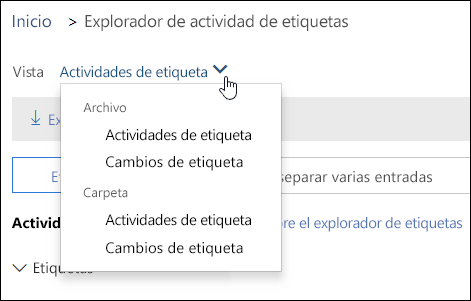
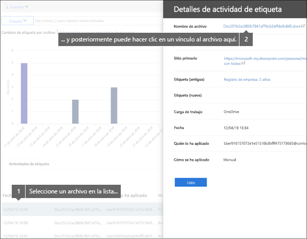
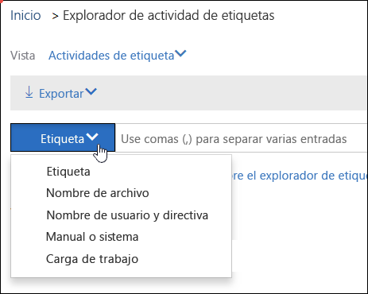

# Ver la actividad de etiquetas de documentosView label activity for documents

Después de crear las etiquetas, puede verificar que se aplicaron en el contenido según lo previsto. Con el Explorador de actividad de etiquetas en el Centro de seguridad y cumplimiento de &amp;, puede buscar y visualizar rápidamente actividades de etiquetas de todo el contenido en SharePoint OneDrive para la Empresa en los últimos 30 días. Estos son datos en tiempo real que le ofrecen una vista clara de lo que ocurre en el espacio empresarial.After you create your labels, you'll want to verify that they're being applied to content as you intended. With the Label Activity Explorer in the Security &amp; Compliance Center, you can quickly search and view label activity for all content across SharePoint and OneDrive for Business over the past 30 days. This is real-time data that gives you a clear view into what's happening in your tenant.
  
Por ejemplo, con el Explorador de actividad de etiquetas, puede:For example, with the Label Activity Explorer, you can:
  
- Ver el número de veces que cada etiqueta se aplicó cada día (hasta 30 días).View how many times each label was applied on each day (up to 30 days).
    
- Ver quién etiquetó exactamente cada archivo y en qué fecha, además de un vínculo al sitio donde se encuentra el archivo.See who labeled exactly which file on which date, along with a link to the site where that file resides.
    
- Ver los archivos donde se cambiaron o quitaron etiquetas, cuáles son las etiquetas nuevas y anteriores, y quién realizó el cambio.View which files had labels changed or removed, what the old and new labels are, and who made the change.
    
- Filtre los datos para ver toda la actividad de etiquetas de una etiqueta, archivo o usuario específicos. También puede filtrar la actividad de etiquetas por ubicación (SharePoint o OneDrive para la Empresa), así como filtrar dependiendo de si la etiqueta se aplicó automáticamente o de forma manual.Filter the data to see all the label activity for a specific label, file, or user. You can also filter label activity by location (SharePoint or OneDrive for Business) and whether the label was applied manually or auto-applied.
    
- Vea la actividad de etiquetas de carpetas, así como de documentos individuales. Próximamente, podrá mostrarse el número de archivos de la carpeta que se etiquetaron como resultado de etiquetar la carpeta.View label activity for folders as well as individual documents. Coming soon is the ability to show how many files inside that folder got labeled as a result of the folder getting labeled.
    
Encontrará el Explorador de actividad de etiquetas en el &amp;Centro de seguridad y cumplimiento > **Gobierno de información** > **Explorador de actividad de etiquetas**.You can find the Label Activity Explorer in the Security &amp; Compliance Center > **Information governance** > **Label activity explorer**.
  
Tenga en cuenta que, para usar el Explorador de actividad de etiquetas, se necesita una suscripción de Office 365 Enterprise E5.Note that the Label Activity Explorer requires an Office 365 Enterprise E5 subscription.
  

  
## Ver actividades de etiquetas de archivos o carpetasView label activities for files or folders

En la parte superior del Explorador de actividad de etiquetas, puede ver las actividades de archivos o carpetas. Tenga en cuenta que en la actividad de carpeta solo se incluye la carpeta en sí, no se incluyen los archivos dentro de la carpeta.At the top of the Label Activity Explorer, you can choose whether to view activities for files or folders. Note that folder activity includes only the folder itself, not the files inside the folder.
  
Puede que quiera ver la actividad de etiquetas de las carpetas porque, si etiqueta una carpeta, todos los archivos dentro de esa carpeta también se etiquetarán (excepto los archivos donde se aplicó una etiqueta de forma explícita). Por lo tanto, etiquetar carpetas podría afectar a un número elevado de archivos. Para obtener más información, vea [Aplicar una etiqueta de retención predeterminada a todo el contenido de una biblioteca, carpeta o conjunto de documentos de SharePoint](create-apply-retention-labels.md#applying-a-default-retention-label-to-all-content-in-a-sharepoint-library-folder-or-document-set).You might want to see label activity for folders because if you label a folder, all files inside that folder also get that label (except for files that have had a label applied explicitly to them). Therefore, labeling folders might affect a significant number of files. For more information, see [Applying a default retention label to all content in a SharePoint library, folder, or document set](create-apply-retention-labels.md#applying-a-default-retention-label-to-all-content-in-a-sharepoint-library-folder-or-document-set).
  

  
### Actividades de etiquetasLabel activities

 En **Actividades de etiquetas**, se incluyen todas las acciones de etiquetado: **agregar**, **quitar** o **cambiar** una etiqueta. Puede usar esta vista para obtener información completa sobre el número de archivos en los que se aplicó cada etiqueta por día.**Label activities** includes all label actions: **adding**, **removing**, or **changing** a label. You can use this view to get a comprehensive look at how many files each label's been applied to per day. 
  
### Cambios de etiquetasLabel changes

 En **Cambios de etiquetas**, se incluyen las acciones que pueden ser arriesgadas, como **quitar** o **cambiar** una etiqueta. Puede usar esta vista para ver rápidamente esas acciones arriesgadas y el usuario que las realizó. En la lista de actividades debajo del gráfico, puede seleccionar un archivo y, después, en el panel de detalles de la parte derecha, hacer clic en un vínculo a ese archivo.**Label changes** includes the potentially risky actions of **removing** or **changing** a label. You can use this view to quickly see such risky actions and the user who performed them. In the activity list below the chart, you can select a file, and then click a link to that file in the details pane on the right. 
  

  
## Filtrar actividad de etiquetasFilter label activity

Puede filtrar rápidamente los datos para ver toda la actividad de etiquetas de una etiqueta, archivo o usuario específicos. También puede filtrar la actividad de etiquetas por ubicación (SharePoint o OneDrive para la Empresa), así como filtrar dependiendo de si la etiqueta se aplicó automáticamente o de forma manual.You can quickly filter the data to see all the label activity for a specific label, file, or user. You can also filter label activity by location (SharePoint or OneDrive for Business) and whether the label was applied manually or auto-applied.
  

  

