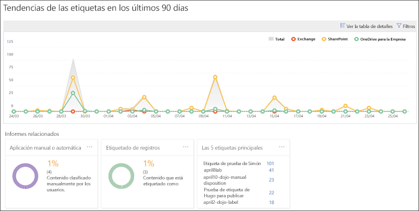
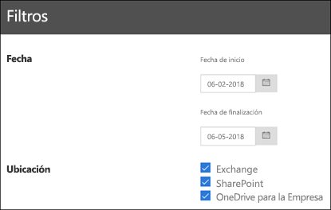

# Ver los informes de gobierno de datos

After you create your labels, you'll want to verify that they're being applied to content as you intended. With the data governance reports in the Security &amp; Compliance Center, you can quickly view:
  
- **Top 5 labels** This report shows the count of the top 5 labels that have been applied to content. Click this report to view a list of all labels that have been recently applied to content. You can see each label's count, location, how it was applied, its retention actions, whether it's a record, and its disposition type. 
    
- **Aplicación automática o manual** Este informe muestra el recuento de todo el contenido que se etiquetó de forma manual o automática, así como el porcentaje de contenido que se etiquetó de forma manual en comparación con el que se etiquetó de forma automática. 
    
- **Etiquetado de registros** Este informe muestra el recuento de todo el contenido que se etiquetó como un registro o no, y el porcentaje de contenido que se etiquetó como un registro en comparación con el que no. 
    
- **Tendencia de etiquetas en los últimos 90 días** Este informe muestra el recuento y la ubicación de todas las etiquetas que se aplicaron en los últimos 90 días. 
    
En todos estos informes, se muestra el contenido etiquetado de Exchange, SharePoint y OneDrive para la Empresa.
  
Encontrará estos informes en el Centro de seguridad&amp; y cumplimiento \> **Gobierno de datos** \> **Panel**.
  

  
You can filter the data governance reports by date (up to 90 days) and location (Exchange, SharePoint, and OneDrive for Business). The most recent data can take up to 24 hours to appear in the reports.
  

  

