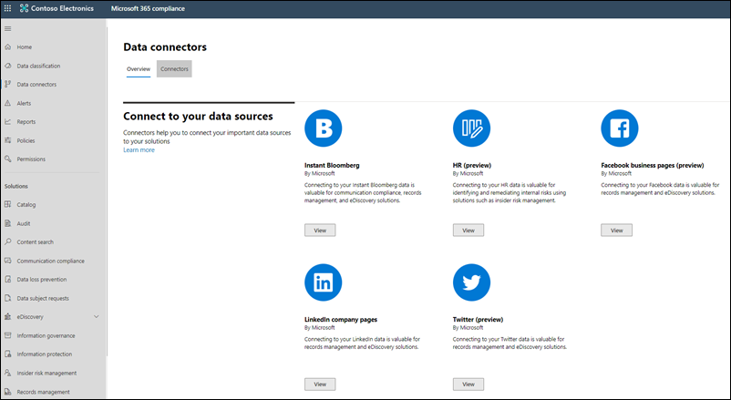

# Novedades de Cumplimiento de Microsoft 365

Tanto si va a agregar nuevas soluciones en el [centro de cumplimiento de microsoft 365](microsoft-365-compliance-center.md), a la actualización de características existentes en función de sus comentarios o a la actualización de documentación actualizada y actualizada, Microsoft 365 le ayudará a mantenerse al tanto del panorama de cumplimiento en constante cambio. Eche un vistazo a continuación para ver las novedades del cumplimiento de Microsoft 365 en la actualidad. 

> [!NOTE]
> Algunas características de cumplimiento se implementan a los clientes a velocidades diferentes. Si aún no ve una característica, pruebe a agregarse a la [versión dirigida](https://docs.microsoft.com/office365/admin/manage/release-options-in-office-365).

> [!TIP]
> ¿Está interesado en lo que ocurre en otros centros de administración? Consulte estos artículos: [Novedades en el centro de administración de 365 de Microsoft](https://docs.microsoft.com/office365/admin/whats-new-in-preview?view=o365-worldwide) [Novedades en el centro de administración de SharePoint](https://docs.microsoft.com/sharepoint/what-s-new-in-admin-center) [Novedades de Microsoft 365 Defender](https://docs.microsoft.com/microsoft-365/security/mtp/whats-new)  
Y visite el [mapa de ruta de microsoft 365](https://www.microsoft.com/en-us/microsoft-365/roadmap) para saber más sobre las características de 365 Microsoft que se lanzaron, están en desarrollo, se han cancelado o han sido publicadas anteriormente.

## Octubre de 2020

### eDiscovery avanzado

[Compatibilidad con el idioma CJK](ediscovery-cjk-support.md). EDiscovery avanzado ahora admite idiomas de juegos de caracteres de doble byte, denominados conjuntamente idiomas CJK (incluye chino simplificado, Chino tradicional, Japonés y Coreano). Se pueden usar en varios escenarios de conjunto de revisión avanzado.

### Etiquetas de confidencialidad

- [Ámbito](sensitivity-labels.md#label-scopes)de la etiqueta. Al crear una etiqueta de confidencialidad, verá una nueva opción para definir el ámbito de la etiqueta. Esta opción permite configurar etiquetas solo para archivos y mensajes de correo electrónico, contenedores (como sitios y equipos de SharePoint) o ambos.
- [Marcado de contenido dinámico](sensitivity-labels-office-apps.md#dynamic-markings-with-variables). Al configurar la marcación de contenido para una etiqueta de confidencialidad, ahora puede usar las variables dinámicas como `${Item.Label}` y `${Item.Location}` en la cadena de texto del encabezado, pie de página o marca de agua.

## Septiembre de 2020

### Spotlight: administrador de cumplimiento

Anunciado en encendido este año, la puntuación de cumplimiento se ha cambiado de marca como [Administrador de cumplimiento](compliance-manager.md). En esta versión se completa la transición desde el inicio anterior del administrador de cumplimiento en el portal de confianza del servicio y se presenta una solución de administración de cumplimiento de un extremo a otro en el centro de cumplimiento de Microsoft 365.

Vea el vídeo a continuación para obtener información sobre cómo el administrador de cumplimiento puede ayudarle a simplificar la administración del cumplimiento por parte de su organización.
 
 
>[!VIDEO https://www.microsoft.com/videoplayer/embed/RE4FGYZ]

### Auditoría avanzada

- Nueva retención de 10 años de registros de auditoría que permite realizar investigaciones de larga duración y responder a obligaciones regulatorias, legales e internas.
- [Tres nuevos eventos importantes](advanced-audit.md#access-to-crucial-events-for-investigations). Los siguientes nuevos eventos pueden ayudarle a investigar posibles infracciones y a determinar el ámbito de peligro: Send, SearchQueryInitiatedExchange y SearchQueryInitiatedSharePoint.

### Cumplimiento de las comunicaciones

- [Grupos de roles actualizados](communication-compliance-configure.md#step-1-required-enable-permissions-for-communication-compliance). Los grupos de funciones de cumplimiento de comunicaciones ahora coinciden con la estructura de grupo de roles disponible para la solución de administración de riesgos de Insider.
- [Panel informes](communication-compliance-feature-reference.md#reports-preview). La ubicación central para ver todos los informes de cumplimiento de la comunicación. Los widgets de informe proporcionan una vista rápida de la información más necesaria para una evaluación general del estado de las actividades de cumplimiento de la comunicación.
- [Flujos de alimentación automatizada](communication-compliance-feature-reference.md#power-automate-flows-preview). Configure los flujos para automatizar tareas para alertas y usuarios, notificar a los administradores cuando los usuarios desencadenen una alerta y mucho más.
- [Acción de corrección de ' mejorar clasificación '](communication-compliance-investigate-remediate.md#step-3-decide-on-a-remediation-action). Las alertas que contienen elementos que coinciden con los clasificadores que se pueden entrenar podrían beneficiarse de los comentarios para ayudar a minimizar los falsos positivos en la organización. La opción **mejorar clasificación** le permite proporcionar comentarios sobre si los elementos detectados coinciden con el clasificador configurado en la Directiva de cumplimiento de comunicaciones relacionada. Incluso puede sugerir otros clasificadores para asociarlos con el elemento para mejorar la precisión de la coincidencia en las alertas futuras.

### Conectores de datos

- [Nuevos conectores de datos de terceros](archiving-third-party-data.md#third-party-data-connectors). 25 conectores de datos nuevos, incluidos 14 conectores de Globanet y 8 desde telemessage.
- [Conector distintivos físico](import-physical-badging-data.md). Importación de datos de distintivos físicos, como los eventos de acceso físico sin procesar del empleado o las alarmas de acceso físico generadas por el sistema de distintivos de su organización. Algunos ejemplos son entradas a edificios, salas de servidores o centros de datos. La solución de administración de riesgos de Insider puede usar los datos de distintivos físicos para ayudar a proteger a su organización de la actividad malintencionada o del robo de datos dentro de la organización.

### Administración de riesgos internos

- [Integración de Microsoft Teams](insider-risk-management-settings.md#microsoft-teams-preview). Cuando la integración de Teams está activada en la configuración de riesgos de Insider, puede coordinar y colaborar con otras partes interesadas en Microsoft Teams para tareas como compartir y almacenar de forma segura los datos relacionados con casos individuales, realizar un seguimiento y revisar las actividades de respuesta de analistas e investigadores, entre otros.
- [Flujos de alimentación automatizada](insider-risk-management-settings.md#power-automate-flows-preview). Configure los flujos para automatizar tareas importantes para casos y usuarios, como recuperar información de usuarios, alertas y casos para compartirlos con las partes interesadas y otras aplicaciones, automatizar acciones como publicar en notas de caso, etc.
- [Explorador de actividades](insider-risk-management-alerts.md#activity-explorer-preview). Disponible al revisar alertas, el explorador de actividades proporciona a los investigadores y analistas una completa herramienta analítica para profundizar en cada alerta. Revise rápidamente una escala de tiempo de actividad de riesgo detectada e identifique y filtre todas las actividades de riesgo asociadas con las alertas.

### Directivas de retención y etiquetas de retención

- [Compatibilidad con Yammer](retention-policies-yammer.md). Ahora puede usar directivas de retención para conservar y eliminar mensajes de la comunidad de Yammer y mensajes privados.
- [Aplicar etiquetas a las grabaciones de reuniones de Microsoft Teams](apply-retention-labels-automatically.md#microsoft-teams-meeting-recordings). Al crear una directiva de etiquetado automático, use el editor de consultas de palabras clave para identificar las grabaciones de reuniones de Microsoft teams que se almacenan en las cuentas de OneDrive de los usuarios o en SharePoint.

### Administración de registros

[Soporte para registros normativos](declare-records.md#how-to-display-the-option-to-mark-content-as-a-regulatory-record). La clasificación de una etiqueta como registro normativo aumenta las restricciones del contenido al que se aplica la etiqueta y limita las acciones de administración disponibles para la propia etiqueta. Por ejemplo, después de que se aplica al contenido, nadie, ni siquiera un administrador global, puede quitar la etiqueta. [Obtenga más información](records-management.md#compare-restrictions-for-what-actions-are-allowed-or-blocked) sobre las acciones permitidas y bloqueadas para los registros regulatorios.

### Etiquetas de confidencialidad

[Soporte para clientes del gobierno de Estados Unidos](https://docs.microsoft.com/enterprise-mobility-security/solutions/ems-aip-premium-govt-service-description). Las etiquetas de confidencialidad ahora son compatibles con los clientes GCC, GCC High y DoD, solo para el cliente de etiquetación Unificado de Azure Information Protection y el analizador.

### Clasificadores que se pueden entrenar

Las nuevas funciones de comentarios y reentrenamiento ayudan a mejorar la precisión y minimizar las coincidencias positivas falsas para todos los clasificadores personalizados y algunos clasificadores preparados previamente. Este flujo le permite enviar comentarios sobre si los elementos coinciden con determinados clasificadores, sugerir otros clasificadores para asociarlos a los elementos y volver a entrenar a los clasificadores para refinar y mejorar la precisión de la coincidencia.

Esta nueva capacidad se incluye en las siguientes características:

> [!NOTE]
> Para todas las características, si proporciona al menos 30 respuestas de comentarios, crearemos una versión reentrenada del clasificador que puede revisar. Si hay mejoras, puede volver a publicar el clasificador.

- [Clasificadores que se capacitan](classifier-learn-about.md#retraining-classifiers). Para mejorar la precisión de los clasificadores publicados, puede enviar comentarios sobre si los elementos detectados coinciden con el clasificador.
- [Cumplimiento](classifier-how-to-retrain-comms-compliance.md)de la comunicación. La nueva acción de corrección para **mejorar la clasificación** permite enviar comentarios si un elemento de una alerta de cumplimiento de comunicaciones coincide con el clasificador configurado en la Directiva de cumplimiento de la comunicación.
- [Explorador de contenido](classifier-how-to-retrain-content-explorer.md). Si configura una directiva de etiquetado automático de retención para aplicar automáticamente etiquetas a los mensajes de correo electrónico que coinciden con los clasificadores que se pueden entrenar, puede usar el explorador de contenido para revisar los elementos etiquetados y proporcionar comentarios sobre si los elementos coinciden con el clasificador.

## Agosto de 2020

### Spotlight: riesgos de Insider y actualizaciones de cumplimiento de comunicaciones

Varias características nuevas y mejoradas se resaltan en la vista previa pública este mes:

**Administración de riesgos internos**

- Consulte nuestras seis nuevas [plantillas de directiva](insider-risk-management-policies.md#policy-templates):
    - Pérdidas de datos por usuarios con prioridad
    - Pérdidas de datos por usuarios descontentos
    - Infracciones de directivas de seguridad generales
    - Infracciones de directivas de seguridad mediante la desactivación de usuarios
    - Infracciones de directivas de seguridad por usuarios con prioridad
    - Violaciones de directivas de seguridad por usuarios descontentos

- La integración con [Microsoft defender for Endpoint](https://docs.microsoft.com/windows/security/threat-protection/microsoft-defender-atp/microsoft-defender-advanced-threat-protection) le permite importar y filtrar las alertas de Microsoft defender para Endpoint para actividades detectadas mediante directivas creadas a partir de las nuevas plantillas de directiva de violación de la seguridad. También hay una configuración de [riesgo de Insider](insider-risk-management-settings.md#microsoft-defender-for-endpoint-preview) relacionada en la que puede elegir importar alertas de seguridad a la administración de riesgos de Insider basada en el estado de clasificación de alertas de Microsoft defender para el punto de conexión.

    > [!NOTE]
    > Para aprovechar las ventajas de Microsoft defender para la integración de extremos (incluidas las nuevas plantillas de violación de directivas de seguridad), necesitará tener Microsoft defender para Endpoint configurado en su organización. También necesitará habilitar Microsoft defender para que Endpoint para la integración de la administración de riesgos de Insider mediante la [configuración de características avanzadas en Microsoft defender para Endpoint](https://docs.microsoft.com/windows/security/threat-protection/microsoft-defender-atp/advanced-features#share-endpoint-alerts-with-microsoft-compliance-center).
 
- Personalice los umbrales de indicador al [crear una directiva](insider-risk-management-policies.md#create-a-new-policy).
- Configure los [grupos de usuarios con prioridad](insider-risk-management-settings.md#priority-user-groups-preview) para definir los usuarios de la organización cuya actividad requiere una inspección más cercana en función de factores como su posición, el nivel de acceso a la información confidencial o el historial de riesgos.
- Use las API de actividad de administración de Office 365 para exportar los detalles de alertas de los [riesgos de Insider](insider-risk-management-settings.md#export-alerts-preview) a otras aplicaciones que su organización pueda usar para administrar o agregar datos de riesgos de Insider.
- La nueva [configuración de dominio](insider-risk-management-settings.md#domains-preview) ayuda a definir y controlar los niveles de riesgo para la actividad en dominios específicos.

**Cumplimiento de las comunicaciones**

- Al [Revisar mensajes en una alerta](communication-compliance-investigate-remediate.md#step-3-decide-on-a-remediation-action), ahora puede quitar los mensajes inapropiados en los canales de Microsoft Teams, el 1:1 y los chats en grupo. Los mensajes y el contenido quitados se sustituyen por una sugerencia de directiva que explica que se ha quitado debido al contenido confidencial.
- Nuevos [roles de comunicación](communication-compliance-configure.md#step-1-required-enable-permissions-for-communication-compliance) (también se incluirán en los nuevos grupos de funciones de cumplimiento de comunicaciones que se publican en septiembre).
- Nueva experiencia de configuración de cumplimiento de comunicaciones que incluye la configuración de [las plantillas](communication-compliance-feature-reference.md#notice-templates)de [privacidad](communication-compliance-feature-reference.md#privacy-preview) y notificación.
- Nuevos [clasificadores](communication-compliance-feature-reference.md#classifiers) para ayudar a detectar las imágenes de adultos, racy y Gory.
- La nueva notificación ' modelo detectado ' que aparece al [Revisar mensajes en una alerta](communication-compliance-investigate-remediate.md#step-2-examine-the-message-details) le permite conocer las instancias recurrentes del mismo comportamiento de un usuario.

### Etiquetas de confidencialidad

- Para los inquilinos del Gobierno de los EE. UU. (GCC, GCC-H y DoD), las etiquetas de confidencialidad solo son compatibles con el cliente de etiquetado unificado y el escáner de Azure Information Protection. Para obtener más información, consulte la [Descripción del servicio Premium para la Administración Pública de Azure Information Protection](https://docs.microsoft.com/enterprise-mobility-security/solutions/ems-aip-premium-govt-service-description).
- Ahora puede [usar el PowerShell del centro de cumplimiento de & de seguridad](create-sensitivity-labels.md#use-powershell-for-sensitivity-labels-and-their-policies) para crear y configurar todas las opciones que aparecen en el centro de administración de etiquetas. Esto significa que, además de usar PowerShell para las opciones de configuración que no están disponibles en los centros de administración de etiquetas, ahora puede crear un script completo de la creación y el mantenimiento de las etiquetas de confidencialidad y las directivas de etiqueta de confidencialidad.

### Administración de registros: revisión del contenido

Documentos nuevos que cubren los pasos de implementación, marcando contenido como registros y control de versiones de registros:

- [Introducción a la administración de registros](get-started-with-records-management.md)
- [Use etiquetas de retención para declarar registros](declare-records.md)
- [Use el control de versiones de registros para actualizar los registros almacenados en SharePoint o OneDrive](record-versioning.md)

### Etiquetas de retención & directivas

La actividad de administración relacionada con la retención ahora se registra y está disponible para su revisión en el registro de auditoría. Para obtener la lista completa, consulte las [Actividades de las directivas y etiquetas de retención](search-the-audit-log-in-security-and-compliance.md#retention-policy-and-retention-label-activities).

### eDiscovery avanzado

- Al [Agregar una recopilación a un conjunto de revisión](add-data-to-review-set.md#define-options-to-scope-your-collection-for-review), ahora puede incluir datos adjuntos modernos (también denominados "datos adjuntos de la nube") y versiones de documentos de SharePoint.
- Nueva [experiencia de exportación de descarga directa](export-documents-from-review-set.md), que elimina la necesidad de usar el explorador de almacenamiento de Azure para descargar el contenido de los casos.

## Julio de 2020

### Destacarse en los documentos de ayuda

Para ayudarle a comprender qué soluciones de cumplimiento se usan para proteger y regir los datos confidenciales de su organización, hemos creado dos nuevas páginas de aterrizaje con una visión general de cómo funcionan las soluciones en conjunto para lograr esos objetivos, incluidos los vínculos a documentos relacionados para que pueda profundizar aún más.

[Protección de la información de Microsoft en Microsoft 365](information-protection.md) 
[Gobierno de la información de Microsoft en Microsoft 365](manage-Information-governance.md)

### Exhibición avanzada de documentos electrónicos: agregar orígenes de datos que no sean de Private a sus casos

Agregar datos a un caso sin tener que asociarlo a un custodio (conocido como [orígenes de datos que no son de privación](non-custodial-data-sources.md)). Además, si necesita poner estos datos que no son de un modo de conservación, podrá hacerlo usando nuestra nueva característica de indización avanzada.

### Conectores de datos: mejoras en el conector de RRHH

(En versión preliminar) Una nueva versión del [conector de recursos humanos](import-hr-data.md) permite importar datos relacionados con los cambios en el nivel de trabajo, las revisiones de rendimiento y los planes de mejora del rendimiento. A continuación, estos datos se pueden usar en varias [directivas de riesgos de Insider](insider-risk-management-policies.md) para detectar actividades relacionadas.

### Etiquetas de retención: nueva compatibilidad para correo electrónico

Ahora puede crear una [etiqueta de retención](retention.md#retention-labels) para comenzar a retener el correo electrónico en función de la etiqueta de los mensajes. Esto no se aplica a los elementos del calendario, que se conservarán en función de Cuándo se envía el elemento.

### Etiquetas de confidencialidad: nueva característica y una mejora

- (En versión preliminar) Al configurar las opciones de cifrado para una etiqueta, busque la nueva opción para usar el [cifrado de doble clave](encryption-sensitivity-labels.md#double-key-encryption) para proteger los archivos y mensajes de correo electrónico con etiquetas.
- Al crear o eliminar las etiquetas de confidencialidad o al crear, editar o eliminar sus directivas de etiquetas, los cambios se sincronizarán en un plazo de 1 hora para todos los usuarios, aplicaciones y servicios.

## Junio de 2020

### Spotlight: nueva vista previa de conectores de datos

A partir de nuestra promesa de ayudarle a importar datos de más orígenes de terceros a Microsoft 365, nos complace anunciar la versión preliminar de dos conectores de datos más:

- [Mensaje Bloomberg](archive-bloomberg-message-data.md). Importe y Archive los datos de correo electrónico de servicios financieros de la herramienta de colaboración de mensajes de Bloomberg. Una vez almacenados los datos en los buzones, puede tener acceso a los datos y usarlos en características de cumplimiento, como la retención por juicio, la búsqueda de contenido, el archivado local, la auditoría, el cumplimiento de comunicación y las directivas de retención.
- [Chat de hielo](archive-icechat-data.md). Importe y Archive los datos de chat de servicios financieros de la herramienta de colaboración de chats de ICE. Una vez que los datos se almacenan en buzones, puede tener acceso a los datos y usarlos en características de cumplimiento, como retenciones por juicio, exhibición de documentos electrónicos, archivado, auditoría, cumplimiento de comunicación y directivas de retención.

### Puntuación de cumplimiento & el administrador de cumplimiento: las visitas siguen llegando

Las actualizaciones de junio incluyen una nueva vista de desglose de evaluación en la [puntuación de cumplimiento](compliance-score.md). Supervise el progreso del control, agregue, elimine evaluaciones directamente desde la puntuación de cumplimiento y mucho más.

¿Desea estar al tanto de las actualizaciones de la puntuación de cumplimiento y del administrador de cumplimiento? Marque las [notas de versión de puntuación de cumplimiento](compliance-score-release-notes.md) y vuelva a consultar con frecuencia.

## Mayo de 2020

### Spotlight: la clasificación de datos se ha lanzado oficialmente

La clasificación de datos, aka "[conoce sus datos](data-classification-overview.md)", características (análisis, explorador de contenido y explorador de actividades) se han graduado desde la fase de vista previa y están disponibles para todas las organizaciones. Los poderosos consejos y herramientas pueden ayudarle a descubrir y evaluar la forma en que se usan la información confidencial y las etiquetas (retención y confidencialidad) en el contenido de la organización. Revise el contenido que contiene información confidencial o tiene etiquetas aplicadas, explore la actividad de la etiqueta en las ubicaciones de Microsoft 365, cree tipos personalizados de información confidencial, etc.

Realice un recorrido en vídeo...

> [!VIDEO https://www.microsoft.com/videoplayer/embed/RE4vx8x]

### Clasificadores capacitados: una corrección y una característica

Puede aportar más mejoras a los clasificadores que se pueden entrenar:

- Una corrección basada en sus comentarios: al inicializar y entrenar un clasificador personalizado, ya no necesita escribir manualmente las direcciones URL del sitio de SharePoint y las rutas de la carpeta. Ahora puede elegir entre una lista de sitios y carpetas rellenados previamente.
- Nueva característica: al crear una etiqueta de confidencialidad y configurar las opciones de etiquetación automática para las aplicaciones de Office, ahora puede aplicar automáticamente (o recomendar que los usuarios apliquen) la etiqueta al contenido que coincide con los clasificadores que se pueden entrenar. [Más información](apply-sensitivity-label-automatically.md#configuring-trainable-classifiers-for-a-label)

### Cumplimiento de la comunicación: aquí está el soporte técnico de Yammer

Las directivas de cumplimiento de comunicaciones admiten mensajes privados y conversaciones públicas de la comunidad en Yammer. Yammer es un canal opcional y debe estar en [modo nativo](https://docs.microsoft.com/yammer/configure-your-yammer-network/overview-native-mode) para admitir el examen de mensajes y datos adjuntos.

### Prevención de pérdida de datos: nueva restricción de uso compartido

Al configurar una directiva DLP para proteger el contenido en SharePoint o en OneDrive, ahora puede configurar la acción "restringir el acceso al contenido" para bloquear a los usuarios a los que se les concedido acceso al contenido mediante la opción "[todos los usuarios con el vínculo](https://support.microsoft.com/office/share-files-outside-your-organization-with-anyone-links-53e91027-fb8e-4a6e-a3e4-5df4be32e38a)".

### Administración de riesgos de Insider: personalización del volumen de alertas

Las actividades de usuario detectadas por las directivas de riesgo de Insider tienen asignada una puntuación de riesgo específica, que a su vez determina la gravedad de la alerta (baja, media, alta). De forma predeterminada, Microsoft 365 genera una determinada cantidad de alertas de gravedad baja, media y alta, pero con la nueva [configuración de volumen de alerta](insider-risk-management-settings.md#alert-volume), puede aumentar o disminuir el volumen según sus necesidades.

### Importación de PST: nueva región admitida

La carga de red ya está disponible en los Emiratos Árabes Unidos.

### Etiquetas de confidencialidad: nueva opción de privacidad

Al configurar las [Opciones de sitio y grupo](sensitivity-labels-teams-groups-sites.md#how-to-configure-groups-and-site-settings) de una etiqueta, ahora puede establecer la opción de privacidad en ninguno, permitir que el **usuario elija quién puede tener acceso al sitio**. Esto es útil cuando desea proteger el contenido en el contenedor usando una etiqueta de confidencialidad, pero sigue permitiendo que los usuarios configuren la configuración de privacidad.

## Abril de 2020

### Administración de registros: revisión... y una nueva adición

Abril incluye un par de actualizaciones clave para nuestra solución de administración de registros:

- La sección "administración de registros" ya está completamente disponible en el centro de cumplimiento. Aproveche las ventajas de las interfaces de usuario y la funcionalidad actualizadas para el plan de archivos, las etiquetas de retención y las directivas de etiquetas, eventos y disposición.
- Hablando de disposición, también se ha implementado una [prueba de la disposición](disposition.md#disposition-of-records) para los registros de SharePoint y OneDrive. Ahora puede ver una lista de elementos en aquellas ubicaciones que se han eliminado automáticamente o después de una revisión de disposición.

### Etiquetas de confidencialidad: vista previa de directivas de etiquetado automático

Con las directivas de etiquetado automático, ahora puede aplicar automáticamente las etiquetas de confidencialidad a los documentos de SharePoint y OneDrive que ya están guardados (también conocidos como datos en reposo) y correos electrónicos que ya se han enviado o recibido (también conocido como "correo electrónico en tránsito"). Debido a que la etiquetación se aplica a los servicios en lugar de a las aplicaciones, no tiene que preocuparse de qué aplicaciones tienen los usuarios y de la versión.

Esta capacidad amplía la etiqueta del lado cliente existente que ya está incluida en la configuración de "etiquetado automático para aplicaciones de Office" cuando se crea una etiqueta de confidencialidad. Para familiarizarse con las diferencias y las ventajas de las opciones de etiquetado automático, consulte el [artículo actualizado](apply-sensitivity-label-automatically.md).

## Marzo de 2020

### Introducción a la auditoría avanzada

La [auditoría avanzada de Microsoft 365](advanced-audit.md) presenta nuevas funciones de auditoría que pueden ayudar a su organización con investigaciones forenses y de cumplimiento. Los elementos destacados incluyen la retención a largo plazo de los registros de auditoría, las directivas de retención del registro de auditoría personalizado, la nueva acción de auditoría de buzón de *MailItemsAccessed* y la introducción de un nuevo límite de limitación a nivel de inquilino, que proporciona a su organización su propia cuota de ancho de banda completamente asignada para tener acceso a los datos de auditoría.

### Puntuación de cumplimiento & el administrador de cumplimiento: Obtenga una vista previa de las mejoras más recientes

Las actualizaciones clave para esta versión preliminar incluyen:

- Proceso simplificado para crear y modificar plantillas
- Aviso y control de versiones para plantillas y acciones
- Sincronización de acciones comunes entre grupos
- Compatibilidad con idiomas ahora extendida a chino (simplificado), Chino (tradicional), Francés, alemán, Italiano, Japonés, Coreano, Portugués (Brasil), Ruso y español

Obtenga más información sobre la [puntuación de cumplimiento](compliance-score.md) y el [Administrador de cumplimiento](compliance-manager-overview.md)

### Etiquetas de confidencialidad: compatibilidad con la etiqueta de archivos de Office en SharePoint y OneDrive (versión preliminar)

La habilitación de la vista previa permite a los usuarios aplicar etiquetas de confidencialidad en Office en la Web. Podrán ver el botón de **confidencialidad** en la cinta y el nombre de etiqueta aplicado en la barra de estado. Además, si usan aplicaciones de escritorio para etiquetar y, a continuación, guardan sus archivos en SharePoint o OneDrive, Microsoft 365 ahora podrá procesar el contenido de estos archivos si se ha aplicado la configuración de cifrado a la etiqueta. En estas circunstancias también se admitirá la coautoría, la exhibición de documentos electrónicos, la prevención de pérdida de datos, la búsqueda y otras características de colaboración.

[Obtener información sobre cómo habilitar la vista previa](sensitivity-labels-sharepoint-onedrive-files.md)

## Febrero de 2020

### Se ha lanzado oficialmente la administración de riesgos de Insider

Rollo de tambor, por... La administración de riesgos de Insider ahora está disponible para las organizaciones con las siguientes suscripciones:

- [Microsoft 365 E5](https://go.microsoft.com/fwlink/?linkid=2120431) (pago o de prueba)
- Suscripción a Microsoft 365 Enterprise E3 con el [complemento de cumplimiento de Microsoft E5](https://go.microsoft.com/fwlink/?linkid=2120432)

Se ha dado por hecho que hemos realizado algunas mejoras desde la versión preliminar, incluidos los [nuevos grupos de roles](insider-risk-management-configure.md#step-1-enable-permissions-for-insider-risk-management) y [la configuración de toda la solución](insider-risk-management-configure.md#step-4-configure-insider-risk-settings).

Como siempre, envíe sus comentarios a medida que use la solución para que podamos seguir realizando mejoras.

### Administración de registros

Esta nueva solución aporta todas las capacidades de administración de registros bajo un solo paraguas. Los elementos destacados incluyen la introducción de versiones de registros para SharePoint y OneDrive y la prueba de eliminación de registros.

[Obtenga más información sobre la administración de registros](records-management.md)

### Información destacada de la solución: conectores de datos para Facebook y Twitter

Los conectores de datos se [publicaron el mes pasado](#just-launched) y estamos buscando ayuda en la prueba de los siguientes conectores.

- [Páginas empresariales de Facebook](archive-facebook-data-with-sample-connector.md). Importa y archiva datos de las páginas de empresa de Facebook a Microsoft 365. Beneficioso para las soluciones de cumplimiento como la administración de registros y la exhibición de documentos electrónicos.
- [Twitter](archive-twitter-data-with-sample-connector.md). Importa y archiva datos de Twitter a Microsoft 365. Beneficioso para las soluciones de cumplimiento como la administración de registros y la exhibición de documentos electrónicos.

Mientras configura y valida estos conectores, envíenos sus comentarios sobre lo que ha ido bien, lo que no y lo que podemos hacer para mejorar la experiencia.

## Enero de 2020

La espera ha finalizado. Nos complace anunciar que el centro de cumplimiento de Microsoft 365 está disponible para todos los clientes con los planes de Microsoft 365, Office 365, Enterprise Mobility + Security (EMS) y Windows 10 Enterprise. Los datos o las directivas que estuviera administrando en el centro de cumplimiento de seguridad & están disponibles en el centro de cumplimiento, por lo que no es necesario saltar hacia delante y hacia atrás.

> [!TIP]
> Vuelva a leer la actualización del mes anterior para obtener una vista previa de algunas de las [nuevas soluciones](#new-compliance-solutions) que hemos mostrado recientemente, así como un [plan de desarrollo](#updated-compliance-solutions) que muestra dónde se encuentran ahora las características de cumplimiento del centro de seguridad & cumplimiento en Microsoft 365.

Marque y recorra ahora para repasar su punto de partida [https://compliance.microsoft.com](https://compliance.microsoft.com) único para administrar el cumplimiento en su organización... o [Lea este artículo](microsoft-365-compliance-center.md) para profundizar un poco más.

También hemos lanzado soluciones nuevas y actualizadas este mes. Este es un vistazo rápido a los puntos destacados.

### Ahora en versión preliminar

**Administración de riesgos de Insider (versión preliminar)**

Nos complace anunciar que nuestra solución de administración de riesgos de Insider se encuentra ahora en versión preliminar pública. En pocas palabras, la administración de riesgos de Insiders ayuda a su organización a identificar de forma inteligente y a emprender acciones sobre los riesgos de Insider proporcionando:

- Controles de anonimato que ayudan a garantizar la privacidad del usuario.
- Plantillas de directivas inteligentes con indicadores nativos y de terceros que identifican las amenazas internas, como las pérdidas de datos.
- Flujos de trabajo de investigación end-to-end integrados que se extienden por los equipos de ti, recursos humanos y legales.

Nos encantaría oír su opinión. Cuando use la solución, déjenos comentarios para asegurarnos de que estamos satisfaciendo sus necesidades a medida que nos encontramos en la disponibilidad general.

[Obtenga más información sobre la administración de riesgos de Insiders](insider-risk-management.md)

### Acaba de iniciar

**Cumplimiento de las comunicaciones**

Graduación de la fase de vista previa a la disponibilidad completa, el cumplimiento de la comunicación es un componente clave de nuestro nuevo conjunto de soluciones de riesgo de Insider. Esta sólida solución ayuda a minimizar los riesgos de comunicación mediante flujos de trabajo para detectar, investigar y realizar acciones de corrección para los mensajes que no cumplen los estándares de la organización.

Los comentarios de los clientes durante la vista previa resultaron fantásticos. Resultó en varias mejoras, incluida una experiencia de primera ejecución para ayudarle a empezar, mejoras en las acciones de investigación y corrección, entre otras cosas.

[Obtenga más información sobre el cumplimiento de la comunicación](communication-compliance.md)

**Conectores de datos**

Anteriormente compartiendo espacio con otras características de ' importación ' en el centro de seguridad & cumplimiento de Office 365, los conectores de datos ahora tienen su propio hogar en el centro de cumplimiento de Microsoft 365. Use la nueva página "conectores de datos" para importar y archivar datos de los archivos de recursos humanos de la organización (HR) y varias plataformas de terceros (como Facebook, LinkedIn, Twitter y el modo Instant Bloomberg) a los buzones de la organización de Microsoft 365. Una vez importado, estos datos se pueden administrar en varias soluciones de cumplimiento, como eDiscovery, la administración de riesgos de Insider, el cumplimiento de comunicaciones, las directivas de retención, y más.

[Obtenga más información sobre conectores de datos](archiving-third-party-data.md)

### Actualizaciones notables

**Nuevas plantillas de evaluación para la puntuación de cumplimiento (versión preliminar)**

Siempre trabajando duro para ayudarle a adelantarse al panorama de cumplimiento en constante evolución, nuestro equipo de puntuación de cumplimiento ha enviado un nuevo conjunto de plantillas para ayudarle a evaluar la postura de cumplimiento de la organización con respecto a las normativas recientes y obtener orientación sobre cómo implementar controles más efectivos. Verá nuevas plantillas para:

- ISO/IEC 27701:2019
- Ley de privacidad del consumidor de California (CCPA)
- Ley de protección de datos general de Brasil (lei Geral de proteção de dados-LGPD)
- SOC 1 tipo 2 y SOC 2 tipo 2

[Más información sobre las plantillas de puntuación de cumplimiento](compliance-score.md#templates)

## Noviembre & 2019 de diciembre

Durante las vacaciones, empezamos a implementar todas las grandes soluciones de cumplimiento que se mostraban en la demostración. La mayoría de estos están en un estado de vista previa, por lo que debe probarlos y asegurarse de que sabemos lo que piensa al abrir la tarjeta de comentarios en la parte inferior derecha del centro de cumplimiento.

### Familiarizarse con el nuevo entorno

El nuevo centro de cumplimiento de Microsoft 365 incluye soluciones completamente nuevas, así como las características de cumplimiento que conoce y que le gustan del centro de seguridad & cumplimiento de Office 365. Vamos a profundizar un poco más...

#### Nuevas soluciones de cumplimiento

Es posible que se pregunte qué es una *solución* . En la medida en que la nube ha revolucionado la forma en que se lleva a cabo el negocio, también se abre la puerta de nuevos métodos de robo y fraude de datos, y se necesitan nuevas regulaciones. Nuestras soluciones de cumplimiento son colecciones de capacidades integradas que pueden ayudarle a administrar estos requisitos de cumplimiento en constante evolución. Las capacidades de una solución pueden incluir una combinación de directivas, alertas, informes, etc.

Este es un resumen de las nuevas soluciones que encontrará. No deje de mirarlas a los demás.

> [!NOTE]
> Estas soluciones se encuentran solo en el centro de cumplimiento de Microsoft 365. No se pueden administrar en el centro de seguridad & cumplimiento de Office 365.
 

|**Nueva solución**|**Descripción**|**Más información**|
|:-----|:-----|:-----|
|Puntuación de cumplimiento de Microsoft (versión preliminar)  |Basado en el [Administrador de cumplimiento](compliance-manager-overview.md), la puntuación de cumplimiento es una característica independiente con un diseño más sencillo y más fácil de entender que le ayuda a comprender y mejorar la postura de cumplimiento de la organización. Calcula una puntuación basada en riesgos que mide su progreso en la realización de acciones que ayudan a reducir los riesgos en torno a la protección de datos y los estándares normativos.  |[Información general sobre la puntuación de cumplimiento de Microsoft (versión preliminar)](compliance-score.md)|
|Catálogo de soluciones (versión preliminar)  |El catálogo de soluciones es su único punto de partida para descubrir, aprender y comenzar rápidamente con nuestras soluciones de administración de riesgos y cumplimiento. El catálogo está organizado en tres categorías de cumplimiento, cada una de las cuales contiene detalles sobre las soluciones que conforman esa categoría. Las categorías incluyen protección de la información & gobernanza, administración de riesgos de Insider y respuesta de & de detección  |[Información general sobre el catálogo de soluciones (versión preliminar)](microsoft-365-solution-catalog.md)|
|Cumplimiento de la comunicación (versión preliminar)  |El cumplimiento de la comunicación forma parte de la nueva categoría de administración de riesgos de Insider, que ayuda a minimizar los riesgos de comunicación al ayudarle a detectar, capturar y realizar acciones de corrección para los mensajes inapropiados de su organización. La soluci? a amplía las capacidades de las directivas de supervisión en Office 365 presentando varias mejoras nuevas como, por ejemplo, plantillas inteligentes, flujos de trabajo de corrección flexibles e información procesable.  |[Cumplimiento de la comunicación en Microsoft 365 (versión preliminar)](communication-compliance.md)|
|Clasificación de datos (versión preliminar)  |Nuestra nueva página de clasificación de datos contiene una gran información y herramientas para ayudarle a descubrir y evaluar cómo se usa la información confidencial y las etiquetas (retención y confidencialidad) en el contenido de la organización. Revise el contenido que contiene información confidencial o que tiene etiquetas aplicadas, explore la actividad de la etiqueta en las ubicaciones de Microsoft 365, cree tipos personalizados de información confidencial y mucho más. |[Información general sobre la clasificación de datos (vista previa)](data-classification-overview.md)|
|Clasificadores que se pueden entrenar (versión preliminar)  |Esta eficaz herramienta utiliza el motor de aprendizaje de la máquina para ayudarle a identificar las categorías de contenido de su organización, como documentos normativos o acuerdos de empleados. Una vez creado, los clasificadores pueden usarse en varias soluciones de cumplimiento para detectar contenido relacionado y clasificarlo, protegerlo, mantenerlo y mucho más. |[Obtenga información sobre los clasificadores entrenables (versión preliminar)](classifier-learn-about.md)|

#### Soluciones de cumplimiento actualizadas

Si ha estado usando el centro de cumplimiento de & de seguridad de Office 365 para sus necesidades de cumplimiento, es posible que se pregunte dónde están ahora en funcionamiento algunas características del nuevo centro de cumplimiento de Microsoft 365. Este es un plan de desarrollo rápido para ayudarle a encontrar sus nuevas casas.

> [!NOTE]
> Algunas características siguen estando disponibles únicamente en el centro de cumplimiento de & de seguridad de Office 365: estos se indican a continuación. Pero estamos trabajando para obtener una vista previa de estas en el centro de cumplimiento de Microsoft 365, así que Manténgase atento a las actualizaciones. 
 

|**Característica**|**Centro de seguridad y cumplimiento de Office 365**|**Centro de cumplimiento de Microsoft 365**|**Más información**|
|:-----|:-----|:-----|:-----|
|eDiscovery avanzado|eDiscovery > eDiscovery avanzado   https://protection.office.com/advancedediscoverycases |eDiscovery > avanzado   https://compliance.microsoft.com/advancedediscovery | [Información general sobre la solución de exhibición de documentos electrónicos avanzada en Microsoft 365](overview-ediscovery-20.md) |
|Directivas de alerta|Alertas > directivas de alertas   https://protection.office.com/alertpolicies |En este momento, las directivas de alertas se administran solo en el centro de cumplimiento de & de seguridad de Office 365. |[Directivas de alerta en el Centro de seguridad y cumplimiento](alert-policies.md) |
|Alertas|Alertas > ver alertas   https://protection.office.com/viewalerts |Alertas   https://compliance.microsoft.com/compliancealerts |[Ver alertas](alert-policies.md#viewing-alerts)|
|Archivar|Archivo de > de gobierno de información   https://protection.office.com/archiving |Ficha archivo del gobierno de información >   https://compliance.microsoft.com/informationgovernance?viewid=archive |[Habilitar buzones de archivo](enable-archive-mailboxes.md)|
|Búsqueda de registros de auditoría|Búsqueda > búsqueda de registros de auditoría   https://protection.office.com/unifiedauditlog |Auditoría   https://compliance.microsoft.com/auditlogsearch | [Buscar el registro de auditoría en el centro de seguridad & cumplimiento](search-the-audit-log-in-security-and-compliance.md)|
|Búsqueda de contenido|Búsqueda de > de búsqueda de contenido   https://protection.office.com/contentsearchbeta?ContentOnly=1 | Búsqueda de contenido   https://compliance.microsoft.com/contentsearch |[Buscar contenido en Office 365](search-for-content.md) |
|Conectores de datos|Gobierno de la información > archivar datos de terceros   https://protection.office.com/nativeconnector | Conectores de datos   https://compliance.microsoft.com/connectorlanding |[Archivar datos de terceros](archiving-third-party-data.md)|
|Prevención de pérdida de datos|Prevención de pérdida de datos   https://protection.office.com/datalossprevention |Prevención de pérdida de datos   https://compliance.microsoft.com/datalossprevention |[Información general sobre la prevención de pérdida de datos](data-loss-prevention-policies.md)|
|Solicitudes de los interesados |Privacidad de datos > solicitudes de sujetos de datos   https://protection.office.com/dsrcases |Solicitudes de los interesados   https://compliance.microsoft.com/datasubjectrequest |[Administración de solicitudes del interesado de RGPD con la herramienta de casos de DSR](manage-gdpr-data-subject-requests-with-the-dsr-case-tool.md)|
|eDiscovery|exhibición de documentos electrónicos > eDiscovery   https://protection.office.com/ediscoveryv1 |eDiscovery > núcleo   https://compliance.microsoft.com/classicediscovery |[Administrar casos de eDiscovery](ediscovery-cases.md) |
|Eventos|Eventos de > de administración de registros   https://protection.office.com/events |Ficha eventos de administración de registros >   https://compliance.microsoft.com/recordsmanagement?viewid=events |[Inicie la retención cuando se produzca un evento](event-driven-retention.md)|
|Plan de archivos|Planeación de administración de registros > de archivos   https://protection.office.com/fileplan |Ficha plan de archivos > administración de registros   https://compliance.microsoft.com/recordsmanagement?viewid=fileplan |[Use el plan de archivos para administrar las etiquetas de retención](file-plan-manager.md)|
|Importar archivos PST|Gobierno de información > archivos PST de importación   https://protection.office.com/importV2 |Ficha importar > de gobierno de información   https://compliance.microsoft.com/informationgovernance?viewid=import |[Información general sobre la importación de archivos PST de su organización](importing-pst-files-to-office-365.md)|
|Explorador de actividades de etiqueta|Control del gobierno de información > de actividad de etiquetas   https://protection.office.com/labelexplorer |Clasificación de datos > ficha explorador de actividades   https://compliance.microsoft.com/dataclassification?viewid=activitiesexplorer |[Ver la actividad en el contenido de la etiqueta (vista previa)](data-classification-activity-explorer.md)|
|Etiquetas de retención y directivas de etiquetas |Clasificación > etiquetas de retención > pestañas etiquetas y directivas de etiquetas   https://protection.office.com/retentionlabels |Pestañas de gobierno de información > etiquetas y directivas de etiquetas   https://compliance.microsoft.com/informationgovernance?viewid=labels   https://compliance.microsoft.com/informationgovernance?viewid=labelpolicies | [Introducción a las etiquetas de retención](retention.md)|
|Directivas de retención|Control de > la retención de información   https://protection.office.com/retention |Ficha > de gobierno de información   https://compliance.microsoft.com/informationgovernance?viewid=retention |[Más información sobre las directivas y las etiquetas de retención](retention.md)|
|Tipos de información confidencial|Tipos de información confidencial de clasificación >   https://protection.office.com/sensitivetypes |Clasificación de datos > ficha tipos de información confidencial   https://compliance.microsoft.com/dataclassification?viewid=sensitiveinfotypes |[Definiciones de entidad de tipos de información confidencial](sensitive-information-type-entity-definitions.md)|
|Etiquetas de confidencialidad y directivas de etiquetas|Etiquetas de distinción de > de clasificación > pestañas etiquetas y directivas de etiquetas   https://protection.office.com/sensitivity |Pestañas de protección de la información > etiquetas y directivas de etiquetas   https://compliance.microsoft.com/informationprotection?viewid=sensitivitylabels   https://compliance.microsoft.com/informationprotection?viewid=sensitivitylabelpolicies |[Información sobre las etiquetas de confidencialidad](sensitivity-labels.md) |
|Garantía de servicio|Garantía de servicio   https://protection.office.com/serviceassurance/dashboard |En este momento, solo se puede tener acceso a los recursos de garantía del servicio en el centro de seguridad & cumplimiento de Office 365. |[Garantía del servicio en el Centro de Cumplimiento de Seguridad &](service-assurance.md)|
|Supervisión|Supervisión   https://protection.office.com/supervisoryreviewv2 |Cumplimiento de las comunicaciones   https://compliance.microsoft.com/supervisoryreview |[Cumplimiento de la comunicación en Microsoft 365 (versión preliminar)](communication-compliance.md) |
