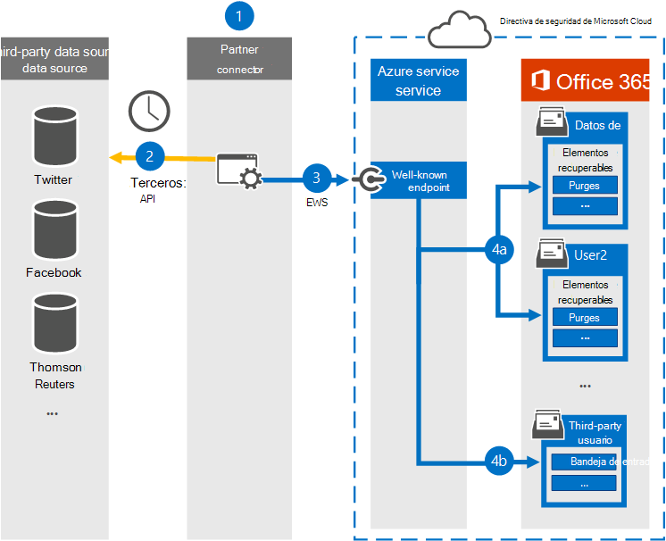

# <a name="work-with-a-partner-to-archive-third-party-data"></a><span data-ttu-id="d98ef-103">Trabajar con un socio para archivar datos de terceros</span><span class="sxs-lookup"><span data-stu-id="d98ef-103">Work with a partner to archive third-party data</span></span>

<span data-ttu-id="d98ef-104">Puede trabajar con un partner de Microsoft para importar y archivar datos de un origen de datos de terceros a Microsoft 365.</span><span class="sxs-lookup"><span data-stu-id="d98ef-104">You can work with a Microsoft Partner to import and archive data from a third-party data source to Microsoft 365.</span></span> <span data-ttu-id="d98ef-105">Un partner puede proporcionarle un conector personalizado que esté configurado para extraer elementos del origen de datos de terceros (de forma regular) y, a continuación, importar esos elementos.</span><span class="sxs-lookup"><span data-stu-id="d98ef-105">A partner can provide you with a custom connector that is configured to extract items from the third-party data source (on a regular basis) and then import those items.</span></span> <span data-ttu-id="d98ef-106">El conector de asociado convierte el contenido de un elemento del origen de datos a un formato de mensaje de correo electrónico y, a continuación, almacena los elementos en buzones.</span><span class="sxs-lookup"><span data-stu-id="d98ef-106">The partner connector converts the content of an item from the data source to an email message format and then stores the items in mailboxes.</span></span> <span data-ttu-id="d98ef-107">Después de importar datos de terceros, puede aplicar características de cumplimiento de Microsoft 365 como retención por juicio, exhibición de documentos electrónicos, archivado de In-Place, auditoría y directivas de retención de Microsoft 365 a estos datos.</span><span class="sxs-lookup"><span data-stu-id="d98ef-107">After third-party data is imported, you can apply Microsoft 365 compliance features such as Litigation Hold, eDiscovery, In-Place Archiving, Auditing, and Microsoft 365 retention policies to this data.</span></span>

>[!IMPORTANT]
><span data-ttu-id="d98ef-108">La [solución de cumplimiento](communication-compliance.md) de comunicaciones de Microsoft 365 no se puede aplicar a los datos de terceros importados por los conectores asociados mencionados en este artículo.</span><span class="sxs-lookup"><span data-stu-id="d98ef-108">The [Communication compliance](communication-compliance.md) solution in Microsoft 365 can't be applied to the third-party data imported by partner connectors mentioned in this article.</span></span> 

<span data-ttu-id="d98ef-109">A continuación se ofrece información general sobre el proceso y los pasos necesarios para trabajar con un partner de Microsoft para importar datos de terceros.</span><span class="sxs-lookup"><span data-stu-id="d98ef-109">Here's an overview of the process and the steps necessary to work with a Microsoft Partner to import third-party data.</span></span>

[<span data-ttu-id="d98ef-110">Step 1: Find a third-party data partner</span><span class="sxs-lookup"><span data-stu-id="d98ef-110">Step 1: Find a third-party data partner</span></span>](#step-1-find-a-third-party-data-partner)

[<span data-ttu-id="d98ef-111">Paso 2: Crear y configurar un buzón de datos de terceros</span><span class="sxs-lookup"><span data-stu-id="d98ef-111">Step 2: Create and configure a third-party data mailbox</span></span>](#step-2-create-and-configure-a-third-party-data-mailbox-in-microsoft-365)

[<span data-ttu-id="d98ef-112">Step 3: Configure user mailboxes for third-party data</span><span class="sxs-lookup"><span data-stu-id="d98ef-112">Step 3: Configure user mailboxes for third-party data</span></span>](#step-3-configure-user-mailboxes-for-third-party-data)

[<span data-ttu-id="d98ef-113">Paso 4: Proporcionar información al asociado</span><span class="sxs-lookup"><span data-stu-id="d98ef-113">Step 4: Provide your partner with information</span></span>](#step-4-provide-your-partner-with-information)

[<span data-ttu-id="d98ef-114">Paso 5: Registrar el conector de datos de terceros en Azure Active Directory</span><span class="sxs-lookup"><span data-stu-id="d98ef-114">Step 5: Register the third-party data connector in Azure Active Directory</span></span>](#step-5-register-the-third-party-data-connector-in-azure-active-directory)

## <a name="how-the-third-party-data-import-process-works"></a><span data-ttu-id="d98ef-115">Cómo funciona el proceso de importación de datos de terceros</span><span class="sxs-lookup"><span data-stu-id="d98ef-115">How the third-party data import process works</span></span>

<span data-ttu-id="d98ef-116">En la siguiente ilustración y descripción se explica cómo funciona el proceso de importación de datos de terceros al trabajar con un partner.</span><span class="sxs-lookup"><span data-stu-id="d98ef-116">The following illustration and description explain how the third-party data import process works when working with a partner.</span></span>
  

  
1. <span data-ttu-id="d98ef-118">El cliente trabaja con su partner de elección para configurar un conector que extraerá elementos del origen de datos de terceros y luego importará esos elementos a Microsoft 365.</span><span class="sxs-lookup"><span data-stu-id="d98ef-118">Customer works with their partner of choice to configure a connector that will extract items from the third-party data source and then import those items to Microsoft 365.</span></span>
    
2. <span data-ttu-id="d98ef-119">El conector de partners se conecta a orígenes de datos de terceros a través de una API de terceros (de forma programada o configurada) y extrae elementos del origen de datos.</span><span class="sxs-lookup"><span data-stu-id="d98ef-119">The partner connector connects to third-party data sources via a third-party API (on a scheduled or as-configured basis) and extracts items from the data source.</span></span> <span data-ttu-id="d98ef-120">El conector asociado convierte el contenido de un elemento en un formato de mensaje de correo electrónico.</span><span class="sxs-lookup"><span data-stu-id="d98ef-120">The partner connector converts the content of an item to an email message format.</span></span> <span data-ttu-id="d98ef-121">Vea la [sección Más información](#more-information) para obtener una descripción del esquema de formato de mensaje.</span><span class="sxs-lookup"><span data-stu-id="d98ef-121">See the [More information](#more-information) section for a description of the message-format schema.</span></span> 
    
3. <span data-ttu-id="d98ef-122">El conector de partners se conecta al servicio de Azure en Microsoft 365 mediante el servicio web de Exchange (EWS) a través de un punto final conocido.</span><span class="sxs-lookup"><span data-stu-id="d98ef-122">Partner connector connects to the Azure service in Microsoft 365 by using Exchange Web Service (EWS) via a well-known end point.</span></span>
    
4. <span data-ttu-id="d98ef-p103">Los elementos se importan al buzón de un usuario específico o a un buzón global de datos de terceros. Que un elemento se importe al buzón de un usuario específico o al buzón de datos de terceros depende de los criterios siguientes:</span><span class="sxs-lookup"><span data-stu-id="d98ef-p103">Items are imported into the mailbox of a specific user or into a "catch-all" third-party data mailbox. Whether an item is imported into a specific user mailbox or to the third-party data mailbox is based on the following criteria:</span></span>
    
   1. <span data-ttu-id="d98ef-125">**Elementos que tienen un identificador de usuario que corresponde a una cuenta de usuario:** Si el conector de asociado puede asignar el identificador de usuario del elemento del origen de datos de terceros a un identificador de usuario específico de Microsoft 365, el elemento se copia en la carpeta **Purgas** de la carpeta Elementos recuperables del usuario.</span><span class="sxs-lookup"><span data-stu-id="d98ef-125">**Items that have a user ID that corresponds to a user account:** If the partner connector can map the user ID of the item in the third-party data source to a specific user ID in Microsoft 365, the item is copied to the **Purges** folder in the user's Recoverable Items folder.</span></span> <span data-ttu-id="d98ef-126">Los usuarios no pueden acceder a los elementos de esta carpeta.</span><span class="sxs-lookup"><span data-stu-id="d98ef-126">Users can't access items in the Purges folder.</span></span> <span data-ttu-id="d98ef-127">Sin embargo, puede usar herramientas de exhibición de documentos electrónicos para buscar elementos en la carpeta Purgas.</span><span class="sxs-lookup"><span data-stu-id="d98ef-127">However, you can use eDiscovery tools to search for items in the Purges folder.</span></span>
    
   1. <span data-ttu-id="d98ef-128">**Elementos que no tienen un identificador de usuario que corresponda a una cuenta de usuario:** Si el conector de asociado no puede asignar el identificador de usuario de un elemento a un identificador de usuario específico, el elemento se copia en la carpeta **Bandeja** de entrada del buzón de datos de terceros.</span><span class="sxs-lookup"><span data-stu-id="d98ef-128">**Items that don't have a user ID that corresponds to a user account:** If the partner connector can't map the user ID of an item to a specific user ID, the item is copied to the **Inbox** folder of the third-party data mailbox.</span></span> <span data-ttu-id="d98ef-129">La importación de elementos a la Bandeja de entrada permite que usted u otra persona de la organización inicie sesión en el buzón de correo de terceros para ver y administrar estos elementos, y ver si es necesario realizar ajustes en la configuración del conector asociado.</span><span class="sxs-lookup"><span data-stu-id="d98ef-129">Importing items to the inbox allows you or someone in your organization to sign in to the third-party mailbox to view and manage these items, and see if any adjustments need to be made in the partner connector configuration.</span></span>
 
## <a name="step-1-find-a-third-party-data-partner"></a><span data-ttu-id="d98ef-130">Paso 1: Buscar un asociado de datos de terceros</span><span class="sxs-lookup"><span data-stu-id="d98ef-130">Step 1: Find a third-party data partner</span></span>

<span data-ttu-id="d98ef-131">Un componente clave para archivar datos de terceros en Microsoft 365 es buscar y trabajar con un partner de Microsoft especializado en capturar datos de un origen de datos de terceros e importarlos a Microsoft 365.</span><span class="sxs-lookup"><span data-stu-id="d98ef-131">A key component for archiving third-party data in Microsoft 365 is finding and working with a Microsoft partner that specializes in capturing data from a third-party data source and importing it to Microsoft 365.</span></span> <span data-ttu-id="d98ef-132">Después de importar los datos, se pueden archivar y conservar junto con otros datos de Microsoft de su organización, como correo electrónico de Exchange y documentos de SharePoint y OneDrive para la Empresa.</span><span class="sxs-lookup"><span data-stu-id="d98ef-132">After the data is imported, it can be archived and preserved along with your organization's other Microsoft data, such as email from Exchange and documents from SharePoint and OneDrive for Business.</span></span> <span data-ttu-id="d98ef-133">Un partner crea un conector que extrae datos de orígenes de datos de terceros de la organización (como BlackBerry, Facebook, Google+, Thomson Reuters, Twitter y YouTube) y los pasa a una API de Microsoft 365 que importa elementos a buzones de Exchange como mensajes de correo electrónico.</span><span class="sxs-lookup"><span data-stu-id="d98ef-133">A partner creates a connector that extracts data from your organization's third-party data sources (such as BlackBerry, Facebook, Google+, Thomson Reuters, Twitter, and YouTube) and passes that data to a Microsoft 365 API that imports items to Exchange mailboxes as email messages.</span></span>
  
<span data-ttu-id="d98ef-134">En las secciones siguientes se muestra una lista de los partners de Microsoft (y los orígenes de datos de terceros que admiten) que participan en el programa para archivar datos de terceros en Microsoft 365.</span><span class="sxs-lookup"><span data-stu-id="d98ef-134">The following sections list the Microsoft partners (and the third-party data sources they support) that are participating in the program for archiving third-party data in Microsoft 365.</span></span>

[<span data-ttu-id="d98ef-135">17a-4 LLC</span><span class="sxs-lookup"><span data-stu-id="d98ef-135">17a-4 LLC</span></span>](#17a-4-llc)
  
[<span data-ttu-id="d98ef-136">ArchiveSocial</span><span class="sxs-lookup"><span data-stu-id="d98ef-136">ArchiveSocial</span></span>](#archivesocial)
  
[<span data-ttu-id="d98ef-137">Veritas</span><span class="sxs-lookup"><span data-stu-id="d98ef-137">Veritas</span></span>](#veritas)
  
[<span data-ttu-id="d98ef-138">OpenText</span><span class="sxs-lookup"><span data-stu-id="d98ef-138">OpenText</span></span>](#opentext)
  
[<span data-ttu-id="d98ef-139">Smarsh</span><span class="sxs-lookup"><span data-stu-id="d98ef-139">Smarsh</span></span>](#smarsh)

[<span data-ttu-id="d98ef-140">Verba</span><span class="sxs-lookup"><span data-stu-id="d98ef-140">Verba</span></span>](#verba)
  
### <a name="17a-4-llc"></a><span data-ttu-id="d98ef-141">17a-4 LLC</span><span class="sxs-lookup"><span data-stu-id="d98ef-141">17a-4 LLC</span></span>

<span data-ttu-id="d98ef-142">[17a-4 LLC](https://www.17a-4.com) admite los siguientes orígenes de datos de terceros:</span><span class="sxs-lookup"><span data-stu-id="d98ef-142">[17a-4 LLC](https://www.17a-4.com) supports the following third-party data sources:</span></span>
  
- <span data-ttu-id="d98ef-143">BlackBerry</span><span class="sxs-lookup"><span data-stu-id="d98ef-143">BlackBerry</span></span>
    
- <span data-ttu-id="d98ef-144">Secuencias de datos de Bloomberg</span><span class="sxs-lookup"><span data-stu-id="d98ef-144">Bloomberg Data Streams</span></span>
    
- <span data-ttu-id="d98ef-145">Cisco Jabber</span><span class="sxs-lookup"><span data-stu-id="d98ef-145">Cisco Jabber</span></span>
    
- <span data-ttu-id="d98ef-146">FactSet</span><span class="sxs-lookup"><span data-stu-id="d98ef-146">FactSet</span></span>
    
- <span data-ttu-id="d98ef-147">HipChat</span><span class="sxs-lookup"><span data-stu-id="d98ef-147">HipChat</span></span>
    
- <span data-ttu-id="d98ef-148">InvestEdge</span><span class="sxs-lookup"><span data-stu-id="d98ef-148">InvestEdge</span></span>
    
- <span data-ttu-id="d98ef-149">LivePerson</span><span class="sxs-lookup"><span data-stu-id="d98ef-149">LivePerson</span></span>
    
- <span data-ttu-id="d98ef-150">Secuencias de datos de MessageLabs</span><span class="sxs-lookup"><span data-stu-id="d98ef-150">MessageLabs Data Streams</span></span>
    
- <span data-ttu-id="d98ef-151">OpenText</span><span class="sxs-lookup"><span data-stu-id="d98ef-151">OpenText</span></span>
    
- <span data-ttu-id="d98ef-152">Ayuda de Hacer clic para llamar de Oracle/ATG Live</span><span class="sxs-lookup"><span data-stu-id="d98ef-152">Oracle/ATG 'click-to-call' Live Help</span></span>
    
- <span data-ttu-id="d98ef-153">Pivot IMTRADER</span><span class="sxs-lookup"><span data-stu-id="d98ef-153">Pivot IMTRADER</span></span>
    
- <span data-ttu-id="d98ef-154">Microsoft SharePoint</span><span class="sxs-lookup"><span data-stu-id="d98ef-154">Microsoft SharePoint</span></span>
    
- <span data-ttu-id="d98ef-155">MindAlign</span><span class="sxs-lookup"><span data-stu-id="d98ef-155">MindAlign</span></span>
    
- <span data-ttu-id="d98ef-156">Sitrion One (Newsgator)</span><span class="sxs-lookup"><span data-stu-id="d98ef-156">Sitrion One (Newsgator)</span></span>
    
- <span data-ttu-id="d98ef-157">Skype Empresarial (Lync/OCS)</span><span class="sxs-lookup"><span data-stu-id="d98ef-157">Skype for Business (Lync/OCS)</span></span>
    
- <span data-ttu-id="d98ef-158">Skype Empresarial Online (Lync Online)</span><span class="sxs-lookup"><span data-stu-id="d98ef-158">Skype for Business Online (Lync Online)</span></span>
    
- <span data-ttu-id="d98ef-159">Bases de datos SQL</span><span class="sxs-lookup"><span data-stu-id="d98ef-159">SQL Databases</span></span>
    
- <span data-ttu-id="d98ef-160">Squawker</span><span class="sxs-lookup"><span data-stu-id="d98ef-160">Squawker</span></span>
    
- <span data-ttu-id="d98ef-161">Thomson Reuters Eikon Messenger</span><span class="sxs-lookup"><span data-stu-id="d98ef-161">Thomson Reuters Eikon Messenger</span></span>
  

  
### <a name="archivesocial"></a><span data-ttu-id="d98ef-162">ArchiveSocial</span><span class="sxs-lookup"><span data-stu-id="d98ef-162">ArchiveSocial</span></span>

<span data-ttu-id="d98ef-163">[ArchiveSocial ](https://www.archivesocial.com) admite los siguientes orígenes de datos de terceros:</span><span class="sxs-lookup"><span data-stu-id="d98ef-163">[ArchiveSocial ](https://www.archivesocial.com) supports the following third-party data sources:</span></span> 
  
- <span data-ttu-id="d98ef-164">Facebook</span><span class="sxs-lookup"><span data-stu-id="d98ef-164">Facebook</span></span>
    
- <span data-ttu-id="d98ef-165">Flickr</span><span class="sxs-lookup"><span data-stu-id="d98ef-165">Flickr</span></span>
    
- <span data-ttu-id="d98ef-166">Instagram</span><span class="sxs-lookup"><span data-stu-id="d98ef-166">Instagram</span></span>
    
- <span data-ttu-id="d98ef-167">LinkedIn</span><span class="sxs-lookup"><span data-stu-id="d98ef-167">LinkedIn</span></span>
    
- <span data-ttu-id="d98ef-168">Pinterest</span><span class="sxs-lookup"><span data-stu-id="d98ef-168">Pinterest</span></span>
    
- <span data-ttu-id="d98ef-169">Twitter</span><span class="sxs-lookup"><span data-stu-id="d98ef-169">Twitter</span></span>
    
- <span data-ttu-id="d98ef-170">YouTube</span><span class="sxs-lookup"><span data-stu-id="d98ef-170">YouTube</span></span>
    
- <span data-ttu-id="d98ef-171">Vimeo</span><span class="sxs-lookup"><span data-stu-id="d98ef-171">Vimeo</span></span>
  
### <a name="veritas"></a><span data-ttu-id="d98ef-172">Veritas</span><span class="sxs-lookup"><span data-stu-id="d98ef-172">Veritas</span></span>

<span data-ttu-id="d98ef-173">[Veritas](https://www.globanet.com) admite los siguientes orígenes de datos de terceros:</span><span class="sxs-lookup"><span data-stu-id="d98ef-173">[Veritas](https://www.globanet.com) supports the following third-party data sources:</span></span> 
  
- <span data-ttu-id="d98ef-174">AOL con cliente Pivot</span><span class="sxs-lookup"><span data-stu-id="d98ef-174">AOL with Pivot Client</span></span> 
    
- <span data-ttu-id="d98ef-175">Registros de llamadas de BlackBerry (v5, v10, v12)</span><span class="sxs-lookup"><span data-stu-id="d98ef-175">BlackBerry Call Logs (v5, v10, v12)</span></span>
    
- <span data-ttu-id="d98ef-176">BlackBerry Messenger (v5, v10, v12)</span><span class="sxs-lookup"><span data-stu-id="d98ef-176">BlackBerry Messenger (v5, v10, v12)</span></span>
    
- <span data-ttu-id="d98ef-177">BlackBerry PIN (v5, v10, v12)</span><span class="sxs-lookup"><span data-stu-id="d98ef-177">BlackBerry PIN (v5, v10, v12)</span></span>
    
- <span data-ttu-id="d98ef-178">BlackBerry SMS (v5, v10, v12)</span><span class="sxs-lookup"><span data-stu-id="d98ef-178">BlackBerry SMS (v5, v10, v12)</span></span>
    
- <span data-ttu-id="d98ef-179">Bloomberg Chat</span><span class="sxs-lookup"><span data-stu-id="d98ef-179">Bloomberg Chat</span></span>
    
- <span data-ttu-id="d98ef-180">Bloomberg Mail</span><span class="sxs-lookup"><span data-stu-id="d98ef-180">Bloomberg Mail</span></span>
    
- <span data-ttu-id="d98ef-181">Cuadro</span><span class="sxs-lookup"><span data-stu-id="d98ef-181">Box</span></span>
    
- <span data-ttu-id="d98ef-182">CipherCloud para Salesforce Chatter</span><span class="sxs-lookup"><span data-stu-id="d98ef-182">CipherCloud for Salesforce Chatter</span></span>
    
- <span data-ttu-id="d98ef-183">Cisco IM &amp; Presence Server (v10, v10.5.1 SU1, v11.0, v11.5 SU2)</span><span class="sxs-lookup"><span data-stu-id="d98ef-183">Cisco IM &amp; Presence Server (v10, v10.5.1 SU1, v11.0, v11.5 SU2)</span></span>

- <span data-ttu-id="d98ef-184">Cisco Webex Teams</span><span class="sxs-lookup"><span data-stu-id="d98ef-184">Cisco Webex Teams</span></span>

- <span data-ttu-id="d98ef-185">Citrix Workspace &amp; ShareFile</span><span class="sxs-lookup"><span data-stu-id="d98ef-185">Citrix Workspace &amp; ShareFile</span></span>

- <span data-ttu-id="d98ef-186">CrowdCompass</span><span class="sxs-lookup"><span data-stu-id="d98ef-186">CrowdCompass</span></span>

- <span data-ttu-id="d98ef-187">Archivos de texto delimitados de forma personalizada</span><span class="sxs-lookup"><span data-stu-id="d98ef-187">Custom-delimited text files</span></span>
    
- <span data-ttu-id="d98ef-188">Archivos XML personalizados</span><span class="sxs-lookup"><span data-stu-id="d98ef-188">Custom XML files</span></span>
    
- <span data-ttu-id="d98ef-189">Facebook (páginas)</span><span class="sxs-lookup"><span data-stu-id="d98ef-189">Facebook (Pages)</span></span>
    
- <span data-ttu-id="d98ef-190">Factset</span><span class="sxs-lookup"><span data-stu-id="d98ef-190">Factset</span></span>
    
- <span data-ttu-id="d98ef-191">FXConnect</span><span class="sxs-lookup"><span data-stu-id="d98ef-191">FXConnect</span></span>
    
- <span data-ttu-id="d98ef-192">ICE Chat/YellowJacket</span><span class="sxs-lookup"><span data-stu-id="d98ef-192">ICE Chat/YellowJacket</span></span>
    
- <span data-ttu-id="d98ef-193">Jive</span><span class="sxs-lookup"><span data-stu-id="d98ef-193">Jive</span></span>
    
- <span data-ttu-id="d98ef-194">Macgregor XIP</span><span class="sxs-lookup"><span data-stu-id="d98ef-194">Macgregor XIP</span></span>

- <span data-ttu-id="d98ef-195">Microsoft Exchange Server</span><span class="sxs-lookup"><span data-stu-id="d98ef-195">Microsoft Exchange Server</span></span>
    
- <span data-ttu-id="d98ef-196">Microsoft OneDrive para la Empresa</span><span class="sxs-lookup"><span data-stu-id="d98ef-196">Microsoft OneDrive for Business</span></span>

- <span data-ttu-id="d98ef-197">Microsoft Teams</span><span class="sxs-lookup"><span data-stu-id="d98ef-197">Microsoft Teams</span></span>
       
- <span data-ttu-id="d98ef-198">Microsoft Yammer</span><span class="sxs-lookup"><span data-stu-id="d98ef-198">Microsoft Yammer</span></span>
    
- <span data-ttu-id="d98ef-199">Mobile Guard</span><span class="sxs-lookup"><span data-stu-id="d98ef-199">Mobile Guard</span></span>
    
- <span data-ttu-id="d98ef-200">Documento principal</span><span class="sxs-lookup"><span data-stu-id="d98ef-200">Pivot</span></span>
    
- <span data-ttu-id="d98ef-201">Salesforce Chatter</span><span class="sxs-lookup"><span data-stu-id="d98ef-201">Salesforce Chatter</span></span>

- <span data-ttu-id="d98ef-202">Skype Empresarial Online</span><span class="sxs-lookup"><span data-stu-id="d98ef-202">Skype for Business Online</span></span>
    
- <span data-ttu-id="d98ef-203">Skype Empresarial, versiones 2007 R2 - 2016 (local)</span><span class="sxs-lookup"><span data-stu-id="d98ef-203">Skype for Business, versions 2007 R2 - 2016 (on-premises)</span></span>
    
- <span data-ttu-id="d98ef-204">Slack Enterprise Grid</span><span class="sxs-lookup"><span data-stu-id="d98ef-204">Slack Enterprise Grid</span></span>
    
- <span data-ttu-id="d98ef-205">Symphony</span><span class="sxs-lookup"><span data-stu-id="d98ef-205">Symphony</span></span>
    
- <span data-ttu-id="d98ef-206">Thomson Reuters Eikon</span><span class="sxs-lookup"><span data-stu-id="d98ef-206">Thomson Reuters Eikon</span></span>
    
- <span data-ttu-id="d98ef-207">Thomson Reuters Messenger</span><span class="sxs-lookup"><span data-stu-id="d98ef-207">Thomson Reuters Messenger</span></span>
    
- <span data-ttu-id="d98ef-208">Thomson Reuters Dealings 3000 / FX Trading</span><span class="sxs-lookup"><span data-stu-id="d98ef-208">Thomson Reuters Dealings 3000 / FX Trading</span></span>
    
- <span data-ttu-id="d98ef-209">Twitter</span><span class="sxs-lookup"><span data-stu-id="d98ef-209">Twitter</span></span>
    
- <span data-ttu-id="d98ef-210">UBS Chat</span><span class="sxs-lookup"><span data-stu-id="d98ef-210">UBS Chat</span></span>
    
- <span data-ttu-id="d98ef-211">YouTube</span><span class="sxs-lookup"><span data-stu-id="d98ef-211">YouTube</span></span>
  
### <a name="opentext"></a><span data-ttu-id="d98ef-212">OpenText</span><span class="sxs-lookup"><span data-stu-id="d98ef-212">OpenText</span></span>

<span data-ttu-id="d98ef-213">[OpenText](https://www.opentext.com/what-we-do/products/opentext-product-offerings-catalog/rebranded-products/daegis) admite los siguientes orígenes de datos de terceros:</span><span class="sxs-lookup"><span data-stu-id="d98ef-213">[OpenText](https://www.opentext.com/what-we-do/products/opentext-product-offerings-catalog/rebranded-products/daegis) supports the following third-party data sources:</span></span> 
  
- <span data-ttu-id="d98ef-214">Axs Encrypted</span><span class="sxs-lookup"><span data-stu-id="d98ef-214">Axs Encrypted</span></span>
    
- <span data-ttu-id="d98ef-215">Axs Exchange</span><span class="sxs-lookup"><span data-stu-id="d98ef-215">Axs Exchange</span></span>
    
- <span data-ttu-id="d98ef-216">Axs Local Archive</span><span class="sxs-lookup"><span data-stu-id="d98ef-216">Axs Local Archive</span></span>
    
- <span data-ttu-id="d98ef-217">Axs PlaceHolder</span><span class="sxs-lookup"><span data-stu-id="d98ef-217">Axs PlaceHolder</span></span>
    
- <span data-ttu-id="d98ef-218">Axs Signed</span><span class="sxs-lookup"><span data-stu-id="d98ef-218">Axs Signed</span></span>
    
- <span data-ttu-id="d98ef-219">Bloomberg</span><span class="sxs-lookup"><span data-stu-id="d98ef-219">Bloomberg</span></span>
    
- <span data-ttu-id="d98ef-220">Thomson Reuters</span><span class="sxs-lookup"><span data-stu-id="d98ef-220">Thomson Reuters</span></span>
  
### <a name="smarsh"></a><span data-ttu-id="d98ef-221">Smarsh</span><span class="sxs-lookup"><span data-stu-id="d98ef-221">Smarsh</span></span>

<span data-ttu-id="d98ef-222">[Smarsh admite](https://www.smarsh.com) los siguientes orígenes de datos de terceros:</span><span class="sxs-lookup"><span data-stu-id="d98ef-222">[Smarsh](https://www.smarsh.com) supports the following third-party data sources:</span></span> 
  
- <span data-ttu-id="d98ef-223">AIM</span><span class="sxs-lookup"><span data-stu-id="d98ef-223">AIM</span></span>
    
- <span data-ttu-id="d98ef-224">American Idol</span><span class="sxs-lookup"><span data-stu-id="d98ef-224">American Idol</span></span>
    
- <span data-ttu-id="d98ef-225">Apple Juice</span><span class="sxs-lookup"><span data-stu-id="d98ef-225">Apple Juice</span></span>
    
- <span data-ttu-id="d98ef-226">AOL con cliente Pivot</span><span class="sxs-lookup"><span data-stu-id="d98ef-226">AOL with Pivot client</span></span>
    
- <span data-ttu-id="d98ef-227">Ares</span><span class="sxs-lookup"><span data-stu-id="d98ef-227">Ares</span></span>
    
- <span data-ttu-id="d98ef-228">Bazaar Voice</span><span class="sxs-lookup"><span data-stu-id="d98ef-228">Bazaar Voice</span></span>
    
- <span data-ttu-id="d98ef-229">Bear Share</span><span class="sxs-lookup"><span data-stu-id="d98ef-229">Bear Share</span></span>
    
- <span data-ttu-id="d98ef-230">Bit Torrent</span><span class="sxs-lookup"><span data-stu-id="d98ef-230">Bit Torrent</span></span>
    
- <span data-ttu-id="d98ef-231">Registros de llamadas de BlackBerry (v5, v10, v12)</span><span class="sxs-lookup"><span data-stu-id="d98ef-231">BlackBerry Call Logs (v5, v10, v12)</span></span>
    
- <span data-ttu-id="d98ef-232">BlackBerry Messenger (v5, v10, v12)</span><span class="sxs-lookup"><span data-stu-id="d98ef-232">BlackBerry Messenger (v5, v10, v12)</span></span>
    
- <span data-ttu-id="d98ef-233">BlackBerry PIN (v5, v10, v12)</span><span class="sxs-lookup"><span data-stu-id="d98ef-233">BlackBerry PIN (v5, v10, v12)</span></span>
    
- <span data-ttu-id="d98ef-234">BlackBerry SMS (v5, v10, v12)</span><span class="sxs-lookup"><span data-stu-id="d98ef-234">BlackBerry SMS (v5, v10, v12)</span></span>
    
- <span data-ttu-id="d98ef-235">Bloomberg Mail</span><span class="sxs-lookup"><span data-stu-id="d98ef-235">Bloomberg Mail</span></span>
    
- <span data-ttu-id="d98ef-236">CellTrust</span><span class="sxs-lookup"><span data-stu-id="d98ef-236">CellTrust</span></span>
    
- <span data-ttu-id="d98ef-237">Importación de chat</span><span class="sxs-lookup"><span data-stu-id="d98ef-237">Chat Import</span></span>
    
- <span data-ttu-id="d98ef-238">Directiva y registro en tiempo real de chat</span><span class="sxs-lookup"><span data-stu-id="d98ef-238">Chat Real Time Logging and Policy</span></span>
    
- <span data-ttu-id="d98ef-239">Chatter</span><span class="sxs-lookup"><span data-stu-id="d98ef-239">Chatter</span></span>
    
- <span data-ttu-id="d98ef-240">Cisco IM &amp; Presence Server (v9.0.1, v9.1, v9.1.1 SU1, v10, v10.5.1 SU1)</span><span class="sxs-lookup"><span data-stu-id="d98ef-240">Cisco IM &amp; Presence Server (v9.0.1, v9.1, v9.1.1 SU1, v10, v10.5.1 SU1)</span></span>
    
- <span data-ttu-id="d98ef-241">Servidor de presencia unificada de Cisco (v8.6.3, v8.6.4, v8.6.5)</span><span class="sxs-lookup"><span data-stu-id="d98ef-241">Cisco Unified Presence Server (v8.6.3, v8.6.4, v8.6.5)</span></span>
    
- <span data-ttu-id="d98ef-242">Importación de colaboración</span><span class="sxs-lookup"><span data-stu-id="d98ef-242">Collaboration Import</span></span>
    
- <span data-ttu-id="d98ef-243">Registro de colaboración en tiempo real</span><span class="sxs-lookup"><span data-stu-id="d98ef-243">Collaboration Real Time Logging</span></span>
    
- <span data-ttu-id="d98ef-244">Conexión directa</span><span class="sxs-lookup"><span data-stu-id="d98ef-244">Direct Connect</span></span>
    
- <span data-ttu-id="d98ef-245">Facebook</span><span class="sxs-lookup"><span data-stu-id="d98ef-245">Facebook</span></span>
    
- <span data-ttu-id="d98ef-246">FactSet</span><span class="sxs-lookup"><span data-stu-id="d98ef-246">FactSet</span></span>
    
- <span data-ttu-id="d98ef-247">FastTrack</span><span class="sxs-lookup"><span data-stu-id="d98ef-247">FastTrack</span></span>
    
- <span data-ttu-id="d98ef-248">Gnutella</span><span class="sxs-lookup"><span data-stu-id="d98ef-248">Gnutella</span></span>
    
- <span data-ttu-id="d98ef-249">Google+</span><span class="sxs-lookup"><span data-stu-id="d98ef-249">Google+</span></span>
    
- <span data-ttu-id="d98ef-250">GoToMyPC</span><span class="sxs-lookup"><span data-stu-id="d98ef-250">GoToMyPC</span></span>
    
- <span data-ttu-id="d98ef-251">Hopster</span><span class="sxs-lookup"><span data-stu-id="d98ef-251">Hopster</span></span>
    
- <span data-ttu-id="d98ef-252">HubConnex</span><span class="sxs-lookup"><span data-stu-id="d98ef-252">HubConnex</span></span>
    
- <span data-ttu-id="d98ef-253">IBM Connections (v3.0.1, v4.0, v4.5, v4.5 CR3, v5)</span><span class="sxs-lookup"><span data-stu-id="d98ef-253">IBM Connections (v3.0.1, v4.0, v4.5, v4.5 CR3, v5)</span></span>
    
- <span data-ttu-id="d98ef-254">IBM Connections Chat Cloud</span><span class="sxs-lookup"><span data-stu-id="d98ef-254">IBM Connections Chat Cloud</span></span>
    
- <span data-ttu-id="d98ef-255">IBM Connections Social Cloud</span><span class="sxs-lookup"><span data-stu-id="d98ef-255">IBM Connections Social Cloud</span></span>
    
- <span data-ttu-id="d98ef-256">IBM SameTime Advanced 8.5.2 IFR1</span><span class="sxs-lookup"><span data-stu-id="d98ef-256">IBM SameTime Advanced 8.5.2 IFR1</span></span>
    
- <span data-ttu-id="d98ef-257">IBM SameTime Communicate 9.0</span><span class="sxs-lookup"><span data-stu-id="d98ef-257">IBM SameTime Communicate 9.0</span></span>
    
- <span data-ttu-id="d98ef-258">IBM SameTime Community (v8.0.2, v8.5.1 IFR2, v8.5.2 IFR1, v9.1)</span><span class="sxs-lookup"><span data-stu-id="d98ef-258">IBM SameTime Community (v8.0.2, v8.5.1 IFR2, v8.5.2 IFR1, v9.1)</span></span>
    
- <span data-ttu-id="d98ef-259">IBM SameTime Complete 9.0</span><span class="sxs-lookup"><span data-stu-id="d98ef-259">IBM SameTime Complete 9.0</span></span>
    
- <span data-ttu-id="d98ef-260">IBM SameTime Conference 9.0</span><span class="sxs-lookup"><span data-stu-id="d98ef-260">IBM SameTime Conference 9.0</span></span>
    
- <span data-ttu-id="d98ef-261">IBM SameTime Meeting 8.5.2 IFR1</span><span class="sxs-lookup"><span data-stu-id="d98ef-261">IBM SameTime Meeting 8.5.2 IFR1</span></span>
    
- <span data-ttu-id="d98ef-262">ICE/YellowJacket</span><span class="sxs-lookup"><span data-stu-id="d98ef-262">ICE/YellowJacket</span></span>
    
- <span data-ttu-id="d98ef-263">Importación de mensajería instantánea</span><span class="sxs-lookup"><span data-stu-id="d98ef-263">IM Import</span></span>
    
- <span data-ttu-id="d98ef-264">Directiva y registro de mensajería instantánea en tiempo real</span><span class="sxs-lookup"><span data-stu-id="d98ef-264">IM Real Time Logging and Policy</span></span>
    
- <span data-ttu-id="d98ef-265">Indii Messenger</span><span class="sxs-lookup"><span data-stu-id="d98ef-265">Indii Messenger</span></span>
    
- <span data-ttu-id="d98ef-266">Instant Bloomberg</span><span class="sxs-lookup"><span data-stu-id="d98ef-266">Instant Bloomberg</span></span>
    
- <span data-ttu-id="d98ef-267">IRC</span><span class="sxs-lookup"><span data-stu-id="d98ef-267">IRC</span></span>
    
- <span data-ttu-id="d98ef-268">Jive</span><span class="sxs-lookup"><span data-stu-id="d98ef-268">Jive</span></span>
    
- <span data-ttu-id="d98ef-269">Jive 6 Real Time Logging (v6, v7)</span><span class="sxs-lookup"><span data-stu-id="d98ef-269">Jive 6 Real Time Logging (v6, v7)</span></span>
    
- <span data-ttu-id="d98ef-270">Jive Import</span><span class="sxs-lookup"><span data-stu-id="d98ef-270">Jive Import</span></span>
    
- <span data-ttu-id="d98ef-271">JXTA</span><span class="sxs-lookup"><span data-stu-id="d98ef-271">JXTA</span></span>
    
- <span data-ttu-id="d98ef-272">LinkedIn</span><span class="sxs-lookup"><span data-stu-id="d98ef-272">LinkedIn</span></span>
    
- <span data-ttu-id="d98ef-273">Microsoft Lync (2010, 2013)</span><span class="sxs-lookup"><span data-stu-id="d98ef-273">Microsoft Lync (2010, 2013)</span></span>
    
- <span data-ttu-id="d98ef-274">MFTP</span><span class="sxs-lookup"><span data-stu-id="d98ef-274">MFTP</span></span>
    
- <span data-ttu-id="d98ef-275">Microsoft Lync 2013 Voice</span><span class="sxs-lookup"><span data-stu-id="d98ef-275">Microsoft Lync 2013 Voice</span></span>
    
- <span data-ttu-id="d98ef-276">Microsoft SharePoint (2010, 2013)</span><span class="sxs-lookup"><span data-stu-id="d98ef-276">Microsoft SharePoint (2010, 2013)</span></span>
    
- <span data-ttu-id="d98ef-277">Microsoft SharePoint Online</span><span class="sxs-lookup"><span data-stu-id="d98ef-277">Microsoft SharePoint Online</span></span>
    
- <span data-ttu-id="d98ef-278">Microsoft UC (Unified Communications)</span><span class="sxs-lookup"><span data-stu-id="d98ef-278">Microsoft UC (Unified Communications)</span></span>
    
- <span data-ttu-id="d98ef-279">MindAlign</span><span class="sxs-lookup"><span data-stu-id="d98ef-279">MindAlign</span></span>
    
- <span data-ttu-id="d98ef-280">Mobile Guard</span><span class="sxs-lookup"><span data-stu-id="d98ef-280">Mobile Guard</span></span>
    
- <span data-ttu-id="d98ef-281">MSN</span><span class="sxs-lookup"><span data-stu-id="d98ef-281">MSN</span></span>
    
- <span data-ttu-id="d98ef-282">My Space</span><span class="sxs-lookup"><span data-stu-id="d98ef-282">My Space</span></span>
    
- <span data-ttu-id="d98ef-283">NEONetwork</span><span class="sxs-lookup"><span data-stu-id="d98ef-283">NEONetwork</span></span>
    
- <span data-ttu-id="d98ef-284">Microsoft 365 Lync Dedicado</span><span class="sxs-lookup"><span data-stu-id="d98ef-284">Microsoft 365 Lync Dedicated</span></span>
    
- <span data-ttu-id="d98ef-285">Mensajería instantánea compartida de Microsoft 365</span><span class="sxs-lookup"><span data-stu-id="d98ef-285">Microsoft 365 Shared IM</span></span>
    
- <span data-ttu-id="d98ef-286">Pinterest</span><span class="sxs-lookup"><span data-stu-id="d98ef-286">Pinterest</span></span>
    
- <span data-ttu-id="d98ef-287">Documento principal</span><span class="sxs-lookup"><span data-stu-id="d98ef-287">Pivot</span></span>
    
- <span data-ttu-id="d98ef-288">QQ</span><span class="sxs-lookup"><span data-stu-id="d98ef-288">QQ</span></span>
    
- <span data-ttu-id="d98ef-289">Skype Empresarial 2015</span><span class="sxs-lookup"><span data-stu-id="d98ef-289">Skype for Business 2015</span></span>
    
- <span data-ttu-id="d98ef-290">SoftEther</span><span class="sxs-lookup"><span data-stu-id="d98ef-290">SoftEther</span></span>
    
- <span data-ttu-id="d98ef-291">Symphony</span><span class="sxs-lookup"><span data-stu-id="d98ef-291">Symphony</span></span>
    
- <span data-ttu-id="d98ef-292">Thomson Reuters Eikon</span><span class="sxs-lookup"><span data-stu-id="d98ef-292">Thomson Reuters Eikon</span></span>
    
- <span data-ttu-id="d98ef-293">Thomson Reuters Messenger</span><span class="sxs-lookup"><span data-stu-id="d98ef-293">Thomson Reuters Messenger</span></span>
    
- <span data-ttu-id="d98ef-294">Tor</span><span class="sxs-lookup"><span data-stu-id="d98ef-294">Tor</span></span>
    
- <span data-ttu-id="d98ef-295">TTT</span><span class="sxs-lookup"><span data-stu-id="d98ef-295">TTT</span></span>
    
- <span data-ttu-id="d98ef-296">Twitter</span><span class="sxs-lookup"><span data-stu-id="d98ef-296">Twitter</span></span>
    
- <span data-ttu-id="d98ef-297">WinMX</span><span class="sxs-lookup"><span data-stu-id="d98ef-297">WinMX</span></span>
    
- <span data-ttu-id="d98ef-298">Winny</span><span class="sxs-lookup"><span data-stu-id="d98ef-298">Winny</span></span>
    
- <span data-ttu-id="d98ef-299">Yahoo</span><span class="sxs-lookup"><span data-stu-id="d98ef-299">Yahoo</span></span>
    
- <span data-ttu-id="d98ef-300">Yammer</span><span class="sxs-lookup"><span data-stu-id="d98ef-300">Yammer</span></span>
    
- <span data-ttu-id="d98ef-301">YouTube</span><span class="sxs-lookup"><span data-stu-id="d98ef-301">YouTube</span></span>
    

### <a name="verba"></a><span data-ttu-id="d98ef-302">Verba</span><span class="sxs-lookup"><span data-stu-id="d98ef-302">Verba</span></span>

<span data-ttu-id="d98ef-303">[Verba admite](https://www.verba.com) los siguientes orígenes de datos de terceros:</span><span class="sxs-lookup"><span data-stu-id="d98ef-303">[Verba](https://www.verba.com) supports the following third-party data sources:</span></span> 
  
- <span data-ttu-id="d98ef-304">Avaya Aura Video</span><span class="sxs-lookup"><span data-stu-id="d98ef-304">Avaya Aura Video</span></span>
    
- <span data-ttu-id="d98ef-305">Avaya Aura Voice</span><span class="sxs-lookup"><span data-stu-id="d98ef-305">Avaya Aura Voice</span></span>
    
- <span data-ttu-id="d98ef-306">Avtec Radio</span><span class="sxs-lookup"><span data-stu-id="d98ef-306">Avtec Radio</span></span>
    
- <span data-ttu-id="d98ef-307">Bosch/Telex Radio</span><span class="sxs-lookup"><span data-stu-id="d98ef-307">Bosch/Telex Radio</span></span>
    
- <span data-ttu-id="d98ef-308">BroadSoft Video</span><span class="sxs-lookup"><span data-stu-id="d98ef-308">BroadSoft Video</span></span>
    
- <span data-ttu-id="d98ef-309">BroadSoft Voice</span><span class="sxs-lookup"><span data-stu-id="d98ef-309">BroadSoft Voice</span></span>
    
- <span data-ttu-id="d98ef-310">Centile Voice</span><span class="sxs-lookup"><span data-stu-id="d98ef-310">Centile Voice</span></span>
    
- <span data-ttu-id="d98ef-311">Cisco Jabber IM</span><span class="sxs-lookup"><span data-stu-id="d98ef-311">Cisco Jabber IM</span></span>
    
- <span data-ttu-id="d98ef-312">Cisco UC Video</span><span class="sxs-lookup"><span data-stu-id="d98ef-312">Cisco UC Video</span></span>
    
- <span data-ttu-id="d98ef-313">Cisco UC Voice</span><span class="sxs-lookup"><span data-stu-id="d98ef-313">Cisco UC Voice</span></span>
    
- <span data-ttu-id="d98ef-314">Vídeo de Cisco UCCX/UCCE</span><span class="sxs-lookup"><span data-stu-id="d98ef-314">Cisco UCCX/UCCE Video</span></span>
    
- <span data-ttu-id="d98ef-315">Cisco UCCX/UCCE Voice</span><span class="sxs-lookup"><span data-stu-id="d98ef-315">Cisco UCCX/UCCE Voice</span></span>
    
- <span data-ttu-id="d98ef-316">ESChat Radio</span><span class="sxs-lookup"><span data-stu-id="d98ef-316">ESChat Radio</span></span>
    
- <span data-ttu-id="d98ef-317">Geoman Contact Expert</span><span class="sxs-lookup"><span data-stu-id="d98ef-317">Geoman Contact Expert</span></span>
    
- <span data-ttu-id="d98ef-318">IP Trade Voice</span><span class="sxs-lookup"><span data-stu-id="d98ef-318">IP Trade Voice</span></span>
    
- <span data-ttu-id="d98ef-319">Centro de contacto de Luware LUCS</span><span class="sxs-lookup"><span data-stu-id="d98ef-319">Luware LUCS Contact Center</span></span>
    
- <span data-ttu-id="d98ef-320">Microsoft UC (Unified Communications)</span><span class="sxs-lookup"><span data-stu-id="d98ef-320">Microsoft UC (Unified Communications)</span></span>
    
- <span data-ttu-id="d98ef-321">Mitel MiContact Center for Lync (prairieFyre)</span><span class="sxs-lookup"><span data-stu-id="d98ef-321">Mitel MiContact Center for Lync (prairieFyre)</span></span>
    
- <span data-ttu-id="d98ef-322">Vídeo de controlador de borde de sesión de paquete Oracle/Acme</span><span class="sxs-lookup"><span data-stu-id="d98ef-322">Oracle / Acme Packet Session Border Controller Video</span></span>
    
- <span data-ttu-id="d98ef-323">Voz de controlador de borde de sesión de paquete Oracle/Acme</span><span class="sxs-lookup"><span data-stu-id="d98ef-323">Oracle / Acme Packet Session Border Controller Voice</span></span>
    
- <span data-ttu-id="d98ef-324">Singtel Mobile Voice</span><span class="sxs-lookup"><span data-stu-id="d98ef-324">Singtel Mobile Voice</span></span>
    
- <span data-ttu-id="d98ef-325">SIPREC Video</span><span class="sxs-lookup"><span data-stu-id="d98ef-325">SIPREC Video</span></span>
    
-  <span data-ttu-id="d98ef-326">SIPREC Voice</span><span class="sxs-lookup"><span data-stu-id="d98ef-326">SIPREC Voice</span></span> 
    
- <span data-ttu-id="d98ef-327">Skype Empresarial/MI de Lync</span><span class="sxs-lookup"><span data-stu-id="d98ef-327">Skype for Business / Lync IM</span></span>
    
- <span data-ttu-id="d98ef-328">Skype Empresarial/Vídeo de Lync</span><span class="sxs-lookup"><span data-stu-id="d98ef-328">Skype for Business / Lync Video</span></span>
    
- <span data-ttu-id="d98ef-329">Skype Empresarial/Voz de Lync</span><span class="sxs-lookup"><span data-stu-id="d98ef-329">Skype for Business / Lync Voice</span></span>
    
- <span data-ttu-id="d98ef-330">Speakerbus Voice</span><span class="sxs-lookup"><span data-stu-id="d98ef-330">Speakerbus Voice</span></span>
    
- <span data-ttu-id="d98ef-331">Standard SIP/H.323 Video</span><span class="sxs-lookup"><span data-stu-id="d98ef-331">Standard SIP/H.323 Video</span></span>
    
- <span data-ttu-id="d98ef-332">Standard SIP/H.323 Voice</span><span class="sxs-lookup"><span data-stu-id="d98ef-332">Standard SIP/H.323 Voice</span></span>
    
- <span data-ttu-id="d98ef-333">Truphone Voice</span><span class="sxs-lookup"><span data-stu-id="d98ef-333">Truphone Voice</span></span>
    
- <span data-ttu-id="d98ef-334">TwistedPair Radio</span><span class="sxs-lookup"><span data-stu-id="d98ef-334">TwistedPair Radio</span></span>
    
- <span data-ttu-id="d98ef-335">Pantalla de equipo de escritorio de Windows</span><span class="sxs-lookup"><span data-stu-id="d98ef-335">Windows Desktop Computer Screen</span></span>
  
## <a name="step-2-create-and-configure-a-third-party-data-mailbox-in-microsoft-365"></a><span data-ttu-id="d98ef-336">Paso 2: Crear y configurar un buzón de datos de terceros en Microsoft 365</span><span class="sxs-lookup"><span data-stu-id="d98ef-336">Step 2: Create and configure a third-party data mailbox in Microsoft 365</span></span>

<span data-ttu-id="d98ef-337">Estos son los pasos para crear y configurar un buzón de datos de terceros para importar datos a Microsoft 365.</span><span class="sxs-lookup"><span data-stu-id="d98ef-337">Here are the steps for creating and configuring a third-party data mailbox for importing data to Microsoft 365.</span></span> <span data-ttu-id="d98ef-338">Como se explicó anteriormente, los elementos se importan a este buzón si el conector de asociado no puede asignar el identificador de usuario del elemento a una cuenta de usuario.</span><span class="sxs-lookup"><span data-stu-id="d98ef-338">As previous explained, items are imported to this mailbox if the partner connector can't map the user ID of the item to a user account.</span></span>
  
 <span data-ttu-id="d98ef-339">**Complete estas tareas en el Centro de administración de Microsoft 365**</span><span class="sxs-lookup"><span data-stu-id="d98ef-339">**Complete these tasks in the Microsoft 365 admin center**</span></span>
  
1. <span data-ttu-id="d98ef-340">Cree una cuenta de usuario y asígnele una licencia de Exchange Online Plan 2; vea [Agregar usuarios a Microsoft 365](../admin/add-users/add-users.md).</span><span class="sxs-lookup"><span data-stu-id="d98ef-340">Create a user account and assign it an Exchange Online Plan 2 license; see [Add users to Microsoft 365](../admin/add-users/add-users.md).</span></span> <span data-ttu-id="d98ef-341">Se requiere una licencia del plan 2 para colocar el buzón en retención por juicio o habilitar un buzón de archivo que tenga una cuota de almacenamiento ilimitada.</span><span class="sxs-lookup"><span data-stu-id="d98ef-341">A Plan 2 license is required to place the mailbox on Litigation Hold or enable an archive mailbox that has an unlimited storage quota.</span></span>
    
2. <span data-ttu-id="d98ef-342">Agregue la cuenta de usuario del buzón de datos de terceros al rol de administrador de **Exchange** en Microsoft 365; vea [Asignar roles de administrador en Microsoft 365](../admin/add-users/assign-admin-roles.md).</span><span class="sxs-lookup"><span data-stu-id="d98ef-342">Add the user account for the third-party data mailbox to the **Exchange administrator** admin role in Microsoft 365; see [Assign admin roles in Microsoft 365](../admin/add-users/assign-admin-roles.md).</span></span>
    
    > [!TIP]
    > <span data-ttu-id="d98ef-343">Escriba las credenciales para esta cuenta de usuario.</span><span class="sxs-lookup"><span data-stu-id="d98ef-343">Write down the credentials for this user account.</span></span> <span data-ttu-id="d98ef-344">Necesitará proporcionárselas a su socio, tal como se describe en el paso 4.</span><span class="sxs-lookup"><span data-stu-id="d98ef-344">You need to provide them to your partner, as described in Step 4.</span></span> 
  
 <span data-ttu-id="d98ef-345">**Completar estas tareas en el Centro de administración de Exchange**</span><span class="sxs-lookup"><span data-stu-id="d98ef-345">**Complete these tasks in the Exchange admin center**</span></span>
  
1. <span data-ttu-id="d98ef-346">Ocultar el buzón de datos de terceros de la libreta de direcciones y otras listas de direcciones de la organización; vea [Administrar buzones de usuario](/exchange/recipients-in-exchange-online/manage-user-mailboxes/manage-user-mailboxes).</span><span class="sxs-lookup"><span data-stu-id="d98ef-346">Hide the third-party data mailbox from the address book and other address lists in your organization; see [Manage user mailboxes](/exchange/recipients-in-exchange-online/manage-user-mailboxes/manage-user-mailboxes).</span></span> <span data-ttu-id="d98ef-347">Como alternativa, puede ejecutar el siguiente comando de PowerShell:</span><span class="sxs-lookup"><span data-stu-id="d98ef-347">Alternatively, you can run the following PowerShell command:</span></span>
    
    ```powershell
    Set-Mailbox -Identity <identity of third-party data mailbox> -HiddenFromAddressListsEnabled $true
    ```

2. <span data-ttu-id="d98ef-348">Asigne el **permiso FullAccess** al buzón de datos de terceros para que los administradores o responsables de cumplimiento puedan abrir el buzón de datos de terceros en el cliente de escritorio de Outlook; vea [Manage permissions for recipients](https://go.microsoft.com/fwlink/p/?LinkId=692104).</span><span class="sxs-lookup"><span data-stu-id="d98ef-348">Assign the **FullAccess** permission to the third-party data mailbox so that administrators or compliance officers can open the third-party data mailbox in the Outlook desktop client; see [Manage permissions for recipients](https://go.microsoft.com/fwlink/p/?LinkId=692104).</span></span>
    
3. <span data-ttu-id="d98ef-349">Habilite las siguientes características relacionadas con el cumplimiento para el buzón de datos de terceros:</span><span class="sxs-lookup"><span data-stu-id="d98ef-349">Enable the following compliance-related features for the third-party data mailbox:</span></span>
    
    - <span data-ttu-id="d98ef-350">Habilitar el buzón de archivo; vea [Habilitar buzones de archivo](enable-archive-mailboxes.md) y Habilitar archivado [ilimitado.](enable-unlimited-archiving.md)</span><span class="sxs-lookup"><span data-stu-id="d98ef-350">Enable the archive mailbox; see [Enable archive mailboxes](enable-archive-mailboxes.md) and [Enable unlimited archiving](enable-unlimited-archiving.md).</span></span> <span data-ttu-id="d98ef-351">Esto le permite liberar espacio de almacenamiento en el buzón principal configurando una directiva de archivo que mueve elementos de datos de terceros al buzón de archivo.</span><span class="sxs-lookup"><span data-stu-id="d98ef-351">This lets you free-up storage space in the primary mailbox by setting up an archive policy that moves third-party data items to the archive mailbox.</span></span> <span data-ttu-id="d98ef-352">Esto le proporciona almacenamiento ilimitado para datos de terceros.</span><span class="sxs-lookup"><span data-stu-id="d98ef-352">This provides you with unlimited storage for third-party data.</span></span>
    
    - <span data-ttu-id="d98ef-353">Coloque el buzón de datos de la tercera persona en retención por juicio.</span><span class="sxs-lookup"><span data-stu-id="d98ef-353">Place the third-party data mailbox on Litigation Hold.</span></span> <span data-ttu-id="d98ef-354">También puede aplicar una directiva de retención de Microsoft 365 en el Centro de seguridad y cumplimiento.</span><span class="sxs-lookup"><span data-stu-id="d98ef-354">You can also apply a Microsoft 365 retention policy in the security and compliance center.</span></span> <span data-ttu-id="d98ef-355">Al colocar este buzón en espera, se conservan los elementos de datos de terceros (de forma indefinida o durante una duración especificada) y se evita que se purguen del buzón.</span><span class="sxs-lookup"><span data-stu-id="d98ef-355">Placing this mailbox on hold retains third-party data items (indefinitely or for a specified duration) and prevent them from being purged from the mailbox.</span></span> <span data-ttu-id="d98ef-356">Vea uno de los siguientes temas:</span><span class="sxs-lookup"><span data-stu-id="d98ef-356">See one of the following topics:</span></span>
    
      - [<span data-ttu-id="d98ef-357">Poner un buzón en retención por juicio</span><span class="sxs-lookup"><span data-stu-id="d98ef-357">Place a mailbox on Litigation Hold</span></span>](./create-a-litigation-hold.md)
    
      - [<span data-ttu-id="d98ef-358">Más información sobre las directivas y las etiquetas de retención</span><span class="sxs-lookup"><span data-stu-id="d98ef-358">Learn about retention policies and retention labels</span></span>](retention.md)
    
    - <span data-ttu-id="d98ef-359">Habilitar el registro de auditoría de buzones de correo para el acceso de propietario, delegado y administrador al buzón de datos de terceros; vea [Enable mailbox auditing](enable-mailbox-auditing.md).</span><span class="sxs-lookup"><span data-stu-id="d98ef-359">Enable mailbox audit logging for owner, delegate, and admin access to the third-party data mailbox; see [Enable mailbox auditing](enable-mailbox-auditing.md).</span></span> <span data-ttu-id="d98ef-360">Esto le permite auditar toda la actividad realizada por cualquier usuario que tenga acceso al buzón de datos de terceros.</span><span class="sxs-lookup"><span data-stu-id="d98ef-360">This allows you to audit all activity performed by any user who has access to the third-party data mailbox.</span></span>

## <a name="step-3-configure-user-mailboxes-for-third-party-data"></a><span data-ttu-id="d98ef-361">Paso 3: Configurar los buzones de usuario para los datos de terceros</span><span class="sxs-lookup"><span data-stu-id="d98ef-361">Step 3: Configure user mailboxes for third-party data</span></span>

<span data-ttu-id="d98ef-362">El paso siguiente es configurar los buzones de usuario para que admitan los datos de terceros.</span><span class="sxs-lookup"><span data-stu-id="d98ef-362">The next step is to configure user mailboxes to support third-party data.</span></span> <span data-ttu-id="d98ef-363">Complete estas tareas mediante el Centro de administración de Exchange o mediante el uso de los cmdlets Windows PowerShell correspondientes.</span><span class="sxs-lookup"><span data-stu-id="d98ef-363">Complete these tasks by using the Exchange admin center or by using the corresponding Windows PowerShell cmdlets.</span></span>
  
1. <span data-ttu-id="d98ef-364">Habilitar el buzón de archivo para cada usuario; vea [Habilitar buzones de archivo](enable-archive-mailboxes.md) y Habilitar archivado [ilimitado.](enable-unlimited-archiving.md)</span><span class="sxs-lookup"><span data-stu-id="d98ef-364">Enable the archive mailbox for each user; see [Enable archive mailboxes](enable-archive-mailboxes.md) and [Enable unlimited archiving](enable-unlimited-archiving.md).</span></span>
    
2. <span data-ttu-id="d98ef-365">Colocar buzones de usuario en retención por juicio o aplicar una directiva de retención de Microsoft 365; vea uno de los siguientes temas:</span><span class="sxs-lookup"><span data-stu-id="d98ef-365">Place user mailboxes on Litigation Hold or apply a Microsoft 365 retention policy; see one of the following topics:</span></span> 
    
    - [<span data-ttu-id="d98ef-366">Poner un buzón en retención por juicio</span><span class="sxs-lookup"><span data-stu-id="d98ef-366">Place a mailbox on Litigation Hold</span></span>](./create-a-litigation-hold.md)
    
    - [<span data-ttu-id="d98ef-367">Más información sobre las directivas y las etiquetas de retención</span><span class="sxs-lookup"><span data-stu-id="d98ef-367">Learn about retention policies and retention labels</span></span>](retention.md)
    
    <span data-ttu-id="d98ef-368">Como ya se ha indicado, al poner los buzones en retención, puede determinar durante cuánto tiempo deben retenerse los elementos del origen de datos de terceros o puede optar por retener los elementos indefinidamente.</span><span class="sxs-lookup"><span data-stu-id="d98ef-368">As previously stated, when you place mailboxes on hold, you can set a duration for how long to hold items from the third-party data source or you can choose to hold items indefinitely.</span></span>

## <a name="step-4-provide-your-partner-with-information"></a><span data-ttu-id="d98ef-369">Paso 4: Proporcionar información al asociado</span><span class="sxs-lookup"><span data-stu-id="d98ef-369">Step 4: Provide your partner with information</span></span>

<span data-ttu-id="d98ef-370">El paso final es proporcionar a su partner la siguiente información para que pueda configurar el conector para conectarse a su organización para importar datos a buzones de usuario y al buzón de datos de terceros.</span><span class="sxs-lookup"><span data-stu-id="d98ef-370">The final step is to provide your partner with the following information so they can configure the connector to connect to your organization to import data to user mailboxes and to the third-party data mailbox.</span></span> 
  
- <span data-ttu-id="d98ef-371">Punto de conexión usado para conectarse al servicio azure en Microsoft 365:</span><span class="sxs-lookup"><span data-stu-id="d98ef-371">The endpoint used to connect to the Azure service in Microsoft 365:</span></span>

    ```http
    https://office365ingestionsvc.gble1.protection.outlook.com/service/ThirdPartyIngestionService.svc
    ```

- <span data-ttu-id="d98ef-372">Las credenciales de inicio de sesión (id. de usuario y contraseña de Microsoft 365) del buzón de datos de terceros que creó en el paso 2.</span><span class="sxs-lookup"><span data-stu-id="d98ef-372">The sign-in credentials (Microsoft 365 user ID and password) of the third-party data mailbox that you created in Step 2.</span></span> <span data-ttu-id="d98ef-373">Estas credenciales son necesarias para que el conector asociado pueda tener acceso e importar elementos a los buzones de usuario y al buzón de datos de un tercero.</span><span class="sxs-lookup"><span data-stu-id="d98ef-373">These credentials are required so that the partner connector can access and import items to user mailboxes and to the third-party data mailbox.</span></span>
 
## <a name="step-5-register-the-third-party-data-connector-in-azure-active-directory"></a><span data-ttu-id="d98ef-374">Paso 5: Registrar el conector de datos de terceros en Azure Active Directory</span><span class="sxs-lookup"><span data-stu-id="d98ef-374">Step 5: Register the third-party data connector in Azure Active Directory</span></span>

<span data-ttu-id="d98ef-375">A partir del 30 de septiembre de 2018, el servicio Azure en Microsoft 365 empezará a usar la autenticación moderna en Exchange Online para autenticar conectores de datos de terceros que intenten conectarse a su organización para importar datos.</span><span class="sxs-lookup"><span data-stu-id="d98ef-375">Starting September 30, 2018, the Azure service in Microsoft 365 will begin using modern authentication in Exchange Online to authenticate third-party data connectors that attempt to connect to your organization to import data.</span></span> <span data-ttu-id="d98ef-376">El motivo de este cambio es que la autenticación moderna proporciona más seguridad que el método actual, que se basaba en una lista de permitidos para conectores de terceros que usan el extremo descrito anteriormente para conectarse al servicio de Azure.</span><span class="sxs-lookup"><span data-stu-id="d98ef-376">The reason for this change is that modern authentication provides more security than the current method, which was based on an allow list for third-party connectors that use the previously described endpoint to connect to the Azure service.</span></span>

<span data-ttu-id="d98ef-377">Para permitir que un conector de datos de terceros se conecte a Microsoft 365 mediante el nuevo método de autenticación moderno, un administrador de su organización debe dar su consentimiento para registrar el conector como una aplicación de servicio de confianza en Azure Active Directory.</span><span class="sxs-lookup"><span data-stu-id="d98ef-377">To enable a third-party data connector to connect to Microsoft 365 using the new modern authentication method, an administrator in your organization must consent to register the connector as a trusted service application in Azure Active Directory.</span></span> <span data-ttu-id="d98ef-378">Para ello, acepte una solicitud de permiso para permitir que el conector tenga acceso a los datos de su organización en Azure Active Directory.</span><span class="sxs-lookup"><span data-stu-id="d98ef-378">This is done by accepting a permission request to allow the connector to access your organization's data in Azure Active Directory.</span></span> <span data-ttu-id="d98ef-379">Después de aceptar esta solicitud, el conector de datos de terceros se agrega como una aplicación de empresa a Azure Active Directory y se representa como entidad de servicio.</span><span class="sxs-lookup"><span data-stu-id="d98ef-379">After you accept this request, the third-party data connector is added as an enterprise application to Azure Active Directory and represented as a service principal.</span></span> <span data-ttu-id="d98ef-380">Para obtener más información sobre el proceso de consentimiento, vea  [Tenant Admin Consent](/skype-sdk/trusted-application-api/docs/tenantadminconsent).</span><span class="sxs-lookup"><span data-stu-id="d98ef-380">For more information the consent process, see  [Tenant Admin Consent](/skype-sdk/trusted-application-api/docs/tenantadminconsent).</span></span>

<span data-ttu-id="d98ef-381">Estos son los pasos para obtener acceso y aceptar la solicitud para registrar el conector:</span><span class="sxs-lookup"><span data-stu-id="d98ef-381">Here are the steps to access and accept the request to register the connector:</span></span>

1. <span data-ttu-id="d98ef-382">Vaya a [esta página e](https://login.microsoftonline.com/common/oauth2/authorize?client_id=8dfbc50b-2111-4d03-9b4d-dd0d00aae7a2&response_type=code&redirect_uri=https://portal.azure.com/&nonce=1234&prompt=admin_consent) inicie sesión con las credenciales de un administrador global.</span><span class="sxs-lookup"><span data-stu-id="d98ef-382">Go to [this page](https://login.microsoftonline.com/common/oauth2/authorize?client_id=8dfbc50b-2111-4d03-9b4d-dd0d00aae7a2&response_type=code&redirect_uri=https://portal.azure.com/&nonce=1234&prompt=admin_consent) and sign in using the credentials of a global administrator.</span></span>

   <span data-ttu-id="d98ef-383">Se muestra el siguiente cuadro de diálogo.</span><span class="sxs-lookup"><span data-stu-id="d98ef-383">The following dialog box is displayed.</span></span> <span data-ttu-id="d98ef-384">Puede expandir los carets para revisar los permisos que se asignarán al conector.</span><span class="sxs-lookup"><span data-stu-id="d98ef-384">You can expand the carets to review the permissions that will be assigned to the connector.</span></span>

   

2. <span data-ttu-id="d98ef-386">Haga clic en **Aceptar**.</span><span class="sxs-lookup"><span data-stu-id="d98ef-386">Click **Accept**.</span></span>

<span data-ttu-id="d98ef-387">Después de aceptar la solicitud, se muestra [Azure Portal.](https://portal.azure.com)</span><span class="sxs-lookup"><span data-stu-id="d98ef-387">After you accept the request, the [Azure portal](https://portal.azure.com) is displayed.</span></span> <span data-ttu-id="d98ef-388">Para ver la lista de aplicaciones de su organización, haga clic en **Azure Active Directory** Enterprise  >  **applications**.</span><span class="sxs-lookup"><span data-stu-id="d98ef-388">To view the list of applications for your organization, click **Azure Active Directory** > **Enterprise applications**.</span></span> <span data-ttu-id="d98ef-389">El conector de datos de terceros de Microsoft 365 se muestra en la **hoja Aplicaciones empresariales.**</span><span class="sxs-lookup"><span data-stu-id="d98ef-389">The Microsoft 365 third-party data connector is listed on the **Enterprise applications** blade.</span></span>

> [!IMPORTANT]
> <span data-ttu-id="d98ef-390">Después del 30 de septiembre de 2018, los datos de terceros ya no se importarán en buzones de su organización si no registra un conector de datos de terceros en Azure Active Directory.</span><span class="sxs-lookup"><span data-stu-id="d98ef-390">After September 30, 2018, third-party data will no longer be imported into mailboxes in your organization if you don't register a third-party data connector in Azure Active Directory.</span></span> <span data-ttu-id="d98ef-391">Tenga en cuenta que los conectores de datos de terceros existentes (los creados antes del 30 de septiembre de 2018) también deben registrarse en Azure Active Directory siguiendo el procedimiento del paso 5.</span><span class="sxs-lookup"><span data-stu-id="d98ef-391">Note existing third-party data connectors (those created before September 30, 2018) must also be registered in Azure Active Directory by following the procedure in Step 5.</span></span>

### <a name="revoking-consent-for-a-third-party-data-connector"></a><span data-ttu-id="d98ef-392">Revocación del consentimiento para un conector de datos de terceros</span><span class="sxs-lookup"><span data-stu-id="d98ef-392">Revoking consent for a third-party data connector</span></span>

<span data-ttu-id="d98ef-393">Después de que su organización consiente la solicitud de permisos para registrar un conector de datos de terceros en Azure Active Directory, su organización puede revocar ese consentimiento en cualquier momento.</span><span class="sxs-lookup"><span data-stu-id="d98ef-393">After your organization consents to the permissions request to register a third-party data connector in Azure Active Directory, your organization can revoke that consent at any time.</span></span> <span data-ttu-id="d98ef-394">Sin embargo, revocar el consentimiento de un conector significa que los datos del origen de datos de terceros ya no se importarán a Microsoft 365.</span><span class="sxs-lookup"><span data-stu-id="d98ef-394">However, revoking the consent for a connector means that data from the third-party data source will no longer be imported into Microsoft 365.</span></span>

<span data-ttu-id="d98ef-395">Para revocar el consentimiento de un conector de datos de terceros, puede eliminar la aplicación  (eliminando la entidad de servicio correspondiente) de Azure Active Directory mediante la hoja Aplicaciones de empresa en Azure Portal o mediante [remove-MsolServicePrincipal](/powershell/module/msonline/remove-msolserviceprincipal) en PowerShell de Microsoft 365.</span><span class="sxs-lookup"><span data-stu-id="d98ef-395">To revoke consent for a third-party data connector, you can delete the application (by deleting the corresponding service principal) from Azure Active Directory using the **Enterprise applications** blade in the Azure portal, or by using the [Remove-MsolServicePrincipal](/powershell/module/msonline/remove-msolserviceprincipal) in Microsoft 365 PowerShell.</span></span> <span data-ttu-id="d98ef-396">También puede usar el cmdlet [Remove-AzureADServicePrincipal](/powershell/module/azuread/remove-azureadserviceprincipal) en PowerShell de Azure Active Directory.</span><span class="sxs-lookup"><span data-stu-id="d98ef-396">You can also use the [Remove-AzureADServicePrincipal](/powershell/module/azuread/remove-azureadserviceprincipal) cmdlet in Azure Active Directory PowerShell.</span></span>
  
## <a name="more-information"></a><span data-ttu-id="d98ef-397">Más información</span><span class="sxs-lookup"><span data-stu-id="d98ef-397">More information</span></span>

- <span data-ttu-id="d98ef-398">Tal como se ha explicado, los elementos de orígenes de datos de terceros se importan a los buzones de Exchange como mensajes de correo electrónico.</span><span class="sxs-lookup"><span data-stu-id="d98ef-398">As previous explained, items from third-party data sources are imported to Exchange mailboxes as email messages.</span></span> <span data-ttu-id="d98ef-399">El conector de asociado importa el elemento mediante un esquema requerido por la API de Microsoft 365.</span><span class="sxs-lookup"><span data-stu-id="d98ef-399">The partner connector imports the item using a schema required by the Microsoft 365 API.</span></span> <span data-ttu-id="d98ef-400">En la tabla siguiente se describen las propiedades del mensaje de un elemento de un origen de datos de terceros después de que este se importe a un buzón de Exchange como un mensaje de correo electrónico.</span><span class="sxs-lookup"><span data-stu-id="d98ef-400">The following table describes the message properties of an item from a third-party data source after it's imported to an Exchange mailbox as an email message.</span></span> <span data-ttu-id="d98ef-401">La tabla también indica si la propiedad del mensaje es obligatoria.</span><span class="sxs-lookup"><span data-stu-id="d98ef-401">The table also indicates if the message property is mandatory.</span></span> <span data-ttu-id="d98ef-402">Las propiedades obligatorias deben rellenarse.</span><span class="sxs-lookup"><span data-stu-id="d98ef-402">Mandatory properties must be populated.</span></span> <span data-ttu-id="d98ef-403">Si a un elemento le falta una propiedad obligatoria, no se importará a Microsoft 365.</span><span class="sxs-lookup"><span data-stu-id="d98ef-403">If an item is missing a mandatory property, it won't be imported to Microsoft 365.</span></span> <span data-ttu-id="d98ef-404">El proceso de importación devuelve un mensaje de error que explica por qué no se importó un elemento y qué propiedad falta.</span><span class="sxs-lookup"><span data-stu-id="d98ef-404">The import process returns an error message explaining why an item wasn't imported and which property is missing.</span></span><br/><br/>
    
    |<span data-ttu-id="d98ef-405">**Propiedad del mensaje**</span><span class="sxs-lookup"><span data-stu-id="d98ef-405">**Message property**</span></span>|<span data-ttu-id="d98ef-406">**¿Es obligatoria?**</span><span class="sxs-lookup"><span data-stu-id="d98ef-406">**Mandatory?**</span></span>|<span data-ttu-id="d98ef-407">**Descripción**</span><span class="sxs-lookup"><span data-stu-id="d98ef-407">**Description**</span></span>|<span data-ttu-id="d98ef-408">**Valor de ejemplo**</span><span class="sxs-lookup"><span data-stu-id="d98ef-408">**Example value**</span></span>|
    |:-----|:-----|:-----|:-----|
    |<span data-ttu-id="d98ef-409">**FROM**</span><span class="sxs-lookup"><span data-stu-id="d98ef-409">**FROM**</span></span> <br/> |<span data-ttu-id="d98ef-410">Sí</span><span class="sxs-lookup"><span data-stu-id="d98ef-410">Yes</span></span>  <br/> |<span data-ttu-id="d98ef-411">El usuario que originalmente ha creado o enviado el elemento en el origen de datos de terceros.</span><span class="sxs-lookup"><span data-stu-id="d98ef-411">The user who originally created or sent the item in the third-party data source.</span></span> <span data-ttu-id="d98ef-412">El conector de partners intenta asignar el identificador de usuario del elemento de origen (por ejemplo, un identificador de Twitter) a una cuenta de usuario para todos los participantes (usuarios en los campos FROM y TO).</span><span class="sxs-lookup"><span data-stu-id="d98ef-412">The partner connector attempts to map the user ID from the source item (for example a Twitter handle) to a user account for all participants (users in the FROM and TO fields).</span></span> <span data-ttu-id="d98ef-413">Una copia del mensaje se importará al buzón de cada participante.</span><span class="sxs-lookup"><span data-stu-id="d98ef-413">A copy of the message will be imported to the mailbox of every participant.</span></span> <span data-ttu-id="d98ef-414">Si ninguno de los participantes del elemento se puede asignar a una cuenta de usuario, el elemento se importará al buzón de archivado de terceros en Microsoft 365.</span><span class="sxs-lookup"><span data-stu-id="d98ef-414">If none of the participants from the item can be mapped to a user account, the item will be imported to the third-party archiving mailbox in Microsoft 365.</span></span>  <br/> <br/> <span data-ttu-id="d98ef-415">El participante identificado como el remitente del elemento debe tener un buzón activo en la organización a la que se va a importar el elemento.</span><span class="sxs-lookup"><span data-stu-id="d98ef-415">The participant who's identified as the sender of the item must have an active mailbox in the organization that the item is being imported to.</span></span> <span data-ttu-id="d98ef-416">Si el remitente no tiene un buzón activo, se devolverá el siguiente error:</span><span class="sxs-lookup"><span data-stu-id="d98ef-416">If the sender doesn't have an active mailbox, the following error is returned:</span></span><br/><br/>  `One or more messages in the Request failed to be delivered to either From or Sender email address. You will need to resend your entire Request. Error: The request failed. The remote server returned an error: (401) Unauthorized.`  | `bob@contoso.com` <br/> |
    |<span data-ttu-id="d98ef-417">**TO**</span><span class="sxs-lookup"><span data-stu-id="d98ef-417">**TO**</span></span> <br/> |<span data-ttu-id="d98ef-418">Sí</span><span class="sxs-lookup"><span data-stu-id="d98ef-418">Yes</span></span>  <br/> |<span data-ttu-id="d98ef-419">El usuario que ha recibido un elemento, si es aplicable a un elemento del origen de datos.</span><span class="sxs-lookup"><span data-stu-id="d98ef-419">The user who received an item, if applicable for an item in the data source.</span></span>  <br/> | `bob@contoso.com` <br/> |
    |<span data-ttu-id="d98ef-420">**Asunto**</span><span class="sxs-lookup"><span data-stu-id="d98ef-420">**SUBJECT**</span></span> <br/> |<span data-ttu-id="d98ef-421">No</span><span class="sxs-lookup"><span data-stu-id="d98ef-421">No</span></span>  <br/> |<span data-ttu-id="d98ef-422">El asunto del elemento de origen.</span><span class="sxs-lookup"><span data-stu-id="d98ef-422">The subject from the source item.</span></span>  <br/> | `"Mega deals with Contoso coming your way! #ContosoHolidayDeals"` <br/> |
    |<span data-ttu-id="d98ef-423">**DATE**</span><span class="sxs-lookup"><span data-stu-id="d98ef-423">**DATE**</span></span> <br/> |<span data-ttu-id="d98ef-424">Sí</span><span class="sxs-lookup"><span data-stu-id="d98ef-424">Yes</span></span>  <br/> |<span data-ttu-id="d98ef-425">La fecha en que se creó o publicó originalmente el elemento en el origen de datos del cliente.</span><span class="sxs-lookup"><span data-stu-id="d98ef-425">The date the item was originally created or posted in the customer data source.</span></span> <span data-ttu-id="d98ef-426">Por ejemplo, la fecha en que se tuiteó un mensaje de Twitter.</span><span class="sxs-lookup"><span data-stu-id="d98ef-426">For example, that date when a Twitter message was tweeted.</span></span>  <br/> | `01 NOV 2015` <br/> |
    |<span data-ttu-id="d98ef-427">**BODY**</span><span class="sxs-lookup"><span data-stu-id="d98ef-427">**BODY**</span></span> <br/> |<span data-ttu-id="d98ef-428">No</span><span class="sxs-lookup"><span data-stu-id="d98ef-428">No</span></span>  <br/> |<span data-ttu-id="d98ef-429">El contenido del mensaje o la publicación.</span><span class="sxs-lookup"><span data-stu-id="d98ef-429">The contents of the message or post.</span></span> <span data-ttu-id="d98ef-430">En el caso de algunos orígenes de datos, el contenido de esta propiedad podría ser el mismo que el contenido de la propiedad **SUBJECT**.</span><span class="sxs-lookup"><span data-stu-id="d98ef-430">For some data sources, the contents of this property could be the same as the content for the **SUBJECT** property.</span></span> <span data-ttu-id="d98ef-431">Durante el proceso de importación, el conector de asociado intenta mantener la fidelidad total desde el origen de contenido como sea posible.</span><span class="sxs-lookup"><span data-stu-id="d98ef-431">During the import process, the partner connector attempts to maintain full fidelity from the content source as possible.</span></span> <span data-ttu-id="d98ef-432">Si es posible, los archivos, los gráficos u otro contenido del cuerpo del elemento de origen se incluyen en esta propiedad.</span><span class="sxs-lookup"><span data-stu-id="d98ef-432">If possible files, graphics, or other content from the body of the source item is included in this property.</span></span> <span data-ttu-id="d98ef-433">Si no es así, el contenido del elemento de origen se incluye en la propiedad **ATTACHMENT**.</span><span class="sxs-lookup"><span data-stu-id="d98ef-433">Otherwise, content from the source item is included in the **ATTACHMENT** property.</span></span> <span data-ttu-id="d98ef-434">El contenido de esta propiedad depende del conector de asociado y de la funcionalidad de la plataforma de origen.</span><span class="sxs-lookup"><span data-stu-id="d98ef-434">The contents of this property depends on the partner connector and on the capability of the source platform.</span></span>  <br/> | `Author: bob@contoso.com` <br/>  `Date: 10 DEC 2014` <br/>  `Tweet: "Mega deals with Contoso coming your way! #ContosoHolidayDeals"` <br/>  `Date: 01 NOV 2015` <br/> |
    |<span data-ttu-id="d98ef-435">**DATOS ADJUNTOS**</span><span class="sxs-lookup"><span data-stu-id="d98ef-435">**ATTACHMENT**</span></span> <br/> |<span data-ttu-id="d98ef-436">No</span><span class="sxs-lookup"><span data-stu-id="d98ef-436">No</span></span>  <br/> |<span data-ttu-id="d98ef-437">Si un elemento del origen de datos (como un tweet en Twitter o una conversación de mensajería instantánea) tiene un archivo adjunto o incluye imágenes, el partner connect intentará primero incluir datos adjuntos en la **propiedad BODY.**</span><span class="sxs-lookup"><span data-stu-id="d98ef-437">If an item in the data source (such as a tweet in Twitter or an instant messaging conversation) has an attached file or include images, the partner connect will first attempt to include attachments in the **BODY** property.</span></span> <span data-ttu-id="d98ef-438">Si no es posible, se agrega a la propiedad \*\* ATTACHMENT \*\*.</span><span class="sxs-lookup"><span data-stu-id="d98ef-438">If that isn't possible, then it's added to the \*\* ATTACHMENT \*\* property.</span></span> <span data-ttu-id="d98ef-439">Otros ejemplos de datos adjuntos son los "Me gusta" de Facebook, los metadatos del origen del contenido y las respuestas a un mensaje o una publicación.</span><span class="sxs-lookup"><span data-stu-id="d98ef-439">Other examples of attachments include Likes in Facebook, metadata from the content source, and responses to a message or post.</span></span>  <br/> | `image.gif` <br/> |
    |<span data-ttu-id="d98ef-440">**MESSAGECLASS**</span><span class="sxs-lookup"><span data-stu-id="d98ef-440">**MESSAGECLASS**</span></span> <br/> |<span data-ttu-id="d98ef-441">Sí</span><span class="sxs-lookup"><span data-stu-id="d98ef-441">Yes</span></span>  <br/> | <span data-ttu-id="d98ef-442">Se trata de una propiedad de varios valores, que se crea y rellena mediante el conector de asociado.</span><span class="sxs-lookup"><span data-stu-id="d98ef-442">This is a multi-value property, which is created and populated by partner connector.</span></span> <span data-ttu-id="d98ef-443">El formato de esta propiedad es  `IPM.NOTE.Source.Event` .</span><span class="sxs-lookup"><span data-stu-id="d98ef-443">The format of this property is  `IPM.NOTE.Source.Event`.</span></span> <span data-ttu-id="d98ef-444">(Esta propiedad debe comenzar por  `IPM.NOTE` .</span><span class="sxs-lookup"><span data-stu-id="d98ef-444">(This property must begin with  `IPM.NOTE`.</span></span> <span data-ttu-id="d98ef-445">Este formato es similar al de la clase  `IPM.NOTE.X` de mensaje). Esta propiedad incluye la siguiente información:</span><span class="sxs-lookup"><span data-stu-id="d98ef-445">This format is similar to the one for the  `IPM.NOTE.X` message class.) This property includes the following information:</span></span>  <br/><br/><span data-ttu-id="d98ef-446">`Source`: indica el origen de datos de terceros; por ejemplo, Twitter, Facebook o BlackBerry.</span><span class="sxs-lookup"><span data-stu-id="d98ef-446">`Source`: Indicates the third-party data source; for example, Twitter, Facebook, or BlackBerry.</span></span>  <br/> <br/>  <span data-ttu-id="d98ef-447">`Event`: indica el tipo de actividad que se realizó en el origen de datos de terceros que produjo los elementos; por ejemplo, un tweet en Twitter o una publicación en Facebook.</span><span class="sxs-lookup"><span data-stu-id="d98ef-447">`Event`: Indicates the type of activity that was performed in the third-party data source that produced the items; for example, a tweet in Twitter or a post in Facebook.</span></span> <span data-ttu-id="d98ef-448">Los eventos son específicos del origen de datos.</span><span class="sxs-lookup"><span data-stu-id="d98ef-448">Events are specific to the data source.</span></span>  <br/> <br/>  <span data-ttu-id="d98ef-449">Un objetivo de esta propiedad es filtrar elementos específicos en función del origen de datos en el que un elemento se originó o basó, o bien en función del tipo de evento.</span><span class="sxs-lookup"><span data-stu-id="d98ef-449">One purpose of this property is to filter specific items based on the data source where an item originated or based on the type of event.</span></span> <span data-ttu-id="d98ef-450">Por ejemplo, en una búsqueda de exhibición de documentos electrónicos podría crear una consulta de búsqueda para encontrar todos los tweets publicados por un usuario concreto.</span><span class="sxs-lookup"><span data-stu-id="d98ef-450">For example, in an eDiscovery search you could create a search query to find all the tweets that were posted by a specific user.</span></span>  <br/> | `IPM.NOTE.Twitter.Tweet` <br/> |
   
- <span data-ttu-id="d98ef-451">Cuando los elementos se importan correctamente a buzones de Microsoft 365, se devuelve un identificador único al autor de la llamada como parte de la respuesta HTTP.</span><span class="sxs-lookup"><span data-stu-id="d98ef-451">When items are successfully imported to mailboxes in Microsoft 365, a unique identifier is returned back to the caller as part of the HTTP response.</span></span> <span data-ttu-id="d98ef-452">Este identificador, denominado , puede usarse para fines de solución de problemas posteriores por parte de los asociados para realizar un seguimiento de un extremo a  `x-IngestionCorrelationID` otro de los elementos.</span><span class="sxs-lookup"><span data-stu-id="d98ef-452">This identifier, called  `x-IngestionCorrelationID`, can be used for subsequent troubleshooting purposes by partners for end-to-end tracking of items.</span></span> <span data-ttu-id="d98ef-453">Se recomienda que los asociados capturen esta información y la registren según corresponda en su extremo.</span><span class="sxs-lookup"><span data-stu-id="d98ef-453">It's recommended that partners capture this information and log it accordingly at their end.</span></span> <span data-ttu-id="d98ef-454">A continuación se incluye un ejemplo de una respuesta HTTP que muestra este identificador:</span><span class="sxs-lookup"><span data-stu-id="d98ef-454">Here's an example of an HTTP response showing this identifier:</span></span>

    ```http
    HTTP/1.1 200 OK
    Content-Type: text/xml; charset=utf-8
    Server: Microsoft-IIS/8.5
    x-IngestionCorrelationID: 1ec7667d-f097-47fe-a9a2-bc7ab0a7552b
    X-AspNet-Version: 4.0.30319
    X-Powered-By: ASP.NET
    Date: Tue, 02 Feb 2016 22:55:33 GMT 
    ```

- <span data-ttu-id="d98ef-455">Puede usar la herramienta búsqueda de contenido en el Centro de seguridad y cumplimiento para buscar elementos que se importaron a buzones de correo desde un origen de datos de terceros.</span><span class="sxs-lookup"><span data-stu-id="d98ef-455">You can use the Content Search tool in the security and compliance center to search for items that were imported to mailboxes from a third-party data source.</span></span> <span data-ttu-id="d98ef-456">Para buscar específicamente estos elementos importados, puede usar los siguientes pares de propiedad-valor de mensaje en el cuadro de palabra clave de una búsqueda de contenido.</span><span class="sxs-lookup"><span data-stu-id="d98ef-456">To search specifically for these imported items, you can use the following message property-value pairs in the keyword box for a Content Search.</span></span>
    
  - <span data-ttu-id="d98ef-457">**`kind:externaldata`**: use este par de propiedades y valores para buscar en todos los tipos de datos de terceros.</span><span class="sxs-lookup"><span data-stu-id="d98ef-457">**`kind:externaldata`**: Use this property-value pair to search all third-party data types.</span></span> <span data-ttu-id="d98ef-458">Por ejemplo, para buscar elementos que se importaron desde un origen de datos de terceros y contenían la palabra "contoso" en la propiedad Subject del elemento importado, se usaría la consulta de palabra clave  `kind:externaldata AND subject:contoso` .</span><span class="sxs-lookup"><span data-stu-id="d98ef-458">For example, to search for items that were imported from a third-party data source and contained the word "contoso" in the Subject property of the imported item, you would use the keyword query  `kind:externaldata AND subject:contoso`.</span></span>
    
  - <span data-ttu-id="d98ef-459">**`itemclass:ipm.externaldata.<third-party data type>`**: use este par propiedad-valor para buscar solo un tipo de datos de terceros especificado.</span><span class="sxs-lookup"><span data-stu-id="d98ef-459">**`itemclass:ipm.externaldata.<third-party data type>`**: Use this property-value pair to only search a specify type of third-party data.</span></span> <span data-ttu-id="d98ef-460">Por ejemplo, para buscar solo datos de Facebook que contengan la palabra "contoso" en la propiedad Subject, usaría la consulta de palabra clave  `itemclass:ipm.externaldata.Facebook* AND subject:contoso` .</span><span class="sxs-lookup"><span data-stu-id="d98ef-460">For example, to only search Facebook data that contains the word "contoso" in the Subject property, you would use the keyword query  `itemclass:ipm.externaldata.Facebook* AND subject:contoso`.</span></span> 

  <span data-ttu-id="d98ef-461">Para obtener una lista completa de los valores que se usarán para tipos de datos de terceros para la propiedad, vea  `itemclass` Use Content Search to search [third-party data that was imported to Microsoft 365](use-content-search-to-search-third-party-data-that-was-imported.md).</span><span class="sxs-lookup"><span data-stu-id="d98ef-461">For a complete list of values to use for third-party data types for the  `itemclass` property, see [Use Content Search to search third-party data that was imported to Microsoft 365](use-content-search-to-search-third-party-data-that-was-imported.md).</span></span>
    
   <span data-ttu-id="d98ef-462">Para obtener más información sobre cómo usar la búsqueda de contenido y crear consultas de búsqueda de palabras clave, vea:</span><span class="sxs-lookup"><span data-stu-id="d98ef-462">For more information about using Content Search and creating keyword search queries, see:</span></span>
    
  - [<span data-ttu-id="d98ef-463">Búsqueda de contenido</span><span class="sxs-lookup"><span data-stu-id="d98ef-463">Content Search</span></span>](content-search.md)
    
  - <span data-ttu-id="d98ef-464">[Consultas de palabras clave y condiciones de búsqueda para la búsqueda de contenido](keyword-queries-and-search-conditions.md).</span><span class="sxs-lookup"><span data-stu-id="d98ef-464">[Keyword queries and search conditions for Content Search](keyword-queries-and-search-conditions.md)</span></span>