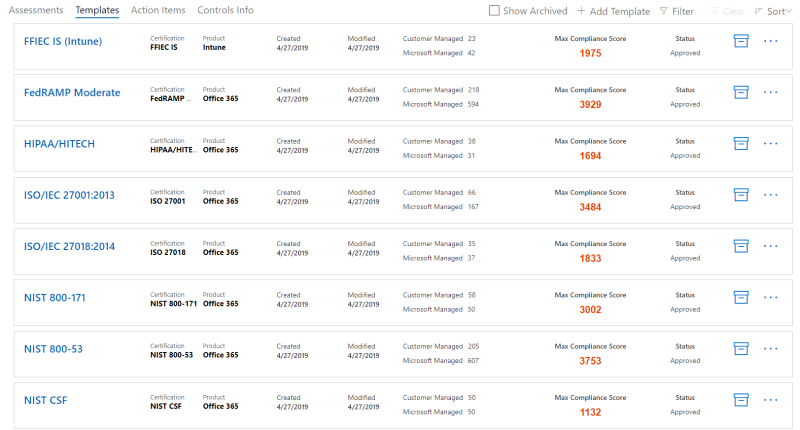

# <a name="work-with-microsoft-compliance-manager-preview"></a><span data-ttu-id="4a68c-104">Trabajar con el administrador de cumplimiento de Microsoft (versión preliminar)</span><span class="sxs-lookup"><span data-stu-id="4a68c-104">Work with Microsoft Compliance Manager (Preview)</span></span>

> [!IMPORTANT]
> <span data-ttu-id="4a68c-105">El administrador de cumplimiento de Microsoft es un panel y una herramienta de administración que proporciona un resumen de la protección de datos y las recomendaciones de Stature y recomendaciones para mejorar el cumplimiento y la protección de datos.</span><span class="sxs-lookup"><span data-stu-id="4a68c-105">Microsoft Compliance Manager is a dashboard and management tool that provides a summary of your data protection and compliance stature and recommendations to improve data protection and compliance.</span></span> <span data-ttu-id="4a68c-106">Las acciones del cliente que se proporcionan en el administrador de cumplimiento son recomendaciones; para evaluar la efectividad de estas recomendaciones en su entorno de reglamentación respectivo antes de la implementación, depende de su organización.</span><span class="sxs-lookup"><span data-stu-id="4a68c-106">The customer actions provided in Compliance Manager are recommendations; it is up to your organization to evaluate the effectiveness of these recommendations in their respective regulatory environment prior to implementation.</span></span> <span data-ttu-id="4a68c-107">Las recomendaciones que se encuentran en el administrador de cumplimiento no deben interpretarse como una garantía de cumplimiento.</span><span class="sxs-lookup"><span data-stu-id="4a68c-107">Recommendations found in Compliance Manager should not be interpreted as a guarantee of compliance.</span></span>

## <a name="access-compliance-manager"></a><span data-ttu-id="4a68c-108">Acceso al administrador de cumplimiento</span><span class="sxs-lookup"><span data-stu-id="4a68c-108">Access Compliance Manager</span></span>

<span data-ttu-id="4a68c-p103">Para obtener acceso al Administrador de cumplimiento, vaya al Portal de confianza de servicios. Cualquier usuario con una cuenta Microsoft o una cuenta de organización de Azure Active Directory puede obtener acceso al Administrador de cumplimiento.</span><span class="sxs-lookup"><span data-stu-id="4a68c-p103">You access Compliance Manager from the Service Trust Portal. Anyone with a Microsoft account or Azure Active Directory organizational account can access Compliance Manager.</span></span>
  
1. <span data-ttu-id="4a68c-111">Vaya a [https://servicetrust.microsoft.com](https://servicetrust.microsoft.com/).</span><span class="sxs-lookup"><span data-stu-id="4a68c-111">Go to [https://servicetrust.microsoft.com](https://servicetrust.microsoft.com/).</span></span>

2. <span data-ttu-id="4a68c-112">Inicie sesión con su cuenta de servicio de Microsoft, que es la cuenta de usuario de Office 365, Microsoft 365 o Azure Active Directory (Azure AD).</span><span class="sxs-lookup"><span data-stu-id="4a68c-112">Sign in with your Microsoft service account, which is your Office 365, Microsoft 365, or Azure Active Directory (Azure AD) user account.</span></span>

3. <span data-ttu-id="4a68c-113">En el portal de confianza de servicios, se recomienda seleccionar el **Administrador de cumplimiento**, que es la versión preliminar con las características más recientes.</span><span class="sxs-lookup"><span data-stu-id="4a68c-113">In the Service Trust Portal, we recommend selecting **Compliance Manager**, which is the preview version with the most current features.</span></span> <span data-ttu-id="4a68c-114">El **Administrador de cumplimiento (clásico)** le lleva a la versión anterior del administrador de cumplimiento.</span><span class="sxs-lookup"><span data-stu-id="4a68c-114">**Compliance Manager (Classic)** takes you to the previous version of Compliance Manager.</span></span>

4. <span data-ttu-id="4a68c-115">Cuando se muestre el acuerdo de no divulgación, léalo y seleccione **Aceptar**, que muestra el panel del administrador de cumplimiento.</span><span class="sxs-lookup"><span data-stu-id="4a68c-115">When the Non-Disclosure Agreement is displayed, read it and select **Agree**, which then displays your Compliance Manager dashboard.</span></span>

<span data-ttu-id="4a68c-116">Para comenzar, aparece una evaluación ISO/IEC 27001:2103 para Office 365 de forma predeterminada para su organización.</span><span class="sxs-lookup"><span data-stu-id="4a68c-116">To get you started, an ISO/IEC 27001:2103 Assessment for Office 365 appears by default for your organization.</span></span>

## <a name="administration"></a><span data-ttu-id="4a68c-117">Administración</span><span class="sxs-lookup"><span data-stu-id="4a68c-117">Administration</span></span>

<span data-ttu-id="4a68c-118">Hay funciones administrativas específicas que solo están disponibles para el administrador global y solo están visibles cuando inicia sesión con una cuenta de administrador global.</span><span class="sxs-lookup"><span data-stu-id="4a68c-118">There are specific administrative functions that are only available to the global administrator and only visible when logged in with a global administrator account.</span></span> <span data-ttu-id="4a68c-119">El administrador global puede asignar permisos de usuario y puede activar actualizaciones automáticas de puntuación segura para todas las acciones.</span><span class="sxs-lookup"><span data-stu-id="4a68c-119">The global administrator can assign user permissions, and can turn on automatic Secure Score updates for all actions.</span></span>
  
### <a name="assigning-compliance-manager-roles-to-users"></a><span data-ttu-id="4a68c-120">Asignar roles del Administrador de cumplimiento a usuarios</span><span class="sxs-lookup"><span data-stu-id="4a68c-120">Assigning Compliance Manager roles to users</span></span>

<span data-ttu-id="4a68c-121">Una vez que el administrador asigna roles de administrador de cumplimiento a otros usuarios, estos usuarios pueden ver los datos en el administrador de cumplimiento y realizar las acciones determinadas por su rol.</span><span class="sxs-lookup"><span data-stu-id="4a68c-121">Once the administrator assigns Compliance Manager roles to other users, those users can view data in Compliance Manager and perform actions determined by their role.</span></span> <span data-ttu-id="4a68c-122">El administrador también puede conceder acceso de solo lectura al administrador de cumplimiento asignando al usuario el [rol lector global en Azure Active Directory (Azure ad)](https://docs.microsoft.com/azure/active-directory/users-groups-roles/directory-assign-admin-roles#global-reader).</span><span class="sxs-lookup"><span data-stu-id="4a68c-122">The administrator can also give read-only access to Compliance Manager by assigning the user the [Global Reader role in Azure Active Directory (Azure AD)](https://docs.microsoft.com/azure/active-directory/users-groups-roles/directory-assign-admin-roles#global-reader).</span></span>

<span data-ttu-id="4a68c-123">Cada rol del administrador de cumplimiento tiene permisos ligeramente diferentes.</span><span class="sxs-lookup"><span data-stu-id="4a68c-123">Each Compliance Manager role has slightly different permissions.</span></span> <span data-ttu-id="4a68c-124">Puede ver los permisos asignados a cada rol, ver qué usuarios tienen roles y agregar o quitar usuarios de esa función a través del portal de confianza de servicios.</span><span class="sxs-lookup"><span data-stu-id="4a68c-124">You can view the permissions assigned to each role, see which users are in which roles, and add or remove users from that role through the Service Trust Portal.</span></span> <span data-ttu-id="4a68c-125">Seleccione el elemento de menú **Administrador** y elija la **configuración** que desea ver.</span><span class="sxs-lookup"><span data-stu-id="4a68c-125">Select the **Admin** menu item, and choose **Settings** to view.</span></span>
  

  
<span data-ttu-id="4a68c-127">Para agregar o quitar usuarios de los roles del Administrador de cumplimiento.</span><span class="sxs-lookup"><span data-stu-id="4a68c-127">To add or remove users from Compliance Manager roles.</span></span>
  
1. <span data-ttu-id="4a68c-128">Vaya a [https://servicetrust.microsoft.com](https://servicetrust.microsoft.com).</span><span class="sxs-lookup"><span data-stu-id="4a68c-128">Go to [https://servicetrust.microsoft.com](https://servicetrust.microsoft.com).</span></span>

2. <span data-ttu-id="4a68c-129">Inicie sesión con su cuenta de administrador global de Azure Active Directory.</span><span class="sxs-lookup"><span data-stu-id="4a68c-129">Sign in with your Azure Active Directory global administrator account.</span></span>

3. <span data-ttu-id="4a68c-130">En la barra de menús superior del portal de confianza del servicio, seleccione **Administrador** y, después, **configuración**.</span><span class="sxs-lookup"><span data-stu-id="4a68c-130">On the Service Trust Portal top menu bar, select **Admin** and then choose **Settings**.</span></span>

4. <span data-ttu-id="4a68c-131">En la lista desplegable **Seleccionar rol** , seleccione el rol que desea administrar.</span><span class="sxs-lookup"><span data-stu-id="4a68c-131">In the **Select Role** drop-down list, select the role that you want to manage.</span></span>

5. <span data-ttu-id="4a68c-132">Los usuarios agregados a cada rol se muestran en la página **Seleccionar rol**.</span><span class="sxs-lookup"><span data-stu-id="4a68c-132">Users added to each role are listed on the **Select Role** page.</span></span>

6. <span data-ttu-id="4a68c-133">Para agregar usuarios a este rol, seleccione **Agregar**.</span><span class="sxs-lookup"><span data-stu-id="4a68c-133">To add users to this role, select **Add**.</span></span> <span data-ttu-id="4a68c-134">En el cuadro de diálogo **Agregar usuarios** , seleccione el campo de usuario.</span><span class="sxs-lookup"><span data-stu-id="4a68c-134">In the **Add Users** dialog, select the user field.</span></span> <span data-ttu-id="4a68c-135">Puede desplazarse por la lista de usuarios disponibles o empezar a escribir el nombre de usuario para filtrar la lista en función del término de búsqueda.</span><span class="sxs-lookup"><span data-stu-id="4a68c-135">You can scroll through the list of available users or begin typing the user name to filter the list based on your search term.</span></span> <span data-ttu-id="4a68c-136">Seleccione el usuario para agregar esa cuenta a la lista **Agregar usuarios** aprovisionada con dicha función.</span><span class="sxs-lookup"><span data-stu-id="4a68c-136">Select the user to add that account to the **Add Users** list provisioned with that role.</span></span> <span data-ttu-id="4a68c-137">Si desea agregar varios usuarios a la vez, empiece a escribir un nombre de usuario para filtrar la lista y, a continuación, seleccione el usuario que desea agregar a la lista.</span><span class="sxs-lookup"><span data-stu-id="4a68c-137">If you would like to add multiple users concurrently, begin typing a user name to filter the list, and then select the user to add to the list.</span></span> <span data-ttu-id="4a68c-138">Seleccione **Guardar** para aprovisionar el rol seleccionado a estos usuarios.</span><span class="sxs-lookup"><span data-stu-id="4a68c-138">Select **Save** to provision the selected role to these users.</span></span> 

    
  
7. <span data-ttu-id="4a68c-140">Para quitar usuarios de este rol, seleccione los usuarios y seleccione **eliminar**.</span><span class="sxs-lookup"><span data-stu-id="4a68c-140">To remove users from this role, select the users and select **Delete**.</span></span>

    

### <a name="controlling-automatic-secure-score-updates"></a><span data-ttu-id="4a68c-142">Control de las actualizaciones automáticas de calificación segura</span><span class="sxs-lookup"><span data-stu-id="4a68c-142">Controlling automatic Secure Score updates</span></span>

<span data-ttu-id="4a68c-143">Las actualizaciones de puntuación segura se pueden activar automáticamente para todas las acciones, desactivadas para todas las acciones o establecidas por acción individual siguiendo estos pasos.</span><span class="sxs-lookup"><span data-stu-id="4a68c-143">Secure Score updates can be turned on automatically for all actions, turned off for all actions, or set by individual action by following these steps.</span></span>

1. <span data-ttu-id="4a68c-144">Inicie sesión en el [portal de confianza de servicios](https://servicetrust.microsoft.com) con su cuenta de administrador global.</span><span class="sxs-lookup"><span data-stu-id="4a68c-144">Sign in to the [Service Trust Portal](https://servicetrust.microsoft.com) with your global administrator account.</span></span>

2. <span data-ttu-id="4a68c-145">En la barra de menús del portal de confianza del servicio superior, en **más**, seleccione **Administrador** y, después, seleccione **configuración**.</span><span class="sxs-lookup"><span data-stu-id="4a68c-145">On the Service Trust Portal top menu bar, under **More**, select **Admin** and then choose **Settings**.</span></span>

3. <span data-ttu-id="4a68c-146">En la ficha **puntuación segura** , seleccione el botón correspondiente para **activar todas las acciones**, **desactivar para todas las acciones**o **establecer por acción.**</span><span class="sxs-lookup"><span data-stu-id="4a68c-146">In the **Secure Score** tab, select the corresponding button to either **turn on for all actions**, **turn off for all actions**, or **set per action.**</span></span>

<span data-ttu-id="4a68c-147">Si elige **establecer por acción,** siga estos pasos adicionales para activar las actualizaciones de puntuación segura para acciones individuales:</span><span class="sxs-lookup"><span data-stu-id="4a68c-147">If you choose **set per action,** take these additional steps to turn on Secure Score updates for individual actions:</span></span>

4. <span data-ttu-id="4a68c-148">Seleccione **Administrador de cumplimiento** en el menú superior (Nota: no seleccione "Administrador de cumplimiento (clásico)").</span><span class="sxs-lookup"><span data-stu-id="4a68c-148">Select **Compliance Manager** from the top menu (note: do not select "Compliance Manager (classic)").</span></span>

5. <span data-ttu-id="4a68c-149">Seleccione **Administración de inquilinos** en la esquina superior derecha de la pantalla.</span><span class="sxs-lookup"><span data-stu-id="4a68c-149">Select **Tenant Management** in the upper-right corner of your screen.</span></span>

6. <span data-ttu-id="4a68c-150">En el panel **acciones del cliente** , busque la acción prevista con puntos suspensivos (**...**) en la columna **acciones afectadas** .</span><span class="sxs-lookup"><span data-stu-id="4a68c-150">On the **Customer Actions** pane, find your intended action with an ellipsis (**...**) under the **Affected Actions** column.</span></span> <span data-ttu-id="4a68c-151">Haga clic en los puntos suspensivos y seleccione **Editar.**</span><span class="sxs-lookup"><span data-stu-id="4a68c-151">Click on the ellipses and select **Edit.**</span></span>

7. <span data-ttu-id="4a68c-152">Cambie el conmutador de alternancia de **actualización continua de puntuación segura** a **activado.**</span><span class="sxs-lookup"><span data-stu-id="4a68c-152">Switch the **Secure Score continuous update** toggle switch to **On.**</span></span>

8. <span data-ttu-id="4a68c-153">Seleccione **Guardar.**</span><span class="sxs-lookup"><span data-stu-id="4a68c-153">Select **Save.**</span></span> <span data-ttu-id="4a68c-154">Puntuación segura la supervisión continua ahora está activada para esa acción.</span><span class="sxs-lookup"><span data-stu-id="4a68c-154">Secure Score continuous monitoring is now turned on for that action.</span></span>

<span data-ttu-id="4a68c-155">**Nota:** Solo el administrador global puede activar o desactivar las actualizaciones automáticas para todas las acciones.</span><span class="sxs-lookup"><span data-stu-id="4a68c-155">**Note:** Only the global administrator can turn on or off automatic updates for all actions.</span></span> <span data-ttu-id="4a68c-156">El administrador del administrador de cumplimiento puede activar actualizaciones automáticas para acciones individuales, pero no para todas las acciones de forma global.</span><span class="sxs-lookup"><span data-stu-id="4a68c-156">The Compliance Manager administrator can turn on automatic updates for individual actions, but not for all actions globally.</span></span>

## <a name="groups"></a><span data-ttu-id="4a68c-157">Grupos</span><span class="sxs-lookup"><span data-stu-id="4a68c-157">Groups</span></span>

<span data-ttu-id="4a68c-158">Los grupos son contenedores que permiten organizar las evaluaciones y compartir información común y tareas de flujo de trabajo entre evaluaciones que tienen los mismos controles administrados por el cliente u otros relacionados.</span><span class="sxs-lookup"><span data-stu-id="4a68c-158">Groups are containers that allow you to organize Assessments and share common information and workflow tasks between Assessments that have the same or related customer-managed controls.</span></span>

<span data-ttu-id="4a68c-159">Puede agrupar las evaluaciones de forma lógica para usted, como por año, estándar, servicio o basándose en los equipos, las divisiones o las regiones geográficas de su organización.</span><span class="sxs-lookup"><span data-stu-id="4a68c-159">You can group Assessments in a way that is logical to you, such as by year, standard, service, or based on your organization's teams, divisions, or geographies.</span></span> <span data-ttu-id="4a68c-160">A continuación se muestran ejemplos de dos grupos y sus evaluaciones subyacentes:</span><span class="sxs-lookup"><span data-stu-id="4a68c-160">Below are examples of two groups and their underlying Assessments:</span></span>
  
- <span data-ttu-id="4a68c-161">**FFIEC es evaluaciones 2020**</span><span class="sxs-lookup"><span data-stu-id="4a68c-161">**FFIEC IS Assessments 2020**</span></span>
  - <span data-ttu-id="4a68c-162">Office 365 + FFIEC es</span><span class="sxs-lookup"><span data-stu-id="4a68c-162">Office 365 + FFIEC IS</span></span>
  - <span data-ttu-id="4a68c-163">Intune + FFIEC es</span><span class="sxs-lookup"><span data-stu-id="4a68c-163">Intune + FFIEC IS</span></span>
- <span data-ttu-id="4a68c-164">**Evaluaciones de privacidad y seguridad de los datos**</span><span class="sxs-lookup"><span data-stu-id="4a68c-164">**Data Security and Privacy Assessments**</span></span>
  - <span data-ttu-id="4a68c-165">Office 365 + ISO 27001:2013</span><span class="sxs-lookup"><span data-stu-id="4a68c-165">Office 365 + ISO 27001:2013</span></span>
  - <span data-ttu-id="4a68c-166">Office 365 + ISO 27018:2014</span><span class="sxs-lookup"><span data-stu-id="4a68c-166">Office 365 + ISO 27018:2014</span></span>

> [!NOTE]
> <span data-ttu-id="4a68c-167">Le recomendamos que determine una estrategia de agrupación para su organización *antes* de agregar nuevas evaluaciones.</span><span class="sxs-lookup"><span data-stu-id="4a68c-167">We recommend determining a grouping strategy for your organization *before* adding new Assessments.</span></span> <span data-ttu-id="4a68c-168">De forma predeterminada, hay disponible un grupo denominado "grupo predeterminado" para las evaluaciones iniciales.</span><span class="sxs-lookup"><span data-stu-id="4a68c-168">By default, a group named "Default Group" is available for your initial Assessments.</span></span>

### <a name="how-to-create-a-group"></a><span data-ttu-id="4a68c-169">Cómo crear un grupo</span><span class="sxs-lookup"><span data-stu-id="4a68c-169">How to create a group</span></span>

<span data-ttu-id="4a68c-170">No se pueden crear grupos como entidades independientes.</span><span class="sxs-lookup"><span data-stu-id="4a68c-170">Groups cannot be created as standalone entities.</span></span> <span data-ttu-id="4a68c-171">Un grupo siempre debe contener al menos una evaluación, por lo que, para poder crear un grupo, primero debe crear una evaluación para colocarla en el grupo.</span><span class="sxs-lookup"><span data-stu-id="4a68c-171">A group must always contain at least one Assessment, so in order to create a group, you must first create an Assessment to put in the group.</span></span> <span data-ttu-id="4a68c-172">Siga los pasos siguientes para crear un grupo:</span><span class="sxs-lookup"><span data-stu-id="4a68c-172">Follow the steps below to create a group:</span></span>

1. <span data-ttu-id="4a68c-173">Cree una nueva evaluación seleccionando **+ Agregar evaluación** cerca de la parte superior del panel.</span><span class="sxs-lookup"><span data-stu-id="4a68c-173">Create a new Assessment by selecting **+ Add Assessment** near the top of your dashboard.</span></span>
2. <span data-ttu-id="4a68c-174">En el panel desplegable **evaluación** , escriba un título para la evaluación y seleccione una plantilla en el menú desplegable.</span><span class="sxs-lookup"><span data-stu-id="4a68c-174">From the **Assessment** flyout pane, enter a title for your Assessment and select a template from the drop-down menu.</span></span>
3. <span data-ttu-id="4a68c-175">En **Seleccione un grupo o agregue un nuevo grupo**, seleccione **Agregar un nuevo grupo** y escriba el nombre del grupo en el campo siguiente.</span><span class="sxs-lookup"><span data-stu-id="4a68c-175">At **Please select a group or add a new group**, select **Add a new group** and enter your group name in the field below.</span></span>
4. <span data-ttu-id="4a68c-176">Para copiar la información de un grupo existente, active la opción **¿desea copiar los datos de un grupo existente?** a **activado.**</span><span class="sxs-lookup"><span data-stu-id="4a68c-176">To copy information from an existing group, toggle the **Would you like to copy the data from an existing group?** switch to **On.**</span></span> <span data-ttu-id="4a68c-177">Seleccione el grupo que desea copiar en el menú desplegable que hay debajo y active las casillas de verificación de los campos que desee aplicar a la nueva evaluación en el nuevo grupo.</span><span class="sxs-lookup"><span data-stu-id="4a68c-177">Select the group you want to copy from the drop-down menu underneath, and select the checkboxes of any fields you want to carry over to the new Assessment in your new group.</span></span>
5. <span data-ttu-id="4a68c-178">Haga clic en **Guardar**.</span><span class="sxs-lookup"><span data-stu-id="4a68c-178">Select **Save**.</span></span> <span data-ttu-id="4a68c-179">Cuando haya finalizado, el panel de control flotante se cerrará y el nuevo grupo se mostrará automáticamente en el panel.</span><span class="sxs-lookup"><span data-stu-id="4a68c-179">When completed, the flyout pane closes and your new group automatically displays on your dashboard.</span></span>

<span data-ttu-id="4a68c-180">Qué se debe saber al trabajar con grupos:</span><span class="sxs-lookup"><span data-stu-id="4a68c-180">What to know when working with groups:</span></span>
  
- <span data-ttu-id="4a68c-181">Los nombres de grupo (también denominados *identificadores de grupo*) deben ser únicos dentro de la organización.</span><span class="sxs-lookup"><span data-stu-id="4a68c-181">Group names (also called *Group IDs*) must be unique within your organization.</span></span>
- <span data-ttu-id="4a68c-182">Los grupos no tienen ninguna propiedad de seguridad.</span><span class="sxs-lookup"><span data-stu-id="4a68c-182">Groups do not have any security properties.</span></span> <span data-ttu-id="4a68c-183">Todos los permisos están asociados con evaluaciones.</span><span class="sxs-lookup"><span data-stu-id="4a68c-183">All permissions are associated with Assessments.</span></span>
- <span data-ttu-id="4a68c-184">Una vez que agregue una evaluación a un grupo, no se podrá cambiar la agrupación.</span><span class="sxs-lookup"><span data-stu-id="4a68c-184">Once you add an Assessment to a group, the grouping cannot be changed.</span></span> <span data-ttu-id="4a68c-185">Puede cambiar el nombre del grupo de evaluación, que cambia el nombre del grupo de evaluación para todas las evaluaciones asociadas con ese grupo.</span><span class="sxs-lookup"><span data-stu-id="4a68c-185">You can rename the assessment group, which changes the name of the assessment grouping for all the assessments associated with that group.</span></span>
- <span data-ttu-id="4a68c-186">Los controles de evaluación relacionados en diferentes evaluaciones dentro del mismo grupo se actualizan automáticamente cuando se completan.</span><span class="sxs-lookup"><span data-stu-id="4a68c-186">Related Assessment controls in different Assessments within the same group automatically update when completed.</span></span>
- <span data-ttu-id="4a68c-187">Si agrega una nueva evaluación a un grupo existente, la información común de las evaluaciones de ese grupo se copia en la nueva evaluación.</span><span class="sxs-lookup"><span data-stu-id="4a68c-187">If you add a new Assessment to an existing group, common information from Assessments in that group are copied to the new Assessment.</span></span>
- <span data-ttu-id="4a68c-188">Los grupos pueden contener evaluaciones para la misma certificación o reglamentación, pero cada grupo solo puede contener una evaluación para un par de certificación de producto específico.</span><span class="sxs-lookup"><span data-stu-id="4a68c-188">Groups can contain Assessments for the same certification or regulation, but each group can only contain one Assessment for a specific product-certification pair.</span></span> <span data-ttu-id="4a68c-189">Por ejemplo, un grupo no puede contener dos evaluaciones para Office 365 y NIST CSF.</span><span class="sxs-lookup"><span data-stu-id="4a68c-189">For example, a group can't contain two Assessments for Office 365 and NIST CSF.</span></span> <span data-ttu-id="4a68c-190">Un grupo puede contener varias evaluaciones para el mismo producto solo si la certificación o el Reglamento correspondiente para cada uno es diferente.</span><span class="sxs-lookup"><span data-stu-id="4a68c-190">A group can contain multiple Assessments for the same product only if the corresponding certification or regulation for each one is different.</span></span>
- <span data-ttu-id="4a68c-191">La ocultación de una evaluación rompe la relación entre esa evaluación y el grupo.</span><span class="sxs-lookup"><span data-stu-id="4a68c-191">Hiding an Assessment breaks the relationship between that Assessment and the group.</span></span> <span data-ttu-id="4a68c-192">Las actualizaciones adicionales a otras evaluaciones relacionadas ya no se reflejan en la evaluación oculta.</span><span class="sxs-lookup"><span data-stu-id="4a68c-192">Any further updates to other related Assessments are no longer reflected in the hidden assessment.</span></span> <span data-ttu-id="4a68c-193">([Obtenga información sobre cómo ocultar evaluaciones).](#hide-a-template-or-an-assessment)</span><span class="sxs-lookup"><span data-stu-id="4a68c-193">([Learn how to hide Assessments.](#hide-a-template-or-an-assessment))</span></span>
- <span data-ttu-id="4a68c-194">No se pueden eliminar los grupos.</span><span class="sxs-lookup"><span data-stu-id="4a68c-194">Groups cannot be deleted.</span></span>

## <a name="tenant-management"></a><span data-ttu-id="4a68c-195">Administración de inquilinos</span><span class="sxs-lookup"><span data-stu-id="4a68c-195">Tenant Management</span></span>

<span data-ttu-id="4a68c-196">El administrador de cumplimiento (versión preliminar) incluye una nueva interfaz para administrar los nuevos elementos de datos denominados **Administración de inquilinos**.</span><span class="sxs-lookup"><span data-stu-id="4a68c-196">Compliance Manager (Preview) includes a new interface for managing new data elements called **Tenant Management**.</span></span> <span data-ttu-id="4a68c-197">Esta interfaz permite administrar la configuración de todos los inquilinos:</span><span class="sxs-lookup"><span data-stu-id="4a68c-197">This interface enables you to manage tenant-wide settings:</span></span>

- <span data-ttu-id="4a68c-198">**Dimensiones:** Permite ver los metadatos de plantillas, evaluaciones y elementos de acción que permiten crear tablas dinámicas personalizadas para los filtros.</span><span class="sxs-lookup"><span data-stu-id="4a68c-198">**Dimensions:** View metadata for Templates, Assessments, and Action Items that allow you to create custom pivots for filters.</span></span>
- <span data-ttu-id="4a68c-199">**Propietarios:** Especifique un propietario para cada elemento de acción.</span><span class="sxs-lookup"><span data-stu-id="4a68c-199">**Owners:** Specify an owner for each Action Item.</span></span>
- <span data-ttu-id="4a68c-200">**Acciones del cliente:** Administrar la lista completa de elementos de acciones incluidos en el administrador de cumplimiento (versión preliminar) y habilitar o deshabilitar el control de puntuación segura para acciones integradas con puntuación segura.</span><span class="sxs-lookup"><span data-stu-id="4a68c-200">**Customer Actions:** Manage the complete list of Actions Items included in Compliance Manager (Preview) and enable/disable Secure Score monitoring for Actions that are integrated with Secure Score.</span></span>

<span data-ttu-id="4a68c-201">Seleccione **Administración de inquilinos** para abrir la interfaz de administración y use los siguientes pasos para administrar las **dimensiones**, los **propietarios**y **las acciones del cliente**.</span><span class="sxs-lookup"><span data-stu-id="4a68c-201">Select **Tenant Management** to open the management interface, and use the following steps to manage **Dimensions**, **Owners**, and **Customer Actions**.</span></span>

### <a name="dimensions"></a><span data-ttu-id="4a68c-202">Dimensions</span><span class="sxs-lookup"><span data-stu-id="4a68c-202">Dimensions</span></span>

<span data-ttu-id="4a68c-203">Las dimensiones son conjuntos de metadatos que proporcionan información sobre una plantilla, una evaluación o un elemento de acción.</span><span class="sxs-lookup"><span data-stu-id="4a68c-203">Dimensions are sets of metadata that provide information about a Template, an Assessment, or an Action Item.</span></span> <span data-ttu-id="4a68c-204">Las dimensiones usan el concepto de claves y valores, donde la clave de dimensión representa una propiedad y el valor de dimensión representa valores válidos para la propiedad.</span><span class="sxs-lookup"><span data-stu-id="4a68c-204">Dimensions use the concept of Keys and Values, where the Dimension Key represents a property, and Dimension Value represents valid values for the property.</span></span> <span data-ttu-id="4a68c-205">Por ejemplo, en el administrador de cumplimiento hay tres tipos de acciones.</span><span class="sxs-lookup"><span data-stu-id="4a68c-205">For example, in Compliance Manager there are three types of Actions.</span></span> <span data-ttu-id="4a68c-206">Se definen mediante una clave de dimensión de **tipo de acción** y los valores de dimensión de la **documentación**, **operación**y **técnico**.</span><span class="sxs-lookup"><span data-stu-id="4a68c-206">They are defined by a Dimension Key of **Action Type** and Dimension Values of **Documentation**, **Operational**, and **Technical**.</span></span> <span data-ttu-id="4a68c-207">Puede editar o eliminar las dimensiones existentes.</span><span class="sxs-lookup"><span data-stu-id="4a68c-207">You can edit or delete existing Dimensions.</span></span>

> [!IMPORTANT]
> <span data-ttu-id="4a68c-208">Puede agregar nuevas dimensiones y se pueden asignar a plantillas que ya haya importado.</span><span class="sxs-lookup"><span data-stu-id="4a68c-208">You can add new dimensions, and they can be assigned to Templates that you have already imported.</span></span> <span data-ttu-id="4a68c-209">También puede agregar nuevas dimensiones a todas las plantillas nuevas que cree.</span><span class="sxs-lookup"><span data-stu-id="4a68c-209">You can also add new dimensions to any new Templates you create.</span></span>

### <a name="owners"></a><span data-ttu-id="4a68c-210">Propietarios</span><span class="sxs-lookup"><span data-stu-id="4a68c-210">Owners</span></span>

<span data-ttu-id="4a68c-211">Los propietarios se usan para identificar a la parte responsable de cada control.</span><span class="sxs-lookup"><span data-stu-id="4a68c-211">Owners are used to identify the responsible party for each control.</span></span> <span data-ttu-id="4a68c-212">Todos los controles integrados son propiedad de Microsoft, clientes o ambos.</span><span class="sxs-lookup"><span data-stu-id="4a68c-212">All built-in controls are owned by Microsoft, by customers, or by both.</span></span> <span data-ttu-id="4a68c-213">Puede crear valores personalizados para los propietarios que se pueden usar para especificar más responsabilidades granulares en la organización.</span><span class="sxs-lookup"><span data-stu-id="4a68c-213">You can create custom values for Owners that can be used to specify more granular responsibilities within your organization.</span></span> <span data-ttu-id="4a68c-214">Por ejemplo, puede crear propietarios que representen grupos específicos, equipos o unidades de negocio dentro de su organización.</span><span class="sxs-lookup"><span data-stu-id="4a68c-214">For example, you could create Owners that represent specific groups, teams, or business units within your organization.</span></span>

#### <a name="add-an-owner"></a><span data-ttu-id="4a68c-215">Agregar un propietario</span><span class="sxs-lookup"><span data-stu-id="4a68c-215">Add an Owner</span></span>

1. <span data-ttu-id="4a68c-216">Abra **Administración de inquilinos** y seleccione **propietarios**.</span><span class="sxs-lookup"><span data-stu-id="4a68c-216">Open **Tenant Management** and select **Owners**.</span></span>
2. <span data-ttu-id="4a68c-217">Seleccione **+ Agregar propietario**.</span><span class="sxs-lookup"><span data-stu-id="4a68c-217">Select **+ Add owner**.</span></span>
3. <span data-ttu-id="4a68c-218">Especifique un nombre y una descripción para el propietario y seleccione **Guardar**.</span><span class="sxs-lookup"><span data-stu-id="4a68c-218">Provide a Name and Description for the Owner and select **Save**.</span></span> <span data-ttu-id="4a68c-219">La descripción se muestra en la columna propietario.</span><span class="sxs-lookup"><span data-stu-id="4a68c-219">The description is displayed in the Owner column.</span></span>

#### <a name="edit-an-owner"></a><span data-ttu-id="4a68c-220">Edición de un propietario</span><span class="sxs-lookup"><span data-stu-id="4a68c-220">Edit an Owner</span></span>

<span data-ttu-id="4a68c-221">No puede editar un nombre de propietario, pero puede modificar la descripción que se muestra en la columna propietario.</span><span class="sxs-lookup"><span data-stu-id="4a68c-221">You can’t edit an Owner name, but you can modify the description that is displayed in the Owner column.</span></span>

1. <span data-ttu-id="4a68c-222">Abra **Administración de inquilinos** y seleccione **propietarios**.</span><span class="sxs-lookup"><span data-stu-id="4a68c-222">Open **Tenant Management** and select **Owners**.</span></span>
2. <span data-ttu-id="4a68c-223">Busque el propietario que desea editar, seleccione los puntos suspensivos (...) junto a él y, después, haga clic en **Editar**.</span><span class="sxs-lookup"><span data-stu-id="4a68c-223">Locate the Owner you want to edit, select the ellipses (…) next to it, and select **Edit**.</span></span>
3. <span data-ttu-id="4a68c-224">Modifique la descripción según sea necesario y seleccione **Guardar**.</span><span class="sxs-lookup"><span data-stu-id="4a68c-224">Modify the Description as needed and select **Save**.</span></span>

#### <a name="delete-an-owner"></a><span data-ttu-id="4a68c-225">Eliminar un propietario</span><span class="sxs-lookup"><span data-stu-id="4a68c-225">Delete an Owner</span></span>

1. <span data-ttu-id="4a68c-226">Abra **Administración de inquilinos** y seleccione **propietarios**.</span><span class="sxs-lookup"><span data-stu-id="4a68c-226">Open **Tenant Management** and select **Owners**.</span></span>
2. <span data-ttu-id="4a68c-227">Busque el propietario que desea eliminar, seleccione los puntos suspensivos (...) junto a él y seleccione **eliminar**.</span><span class="sxs-lookup"><span data-stu-id="4a68c-227">Locate the Owner you want to delete, select the ellipses (…) next to it, and select **Delete**.</span></span>
3. <span data-ttu-id="4a68c-228">Cuando aparezca el mensaje de confirmación, seleccione **eliminar**.</span><span class="sxs-lookup"><span data-stu-id="4a68c-228">When the confirmation message appears, select **Delete**.</span></span>

### <a name="customer-actions"></a><span data-ttu-id="4a68c-229">Acciones del cliente</span><span class="sxs-lookup"><span data-stu-id="4a68c-229">Customer Actions</span></span>

<span data-ttu-id="4a68c-230">El área acciones del cliente muestra todas las acciones del cliente para todas las plantillas y evaluaciones en el administrador de cumplimiento (versión preliminar).</span><span class="sxs-lookup"><span data-stu-id="4a68c-230">The Customer Actions area shows all the customer actions for all Templates and Assessments in Compliance Manager (Preview).</span></span>

<span data-ttu-id="4a68c-231"></span><span class="sxs-lookup"><span data-stu-id="4a68c-231"></span></span>

<span data-ttu-id="4a68c-232">De un solo vistazo, puede ver el título, el propietario, la categoría, el cumplimiento y la puntuación de una acción, y determinar si está integrado con una puntuación segura.</span><span class="sxs-lookup"><span data-stu-id="4a68c-232">At a glance, you can see an Action’s title, owner, category, enforcement, and score, and determine if it is integrated with Secure Score.</span></span> <span data-ttu-id="4a68c-233">Puede expandir una acción y seleccionar **leer más** para leer la descripción de la acción y tener acceso a los vínculos de la descripción.</span><span class="sxs-lookup"><span data-stu-id="4a68c-233">You can expand an Action and select **Read More** to read the Action’s description and access any links in the description.</span></span> <span data-ttu-id="4a68c-234">También puede usar esta interfaz para habilitar y deshabilitar la integración de la puntuación segura en función de cada acción y para agregar acciones personalizadas.</span><span class="sxs-lookup"><span data-stu-id="4a68c-234">You can also use this interface to enable and disable Secure Score integration on a per-action basis, and to add custom actions.</span></span> <span data-ttu-id="4a68c-235">Las acciones que tienen capacidades de integración de puntuación segura tienen un botón de puntos suspensivos (...) junto a ellas (tenga en cuenta que las acciones personalizadas también tienen puntos suspensivos junto a ellas).</span><span class="sxs-lookup"><span data-stu-id="4a68c-235">Actions that have Secure Score integration capabilities have an ellipsis (…) next to them (note that custom actions also have an ellipsis next to them).</span></span>

#### <a name="enable-or-disable-secure-score-integration"></a><span data-ttu-id="4a68c-236">Habilitar o deshabilitar la integración de la puntuación segura</span><span class="sxs-lookup"><span data-stu-id="4a68c-236">Enable or disable Secure Score integration</span></span>

1. <span data-ttu-id="4a68c-237">Seleccione los puntos suspensivos (...) de la acción que desea modificar y seleccione **Editar**.</span><span class="sxs-lookup"><span data-stu-id="4a68c-237">Select the ellipses (…) for the Action you want to modify and select **Edit**.</span></span>
2. <span data-ttu-id="4a68c-238">Alterne el conmutador de la actualización continua de puntuación segura en activado o desactivado para habilitar o deshabilitar la supervisión continua mediante la puntuación segura.</span><span class="sxs-lookup"><span data-stu-id="4a68c-238">Toggle the switch for Secure Score continuous update to On or Off to enable or disable continuous monitoring through Secure Score.</span></span>
3. <span data-ttu-id="4a68c-239">Haga clic en **Guardar**.</span><span class="sxs-lookup"><span data-stu-id="4a68c-239">Select **Save**.</span></span>

<span data-ttu-id="4a68c-240">Cuando las organizaciones implementan por primera vez Microsoft 365 u Office 365, la puntuación segura tarda aproximadamente siete días en completarse en recopilar datos y factorizar la puntuación.</span><span class="sxs-lookup"><span data-stu-id="4a68c-240">When organizations first deploy Microsoft 365 or Office 365, it takes approximately seven days for Secure Score to fully collect data and factor it into your score.</span></span> <span data-ttu-id="4a68c-241">Durante este tiempo, la configuración de la opción de actualización continua de puntuación segura como **desactivada** y la configuración manual de una acción para **implementada** contará esa acción hacia su puntuación.</span><span class="sxs-lookup"><span data-stu-id="4a68c-241">During that time, setting the Secure Score continuous update switch to **Off** and manually setting an action to **implemented** will count that action toward your score.</span></span> <span data-ttu-id="4a68c-242">Después de los siete días iniciales, al desactivar la actualización continua de la actualización segura, se habilitará la supervisión continua a partir de ese momento.</span><span class="sxs-lookup"><span data-stu-id="4a68c-242">After the initial seven days, turning Secure Score continuous update back on will enable continuous monitoring from that point forward.</span></span>

<span data-ttu-id="4a68c-243">Las acciones que no son compatibles con la integración de la puntuación segura se pueden implementar de forma manual.</span><span class="sxs-lookup"><span data-stu-id="4a68c-243">Any actions that are not supported by Secure Score integration can be manually implemented.</span></span> <span data-ttu-id="4a68c-244">Una implementación manual se aplicará a la puntuación del grupo de la acción.</span><span class="sxs-lookup"><span data-stu-id="4a68c-244">A manual implementation will factor into the score for that action's group.</span></span>

#### <a name="add-a-customer-action"></a><span data-ttu-id="4a68c-245">Adición de una acción de cliente</span><span class="sxs-lookup"><span data-stu-id="4a68c-245">Add a customer action</span></span>

1. <span data-ttu-id="4a68c-246">Seleccione **+ Agregar acción de cliente**.</span><span class="sxs-lookup"><span data-stu-id="4a68c-246">Select **+ Add Customer Action**.</span></span>
2. <span data-ttu-id="4a68c-247">Proporcione un título único para la acción en el campo **título** .</span><span class="sxs-lookup"><span data-stu-id="4a68c-247">Provide a unique title for the Action in the **Title** field.</span></span>
3. <span data-ttu-id="4a68c-248">Proporcionar una puntuación de cumplimiento para la acción en el campo de **puntuación de cumplimiento máximo** (puede ser cualquier número entre 1-99).</span><span class="sxs-lookup"><span data-stu-id="4a68c-248">Provide a Compliance Score for the Action in the **Maximum Compliance Score** field (this can be any number from 1-99).</span></span>
4. <span data-ttu-id="4a68c-249">Use la lista desplegable **tipo de acción** para especificar el tipo de acción que va a agregar.</span><span class="sxs-lookup"><span data-stu-id="4a68c-249">Use the **Action Type** dropdown to specify the type of Action you are adding.</span></span> <span data-ttu-id="4a68c-250">Si el tipo de acción no existe, puede agregarlo agregando el valor a la clave de dimensión tipo de acción.</span><span class="sxs-lookup"><span data-stu-id="4a68c-250">If the Action Type does not exist, you can add it by adding the value to the Action Type dimension key.</span></span>
5. <span data-ttu-id="4a68c-251">Use la lista desplegable **dimensiones** para especificar o agregar claves de dimensión y valores para la acción.</span><span class="sxs-lookup"><span data-stu-id="4a68c-251">Use the **Dimensions** dropdown to specify or add dimension keys and values for the Action.</span></span>
6. <span data-ttu-id="4a68c-252">Use la lista desplegable de **propietario** para especificar el propietario de la acción.</span><span class="sxs-lookup"><span data-stu-id="4a68c-252">Use the **Owner** dropdown to specify the owner for Action.</span></span>
7. <span data-ttu-id="4a68c-253">Seleccione **+** esta acción para agregar una descripción y un título de descripción para la acción.</span><span class="sxs-lookup"><span data-stu-id="4a68c-253">Select **+** to add a description and description title for the Action.</span></span>
8. <span data-ttu-id="4a68c-254">Seleccione la **X** para cerrar la hoja Descripción.</span><span class="sxs-lookup"><span data-stu-id="4a68c-254">Select the **X** to close the Description blade.</span></span>
9. <span data-ttu-id="4a68c-255">Seleccione **Guardar** para guardar la acción del cliente.</span><span class="sxs-lookup"><span data-stu-id="4a68c-255">Select **Save** to save the Customer Action.</span></span>

#### <a name="delete-a-customer-action"></a><span data-ttu-id="4a68c-256">Eliminación de una acción de cliente</span><span class="sxs-lookup"><span data-stu-id="4a68c-256">Delete a customer action</span></span>

1. <span data-ttu-id="4a68c-257">Seleccione los puntos suspensivos (...) de la acción que desea modificar y seleccione **eliminar**.</span><span class="sxs-lookup"><span data-stu-id="4a68c-257">Select the ellipses (…) for the Action you want to modify and select **Delete**.</span></span>
2. <span data-ttu-id="4a68c-258">Cuando aparezca el mensaje de confirmación, seleccione **eliminar**.</span><span class="sxs-lookup"><span data-stu-id="4a68c-258">When the confirmation message appears, select **Delete**.</span></span>

## <a name="assessments"></a><span data-ttu-id="4a68c-259">Evaluaciones</span><span class="sxs-lookup"><span data-stu-id="4a68c-259">Assessments</span></span>

### <a name="add-an-assessment"></a><span data-ttu-id="4a68c-260">Adición de una evaluación</span><span class="sxs-lookup"><span data-stu-id="4a68c-260">Add an Assessment</span></span>
  
1. <span data-ttu-id="4a68c-261">En el panel de evaluaciones, seleccione **+ Agregar evaluación**.</span><span class="sxs-lookup"><span data-stu-id="4a68c-261">In the Assessments dashboard, select **+ Add Assessment**.</span></span>

2. <span data-ttu-id="4a68c-262">Cuando se abra el Blade, escriba la siguiente información:</span><span class="sxs-lookup"><span data-stu-id="4a68c-262">When the blade opens, enter the following information:</span></span>

    - <span data-ttu-id="4a68c-263">**Title (obligatorio):** Escriba un título para la evaluación</span><span class="sxs-lookup"><span data-stu-id="4a68c-263">**Title (required):** Enter a title for your Assessment</span></span>
    - <span data-ttu-id="4a68c-264">**Seleccione una plantilla (obligatorio):** Selección de una plantilla estándar o personalizada</span><span class="sxs-lookup"><span data-stu-id="4a68c-264">**Please select a template (required):** Select a standard or custom template</span></span>
    - <span data-ttu-id="4a68c-265">**Seleccione un grupo o agregue un nuevo grupo (obligatorio):** Seleccione un grupo existente o elija Agregar un grupo nuevo y proporcione un nombre de grupo único.</span><span class="sxs-lookup"><span data-stu-id="4a68c-265">**Please select a group or add a new group (required):** Select an existing group or choose to add a new group, and provide a unique group name</span></span>
    - <span data-ttu-id="4a68c-266">**¿Desea copiar los datos de un grupo existente? (opcional):** conmute el control para habilitar la copia del grupo y, a continuación, haga lo siguiente:</span><span class="sxs-lookup"><span data-stu-id="4a68c-266">**Would you like to copy the data from an existing group? (optional):** Toggle the control to enable group copy and then:</span></span>
        - <span data-ttu-id="4a68c-267">**Seleccione un grupo (opcional):** Si la copia de grupo está habilitada, seleccione el grupo desde el que desea copiar</span><span class="sxs-lookup"><span data-stu-id="4a68c-267">**Select a group (optional):** If group copy is enabled, select the group to copy from</span></span>
            - <span data-ttu-id="4a68c-268">**Detalles de la implementación (opcional):** Seleccione esta selección para copiar los detalles de implementación en el nuevo grupo.</span><span class="sxs-lookup"><span data-stu-id="4a68c-268">**Implementation Details (optional):** Select to copy implementation details to the new group</span></span>
            - <span data-ttu-id="4a68c-269">**Plan de pruebas & información adicional (opcional):** Seleccione esta selección para copiar el plan de pruebas y detalles de información adicional al nuevo grupo</span><span class="sxs-lookup"><span data-stu-id="4a68c-269">**Test plan & additional information (optional):** Select to copy test plan and additional information details to the new group</span></span>
            - <span data-ttu-id="4a68c-270">**Documentos (opcional):** Seleccione esta selección para copiar los documentos en el nuevo grupo.</span><span class="sxs-lookup"><span data-stu-id="4a68c-270">**Documents (optional):** Select to copy documents to the new group</span></span>

3. <span data-ttu-id="4a68c-271">Seleccione **Guardar** para crear la evaluación.</span><span class="sxs-lookup"><span data-stu-id="4a68c-271">Select **Save** to create the Assessment.</span></span>

 <span data-ttu-id="4a68c-272">La nueva evaluación aparece en el panel de evaluación y muestra la siguiente información:</span><span class="sxs-lookup"><span data-stu-id="4a68c-272">The new Assessment appears on the Assessment dashboard and displays the following information:</span></span>

- <span data-ttu-id="4a68c-273">El título de la evaluación.</span><span class="sxs-lookup"><span data-stu-id="4a68c-273">The title of the Assessment.</span></span>
- <span data-ttu-id="4a68c-274">Las dimensiones de la evaluación, incluida la certificación, el entorno y el producto aplicados a la evaluación.</span><span class="sxs-lookup"><span data-stu-id="4a68c-274">The dimensions of the Assessment, including certification, environment, and product applied to the Assessment.</span></span>
- <span data-ttu-id="4a68c-275">La fecha en que se creó y la fecha en que se modificó por última vez.</span><span class="sxs-lookup"><span data-stu-id="4a68c-275">The date it was created and date when it was last modified.</span></span>
- <span data-ttu-id="4a68c-276">La puntuación de la evaluación que se muestra como un porcentaje.</span><span class="sxs-lookup"><span data-stu-id="4a68c-276">The Assessment Score shown as a percentage.</span></span> <span data-ttu-id="4a68c-277">Esta puntuación incluye automáticamente las puntuaciones de los controles administrados por Microsoft y de la puntuación segura.</span><span class="sxs-lookup"><span data-stu-id="4a68c-277">This score automatically includes your scores from Microsoft-managed controls and from Secure Score.</span></span>
- <span data-ttu-id="4a68c-278">Indicadores de progreso que muestran el número de controles evaluados administrados por Microsoft y por el cliente.</span><span class="sxs-lookup"><span data-stu-id="4a68c-278">Progress indicators that show the number of assessed Microsoft-managed and customer-manged controls.</span></span>

### <a name="copying-information-from-existing-assessments"></a><span data-ttu-id="4a68c-279">Copiar información de evaluaciones existentes</span><span class="sxs-lookup"><span data-stu-id="4a68c-279">Copying information from existing Assessments</span></span>

<span data-ttu-id="4a68c-280">Al crear una evaluación, tiene la opción de copiar la información de un grupo existente.</span><span class="sxs-lookup"><span data-stu-id="4a68c-280">When you create an Assessment, you have the option to copy information from an existing group.</span></span> <span data-ttu-id="4a68c-281">Esto le permite aplicar la información especificada en la evaluación copiada a los mismos controles en la nueva evaluación.</span><span class="sxs-lookup"><span data-stu-id="4a68c-281">This allows you to apply the information entered into the copied assessment to the same controls in the new Assessment.</span></span> <span data-ttu-id="4a68c-282">Por ejemplo, si tiene un grupo para todas las evaluaciones relacionadas con FFIEC en su organización, puede copiar la siguiente información de las evaluaciones existentes:</span><span class="sxs-lookup"><span data-stu-id="4a68c-282">For example, if you have a group for all FFIEC-related Assessments in your organization, you can copy the following information from existing assessments:</span></span>

- <span data-ttu-id="4a68c-283">Detalles de la implementación</span><span class="sxs-lookup"><span data-stu-id="4a68c-283">Implementation Details</span></span>
- <span data-ttu-id="4a68c-284">Plan de pruebas & información adicional</span><span class="sxs-lookup"><span data-stu-id="4a68c-284">Test Plan & Additional Information</span></span>
- <span data-ttu-id="4a68c-285">Documentos</span><span class="sxs-lookup"><span data-stu-id="4a68c-285">Documents</span></span>

#### <a name="copy-information-from-an-existing-assessment-to-a-new-assessment"></a><span data-ttu-id="4a68c-286">Copiar información de una evaluación existente a una nueva evaluación</span><span class="sxs-lookup"><span data-stu-id="4a68c-286">Copy information from an existing Assessment to a new Assessment</span></span>
  
1. <span data-ttu-id="4a68c-287">En el panel de evaluación, seleccione **+ Agregar evaluación**.</span><span class="sxs-lookup"><span data-stu-id="4a68c-287">In the Assessment dashboard, select **+ Add Assessment**.</span></span>
    
2. <span data-ttu-id="4a68c-288">En la ventana **Agregar una evaluación** , complete la siguiente información:</span><span class="sxs-lookup"><span data-stu-id="4a68c-288">In the **Add an Assessment** window, complete the following information</span></span>

    - <span data-ttu-id="4a68c-289">**Title (obligatorio):** Escriba un título para la evaluación.</span><span class="sxs-lookup"><span data-stu-id="4a68c-289">**Title (required):** Enter a title for your Assessment.</span></span>
    - <span data-ttu-id="4a68c-290">**Seleccione una plantilla (obligatorio):** Seleccione una plantilla estándar o personalizada.</span><span class="sxs-lookup"><span data-stu-id="4a68c-290">**Please select a template (required):** Select a standard or custom template.</span></span>
    - <span data-ttu-id="4a68c-291">**Seleccione un grupo o agregue un nuevo grupo (obligatorio):** Elija **Agregar un nuevo grupo** y proporcione un nombre de grupo único.</span><span class="sxs-lookup"><span data-stu-id="4a68c-291">**Please select a group or add a new group (required):** Choose **Add a new group** and provide a unique group name.</span></span>
    - <span data-ttu-id="4a68c-292">**¿Desea copiar los datos de un grupo existente? (opcional):** cambie el control a activado para habilitar la copia del grupo y, a continuación:- **Seleccione un grupo (opcional):** si la copia de grupo está habilitada, seleccione el grupo desde el que se va a copiar.</span><span class="sxs-lookup"><span data-stu-id="4a68c-292">**Would you like to copy the data from an existing group? (optional):** Toggle the control to On to enable group copy and then: - **Select a group (optional):** If group copy is enabled, select the group to copy from.</span></span>
            <span data-ttu-id="4a68c-293">- **Detalles de la implementación (opcional):** Seleccione esta selección para copiar los detalles de implementación en el nuevo grupo.</span><span class="sxs-lookup"><span data-stu-id="4a68c-293">- **Implementation Details (optional):** Select to copy implementation details to the new group.</span></span>
            <span data-ttu-id="4a68c-294">- **Plan de pruebas & información adicional (opcional):** Seleccione esta selección para copiar el plan de pruebas y detalles de información adicional al nuevo grupo.</span><span class="sxs-lookup"><span data-stu-id="4a68c-294">- **Test plan & additional information (optional):** Select to copy test plan and additional information details to the new group.</span></span>
            <span data-ttu-id="4a68c-295">- **Documentos (opcional):** Seleccione esta selección para copiar los documentos en el nuevo grupo.</span><span class="sxs-lookup"><span data-stu-id="4a68c-295">- **Documents (optional):** Select to copy documents to the new group.</span></span>

3. <span data-ttu-id="4a68c-296">Seleccione **Guardar** para crear la evaluación.</span><span class="sxs-lookup"><span data-stu-id="4a68c-296">Select **Save** to create the Assessment.</span></span>

### <a name="view-an-assessment"></a><span data-ttu-id="4a68c-297">Ver una evaluación</span><span class="sxs-lookup"><span data-stu-id="4a68c-297">View an Assessment</span></span>
  
1. <span data-ttu-id="4a68c-298">En el panel de evaluaciones, seleccione el nombre de la evaluación para abrirlo y ver la información de controles y elementos de acción.</span><span class="sxs-lookup"><span data-stu-id="4a68c-298">In the Assessments dashboard, select the assessment name to open it and view the Action Items and Controls Info.</span></span>

<span data-ttu-id="4a68c-299">A continuación, se muestra un ejemplo de la evaluación de Office 365 e ISO 27001.</span><span class="sxs-lookup"><span data-stu-id="4a68c-299">Here's an example of the Assessment for Office 365 and ISO 27001.</span></span> <span data-ttu-id="4a68c-300">La primera vista ilustra la nueva vista de elementos de acción en el administrador de cumplimiento (versión preliminar).</span><span class="sxs-lookup"><span data-stu-id="4a68c-300">The first view illustrates the new Action Items view in Compliance Manager (Preview).</span></span>


<span data-ttu-id="4a68c-302">Las acciones se muestran en orden alfabético, y a cada acción se le asigna una puntuación y un propietario.</span><span class="sxs-lookup"><span data-stu-id="4a68c-302">The Actions are listed in alphabetical order, and each Action is assigned a score and an owner.</span></span> <span data-ttu-id="4a68c-303">Seleccione el vínculo **leer más** para leer los detalles de cada acción.</span><span class="sxs-lookup"><span data-stu-id="4a68c-303">Select  the **Read More** link to read the details of each Action.</span></span> 


<span data-ttu-id="4a68c-305">Seleccione el vínculo **revisión** para administrar, asignar, implementar y probar la acción.</span><span class="sxs-lookup"><span data-stu-id="4a68c-305">Select the **Review** link to manage, assign, implement, and test the action.</span></span> <span data-ttu-id="4a68c-306">A continuación se muestra un ejemplo de acción.</span><span class="sxs-lookup"><span data-stu-id="4a68c-306">Below is an example Action.</span></span>


<span data-ttu-id="4a68c-308">En versiones anteriores del administrador de cumplimiento, el flujo de trabajo para implementar los requisitos se realizó en el nivel de control.</span><span class="sxs-lookup"><span data-stu-id="4a68c-308">In previous versions of Compliance Manager, the workflow for implementing requirements was performed at the Control level.</span></span> <span data-ttu-id="4a68c-309">Un responsable de cumplimiento asignaría un control a alguien para implementar el control.</span><span class="sxs-lookup"><span data-stu-id="4a68c-309">A compliance officer would assign a control to someone to implement the control.</span></span> <span data-ttu-id="4a68c-310">Hubo dos inconvenientes:</span><span class="sxs-lookup"><span data-stu-id="4a68c-310">There were two drawbacks to this:</span></span>

- <span data-ttu-id="4a68c-311">A menudo, los controles tenían varias acciones asociadas a ellos, y el usuario al que se asignó un control puede no ser la persona adecuada para completar todas las acciones necesarias para implementar el control</span><span class="sxs-lookup"><span data-stu-id="4a68c-311">Controls often had multiple actions associated with them, and the user to whom a control was assigned, might not be the right person to complete all actions that were required to implement the control</span></span>
- <span data-ttu-id="4a68c-312">La combinación de tareas independientes en una sola acción impidió la recopilación de las señales y la telemetría que se usa para registrar automáticamente los cambios en la configuración del espacio empresarial en el administrador de cumplimiento (versión preliminar).</span><span class="sxs-lookup"><span data-stu-id="4a68c-312">Combining separate tasks into a single Action prevented the collection of the signals and telemetry that is used to automatically record tenant configuration changes in Compliance Manager (Preview).</span></span>

<span data-ttu-id="4a68c-313">En el administrador de cumplimiento (versión preliminar), el proceso de flujo de trabajo se ha movido del nivel de control al nivel de acción.</span><span class="sxs-lookup"><span data-stu-id="4a68c-313">In Compliance Manager (Preview), the workflow process has moved from the Control level to the Action level.</span></span> <span data-ttu-id="4a68c-314">Al revisar una acción, se pueden usar los siguientes campos para administrar el flujo de trabajo de la acción:</span><span class="sxs-lookup"><span data-stu-id="4a68c-314">When reviewing an Action, the following fields can be used to manage the Action workflow:</span></span>

- <span data-ttu-id="4a68c-315">**Asignar usuario:** Seleccione este campo para elegir o especificar el usuario a quien se debe asignar esta acción.</span><span class="sxs-lookup"><span data-stu-id="4a68c-315">**Assign User:** Select this field to choose or enter the user to whom this Action should be assigned.</span></span> <span data-ttu-id="4a68c-316">Puede desplazarse por la lista o escribir un nombre para encontrarla y, a continuación, seleccionarla.</span><span class="sxs-lookup"><span data-stu-id="4a68c-316">You can scroll through the list, or type a name to find it, and then select it.</span></span>
- <span data-ttu-id="4a68c-317">**Administrar documentos:** Puede cargar pruebas de implementación en forma de documentos de Office, archivos de imagen y capturas de pantallas, resultados de PowerShell en CSV o TXT y PDF.</span><span class="sxs-lookup"><span data-stu-id="4a68c-317">**Manage Documents:** You can upload evidence of implementation in the form of Office documents, image files and screenshots, PowerShell output in CSV or TXT, and PDFs.</span></span>
- <span data-ttu-id="4a68c-318">**Estado de la implementación:** Se usa para indicar el estado de implementación actual de la acción.</span><span class="sxs-lookup"><span data-stu-id="4a68c-318">**Implementation Status:** Used to indicate the Action’s current implementation status.</span></span> <span data-ttu-id="4a68c-319">Los valores posibles no se implementan, implementan, implementaciones alternativas, están planeadas y no se encuentran en el ámbito.</span><span class="sxs-lookup"><span data-stu-id="4a68c-319">Possible values are Not Implemented, Implemented, Alternative Implementation, Planned, and Not in Scope.</span></span>
- <span data-ttu-id="4a68c-320">**Fecha de implementación:** Fecha en que se realizó la acción.</span><span class="sxs-lookup"><span data-stu-id="4a68c-320">**Implementation Date:** The date on which the Action was taken.</span></span>
- <span data-ttu-id="4a68c-321">**Resultado de la prueba:** Se usa para indicar los resultados de la validación de la implementación.</span><span class="sxs-lookup"><span data-stu-id="4a68c-321">**Test Result:** Used to indicate the results of implementation validation.</span></span> <span data-ttu-id="4a68c-322">Los valores posibles no son evaluados, Passed, failed-low risk, failed-Medium Risk, Failed (riesgo elevado) y no en Scope.</span><span class="sxs-lookup"><span data-stu-id="4a68c-322">Possible values are Not Assessed, Passed, Failed-Low Risk, Failed-Medium Risk, Failed-High Risk, and Not in Scope.</span></span>
- <span data-ttu-id="4a68c-323">**Fecha de la prueba:** La fecha en la que se produjo la validación.</span><span class="sxs-lookup"><span data-stu-id="4a68c-323">**Test Date:** The date on which validation occurred.</span></span>
- <span data-ttu-id="4a68c-324">**Notas de implementación:** Escriba los detalles de implementación de la organización, junto con las notas que desee incluir.</span><span class="sxs-lookup"><span data-stu-id="4a68c-324">**Implementation Notes:** Enter implementation details for your organization, along with any notes that you want to include.</span></span>
- <span data-ttu-id="4a68c-325">**Plan de pruebas:** Escriba los detalles del plan de pruebas para esta acción, junto con las notas que desee incluir.</span><span class="sxs-lookup"><span data-stu-id="4a68c-325">**Test Plan:** Enter the test plan details for this action, along with any notes that you want to include.</span></span>
- <span data-ttu-id="4a68c-326">**Información adicional:** Especifique la información adicional sobre esta acción o cómo se implementó en la organización, junto con las notas que desee incluir.</span><span class="sxs-lookup"><span data-stu-id="4a68c-326">**Additional Information:** Enter any additional information about this Action or how it was implemented in your organization, along with any notes you want to include.</span></span>

<span data-ttu-id="4a68c-327">El administrador de cumplimiento (versión preliminar) también incluye la tabla dinámica basada en el control que se encuentra en las versiones anteriores.</span><span class="sxs-lookup"><span data-stu-id="4a68c-327">Compliance Manager (Preview) also includes the control-based pivot found in previous versions.</span></span> <span data-ttu-id="4a68c-328">Seleccione el panel de **información de controles** para verlo.</span><span class="sxs-lookup"><span data-stu-id="4a68c-328">Select the **Controls Info** dashboard to view it.</span></span> <span data-ttu-id="4a68c-329">Puede ver la información de los controles en el nivel de evaluación y de plantilla.</span><span class="sxs-lookup"><span data-stu-id="4a68c-329">You can view information for controls at the Assessment and Template level.</span></span> <span data-ttu-id="4a68c-330">A continuación se muestra un ejemplo del panel de información de controles para evaluaciones.</span><span class="sxs-lookup"><span data-stu-id="4a68c-330">Below is an example of the Controls Info dashboard for Assessments.</span></span>


<span data-ttu-id="4a68c-332">Para las evaluaciones, se muestra el panel de información de controles:</span><span class="sxs-lookup"><span data-stu-id="4a68c-332">For Assessments, the Controls Info dashboard displays:</span></span>

- <span data-ttu-id="4a68c-333">Una lista desplegable de **Grupo** para seleccionar el grupo que se va a ver (cuando se usan varios grupos).</span><span class="sxs-lookup"><span data-stu-id="4a68c-333">A **Group** dropdown to select which Group to view (when using multiple groups).</span></span>
- <span data-ttu-id="4a68c-334">Un cuadro desplegable de **evaluación** para seleccionar qué evaluación desea ver.</span><span class="sxs-lookup"><span data-stu-id="4a68c-334">An **Assessment** dropdown to select which Assessment to view.</span></span>
- <span data-ttu-id="4a68c-335">Metadatos sobre la evaluación seleccionada, que incluye:</span><span class="sxs-lookup"><span data-stu-id="4a68c-335">Metadata about the selected Assessment, including:</span></span>
    - <span data-ttu-id="4a68c-336">Un indicador de progreso para **los controles evaluados** que muestra el número de controles calculados sobre el número total de controles.</span><span class="sxs-lookup"><span data-stu-id="4a68c-336">A progress indicator for **Assessed Controls** showing the number of assessed controls over the total number of controls.</span></span>
    - <span data-ttu-id="4a68c-337">La **puntuación de cumplimiento** actual para la evaluación, que se muestra como un porcentaje.</span><span class="sxs-lookup"><span data-stu-id="4a68c-337">The current **Compliance Score** for the Assessment, shown as a percentage.</span></span>
    - <span data-ttu-id="4a68c-338">Detalles sobre la **certificación** y el **producto** usados en la evaluación.</span><span class="sxs-lookup"><span data-stu-id="4a68c-338">Details about the **Certification** and **Product** used in the Assessment.</span></span>
    - <span data-ttu-id="4a68c-339">**Estado** actual de la evaluación y fecha de la última **modificación** .</span><span class="sxs-lookup"><span data-stu-id="4a68c-339">The current **Status** of and last **Modified** date for the Assessment.</span></span>
- <span data-ttu-id="4a68c-340">Una lista de los **servicios de ámbito** de la evaluación.</span><span class="sxs-lookup"><span data-stu-id="4a68c-340">A list of **In Scope Services** for the Assessment.</span></span>
- <span data-ttu-id="4a68c-341">Detalles de los controles, agrupados por familia de controles, con vínculos a acciones del cliente y detalles de implementación de Microsoft:</span><span class="sxs-lookup"><span data-stu-id="4a68c-341">Details of the controls, grouped by Control Family, with links to customer actions and Microsoft implementation details:</span></span>
    - <span data-ttu-id="4a68c-342">**Sus acciones** muestran las acciones del cliente que puede realizar para satisfacer algunos o todos los requisitos del control.</span><span class="sxs-lookup"><span data-stu-id="4a68c-342">**Your Actions** displays the customer actions that you can perform to satisfy some or all the control’s requirements.</span></span> <span data-ttu-id="4a68c-343">Muchos controles tienen varias acciones asociadas a ellos, y todas las acciones asociadas a un control se muestran aquí.</span><span class="sxs-lookup"><span data-stu-id="4a68c-343">Many controls have multiple Actions associated with them, and all Actions associated with a control are displayed here.</span></span> <span data-ttu-id="4a68c-344">Las acciones tienen la misma interfaz de usuario que las que aparecen en el panel acciones.</span><span class="sxs-lookup"><span data-stu-id="4a68c-344">The Actions here have the same UI as those listed in the Actions dashboard.</span></span>
    - <span data-ttu-id="4a68c-345">**Acciones de Microsoft** muestra la lista de controles del marco interno de Microsoft que se aplican al control de certificación seleccionado.</span><span class="sxs-lookup"><span data-stu-id="4a68c-345">**Microsoft Actions** displays the list of controls from Microsoft’s internal framework that apply to the selected certification control.</span></span> <span data-ttu-id="4a68c-346">Para cada control interno, seleccione **implementado** para ver los detalles de implementación y pruebas de Microsoft, junto con el resultado de la prueba y la fecha de prueba, como se muestra a continuación.</span><span class="sxs-lookup"><span data-stu-id="4a68c-346">For each internal control, select **Implemented** to see Microsoft’s implementation and test details, along with the test result and test date, as shown below.</span></span>


### <a name="export-an-assessment"></a><span data-ttu-id="4a68c-348">Exportación de una evaluación</span><span class="sxs-lookup"><span data-stu-id="4a68c-348">Export an Assessment</span></span>

<span data-ttu-id="4a68c-349">Puede exportar una evaluación a un archivo de Excel para las partes interesadas de cumplimiento de su organización o para los auditores externos y los reguladores.</span><span class="sxs-lookup"><span data-stu-id="4a68c-349">You can export an Assessment to an Excel file for compliance stakeholders in your organization or for external auditors and regulators.</span></span> <span data-ttu-id="4a68c-350">El informe es una instantánea de la evaluación a partir de la fecha y la hora en que se creó el informe.</span><span class="sxs-lookup"><span data-stu-id="4a68c-350">The report is a snapshot of the Assessment as of the date and time that the report is created.</span></span> <span data-ttu-id="4a68c-351">El informe contiene los detalles de todos los controles administrados por Microsoft y los clientes para la evaluación, el estado de la implementación de controles, la fecha de prueba de control, los resultados de pruebas y proporciona vínculos a los documentos de evidencia cargados.</span><span class="sxs-lookup"><span data-stu-id="4a68c-351">The report contains the details for all Microsoft and customer-managed controls for the Assessment, control implementation status, control test date, test results, and provides links to uploaded evidence documents.</span></span> <span data-ttu-id="4a68c-352">Debe exportar el informe de evaluación antes de archivar una evaluación porque las evaluaciones archivadas no conservan los vínculos a los documentos cargados.</span><span class="sxs-lookup"><span data-stu-id="4a68c-352">You should export the Assessment report prior to archiving an assessment because archived assessments do not retain links to uploaded documents.</span></span>
  
### <a name="export-an-assessment-report"></a><span data-ttu-id="4a68c-353">Exportación de un informe de evaluación</span><span class="sxs-lookup"><span data-stu-id="4a68c-353">Export an Assessment report</span></span>
  
1. <span data-ttu-id="4a68c-354">En el panel del administrador de cumplimiento, seleccione ficha **información de controles** .</span><span class="sxs-lookup"><span data-stu-id="4a68c-354">On the Compliance Manager dashboard, select **Controls Info** tab.</span></span>
2. <span data-ttu-id="4a68c-355">Seleccione el **Grupo** y la **evaluación** en los menús desplegables para la evaluación que desea exportar.</span><span class="sxs-lookup"><span data-stu-id="4a68c-355">Select the **Group** and **Assessment** in the drop-down menus for the Assessment you want to export.</span></span>
3. <span data-ttu-id="4a68c-356">Seleccione el botón **exportar** .</span><span class="sxs-lookup"><span data-stu-id="4a68c-356">Select the **Export** button.</span></span>

<span data-ttu-id="4a68c-357">El informe de evaluación se descarga como un archivo de Excel en la sesión del explorador.</span><span class="sxs-lookup"><span data-stu-id="4a68c-357">The assessment report is downloaded as an Excel file in your browser session.</span></span> <span data-ttu-id="4a68c-358">El nombre de los archivos del archivo de Excel de forma predeterminada es el título de la evaluación.</span><span class="sxs-lookup"><span data-stu-id="4a68c-358">The files name for the Excel file defaults to the title of the Assessment.</span></span>

### <a name="hide-a-template-or-an-assessment"></a><span data-ttu-id="4a68c-359">Ocultar una plantilla o una evaluación</span><span class="sxs-lookup"><span data-stu-id="4a68c-359">Hide a Template or an Assessment</span></span>

<span data-ttu-id="4a68c-360">Cuando haya terminado con una plantilla o una evaluación y ya no la necesite para fines de cumplimiento, puede ocultarla en la vista.</span><span class="sxs-lookup"><span data-stu-id="4a68c-360">When you are finished with a Template or Assessment and no longer need it for compliance purposes, you can hide it from your view.</span></span> <span data-ttu-id="4a68c-361">Cuando una plantilla o evaluación está oculta, se quita de la vista predeterminada y debe seleccionar **incluir casilla oculta** para mostrarla.</span><span class="sxs-lookup"><span data-stu-id="4a68c-361">When a Template or Assessment is hidden, it is removed from the default view, and you must select **Include Hidden** checkbox to display it.</span></span>

<span data-ttu-id="4a68c-362"></span><span class="sxs-lookup"><span data-stu-id="4a68c-362"></span></span>

> [!IMPORTANT]
> <span data-ttu-id="4a68c-363">Las evaluaciones ocultas no conservan sus vínculos a los documentos de evidencia cargados.</span><span class="sxs-lookup"><span data-stu-id="4a68c-363">Hidden Assessments do not retain their links to uploaded evidence documents.</span></span> <span data-ttu-id="4a68c-364">Se recomienda encarecidamente que exporte la evaluación antes de ocultarla para conservar los vínculos a los documentos de evidencia del informe.</span><span class="sxs-lookup"><span data-stu-id="4a68c-364">It is highly recommended that you export the Assessment before hiding it to retain links to the evidence documents in the report.</span></span>
  
#### <a name="hiding-a-template"></a><span data-ttu-id="4a68c-365">Ocultar una plantilla</span><span class="sxs-lookup"><span data-stu-id="4a68c-365">Hiding a Template</span></span>

1. <span data-ttu-id="4a68c-366">Abra el panel **plantillas** .</span><span class="sxs-lookup"><span data-stu-id="4a68c-366">Open the **Templates** dashboard.</span></span>
2. <span data-ttu-id="4a68c-367">Busque la plantilla que desea ocultar y, en las elipses de la fila, seleccione **ocultar**.</span><span class="sxs-lookup"><span data-stu-id="4a68c-367">Locate the Template you want to hide and at the ellipses in its row, select **Hide**.</span></span>
3. <span data-ttu-id="4a68c-368">Cuando vea el mensaje de confirmación, seleccione **ocultar**.</span><span class="sxs-lookup"><span data-stu-id="4a68c-368">When you see the confirmation message, select **Hide**.</span></span>

#### <a name="hide-an-assessment"></a><span data-ttu-id="4a68c-369">Ocultar una evaluación</span><span class="sxs-lookup"><span data-stu-id="4a68c-369">Hide an Assessment</span></span>

1. <span data-ttu-id="4a68c-370">Abra el panel de **evaluaciones** .</span><span class="sxs-lookup"><span data-stu-id="4a68c-370">Open the **Assessments** dashboard.</span></span>
2. <span data-ttu-id="4a68c-371">Seleccione el **Grupo** de la lista desplegable que contiene la evaluación que desea ocultar.</span><span class="sxs-lookup"><span data-stu-id="4a68c-371">Select the **Group** from the dropdown that contains the Assessment you want to hide.</span></span>
3. <span data-ttu-id="4a68c-372">Busque la evaluación que desea ocultar y, en las elipses, seleccione **ocultar**.</span><span class="sxs-lookup"><span data-stu-id="4a68c-372">Locate the Assessment you want to hide and at the ellipses, select **Hide**.</span></span>
4. <span data-ttu-id="4a68c-373">Cuando vea el mensaje de confirmación, seleccione **ocultar**.</span><span class="sxs-lookup"><span data-stu-id="4a68c-373">When you see the confirmation message, select **Hide**.</span></span>

#### <a name="view-hidden-assessments"></a><span data-ttu-id="4a68c-374">Ver evaluaciones ocultas</span><span class="sxs-lookup"><span data-stu-id="4a68c-374">View hidden Assessments</span></span>
  
1. <span data-ttu-id="4a68c-375">Abra la pestaña panel de **evaluaciones** y seleccione la casilla **incluir oculto** .</span><span class="sxs-lookup"><span data-stu-id="4a68c-375">Open the **Assessments** dashboard tab and select the **Include Hidden** checkbox.</span></span>
2. <span data-ttu-id="4a68c-376">Las evaluaciones ocultas aparecen en la sección **evaluaciones ocultas** .</span><span class="sxs-lookup"><span data-stu-id="4a68c-376">The hidden assessments appear in the **Hidden Assessments** section.</span></span>

#### <a name="unhide-an-assessment"></a><span data-ttu-id="4a68c-377">Mostrar una evaluación</span><span class="sxs-lookup"><span data-stu-id="4a68c-377">Unhide an Assessment</span></span>

1. <span data-ttu-id="4a68c-378">En la pestaña **evaluaciones** , active la casilla **incluir oculto** .</span><span class="sxs-lookup"><span data-stu-id="4a68c-378">On the **Assessments** tab, select the **Include Hidden** checkbox.</span></span>
2. <span data-ttu-id="4a68c-379">Las evaluaciones ocultas aparecen en la sección **evaluaciones ocultas** .</span><span class="sxs-lookup"><span data-stu-id="4a68c-379">The hidden assessments appear in the **Hidden Assessments** section.</span></span>
3. <span data-ttu-id="4a68c-380">Busque la evaluación que desea mostrar y, en las elipses, seleccione **Mostrar**.</span><span class="sxs-lookup"><span data-stu-id="4a68c-380">Locate the Assessment you want to unhide and at the ellipses, select **Unhide**.</span></span>
4. <span data-ttu-id="4a68c-381">Cuando vea el mensaje de confirmación, seleccione **Mostrar**.</span><span class="sxs-lookup"><span data-stu-id="4a68c-381">When you see the confirmation message, select **Unhide**.</span></span>

## <a name="controls-and-actions"></a><span data-ttu-id="4a68c-382">Controles y acciones</span><span class="sxs-lookup"><span data-stu-id="4a68c-382">Controls and Actions</span></span>

<span data-ttu-id="4a68c-383">Los controles y las acciones son las tablas dinámicas de datos principales que se usan en el administrador de cumplimiento (versión preliminar).</span><span class="sxs-lookup"><span data-stu-id="4a68c-383">Controls and Actions are the primary data pivots used in Compliance Manager (Preview).</span></span> <span data-ttu-id="4a68c-384">El control Pivot, que existía en las versiones anteriores del administrador de cumplimiento, se ha mejorado para mostrar los controles de Microsoft y del cliente en las mismas familias de control.</span><span class="sxs-lookup"><span data-stu-id="4a68c-384">The Control pivot, which existed in previous versions of Compliance Manager, has been enhanced to show the Microsoft and customer controls in the same control families.</span></span> <span data-ttu-id="4a68c-385">Esta vista consolidada facilita la visualización de todo el modelo de responsabilidad compartida por cada control.</span><span class="sxs-lookup"><span data-stu-id="4a68c-385">This consolidated view makes it easier to see the complete shared responsibility model on a per-control basis.</span></span> <span data-ttu-id="4a68c-386">La acción dinámica es nueva en el administrador de cumplimiento (versión preliminar) y está diseñada para proporcionar una vista simplificada de todas las acciones recomendadas por Microsoft.</span><span class="sxs-lookup"><span data-stu-id="4a68c-386">The Action pivot is new in Compliance Manager (Preview) and it is designed to provide a streamlined view of all of actions recommended by Microsoft.</span></span>

### <a name="controls"></a><span data-ttu-id="4a68c-387">Controles</span><span class="sxs-lookup"><span data-stu-id="4a68c-387">Controls</span></span>

<span data-ttu-id="4a68c-388">Los controles se pueden ver desde el panel de información de controles.</span><span class="sxs-lookup"><span data-stu-id="4a68c-388">Controls can be viewed from the Controls Info dashboard.</span></span> <span data-ttu-id="4a68c-389">Los controles representan los requisitos de un estándar, una certificación, una regla o un marco.</span><span class="sxs-lookup"><span data-stu-id="4a68c-389">Controls represent the requirements from a standard, certification, regulation, or framework.</span></span> <span data-ttu-id="4a68c-390">Para asignar estos requisitos en varios estándares, normas, etc., y para asociarlos con acciones, todo se trata como si fuera un marco de control.</span><span class="sxs-lookup"><span data-stu-id="4a68c-390">To map these requirements across multiple standards, regulations, etc., and to associate them with Actions, everything is treated as if it were a control framework.</span></span> <span data-ttu-id="4a68c-391">Por ejemplo, como un marco de control, las normativas, como HIPAA, se han desglosado por sección y los controles de HIPAA en el administrador de cumplimiento usan el mismo esquema de numeración que estas secciones, como se muestra a continuación:</span><span class="sxs-lookup"><span data-stu-id="4a68c-391">For example, like a control framework, regulations, such as HIPAA, have been broken down by section, and the HIPAA controls in Compliance Manager use the same numbering scheme as those sections, as shown below:</span></span>


<span data-ttu-id="4a68c-393">Hay tres tipos de controles:</span><span class="sxs-lookup"><span data-stu-id="4a68c-393">There are three types of controls:</span></span>

1. <span data-ttu-id="4a68c-394">**Controles administrados por Microsoft:** son controles que solo Microsoft tiene responsabilidad.</span><span class="sxs-lookup"><span data-stu-id="4a68c-394">**Microsoft-managed controls:** these are controls for which only Microsoft has responsibility.</span></span> <span data-ttu-id="4a68c-395">Aparecen en las plantillas de cuadro y se agregan al administrador de cumplimiento de Microsoft.</span><span class="sxs-lookup"><span data-stu-id="4a68c-395">They appear in the in-box Templates and are added to Compliance Manager by Microsoft.</span></span>
2. <span data-ttu-id="4a68c-396">**Controles administrados por el cliente:** son controles que solo tienen responsabilidad los clientes.</span><span class="sxs-lookup"><span data-stu-id="4a68c-396">**Customer-managed controls:** these are controls for which only customers have responsibility.</span></span> <span data-ttu-id="4a68c-397">Aparecen en las plantillas de cuadro y se agregan al administrador de cumplimiento por los clientes.</span><span class="sxs-lookup"><span data-stu-id="4a68c-397">They appear in the in-box Templates and are added to Compliance Manager by customers.</span></span>
3. <span data-ttu-id="4a68c-398">**Controles de administración compartidos:** son controles en los que se comparte la responsabilidad entre Microsoft y el cliente.</span><span class="sxs-lookup"><span data-stu-id="4a68c-398">**Shared management controls:** these are controls where responsibility is shared between Microsoft and the customer.</span></span> <span data-ttu-id="4a68c-399">Estos aparecen en las plantillas en el cuadro y se agregan al administrador de cumplimiento de Microsoft.</span><span class="sxs-lookup"><span data-stu-id="4a68c-399">These appear in the in-box Templates and are added to Compliance Manager by Microsoft.</span></span> <span data-ttu-id="4a68c-400">El cliente también puede editar o deshabilitar los controles administrados por Microsoft.</span><span class="sxs-lookup"><span data-stu-id="4a68c-400">The customer can also edit or disable Microsoft-managed controls.</span></span>

### <a name="actions-items"></a><span data-ttu-id="4a68c-401">Elementos de acciones</span><span class="sxs-lookup"><span data-stu-id="4a68c-401">Actions Items</span></span>

<span data-ttu-id="4a68c-402">Los elementos de acciones son las tareas recomendadas para implementar los requisitos de una norma o regla, o para probar, comprobar y documentar los requisitos de implementación de su organización.</span><span class="sxs-lookup"><span data-stu-id="4a68c-402">Actions Items are the recommended tasks for implementing the requirements of a standard or regulation, or to test, verify, and document your organization's implementation requirements.</span></span> <span data-ttu-id="4a68c-403">Las acciones están asociadas con uno o varios controles.</span><span class="sxs-lookup"><span data-stu-id="4a68c-403">Actions are associated with one or more Controls.</span></span> <span data-ttu-id="4a68c-404">Cada control tiene una o más acciones asociadas, y cada acción se puede asociar con uno o varios controles.</span><span class="sxs-lookup"><span data-stu-id="4a68c-404">Each Control has one or more Action associated with it, and each Action can be associated with one or more Controls.</span></span> <span data-ttu-id="4a68c-405">Las acciones forman parte del flujo de trabajo principal del administrador de cumplimiento (versión preliminar), ya que son los objetos que se asignan, controlan y validan en la organización.</span><span class="sxs-lookup"><span data-stu-id="4a68c-405">Actions are part of the core workflow in Compliance Manager (Preview), as they are the objects that are assigned, tracked, and validated by your organization.</span></span>

#### <a name="assign-action-items"></a><span data-ttu-id="4a68c-406">Asignar elementos de acción</span><span class="sxs-lookup"><span data-stu-id="4a68c-406">Assign Action Items</span></span>
  
1. <span data-ttu-id="4a68c-407">En el panel de **elementos de acción** , seleccione el **Grupo** que contiene las evaluaciones cuya acción desea asignar.</span><span class="sxs-lookup"><span data-stu-id="4a68c-407">On the **Action Items** dashboard, select the **Group** containing the Assessment(s) whose Action you want to assign.</span></span>
2. <span data-ttu-id="4a68c-408">En la lista desplegable **evaluación** , seleccione la evaluación cuya acción desea asignar o seleccione **todo** en la lista desplegable para ver todas las acciones disponibles.</span><span class="sxs-lookup"><span data-stu-id="4a68c-408">In the **Assessment** dropdown, select the Assessment whose Action you want to assign, or select **All** from the dropdown to see all available Actions.</span></span>
3. <span data-ttu-id="4a68c-409">Busque la acción que desee asignar y, en la columna **propietario** , seleccione el vínculo para **revisión**, **implementado** o **prueba**.</span><span class="sxs-lookup"><span data-stu-id="4a68c-409">Locate the Action you want to assign, and in the **Owner** column, select the link for **Review**, **Implemented** or **Test**.</span></span>
4. <span data-ttu-id="4a68c-410">Seleccione el campo **asignar usuario** y aparecerá una lista de los usuarios de su organización.</span><span class="sxs-lookup"><span data-stu-id="4a68c-410">Select the **Assign User** field, and a list of users in your organization appear.</span></span> <span data-ttu-id="4a68c-411">Desplácese por la lista y seleccione usuario o filtro de la lista para seleccionar un usuario; para ello, escriba en el nombre del usuario.</span><span class="sxs-lookup"><span data-stu-id="4a68c-411">Scroll the list and select user or filter the list to select a user by typing in the user’s name.</span></span>
5. <span data-ttu-id="4a68c-412">En el campo notas de implementación, escriba las notas que desee transmitir al usuario asignado.</span><span class="sxs-lookup"><span data-stu-id="4a68c-412">In the Implementation Notes field, enter any notes you wish to convey to the assigned user.</span></span>
6. <span data-ttu-id="4a68c-413">Seleccione **Guardar** para asignar la acción.</span><span class="sxs-lookup"><span data-stu-id="4a68c-413">Select **Save** to assign the Action.</span></span>

#### <a name="reassign-action-items"></a><span data-ttu-id="4a68c-414">Reasignar elementos de acción</span><span class="sxs-lookup"><span data-stu-id="4a68c-414">Reassign Action Items</span></span>

<span data-ttu-id="4a68c-415">Esta función permite a una organización quitar las dependencias activas o pendientes de la cuenta de usuario mediante la reasignación de una acción a un nuevo usuario.</span><span class="sxs-lookup"><span data-stu-id="4a68c-415">This function enables an organization to remove any active or outstanding dependencies on the user account by reassigning an Action to a new user.</span></span>

1. <span data-ttu-id="4a68c-416">En el panel de **elementos de acción** , seleccione el **Grupo** que contiene las evaluaciones cuya acción desea reasignar.</span><span class="sxs-lookup"><span data-stu-id="4a68c-416">On the **Action Items** dashboard, select the **Group** containing the Assessment(s) whose Action you want to reassign.</span></span>
2. <span data-ttu-id="4a68c-417">En la lista desplegable **evaluación** , seleccione la evaluación cuya acción desea reasignar o seleccione **todo** en la lista desplegable para ver todas las acciones disponibles.</span><span class="sxs-lookup"><span data-stu-id="4a68c-417">In the **Assessment** dropdown, select the Assessment whose Action you want to reassign, or select **All** from the dropdown to see all available Actions.</span></span>
3. <span data-ttu-id="4a68c-418">Busque la acción que desea reasignar y, en la columna **propietario** , seleccione el vínculo para **revisión**, **implementado**o **prueba**.</span><span class="sxs-lookup"><span data-stu-id="4a68c-418">Locate the Action you want to reassign, and in the **Owner** column, select the link for **Review**, **Implemented**, or **Test**.</span></span>
4. <span data-ttu-id="4a68c-419">Elimine el usuario existente del campo **asignar usuario** y elija un usuario diferente de la lista de usuarios o filtre la lista para seleccionar un usuario; para ello, escriba en el nombre del usuario.</span><span class="sxs-lookup"><span data-stu-id="4a68c-419">Delete the existing user from the **Assign User** field, and either choose a different user from the list of users or filter the list to select a user by typing in the user’s name.</span></span>
5. <span data-ttu-id="4a68c-420">En el campo notas de implementación, escriba las notas que desee transmitir al usuario.</span><span class="sxs-lookup"><span data-stu-id="4a68c-420">In the Implementation Notes field, enter any notes you wish to convey to the user.</span></span>
6. <span data-ttu-id="4a68c-421">Seleccione **Guardar** para reasignar la acción.</span><span class="sxs-lookup"><span data-stu-id="4a68c-421">Select **Save** to reassign the Action.</span></span>

## <a name="templates"></a><span data-ttu-id="4a68c-422">Plantillas</span><span class="sxs-lookup"><span data-stu-id="4a68c-422">Templates</span></span>

<span data-ttu-id="4a68c-423">Una plantilla es el objeto base del administrador de cumplimiento (versión preliminar) que está asociado a un producto y una certificación (por ejemplo, estándar, regla, marco de control, etc.).</span><span class="sxs-lookup"><span data-stu-id="4a68c-423">A Template is the base object in Compliance Manager (Preview) that is associated with a Product and a Certification (for example, standard, regulation, control framework, etc.).</span></span> <span data-ttu-id="4a68c-424">Las plantillas se pueden ver y agregar desde el panel Plantillas.</span><span class="sxs-lookup"><span data-stu-id="4a68c-424">Templates can be viewed and added from the Templates dashboard.</span></span>


 
<span data-ttu-id="4a68c-426">El panel muestra cada plantilla, junto con la certificación y el producto asociado a la plantilla, las fechas en que se creó y modificó por última vez el libro, el número de controles administrados por el cliente y por Microsoft, la puntuación máxima de cumplimiento para el Plantilla y el estado de la plantilla (por ejemplo, aprobado, pendiente de aprobación, importado).</span><span class="sxs-lookup"><span data-stu-id="4a68c-426">The dashboard displays each Template, along with the Certification and Product associated with the Template, the dates on which the Template was created and last modified, the number of customer and Microsoft-managed controls, the maximum Compliance Score for the Template, and the status of the Template (for example, Approved, Pending Approval, Imported).</span></span>

<span data-ttu-id="4a68c-427">Las plantillas integradas tienen asociada una evaluación integrada, pero puede crear evaluaciones adicionales basadas en las plantillas integradas, y puede importar sus propias plantillas y crear evaluaciones personalizadas basadas en las que lo componen.</span><span class="sxs-lookup"><span data-stu-id="4a68c-427">The built-in Templates each have a built-in Assessment associated with them, but you can create additional Assessments based on built-in Templates, and you can import your own Templates, and create custom Assessments based off those.</span></span>

### <a name="create-a-template"></a><span data-ttu-id="4a68c-428">Crear una plantilla</span><span class="sxs-lookup"><span data-stu-id="4a68c-428">Create a Template</span></span>

<span data-ttu-id="4a68c-429">Puede crear una plantilla copiando una plantilla existente o importando una plantilla personalizada.</span><span class="sxs-lookup"><span data-stu-id="4a68c-429">You can create a Template by copying an existing Template or by importing a custom Template.</span></span> <span data-ttu-id="4a68c-430">Hay un formato y un esquema específicos que deben usarse para los datos de plantilla o no se importarán en el administrador de cumplimiento.</span><span class="sxs-lookup"><span data-stu-id="4a68c-430">There is a specific format and schema that must be used for Template data or it will not import into Compliance Manager.</span></span> <span data-ttu-id="4a68c-431">Desde aquí se puede descargar un archivo con el esquema y los datos de ejemplo correctos.</span><span class="sxs-lookup"><span data-stu-id="4a68c-431">A file with the correct schema and sample data can be downloaded from here.</span></span>
<span data-ttu-id="4a68c-432">Cada plantilla personalizada debe estar en un libro de Excel independiente (en formato. xls o. xlsx) que contenga cinco pestañas:</span><span class="sxs-lookup"><span data-stu-id="4a68c-432">Each custom Template should be in a separate Excel workbook (in .xls or .xlsx format) that contains five tabs:</span></span>

1. <span data-ttu-id="4a68c-433">Evaluación de plantillas</span><span class="sxs-lookup"><span data-stu-id="4a68c-433">Template-Assessment</span></span>
2. <span data-ttu-id="4a68c-434">ControlFamily</span><span class="sxs-lookup"><span data-stu-id="4a68c-434">ControlFamily</span></span>
3. <span data-ttu-id="4a68c-435">Acciones</span><span class="sxs-lookup"><span data-stu-id="4a68c-435">Actions</span></span>
4. <span data-ttu-id="4a68c-436">Ownership</span><span class="sxs-lookup"><span data-stu-id="4a68c-436">Ownership</span></span>
5. <span data-ttu-id="4a68c-437">Dimensions</span><span class="sxs-lookup"><span data-stu-id="4a68c-437">Dimensions</span></span>

<span data-ttu-id="4a68c-438">El esquema usado en cada pestaña se detalla a continuación.</span><span class="sxs-lookup"><span data-stu-id="4a68c-438">The schema used within each tab is detailed below.</span></span>

#### <a name="template-assessment-tab"></a><span data-ttu-id="4a68c-439">Pestaña de evaluación de plantillas</span><span class="sxs-lookup"><span data-stu-id="4a68c-439">Template-Assessment tab</span></span>

<span data-ttu-id="4a68c-440">Esta pestaña tiene una sola columna:</span><span class="sxs-lookup"><span data-stu-id="4a68c-440">This tab has a single column:</span></span>

- <span data-ttu-id="4a68c-441">**inScopeServices**: lista delimitada por comas de los productos o servicios que están en el ámbito de la plantilla.</span><span class="sxs-lookup"><span data-stu-id="4a68c-441">**inScopeServices**: Comma-delimited list of products or services that are in-scope for the Template.</span></span>

#### <a name="controlfamily-tab"></a><span data-ttu-id="4a68c-442">Pestaña ControlFamily</span><span class="sxs-lookup"><span data-stu-id="4a68c-442">ControlFamily tab</span></span>

<span data-ttu-id="4a68c-443">Esta pestaña incluye columnas que definen los controles que se asignan a las acciones enumeradas en la ficha acciones e incluye detalles como el nombre del control, la familia, el título y la descripción.</span><span class="sxs-lookup"><span data-stu-id="4a68c-443">This tab includes columns that define the controls that are mapped to the Actions listed on the Actions tab, and includes details like control name, family, title, and description.</span></span>  <span data-ttu-id="4a68c-444">Las columnas de esta pestaña, que deben ordenarse dentro de Excel en el orden que se indica a continuación, son:</span><span class="sxs-lookup"><span data-stu-id="4a68c-444">The columns for this tab, which must be ordered within Excel in the order listed below, are:</span></span> 

- <span data-ttu-id="4a68c-445">**nombrecontrol:** Nombre del control desde el certificado, el estándar y la regla, etc.</span><span class="sxs-lookup"><span data-stu-id="4a68c-445">**controlName:** Control name from certification/standard/regulation, etc.</span></span>
- <span data-ttu-id="4a68c-446">**controlFamily:** Control de la familia desde el certificado, el estándar, la regla, etc.</span><span class="sxs-lookup"><span data-stu-id="4a68c-446">**controlFamily:** Control family from certification/standard, regulation, etc.</span></span>
- <span data-ttu-id="4a68c-447">**controlTitle:** Título del control de certificación/estándar/regla, etc.</span><span class="sxs-lookup"><span data-stu-id="4a68c-447">**controlTitle:** Control title from certification/standard/regulation, etc.</span></span>
- <span data-ttu-id="4a68c-448">**controlDescription:** Descripción del control de certificación, estándar/regla, etc.</span><span class="sxs-lookup"><span data-stu-id="4a68c-448">**controlDescription:** Control description from certification/standard/regulation, etc.</span></span>
- <span data-ttu-id="4a68c-449">**controlVersion:** Información de versión de control opcional.</span><span class="sxs-lookup"><span data-stu-id="4a68c-449">**controlVersion:** Optional control version info.</span></span>  <span data-ttu-id="4a68c-450">Ejemplo: para NIST 800-53, el valor actual es Rev 4, por lo que controlVersion es 4.</span><span class="sxs-lookup"><span data-stu-id="4a68c-450">Example: for NIST 800-53, the current value is Rev 4, so the controlVersion is 4.</span></span>  <span data-ttu-id="4a68c-451">Para la MCC de CSA, es 3.0.1.</span><span class="sxs-lookup"><span data-stu-id="4a68c-451">For CSA CCM, it is 3.0.1.</span></span>
- <span data-ttu-id="4a68c-452">**isDisabled:** Use TRUE o FALSE para indicar si el control se ha deshabilitado.</span><span class="sxs-lookup"><span data-stu-id="4a68c-452">**isDisabled:** Use TRUE or FALSE to indicate whether the control has been disabled.</span></span>
- <span data-ttu-id="4a68c-453">**ControlType:** Use CC para indicar que son controles administrados por el cliente.</span><span class="sxs-lookup"><span data-stu-id="4a68c-453">**controlType:** Use CC to indicate these are customer-managed controls.</span></span>
- <span data-ttu-id="4a68c-454">**controlComplianceScore:** Suma de la puntuación de todas las acciones asignadas al control.</span><span class="sxs-lookup"><span data-stu-id="4a68c-454">**controlComplianceScore:** Sum of the score of all Actions assigned to the Control.</span></span>
- <span data-ttu-id="4a68c-455">**controlActionTitle:** Doble lista delimitada por punto y coma de todos los actionTitles de este control como se muestra en la ficha acciones.</span><span class="sxs-lookup"><span data-stu-id="4a68c-455">**controlActionTitle:** Double semi-colon-delimited list of all actionTitles for this control as listed on the Actions tab.</span></span> 

#### <a name="actions-tab"></a><span data-ttu-id="4a68c-456">Ficha acciones</span><span class="sxs-lookup"><span data-stu-id="4a68c-456">Actions tab</span></span>

<span data-ttu-id="4a68c-457">Esta pestaña incluye columnas que definen acciones individuales e incluye detalles como el título, la propiedad y las dimensiones de la acción.</span><span class="sxs-lookup"><span data-stu-id="4a68c-457">This tab includes columns that define individual Actions, and it includes details like action title, ownership, and dimensions.</span></span> <span data-ttu-id="4a68c-458">Las columnas de esta pestaña, que deben ordenarse dentro de Excel en el orden que se indica a continuación, son:</span><span class="sxs-lookup"><span data-stu-id="4a68c-458">The columns for this tab, which must be ordered within Excel in the order listed below, are:</span></span> 

- <span data-ttu-id="4a68c-459">**actionTitle:** Título de la acción.</span><span class="sxs-lookup"><span data-stu-id="4a68c-459">**actionTitle:** Title of the action.</span></span> <span data-ttu-id="4a68c-460">Cada título debe ser único y se recomienda usar mayúsculas y minúsculas Pascal.</span><span class="sxs-lookup"><span data-stu-id="4a68c-460">Each title must be unique, and we recommend using Pascal case.</span></span>
- <span data-ttu-id="4a68c-461">**actionRelatedODVs:** Lista separada por dos puntos y comas de actionTitles que son principales del elemento secundario enumerados en la columna actionTitle.</span><span class="sxs-lookup"><span data-stu-id="4a68c-461">**actionRelatedODVs:** Double semicolon-delimited list of actionTitles that are parents of the child listed in the actionTitle column.</span></span> <span data-ttu-id="4a68c-462">En una relación primario-secundario, el elemento primario representa el límite máximo.</span><span class="sxs-lookup"><span data-stu-id="4a68c-462">In a parent/child relationship, the parent represents the high watermark.</span></span> <span data-ttu-id="4a68c-463">Por lo tanto, si completa una acción primaria, también completa todas las acciones secundarias.</span><span class="sxs-lookup"><span data-stu-id="4a68c-463">Thus, if you complete a parent action, you also complete all child actions.</span></span> <span data-ttu-id="4a68c-464">Por ejemplo, cuando tiene requisitos similares pero distintos valores definidos por el estándar, como la longitud de la contraseña, donde un estándar/regla requiere un mínimo de 15 caracteres y otro requiere un mínimo de 12 o 10.</span><span class="sxs-lookup"><span data-stu-id="4a68c-464">For example, when you have similar requirements but different standard-defined values, such as password length, where one standard/regulation requires a minimum of 15 characters, and another requires a minimum of 12 or 10.</span></span> <span data-ttu-id="4a68c-465">15 sería el elemento principal en este ejemplo y, si configura un mínimo de 15 caracteres, también debe cumplir con las acciones que recomienden 12 o 10 caracteres en otras evaluaciones.</span><span class="sxs-lookup"><span data-stu-id="4a68c-465">15 would be the parent in this example, and if you configure a minimum of 15 characters, you also satisfy the actions that recommend 12 or 10 characters in other assessments.</span></span>

    > [!NOTE]
    > <span data-ttu-id="4a68c-466">La columna actionRelatedODVs es una columna necesaria para el esquema; sin embargo, la característica (acciones relacionadas) no está disponible en el administrador de cumplimiento (versión preliminar).</span><span class="sxs-lookup"><span data-stu-id="4a68c-466">The actionRelatedODVs column is a required column for the schema; however, the feature (related actions) is not available in Compliance Manager (Preview).</span></span>  <span data-ttu-id="4a68c-467">Está programada para agregarse en una versión posterior.</span><span class="sxs-lookup"><span data-stu-id="4a68c-467">It is scheduled to be added in a later release.</span></span>

- <span data-ttu-id="4a68c-468">**actionDimensionValues:** Lista delimitada por dos puntos y comas de dos dimensiones aplicables en la ficha dimensiones, con el siguiente formato:</span><span class="sxs-lookup"><span data-stu-id="4a68c-468">**actionDimensionValues:** Double semicolon-delimited list of applicable dimensions from the Dimensions tab, using the following format:</span></span>

    ```Markdown
    Dimension Key::Dimension Value;;Dimension Key::Dimension Value.
    ```
    
    <span data-ttu-id="4a68c-469">Por ejemplo:</span><span class="sxs-lookup"><span data-stu-id="4a68c-469">For example:</span></span>

    ```Markdown
    Product::Office 365;;Certification::NIST CSF
    ```

    <span data-ttu-id="4a68c-470">Todas las dimensiones que se usan en una plantilla personalizada deben aparecer en la ficha dimensiones del archivo de importación, incluso si ya aparecen en el panel dimensiones.</span><span class="sxs-lookup"><span data-stu-id="4a68c-470">All Dimensions that are used in a custom Template must be listed on the Dimensions tab of the import file, even if they are already listed on the Dimensions dashboard.</span></span>
- <span data-ttu-id="4a68c-471">**actionScore:** Valor numérico para cada acción, que representa la puntuación de esa acción.</span><span class="sxs-lookup"><span data-stu-id="4a68c-471">**actionScore:** Numeric value for each Action, which represents the score for that action.</span></span> <span data-ttu-id="4a68c-472">Se recomienda seguir el modelo de resultados usado por las evaluaciones integradas, que se basa en el propósito y el cumplimiento de cada acción.</span><span class="sxs-lookup"><span data-stu-id="4a68c-472">We recommend following the scoring model used by the built-in assessments, which is based on each Action’s purpose and enforcement.</span></span>
- <span data-ttu-id="4a68c-473">**actionOwnership:** Lista de propietarios doble delimitada por punto y coma.</span><span class="sxs-lookup"><span data-stu-id="4a68c-473">**actionOwnership:** Double semicolon-delimited list of Owners.</span></span> <span data-ttu-id="4a68c-474">Todos los propietarios de la lista deben incluirse en la pestaña de propiedad.</span><span class="sxs-lookup"><span data-stu-id="4a68c-474">All listed Owners must be included on the Ownership tab.</span></span>
- <span data-ttu-id="4a68c-475">**actionDescription:** Texto de cada acción, que debe ser único.</span><span class="sxs-lookup"><span data-stu-id="4a68c-475">**actionDescription:** Text of each Action, which must be unique.</span></span> <span data-ttu-id="4a68c-476">Este campo es compatible con el lenguaje Markdown, como se describe a continuación.</span><span class="sxs-lookup"><span data-stu-id="4a68c-476">This field supports Markdown Language as described below.</span></span>

#### <a name="ownership-tab"></a><span data-ttu-id="4a68c-477">Pestaña de propiedad</span><span class="sxs-lookup"><span data-stu-id="4a68c-477">Ownership tab</span></span>

<span data-ttu-id="4a68c-478">Esta pestaña incluye columnas que definen propietarios para cada acción.</span><span class="sxs-lookup"><span data-stu-id="4a68c-478">This tab includes columns that define owners for each action.</span></span>  <span data-ttu-id="4a68c-479">Las columnas de esta pestaña, que deben ordenarse dentro de Excel en el orden que se indica a continuación, son:</span><span class="sxs-lookup"><span data-stu-id="4a68c-479">The columns for this tab, which must be ordered within Excel in the order listed below, are:</span></span>

- <span data-ttu-id="4a68c-480">**ownershipName:** Nombre único del propietario o parte responsable.</span><span class="sxs-lookup"><span data-stu-id="4a68c-480">**ownershipName:** Unique name of owner/responsible party.</span></span>
- <span data-ttu-id="4a68c-481">**ownershipDescription:** Descripción del propietario o parte responsable.</span><span class="sxs-lookup"><span data-stu-id="4a68c-481">**ownershipDescription:** Description of the owner/responsible party.</span></span>

#### <a name="dimensions-tab"></a><span data-ttu-id="4a68c-482">Pestaña dimensiones</span><span class="sxs-lookup"><span data-stu-id="4a68c-482">Dimensions tab</span></span>

<span data-ttu-id="4a68c-483">Esta pestaña incluye columnas que definen las dimensiones que se pueden asociar a una acción.</span><span class="sxs-lookup"><span data-stu-id="4a68c-483">This tab includes columns that define the Dimensions that can be associated with an Action.</span></span>  <span data-ttu-id="4a68c-484">Las columnas de esta pestaña, que deben ordenarse dentro de Excel en el orden que se indica a continuación, son:</span><span class="sxs-lookup"><span data-stu-id="4a68c-484">The columns for this tab, which must be ordered within Excel in the order listed below, are:</span></span>

- <span data-ttu-id="4a68c-485">**dimensionKey:** Lista de claves usadas para las dimensiones.</span><span class="sxs-lookup"><span data-stu-id="4a68c-485">**dimensionKey:** List of Keys used for Dimensions.</span></span> <span data-ttu-id="4a68c-486">Por ejemplo, producto, certificación, etc.</span><span class="sxs-lookup"><span data-stu-id="4a68c-486">For example, Product, Certification, etc.</span></span>
- <span data-ttu-id="4a68c-487">**dimensionValue:** Valor único para cada clave de dimensión.</span><span class="sxs-lookup"><span data-stu-id="4a68c-487">**dimensionValue:** Unique value for each dimension key.</span></span> <span data-ttu-id="4a68c-488">Por ejemplo, Office 365, Intune, Azure, producto personalizado, etc.</span><span class="sxs-lookup"><span data-stu-id="4a68c-488">For example, Office 365, Intune, Azure, Custom Product, etc.</span></span>
- <span data-ttu-id="4a68c-489">**allowMultiSelect:** Use TRUE o FALSE para indicar que se pueden seleccionar varios valores de dimensión para una sola clave de dimensión.</span><span class="sxs-lookup"><span data-stu-id="4a68c-489">**allowMultiSelect:** Use TRUE or FALSE to indicate that multiple dimension values can be selected for a single dimension key.</span></span>

#### <a name="using-markdown-language-in-description-fields"></a><span data-ttu-id="4a68c-490">Uso del lenguaje Markdown en campos de Descripción</span><span class="sxs-lookup"><span data-stu-id="4a68c-490">Using Markdown Language in Description Fields</span></span>

<span data-ttu-id="4a68c-491">Las plantillas y las evaluaciones admiten el uso de idioma de Markdown para algunos elementos de texto y formato.</span><span class="sxs-lookup"><span data-stu-id="4a68c-491">Templates and Assessments support the use of Markdown language for some text elements and formatting.</span></span>  <span data-ttu-id="4a68c-492">Hay tres elementos de formato del lenguaje Markdown que se usan en el administrador de cumplimiento:</span><span class="sxs-lookup"><span data-stu-id="4a68c-492">There are three formatting elements of Markdown language that are used in Compliance Manager:</span></span>

- <span data-ttu-id="4a68c-493">Listas numeradas y de viñetas</span><span class="sxs-lookup"><span data-stu-id="4a68c-493">Bullets and Numbered lists</span></span>
- <span data-ttu-id="4a68c-494">Hyperlinks</span><span class="sxs-lookup"><span data-stu-id="4a68c-494">Hyperlinks</span></span>
- <span data-ttu-id="4a68c-495">Negrita</span><span class="sxs-lookup"><span data-stu-id="4a68c-495">Boldface</span></span>

<span data-ttu-id="4a68c-496">Las viñetas se representan como asteriscos en lugar de las viñetas de Word o Excel.</span><span class="sxs-lookup"><span data-stu-id="4a68c-496">Bullets are represented as asterisks instead of Word or Excel bullets.</span></span> <span data-ttu-id="4a68c-497">Por ejemplo:</span><span class="sxs-lookup"><span data-stu-id="4a68c-497">For example:</span></span>

```Markdown
* Item A
* Item B
* Item C
```

<span data-ttu-id="4a68c-498">Los números se representan como números, pero con espacios para la sangría (tres espacios por nivel) y solo los números que se usan para todos los subniveles (por ejemplo, sin letras).</span><span class="sxs-lookup"><span data-stu-id="4a68c-498">Numbers are represented as numbers, but with spaces for indentation (three spaces per level) and only numbers used for all sublevels (for example, no letters).</span></span>  <span data-ttu-id="4a68c-499">Por ejemplo:</span><span class="sxs-lookup"><span data-stu-id="4a68c-499">For example:</span></span>
   1. <span data-ttu-id="4a68c-500">Elemento A</span><span class="sxs-lookup"><span data-stu-id="4a68c-500">Item A</span></span>
   2. <span data-ttu-id="4a68c-501">Elemento B</span><span class="sxs-lookup"><span data-stu-id="4a68c-501">Item B</span></span>
      1. <span data-ttu-id="4a68c-502">Elemento secundario A</span><span class="sxs-lookup"><span data-stu-id="4a68c-502">Sub-item A</span></span>
      2. <span data-ttu-id="4a68c-503">Sub-elemento B</span><span class="sxs-lookup"><span data-stu-id="4a68c-503">Sub-item B</span></span>
   3. <span data-ttu-id="4a68c-504">Elemento C</span><span class="sxs-lookup"><span data-stu-id="4a68c-504">Item C</span></span>
   4. <span data-ttu-id="4a68c-505">Elemento D</span><span class="sxs-lookup"><span data-stu-id="4a68c-505">Item D</span></span>
      1. <span data-ttu-id="4a68c-506">Elemento secundario A</span><span class="sxs-lookup"><span data-stu-id="4a68c-506">Sub-item A</span></span>
      2. <span data-ttu-id="4a68c-507">Sub-elemento B</span><span class="sxs-lookup"><span data-stu-id="4a68c-507">Sub-item B</span></span>
   5. <span data-ttu-id="4a68c-508">Elemento E</span><span class="sxs-lookup"><span data-stu-id="4a68c-508">Item E</span></span>

<span data-ttu-id="4a68c-509">Los hipervínculos se construyen colocando corchetes alrededor del texto del hipervínculo y el hipervínculo entre paréntesis inmediatamente junto al corchete de cierre.</span><span class="sxs-lookup"><span data-stu-id="4a68c-509">Hyperlinks are constructed by placing brackets around the hyperlink text and the hyperlink itself in parentheses immediately next to the close bracket.</span></span>  <span data-ttu-id="4a68c-510">Por ejemplo:</span><span class="sxs-lookup"><span data-stu-id="4a68c-510">For example:</span></span>

```Markdown
Click [here](https://www.microsoft.com) to go to Microsoft’s home page.
```
<span data-ttu-id="4a68c-511">Este texto se representa de la siguiente manera: haga clic [aquí](https://www.microsoft.com) para ir a la Página principal de Microsoft.</span><span class="sxs-lookup"><span data-stu-id="4a68c-511">This text renders as follows:  Click [here](https://www.microsoft.com) to go to Microsoft’s home page.</span></span>

<span data-ttu-id="4a68c-512">Como se muestra en el ejemplo anterior, el administrador de cumplimiento no representa las direcciones URL con subrayado.</span><span class="sxs-lookup"><span data-stu-id="4a68c-512">As shown in the above example, Compliance Manager does not render URLs with underlining.</span></span>

<span data-ttu-id="4a68c-513">El texto en negrita tiene dos asteriscos a cada lado del texto que se mostrará en negrita.</span><span class="sxs-lookup"><span data-stu-id="4a68c-513">Boldface text is two asterisks on each side of the text to be bolded.</span></span>  <span data-ttu-id="4a68c-514">Por ejemplo:</span><span class="sxs-lookup"><span data-stu-id="4a68c-514">For example:</span></span>

```Markdown
**This text will render in bold**
```
<span data-ttu-id="4a68c-515">**Este texto se representa en negrita.**</span><span class="sxs-lookup"><span data-stu-id="4a68c-515">**This text renders in bold**</span></span>

### <a name="create-a-template"></a><span data-ttu-id="4a68c-516">Crear una plantilla</span><span class="sxs-lookup"><span data-stu-id="4a68c-516">Create a Template</span></span>

<span data-ttu-id="4a68c-517">Puede crear una plantilla copiando una plantilla existente o importando datos de plantilla de Excel.</span><span class="sxs-lookup"><span data-stu-id="4a68c-517">You can create a Template by copying an existing Template or by importing Template data from Excel.</span></span> <span data-ttu-id="4a68c-518">Al importar datos de Excel, la plantilla requiere dos administradores del administrador de cumplimiento diferentes para publicar los datos (uno para publicar y otro para aprobarlo).</span><span class="sxs-lookup"><span data-stu-id="4a68c-518">When importing data from Excel, the Template requires two different Compliance Manager Administrators to publish the data (one to publish, and one to approve).</span></span>

#### <a name="create-a-template-by-copying-an-existing-template"></a><span data-ttu-id="4a68c-519">Crear una plantilla copiando una plantilla existente</span><span class="sxs-lookup"><span data-stu-id="4a68c-519">Create a Template by copying an existing Template</span></span>

1. <span data-ttu-id="4a68c-520">Abra el panel **plantillas** y seleccione **+ Agregar plantilla**.</span><span class="sxs-lookup"><span data-stu-id="4a68c-520">Open the **Templates** dashboard and select **+ Add Template**.</span></span>
2. <span data-ttu-id="4a68c-521">En el campo **escribir nombre de plantilla** , especifique un nombre único para la plantilla.</span><span class="sxs-lookup"><span data-stu-id="4a68c-521">In the **Enter template name** field, provide a unique name for the Template.</span></span>
3. <span data-ttu-id="4a68c-522">Active la casilla **copiar de una plantilla existente** y seleccione la plantilla que desea copiar en la lista desplegable.</span><span class="sxs-lookup"><span data-stu-id="4a68c-522">Check the **Copy from an existing template** checkbox and select the template you want to copy from the dropdown.</span></span>
4. <span data-ttu-id="4a68c-523">De manera opcional, agregue cotas adicionales.</span><span class="sxs-lookup"><span data-stu-id="4a68c-523">Optionally add any additional Dimensions.</span></span>
5. <span data-ttu-id="4a68c-524">Seleccione **Agregar al panel**.</span><span class="sxs-lookup"><span data-stu-id="4a68c-524">Select **Add to Dashboard**.</span></span>

#### <a name="create-a-template-by-importing-data"></a><span data-ttu-id="4a68c-525">Creación de una plantilla mediante la importación de datos</span><span class="sxs-lookup"><span data-stu-id="4a68c-525">Create a Template by importing data</span></span>

1. <span data-ttu-id="4a68c-526">Abra el panel **plantillas** y seleccione **+ Agregar plantilla**.</span><span class="sxs-lookup"><span data-stu-id="4a68c-526">Open the **Templates** dashboard and select **+ Add Template**.</span></span>
2. <span data-ttu-id="4a68c-527">En el campo **escribir nombre de plantilla** , especifique un nombre único para la plantilla.</span><span class="sxs-lookup"><span data-stu-id="4a68c-527">In the **Enter template name** field, provide a unique name for the Template.</span></span>
3. <span data-ttu-id="4a68c-528">Seleccione al menos una dimensión de la lista disponible.</span><span class="sxs-lookup"><span data-stu-id="4a68c-528">Select at least one Dimension from the available list.</span></span>
4. <span data-ttu-id="4a68c-529">Seleccione **examinar** para ir a la ubicación del archivo de importación, selecciónelo y seleccione **abrir**.</span><span class="sxs-lookup"><span data-stu-id="4a68c-529">Select **Browse** to navigate to the location of the import file, select it, and select **Open**.</span></span>
5. <span data-ttu-id="4a68c-530">El archivo de importación se valida e indica el número de controles y familias de control que se han detectado.</span><span class="sxs-lookup"><span data-stu-id="4a68c-530">The import file will be validated and indicate the number of controls and control families that were detected.</span></span> <span data-ttu-id="4a68c-531">Si hay errores, se proporcionará un vínculo a una versión modificada del archivo de importación que incluye detalles del error.</span><span class="sxs-lookup"><span data-stu-id="4a68c-531">If there are errors, a link will be provided to a modified version of the import file that includes error details.</span></span> <span data-ttu-id="4a68c-532">Todos los errores deben resolverse antes de que se importen los datos.</span><span class="sxs-lookup"><span data-stu-id="4a68c-532">All errors must be resolved before the data will be imported.</span></span>
6. <span data-ttu-id="4a68c-533">Una vez que los datos pasen la validación, seleccione **Agregar al panel**.</span><span class="sxs-lookup"><span data-stu-id="4a68c-533">Once the data passes validation, select **Add to Dashboard**.</span></span>
7. <span data-ttu-id="4a68c-534">La plantilla importada aparece en el panel **plantillas** y tiene el estado **importada**.</span><span class="sxs-lookup"><span data-stu-id="4a68c-534">The imported Template appears on the **Templates** dashboard and it has a status of **Imported**.</span></span> <span data-ttu-id="4a68c-535">Seleccione los puntos suspensivos (...) y seleccione **publicar** para publicar la plantilla.</span><span class="sxs-lookup"><span data-stu-id="4a68c-535">Select the ellipses (…) and select **Publish** to publish the Template.</span></span> <span data-ttu-id="4a68c-536">Cuando aparezca el mensaje de confirmación, seleccione **publicar**.</span><span class="sxs-lookup"><span data-stu-id="4a68c-536">When the confirmation message appears, select **Publish**.</span></span> <span data-ttu-id="4a68c-537">El estado de la plantilla cambia a **aprobación pendiente**.</span><span class="sxs-lookup"><span data-stu-id="4a68c-537">The Template status changes to **Pending Approval**.</span></span>
8. <span data-ttu-id="4a68c-538">Otro usuario con el rol de administrador del administrador de cumplimiento debe aprobar la plantilla en el panel Plantillas.</span><span class="sxs-lookup"><span data-stu-id="4a68c-538">Another user with the Compliance Manager Administrator role must approve the Template in the Templates dashboard.</span></span> <span data-ttu-id="4a68c-539">Deben seleccionar los puntos suspensivos (...) y seleccionar **aprobar**.</span><span class="sxs-lookup"><span data-stu-id="4a68c-539">They must select the ellipses (…) and select **Approve**.</span></span> <span data-ttu-id="4a68c-540">Cuando aparezca el mensaje de confirmación, seleccione **aprobar**.</span><span class="sxs-lookup"><span data-stu-id="4a68c-540">When the confirmation message appears, select **Approve**.</span></span> <span data-ttu-id="4a68c-541">La plantilla ya está lista para su uso.</span><span class="sxs-lookup"><span data-stu-id="4a68c-541">The Template is now ready for use.</span></span>

> [!IMPORTANT]
> <span data-ttu-id="4a68c-542">Al crear una plantilla, debe incluir las dimensiones del **producto** y la **certificación** para asegurarse de que la plantilla se muestra en la puntuación de cumplimiento.</span><span class="sxs-lookup"><span data-stu-id="4a68c-542">When creating a template, you must include Dimensions for both **Product** and **Certification** to ensure your template displays in Compliance Score.</span></span>

### <a name="customize-a-template"></a><span data-ttu-id="4a68c-543">Personalización de una plantilla</span><span class="sxs-lookup"><span data-stu-id="4a68c-543">Customize a Template</span></span>

<span data-ttu-id="4a68c-544">Las plantillas se pueden personalizar a través de los controles personalizados adicionales.</span><span class="sxs-lookup"><span data-stu-id="4a68c-544">Templates can be customized through the additional of custom controls.</span></span> <span data-ttu-id="4a68c-545">Todos los controles personalizados se consideran controles administrados por el cliente.</span><span class="sxs-lookup"><span data-stu-id="4a68c-545">All custom controls are considered customer-managed Controls.</span></span>

#### <a name="add-a-custom-control-to-a-template"></a><span data-ttu-id="4a68c-546">Adición de un control personalizado a una plantilla</span><span class="sxs-lookup"><span data-stu-id="4a68c-546">Add a custom control to a Template</span></span>

1. <span data-ttu-id="4a68c-547">Abra la **plantilla** que desee modificar.</span><span class="sxs-lookup"><span data-stu-id="4a68c-547">Open the **Template** you want to modify.</span></span>
2. <span data-ttu-id="4a68c-548">Seleccione **+ Agregar** control personalizado.</span><span class="sxs-lookup"><span data-stu-id="4a68c-548">Select **+ Add** custom control.</span></span>
3. <span data-ttu-id="4a68c-549">Seleccione una **familia de controles** en la lista desplegable o escriba una nueva familia de controles si no existe.</span><span class="sxs-lookup"><span data-stu-id="4a68c-549">Select a **Control Family** from the dropdown or enter a new control family if it does not exist.</span></span>
4. <span data-ttu-id="4a68c-550">Proporcione un identificador o nombre único para el control en el campo de **identificador de control** .</span><span class="sxs-lookup"><span data-stu-id="4a68c-550">Provide a unique name or ID for the control in the **Control ID** field.</span></span>
5. <span data-ttu-id="4a68c-551">Especifique el título del control en el campo **título** .</span><span class="sxs-lookup"><span data-stu-id="4a68c-551">Provide the control title in the **Title** field.</span></span>
6. <span data-ttu-id="4a68c-552">Proporcione los requisitos y otra información para el control en el campo **Description** .</span><span class="sxs-lookup"><span data-stu-id="4a68c-552">Provide the requirements and other information for the control in the **Description** field.</span></span>
7. <span data-ttu-id="4a68c-553">Seleccione **asignar** acción de cliente.</span><span class="sxs-lookup"><span data-stu-id="4a68c-553">Select **Assign Customer** Action.</span></span>
8. <span data-ttu-id="4a68c-554">Busque las acciones que desee asignar al control:</span><span class="sxs-lookup"><span data-stu-id="4a68c-554">Locate the Action(s) you want to assign to the control:</span></span>
    - <span data-ttu-id="4a68c-555">Use **filtrar por dimensión** para usar las dimensiones asignadas a las acciones para localizarlas y enumerarlas.</span><span class="sxs-lookup"><span data-stu-id="4a68c-555">Use **Filter by Dimension** to use dimensions assigned to the Action(s) to locate and list them.</span></span>
    - <span data-ttu-id="4a68c-556">Use **filtrar por propietario** para usar el propietario o propietarios asignados a las acciones para localizarlas y enumerarlas.</span><span class="sxs-lookup"><span data-stu-id="4a68c-556">Use **Filter by Owner** to use the owner(s) assigned to the Action(s) to locate and list them.</span></span>
    - <span data-ttu-id="4a68c-557">Seleccione un **tipo de acción** en la lista desplegable para enumerar acciones por tipo.</span><span class="sxs-lookup"><span data-stu-id="4a68c-557">Select an **Action Type** from the dropdown to list Actions by type.</span></span>
    - <span data-ttu-id="4a68c-558">Escriba el título de la acción para localizarla y mostrarla.</span><span class="sxs-lookup"><span data-stu-id="4a68c-558">Enter the title of the Action to locate and list it.</span></span>
9. <span data-ttu-id="4a68c-559">Con los criterios del paso 8, aparecerá una lista de **acciones coincidentes** .</span><span class="sxs-lookup"><span data-stu-id="4a68c-559">Using the criteria in Step 8, a list of **Matching Action(s)** will appear.</span></span> <span data-ttu-id="4a68c-560">Seleccione la primera acción que desee asignar al control.</span><span class="sxs-lookup"><span data-stu-id="4a68c-560">Select the first Action you want to assign to the control.</span></span>
10. <span data-ttu-id="4a68c-561">Aparecen los detalles de la acción.</span><span class="sxs-lookup"><span data-stu-id="4a68c-561">The details of the Action appear.</span></span> <span data-ttu-id="4a68c-562">Seleccione la **Descripción** que quiera usar y seleccione **listo**.</span><span class="sxs-lookup"><span data-stu-id="4a68c-562">Select the **Description** you want to use and select **Done**.</span></span>
11. <span data-ttu-id="4a68c-563">Repita los pasos 9 y 10 para cada acción adicional que desee asignar.</span><span class="sxs-lookup"><span data-stu-id="4a68c-563">Repeat Steps 9 and 10 for each additional Action you want to assign.</span></span>
12. <span data-ttu-id="4a68c-564">Cuando se hayan seleccionado todas las acciones aplicables, seleccione **asignar**.</span><span class="sxs-lookup"><span data-stu-id="4a68c-564">When all applicable Actions have been selected, select **Assign**.</span></span>
13. <span data-ttu-id="4a68c-565">Seleccione **Guardar** para guardar el nuevo control.</span><span class="sxs-lookup"><span data-stu-id="4a68c-565">Select **Save** to save the new control.</span></span>

> [!NOTE]
> <span data-ttu-id="4a68c-566">Los cambios realizados en una plantilla no se reflejarán en las evaluaciones existentes.</span><span class="sxs-lookup"><span data-stu-id="4a68c-566">Any changes made to a template will not be reflected in existing assessments.</span></span> <span data-ttu-id="4a68c-567">Las actualizaciones de plantillas deben realizarse primero y, a continuación, aplicarse a una nueva evaluación para que se vean los cambios.</span><span class="sxs-lookup"><span data-stu-id="4a68c-567">Template updates must be made first, and then applied to a new assessment, in order for the changes to be seen.</span></span>

### <a name="export-a-template-to-json"></a><span data-ttu-id="4a68c-568">Exportar una plantilla a JSON</span><span class="sxs-lookup"><span data-stu-id="4a68c-568">Export a Template to JSON</span></span>

<span data-ttu-id="4a68c-569">El administrador de cumplimiento (versión preliminar) también admite la exportación de plantillas al formato de notación de objetos JavaScript (JSON).</span><span class="sxs-lookup"><span data-stu-id="4a68c-569">Compliance Manager (Preview) also supports exporting Templates to JavaScript Object Notation (JSON) format.</span></span> <span data-ttu-id="4a68c-570">Esto le permite intercambiar datos del administrador de cumplimiento con otros sistemas que admiten JSON.</span><span class="sxs-lookup"><span data-stu-id="4a68c-570">This enables you to exchange Compliance Manager data with other systems that support JSON.</span></span>

## <a name="reports"></a><span data-ttu-id="4a68c-571">Informes</span><span class="sxs-lookup"><span data-stu-id="4a68c-571">Reports</span></span>

<span data-ttu-id="4a68c-572">Puede exportar una evaluación a un archivo de Excel para las partes interesadas de cumplimiento de su organización o para los auditores externos y los reguladores.</span><span class="sxs-lookup"><span data-stu-id="4a68c-572">You can export an Assessment to an Excel file for compliance stakeholders in your organization or for external auditors and regulators.</span></span> <span data-ttu-id="4a68c-573">El informe es una instantánea de la evaluación a partir de la fecha y la hora de la exportación.</span><span class="sxs-lookup"><span data-stu-id="4a68c-573">The report is a snapshot of the Assessment as of the date and time of the export.</span></span> <span data-ttu-id="4a68c-574">El informe contiene los detalles de Microsoft y los controles administrados por el cliente para la evaluación, el estado de la implementación de controles, la fecha de prueba de control, los resultados de pruebas y los vínculos a documentos de evidencia cargados.</span><span class="sxs-lookup"><span data-stu-id="4a68c-574">The report contains the details for Microsoft and customer-managed controls for the Assessment, control implementation status, control test date, test results, and links to uploaded evidence documents.</span></span> <span data-ttu-id="4a68c-575">Debe exportar las evaluaciones antes de archivarlas porque las evaluaciones archivadas no conservan los vínculos a los documentos cargados.</span><span class="sxs-lookup"><span data-stu-id="4a68c-575">You should export Assessments before archiving them because archived Assessments do not retain links to uploaded documents.</span></span>

### <a name="export-an-assessment"></a><span data-ttu-id="4a68c-576">Exportación de una evaluación</span><span class="sxs-lookup"><span data-stu-id="4a68c-576">Export an Assessment</span></span>

1. <span data-ttu-id="4a68c-577">En el panel del administrador de cumplimiento, seleccione ficha **información de controles** .</span><span class="sxs-lookup"><span data-stu-id="4a68c-577">On the Compliance Manager dashboard, select **Controls Info** tab.</span></span>
2. <span data-ttu-id="4a68c-578">Seleccione el grupo y la evaluación en los menús desplegables para la evaluación que desea exportar.</span><span class="sxs-lookup"><span data-stu-id="4a68c-578">Select the Group and Assessment in the dropdown menus for the Assessment you want to export.</span></span>
3. <span data-ttu-id="4a68c-579">Seleccione exportar.</span><span class="sxs-lookup"><span data-stu-id="4a68c-579">Select Export.</span></span> <span data-ttu-id="4a68c-580">La exportación de la evaluación se descarga como un archivo de Excel.</span><span class="sxs-lookup"><span data-stu-id="4a68c-580">The Assessment export is downloaded as an Excel file.</span></span>


## <a name="permissions"></a><span data-ttu-id="4a68c-582">Permisos</span><span class="sxs-lookup"><span data-stu-id="4a68c-582">Permissions</span></span>

<span data-ttu-id="4a68c-583">En la tabla siguiente se describe cada permiso del administrador de cumplimiento y lo que permite al usuario.</span><span class="sxs-lookup"><span data-stu-id="4a68c-583">The following table describes each Compliance Manager permission and what it allows the user do.</span></span> <span data-ttu-id="4a68c-584">La tabla también indica el rol al que se asigna cada permiso.</span><span class="sxs-lookup"><span data-stu-id="4a68c-584">The table also indicates the role that each permission is assigned.</span></span>

||<span data-ttu-id="4a68c-585">**Lector global de Azure AD**</span><span class="sxs-lookup"><span data-stu-id="4a68c-585">**Azure AD Global Reader**</span></span>|<span data-ttu-id="4a68c-586">**Lector del Administrador de cumplimiento**</span><span class="sxs-lookup"><span data-stu-id="4a68c-586">**Compliance Manager Reader**</span></span>|<span data-ttu-id="4a68c-587">**Colaborador del Administrador de cumplimiento**</span><span class="sxs-lookup"><span data-stu-id="4a68c-587">**Compliance Manager Contributor**</span></span>|<span data-ttu-id="4a68c-588">**Evaluador del Administrador de cumplimiento**</span><span class="sxs-lookup"><span data-stu-id="4a68c-588">**Compliance Manager Assessor**</span></span>|<span data-ttu-id="4a68c-589">**Administrador del Administrador de cumplimiento**</span><span class="sxs-lookup"><span data-stu-id="4a68c-589">**Compliance Manager Administrator**</span></span>|<span data-ttu-id="4a68c-590">**Administrador del portal**</span><span class="sxs-lookup"><span data-stu-id="4a68c-590">**Portal Admin**</span></span>|
|:-----|:-----|:-----|:-----|:-----|:-----|:-----|
|<span data-ttu-id="4a68c-591">**Leer datos:** Los usuarios pueden leer pero no editar datos (excepto para la administración de los datos y la administración de los inquilinos).</span><span class="sxs-lookup"><span data-stu-id="4a68c-591">**Read data:** Users can read but not edit data (except for Template data and Tenant Management).</span></span>  <br> | <span data-ttu-id="4a68c-592">X</span><span class="sxs-lookup"><span data-stu-id="4a68c-592">X</span></span> | <span data-ttu-id="4a68c-593">X</span><span class="sxs-lookup"><span data-stu-id="4a68c-593">X</span></span> | <span data-ttu-id="4a68c-594">X</span><span class="sxs-lookup"><span data-stu-id="4a68c-594">X</span></span> | <span data-ttu-id="4a68c-595">X</span><span class="sxs-lookup"><span data-stu-id="4a68c-595">X</span></span> | <span data-ttu-id="4a68c-596">X</span><span class="sxs-lookup"><span data-stu-id="4a68c-596">X</span></span>  | <span data-ttu-id="4a68c-597">X</span><span class="sxs-lookup"><span data-stu-id="4a68c-597">X</span></span> |
|<span data-ttu-id="4a68c-598">**Editar datos:** Los usuarios pueden editar todos los campos, excepto los resultados de la prueba y los campos de fecha de prueba (excepto para los datos de plantilla y la administración del espacio empresarial).</span><span class="sxs-lookup"><span data-stu-id="4a68c-598">**Edit data:** Users can edit all fields, except the Test Result and Test Date fields (except for Template data and Tenant Management).</span></span>  <br> ||| <span data-ttu-id="4a68c-599">X</span><span class="sxs-lookup"><span data-stu-id="4a68c-599">X</span></span> | <span data-ttu-id="4a68c-600">X</span><span class="sxs-lookup"><span data-stu-id="4a68c-600">X</span></span>  | <span data-ttu-id="4a68c-601">X</span><span class="sxs-lookup"><span data-stu-id="4a68c-601">X</span></span> | <span data-ttu-id="4a68c-602">X</span><span class="sxs-lookup"><span data-stu-id="4a68c-602">X</span></span> |
|<span data-ttu-id="4a68c-603">**Editar resultados de pruebas:** Los usuarios pueden editar los campos resultado de la prueba y fecha de prueba.</span><span class="sxs-lookup"><span data-stu-id="4a68c-603">**Edit test results:** Users can edit the Test Result and Test Date fields.</span></span>  <br> |||| <span data-ttu-id="4a68c-604">X</span><span class="sxs-lookup"><span data-stu-id="4a68c-604">X</span></span> | <span data-ttu-id="4a68c-605">X</span><span class="sxs-lookup"><span data-stu-id="4a68c-605">X</span></span> | <span data-ttu-id="4a68c-606">X</span><span class="sxs-lookup"><span data-stu-id="4a68c-606">X</span></span> |
|<span data-ttu-id="4a68c-607">**Administrar evaluaciones:** Los usuarios pueden crear, archivar y eliminar evaluaciones.</span><span class="sxs-lookup"><span data-stu-id="4a68c-607">**Manage assessments:** Users can create, archive, and delete Assessments.</span></span>  <br> ||||| <span data-ttu-id="4a68c-608">X</span><span class="sxs-lookup"><span data-stu-id="4a68c-608">X</span></span> | <span data-ttu-id="4a68c-609">X</span><span class="sxs-lookup"><span data-stu-id="4a68c-609">X</span></span> |
|<span data-ttu-id="4a68c-610">**Administración de datos maestros:** Los usuarios pueden ver, editar y eliminar datos de plantilla y datos de administración de inquilinos.</span><span class="sxs-lookup"><span data-stu-id="4a68c-610">**Manage master data:** Users can view, edit, and delete template data and tenant management data.</span></span>  <br> ||||| <span data-ttu-id="4a68c-611">X</span><span class="sxs-lookup"><span data-stu-id="4a68c-611">X</span></span> | <span data-ttu-id="4a68c-612">X</span><span class="sxs-lookup"><span data-stu-id="4a68c-612">X</span></span> |
|<span data-ttu-id="4a68c-613">**Administrar usuarios:** Los usuarios pueden agregar otros usuarios de su organización a los roles lector, colaborador, asesor y administrador.</span><span class="sxs-lookup"><span data-stu-id="4a68c-613">**Manage users:** Users can add other users in their organization to the Reader, Contributor, Assessor, and Administrator roles.</span></span> <span data-ttu-id="4a68c-614">Solo los usuarios con el rol de administrador global en su organización pueden agregar o quitar usuarios del rol de administrador del portal.</span><span class="sxs-lookup"><span data-stu-id="4a68c-614">Only those users with the Global Administrator role in your organization can add or remove users from the Portal Admin role.</span></span>  <br> |||||| <span data-ttu-id="4a68c-615">X</span><span class="sxs-lookup"><span data-stu-id="4a68c-615">X</span></span> |
