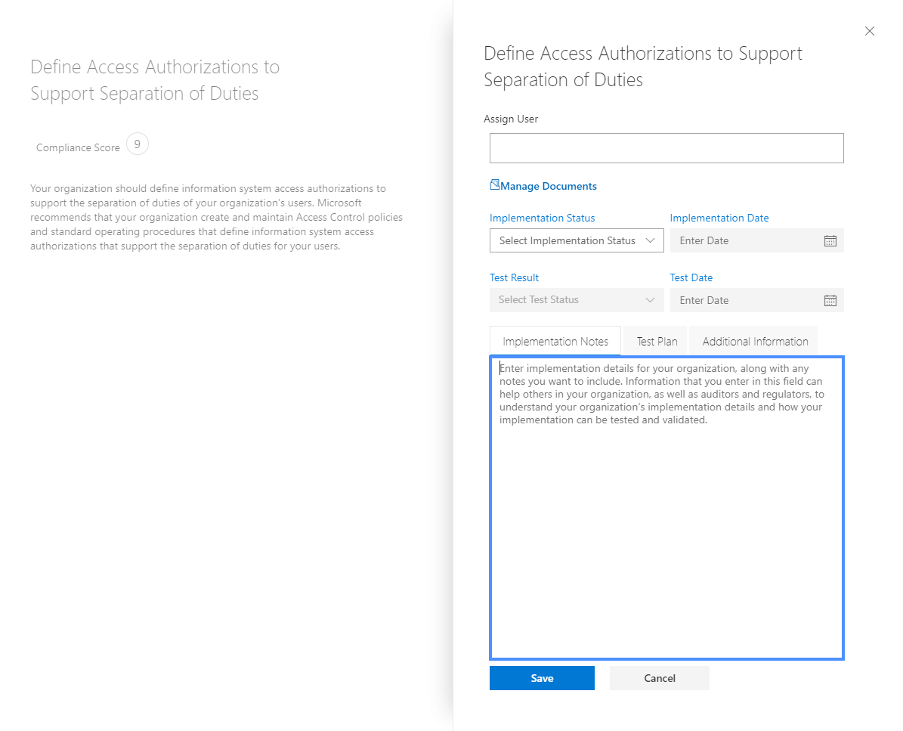

# Trabajar con el administrador de cumplimiento de Microsoft (versión preliminar)

> [!IMPORTANT]
> El administrador de cumplimiento de Microsoft es un panel y una herramienta de administración que proporciona un resumen de la protección de datos y las recomendaciones de Stature y recomendaciones para mejorar el cumplimiento y la protección de datos. Las acciones del cliente que se proporcionan en el administrador de cumplimiento son recomendaciones. Para evaluar la efectividad de estas recomendaciones en su entorno de reglamentación respectivo antes de la implementación, depende de su organización. Las recomendaciones incluidas en el Administrador de cumplimiento no deberán interpretarse como una garantía de cumplimiento.

## Acceso al administrador de cumplimiento

Se puede tener acceso al administrador de cumplimiento desde el portal de confianza de servicios de Microsoft. Cualquier usuario con una cuenta de Microsoft o una cuenta profesional de Azure Active Directory puede obtener acceso al administrador de cumplimiento.

1. Vaya a [https://servicetrust.microsoft.com/ComplianceManager/V3](https://servicetrust.microsoft.com/ComplianceManager/V3).

2. Inicie sesión con su cuenta de servicio de Microsoft, que es la cuenta de usuario de Office 365, Microsoft 365 o Azure Active Directory (Azure AD).

> [!NOTE]
> En el portal de confianza de servicios, seleccione **Administrador de cumplimiento**, que es la versión preliminar con las características más recientes. No seleccione **Administrador de cumplimiento (Classic)**, que contiene las características heredadas que no se incluyen en esta documentación.

## Administración

Hay funciones administrativas específicas que solo están disponibles para el administrador global y solo están visibles cuando inicia sesión con una cuenta de administrador global. El administrador global puede asignar permisos de usuario y activar actualizaciones automáticas de puntuaciones seguras.
  
### Asignar roles del Administrador de cumplimiento a usuarios

Una vez que el administrador asigna roles de administrador de cumplimiento a otros usuarios, estos usuarios pueden ver los datos en el administrador de cumplimiento y realizar las acciones determinadas por su rol. El administrador también puede conceder acceso de solo lectura al administrador de cumplimiento asignando al usuario el [rol lector global en Azure Active Directory (Azure ad)](https://docs.microsoft.com/azure/active-directory/users-groups-roles/directory-assign-admin-roles#global-reader).

Cada rol del administrador de cumplimiento tiene permisos ligeramente diferentes. Puede ver los permisos asignados a cada rol, ver qué usuarios tienen roles y agregar o quitar usuarios de esa función a través del portal de confianza de servicios. Seleccione el elemento de menú **Administrador** y elija la **configuración** que desea ver.
  

  
Para agregar o quitar usuarios de los roles del Administrador de cumplimiento.
  
1. Vaya a [https://servicetrust.microsoft.com](https://servicetrust.microsoft.com).

2. Inicie sesión con su cuenta de administrador global de Azure Active Directory.

3. En la barra de menús superior del portal de confianza del servicio, seleccione **Administrador** y, después, **configuración**.

4. En la lista desplegable **Seleccionar rol** , seleccione el rol que desea administrar.

5. Los usuarios agregados a cada rol se muestran en la página **Seleccionar rol**.

6. Para agregar usuarios a este rol, seleccione **Agregar**. En el cuadro de diálogo **Agregar usuarios** , seleccione el campo de usuario. Puede desplazarse por la lista de usuarios disponibles o empezar a escribir el nombre de usuario para filtrar la lista en función del término de búsqueda. Seleccione el usuario para agregar esa cuenta a la lista **Agregar usuarios** aprovisionada con dicha función. Si desea agregar varios usuarios a la vez, empiece a escribir un nombre de usuario para filtrar la lista y, a continuación, seleccione el usuario que desea agregar a la lista. Seleccione **Guardar** para aprovisionar el rol seleccionado a estos usuarios. 

    
  
7. Para quitar usuarios de este rol, seleccione los usuarios y seleccione **eliminar**.

    

### Control de las actualizaciones automáticas de calificación segura

Las actualizaciones de puntuación segura se pueden activar automáticamente para todas las acciones, desactivadas para todas las acciones o establecidas por acción individual siguiendo estos pasos.

1. Inicie sesión en el [portal de confianza de servicios](https://servicetrust.microsoft.com) con su cuenta de administrador global.

2. En la barra de menús del portal de confianza del servicio superior, en **más**, seleccione **Administrador** y, después, seleccione **configuración**.

3. En la ficha **puntuación segura** , seleccione el botón correspondiente para **activar todas las acciones**, **desactivar para todas las acciones**o **establecer por acción.**

Si elige **establecer por acción,** siga estos pasos adicionales para activar las actualizaciones de puntuación segura para acciones individuales:

4. Seleccione **Administrador de cumplimiento** en el menú superior (Nota: no seleccione "Administrador de cumplimiento (clásico)").

5. Seleccione **Administración de inquilinos** en la esquina superior derecha de la pantalla.

6. En el panel **acciones del cliente** , busque la acción prevista con puntos suspensivos (**...**) en la columna **acciones afectadas** . Haga clic en los puntos suspensivos y seleccione **Editar.**

7. Cambie el conmutador de alternancia de **actualización continua de puntuación segura** a **activado.**

8. Seleccione **Guardar.** Puntuación segura la supervisión continua ahora está activada para esa acción.

**Nota:** Solo el administrador global puede activar o desactivar las actualizaciones automáticas para todas las acciones. El administrador del administrador de cumplimiento puede activar actualizaciones automáticas para acciones individuales, pero no para todas las acciones de forma global.

## Grupos

Los grupos son contenedores que permiten organizar las evaluaciones y compartir información común y tareas de flujo de trabajo entre evaluaciones que tienen los mismos controles administrados por el cliente u otros relacionados.

Puede agrupar las evaluaciones de forma lógica para usted, como por año, estándar, servicio o basándose en los equipos, las divisiones o las regiones geográficas de su organización. A continuación se muestran ejemplos de dos grupos y sus evaluaciones subyacentes:
  
- **FFIEC es evaluaciones 2020**
  - Office 365 + FFIEC es
  - Intune + FFIEC es
- **Evaluaciones de privacidad y seguridad de los datos**
  - Office 365 + ISO 27001:2013
  - Office 365 + ISO 27018:2014

> [!NOTE]
> Le recomendamos que determine una estrategia de agrupación para su organización *antes* de agregar nuevas evaluaciones.

Para empezar, se configura un grupo **predeterminado** que contiene la línea base de protección de datos. Esta línea base es un conjunto de controles que incluye normas y estándares comunes de la industria (más[información](compliance-score-methodology.md#initial-score-based-on-microsoft-365-data-protection-baseline)).

### Cómo crear un grupo

No se pueden crear grupos como entidades independientes. Un grupo siempre debe contener al menos una evaluación, por lo que, para poder crear un grupo, primero debe crear una evaluación para colocarla en el grupo.

Siga los pasos siguientes para crear un grupo:

1. Cree una nueva evaluación seleccionando **+ Agregar evaluación** cerca de la parte superior del panel.
2. En el panel desplegable **evaluación** , escriba un título para la evaluación y seleccione una plantilla en el menú desplegable.
3. En **Seleccione un grupo o agregue un nuevo grupo**, seleccione **Agregar un nuevo grupo** y escriba el nombre del grupo en el campo siguiente.
4. Para copiar la información de un grupo existente, active la opción **¿desea copiar los datos de un grupo existente?** a **activado.** Seleccione el grupo que desea copiar en el menú desplegable que hay debajo y active las casillas de verificación de los campos que desee aplicar a la nueva evaluación en el nuevo grupo.
5. Seleccione **Guardar**. Cuando haya finalizado, el panel de control flotante se cerrará y verá el nuevo grupo en el panel.

Qué se debe saber al trabajar con grupos:
  
- Los nombres de grupo (también denominados *identificadores de grupo*) deben ser únicos dentro de la organización.
- Los grupos no tienen ninguna propiedad de seguridad. Todos los permisos están asociados con evaluaciones.
- Una vez que agregue una evaluación a un grupo, no se podrá cambiar la agrupación. Puede cambiar el nombre del grupo de evaluación, que cambia el nombre del grupo de evaluación para todas las evaluaciones asociadas con ese grupo.
- Los controles de evaluación relacionados en diferentes evaluaciones dentro del mismo grupo se actualizan automáticamente cuando se completan.
- Si agrega una nueva evaluación a un grupo existente, la información común de las evaluaciones de ese grupo se copia en la nueva evaluación.
- Los grupos pueden contener evaluaciones para la misma certificación o reglamentación, pero cada grupo solo puede contener una evaluación para un par de certificación de producto específico. Por ejemplo, un grupo no puede contener dos evaluaciones para Office 365 y NIST CSF. Un grupo puede contener varias evaluaciones para el mismo producto solo si la certificación o el Reglamento correspondiente para cada uno es diferente.
- La ocultación de una evaluación rompe la relación entre esa evaluación y el grupo. Las actualizaciones adicionales a otras evaluaciones relacionadas ya no se reflejan en la evaluación oculta. ([Obtenga información sobre cómo ocultar evaluaciones).](#hide-a-template-or-an-assessment)
- No se pueden eliminar los grupos.
- Cuando se realiza un cambio en un elemento de acción que aparece en varios grupos, el cambio se refleja en todas las instancias de ese elemento de acción.

## Administración de inquilinos de dimensiones, propietarios & acciones de los clientes

La interfaz de **Administración de inquilinos** le permite administrar la configuración de toda la organización:

- **Dimensiones:** Permite ver los metadatos de plantillas, evaluaciones y elementos de acción que permiten crear tablas dinámicas personalizadas para los filtros.
- **Propietarios:** Rellenar una lista de partes responsables que se pueden asociar con acciones.
- **Acciones del cliente:** Administrar la lista completa de elementos de acciones incluidos en el administrador de cumplimiento (versión preliminar) y habilitar o deshabilitar el control de puntuación segura para acciones integradas con puntuación segura.

Seleccione **Administración de inquilinos** en la esquina superior derecha de la pantalla para abrir la interfaz de administración y siga los pasos a continuación para administrar **dimensiones**, **propietarios**y **acciones del cliente**.

### Dimensions

Las dimensiones son conjuntos de metadatos que proporcionan información sobre una plantilla, una evaluación o un elemento de acción. Las dimensiones usan el concepto de claves y valores, donde la clave de dimensión representa una propiedad y el valor de dimensión representa valores válidos para la propiedad. Por ejemplo, en el administrador de cumplimiento hay tres tipos de acciones. Están definidas por una clave de dimensión de **propósito de acción** y valores de dimensión de **preventivo**, **detective**y **corrector**.

### Propietarios

Los propietarios se usan para identificar a la persona responsable de cada control. Todos los controles integrados son propiedad de Microsoft, clientes o ambos. Puede crear valores personalizados para los propietarios que se pueden usar para especificar más responsabilidades granulares en la organización. Por ejemplo, puede crear propietarios que representen grupos específicos, equipos o unidades de negocio dentro de su organización.

#### Agregar un propietario

1. Abra **Administración de inquilinos** y seleccione **propietarios**.
2. Seleccione **+ Agregar propietario**.
3. Especifique un nombre y una descripción para el propietario y seleccione **Guardar**. La descripción se muestra en la columna propietario.

#### Edición de un propietario

No puede editar un nombre de propietario, pero puede modificar la descripción que se muestra en la columna propietario.

1. Abra **Administración de inquilinos** y seleccione **propietarios**.
2. Busque el propietario que desea editar, seleccione los puntos suspensivos (...) junto a él y, después, haga clic en **Editar**.
3. Modifique la descripción según sea necesario y seleccione **Guardar**.

#### Eliminar un propietario

1. Abra **Administración de inquilinos** y seleccione **propietarios**.
2. Busque el propietario que desea eliminar, seleccione los puntos suspensivos (...) junto a él y seleccione **eliminar**.
3. Cuando aparezca el mensaje de confirmación, seleccione **eliminar**.

### Acciones del cliente

El área acciones del cliente muestra todas las acciones del cliente para todas las plantillas y evaluaciones en el administrador de cumplimiento (versión preliminar).

De un solo vistazo, puede ver el título, el propietario, la categoría, el cumplimiento y la puntuación de una acción, y determinar si está integrado con una puntuación segura. Puede expandir una acción y seleccionar **leer más** para leer la descripción de la acción y tener acceso a los vínculos de la descripción. También puede usar esta interfaz para habilitar y deshabilitar la integración de la puntuación segura en función de cada acción y para agregar acciones personalizadas. Las acciones que tienen capacidades de integración de puntuación segura tienen un botón de puntos suspensivos (...) junto a ellas (tenga en cuenta que las acciones personalizadas también tienen puntos suspensivos junto a ellas).

#### Habilitar o deshabilitar la integración de la puntuación segura

1. Seleccione los puntos suspensivos (...) de la acción que desea modificar y seleccione **Editar**.
2. Alterne el conmutador de la actualización continua de puntuación segura en activado o desactivado para habilitar o deshabilitar la supervisión continua mediante la puntuación segura.
3. Seleccione **Guardar**.

Cuando las organizaciones implementan por primera vez Microsoft 365 u Office 365, la puntuación segura tarda aproximadamente siete días en completarse en recopilar datos y factorizar la puntuación. Durante este tiempo, la configuración de la opción de actualización continua de puntuación segura como **desactivada** y la configuración manual de una acción para **implementada** contará esa acción hacia su puntuación. Después de los siete días iniciales, al desactivar la actualización continua de la actualización segura, se habilitará la supervisión continua a partir de ese momento.

Las acciones que no son compatibles con la integración de la puntuación segura se pueden implementar de forma manual. Una implementación manual se aplicará a la puntuación del grupo de la acción.

## Evaluaciones

En esta sección se explica cómo ver y trabajar con las evaluaciones, lo que incluye cómo agregar nuevas, exportarlas, copiar información de evaluaciones existentes y mantenerlas actualizadas mediante el control de versiones.

### Ver los detalles de la evaluación y de la acción
  
En el panel de **evaluaciones** , seleccione el nombre de la evaluación para abrirlo y ver la información de controles y elementos de acción.

A continuación, se muestra un ejemplo de la evaluación de Office 365 e ISO 27001. La primera vista ilustra la nueva vista de elementos de acción en el administrador de cumplimiento (versión preliminar).

Las acciones se muestran en orden alfabético, y a cada acción se le asigna una puntuación y un propietario. Seleccione el vínculo **leer más** para leer los detalles de cada acción.

Seleccione el vínculo **revisión** para administrar, asignar, implementar y probar la acción. A continuación se muestra un ejemplo de acción.

Use los siguientes campos para administrar el flujo de trabajo de la acción:

- **Asignar usuario:** Seleccione este campo para elegir o especificar el usuario a quien se debe asignar esta acción. Puede desplazarse por la lista o escribir un nombre para encontrarla y, a continuación, seleccionarla.
- **Administrar documentos:** Puede cargar pruebas de implementación en forma de documentos de Office, archivos de imagen y capturas de pantallas, resultados de PowerShell en CSV o TXT y PDF.
- **Estado de la implementación:** Se usa para indicar el estado de implementación actual de la acción. Los valores posibles no se implementan, implementan, implementaciones alternativas, están planeadas y no se encuentran en el ámbito.
- **Fecha de implementación:** Fecha en que se realizó la acción.
- **Resultado de la prueba:** Se usa para indicar los resultados de la validación de la implementación. Los valores posibles no son evaluados, Passed, failed-low risk, failed-Medium Risk, Failed (riesgo elevado) y no en Scope.
- **Fecha de la prueba:** La fecha en la que se produjo la validación.
- **Notas de implementación:** Escriba los detalles de implementación de la organización, junto con las notas que desee incluir.
- **Plan de pruebas:** Escriba los detalles del plan de pruebas para esta acción, junto con las notas que desee incluir.
- **Información adicional:** Especifique la información adicional sobre esta acción o cómo se implementó en la organización, junto con las notas que desee incluir.

En el panel **información de controles** , puede ver información de los controles en el nivel de evaluación y de plantilla. A continuación se muestra un ejemplo del panel de información de controles para evaluaciones.

Para las evaluaciones, el panel información de controles muestra la siguiente información:

- Una lista desplegable de **Grupo** para seleccionar el grupo que se va a ver (cuando se usan varios grupos).
- Un cuadro desplegable de **evaluación** para seleccionar qué evaluación desea ver.
- Metadatos sobre la evaluación seleccionada, que incluye:
    - Un indicador de progreso para **los controles evaluados** que muestra el número de controles calculados sobre el número total de controles.
    - La **puntuación de cumplimiento** actual para la evaluación, que se muestra como un porcentaje.
    - Detalles sobre la **certificación** y el **producto** usados en la evaluación.
    - **Estado** actual de la evaluación y fecha de la última **modificación** .
- Una lista de los **servicios de ámbito** de la evaluación.
- Detalles de los controles, agrupados por familia de controles, con vínculos a acciones del cliente y detalles de implementación de Microsoft:
    - **Sus acciones** muestran las acciones del cliente que puede realizar para satisfacer algunos o todos los requisitos del control. Muchos controles tienen varias acciones asociadas a ellos, y todas las acciones asociadas a un control se muestran aquí. Las acciones tienen la misma interfaz de usuario que las que aparecen en el panel acciones.
    - **Acciones de Microsoft** muestra la lista de controles del marco interno de Microsoft que se aplican al control de certificación seleccionado. Para cada control interno, seleccione **implementado** para ver los detalles de implementación y pruebas de Microsoft, junto con el resultado de la prueba y la fecha de prueba, como se muestra a continuación.

### Adición de una evaluación
  
1. En el panel de evaluaciones, seleccione **+ Agregar evaluación**.

2. Cuando se abra el Blade, escriba la siguiente información:

    - **Title (obligatorio):** Escriba un título para la evaluación
    - **Seleccione una plantilla (obligatorio):** Selección de una plantilla estándar o personalizada
    - **Seleccione un grupo o agregue un nuevo grupo (obligatorio):** Seleccione un grupo existente o elija Agregar un grupo nuevo y proporcione un nombre de grupo único.
    - **¿Desea copiar los datos de un grupo existente? (opcional):** conmute el control para habilitar la copia del grupo y, a continuación, haga lo siguiente:
        - **Seleccione un grupo (opcional):** Si la copia de grupo está habilitada, seleccione el grupo desde el que desea copiar
            - **Detalles de la implementación (opcional):** Seleccione esta selección para copiar los detalles de implementación en el nuevo grupo.
            - **Plan de pruebas & información adicional (opcional):** Seleccione esta selección para copiar el plan de pruebas y detalles de información adicional al nuevo grupo
            - **Documentos (opcional):** Seleccione esta selección para copiar los documentos en el nuevo grupo.

3. Seleccione **Guardar** para crear la evaluación.

 La nueva evaluación aparece en el panel de evaluación y muestra la siguiente información:

- El título de la evaluación.
- Las dimensiones de la evaluación, incluida la certificación, el entorno y el producto aplicados a la evaluación.
- La fecha en que se creó y la fecha en que se modificó por última vez.
- La puntuación de la evaluación que se muestra como un porcentaje. Esta puntuación incluye automáticamente las puntuaciones de los controles administrados por Microsoft y de la puntuación segura.
- Indicadores de progreso que muestran el número de controles evaluados administrados por Microsoft y administrados por el cliente.

### Copiar información de evaluaciones existentes

Al crear una evaluación, tiene la opción de copiar la información de un grupo existente. La copia permite aplicar la información especificada en la evaluación copiada a los mismos controles en la nueva evaluación. Por ejemplo, si tiene un grupo para todas las evaluaciones relacionadas con FFIEC en su organización, puede copiar la siguiente información de las evaluaciones existentes:

- Detalles de la implementación
- Plan de pruebas & información adicional
- Documentos

#### Copiar información de una evaluación existente a una nueva evaluación
  
1. En el panel de evaluación, seleccione **+ Agregar evaluación**.
    
2. En la ventana **Agregar una evaluación** , complete la siguiente información:

    - **Title (obligatorio):** Escriba un título para la evaluación.
    - **Seleccione una plantilla (obligatorio):** Seleccione una plantilla estándar o personalizada.
    - **Seleccione un grupo o agregue un nuevo grupo (obligatorio):** Elija **Agregar un nuevo grupo** y proporcione un nombre de grupo único.
    - **¿Desea copiar los datos de un grupo existente? (opcional):** cambie el control a activado para habilitar la copia del grupo y, a continuación:- **Seleccione un grupo (opcional):** si la copia de grupo está habilitada, seleccione el grupo desde el que se va a copiar.
            - **Detalles de la implementación (opcional):** Seleccione esta selección para copiar los detalles de implementación en el nuevo grupo.
            - **Plan de pruebas & información adicional (opcional):** Seleccione esta selección para copiar el plan de pruebas y detalles de información adicional al nuevo grupo.
            - **Documentos (opcional):** Seleccione esta selección para copiar los documentos en el nuevo grupo.

3. Seleccione **Guardar** para crear la evaluación.

### Control de versiones de alertas para actualizaciones de evaluación

Cuando hay una actualización disponible para una evaluación, un icono de alerta le indica que hay una actualización lista. Al hacer clic en este icono, una ventana emergente explica la actualización y se le pide que acepte. A continuación se muestra un ejemplo de la alerta de control de versiones para una evaluación:

Al seleccionar el icono de alerta, se revela un panel de control flotante en el que se explica la actualización y se le pide que acepte:

Se recomienda aceptar todas las actualizaciones cuando recibe notificaciones de actualización.

### Exportación de una evaluación

Puede exportar una evaluación a un archivo de Excel para las partes interesadas de cumplimiento de su organización o para los auditores externos y los reguladores. El informe es una instantánea de la evaluación a partir de la fecha y la hora en que se creó el informe. El informe contiene los detalles de todos los controles administrados por Microsoft y los clientes para la evaluación, el estado de la implementación de controles, la fecha de prueba de control, los resultados de pruebas y proporciona vínculos a los documentos de evidencia cargados.
  
### Exportación de un informe de evaluación
  
1. En el panel del administrador de cumplimiento, seleccione ficha **información de controles** .
2. Seleccione el **Grupo** y la **evaluación** en los menús desplegables para la evaluación que desea exportar.
3. Seleccione el botón **exportar** .

El informe de evaluación se descarga como un archivo de Excel en la sesión del explorador. El nombre de los archivos del archivo de Excel de forma predeterminada es el título de la evaluación.

### Ocultar una plantilla o una evaluación

Cuando haya terminado con una plantilla o una evaluación y ya no la necesite para fines de cumplimiento, puede ocultarla en la vista. Cuando una plantilla o evaluación está oculta, se quita de la vista predeterminada y debe seleccionar **incluir casilla oculta** para mostrarla.

> [!IMPORTANT]
> Las evaluaciones ocultas no conservan sus vínculos a los documentos de evidencia cargados. Se recomienda encarecidamente que exporte una evaluación antes de ocultarla para conservar los vínculos a documentos de evidencia en el informe.
  
#### Ocultar una plantilla

1. Abra el panel **plantillas** .
2. Busque la plantilla que desea ocultar y, en las elipses de la fila, seleccione **ocultar**.
3. Cuando vea el mensaje de confirmación, seleccione **ocultar**.

#### Ocultar una evaluación

1. Abra el panel de **evaluaciones** .
2. Seleccione el **Grupo** de la lista desplegable que contiene la evaluación que desea ocultar.
3. Busque la evaluación que desea ocultar y, en las elipses, seleccione **ocultar**.
4. Cuando vea el mensaje de confirmación, seleccione **ocultar**.

#### Ver evaluaciones ocultas
  
1. Abra la pestaña panel de **evaluaciones** y seleccione la casilla **incluir oculto** .
2. Las evaluaciones ocultas aparecen en la sección **evaluaciones ocultas** .

#### Mostrar una evaluación

1. En la pestaña **evaluaciones** , active la casilla **incluir oculto** .
2. Las evaluaciones ocultas aparecen en la sección **evaluaciones ocultas** .
3. Busque la evaluación que desea mostrar y, en las elipses, seleccione **Mostrar**.
4. Cuando vea el mensaje de confirmación, seleccione **Mostrar**.

## Controles y acciones

Los controles y las acciones son las tablas dinámicas de datos principales que se usan en el administrador de cumplimiento (versión preliminar). El control Pivot, que existía en las versiones anteriores del administrador de cumplimiento, se ha mejorado para mostrar los controles de Microsoft y del cliente en las mismas familias de control. Esta vista consolidada facilita la visualización de todo el modelo de responsabilidad compartida por cada control. La acción dinámica es nueva en el administrador de cumplimiento (versión preliminar) y está diseñada para proporcionar una vista simplificada de todas las acciones recomendadas por Microsoft.

### Controles

Los controles se pueden ver desde el panel de información de controles. Los controles representan los requisitos de un estándar, una certificación, una regla o un marco. Para asignar estos requisitos en varios estándares, normas, etc., y para asociarlos con acciones, todo se trata como si fuera un marco de control. Por ejemplo, como un marco de control, las normativas, como HIPAA, se han desglosado por sección y los controles de HIPAA en el administrador de cumplimiento usan el mismo esquema de numeración que estas secciones, como se muestra a continuación:

Hay tres tipos de controles:

1. **Controles administrados por Microsoft:** son controles que solo Microsoft tiene responsabilidad. Aparecen en las plantillas de cuadro y se agregan al administrador de cumplimiento de Microsoft.
2. **Controles administrados por el cliente:** son controles que solo tienen responsabilidad los clientes. Aparecen en las plantillas de cuadro y se agregan al administrador de cumplimiento por los clientes.
3. **Controles de administración compartidos:** son controles en los que se comparte la responsabilidad entre Microsoft y el cliente. Estos aparecen en las plantillas en el cuadro y se agregan al administrador de cumplimiento de Microsoft. El cliente también puede editar o deshabilitar los controles administrados por Microsoft.

### Elementos de acciones

Los elementos de acciones son las tareas recomendadas para implementar los requisitos de una norma o regla, o para probar, comprobar y documentar los requisitos de implementación de su organización. Las acciones están asociadas con uno o varios controles. Cada control tiene una o más acciones asociadas, y cada acción se puede asociar con uno o varios controles. Las acciones forman parte del flujo de trabajo principal del administrador de cumplimiento (versión preliminar), ya que son los objetos que se asignan, controlan y validan en la organización.

#### Asignar elementos de acción
  
1. En el panel de **elementos de acción** , seleccione el **Grupo** que contiene las evaluaciones cuya acción desea asignar.
2. En la lista desplegable **evaluación** , seleccione la evaluación cuya acción desea asignar o seleccione **todo** en la lista desplegable para ver todas las acciones disponibles.
3. Busque la acción que desee asignar y, en la columna **propietario** , seleccione el vínculo para **revisión**, * * implementado o **prueba**.
4. Seleccione el campo **asignar usuario** y aparecerá una lista de los usuarios de su organización. Desplácese por la lista y seleccione usuario o filtro de la lista para seleccionar un usuario; para ello, escriba en el nombre del usuario.
5. En el campo notas de implementación, escriba las notas que desee transmitir al usuario asignado.
6. Seleccione **Guardar** para asignar la acción.

#### Reasignar elementos de acción

Esta función permite a una organización quitar las dependencias activas o pendientes de la cuenta de usuario mediante la reasignación de una acción a un nuevo usuario.

1. En el panel de **elementos de acción** , seleccione el **Grupo** que contiene las evaluaciones cuya acción desea reasignar.
2. En la lista desplegable **evaluación** , seleccione la evaluación cuya acción desea reasignar o seleccione **todo** en la lista desplegable para ver todas las acciones disponibles.
3. Busque la acción que desea reasignar y, en la columna **propietario** , seleccione el vínculo para **revisión**, **implementado**o **prueba**.
4. Elimine el usuario existente del campo **asignar usuario** y elija un usuario diferente de la lista de usuarios o filtre la lista para seleccionar un usuario; para ello, escriba en el nombre del usuario.
5. En el campo notas de implementación, escriba las notas que desee transmitir al usuario.
6. Seleccione **Guardar** para reasignar la acción.

#### El estado de sincronización de los elementos de acción comunes en grupos

Si su organización tiene varios grupos de evaluaciones, hay un comportamiento de las acciones técnicas (es decir, acciones que afectan a toda la organización). Todas las acciones duplicadas en grupos se combinan ahora en una sola acción. Esa acción única contiene todas las notas cargadas y la evidencia de versiones duplicadas previamente. Los cambios realizados en la acción en un grupo o evaluación se reflejarán en todas las instancias de esa acción. Los campos **Estado de implementación**, fecha de **implementación**, estado de **prueba**y fecha de **prueba** reflejan las actualizaciones más recientes.

## Plantillas

Una plantilla es el objeto base del administrador de cumplimiento (versión preliminar) que está asociado a un producto y una certificación (por ejemplo, estándar, regla, marco de control, etc.). Las plantillas se pueden ver y agregar desde el panel **plantillas** .

 
El panel muestra cada plantilla, junto con la certificación y el producto asociado a la plantilla, las fechas en que se creó y modificó por última vez el libro, el número de controles administrados por el cliente y por Microsoft, la puntuación de cumplimiento máxima para la plantilla y el estado de la plantilla (por ejemplo, aprobado, pendiente de aprobación, importado).

### Crear una plantilla

Hay tres formas de trabajar con plantillas para crear evaluaciones:

1. Usar una de las plantillas preconfiguradas proporcionadas por Microsoft.
2. Personalizar una plantilla preconfigurada con sus propias acciones y controles a través del proceso de extensión.
3. Cree su propia plantilla e impórtela en el administrador de cumplimiento.

#### Usar una plantilla preconfigurada de Microsoft

Las plantillas preconfiguradas están disponibles en el panel **plantillas** . Ver la [lista actual de plantillas](compliance-manager-overview.md#templates), que se actualiza cada vez que hay disponible una nueva plantilla.

#### Personalización de una plantilla a través del proceso de extensión

1. Abra el panel **plantillas** y seleccione **+ Agregar plantilla**.
2. En el panel flotante de plantilla, seleccione la casilla **crear extensión a partir de plantilla global** .
3. Seleccione la plantilla que desea extender en el menú desplegable.
4. Si todavía no ha dado formato a los datos de la plantilla en Excel, seleccione el vínculo en el panel desplegable para descargar un archivo de Excel. Rellene la hoja de cálculo de acuerdo con las siguientes instrucciones de [importación de datos de plantilla con Excel](#import-template-data-with-excel) y guárdela en su unidad local.
5. Para importar los datos de la plantilla personalizada, seleccione **examinar** para cargar el archivo de Excel.
6. Seleccione **Agregar al panel**. A continuación, verá la nueva plantilla agregada a su panel **plantillas** .

#### Crear su propia plantilla e importarla en el administrador de cumplimiento

1. Abra el panel **plantillas** y seleccione **+ Agregar plantilla**.
2. En el panel flotante de plantilla, seleccione **crear una nueva plantilla**.
3. Para importar los datos de la plantilla, seleccione **examinar** para cargar el archivo de Excel que contiene los datos (vea [importar datos de plantilla con Excel](#import-template-data-with-excel) , más adelante).
4. Seleccione **Agregar al panel**. A continuación, verá la nueva plantilla agregada a su panel **plantillas** .

#### Importar datos de plantilla con Excel

Para modificar una plantilla o crear su propia plantilla, deberá usar una [hoja de cálculo de Excel](https://go.microsoft.com/fwlink/?linkid=2124865) para capturar los datos necesarios y cargarlos en el administrador de cumplimiento. Esta plantilla de hoja de cálculo tiene un formato y un esquema específicos que se deben usar o que no se importarán en el administrador de cumplimiento.

> [!IMPORTANT]
> Si ha creado o personalizado plantillas en el administrador de cumplimiento, **este proceso se ha actualizado** como parte de la versión de abril de 2020 del administrador de cumplimiento (versión preliminar). **Consulte esta sección detenidamente.**

La hoja de cálculo contiene cuatro pestañas, tres de las cuales son necesarias:

1. Plantilla (obligatorio)
2. ControlFamily (obligatorio)
3. Acciones (obligatorio)
4. Dimensiones (opcional)

La hoja **de cálculo debe incluir las pestañas en este orden**; de lo contrario, los datos no se importarán correctamente a una plantilla.

##### Ficha plantilla

La ficha **plantilla** es obligatoria. La información de esta ficha proporciona metadatos sobre la plantilla. Hay cuatro columnas obligatorias. Las columnas deben conservar el orden en la hoja de cálculo de Excel como se indica a continuación. Puede agregar su propia columna **después** de las cuatro columnas para proporcionar sus propias dimensiones. Si hace esto, asegúrese de agregarlos a la pestaña **dimensiones** siguiendo las instrucciones que se [indican a continuación](#dimensions-tab).

- **title**: el título de la plantilla, que debe ser único. No puede compartir un nombre con otra plantilla que tenga en el administrador de cumplimiento, ya sea una plantilla que ya haya creado o una plantilla preconfigurada proporcionada por Microsoft.

- **producto**: es una dimensión requerida. Enumerar el producto asociado a la plantilla.

- **certificación**: esta es la regla que está usando para la plantilla.

- **inScopeServices**: Estos son los servicios del producto que trata esta evaluación (por ejemplo, si ha incluido Office 365 como producto, Microsoft Teams podría ser un servicio dentro del ámbito). Puede enumerar varios servicios separados por dos puntos y comas.

> [!NOTE]
> Sobre producto y certificación: los datos que se insertan en las celdas de **producto** y **certificación** no se pueden editar después de importar la hoja de cálculo para crear o personalizar una plantilla. Además, un grupo no puede contener dos evaluaciones que tengan la misma combinación **producto/certificación** . Puede tener varias plantillas que tienen la misma combinación producto/certificación.

##### Pestaña ControlFamily

La ficha **ControlFamily** es obligatoria.  Las columnas necesarias en esta ficha, que deben seguir el orden proporcionado en la hoja de cálculo de muestra, son:

- **nombrecontrol**: es el nombre del control de la certificación, el estándar o la regla, que suele ser algún tipo de identificador. Los nombres de los controles deben ser únicos dentro de una plantilla. No puede tener varios controles con el mismo nombre en la hoja de cálculo.

- **controlFamily**: proporcione una palabra o frase para controlFamily, que identifica una amplia agrupación de controles. Un controlFamily no tiene que ser único; puede aparecer más de una vez en una hoja de cálculo. El mismo controlFamily también puede aparecer en varias plantillas, aunque no tienen relación entre sí. Cada controlFamily debe asignarse a al menos un control.

- **controlTitle**: proporcione un título para el control. Mientras que nombrecontrol es un código de referencia, el título es un formato de texto enriquecido que normalmente aparece en las regulaciones.

- **controlDescription**: proporcione una descripción del control.

- **controlActionTitle**: es el título de una acción que desea relacionar con este control. Puede agregar varias acciones separando dos puntos y coma sin espacio entre ellas. Cada control que lista debe incluir al menos una acción y la acción debe existir (lo que significa que puede enumerar una acción que se enumera en la ficha **acciones** de la misma hoja de cálculo, una acción que existe en otra plantilla o una acción creada por Microsoft). Los diferentes controles pueden hacer referencia a la misma acción.

##### Ficha acciones

La ficha **acciones** es obligatoria.  Designa las acciones de la organización y no las acciones de Microsoft, que ya existen en el administrador de cumplimiento. Las columnas necesarias para esta ficha, que deben seguir el orden proporcionado en la hoja de cálculo de muestra, son:

- **actionTitle**: se trata del título de la acción y es un campo obligatorio. El título que proporcione debe ser único. **Importante**: Si hace referencia a una acción que ya existe (como en otra plantilla) y modifica cualquiera de sus elementos en las columnas siguientes, dichos cambios se propagarán a la misma acción en otras plantillas.

- **implementationType**: en este campo obligatorio, enumere uno de los tres tipos de implementación siguientes:
    - Acciones **operativas** implementadas por personas y procesos para proteger la confidencialidad, la integridad y la disponibilidad de los sistemas, los datos y el personal de la organización (ejemplo: reconocimiento y formación de seguridad)
    - Acciones **técnicas** realizadas mediante el uso de tecnología y mecanismos contenidos en los componentes de hardware, software o firmware del sistema de información para proteger la confidencialidad, la integridad y la disponibilidad de los datos y sistemas de la organización (ejemplo: multi-factor Authentication)
    - **Documentación** : acciones que se implementan mediante directivas y procedimientos documentados que establecen y definen los controles necesarios para proteger la confidencialidad, integridad y disponibilidad de los sistemas, datos y personal de la organización (ejemplo: una directiva de seguridad de la información)

- **actionScore**: en este campo obligatorio, especifique un valor de puntuación numérica para la acción. Debe ser un número entero comprendido entre 1 y 99; no puede ser 0, nulo o en blanco. Cuanto mayor sea el número, mayor será su valor hacia la mejora de la postura de cumplimiento. Para obtener instrucciones, mira cómo Microsoft puntúa los controles:

- **actionDescriptionTitle**: es el título de la descripción y es obligatorio. Este título de Descripción le permite tener la misma acción en varias plantillas y exponer una descripción diferente en cada plantilla.  Este campo ayuda a clarificar a qué plantilla hace referencia la descripción. En la mayoría de los casos, puede poner el nombre de la plantilla que está creando en este campo.

- **actionDescription**: proporcione una descripción de la acción. Puede aplicar formato como texto en negrita e hipervínculos. Este campo es obligatorio.

- **dimensión-acción propósito**: este es un campo opcional. Si lo incluye, el encabezado debe incluir el prefijo "Dimension-". Las dimensiones que incluya aquí se utilizarán como [filtros en la puntuación de cumplimiento](compliance-score-setup.md#filtering-your-dashboard-view) y aparecerán en la [Página de detalles de acciones de mejora en la puntuación de cumplimiento](working-with-compliance-score.md#view-your-improvement-actions).

##### Pestaña dimensiones

La pestaña **dimensiones** es opcional. Sin embargo, si hace referencia a una dimensión en otro lugar, debe especificarla aquí si no existe en una plantilla que ya ha creado o en una plantilla de Microsoft. A continuación se enumeran las columnas de esta pestaña:

- **dimensionKey**: List como "producto", "certificaciones", "propósito de la acción"
- **dimensionValue**: ejemplos: Office 365, HIPPA, preventivo, detective

Puede ver las dimensiones existentes yendo a administración de **inquilinos** y seleccionando la pestaña **dimensiones** . Además, cada vez que exporte una plantilla existente, la hoja de cálculo exportada tendrá la ficha **dimensiones** , que enumera todas las dimensiones utilizadas en la plantilla.

### Modificación de una plantilla existente

Para realizar cambios en una plantilla que ha creado o personalizado mediante el proceso de importación descrito anteriormente, use el mismo proceso para importar los cambios a la plantilla.

> [!NOTE]
> Hay varios factores importantes que deben tenerse en cuenta al editar los componentes de plantilla, por lo que debe revisar esta sección detenidamente.

#### Proceso general para modificar una plantilla

Para realizar cambios en una de las plantillas existentes de la organización, el proceso general es:

1. En el panel **plantillas** , seleccione la plantilla que desea modificar, que muestra el panel de **información de controles** en la ficha **plantilla** .
2. Desde aquí, seleccione **exportar**. Se descargará una hoja de Excel con todos los datos de la plantilla.
3. Para editar, agregar o quitar una acción, consulte las secciones siguientes.
4. Cuando haya terminado de realizar cambios en el archivo de Excel, vuelva a importar el archivo a la plantilla seleccionando la plantilla en el panel y seleccionando **importar**. La plantilla incluirá ahora los cambios realizados.

#### Para editar los atributos de la plantilla

En la ficha **plantillas** , puede modificar cualquier cosa en la columna **título** , la columna **inScopeServices** y en cualquier otra columna que haya agregado. Sin embargo, no puede editar nada en las columnas **producto** o **certificación** .

#### Para agregar una acción a una plantilla

1. Vaya a la ficha **acciones** y agregue la información en los campos obligatorios de la primera fila vacía debajo de las acciones existentes.
2. Vaya a la pestaña **ControlFamily** . Busque la fila que contiene el control al que se asigna la acción. Agregue la nueva acción a la columna **controlActionTitle** de esa fila (Recuerde que debe separar varias acciones en este campo con dos puntos y comas, sin espacio entre ellas).
3. Guarde la hoja de cálculo en el equipo local.

#### Para editar la información de una acción

Puede cambiar la información de la acción *excepto el título*. Puede editar cualquier celda de las columnas B o superior y, cuando vuelva a importar el archivo a la plantilla, las acciones de esa plantilla contendrán los datos actualizados.

No se puede editar la **actionTitle** (columna A) porque, si lo hace, el administrador de cumplimiento considera que esto es una acción nueva. Si desea cambiar el nombre de una acción, vea las instrucciones inmediatamente más adelante.

#### Para cambiar el nombre de una acción

Si desea cambiar el nombre de una acción, debe designar explícitamente en la hoja de cálculo que va a reemplazar un nombre existente por un nombre nuevo. Para cambiar el nombre de una acción, siga estos pasos:

1. En la ficha **acciones** de la hoja de cálculo, agregue una nueva columna a la hoja de cálculo después de la columna a.
2. En esta nueva columna, que ahora es la columna B, Put como encabezado en la fila 1: **oldActionTitle**.
3. Copie el contenido de la columna A y péguelos en la columna B. Esto coloca los títulos de acción existentes, que son lo que desea cambiar, en la columna B.
4. En la columna A, **actionTitle**, elimine el nombre antiguo y reemplácelo con el nuevo nombre de la acción.

#### Para quitar una acción de una plantilla

Al eliminar una acción de una fila de una hoja de cálculo, **no** se quita la acción de la plantilla que se está editando. En su lugar, siga el proceso siguiente para quitar una acción:

1. En la ficha **acciones** , inserte una nueva columna como la columna a y la **operación** put en la fila de encabezado, que es la fila número uno.
2. En la fila de la acción que desea quitar, coloque **eliminar** en la columna a para esa fila.
3. Asegúrese de que un control ya no haga referencia a esta acción. Vaya a la pestaña **ControlFamily** y busque el título de la acción en la columna F, que es **controlActionTitle**.
4. Cuando encuentre la acción enumerada en la columna **controlActionTitle** , elimínela.
5. Guarde la hoja de cálculo en el equipo local.

Cuando vuelva a importar la hoja de cálculo a la plantilla, la acción se quitará de la plantilla. Quitar una acción de una plantilla no quita completamente la acción. Todavía puede hacer referencia a esa acción en otra plantilla.

Si va a quitar la última acción a la que hace referencia un control, debe quitar el control.

> [!NOTE]
> Para quitar un control: siga el mismo proceso para quitar una acción como se ha descrito anteriormente. En la pestaña **ControlFamily** , agregue una columna **Operation** y coloque **eliminar** junto al control que desea quitar.

### Actualizaciones de plantillas

Cada vez que se actualiza una evaluación mediante el proceso de control de versiones, la evaluación personalizada heredará esas actualizaciones y conservará los controles personalizados. Consulte [control de versiones de alertas para las actualizaciones de evaluación](#versioning-alerts-for-assessment-updates).

### Exportar una plantilla a JSON

El administrador de cumplimiento (versión preliminar) admite la exportación de plantillas al formato de notación de objetos JavaScript (JSON). Esto le permite intercambiar datos del administrador de cumplimiento con otros sistemas que admiten JSON.

## Informes

Puede exportar una evaluación a un archivo de Excel para las partes interesadas de cumplimiento de su organización o para los auditores externos y los reguladores. El informe es una instantánea de la evaluación a partir de la fecha y la hora de la exportación. El informe contiene los detalles de Microsoft y los controles administrados por el cliente para la evaluación, el estado de la implementación de controles, la fecha de prueba de control, los resultados de pruebas y los vínculos a documentos de evidencia cargados. Debido a que las evaluaciones ocultas no conservan los vínculos a los documentos cargados, debe exportar la evaluación antes de ocultarla.

### Exportación de una evaluación

1. En el panel del administrador de cumplimiento, seleccione ficha **información de controles** .
2. Seleccione el grupo y la evaluación en los menús desplegables para la evaluación que desea exportar.
3. Seleccione exportar. La exportación de la evaluación se descarga como un archivo de Excel.

## Permisos

En la tabla siguiente se describe cada permiso del administrador de cumplimiento y lo que permite al usuario. La tabla también indica el rol al que se asigna cada permiso.

||**Lector global de Azure AD**|**Lector del Administrador de cumplimiento**|**Colaborador del Administrador de cumplimiento**|**Evaluador del Administrador de cumplimiento**|**Administrador del Administrador de cumplimiento**|**Administrador del portal**|
|:-----|:-----|:-----|:-----|:-----|:-----|:-----|
|**Leer datos:** Los usuarios pueden leer pero no editar datos (excepto para la administración de los datos y la administración de los inquilinos).    | X | X | X | X | X  | X |
|**Editar datos:** Los usuarios pueden editar todos los campos, excepto los resultados de la prueba y los campos de fecha de prueba (excepto para los datos de plantilla y la administración del espacio empresarial).    ||| X | X  | X | X |
|**Editar resultados de pruebas:** Los usuarios pueden editar los campos resultado de la prueba y fecha de prueba.    |||| X | X | X |
|**Administrar evaluaciones:** Los usuarios pueden crear, archivar y eliminar evaluaciones.    ||||| X | X |
|**Administración de datos maestros:** Los usuarios pueden ver, editar y eliminar datos de plantilla y datos de administración de inquilinos.    ||||| X | X |
|**Administrar usuarios:** Los usuarios pueden agregar otros usuarios de su organización a los roles lector, colaborador, asesor y administrador. Solo los usuarios con el rol de administrador global en su organización pueden agregar o quitar usuarios del rol de administrador del portal.    |||||| X |