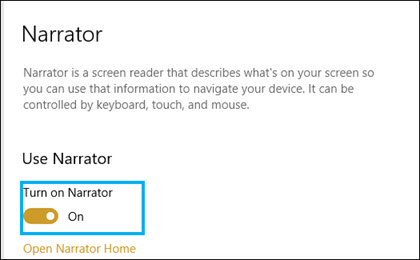

# Modo de accesibilidad en Microsoft Syntex

En [Microsoft Syntex](index.md), los usuarios pueden activar el modo de accesibilidad en todas las fases del entrenamiento del modelo (etiqueta, entrenamiento, prueba) al trabajar con documentos de ejemplo. El uso del modo de accesibilidad puede ayudar a los usuarios con poca vista a tener una accesibilidad de teclado más sencilla a medida que navegan y etiquetan elementos en el visor de documentos.

Esto ayuda a los usuarios a usar sus teclados para navegar por el texto del visor de documentos y escuchar una narración no solo de los valores seleccionados, sino también de acciones (como etiquetar o quitar el etiquetado del texto seleccionado) o valores de etiqueta predichos a medida que entrena el modelo con documentos de ejemplo adicionales. 

## Requisitos

Para escuchar el audio de la narración, asegúrate de activar la [aplicación narrador](https://support.microsoft.com/windows/complete-guide-to-narrator-e4397a0d-ef4f-b386-d8ae-c172f109bdb1) en la configuración del narrador en el sistema de Windows 10.

## Etiquetado para usuarios de teclado

Para los usuarios de teclado que usan el modo de accesibilidad, si está etiquetando texto en un documento de ejemplo en el visor, puede usar las siguientes teclas:

- Pestaña: le mueve hacia delante y selecciona la siguiente palabra.
- Tab + Mayús: le mueve hacia atrás y selecciona la palabra anterior.
- Escriba: etiquete o quite una etiqueta de la palabra seleccionada.
- Flecha derecha: le mueve hacia delante a través de caracteres individuales en una palabra seleccionada.
- Flecha izquierda: le mueve hacia atrás a través de caracteres individuales en una palabra seleccionada.

> [!NOTE]
> Si va a etiquetar varias palabras para una sola etiqueta, debe etiquetar cada palabra.

## Narración

En el caso de los usuarios del narrador que usan el modo de accesibilidad, use la misma navegación del teclado que se describe para que los usuarios del teclado pasen por el documento de ejemplo en el visor.

A medida que navegue por los documentos de ejemplo y los valores de cadena de etiqueta, Narrador proporcionará al usuario las siguientes indicaciones de audio:

- Cuando se usa el teclado para navegar por el visor de documentos, el audio del narrador indicará la cadena seleccionada.
- Dentro de una cadena seleccionada, el audio del narrador indicará cada carácter de la cadena mientras los selecciona mediante las teclas de flecha izquierda o derecha.
- Si selecciona una cadena que se ha etiquetado, narrador indicará el valor y, a continuación, "etiquetado".  Por ejemplo, si el valor de la etiqueta es "Contoso", indicará "Costoso labeled". 
- En la pestaña entrenamiento, si selecciona una cadena en el visor de documentos que solo se ha predicho, el audio del narrador indicará el valor y, a continuación, se "predecirá". Esto ocurre cuando el entrenamiento predice un valor en el archivo que no coincide con lo que ha etiquetado el usuario.
- En la pestaña entrenamiento, si selecciona una cadena en el visor de documentos que se ha etiquetado y predicho, el audio del narrador indicará el valor y, a continuación, se "etiquetará y predecirá". Esto ocurre cuando el entrenamiento se realiza correctamente y hay una coincidencia entre un valor de predicción y la etiqueta de usuario.

Después de etiquetar una cadena o quitar una etiqueta en el visor, el audio del narrador le advertirá de que guarde los cambios antes de salir.

## Vea también

[Crear un extractor](create-an-extractor.md)

[Crear un clasificador](create-a-classifier.md)

 

  
  

