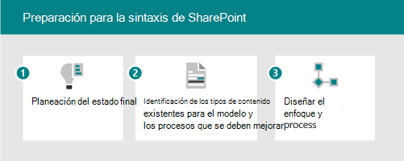

# Adopción de Microsoft SharePoint Syntex: IntroducciónMicrosoft SharePoint Syntex adoption: Get started

Piense en los servicios de contenido inteligente disponibles en SharePoint Syntex como que tienen tres partes:Think of the intelligent content services available in SharePoint Syntex as having three parts:

- **Descripción del contenido:** Cree modelos de IA sin código para clasificar y extraer información del contenido para aplicar automáticamente metadatos para la detección y reutilización de conocimientos.**Content understanding:** Create no-code AI models to classify and extract information from content to automatically apply metadata for knowledge discovery and reuse. Obtenga más información sobre [la comprensión del contenido](document-understanding-overview.md).Learn more about [content understanding](document-understanding-overview.md).
- **Procesamiento de contenido:** Automatice la captura, la ingesta y la categorización del contenido y optimice los procesos centrados en el contenido mediante Power Automate.**Content processing:** Automate capture, ingestion, and categorization of content and streamline content-centric processes using Power Automate. Obtenga más información sobre [el procesamiento de contenido](form-processing-overview.md).Learn more about [content processing](form-processing-overview.md).
- **Cumplimiento de contenido:** Controle y administre el contenido para mejorar la seguridad y el gobierno con la integración en Microsoft Information Protection.**Content compliance:** Control and manage content to improve security and governance with integration to Microsoft Information Protection.

Con los nuevos servicios y capacidades de IA, puedes crear aplicaciones de clasificación y comprensión de contenido directamente en el flujo de administración de contenido mediante SharePoint Syntex.With new AI services and capabilities, you can build content understanding and classification apps directly into the content management flow using SharePoint Syntex. Hay dos formas diferentes de comprender el contenido.There are two different ways of understanding your content. El tipo de modelo que use se basa en el formato de archivo y el caso de uso:The model type you use is based on file format and use case:

| Procesamiento de formulariosForm processing | Comprensión mediante documentosDocument understanding |
|:-------|:-------|
| Creado a partir de la biblioteca de documentos.Created from document library. | Creado en el centro de contenido, parte de SharePoint Syntex.Created in the content center, part of SharePoint Syntex. |
| Modelo creado en el generador de IA.Model created in AI builder. | Modelo creado en interfaz nativa.Model created in native interface. |
| Se usa para formatos de archivo semiestructurados.Used for semi-structured file formats. | Se usa para formatos de archivo no estructurados.Used for unstructured file formats. |
| Clasificador configurable.Settable classifier. | Clasificador entrenable con extractores opcionales.Trainable classifier with optional extractors. |
| Restringido a una sola biblioteca.Restricted to a single library. | Se puede aplicar a múltiples bibliotecas.Can be applied to multiple libraries. |
| Train on PDF, JPG, PNG format, total 50 MB/500 pp.Train on PDF, JPG, PNG format, total 50 MB/500 pp. | Entrenado en 5-10 archivos de PDF, Office o correo electrónico, incluyendo ejemplos negativos.Train on 5-10 PDF, Office, or email files, including negative examples. |

Para obtener una comparación más completa de las capacidades, vea Diferencia entre la comprensión [de documentos y los modelos de procesamiento de formularios.](difference-between-document-understanding-and-form-processing-model.md)For a more complete comparison of the capabilities, see [Difference between document understanding and form processing models](difference-between-document-understanding-and-form-processing-model.md).

## Identificar escenarios empresariales piloto para optimizarIdentify pilot business scenarios to optimize

Para prepararse para usar SharePoint Syntex en su organización, primero debe comprender los escenarios en los que será útil.To prepare for using SharePoint Syntex in your organization, you first need to understand the scenarios in which it will be useful. El "por qué" ayuda a determinar qué modelo se necesita y cómo estructurar la organización en función de dónde se aplicará el modelo.The "why" helps determine what model will be needed, and how to structure your org based on where the model will be applied. Estos son algunos escenarios en los que la comprensión de documentos puede ayudar a su organización:Here are a few scenarios where document understanding can help your organization:

- **Procesamiento de contenido:** Procesar contratos, instrucciones de trabajo y otros documentos con formato.**Content processing:** Process contracts, statements of work, and other form-like documents. Admisión de formularios, entrenar al modelo para comprender y asignar los campos y, a continuación, ejecutar los formularios para recopilar automáticamente los datos.Intake the forms, train the model to understand and map the fields, and then run your forms through to automatically collect the data. Para obtener más información, vea [Información general sobre el procesamiento de formularios.](form-processing-overview.md)For more information, see [Form processing overview](form-processing-overview.md).
- **Análisis de facturas:** Extrae los detalles relevantes de tus facturas y asegúrate de que cumplen con la directiva o se están procesando correctamente.**Invoice analysis:** Pull out the relevant details from your invoices and make sure they're complying with policy or are being processed appropriately.

Piense en las formas en que SharePoint Syntex puede ayudar a su organización:Think about ways that SharePoint Syntex can help your organization:

- Automatizar procesos empresarialesAutomate business processes
- Mejorar la precisión de búsquedaImprove search accuracy
- Administrar el riesgo de cumplimientoManage compliance risk

Cuando piense en qué escenarios empresariales debe tener en cuenta, haga las siguientes preguntas:When thinking about which business scenarios to consider, ask yourself the following questions:

- ¿Resuelve un problema real?Does it solve a real problem?
- ¿Se usará ampliamente o tendrá un impacto general?Will it be widely used or have broad impact?
- ¿Se puede obtener?Is it obtainable?
- ¿Puede medir el éxito?Can you measure success?

Priorizar escenarios en función del impacto y la facilidad de implementación.Prioritize scenarios based on impact and ease of implementation. Haga que el área de enfoque inicial tenga un mayor impacto en escenarios que también se puedan implementar fácilmente.Make your initial focus area higher impact scenarios that can also be easily implemented. Des priorizar escenarios de menor impacto que son difíciles de implementar.De-prioritize lower impact scenarios that are hard to implement.

Use los [escenarios de ejemplo y los casos de uso](adoption-scenarios.md) para preguntar ideas sobre cómo puede usar SharePoint Syntex en su organización.Use the [example scenarios and use cases](adoption-scenarios.md) to prompt ideas about how you can use SharePoint Syntex in your organization.

## Identificar roles & responsabilidadesIdentify roles & responsibilities

Determine who in your organization will build and manage the models?Determine who in your organization will build and manage the models? Los siguientes roles pueden estar implicados:The following roles might be involved:

| SharePoint/Administrador de conocimientosSharePoint/Knowledge admin | Administrador de Power PlatformPower Platform admin | Administrador de conocimientosKnowledge manager | Propietario del modeloModel owner |
|:-------|:-------|:-------|:-------|
| Rol AADAAD role| Rol AADAAD role | Rol AADAAD role | Expertos:Champions |
| Configurar el procesamiento del formularioConfigure form processing | Configurar el entorno de servicio de datos común para el procesamiento de formulariosConfigure Common data service environment for form processing | Recopilar casos de usoGather use cases | Recopilar casos de uso empresarialGather business use cases |
| Administrar centros de contenido y permisosManage content centers and permissions| Comprar y asignar créditos AIBPurchase and allocate AIB credits | Establecer procedimientos recomendados y revisar análisis de modelosEstablish best practices and review model analytics | Crear y aplicar modelosCreate and apply models |

El administrador de conocimientos, el propietario del proceso de negocio y el propietario del modelo de contenido crean modelos de ejemplo y la adopción de campeones en la organización.Knowledge manager, Business Process Owner and Content model owner create sample models and champion adoption in the organization.
Otros que pueden estar implicados: administrador de cumplimiento, administradores de taxonomía.Others who may be involved: Compliance admin, Taxonomy managers.

¿Dónde crearán y aplicarán los modelos?Where will they build and apply the models? ¿Hay procesos o repositorios existentes que podrían mejorarse?Are there existing processes or repositories that could be enhanced?

- Procesamiento de formularios: decida qué sitios recibirán acción de procesamiento de formularios.Form processing: Decide which sites will get Form processing action.
- Descripción del documento: puede crear varios centros de contenido para distintas áreas de negocio.Document understanding: You can create multiple content centers for different business areas.

## Posicionamiento estratégicoStrategic positioning

Trabaje con las partes interesadas para asegurarse de que están alineados en la estrategia para usar SharePoint Syntex.Work with stakeholders to make sure they are aligned on the strategy for using SharePoint Syntex. Investigue y proporcione los siguientes recursos para ayudarle con este posicionamiento:Research and provide the following resources to help with this positioning:

- Resultados empresariales:Business outcomes:
  - Posibles resultados fiscalesPotential fiscal outcomes
  - Posibles resultados de agilidadPotential agility outcomes
  - Plantilla de resultados empresarialesBusiness outcome template
- Stakeholders/Exec sponsor buy-in/alignmentStakeholders/Exec sponsor buy-in/alignment
  - Barajas de casos profesionalesBusiness case decks
  - Modelos financierosFinancial models
  - Preparación de la empresa: culturaCompany readiness - culture

## Identificación de las partes interesadasIdentify stakeholders

Identifique las partes interesadas del proyecto.Identify the stakeholders for your project.

|RolRole |ResponsabilidadesResponsibilities |DepartamentoDepartment |
|:-------|:-------|:--------|
| Patrocinadores ejecutivosExecutive sponsor(s)   | Comunicar a la empresa valores y visión de alto nivelCommunicate high-level vision and values to the company   |  Liderazgo ejecutivoExecutive leadership   |
| Project clientes potencialesProject lead(s) | Supervisar todo el proceso de ejecución e implementación del lanzamientoOversee the entire launch execution and rollout process | Administración de proyectosProject management |
| Administradores de informaciónKnowledge administrators| Crear y administrar los centros de contenidoCreate and manage the content centers | TI u otro departamentoIT or other department|
| Administradores de contenido y propietarios de modelosContent managers and model owners| Recopilar casos de uso y crear y aplicar modelosGather use cases and create and apply models | Cualquier departamentoAny department|
| Expertos:Champions | Ayudar a promocionar y administrar el tratamiento de objeciónHelp evangelize and manage objection handling | Cualquier departamento (personal)Any department (staff) |
| Administrador de inquilinosTenant administrator | Configurar la configuración de nivel de inquilinoConfigure tenant-level settings | Departamento de TIIT department|
| Administrador de Power PlatformPower Platform administrator| Configurar el entorno de servicios de datos comunesConfigure common data services environment | Departamento de TIIT department|

> [!Note]
> Aunque se recomienda que cada uno de estos roles se cumpla a lo largo de la implementación, es posible que no necesite todos ellos para empezar con la solución identificada.Though we recommend having each of these roles fulfilled throughout your rollout, you may find that you don't require them all to get started with your identified solution.

## Lista de comprobación de preparaciónReadiness checklist

Para prepararse para implementar SharePoint Syntex, debe:To get ready for implementing SharePoint Syntex, you need to:

1. Planear el estado finalPlan the end state
    - Los modelos de comprensión de documentos son los medios, no el final.Document understanding models are the means, not the end.
    - Planee aprovechar el valor de los metadatos extraídos con:Plan for harnessing the value of extracted metadata with:
      - BúsquedaSearch
      - Filtrado y formato de vistaFiltering and view formatting
      - CumplimientoCompliance
      - AutomatizaciónAutomation
2. IdentificaciónIdentify
    - Comprender la arquitectura de la información existente y el uso de características de administración de contenido.Understand existing information architecture and content management feature use.
    - ¿Los tipos de contenido existentes son buenos candidatos para los modelos?Are any existing content types good candidates for models?
    - ¿Qué procesos existentes se mejorarían con los metadatos?What existing processes would be improved by metadata?
3. DiseñoDesign
    - Diseñar el enfoque de la arquitectura de la información, los metadatos administrados y los tipos de contenidoDesign your approach to information architecture, managed metadata and content types
    - Diseñe el proceso de definición, creación, administración.Design the process for definition, creation, management.

## Interactuar con su organizaciónEngage your organization

1. Identificar a los poseedores de participación, confirmar escenarios y desarrollar un plan de proyecto.Identify stake holders, confirm scenarios, and develop project plan.
1. Configure la configuración y aplique licencias.Configure settings and apply licenses.
1. Comenzar a concienciar y entrenar: reclutar a los campeones.Begin awareness and training – Recruit Champions.
1. Roll out in stages.Roll out in stages.  
1. Recopilar comentarios e iterar.Gather feedback and iterate.
1. A medida que aumenta el uso, planee los créditos de AI Builder según sea necesario.As usage grows plan for any AI Builder credits as needed.

## Consulte tambiénSee also

[Escenarios y casos de uso en SharePoint SyntexScenarios and use cases in SharePoint Syntex](adoption-scenarios.md)