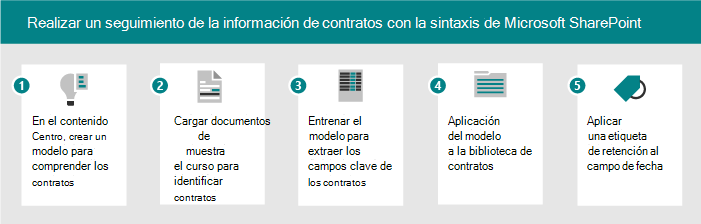

# Escenarios y casos de uso para Microsoft SharePoint Syntex

Use los siguientes escenarios de ejemplo para preguntar ideas sobre cómo puede usar SharePoint Syntex en su organización.

- [Escenario: realizar un seguimiento de los datos de las facturas con el procesamiento de formularios](adoption-scenarios.md#scenario-track-data-from-invoices-with-form-processing)
- [Escenario: realizar un seguimiento de la información de los contratos con la comprensión de documentos](adoption-scenarios.md#scenario-track-information-from-contracts-with-document-understanding)
- [Escenario: evitar riesgos con procesos de administración de registros, gobierno de documentos y cumplimiento basados en SharePoint Syntex](adoption-scenarios.md#scenario-avoid-risk-with-records-management-document-governance-and-compliance-processes-based-on-sharepoint-syntex)
- [Escenario: capturar información de documentos inaccesibles anteriormente](adoption-scenarios.md#scenario-capture-information-from-previously-inaccessible-documents)
- [Escenario: mejorar el procesamiento de datos para proporcionar información y análisis](adoption-scenarios.md#scenario-improve-data-processing-to-provide-insights-and-analytics)
- [Escenario: Automatizar el procesamiento de pedidos](adoption-scenarios.md#scenario-automate-order-processing)
- [Escenario: Simplificar el proceso de renovación de visas](adoption-scenarios.md#scenario-simplify-visa-renewal-process)

## Escenario: realizar un seguimiento de los datos de las facturas con el procesamiento de formularios

Por ejemplo, puede configurar un proceso mediante las SharePoint Syntex y Power Automate para realizar un seguimiento y supervisar las facturas.

1. Configurar una biblioteca para almacenar los documentos de factura.
1. Entrena al modelo para que reconozca los campos de los documentos.
1. Extraiga los campos que desea realizar un seguimiento en una lista.
1. Configure un flujo para notificarle eventos específicos, como:
    - Se agrega una nueva factura.
    - Una factura ha pasado de su fecha de vencimiento.
    - Una factura es para un importe que es mayor que el importe de aprobación automática.

Al automatizar este escenario, puede:

- Ahorre tiempo y dinero mediante la extracción automática de datos de las facturas en lugar de hacerlo manualmente.
- Reduzca los posibles errores y garantice un mejor cumplimiento mediante el uso de flujos de trabajo para comprobar facturas y notificarle cualquier problema.

## Escenario: realizar un seguimiento de la información de los contratos con la comprensión de documentos

Como otro ejemplo, puede configurar un proceso para identificar contratos que su empresa tiene con otras empresas o personas. Configure un modelo para extraer información clave de esos contratos, como el nombre del cliente, las tarifas, las fechas u otra información importante, y agregue la información a la biblioteca como campos que puede ver rápidamente. Aplique una etiqueta de retención en la biblioteca de documentos para asegurarse de que los contratos no se pueden eliminar antes de un período de tiempo específico para el cumplimiento adecuado de las normativas empresariales.

1. Comience en el centro de contenido y cree un nuevo modelo de comprensión de documentos para contratos.
1. Upload documentos de ejemplo para ejemplos positivos y negativos y, a continuación, ejecute el aprendizaje para identificar documentos de contrato y revisar los resultados.
1. Entrena al extractor para identificar los campos de los contratos, como el nombre del cliente, la tarifa y la fecha, y luego prueba el extractor.
1. Cuando se complete el modelo, aplique el modelo a una biblioteca donde pueda cargar contratos.
1. Aplique una etiqueta de retención al campo fecha, de modo que los contratos se conserven en la biblioteca durante el período de tiempo necesario.

Al automatizar este escenario, puede:

- Ahorre tiempo y dinero mediante la extracción automática de datos de los contratos en lugar de hacerlo manualmente.
- Asegúrese de un mejor cumplimiento mediante el uso de etiquetas de retención para garantizar que los contratos se conservan correctamente.

## Escenario: evitar riesgos con procesos de administración de registros, gobierno de documentos y cumplimiento basados en SharePoint Syntex

Reducir los riesgos es un objetivo común para la mayoría de las empresas. Es posible que necesite:

- Una mejor forma de proporcionar/aplicar el gobierno de la información en todo el espacio empresarial.
- Para mejorar el sistema de clasificación de documentos, correos electrónicos y otras formas de comunicación consideradas "registros" para proyectos.
- Auditar recibos, contratos, entre otros, para garantizar el cumplimiento de las directivas de la empresa.
- Para asegurarse de que los proyectos tienen toda la documentación necesaria para el cumplimiento.

Configure algunos procesos para el cumplimiento de SharePoint Syntex para capturar y clasificar adecuadamente, auditar y marcar documentos y formularios que necesitan un mejor gobierno. Puede confiar en SharePoint Syntex para clasificar automáticamente el contenido en lugar de depender de los usuarios finales para etiquetar manualmente, o el equipo de cumplimiento para aplicar manualmente reglas de gobierno y archivado. Además, puede habilitar una experiencia de búsqueda simplificada, administrar volúmenes de datos, aplicar directivas de administración y retención de registros, garantizar el cumplimiento y procedimientos recomendados de archivado y depuración.

Al automatizar este escenario, puede sentirse seguro de que:

- Se mantiene el cumplimiento y se reduce el riesgo.
- La taxonomía y la administración de registros se aplican de forma coherente y precisa.
- Los volúmenes de contenido se controlan.
- Los empleados pueden descubrir fácilmente la información correcta en el contexto correcto.

## Escenario: capturar información de documentos inaccesibles anteriormente

La mayoría de las organizaciones tienen grandes repositorios de documentos legales, directivas, contratos, documentos de recursos humanos y directrices de gobierno. Extrae estos almacenes de datos para extraer información valiosa como: proyectos, sectores, temas, personas, áreas geográficas, entre otros.

Por ejemplo, un director de recursos humanos debe tener acceso rápidamente a todos los documentos de recursos humanos, incluidos los currículums, las directivas de RECURSOS humanos y otros formularios. Además, desean identificar rápidamente la información necesaria de los currículums y otros documentos relacionados con RRHH sin realizar un control manual de los documentos. Están buscando una solución que les permita encontrar rápidamente la información que necesitan sin tener que buscar manualmente miles de currículums, directivas de RRHH y otra documentación que se puedan propagar por varios sitios.

Al automatizar este escenario, puede:

- Desbloquear conocimientos del contenido digital.
- Clasificar directivas de recursos humanos, currículos, documentos de ventas, planos técnicos, planes de cuenta y extraer información.
- Busque rápidamente la información o el documento correctos que está buscando.
- Obtenga acceso instantáneo a la información más reciente.
- Reducir los tiempos de búsqueda.

## Escenario: mejorar el procesamiento de datos para proporcionar información y análisis

Por ejemplo, una compañía farmacéutica podría usar SharePoint Syntex para extraer información de documentos de la FDA para responder a las preguntas que tienen sus líderes. Tener las respuestas más fácilmente accesibles puede reducir el tiempo necesario para producir estas respuestas y aumentar la disponibilidad de datos para generar respuestas más precisas a las preguntas de liderazgo.

Por ejemplo, un jefe de proyecto debe proporcionar rápidamente respuestas a preguntas relacionadas con el producto de mi equipo de liderazgo. Deben encontrar información y métricas relacionadas con las consultas en un panel consolidado. Buscan una solución que extraiga la información que necesitan de etiquetas de productos, panfletos de productos y otros materiales y genere un informe consolidado que puedan usar al informar a su equipo de liderazgo.

Al automatizar este escenario, puede:

- Reduzca el tiempo para producir respuestas.
- Aumentar la disponibilidad de los datos.
- Proporcionar respuestas más precisas.

## Escenario: Automatizar el procesamiento de pedidos

Con SharePoint Syntex, puede reducir el tiempo de procesamiento manual de los pedidos de clientes. Por ejemplo, puede cargar pedidos de fax, correo electrónico o papel en SharePoint mediante el procesamiento OCR y, a continuación, extraer los metadatos de esos pedidos para poder cumplirlos mediante procesos automatizados.

Por ejemplo, un administrador de cadena de suministro quiere reducir los errores causados por la entrada de datos manual. Quieren evitar la revisión manual y la entrada de datos de los pedidos de clientes entrantes (papel, fax o correo electrónico) para reducir los errores que se producen en sus sistemas empresariales. Quieren una solución que aplique la inteligencia artificial y las técnicas de aprendizaje automático para validar la información de los pedidos entrantes, extraer datos básicos y insertarlo automáticamente en su sistema ERP, para el cumplimiento y la conciliación de pedidos.

Al automatizar este escenario, puede asegurarse de que:

- Aumenta la precisión del pedido y el envío.
- Se reducen las tarifas o penalizaciones asociadas a errores de pedido o envío.
- Los retrasos en la facturación o los pagos disminuyen.
- Se reducen los costos de personal.

## Escenario: Simplificar el proceso de renovación de visas

SharePoint Syntex puede ayudarle a automatizar avisos y renovaciones de información clave del contrato. Por ejemplo, un director de recursos humanos debe asegurarse de que los visados de los empleados estén actualizados o renovados a tiempo. Quieren ofrecer a los usuarios un proceso sencillo e intuitivo para actualizar sus Visas. Necesitan una solución que extraiga las fechas de renovación de los contratos y envíe automáticamente avisos a los empleados cuando se acercan las fechas de renovación.

Al automatizar este escenario, puede asegurarse de que:

- Se reducen los niveles de incumplimiento.
- Se reduce el número de avisos manuales.
- Se reduce el número de multas por incumplimiento.

## Consulte también

[Adopción de Microsoft SharePoint Syntex: Introducción](adoption-getstarted.md)