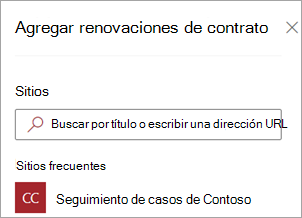
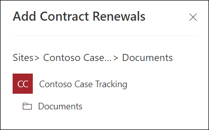
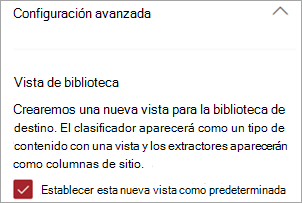
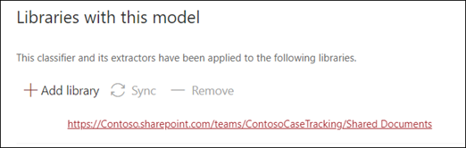
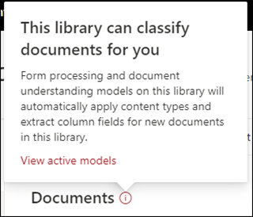

# Aplicar un documento que comprenda el modelo en Microsoft SharePoint Syntex

El contenido de este artículo es para la versión preliminar privada de Project Cortex. [Obtenga más información sobre Project Cortex](https://aka.ms/projectcortex).

 

> [!VIDEO https://www.microsoft.com/videoplayer/embed/RE4CSoL]

 

Después de publicar el documento con información sobre el modelo, puede aplicarlo a una biblioteca de documentos de SharePoint en su inquilino de Microsoft 365.

> [!NOTE]
> Solo puede aplicar el modelo a las bibliotecas de documentos a las que tiene acceso.

## Aplique el modelo a una biblioteca de documentos.

Para aplicar el modelo a una biblioteca de documentos de SharePoint:

1. En la Página principal del modelo, en el mosaico **aplicar modelo a bibliotecas** , seleccione **publicar modelo**. O bien, puede seleccionar  **+ Agregar biblioteca** en la sección **bibliotecas con este modelo** .  

     

2. Seleccione el sitio de SharePoint que contiene la biblioteca de documentos a la que desea aplicar el modelo. Si el sitio no aparece en la lista, use el cuadro de búsqueda para buscarlo. 

     

    > [!NOTE]
    > Debe tener permisos de *Administración de listas* o derechos de *edición* en la biblioteca de documentos a la que va a aplicar el modelo. 

3. Después de seleccionar el sitio, seleccione la biblioteca de documentos a la que desea aplicar el modelo. En el ejemplo, seleccione la biblioteca de documentos *documentos* en el sitio de *seguimiento de casos de Contoso* . 

     

4. Como el modelo está asociado a un tipo de contenido, cuando se aplica a la biblioteca, crea una vista para el tipo de contenido con las etiquetas que extrajo muestra como columnas. Esta vista es la vista predeterminada de la biblioteca de forma predeterminada, pero, opcionalmente, puede optar por no tenerla como la vista predeterminada seleccionando la **Configuración avanzada** y anular la selección de **establecer esta nueva vista como predeterminada**. 

     

5. Seleccione **Agregar** para aplicar el modelo a la biblioteca. 
6. En la Página principal del modelo, en la sección **bibliotecas con este modelo** , debería ver la dirección URL del sitio de SharePoint que se muestra. 

     

7. Vaya a la biblioteca de documentos y asegúrese de que se encuentra en la vista de la biblioteca de documentos del modelo. Tenga en cuenta que si selecciona el botón información junto al nombre de la biblioteca de documentos, aparecerá un mensaje en el que se indica que el modelo se ha aplicado a la biblioteca de documentos.

      

Después de aplicar el modelo a la biblioteca de documentos, puede empezar a cargar los documentos en el sitio y ver los resultados.

El modelo identifica los archivos con tipo de contenido asociado al modelo y los enumera en la vista. Si el modelo tiene algún extractor, la vista muestra las columnas de los datos que se extraen de cada archivo.

### Aplicar el modelo a los archivos que ya se encuentran en la biblioteca de documentos

Mientras que un modelo aplicado procesa todos los archivos cargados en la biblioteca de documentos después de su aplicación, también puede hacer lo siguiente para ejecutar el modelo en archivos que ya existen en la biblioteca de documentos antes del modelo que se aplica:

1. En la biblioteca de documentos, seleccione los archivos que desea que procese el modelo.
2. Después de seleccionar los archivos, la **clasificación y la extracción** aparecerán en la cinta de la biblioteca de documentos. Seleccione **clasificar y extraer**.
3. Los archivos seleccionados se agregarán a la cola para ser procesados.

        

## Consulte también
[Crear un clasificador](create-a-classifier.md) 
[Crear un extractor](create-an-extractor.md) 
[Información general sobre el documento](document-understanding-overview.md) 
[Crear un modelo de procesamiento de formularios](create-a-form-processing-model.md)  
