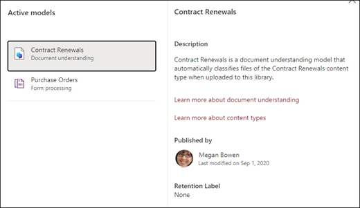

# Aplicar un modelo de comprensión mediante documentos en la sintaxis de Microsoft SharePoint

 

> [!VIDEO https://www.microsoft.com/videoplayer/embed/RE4CSoL]

 

Después de publicar el modelo de comprensión mediante documentos, puede aplicarlo a una o más bibliotecas de documentos de SharePoint en su espacio empresarial de Microsoft 365.

> [!NOTE]
> Solo puede aplicar el modelo a las bibliotecas de documentos a las que tenga acceso.

## Aplique el modelo a una biblioteca de documentos.

Para aplicar el modelo a una biblioteca de documentos de SharePoint:

1. En la página principal del modelo, en el cuadro **Aplicar modelo a las bibliotecas**, seleccione **Publicar modelo**. También puede seleccionar **+Agregar biblioteca** en la sección **Bibliotecas con este modelo**.  

     

2. Después, puede seleccionar el sitio de SharePoint que contiene la biblioteca de documentos a la que desea aplicar el modelo. Si el sitio no aparece en la lista, use el cuadro de búsqueda para encontrarlo. 

     

    > [!NOTE]
    > Debe tener permisos de *Administración de lista* o de *Edición* en la biblioteca de documentos a la que va a aplicar el modelo. 

3. Después de seleccionar el sitio, seleccione la biblioteca de documentos a la que quiere aplicar el modelo. En el ejemplo, seleccione la biblioteca de documentos *Documentos* en el sitio de *Seguimiento de casos de Contoso*. 

     

4. Como el modelo está asociado a un tipo de contenido, cuando lo aplique a la biblioteca, se agregará el tipo de contenido y su vista con las etiquetas que extrajo mostrándolo como columnas. De forma predeterminada, esta vista es la vista predeterminada de la biblioteca, pero si lo prefiere, puede elegir que no sea la vista predeterminada seleccionando **Configuración avanzada** y anulando la selección **Establecer esta vista nueva como predeterminada**. 

     

5. Seleccione **Agregar** para aplicar el modelo a la biblioteca. 
6. En la página principal del modelo, en la sección **Bibliotecas con este modelo**, debe ver la dirección URL del sitio de SharePoint que se muestra. 

     

7. Vaya a la biblioteca de documentos y asegúrese de estar en la vista de biblioteca de documentos del modelo. Tenga en cuenta que, si selecciona el botón de información situado junto al nombre de la biblioteca de documentos, se mostrará un mensaje que indica que la biblioteca de documentos tiene aplicado un modelo.

      

    Puede seleccionar la opción **Ver modelos activos** para consultar detalles sobre los modelos que se aplican a la biblioteca de documentos.

8. Puede seleccionar la opción **Modelos activos** para ver los modelos que se aplican a la biblioteca de documentos. Seleccione un modelo para ver más detalles sobre él, como una descripción, quién lo publicó y si el modelo aplica una etiqueta de retención a los archivos que clasifica.

      

Después de aplicar el modelo a la biblioteca de documentos, puede iniciar la carga de documentos en el sitio y ver los resultados.

El modelo identifica los archivos con el tipo de contenido asociado al modelo y los enumera en la vista. Si su modelo tiene algún extractor, la vista muestra columnas para los datos que se extraen de cada archivo.

### Aplicar el modelo a los archivos que ya se encuentren en la biblioteca de documentos

Si bien un modelo aplicado procesa todos los archivos cargados en la biblioteca de documentos después de su aplicación, también puede hacer lo siguiente para ejecutar el modelo en archivos que ya existen en la biblioteca de documentos antes de que se aplique el modelo:

1. En la biblioteca de documentos, seleccione los archivos que quiere que sean procesados por su modelo.
2. Después de seleccionar los archivos, en la cinta de la biblioteca de documentos se mostrará **Clasificar y extraer**. Seleccione **Clasificar y extraer**.
3. Los archivos que seleccionó se agregarán a la cola para su procesamiento.

        

> [!NOTE]
> Puede copiar archivos individuales a una biblioteca y aplicarlos a un modelo, pero no carpetas.

### Campo Fecha de clasificación

Cuando se aplica un modelo de procesamiento de formularios o información de documentos de SharePoint Syntex a una biblioteca de documentos, en el esquema de la biblioteca se incluye un campo <b>Fecha de clasificación</b>. De forma predeterminada, este campo está vacío, pero cuando un modelo procesa y clasifica documentos, este campo se actualiza con una marca de fecha y hora de finalización. 

     

El desencadenador [<b>Cuando un modelo de comprensión de contenidos clasifica un archivo</b>](/connectors/sharepointonline/#when-a-file-is-classified-by-a-content-understanding-model) usa el campo Fecha de clasificación para ejecutar un flujo de Power Automate después de que un modelo de comprensión de contenidos de Syntex haya terminado de procesar un archivo y haya actualizado el campo "Fecha de clasificación".

    

El desencadenador <b>Cuando un modelo de comprensión de contenidos clasifica un archivo</b> se puede usar después para iniciar otro flujo de trabajo con la información extraída del archivo.

## Consulte también
[Crear un clasificador](create-a-classifier.md)

[Crear un extractor](create-an-extractor.md)

[Información general de la comprensión mediante documentos ](document-understanding-overview.md)
